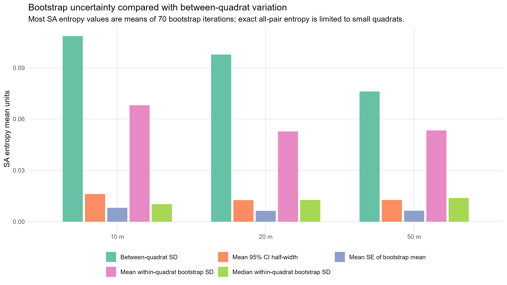
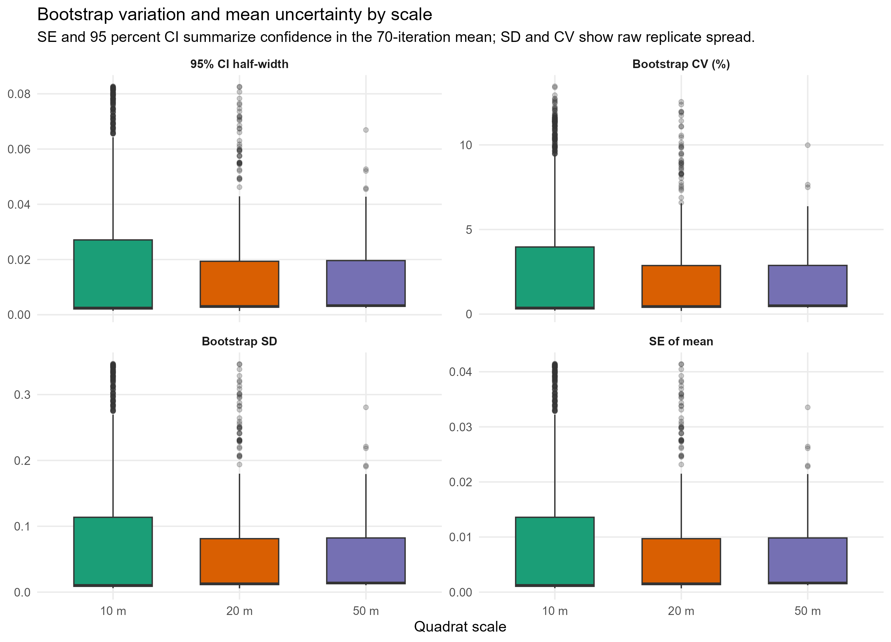
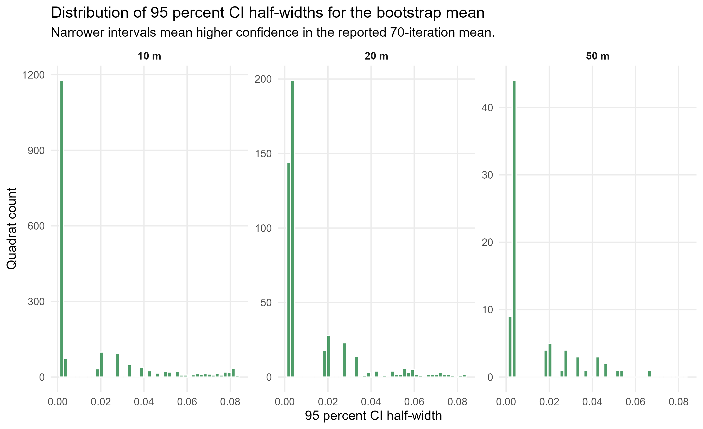
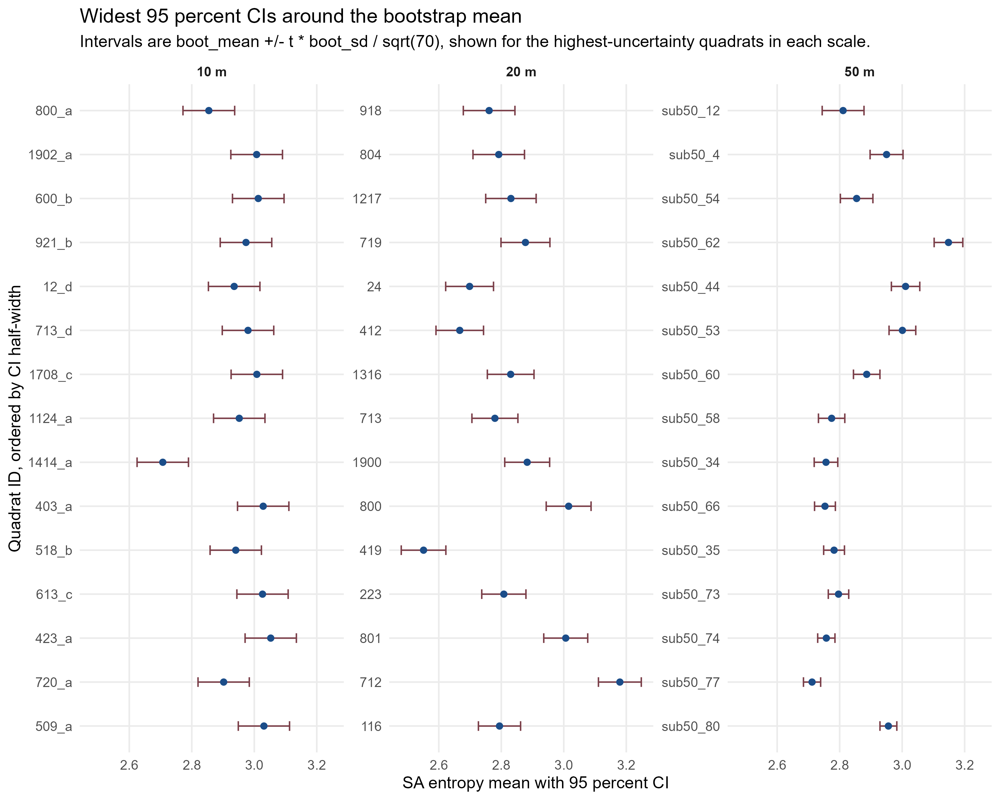
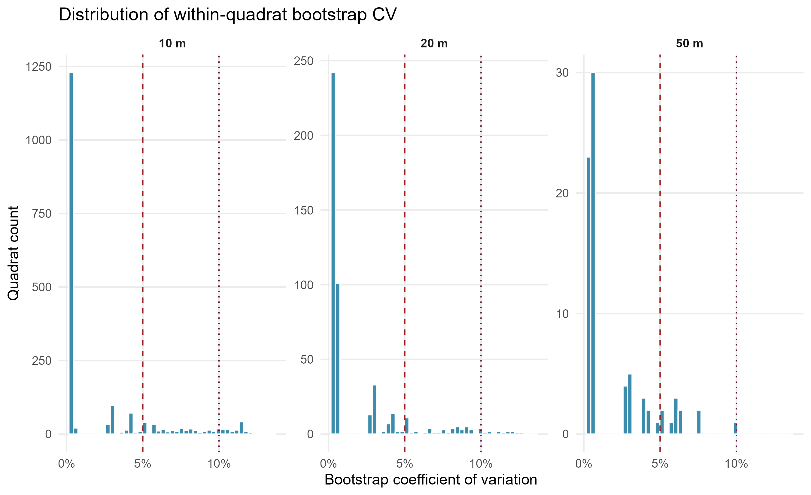
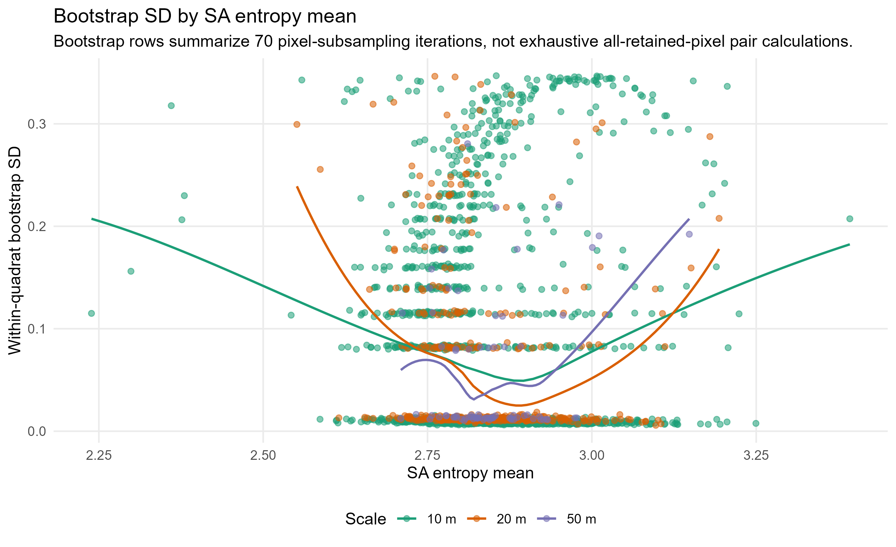
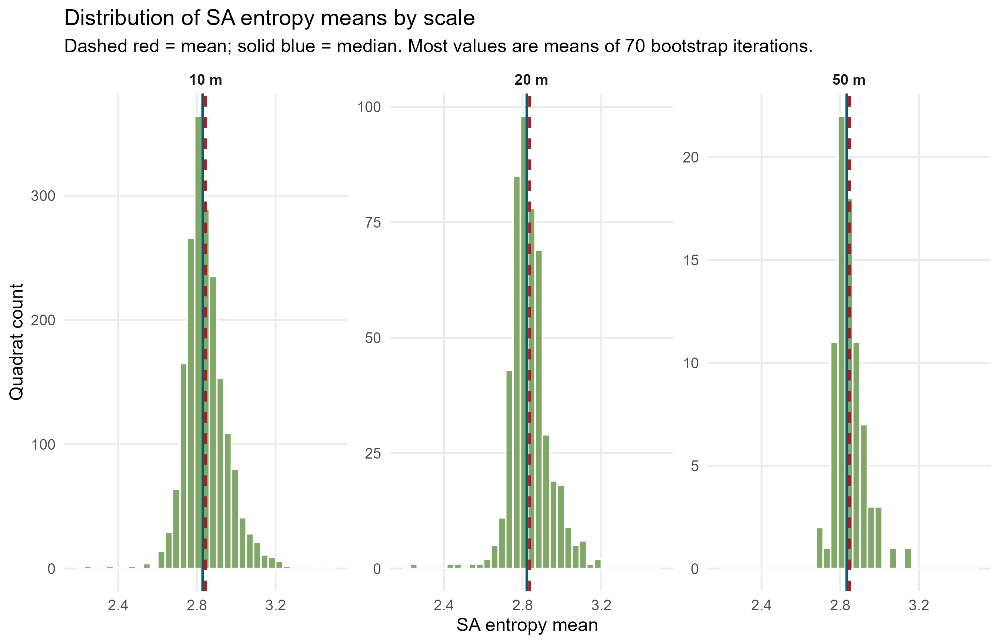
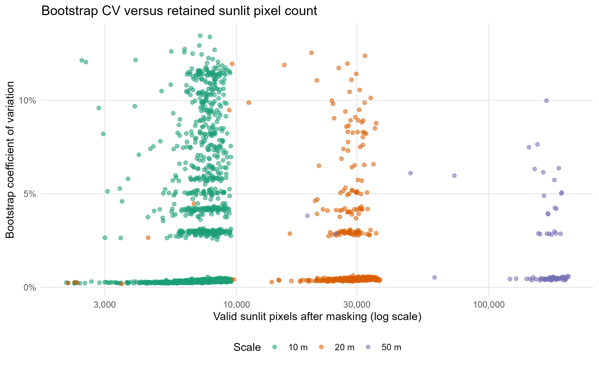
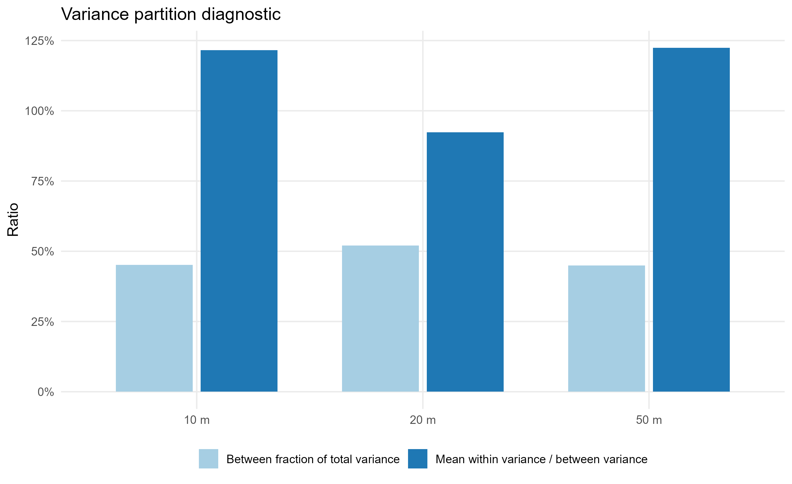
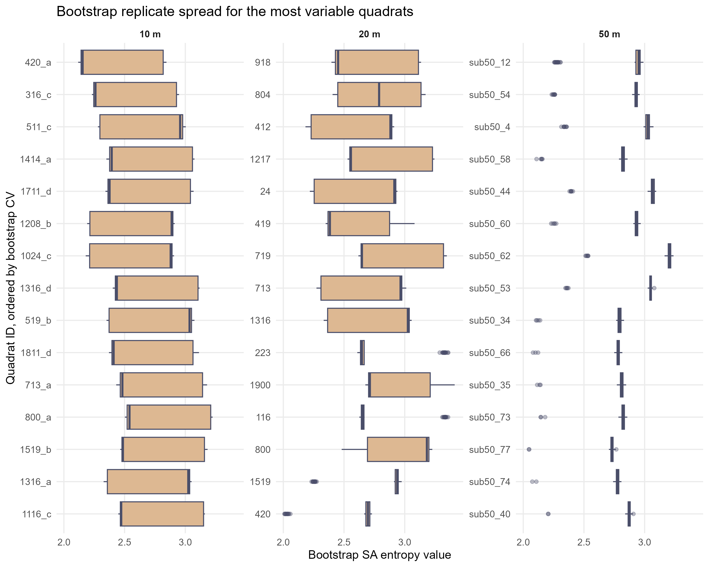

# Bootstrap Variation Analysis for Spectral Heterogeneity

Date: 2026-06-18

Updated: 2026-07-03

## Purpose

This report evaluates whether variation among bootstrap iterations within quadrats is small enough relative to variation among quadrats to use the SA entropy mean values in downstream biodiversity analyses.

The key distinction is that `boot_sd` measures how much spectral entropy changes across repeated pixel subsamples within the same quadrat, while `boot_sd / sqrt(70)` is the standard error of the reported `boot_mean`.

## Inputs

- `Quad_Values/10m_SA_entropy_smooth_masked_5nm_summary.csv` and matching bootstrap files
- `Quad_Values/20m_SA_entropy_smooth_masked_5nm_summary.csv` and matching bootstrap files
- `Quad_Values/50m_SA_entropy_smooth_masked_5nm_summary.csv` and matching bootstrap files

All inputs were generated from current smoothed 5 nm spectra using the shadow mask threshold of `0.0305476` at `563 nm`.

For `method = "bootstrap_mean"` rows, the reported SA value is the mean of 70 bootstrap iterations. Each iteration samples up to 5,000 retained pixels without replacement; when that sample still has too many possible pairs, the entropy is calculated from 10,000 sampled spectral-angle pairs. Rows with `method = "exact_all_pixels"` are the small subset below 2,000,000 possible retained-pixel pairs, roughly no more than 2,000 retained pixels, and use all retained pixel pairs.

## Main Conclusion

The bootstrap means are usable with quality-control flags, but raw within-quadrat bootstrap variation is not uniformly small enough to ignore. A subset of quadrats, especially at 10 m and 20 m, should be flagged or included in sensitivity checks before downstream modeling.

Decision: use the reported `spectral_entropy` / `boot_mean` values as the main heterogeneity means, but do not treat bootstrap rows as exhaustive all-pair entropy. Carry `boot_sd`, `boot_cv`, `boot_se`, and the 95 percent CI fields forward as quality-control fields, and run sensitivity checks that flag or exclude high-CV or wide-CI quadrats.

Across all bootstrap-mean quadrats, the 95th percentile bootstrap CV was 10.4%, and the maximum bootstrap CV was 13.5% in quadrat `420_a` at 10 m.

The most important validation metric is the ratio of mean within-quadrat bootstrap variance to between-quadrat variance. Lower values mean the bootstrap noise is small relative to the spatial signal among quadrats.

The median 95 percent CI half-width around the bootstrap mean was 10 m: 0.002 (0.1% of the mean); 20 m: 0.003 (0.1% of the mean); 50 m: 0.003 (0.1% of the mean).

Using a 5% bootstrap-CV flag, 372 of 1866 bootstrap-mean 10 m quadrats, 60 of 477 20 m quadrats, and 11 of 79 50 m quadrats would be flagged.

## Scale Summary

| Scale| Valid SA values| Bootstrap quads| Exact quads| Scale mean entropy| Median entropy| Skewness| Between SD| Median within SD| Mean within SD| Mean boot mean SE| Median 95% CI half-width| P90 95% CI half-width| Within/Between variance| Between fraction| Median CV| P90 CV|  Class|
|-----:|---------------:|---------------:|-----------:|------------------:|--------------:|--------:|----------:|----------------:|--------------:|-----------------:|------------------------:|---------------------:|-----------------------:|----------------:|---------:|------:|------:|
|  10 m|            1903|            1866|          37|              2.843|          2.829|    0.275|      0.108|            0.010|          0.068|             0.008|                    0.002|                 0.056|                  121.6%|            45.1%|      0.4%|   8.5%| Review|
|  20 m|             485|             477|           8|              2.835|          2.821|   -0.002|      0.098|            0.013|          0.053|             0.006|                    0.003|                 0.038|                   92.3%|            52.0%|      0.5%|   5.7%| Review|
|  50 m|              80|              79|           1|              2.847|          2.833|    1.187|      0.076|            0.014|          0.053|             0.006|                    0.003|                 0.039|                  122.4%|            45.0%|      0.5%|   5.8%| Review|

## Figures

### Within Versus Between SD

### Bootstrap Variation And Mean Uncertainty By Scale

This figure separates raw replicate spread (`boot_sd`, `boot_cv`) from uncertainty in the 70-iteration mean (`boot_se`, 95 percent CI half-width).

### CI Width Distribution

### Widest CI Quadrats

### Bootstrap CV Distribution

Dashed and dotted reference lines mark 5% and 10% bootstrap CV.

### Bootstrap SD Versus SA Entropy Mean

### SA Entropy Mean Histograms

These histograms show the distribution and skewness of the final SA entropy means at each scale. The dashed red line is the scale mean and the solid blue line is the scale median. Most quadrat values are means of 70 bootstrap iterations.

### Pixel Count Versus Bootstrap CV

### Variance Partition Diagnostic

### Most Variable Quadrat Replicate Distributions

## Most Variable Quadrats

| Scale|  Quadrat| Pixels| Entropy mean| Boot SD| 95% CI low| 95% CI high| Boot CV| Outlier reps|
|-----:|--------:|------:|------------:|-------:|----------:|-----------:|-------:|------------:|
|  10 m|    420_a|   7179|        2.360|   0.318|      2.284|       2.436|   13.5%|            0|
|  10 m|    316_c|   7837|        2.559|   0.343|      2.477|       2.641|   13.4%|            0|
|  10 m|    511_c|   7120|        2.647|   0.343|      2.566|       2.729|   12.9%|            0|
|  10 m|   1414_a|   6227|        2.707|   0.345|      2.625|       2.789|   12.7%|            0|
|  10 m|   1711_d|   8185|        2.628|   0.334|      2.548|       2.708|   12.7%|            0|
|  10 m|   1208_b|   5509|        2.641|   0.333|      2.561|       2.720|   12.6%|            0|
|  10 m|   1024_c|   6205|        2.635|   0.331|      2.556|       2.714|   12.6%|            0|
|  10 m|   1316_d|   6691|        2.735|   0.342|      2.653|       2.816|   12.5%|            0|
|  20 m|      918|  19833|        2.761|   0.346|      2.679|       2.844|   12.5%|            0|
|  20 m|      804|  32325|        2.792|   0.346|      2.709|       2.874|   12.4%|            0|
|  20 m|      412|  27508|        2.667|   0.319|      2.591|       2.743|   12.0%|            0|
|  20 m|     1217|   9606|        2.831|   0.338|      2.750|       2.912|   12.0%|            0|
|  20 m|       24|  15470|        2.699|   0.321|      2.622|       2.775|   11.9%|            0|
|  20 m|      419|  25439|        2.551|   0.299|      2.480|       2.623|   11.7%|            0|
|  20 m|      719|  29838|        2.877|   0.328|      2.799|       2.956|   11.4%|            0|
|  20 m|      713|  28554|        2.780|   0.309|      2.706|       2.853|   11.1%|            0|
|  50 m| sub50_12| 169495|        2.811|   0.281|      2.744|       2.878|   10.0%|           15|
|  50 m| sub50_54| 156070|        2.854|   0.218|      2.802|       2.906|    7.6%|            8|
|  50 m|  sub50_4| 144375|        2.950|   0.221|      2.897|       3.003|    7.5%|            8|
|  50 m| sub50_58| 189724|        2.774|   0.177|      2.732|       2.816|    6.4%|            5|
|  50 m| sub50_44| 152090|        3.011|   0.191|      2.965|       3.056|    6.3%|            6|
|  50 m| sub50_60| 164492|        2.887|   0.178|      2.844|       2.929|    6.2%|            5|
|  50 m| sub50_62|  48957|        3.148|   0.192|      3.102|       3.194|    6.1%|            6|
|  50 m| sub50_53|  73073|        3.001|   0.179|      2.958|       3.044|    6.0%|            6|

## Widest Bootstrap-Mean Confidence Intervals

| Scale|  Quadrat| Pixels| Entropy mean| 95% CI low| 95% CI high| 95% CI half-width| Half-width % of mean|
|-----:|--------:|------:|------------:|----------:|-----------:|-----------------:|--------------------:|
|  10 m|    800_a|   3976|        2.855|      2.772|       2.937|             0.083|                 2.9%|
|  10 m|   1902_a|   7162|        3.008|      2.925|       3.090|             0.083|                 2.7%|
|  10 m|    600_b|   6421|        3.013|      2.930|       3.095|             0.083|                 2.7%|
|  10 m|    921_b|   7563|        2.974|      2.891|       3.056|             0.082|                 2.8%|
|  10 m|     12_d|   7543|        2.936|      2.853|       3.018|             0.082|                 2.8%|
|  10 m|    713_d|   7118|        2.980|      2.898|       3.062|             0.082|                 2.8%|
|  10 m|   1708_c|   7744|        3.008|      2.926|       3.091|             0.082|                 2.7%|
|  10 m|   1124_a|   8301|        2.952|      2.870|       3.034|             0.082|                 2.8%|
|  20 m|      918|  19833|        2.761|      2.679|       2.844|             0.083|                 3.0%|
|  20 m|      804|  32325|        2.792|      2.709|       2.874|             0.082|                 3.0%|
|  20 m|     1217|   9606|        2.831|      2.750|       2.912|             0.081|                 2.9%|
|  20 m|      719|  29838|        2.877|      2.799|       2.956|             0.078|                 2.7%|
|  20 m|       24|  15470|        2.699|      2.622|       2.775|             0.077|                 2.8%|
|  20 m|      412|  27508|        2.667|      2.591|       2.743|             0.076|                 2.9%|
|  20 m|     1316|  20820|        2.830|      2.755|       2.905|             0.075|                 2.6%|
|  20 m|      713|  28554|        2.780|      2.706|       2.853|             0.074|                 2.6%|
|  50 m| sub50_12| 169495|        2.811|      2.744|       2.878|             0.067|                 2.4%|
|  50 m|  sub50_4| 144375|        2.950|      2.897|       3.003|             0.053|                 1.8%|
|  50 m| sub50_54| 156070|        2.854|      2.802|       2.906|             0.052|                 1.8%|
|  50 m| sub50_62|  48957|        3.148|      3.102|       3.194|             0.046|                 1.5%|
|  50 m| sub50_44| 152090|        3.011|      2.965|       3.056|             0.045|                 1.5%|
|  50 m| sub50_53|  73073|        3.001|      2.958|       3.044|             0.043|                 1.4%|
|  50 m| sub50_60| 164492|        2.887|      2.844|       2.929|             0.042|                 1.5%|
|  50 m| sub50_58| 189724|        2.774|      2.732|       2.816|             0.042|                 1.5%|

## Interpretation

- Median bootstrap CV is the best quick read on typical within-quadrat stability.
- The mean bootstrap SD can be pulled upward by a small number of quadrats with occasional low or high bootstrap replicates.
- The SE and 95 percent CI around the bootstrap mean are much smaller than the raw bootstrap SD because each reported bootstrap value averages 70 iterations.
- The raw within-quadrat bootstrap variance is large enough in some quadrats that it should be represented in downstream model diagnostics.
- Exact all-pixel values were used where computationally reasonable; most quadrats use `bootstrap_mean` because all-pixel pair counts were too large.
- For bootstrap-mean quadrats, `n_pixels` and `n_pairs` describe the retained pixel pool and possible pair count, not the number of pixel pairs actually evaluated in the entropy calculation.
- Some bootstrap variation may reflect the sampled-pair approximation used for computationally large bootstrap replicates; high-CV quadrats are the best candidates for reruns with larger pair samples if more precision is needed.

## Recommendation

Use `spectral_entropy` from the per-scale summary CSVs as the primary spectral heterogeneity mean, but carry `boot_sd`, `boot_cv`, `boot_se`, CI fields, and `method` into downstream analysis tables as quality-control fields. Only `method = "exact_all_pixels"` rows represent exhaustive all-retained-pixel pairwise entropy. In model sensitivity checks, consider excluding or flagging quadrats with bootstrap CV above 5%, wide 95 percent CIs, or many outlying bootstrap replicates.

## Output Tables

- `reports/tables/bootstrap_variation/bootstrap_variation_scale_summary.csv`
- `reports/tables/bootstrap_variation/bootstrap_variation_quadrat_diagnostics.csv`
- `reports/tables/bootstrap_variation/bootstrap_variation_top_unstable_quadrats.csv`
- `reports/tables/bootstrap_variation/bootstrap_variation_widest_ci_quadrats.csv`
