# SA Entropy Sample-Size Effects

Date: 2026-07-04

## Purpose

Compare how spectral angle entropy responds to different bootstrap pixel sample sizes across 10 m, 20 m, and 50 m quadrats.

## Design

- Bootstrap iterations per quadrat x sample rule: 50
- Quadrat sample: 32 10 m quadrats, 16 20 m quadrats, and 8 50 m quadrats. The original six quadrats were retained and additional quadrats were sampled reproducibly from `method = "bootstrap_mean"` rows.
- Fixed-count rules: 1,250 and 4,000 pixels at all scales; 2,000 and 3,000 pixels added for 10 m and 20 m; 6,000 and 8,000 pixels added for 50 m. Fixed-count rules are capped by available retained pixels.
- Percent rules: 1%, 2%, and 3% of retained pixels, capped at 5,000 pixels.
- Large sampled-pixel iterations use 10,000 sampled spectral-angle pairs when all within-sample pairs exceed `MAX_BOOT_EXACT_PAIRS`.
- When a rule resolves to 100% of retained pixels, the entropy is calculated once from the full retained-pixel set and repeated across the 50 output rows. This removes artificial bootstrap variation for full-pixel conditions.

## 100% Pixel Check

The earlier pilot output showed non-zero variation for the `800_a` fixed-4,000 rule even though that rule used 100% of the retained pixels. The source was not changing pixels; it was the sampled-pair fallback inside each replicate. This version treats full-pixel conditions as deterministic full-pixel conditions, so the 100% row has zero bootstrap SD and zero CI width.

The 10 m quadrat `800_a` replaced `1304_a` because it is the closest bootstrap-mean 10 m quadrat at or below 4,000 retained pixels.

## Selected Quadrats

|Scale |Quadrat  |Retained pixels |Source SA mean |Selection note                                                                              |
|:-----|:--------|:---------------|:--------------|:-------------------------------------------------------------------------------------------|
|10m   |1104_b   |9,423           |2.859          |Additional random bootstrap-mean quadrat selected with seed 20260703                        |
|10m   |1110_a   |7,650           |2.649          |Additional random bootstrap-mean quadrat selected with seed 20260703                        |
|10m   |1124_a   |8,301           |2.952          |Additional random bootstrap-mean quadrat selected with seed 20260703                        |
|10m   |112_b    |7,340           |3.069          |Original random bootstrap-mean quadrat selected with seed 20260703                          |
|10m   |114_b    |7,239           |3.020          |Additional random bootstrap-mean quadrat selected with seed 20260703                        |
|10m   |11_c     |6,199           |2.718          |Additional random bootstrap-mean quadrat selected with seed 20260703                        |
|10m   |120_d    |7,068           |2.815          |Additional random bootstrap-mean quadrat selected with seed 20260703                        |
|10m   |1305_c   |8,027           |2.945          |Additional random bootstrap-mean quadrat selected with seed 20260703                        |
|10m   |1315_b   |9,077           |2.829          |Additional random bootstrap-mean quadrat selected with seed 20260703                        |
|10m   |1400_b   |6,806           |2.911          |Additional random bootstrap-mean quadrat selected with seed 20260703                        |
|10m   |1414_a   |6,227           |2.707          |Additional random bootstrap-mean quadrat selected with seed 20260703                        |
|10m   |1417_c   |7,513           |2.989          |Additional random bootstrap-mean quadrat selected with seed 20260703                        |
|10m   |1514_a   |7,027           |2.913          |Additional random bootstrap-mean quadrat selected with seed 20260703                        |
|10m   |1516_c   |8,358           |2.799          |Additional random bootstrap-mean quadrat selected with seed 20260703                        |
|10m   |1604_c   |7,229           |2.896          |Additional random bootstrap-mean quadrat selected with seed 20260703                        |
|10m   |1606_c   |7,594           |2.916          |Additional random bootstrap-mean quadrat selected with seed 20260703                        |
|10m   |1701_b   |9,299           |2.751          |Additional random bootstrap-mean quadrat selected with seed 20260703                        |
|10m   |1803_c   |5,295           |2.856          |Additional random bootstrap-mean quadrat selected with seed 20260703                        |
|10m   |1816_c   |5,193           |2.868          |Additional random bootstrap-mean quadrat selected with seed 20260703                        |
|10m   |1912_c   |5,467           |2.887          |Additional random bootstrap-mean quadrat selected with seed 20260703                        |
|10m   |1917_c   |5,452           |2.955          |Additional random bootstrap-mean quadrat selected with seed 20260703                        |
|10m   |204_d    |7,147           |2.789          |Additional random bootstrap-mean quadrat selected with seed 20260703                        |
|10m   |217_d    |7,850           |2.704          |Additional random bootstrap-mean quadrat selected with seed 20260703                        |
|10m   |22_c     |7,136           |2.915          |Additional random bootstrap-mean quadrat selected with seed 20260703                        |
|10m   |319_c    |8,983           |2.739          |Additional random bootstrap-mean quadrat selected with seed 20260703                        |
|10m   |409_d    |5,989           |2.876          |Additional random bootstrap-mean quadrat selected with seed 20260703                        |
|10m   |503_c    |7,403           |2.841          |Additional random bootstrap-mean quadrat selected with seed 20260703                        |
|10m   |614_a    |7,102           |2.828          |Additional random bootstrap-mean quadrat selected with seed 20260703                        |
|10m   |700_c    |7,623           |2.763          |Additional random bootstrap-mean quadrat selected with seed 20260703                        |
|10m   |722_a    |8,781           |2.773          |Additional random bootstrap-mean quadrat selected with seed 20260703                        |
|10m   |800_a    |3,976           |2.855          |Original 10 m replacement: closest bootstrap-mean quadrat at or below 4,000 retained pixels |
|10m   |914_a    |7,220           |2.931          |Additional random bootstrap-mean quadrat selected with seed 20260703                        |
|20m   |100      |30,808          |2.782          |Additional random bootstrap-mean quadrat selected with seed 20260703                        |
|20m   |1201     |24,803          |2.779          |Additional random bootstrap-mean quadrat selected with seed 20260703                        |
|20m   |1402     |27,061          |2.899          |Additional random bootstrap-mean quadrat selected with seed 20260703                        |
|20m   |1512     |30,984          |2.763          |Additional random bootstrap-mean quadrat selected with seed 20260703                        |
|20m   |1518     |35,713          |2.932          |Additional random bootstrap-mean quadrat selected with seed 20260703                        |
|20m   |1800     |29,990          |2.772          |Additional random bootstrap-mean quadrat selected with seed 20260703                        |
|20m   |1805     |25,420          |2.847          |Additional random bootstrap-mean quadrat selected with seed 20260703                        |
|20m   |1910     |25,613          |2.800          |Additional random bootstrap-mean quadrat selected with seed 20260703                        |
|20m   |206      |23,348          |2.959          |Additional random bootstrap-mean quadrat selected with seed 20260703                        |
|20m   |219      |29,380          |2.888          |Original random bootstrap-mean quadrat selected with seed 20260703                          |
|20m   |302      |26,326          |2.846          |Original random bootstrap-mean quadrat selected with seed 20260703                          |
|20m   |317      |31,152          |2.796          |Additional random bootstrap-mean quadrat selected with seed 20260703                        |
|20m   |405      |36,367          |2.843          |Additional random bootstrap-mean quadrat selected with seed 20260703                        |
|20m   |821      |29,194          |2.802          |Additional random bootstrap-mean quadrat selected with seed 20260703                        |
|20m   |905      |27,021          |3.013          |Additional random bootstrap-mean quadrat selected with seed 20260703                        |
|20m   |912      |29,618          |2.952          |Additional random bootstrap-mean quadrat selected with seed 20260703                        |
|50m   |sub50_15 |172,782         |2.830          |Additional random bootstrap-mean quadrat selected with seed 20260703                        |
|50m   |sub50_24 |166,816         |2.835          |Additional random bootstrap-mean quadrat selected with seed 20260703                        |
|50m   |sub50_36 |174,203         |2.881          |Original random bootstrap-mean quadrat selected with seed 20260703                          |
|50m   |sub50_49 |206,958         |2.827          |Additional random bootstrap-mean quadrat selected with seed 20260703                        |
|50m   |sub50_51 |200,631         |2.816          |Additional random bootstrap-mean quadrat selected with seed 20260703                        |
|50m   |sub50_56 |145,500         |2.825          |Additional random bootstrap-mean quadrat selected with seed 20260703                        |
|50m   |sub50_60 |164,492         |2.887          |Original random bootstrap-mean quadrat selected with seed 20260703                          |
|50m   |sub50_8  |187,893         |2.768          |Additional random bootstrap-mean quadrat selected with seed 20260703                        |

## Sample Rules

|Scale |Quadrat  |Retained pixels |Sample rule                        |Sample pixels |Sample percent |Source method  |
|:-----|:--------|:---------------|:----------------------------------|:-------------|:--------------|:--------------|
|10m   |1104_b   |9,423           |1% of pixels = 94 pixels (1.0%)    |94            |1.0%           |bootstrap_mean |
|10m   |1104_b   |9,423           |2% of pixels = 188 pixels (2.0%)   |188           |2.0%           |bootstrap_mean |
|10m   |1104_b   |9,423           |3% of pixels = 283 pixels (3.0%)   |283           |3.0%           |bootstrap_mean |
|10m   |1104_b   |9,423           |Fixed 1,250 (13.3%)                |1,250         |13.3%          |bootstrap_mean |
|10m   |1104_b   |9,423           |Fixed 2,000 (21.2%)                |2,000         |21.2%          |bootstrap_mean |
|10m   |1104_b   |9,423           |Fixed 3,000 (31.8%)                |3,000         |31.8%          |bootstrap_mean |
|10m   |1104_b   |9,423           |Fixed 4,000 (42.4%)                |4,000         |42.4%          |bootstrap_mean |
|10m   |1110_a   |7,650           |1% of pixels = 76 pixels (1.0%)    |76            |1.0%           |bootstrap_mean |
|10m   |1110_a   |7,650           |2% of pixels = 153 pixels (2.0%)   |153           |2.0%           |bootstrap_mean |
|10m   |1110_a   |7,650           |3% of pixels = 230 pixels (3.0%)   |230           |3.0%           |bootstrap_mean |
|10m   |1110_a   |7,650           |Fixed 1,250 (16.3%)                |1,250         |16.3%          |bootstrap_mean |
|10m   |1110_a   |7,650           |Fixed 2,000 (26.1%)                |2,000         |26.1%          |bootstrap_mean |
|10m   |1110_a   |7,650           |Fixed 3,000 (39.2%)                |3,000         |39.2%          |bootstrap_mean |
|10m   |1110_a   |7,650           |Fixed 4,000 (52.3%)                |4,000         |52.3%          |bootstrap_mean |
|10m   |1124_a   |8,301           |1% of pixels = 83 pixels (1.0%)    |83            |1.0%           |bootstrap_mean |
|10m   |1124_a   |8,301           |2% of pixels = 166 pixels (2.0%)   |166           |2.0%           |bootstrap_mean |
|10m   |1124_a   |8,301           |3% of pixels = 249 pixels (3.0%)   |249           |3.0%           |bootstrap_mean |
|10m   |1124_a   |8,301           |Fixed 1,250 (15.1%)                |1,250         |15.1%          |bootstrap_mean |
|10m   |1124_a   |8,301           |Fixed 2,000 (24.1%)                |2,000         |24.1%          |bootstrap_mean |
|10m   |1124_a   |8,301           |Fixed 3,000 (36.1%)                |3,000         |36.1%          |bootstrap_mean |
|10m   |1124_a   |8,301           |Fixed 4,000 (48.2%)                |4,000         |48.2%          |bootstrap_mean |
|10m   |112_b    |7,340           |1% of pixels = 73 pixels (1.0%)    |73            |1.0%           |bootstrap_mean |
|10m   |112_b    |7,340           |2% of pixels = 147 pixels (2.0%)   |147           |2.0%           |bootstrap_mean |
|10m   |112_b    |7,340           |3% of pixels = 220 pixels (3.0%)   |220           |3.0%           |bootstrap_mean |
|10m   |112_b    |7,340           |Fixed 1,250 (17.0%)                |1,250         |17.0%          |bootstrap_mean |
|10m   |112_b    |7,340           |Fixed 2,000 (27.2%)                |2,000         |27.2%          |bootstrap_mean |
|10m   |112_b    |7,340           |Fixed 3,000 (40.9%)                |3,000         |40.9%          |bootstrap_mean |
|10m   |112_b    |7,340           |Fixed 4,000 (54.5%)                |4,000         |54.5%          |bootstrap_mean |
|10m   |114_b    |7,239           |1% of pixels = 72 pixels (1.0%)    |72            |1.0%           |bootstrap_mean |
|10m   |114_b    |7,239           |2% of pixels = 145 pixels (2.0%)   |145           |2.0%           |bootstrap_mean |
|10m   |114_b    |7,239           |3% of pixels = 217 pixels (3.0%)   |217           |3.0%           |bootstrap_mean |
|10m   |114_b    |7,239           |Fixed 1,250 (17.3%)                |1,250         |17.3%          |bootstrap_mean |
|10m   |114_b    |7,239           |Fixed 2,000 (27.6%)                |2,000         |27.6%          |bootstrap_mean |
|10m   |114_b    |7,239           |Fixed 3,000 (41.4%)                |3,000         |41.4%          |bootstrap_mean |
|10m   |114_b    |7,239           |Fixed 4,000 (55.3%)                |4,000         |55.3%          |bootstrap_mean |
|10m   |11_c     |6,199           |1% of pixels = 62 pixels (1.0%)    |62            |1.0%           |bootstrap_mean |
|10m   |11_c     |6,199           |2% of pixels = 124 pixels (2.0%)   |124           |2.0%           |bootstrap_mean |
|10m   |11_c     |6,199           |3% of pixels = 186 pixels (3.0%)   |186           |3.0%           |bootstrap_mean |
|10m   |11_c     |6,199           |Fixed 1,250 (20.2%)                |1,250         |20.2%          |bootstrap_mean |
|10m   |11_c     |6,199           |Fixed 2,000 (32.3%)                |2,000         |32.3%          |bootstrap_mean |
|10m   |11_c     |6,199           |Fixed 3,000 (48.4%)                |3,000         |48.4%          |bootstrap_mean |
|10m   |11_c     |6,199           |Fixed 4,000 (64.5%)                |4,000         |64.5%          |bootstrap_mean |
|10m   |120_d    |7,068           |1% of pixels = 71 pixels (1.0%)    |71            |1.0%           |bootstrap_mean |
|10m   |120_d    |7,068           |2% of pixels = 141 pixels (2.0%)   |141           |2.0%           |bootstrap_mean |
|10m   |120_d    |7,068           |3% of pixels = 212 pixels (3.0%)   |212           |3.0%           |bootstrap_mean |
|10m   |120_d    |7,068           |Fixed 1,250 (17.7%)                |1,250         |17.7%          |bootstrap_mean |
|10m   |120_d    |7,068           |Fixed 2,000 (28.3%)                |2,000         |28.3%          |bootstrap_mean |
|10m   |120_d    |7,068           |Fixed 3,000 (42.4%)                |3,000         |42.4%          |bootstrap_mean |
|10m   |120_d    |7,068           |Fixed 4,000 (56.6%)                |4,000         |56.6%          |bootstrap_mean |
|10m   |1305_c   |8,027           |1% of pixels = 80 pixels (1.0%)    |80            |1.0%           |bootstrap_mean |
|10m   |1305_c   |8,027           |2% of pixels = 161 pixels (2.0%)   |161           |2.0%           |bootstrap_mean |
|10m   |1305_c   |8,027           |3% of pixels = 241 pixels (3.0%)   |241           |3.0%           |bootstrap_mean |
|10m   |1305_c   |8,027           |Fixed 1,250 (15.6%)                |1,250         |15.6%          |bootstrap_mean |
|10m   |1305_c   |8,027           |Fixed 2,000 (24.9%)                |2,000         |24.9%          |bootstrap_mean |
|10m   |1305_c   |8,027           |Fixed 3,000 (37.4%)                |3,000         |37.4%          |bootstrap_mean |
|10m   |1305_c   |8,027           |Fixed 4,000 (49.8%)                |4,000         |49.8%          |bootstrap_mean |
|10m   |1315_b   |9,077           |1% of pixels = 91 pixels (1.0%)    |91            |1.0%           |bootstrap_mean |
|10m   |1315_b   |9,077           |2% of pixels = 182 pixels (2.0%)   |182           |2.0%           |bootstrap_mean |
|10m   |1315_b   |9,077           |3% of pixels = 272 pixels (3.0%)   |272           |3.0%           |bootstrap_mean |
|10m   |1315_b   |9,077           |Fixed 1,250 (13.8%)                |1,250         |13.8%          |bootstrap_mean |
|10m   |1315_b   |9,077           |Fixed 2,000 (22.0%)                |2,000         |22.0%          |bootstrap_mean |
|10m   |1315_b   |9,077           |Fixed 3,000 (33.1%)                |3,000         |33.1%          |bootstrap_mean |
|10m   |1315_b   |9,077           |Fixed 4,000 (44.1%)                |4,000         |44.1%          |bootstrap_mean |
|10m   |1400_b   |6,806           |1% of pixels = 68 pixels (1.0%)    |68            |1.0%           |bootstrap_mean |
|10m   |1400_b   |6,806           |2% of pixels = 136 pixels (2.0%)   |136           |2.0%           |bootstrap_mean |
|10m   |1400_b   |6,806           |3% of pixels = 204 pixels (3.0%)   |204           |3.0%           |bootstrap_mean |
|10m   |1400_b   |6,806           |Fixed 1,250 (18.4%)                |1,250         |18.4%          |bootstrap_mean |
|10m   |1400_b   |6,806           |Fixed 2,000 (29.4%)                |2,000         |29.4%          |bootstrap_mean |
|10m   |1400_b   |6,806           |Fixed 3,000 (44.1%)                |3,000         |44.1%          |bootstrap_mean |
|10m   |1400_b   |6,806           |Fixed 4,000 (58.8%)                |4,000         |58.8%          |bootstrap_mean |
|10m   |1414_a   |6,227           |1% of pixels = 62 pixels (1.0%)    |62            |1.0%           |bootstrap_mean |
|10m   |1414_a   |6,227           |2% of pixels = 125 pixels (2.0%)   |125           |2.0%           |bootstrap_mean |
|10m   |1414_a   |6,227           |3% of pixels = 187 pixels (3.0%)   |187           |3.0%           |bootstrap_mean |
|10m   |1414_a   |6,227           |Fixed 1,250 (20.1%)                |1,250         |20.1%          |bootstrap_mean |
|10m   |1414_a   |6,227           |Fixed 2,000 (32.1%)                |2,000         |32.1%          |bootstrap_mean |
|10m   |1414_a   |6,227           |Fixed 3,000 (48.2%)                |3,000         |48.2%          |bootstrap_mean |
|10m   |1414_a   |6,227           |Fixed 4,000 (64.2%)                |4,000         |64.2%          |bootstrap_mean |
|10m   |1417_c   |7,513           |1% of pixels = 75 pixels (1.0%)    |75            |1.0%           |bootstrap_mean |
|10m   |1417_c   |7,513           |2% of pixels = 150 pixels (2.0%)   |150           |2.0%           |bootstrap_mean |
|10m   |1417_c   |7,513           |3% of pixels = 225 pixels (3.0%)   |225           |3.0%           |bootstrap_mean |
|10m   |1417_c   |7,513           |Fixed 1,250 (16.6%)                |1,250         |16.6%          |bootstrap_mean |
|10m   |1417_c   |7,513           |Fixed 2,000 (26.6%)                |2,000         |26.6%          |bootstrap_mean |
|10m   |1417_c   |7,513           |Fixed 3,000 (39.9%)                |3,000         |39.9%          |bootstrap_mean |
|10m   |1417_c   |7,513           |Fixed 4,000 (53.2%)                |4,000         |53.2%          |bootstrap_mean |
|10m   |1514_a   |7,027           |1% of pixels = 70 pixels (1.0%)    |70            |1.0%           |bootstrap_mean |
|10m   |1514_a   |7,027           |2% of pixels = 141 pixels (2.0%)   |141           |2.0%           |bootstrap_mean |
|10m   |1514_a   |7,027           |3% of pixels = 211 pixels (3.0%)   |211           |3.0%           |bootstrap_mean |
|10m   |1514_a   |7,027           |Fixed 1,250 (17.8%)                |1,250         |17.8%          |bootstrap_mean |
|10m   |1514_a   |7,027           |Fixed 2,000 (28.5%)                |2,000         |28.5%          |bootstrap_mean |
|10m   |1514_a   |7,027           |Fixed 3,000 (42.7%)                |3,000         |42.7%          |bootstrap_mean |
|10m   |1514_a   |7,027           |Fixed 4,000 (56.9%)                |4,000         |56.9%          |bootstrap_mean |
|10m   |1516_c   |8,358           |1% of pixels = 84 pixels (1.0%)    |84            |1.0%           |bootstrap_mean |
|10m   |1516_c   |8,358           |2% of pixels = 167 pixels (2.0%)   |167           |2.0%           |bootstrap_mean |
|10m   |1516_c   |8,358           |3% of pixels = 251 pixels (3.0%)   |251           |3.0%           |bootstrap_mean |
|10m   |1516_c   |8,358           |Fixed 1,250 (15.0%)                |1,250         |15.0%          |bootstrap_mean |
|10m   |1516_c   |8,358           |Fixed 2,000 (23.9%)                |2,000         |23.9%          |bootstrap_mean |
|10m   |1516_c   |8,358           |Fixed 3,000 (35.9%)                |3,000         |35.9%          |bootstrap_mean |
|10m   |1516_c   |8,358           |Fixed 4,000 (47.9%)                |4,000         |47.9%          |bootstrap_mean |
|10m   |1604_c   |7,229           |1% of pixels = 72 pixels (1.0%)    |72            |1.0%           |bootstrap_mean |
|10m   |1604_c   |7,229           |2% of pixels = 145 pixels (2.0%)   |145           |2.0%           |bootstrap_mean |
|10m   |1604_c   |7,229           |3% of pixels = 217 pixels (3.0%)   |217           |3.0%           |bootstrap_mean |
|10m   |1604_c   |7,229           |Fixed 1,250 (17.3%)                |1,250         |17.3%          |bootstrap_mean |
|10m   |1604_c   |7,229           |Fixed 2,000 (27.7%)                |2,000         |27.7%          |bootstrap_mean |
|10m   |1604_c   |7,229           |Fixed 3,000 (41.5%)                |3,000         |41.5%          |bootstrap_mean |
|10m   |1604_c   |7,229           |Fixed 4,000 (55.3%)                |4,000         |55.3%          |bootstrap_mean |
|10m   |1606_c   |7,594           |1% of pixels = 76 pixels (1.0%)    |76            |1.0%           |bootstrap_mean |
|10m   |1606_c   |7,594           |2% of pixels = 152 pixels (2.0%)   |152           |2.0%           |bootstrap_mean |
|10m   |1606_c   |7,594           |3% of pixels = 228 pixels (3.0%)   |228           |3.0%           |bootstrap_mean |
|10m   |1606_c   |7,594           |Fixed 1,250 (16.5%)                |1,250         |16.5%          |bootstrap_mean |
|10m   |1606_c   |7,594           |Fixed 2,000 (26.3%)                |2,000         |26.3%          |bootstrap_mean |
|10m   |1606_c   |7,594           |Fixed 3,000 (39.5%)                |3,000         |39.5%          |bootstrap_mean |
|10m   |1606_c   |7,594           |Fixed 4,000 (52.7%)                |4,000         |52.7%          |bootstrap_mean |
|10m   |1701_b   |9,299           |1% of pixels = 93 pixels (1.0%)    |93            |1.0%           |bootstrap_mean |
|10m   |1701_b   |9,299           |2% of pixels = 186 pixels (2.0%)   |186           |2.0%           |bootstrap_mean |
|10m   |1701_b   |9,299           |3% of pixels = 279 pixels (3.0%)   |279           |3.0%           |bootstrap_mean |
|10m   |1701_b   |9,299           |Fixed 1,250 (13.4%)                |1,250         |13.4%          |bootstrap_mean |
|10m   |1701_b   |9,299           |Fixed 2,000 (21.5%)                |2,000         |21.5%          |bootstrap_mean |
|10m   |1701_b   |9,299           |Fixed 3,000 (32.3%)                |3,000         |32.3%          |bootstrap_mean |
|10m   |1701_b   |9,299           |Fixed 4,000 (43.0%)                |4,000         |43.0%          |bootstrap_mean |
|10m   |1803_c   |5,295           |1% of pixels = 53 pixels (1.0%)    |53            |1.0%           |bootstrap_mean |
|10m   |1803_c   |5,295           |2% of pixels = 106 pixels (2.0%)   |106           |2.0%           |bootstrap_mean |
|10m   |1803_c   |5,295           |3% of pixels = 159 pixels (3.0%)   |159           |3.0%           |bootstrap_mean |
|10m   |1803_c   |5,295           |Fixed 1,250 (23.6%)                |1,250         |23.6%          |bootstrap_mean |
|10m   |1803_c   |5,295           |Fixed 2,000 (37.8%)                |2,000         |37.8%          |bootstrap_mean |
|10m   |1803_c   |5,295           |Fixed 3,000 (56.7%)                |3,000         |56.7%          |bootstrap_mean |
|10m   |1803_c   |5,295           |Fixed 4,000 (75.5%)                |4,000         |75.5%          |bootstrap_mean |
|10m   |1816_c   |5,193           |1% of pixels = 52 pixels (1.0%)    |52            |1.0%           |bootstrap_mean |
|10m   |1816_c   |5,193           |2% of pixels = 104 pixels (2.0%)   |104           |2.0%           |bootstrap_mean |
|10m   |1816_c   |5,193           |3% of pixels = 156 pixels (3.0%)   |156           |3.0%           |bootstrap_mean |
|10m   |1816_c   |5,193           |Fixed 1,250 (24.1%)                |1,250         |24.1%          |bootstrap_mean |
|10m   |1816_c   |5,193           |Fixed 2,000 (38.5%)                |2,000         |38.5%          |bootstrap_mean |
|10m   |1816_c   |5,193           |Fixed 3,000 (57.8%)                |3,000         |57.8%          |bootstrap_mean |
|10m   |1816_c   |5,193           |Fixed 4,000 (77.0%)                |4,000         |77.0%          |bootstrap_mean |
|10m   |1912_c   |5,467           |1% of pixels = 55 pixels (1.0%)    |55            |1.0%           |bootstrap_mean |
|10m   |1912_c   |5,467           |2% of pixels = 109 pixels (2.0%)   |109           |2.0%           |bootstrap_mean |
|10m   |1912_c   |5,467           |3% of pixels = 164 pixels (3.0%)   |164           |3.0%           |bootstrap_mean |
|10m   |1912_c   |5,467           |Fixed 1,250 (22.9%)                |1,250         |22.9%          |bootstrap_mean |
|10m   |1912_c   |5,467           |Fixed 2,000 (36.6%)                |2,000         |36.6%          |bootstrap_mean |
|10m   |1912_c   |5,467           |Fixed 3,000 (54.9%)                |3,000         |54.9%          |bootstrap_mean |
|10m   |1912_c   |5,467           |Fixed 4,000 (73.2%)                |4,000         |73.2%          |bootstrap_mean |
|10m   |1917_c   |5,452           |1% of pixels = 55 pixels (1.0%)    |55            |1.0%           |bootstrap_mean |
|10m   |1917_c   |5,452           |2% of pixels = 109 pixels (2.0%)   |109           |2.0%           |bootstrap_mean |
|10m   |1917_c   |5,452           |3% of pixels = 164 pixels (3.0%)   |164           |3.0%           |bootstrap_mean |
|10m   |1917_c   |5,452           |Fixed 1,250 (22.9%)                |1,250         |22.9%          |bootstrap_mean |
|10m   |1917_c   |5,452           |Fixed 2,000 (36.7%)                |2,000         |36.7%          |bootstrap_mean |
|10m   |1917_c   |5,452           |Fixed 3,000 (55.0%)                |3,000         |55.0%          |bootstrap_mean |
|10m   |1917_c   |5,452           |Fixed 4,000 (73.4%)                |4,000         |73.4%          |bootstrap_mean |
|10m   |204_d    |7,147           |1% of pixels = 71 pixels (1.0%)    |71            |1.0%           |bootstrap_mean |
|10m   |204_d    |7,147           |2% of pixels = 143 pixels (2.0%)   |143           |2.0%           |bootstrap_mean |
|10m   |204_d    |7,147           |3% of pixels = 214 pixels (3.0%)   |214           |3.0%           |bootstrap_mean |
|10m   |204_d    |7,147           |Fixed 1,250 (17.5%)                |1,250         |17.5%          |bootstrap_mean |
|10m   |204_d    |7,147           |Fixed 2,000 (28.0%)                |2,000         |28.0%          |bootstrap_mean |
|10m   |204_d    |7,147           |Fixed 3,000 (42.0%)                |3,000         |42.0%          |bootstrap_mean |
|10m   |204_d    |7,147           |Fixed 4,000 (56.0%)                |4,000         |56.0%          |bootstrap_mean |
|10m   |217_d    |7,850           |1% of pixels = 78 pixels (1.0%)    |78            |1.0%           |bootstrap_mean |
|10m   |217_d    |7,850           |2% of pixels = 157 pixels (2.0%)   |157           |2.0%           |bootstrap_mean |
|10m   |217_d    |7,850           |3% of pixels = 236 pixels (3.0%)   |236           |3.0%           |bootstrap_mean |
|10m   |217_d    |7,850           |Fixed 1,250 (15.9%)                |1,250         |15.9%          |bootstrap_mean |
|10m   |217_d    |7,850           |Fixed 2,000 (25.5%)                |2,000         |25.5%          |bootstrap_mean |
|10m   |217_d    |7,850           |Fixed 3,000 (38.2%)                |3,000         |38.2%          |bootstrap_mean |
|10m   |217_d    |7,850           |Fixed 4,000 (51.0%)                |4,000         |51.0%          |bootstrap_mean |
|10m   |22_c     |7,136           |1% of pixels = 71 pixels (1.0%)    |71            |1.0%           |bootstrap_mean |
|10m   |22_c     |7,136           |2% of pixels = 143 pixels (2.0%)   |143           |2.0%           |bootstrap_mean |
|10m   |22_c     |7,136           |3% of pixels = 214 pixels (3.0%)   |214           |3.0%           |bootstrap_mean |
|10m   |22_c     |7,136           |Fixed 1,250 (17.5%)                |1,250         |17.5%          |bootstrap_mean |
|10m   |22_c     |7,136           |Fixed 2,000 (28.0%)                |2,000         |28.0%          |bootstrap_mean |
|10m   |22_c     |7,136           |Fixed 3,000 (42.0%)                |3,000         |42.0%          |bootstrap_mean |
|10m   |22_c     |7,136           |Fixed 4,000 (56.1%)                |4,000         |56.1%          |bootstrap_mean |
|10m   |319_c    |8,983           |1% of pixels = 90 pixels (1.0%)    |90            |1.0%           |bootstrap_mean |
|10m   |319_c    |8,983           |2% of pixels = 180 pixels (2.0%)   |180           |2.0%           |bootstrap_mean |
|10m   |319_c    |8,983           |3% of pixels = 269 pixels (3.0%)   |269           |3.0%           |bootstrap_mean |
|10m   |319_c    |8,983           |Fixed 1,250 (13.9%)                |1,250         |13.9%          |bootstrap_mean |
|10m   |319_c    |8,983           |Fixed 2,000 (22.3%)                |2,000         |22.3%          |bootstrap_mean |
|10m   |319_c    |8,983           |Fixed 3,000 (33.4%)                |3,000         |33.4%          |bootstrap_mean |
|10m   |319_c    |8,983           |Fixed 4,000 (44.5%)                |4,000         |44.5%          |bootstrap_mean |
|10m   |409_d    |5,989           |1% of pixels = 60 pixels (1.0%)    |60            |1.0%           |bootstrap_mean |
|10m   |409_d    |5,989           |2% of pixels = 120 pixels (2.0%)   |120           |2.0%           |bootstrap_mean |
|10m   |409_d    |5,989           |3% of pixels = 180 pixels (3.0%)   |180           |3.0%           |bootstrap_mean |
|10m   |409_d    |5,989           |Fixed 1,250 (20.9%)                |1,250         |20.9%          |bootstrap_mean |
|10m   |409_d    |5,989           |Fixed 2,000 (33.4%)                |2,000         |33.4%          |bootstrap_mean |
|10m   |409_d    |5,989           |Fixed 3,000 (50.1%)                |3,000         |50.1%          |bootstrap_mean |
|10m   |409_d    |5,989           |Fixed 4,000 (66.8%)                |4,000         |66.8%          |bootstrap_mean |
|10m   |503_c    |7,403           |1% of pixels = 74 pixels (1.0%)    |74            |1.0%           |bootstrap_mean |
|10m   |503_c    |7,403           |2% of pixels = 148 pixels (2.0%)   |148           |2.0%           |bootstrap_mean |
|10m   |503_c    |7,403           |3% of pixels = 222 pixels (3.0%)   |222           |3.0%           |bootstrap_mean |
|10m   |503_c    |7,403           |Fixed 1,250 (16.9%)                |1,250         |16.9%          |bootstrap_mean |
|10m   |503_c    |7,403           |Fixed 2,000 (27.0%)                |2,000         |27.0%          |bootstrap_mean |
|10m   |503_c    |7,403           |Fixed 3,000 (40.5%)                |3,000         |40.5%          |bootstrap_mean |
|10m   |503_c    |7,403           |Fixed 4,000 (54.0%)                |4,000         |54.0%          |bootstrap_mean |
|10m   |614_a    |7,102           |1% of pixels = 71 pixels (1.0%)    |71            |1.0%           |bootstrap_mean |
|10m   |614_a    |7,102           |2% of pixels = 142 pixels (2.0%)   |142           |2.0%           |bootstrap_mean |
|10m   |614_a    |7,102           |3% of pixels = 213 pixels (3.0%)   |213           |3.0%           |bootstrap_mean |
|10m   |614_a    |7,102           |Fixed 1,250 (17.6%)                |1,250         |17.6%          |bootstrap_mean |
|10m   |614_a    |7,102           |Fixed 2,000 (28.2%)                |2,000         |28.2%          |bootstrap_mean |
|10m   |614_a    |7,102           |Fixed 3,000 (42.2%)                |3,000         |42.2%          |bootstrap_mean |
|10m   |614_a    |7,102           |Fixed 4,000 (56.3%)                |4,000         |56.3%          |bootstrap_mean |
|10m   |700_c    |7,623           |1% of pixels = 76 pixels (1.0%)    |76            |1.0%           |bootstrap_mean |
|10m   |700_c    |7,623           |2% of pixels = 152 pixels (2.0%)   |152           |2.0%           |bootstrap_mean |
|10m   |700_c    |7,623           |3% of pixels = 229 pixels (3.0%)   |229           |3.0%           |bootstrap_mean |
|10m   |700_c    |7,623           |Fixed 1,250 (16.4%)                |1,250         |16.4%          |bootstrap_mean |
|10m   |700_c    |7,623           |Fixed 2,000 (26.2%)                |2,000         |26.2%          |bootstrap_mean |
|10m   |700_c    |7,623           |Fixed 3,000 (39.4%)                |3,000         |39.4%          |bootstrap_mean |
|10m   |700_c    |7,623           |Fixed 4,000 (52.5%)                |4,000         |52.5%          |bootstrap_mean |
|10m   |722_a    |8,781           |1% of pixels = 88 pixels (1.0%)    |88            |1.0%           |bootstrap_mean |
|10m   |722_a    |8,781           |2% of pixels = 176 pixels (2.0%)   |176           |2.0%           |bootstrap_mean |
|10m   |722_a    |8,781           |3% of pixels = 263 pixels (3.0%)   |263           |3.0%           |bootstrap_mean |
|10m   |722_a    |8,781           |Fixed 1,250 (14.2%)                |1,250         |14.2%          |bootstrap_mean |
|10m   |722_a    |8,781           |Fixed 2,000 (22.8%)                |2,000         |22.8%          |bootstrap_mean |
|10m   |722_a    |8,781           |Fixed 3,000 (34.2%)                |3,000         |34.2%          |bootstrap_mean |
|10m   |722_a    |8,781           |Fixed 4,000 (45.6%)                |4,000         |45.6%          |bootstrap_mean |
|10m   |800_a    |3,976           |1% of pixels = 40 pixels (1.0%)    |40            |1.0%           |bootstrap_mean |
|10m   |800_a    |3,976           |2% of pixels = 80 pixels (2.0%)    |80            |2.0%           |bootstrap_mean |
|10m   |800_a    |3,976           |3% of pixels = 119 pixels (3.0%)   |119           |3.0%           |bootstrap_mean |
|10m   |800_a    |3,976           |Fixed 1,250 (31.4%)                |1,250         |31.4%          |bootstrap_mean |
|10m   |800_a    |3,976           |Fixed 2,000 (50.3%)                |2,000         |50.3%          |bootstrap_mean |
|10m   |800_a    |3,976           |Fixed 3,000 (75.5%)                |3,000         |75.5%          |bootstrap_mean |
|10m   |800_a    |3,976           |Fixed 4,000 (100.0%)               |3,976         |100.0%         |bootstrap_mean |
|10m   |914_a    |7,220           |1% of pixels = 72 pixels (1.0%)    |72            |1.0%           |bootstrap_mean |
|10m   |914_a    |7,220           |2% of pixels = 144 pixels (2.0%)   |144           |2.0%           |bootstrap_mean |
|10m   |914_a    |7,220           |3% of pixels = 217 pixels (3.0%)   |217           |3.0%           |bootstrap_mean |
|10m   |914_a    |7,220           |Fixed 1,250 (17.3%)                |1,250         |17.3%          |bootstrap_mean |
|10m   |914_a    |7,220           |Fixed 2,000 (27.7%)                |2,000         |27.7%          |bootstrap_mean |
|10m   |914_a    |7,220           |Fixed 3,000 (41.6%)                |3,000         |41.6%          |bootstrap_mean |
|10m   |914_a    |7,220           |Fixed 4,000 (55.4%)                |4,000         |55.4%          |bootstrap_mean |
|20m   |100      |30,808          |1% of pixels = 308 pixels (1.0%)   |308           |1.0%           |bootstrap_mean |
|20m   |100      |30,808          |2% of pixels = 616 pixels (2.0%)   |616           |2.0%           |bootstrap_mean |
|20m   |100      |30,808          |3% of pixels = 924 pixels (3.0%)   |924           |3.0%           |bootstrap_mean |
|20m   |100      |30,808          |Fixed 1,250 (4.1%)                 |1,250         |4.1%           |bootstrap_mean |
|20m   |100      |30,808          |Fixed 2,000 (6.5%)                 |2,000         |6.5%           |bootstrap_mean |
|20m   |100      |30,808          |Fixed 3,000 (9.7%)                 |3,000         |9.7%           |bootstrap_mean |
|20m   |100      |30,808          |Fixed 4,000 (13.0%)                |4,000         |13.0%          |bootstrap_mean |
|20m   |1201     |24,803          |1% of pixels = 248 pixels (1.0%)   |248           |1.0%           |bootstrap_mean |
|20m   |1201     |24,803          |2% of pixels = 496 pixels (2.0%)   |496           |2.0%           |bootstrap_mean |
|20m   |1201     |24,803          |3% of pixels = 744 pixels (3.0%)   |744           |3.0%           |bootstrap_mean |
|20m   |1201     |24,803          |Fixed 1,250 (5.0%)                 |1,250         |5.0%           |bootstrap_mean |
|20m   |1201     |24,803          |Fixed 2,000 (8.1%)                 |2,000         |8.1%           |bootstrap_mean |
|20m   |1201     |24,803          |Fixed 3,000 (12.1%)                |3,000         |12.1%          |bootstrap_mean |
|20m   |1201     |24,803          |Fixed 4,000 (16.1%)                |4,000         |16.1%          |bootstrap_mean |
|20m   |1402     |27,061          |1% of pixels = 271 pixels (1.0%)   |271           |1.0%           |bootstrap_mean |
|20m   |1402     |27,061          |2% of pixels = 541 pixels (2.0%)   |541           |2.0%           |bootstrap_mean |
|20m   |1402     |27,061          |3% of pixels = 812 pixels (3.0%)   |812           |3.0%           |bootstrap_mean |
|20m   |1402     |27,061          |Fixed 1,250 (4.6%)                 |1,250         |4.6%           |bootstrap_mean |
|20m   |1402     |27,061          |Fixed 2,000 (7.4%)                 |2,000         |7.4%           |bootstrap_mean |
|20m   |1402     |27,061          |Fixed 3,000 (11.1%)                |3,000         |11.1%          |bootstrap_mean |
|20m   |1402     |27,061          |Fixed 4,000 (14.8%)                |4,000         |14.8%          |bootstrap_mean |
|20m   |1512     |30,984          |1% of pixels = 310 pixels (1.0%)   |310           |1.0%           |bootstrap_mean |
|20m   |1512     |30,984          |2% of pixels = 620 pixels (2.0%)   |620           |2.0%           |bootstrap_mean |
|20m   |1512     |30,984          |3% of pixels = 930 pixels (3.0%)   |930           |3.0%           |bootstrap_mean |
|20m   |1512     |30,984          |Fixed 1,250 (4.0%)                 |1,250         |4.0%           |bootstrap_mean |
|20m   |1512     |30,984          |Fixed 2,000 (6.5%)                 |2,000         |6.5%           |bootstrap_mean |
|20m   |1512     |30,984          |Fixed 3,000 (9.7%)                 |3,000         |9.7%           |bootstrap_mean |
|20m   |1512     |30,984          |Fixed 4,000 (12.9%)                |4,000         |12.9%          |bootstrap_mean |
|20m   |1518     |35,713          |1% of pixels = 357 pixels (1.0%)   |357           |1.0%           |bootstrap_mean |
|20m   |1518     |35,713          |2% of pixels = 714 pixels (2.0%)   |714           |2.0%           |bootstrap_mean |
|20m   |1518     |35,713          |3% of pixels = 1,071 pixels (3.0%) |1,071         |3.0%           |bootstrap_mean |
|20m   |1518     |35,713          |Fixed 1,250 (3.5%)                 |1,250         |3.5%           |bootstrap_mean |
|20m   |1518     |35,713          |Fixed 2,000 (5.6%)                 |2,000         |5.6%           |bootstrap_mean |
|20m   |1518     |35,713          |Fixed 3,000 (8.4%)                 |3,000         |8.4%           |bootstrap_mean |
|20m   |1518     |35,713          |Fixed 4,000 (11.2%)                |4,000         |11.2%          |bootstrap_mean |
|20m   |1800     |29,990          |1% of pixels = 300 pixels (1.0%)   |300           |1.0%           |bootstrap_mean |
|20m   |1800     |29,990          |2% of pixels = 600 pixels (2.0%)   |600           |2.0%           |bootstrap_mean |
|20m   |1800     |29,990          |3% of pixels = 900 pixels (3.0%)   |900           |3.0%           |bootstrap_mean |
|20m   |1800     |29,990          |Fixed 1,250 (4.2%)                 |1,250         |4.2%           |bootstrap_mean |
|20m   |1800     |29,990          |Fixed 2,000 (6.7%)                 |2,000         |6.7%           |bootstrap_mean |
|20m   |1800     |29,990          |Fixed 3,000 (10.0%)                |3,000         |10.0%          |bootstrap_mean |
|20m   |1800     |29,990          |Fixed 4,000 (13.3%)                |4,000         |13.3%          |bootstrap_mean |
|20m   |1805     |25,420          |1% of pixels = 254 pixels (1.0%)   |254           |1.0%           |bootstrap_mean |
|20m   |1805     |25,420          |2% of pixels = 508 pixels (2.0%)   |508           |2.0%           |bootstrap_mean |
|20m   |1805     |25,420          |3% of pixels = 763 pixels (3.0%)   |763           |3.0%           |bootstrap_mean |
|20m   |1805     |25,420          |Fixed 1,250 (4.9%)                 |1,250         |4.9%           |bootstrap_mean |
|20m   |1805     |25,420          |Fixed 2,000 (7.9%)                 |2,000         |7.9%           |bootstrap_mean |
|20m   |1805     |25,420          |Fixed 3,000 (11.8%)                |3,000         |11.8%          |bootstrap_mean |
|20m   |1805     |25,420          |Fixed 4,000 (15.7%)                |4,000         |15.7%          |bootstrap_mean |
|20m   |1910     |25,613          |1% of pixels = 256 pixels (1.0%)   |256           |1.0%           |bootstrap_mean |
|20m   |1910     |25,613          |2% of pixels = 512 pixels (2.0%)   |512           |2.0%           |bootstrap_mean |
|20m   |1910     |25,613          |3% of pixels = 768 pixels (3.0%)   |768           |3.0%           |bootstrap_mean |
|20m   |1910     |25,613          |Fixed 1,250 (4.9%)                 |1,250         |4.9%           |bootstrap_mean |
|20m   |1910     |25,613          |Fixed 2,000 (7.8%)                 |2,000         |7.8%           |bootstrap_mean |
|20m   |1910     |25,613          |Fixed 3,000 (11.7%)                |3,000         |11.7%          |bootstrap_mean |
|20m   |1910     |25,613          |Fixed 4,000 (15.6%)                |4,000         |15.6%          |bootstrap_mean |
|20m   |206      |23,348          |1% of pixels = 233 pixels (1.0%)   |233           |1.0%           |bootstrap_mean |
|20m   |206      |23,348          |2% of pixels = 467 pixels (2.0%)   |467           |2.0%           |bootstrap_mean |
|20m   |206      |23,348          |3% of pixels = 700 pixels (3.0%)   |700           |3.0%           |bootstrap_mean |
|20m   |206      |23,348          |Fixed 1,250 (5.4%)                 |1,250         |5.4%           |bootstrap_mean |
|20m   |206      |23,348          |Fixed 2,000 (8.6%)                 |2,000         |8.6%           |bootstrap_mean |
|20m   |206      |23,348          |Fixed 3,000 (12.8%)                |3,000         |12.8%          |bootstrap_mean |
|20m   |206      |23,348          |Fixed 4,000 (17.1%)                |4,000         |17.1%          |bootstrap_mean |
|20m   |219      |29,380          |1% of pixels = 294 pixels (1.0%)   |294           |1.0%           |bootstrap_mean |
|20m   |219      |29,380          |2% of pixels = 588 pixels (2.0%)   |588           |2.0%           |bootstrap_mean |
|20m   |219      |29,380          |3% of pixels = 881 pixels (3.0%)   |881           |3.0%           |bootstrap_mean |
|20m   |219      |29,380          |Fixed 1,250 (4.3%)                 |1,250         |4.3%           |bootstrap_mean |
|20m   |219      |29,380          |Fixed 2,000 (6.8%)                 |2,000         |6.8%           |bootstrap_mean |
|20m   |219      |29,380          |Fixed 3,000 (10.2%)                |3,000         |10.2%          |bootstrap_mean |
|20m   |219      |29,380          |Fixed 4,000 (13.6%)                |4,000         |13.6%          |bootstrap_mean |
|20m   |302      |26,326          |1% of pixels = 263 pixels (1.0%)   |263           |1.0%           |bootstrap_mean |
|20m   |302      |26,326          |2% of pixels = 527 pixels (2.0%)   |527           |2.0%           |bootstrap_mean |
|20m   |302      |26,326          |3% of pixels = 790 pixels (3.0%)   |790           |3.0%           |bootstrap_mean |
|20m   |302      |26,326          |Fixed 1,250 (4.7%)                 |1,250         |4.7%           |bootstrap_mean |
|20m   |302      |26,326          |Fixed 2,000 (7.6%)                 |2,000         |7.6%           |bootstrap_mean |
|20m   |302      |26,326          |Fixed 3,000 (11.4%)                |3,000         |11.4%          |bootstrap_mean |
|20m   |302      |26,326          |Fixed 4,000 (15.2%)                |4,000         |15.2%          |bootstrap_mean |
|20m   |317      |31,152          |1% of pixels = 312 pixels (1.0%)   |312           |1.0%           |bootstrap_mean |
|20m   |317      |31,152          |2% of pixels = 623 pixels (2.0%)   |623           |2.0%           |bootstrap_mean |
|20m   |317      |31,152          |3% of pixels = 935 pixels (3.0%)   |935           |3.0%           |bootstrap_mean |
|20m   |317      |31,152          |Fixed 1,250 (4.0%)                 |1,250         |4.0%           |bootstrap_mean |
|20m   |317      |31,152          |Fixed 2,000 (6.4%)                 |2,000         |6.4%           |bootstrap_mean |
|20m   |317      |31,152          |Fixed 3,000 (9.6%)                 |3,000         |9.6%           |bootstrap_mean |
|20m   |317      |31,152          |Fixed 4,000 (12.8%)                |4,000         |12.8%          |bootstrap_mean |
|20m   |405      |36,367          |1% of pixels = 364 pixels (1.0%)   |364           |1.0%           |bootstrap_mean |
|20m   |405      |36,367          |2% of pixels = 727 pixels (2.0%)   |727           |2.0%           |bootstrap_mean |
|20m   |405      |36,367          |3% of pixels = 1,091 pixels (3.0%) |1,091         |3.0%           |bootstrap_mean |
|20m   |405      |36,367          |Fixed 1,250 (3.4%)                 |1,250         |3.4%           |bootstrap_mean |
|20m   |405      |36,367          |Fixed 2,000 (5.5%)                 |2,000         |5.5%           |bootstrap_mean |
|20m   |405      |36,367          |Fixed 3,000 (8.2%)                 |3,000         |8.2%           |bootstrap_mean |
|20m   |405      |36,367          |Fixed 4,000 (11.0%)                |4,000         |11.0%          |bootstrap_mean |
|20m   |821      |29,194          |1% of pixels = 292 pixels (1.0%)   |292           |1.0%           |bootstrap_mean |
|20m   |821      |29,194          |2% of pixels = 584 pixels (2.0%)   |584           |2.0%           |bootstrap_mean |
|20m   |821      |29,194          |3% of pixels = 876 pixels (3.0%)   |876           |3.0%           |bootstrap_mean |
|20m   |821      |29,194          |Fixed 1,250 (4.3%)                 |1,250         |4.3%           |bootstrap_mean |
|20m   |821      |29,194          |Fixed 2,000 (6.9%)                 |2,000         |6.9%           |bootstrap_mean |
|20m   |821      |29,194          |Fixed 3,000 (10.3%)                |3,000         |10.3%          |bootstrap_mean |
|20m   |821      |29,194          |Fixed 4,000 (13.7%)                |4,000         |13.7%          |bootstrap_mean |
|20m   |905      |27,021          |1% of pixels = 270 pixels (1.0%)   |270           |1.0%           |bootstrap_mean |
|20m   |905      |27,021          |2% of pixels = 540 pixels (2.0%)   |540           |2.0%           |bootstrap_mean |
|20m   |905      |27,021          |3% of pixels = 811 pixels (3.0%)   |811           |3.0%           |bootstrap_mean |
|20m   |905      |27,021          |Fixed 1,250 (4.6%)                 |1,250         |4.6%           |bootstrap_mean |
|20m   |905      |27,021          |Fixed 2,000 (7.4%)                 |2,000         |7.4%           |bootstrap_mean |
|20m   |905      |27,021          |Fixed 3,000 (11.1%)                |3,000         |11.1%          |bootstrap_mean |
|20m   |905      |27,021          |Fixed 4,000 (14.8%)                |4,000         |14.8%          |bootstrap_mean |
|20m   |912      |29,618          |1% of pixels = 296 pixels (1.0%)   |296           |1.0%           |bootstrap_mean |
|20m   |912      |29,618          |2% of pixels = 592 pixels (2.0%)   |592           |2.0%           |bootstrap_mean |
|20m   |912      |29,618          |3% of pixels = 889 pixels (3.0%)   |889           |3.0%           |bootstrap_mean |
|20m   |912      |29,618          |Fixed 1,250 (4.2%)                 |1,250         |4.2%           |bootstrap_mean |
|20m   |912      |29,618          |Fixed 2,000 (6.8%)                 |2,000         |6.8%           |bootstrap_mean |
|20m   |912      |29,618          |Fixed 3,000 (10.1%)                |3,000         |10.1%          |bootstrap_mean |
|20m   |912      |29,618          |Fixed 4,000 (13.5%)                |4,000         |13.5%          |bootstrap_mean |
|50m   |sub50_15 |172,782         |Fixed 1,250 (0.7%)                 |1,250         |0.7%           |bootstrap_mean |
|50m   |sub50_15 |172,782         |1% of pixels = 1,728 pixels (1.0%) |1,728         |1.0%           |bootstrap_mean |
|50m   |sub50_15 |172,782         |2% of pixels = 3,456 pixels (2.0%) |3,456         |2.0%           |bootstrap_mean |
|50m   |sub50_15 |172,782         |Fixed 4,000 (2.3%)                 |4,000         |2.3%           |bootstrap_mean |
|50m   |sub50_15 |172,782         |3% of pixels = 5,000 pixels (2.9%) |5,000         |2.9%           |bootstrap_mean |
|50m   |sub50_15 |172,782         |Fixed 6,000 (3.5%)                 |6,000         |3.5%           |bootstrap_mean |
|50m   |sub50_15 |172,782         |Fixed 8,000 (4.6%)                 |8,000         |4.6%           |bootstrap_mean |
|50m   |sub50_24 |166,816         |Fixed 1,250 (0.7%)                 |1,250         |0.7%           |bootstrap_mean |
|50m   |sub50_24 |166,816         |1% of pixels = 1,668 pixels (1.0%) |1,668         |1.0%           |bootstrap_mean |
|50m   |sub50_24 |166,816         |2% of pixels = 3,336 pixels (2.0%) |3,336         |2.0%           |bootstrap_mean |
|50m   |sub50_24 |166,816         |Fixed 4,000 (2.4%)                 |4,000         |2.4%           |bootstrap_mean |
|50m   |sub50_24 |166,816         |3% of pixels = 5,000 pixels (3.0%) |5,000         |3.0%           |bootstrap_mean |
|50m   |sub50_24 |166,816         |Fixed 6,000 (3.6%)                 |6,000         |3.6%           |bootstrap_mean |
|50m   |sub50_24 |166,816         |Fixed 8,000 (4.8%)                 |8,000         |4.8%           |bootstrap_mean |
|50m   |sub50_36 |174,203         |Fixed 1,250 (0.7%)                 |1,250         |0.7%           |bootstrap_mean |
|50m   |sub50_36 |174,203         |1% of pixels = 1,742 pixels (1.0%) |1,742         |1.0%           |bootstrap_mean |
|50m   |sub50_36 |174,203         |2% of pixels = 3,484 pixels (2.0%) |3,484         |2.0%           |bootstrap_mean |
|50m   |sub50_36 |174,203         |Fixed 4,000 (2.3%)                 |4,000         |2.3%           |bootstrap_mean |
|50m   |sub50_36 |174,203         |3% of pixels = 5,000 pixels (2.9%) |5,000         |2.9%           |bootstrap_mean |
|50m   |sub50_36 |174,203         |Fixed 6,000 (3.4%)                 |6,000         |3.4%           |bootstrap_mean |
|50m   |sub50_36 |174,203         |Fixed 8,000 (4.6%)                 |8,000         |4.6%           |bootstrap_mean |
|50m   |sub50_49 |206,958         |Fixed 1,250 (0.6%)                 |1,250         |0.6%           |bootstrap_mean |
|50m   |sub50_49 |206,958         |1% of pixels = 2,070 pixels (1.0%) |2,070         |1.0%           |bootstrap_mean |
|50m   |sub50_49 |206,958         |Fixed 4,000 (1.9%)                 |4,000         |1.9%           |bootstrap_mean |
|50m   |sub50_49 |206,958         |2% of pixels = 4,139 pixels (2.0%) |4,139         |2.0%           |bootstrap_mean |
|50m   |sub50_49 |206,958         |3% of pixels = 5,000 pixels (2.4%) |5,000         |2.4%           |bootstrap_mean |
|50m   |sub50_49 |206,958         |Fixed 6,000 (2.9%)                 |6,000         |2.9%           |bootstrap_mean |
|50m   |sub50_49 |206,958         |Fixed 8,000 (3.9%)                 |8,000         |3.9%           |bootstrap_mean |
|50m   |sub50_51 |200,631         |Fixed 1,250 (0.6%)                 |1,250         |0.6%           |bootstrap_mean |
|50m   |sub50_51 |200,631         |1% of pixels = 2,006 pixels (1.0%) |2,006         |1.0%           |bootstrap_mean |
|50m   |sub50_51 |200,631         |Fixed 4,000 (2.0%)                 |4,000         |2.0%           |bootstrap_mean |
|50m   |sub50_51 |200,631         |2% of pixels = 4,013 pixels (2.0%) |4,013         |2.0%           |bootstrap_mean |
|50m   |sub50_51 |200,631         |3% of pixels = 5,000 pixels (2.5%) |5,000         |2.5%           |bootstrap_mean |
|50m   |sub50_51 |200,631         |Fixed 6,000 (3.0%)                 |6,000         |3.0%           |bootstrap_mean |
|50m   |sub50_51 |200,631         |Fixed 8,000 (4.0%)                 |8,000         |4.0%           |bootstrap_mean |
|50m   |sub50_56 |145,500         |Fixed 1,250 (0.9%)                 |1,250         |0.9%           |bootstrap_mean |
|50m   |sub50_56 |145,500         |1% of pixels = 1,455 pixels (1.0%) |1,455         |1.0%           |bootstrap_mean |
|50m   |sub50_56 |145,500         |2% of pixels = 2,910 pixels (2.0%) |2,910         |2.0%           |bootstrap_mean |
|50m   |sub50_56 |145,500         |Fixed 4,000 (2.7%)                 |4,000         |2.7%           |bootstrap_mean |
|50m   |sub50_56 |145,500         |3% of pixels = 4,365 pixels (3.0%) |4,365         |3.0%           |bootstrap_mean |
|50m   |sub50_56 |145,500         |Fixed 6,000 (4.1%)                 |6,000         |4.1%           |bootstrap_mean |
|50m   |sub50_56 |145,500         |Fixed 8,000 (5.5%)                 |8,000         |5.5%           |bootstrap_mean |
|50m   |sub50_60 |164,492         |Fixed 1,250 (0.8%)                 |1,250         |0.8%           |bootstrap_mean |
|50m   |sub50_60 |164,492         |1% of pixels = 1,645 pixels (1.0%) |1,645         |1.0%           |bootstrap_mean |
|50m   |sub50_60 |164,492         |2% of pixels = 3,290 pixels (2.0%) |3,290         |2.0%           |bootstrap_mean |
|50m   |sub50_60 |164,492         |Fixed 4,000 (2.4%)                 |4,000         |2.4%           |bootstrap_mean |
|50m   |sub50_60 |164,492         |3% of pixels = 4,935 pixels (3.0%) |4,935         |3.0%           |bootstrap_mean |
|50m   |sub50_60 |164,492         |Fixed 6,000 (3.6%)                 |6,000         |3.6%           |bootstrap_mean |
|50m   |sub50_60 |164,492         |Fixed 8,000 (4.9%)                 |8,000         |4.9%           |bootstrap_mean |
|50m   |sub50_8  |187,893         |Fixed 1,250 (0.7%)                 |1,250         |0.7%           |bootstrap_mean |
|50m   |sub50_8  |187,893         |1% of pixels = 1,879 pixels (1.0%) |1,879         |1.0%           |bootstrap_mean |
|50m   |sub50_8  |187,893         |2% of pixels = 3,758 pixels (2.0%) |3,758         |2.0%           |bootstrap_mean |
|50m   |sub50_8  |187,893         |Fixed 4,000 (2.1%)                 |4,000         |2.1%           |bootstrap_mean |
|50m   |sub50_8  |187,893         |3% of pixels = 5,000 pixels (2.7%) |5,000         |2.7%           |bootstrap_mean |
|50m   |sub50_8  |187,893         |Fixed 6,000 (3.2%)                 |6,000         |3.2%           |bootstrap_mean |
|50m   |sub50_8  |187,893         |Fixed 8,000 (4.3%)                 |8,000         |4.3%           |bootstrap_mean |

## Summary Results

|Scale |Quadrat  |Sample rule                        |Mean entropy |Boot SD |Boot CV |95% CI low |95% CI high |Delta from fixed 4,000 |Pair method                    |
|:-----|:--------|:----------------------------------|:------------|:-------|:-------|:----------|:-----------|:----------------------|:------------------------------|
|10m   |1104_b   |1% of pixels = 94 pixels (1.0%)    |3.051        |0.282   |9.2%    |2.971      |3.131       |0.196                  |all_pairs_within_sample        |
|10m   |1104_b   |2% of pixels = 188 pixels (2.0%)   |2.864        |0.135   |4.7%    |2.825      |2.902       |0.008                  |all_pairs_within_sample        |
|10m   |1104_b   |3% of pixels = 283 pixels (3.0%)   |2.859        |0.042   |1.5%    |2.847      |2.871       |0.004                  |all_pairs_within_sample        |
|10m   |1104_b   |Fixed 1,250 (13.3%)                |2.860        |0.017   |0.6%    |2.856      |2.865       |0.005                  |sampled_pairs_within_sample    |
|10m   |1104_b   |Fixed 2,000 (21.2%)                |2.858        |0.015   |0.5%    |2.854      |2.862       |0.002                  |sampled_pairs_within_sample    |
|10m   |1104_b   |Fixed 3,000 (31.8%)                |2.858        |0.013   |0.5%    |2.854      |2.862       |0.003                  |sampled_pairs_within_sample    |
|10m   |1104_b   |Fixed 4,000 (42.4%)                |2.855        |0.011   |0.4%    |2.852      |2.859       |0.000                  |sampled_pairs_within_sample    |
|10m   |1110_a   |1% of pixels = 76 pixels (1.0%)    |3.230        |0.213   |6.6%    |3.170      |3.291       |0.584                  |all_pairs_within_sample        |
|10m   |1110_a   |2% of pixels = 153 pixels (2.0%)   |3.059        |0.316   |10.3%   |2.969      |3.148       |0.412                  |all_pairs_within_sample        |
|10m   |1110_a   |3% of pixels = 230 pixels (3.0%)   |2.769        |0.260   |9.4%    |2.695      |2.843       |0.122                  |all_pairs_within_sample        |
|10m   |1110_a   |Fixed 1,250 (16.3%)                |2.736        |0.217   |7.9%    |2.675      |2.798       |0.090                  |sampled_pairs_within_sample    |
|10m   |1110_a   |Fixed 2,000 (26.1%)                |2.701        |0.184   |6.8%    |2.649      |2.753       |0.055                  |sampled_pairs_within_sample    |
|10m   |1110_a   |Fixed 3,000 (39.2%)                |2.651        |0.013   |0.5%    |2.648      |2.655       |0.005                  |sampled_pairs_within_sample    |
|10m   |1110_a   |Fixed 4,000 (52.3%)                |2.646        |0.011   |0.4%    |2.643      |2.650       |0.000                  |sampled_pairs_within_sample    |
|10m   |1124_a   |1% of pixels = 83 pixels (1.0%)    |3.174        |0.207   |6.5%    |3.115      |3.233       |0.209                  |all_pairs_within_sample        |
|10m   |1124_a   |2% of pixels = 166 pixels (2.0%)   |3.133        |0.282   |9.0%    |3.053      |3.213       |0.168                  |all_pairs_within_sample        |
|10m   |1124_a   |3% of pixels = 249 pixels (3.0%)   |3.053        |0.325   |10.6%   |2.960      |3.145       |0.088                  |all_pairs_within_sample        |
|10m   |1124_a   |Fixed 1,250 (15.1%)                |3.047        |0.330   |10.8%   |2.953      |3.141       |0.082                  |sampled_pairs_within_sample    |
|10m   |1124_a   |Fixed 2,000 (24.1%)                |2.949        |0.343   |11.6%   |2.851      |3.046       |-0.016                 |sampled_pairs_within_sample    |
|10m   |1124_a   |Fixed 3,000 (36.1%)                |3.005        |0.342   |11.4%   |2.908      |3.103       |0.040                  |sampled_pairs_within_sample    |
|10m   |1124_a   |Fixed 4,000 (48.2%)                |2.965        |0.348   |11.7%   |2.866      |3.064       |0.000                  |sampled_pairs_within_sample    |
|10m   |112_b    |1% of pixels = 73 pixels (1.0%)    |3.086        |0.175   |5.7%    |3.036      |3.136       |0.023                  |all_pairs_within_sample        |
|10m   |112_b    |2% of pixels = 147 pixels (2.0%)   |3.050        |0.076   |2.5%    |3.029      |3.072       |-0.013                 |all_pairs_within_sample        |
|10m   |112_b    |3% of pixels = 220 pixels (3.0%)   |3.069        |0.073   |2.4%    |3.048      |3.090       |0.006                  |all_pairs_within_sample        |
|10m   |112_b    |Fixed 1,250 (17.0%)                |3.049        |0.091   |3.0%    |3.023      |3.075       |-0.014                 |sampled_pairs_within_sample    |
|10m   |112_b    |Fixed 2,000 (27.2%)                |3.062        |0.023   |0.8%    |3.055      |3.068       |-0.001                 |sampled_pairs_within_sample    |
|10m   |112_b    |Fixed 3,000 (40.9%)                |3.067        |0.018   |0.6%    |3.062      |3.072       |0.004                  |sampled_pairs_within_sample    |
|10m   |112_b    |Fixed 4,000 (54.5%)                |3.063        |0.014   |0.5%    |3.059      |3.067       |0.000                  |sampled_pairs_within_sample    |
|10m   |114_b    |1% of pixels = 72 pixels (1.0%)    |3.056        |0.174   |5.7%    |3.007      |3.106       |0.039                  |all_pairs_within_sample        |
|10m   |114_b    |2% of pixels = 145 pixels (2.0%)   |3.022        |0.092   |3.1%    |2.996      |3.048       |0.004                  |all_pairs_within_sample        |
|10m   |114_b    |3% of pixels = 217 pixels (3.0%)   |3.002        |0.067   |2.2%    |2.983      |3.021       |-0.015                 |all_pairs_within_sample        |
|10m   |114_b    |Fixed 1,250 (17.3%)                |3.019        |0.029   |1.0%    |3.010      |3.027       |0.001                  |sampled_pairs_within_sample    |
|10m   |114_b    |Fixed 2,000 (27.6%)                |3.025        |0.020   |0.7%    |3.020      |3.031       |0.008                  |sampled_pairs_within_sample    |
|10m   |114_b    |Fixed 3,000 (41.4%)                |3.021        |0.016   |0.5%    |3.016      |3.025       |0.003                  |sampled_pairs_within_sample    |
|10m   |114_b    |Fixed 4,000 (55.3%)                |3.018        |0.013   |0.4%    |3.014      |3.021       |0.000                  |sampled_pairs_within_sample    |
|10m   |11_c     |1% of pixels = 62 pixels (1.0%)    |3.232        |0.257   |8.0%    |3.159      |3.305       |0.511                  |all_pairs_within_sample        |
|10m   |11_c     |2% of pixels = 124 pixels (2.0%)   |3.009        |0.310   |10.3%   |2.921      |3.097       |0.288                  |all_pairs_within_sample        |
|10m   |11_c     |3% of pixels = 186 pixels (3.0%)   |2.946        |0.319   |10.8%   |2.855      |3.037       |0.225                  |all_pairs_within_sample        |
|10m   |11_c     |Fixed 1,250 (20.2%)                |2.816        |0.236   |8.4%    |2.749      |2.883       |0.095                  |sampled_pairs_within_sample    |
|10m   |11_c     |Fixed 2,000 (32.3%)                |2.772        |0.187   |6.7%    |2.719      |2.825       |0.052                  |sampled_pairs_within_sample    |
|10m   |11_c     |Fixed 3,000 (48.4%)                |2.731        |0.095   |3.5%    |2.704      |2.758       |0.010                  |sampled_pairs_within_sample    |
|10m   |11_c     |Fixed 4,000 (64.5%)                |2.721        |0.009   |0.3%    |2.718      |2.723       |0.000                  |sampled_pairs_within_sample    |
|10m   |120_d    |1% of pixels = 71 pixels (1.0%)    |3.163        |0.297   |9.4%    |3.079      |3.248       |0.349                  |all_pairs_within_sample        |
|10m   |120_d    |2% of pixels = 141 pixels (2.0%)   |2.864        |0.153   |5.3%    |2.820      |2.907       |0.049                  |all_pairs_within_sample        |
|10m   |120_d    |3% of pixels = 212 pixels (3.0%)   |2.837        |0.134   |4.7%    |2.799      |2.876       |0.023                  |all_pairs_within_sample        |
|10m   |120_d    |Fixed 1,250 (17.7%)                |2.811        |0.024   |0.8%    |2.804      |2.818       |-0.004                 |sampled_pairs_within_sample    |
|10m   |120_d    |Fixed 2,000 (28.3%)                |2.812        |0.013   |0.5%    |2.809      |2.816       |-0.002                 |sampled_pairs_within_sample    |
|10m   |120_d    |Fixed 3,000 (42.4%)                |2.819        |0.016   |0.6%    |2.814      |2.823       |0.004                  |sampled_pairs_within_sample    |
|10m   |120_d    |Fixed 4,000 (56.6%)                |2.815        |0.010   |0.4%    |2.812      |2.818       |0.000                  |sampled_pairs_within_sample    |
|10m   |1305_c   |1% of pixels = 80 pixels (1.0%)    |3.082        |0.247   |8.0%    |3.012      |3.153       |0.139                  |all_pairs_within_sample        |
|10m   |1305_c   |2% of pixels = 161 pixels (2.0%)   |2.939        |0.048   |1.6%    |2.926      |2.953       |-0.005                 |all_pairs_within_sample        |
|10m   |1305_c   |3% of pixels = 241 pixels (3.0%)   |2.945        |0.045   |1.5%    |2.932      |2.957       |0.001                  |all_pairs_within_sample        |
|10m   |1305_c   |Fixed 1,250 (15.6%)                |2.944        |0.020   |0.7%    |2.938      |2.950       |0.000                  |sampled_pairs_within_sample    |
|10m   |1305_c   |Fixed 2,000 (24.9%)                |2.942        |0.011   |0.4%    |2.939      |2.946       |-0.002                 |sampled_pairs_within_sample    |
|10m   |1305_c   |Fixed 3,000 (37.4%)                |2.944        |0.012   |0.4%    |2.941      |2.948       |0.000                  |sampled_pairs_within_sample    |
|10m   |1305_c   |Fixed 4,000 (49.8%)                |2.944        |0.011   |0.4%    |2.941      |2.947       |0.000                  |sampled_pairs_within_sample    |
|10m   |1315_b   |1% of pixels = 91 pixels (1.0%)    |3.080        |0.295   |9.6%    |2.996      |3.164       |0.250                  |all_pairs_within_sample        |
|10m   |1315_b   |2% of pixels = 182 pixels (2.0%)   |2.842        |0.096   |3.4%    |2.814      |2.869       |0.012                  |all_pairs_within_sample        |
|10m   |1315_b   |3% of pixels = 272 pixels (3.0%)   |2.842        |0.095   |3.3%    |2.815      |2.869       |0.013                  |all_pairs_within_sample        |
|10m   |1315_b   |Fixed 1,250 (13.8%)                |2.826        |0.021   |0.7%    |2.820      |2.832       |-0.003                 |sampled_pairs_within_sample    |
|10m   |1315_b   |Fixed 2,000 (22.0%)                |2.827        |0.014   |0.5%    |2.823      |2.831       |-0.003                 |sampled_pairs_within_sample    |
|10m   |1315_b   |Fixed 3,000 (33.1%)                |2.830        |0.013   |0.5%    |2.826      |2.834       |0.000                  |sampled_pairs_within_sample    |
|10m   |1315_b   |Fixed 4,000 (44.1%)                |2.830        |0.012   |0.4%    |2.826      |2.833       |0.000                  |sampled_pairs_within_sample    |
|10m   |1400_b   |1% of pixels = 68 pixels (1.0%)    |3.080        |0.274   |8.9%    |3.003      |3.158       |0.169                  |all_pairs_within_sample        |
|10m   |1400_b   |2% of pixels = 136 pixels (2.0%)   |2.946        |0.155   |5.3%    |2.902      |2.990       |0.034                  |all_pairs_within_sample        |
|10m   |1400_b   |3% of pixels = 204 pixels (3.0%)   |2.900        |0.047   |1.6%    |2.886      |2.913       |-0.012                 |all_pairs_within_sample        |
|10m   |1400_b   |Fixed 1,250 (18.4%)                |2.909        |0.020   |0.7%    |2.904      |2.915       |-0.002                 |sampled_pairs_within_sample    |
|10m   |1400_b   |Fixed 2,000 (29.4%)                |2.911        |0.016   |0.6%    |2.907      |2.916       |-0.000                 |sampled_pairs_within_sample    |
|10m   |1400_b   |Fixed 3,000 (44.1%)                |2.913        |0.011   |0.4%    |2.910      |2.916       |0.001                  |sampled_pairs_within_sample    |
|10m   |1400_b   |Fixed 4,000 (58.8%)                |2.912        |0.010   |0.4%    |2.909      |2.915       |0.000                  |sampled_pairs_within_sample    |
|10m   |1414_a   |1% of pixels = 62 pixels (1.0%)    |3.060        |0.209   |6.8%    |3.001      |3.120       |0.250                  |all_pairs_within_sample        |
|10m   |1414_a   |2% of pixels = 125 pixels (2.0%)   |2.975        |0.195   |6.5%    |2.919      |3.030       |0.164                  |all_pairs_within_sample        |
|10m   |1414_a   |3% of pixels = 187 pixels (3.0%)   |3.038        |0.126   |4.2%    |3.002      |3.074       |0.227                  |all_pairs_within_sample        |
|10m   |1414_a   |Fixed 1,250 (20.1%)                |2.892        |0.295   |10.2%   |2.808      |2.976       |0.081                  |sampled_pairs_within_sample    |
|10m   |1414_a   |Fixed 2,000 (32.1%)                |2.863        |0.310   |10.8%   |2.775      |2.951       |0.052                  |sampled_pairs_within_sample    |
|10m   |1414_a   |Fixed 3,000 (48.2%)                |2.796        |0.334   |11.9%   |2.701      |2.891       |-0.014                 |sampled_pairs_within_sample    |
|10m   |1414_a   |Fixed 4,000 (64.2%)                |2.811        |0.332   |11.8%   |2.716      |2.905       |0.000                  |sampled_pairs_within_sample    |
|10m   |1417_c   |1% of pixels = 75 pixels (1.0%)    |3.009        |0.153   |5.1%    |2.965      |3.052       |0.022                  |all_pairs_within_sample        |
|10m   |1417_c   |2% of pixels = 150 pixels (2.0%)   |2.969        |0.054   |1.8%    |2.953      |2.984       |-0.018                 |all_pairs_within_sample        |
|10m   |1417_c   |3% of pixels = 225 pixels (3.0%)   |2.978        |0.039   |1.3%    |2.967      |2.989       |-0.009                 |all_pairs_within_sample        |
|10m   |1417_c   |Fixed 1,250 (16.6%)                |2.991        |0.019   |0.6%    |2.985      |2.996       |0.004                  |sampled_pairs_within_sample    |
|10m   |1417_c   |Fixed 2,000 (26.6%)                |2.987        |0.015   |0.5%    |2.982      |2.991       |0.000                  |sampled_pairs_within_sample    |
|10m   |1417_c   |Fixed 3,000 (39.9%)                |2.988        |0.012   |0.4%    |2.985      |2.991       |0.001                  |sampled_pairs_within_sample    |
|10m   |1417_c   |Fixed 4,000 (53.2%)                |2.986        |0.008   |0.3%    |2.984      |2.989       |0.000                  |sampled_pairs_within_sample    |
|10m   |1514_a   |1% of pixels = 70 pixels (1.0%)    |3.075        |0.287   |9.3%    |2.993      |3.156       |0.159                  |all_pairs_within_sample        |
|10m   |1514_a   |2% of pixels = 141 pixels (2.0%)   |2.913        |0.062   |2.1%    |2.895      |2.931       |-0.003                 |all_pairs_within_sample        |
|10m   |1514_a   |3% of pixels = 211 pixels (3.0%)   |2.898        |0.102   |3.5%    |2.869      |2.927       |-0.017                 |all_pairs_within_sample        |
|10m   |1514_a   |Fixed 1,250 (17.8%)                |2.911        |0.019   |0.6%    |2.905      |2.916       |-0.005                 |sampled_pairs_within_sample    |
|10m   |1514_a   |Fixed 2,000 (28.5%)                |2.915        |0.014   |0.5%    |2.911      |2.919       |-0.000                 |sampled_pairs_within_sample    |
|10m   |1514_a   |Fixed 3,000 (42.7%)                |2.914        |0.011   |0.4%    |2.911      |2.918       |-0.001                 |sampled_pairs_within_sample    |
|10m   |1514_a   |Fixed 4,000 (56.9%)                |2.916        |0.011   |0.4%    |2.912      |2.919       |0.000                  |sampled_pairs_within_sample    |
|10m   |1516_c   |1% of pixels = 84 pixels (1.0%)    |3.214        |0.288   |9.0%    |3.132      |3.295       |0.418                  |all_pairs_within_sample        |
|10m   |1516_c   |2% of pixels = 167 pixels (2.0%)   |2.895        |0.219   |7.6%    |2.833      |2.957       |0.099                  |all_pairs_within_sample        |
|10m   |1516_c   |3% of pixels = 251 pixels (3.0%)   |2.811        |0.098   |3.5%    |2.784      |2.839       |0.016                  |all_pairs_within_sample        |
|10m   |1516_c   |Fixed 1,250 (15.0%)                |2.793        |0.020   |0.7%    |2.787      |2.798       |-0.003                 |sampled_pairs_within_sample    |
|10m   |1516_c   |Fixed 2,000 (23.9%)                |2.799        |0.020   |0.7%    |2.793      |2.804       |0.003                  |sampled_pairs_within_sample    |
|10m   |1516_c   |Fixed 3,000 (35.9%)                |2.799        |0.012   |0.4%    |2.795      |2.802       |0.003                  |sampled_pairs_within_sample    |
|10m   |1516_c   |Fixed 4,000 (47.9%)                |2.796        |0.012   |0.4%    |2.792      |2.799       |0.000                  |sampled_pairs_within_sample    |
|10m   |1604_c   |1% of pixels = 72 pixels (1.0%)    |3.054        |0.267   |8.7%    |2.978      |3.130       |0.157                  |all_pairs_within_sample        |
|10m   |1604_c   |2% of pixels = 145 pixels (2.0%)   |2.910        |0.143   |4.9%    |2.869      |2.950       |0.013                  |all_pairs_within_sample        |
|10m   |1604_c   |3% of pixels = 217 pixels (3.0%)   |2.905        |0.048   |1.7%    |2.891      |2.918       |0.008                  |all_pairs_within_sample        |
|10m   |1604_c   |Fixed 1,250 (17.3%)                |2.896        |0.025   |0.9%    |2.889      |2.903       |-0.000                 |sampled_pairs_within_sample    |
|10m   |1604_c   |Fixed 2,000 (27.7%)                |2.892        |0.014   |0.5%    |2.888      |2.896       |-0.005                 |sampled_pairs_within_sample    |
|10m   |1604_c   |Fixed 3,000 (41.5%)                |2.895        |0.012   |0.4%    |2.891      |2.898       |-0.002                 |sampled_pairs_within_sample    |
|10m   |1604_c   |Fixed 4,000 (55.3%)                |2.897        |0.009   |0.3%    |2.894      |2.899       |0.000                  |sampled_pairs_within_sample    |
|10m   |1606_c   |1% of pixels = 76 pixels (1.0%)    |3.085        |0.279   |9.0%    |3.005      |3.164       |0.170                  |all_pairs_within_sample        |
|10m   |1606_c   |2% of pixels = 152 pixels (2.0%)   |2.926        |0.046   |1.6%    |2.913      |2.939       |0.011                  |all_pairs_within_sample        |
|10m   |1606_c   |3% of pixels = 228 pixels (3.0%)   |2.915        |0.038   |1.3%    |2.904      |2.926       |-0.000                 |all_pairs_within_sample        |
|10m   |1606_c   |Fixed 1,250 (16.5%)                |2.910        |0.019   |0.7%    |2.905      |2.916       |-0.005                 |sampled_pairs_within_sample    |
|10m   |1606_c   |Fixed 2,000 (26.3%)                |2.915        |0.015   |0.5%    |2.911      |2.919       |-0.000                 |sampled_pairs_within_sample    |
|10m   |1606_c   |Fixed 3,000 (39.5%)                |2.916        |0.012   |0.4%    |2.912      |2.919       |0.001                  |sampled_pairs_within_sample    |
|10m   |1606_c   |Fixed 4,000 (52.7%)                |2.915        |0.010   |0.3%    |2.912      |2.918       |0.000                  |sampled_pairs_within_sample    |
|10m   |1701_b   |1% of pixels = 93 pixels (1.0%)    |3.132        |0.297   |9.5%    |3.047      |3.216       |0.384                  |all_pairs_within_sample        |
|10m   |1701_b   |2% of pixels = 186 pixels (2.0%)   |2.845        |0.224   |7.9%    |2.781      |2.908       |0.097                  |all_pairs_within_sample        |
|10m   |1701_b   |3% of pixels = 279 pixels (3.0%)   |2.764        |0.124   |4.5%    |2.729      |2.800       |0.017                  |all_pairs_within_sample        |
|10m   |1701_b   |Fixed 1,250 (13.4%)                |2.760        |0.096   |3.5%    |2.733      |2.787       |0.012                  |sampled_pairs_within_sample    |
|10m   |1701_b   |Fixed 2,000 (21.5%)                |2.749        |0.019   |0.7%    |2.743      |2.754       |0.001                  |sampled_pairs_within_sample    |
|10m   |1701_b   |Fixed 3,000 (32.3%)                |2.752        |0.014   |0.5%    |2.748      |2.756       |0.004                  |sampled_pairs_within_sample    |
|10m   |1701_b   |Fixed 4,000 (43.0%)                |2.748        |0.014   |0.5%    |2.744      |2.752       |0.000                  |sampled_pairs_within_sample    |
|10m   |1803_c   |1% of pixels = 53 pixels (1.0%)    |3.237        |0.287   |8.9%    |3.155      |3.319       |0.380                  |all_pairs_within_sample        |
|10m   |1803_c   |2% of pixels = 106 pixels (2.0%)   |2.967        |0.214   |7.2%    |2.906      |3.028       |0.110                  |all_pairs_within_sample        |
|10m   |1803_c   |3% of pixels = 159 pixels (3.0%)   |2.882        |0.104   |3.6%    |2.852      |2.911       |0.025                  |all_pairs_within_sample        |
|10m   |1803_c   |Fixed 1,250 (23.6%)                |2.853        |0.018   |0.6%    |2.848      |2.858       |-0.004                 |sampled_pairs_within_sample    |
|10m   |1803_c   |Fixed 2,000 (37.8%)                |2.858        |0.012   |0.4%    |2.854      |2.861       |0.001                  |sampled_pairs_within_sample    |
|10m   |1803_c   |Fixed 3,000 (56.7%)                |2.858        |0.010   |0.3%    |2.856      |2.861       |0.001                  |sampled_pairs_within_sample    |
|10m   |1803_c   |Fixed 4,000 (75.5%)                |2.857        |0.007   |0.2%    |2.855      |2.859       |0.000                  |sampled_pairs_within_sample    |
|10m   |1816_c   |1% of pixels = 52 pixels (1.0%)    |3.230        |0.307   |9.5%    |3.143      |3.317       |0.361                  |all_pairs_within_sample        |
|10m   |1816_c   |2% of pixels = 104 pixels (2.0%)   |2.954        |0.216   |7.3%    |2.892      |3.015       |0.085                  |all_pairs_within_sample        |
|10m   |1816_c   |3% of pixels = 156 pixels (3.0%)   |2.865        |0.049   |1.7%    |2.851      |2.879       |-0.003                 |all_pairs_within_sample        |
|10m   |1816_c   |Fixed 1,250 (24.1%)                |2.871        |0.016   |0.6%    |2.866      |2.875       |0.002                  |sampled_pairs_within_sample    |
|10m   |1816_c   |Fixed 2,000 (38.5%)                |2.866        |0.014   |0.5%    |2.862      |2.870       |-0.002                 |sampled_pairs_within_sample    |
|10m   |1816_c   |Fixed 3,000 (57.8%)                |2.871        |0.009   |0.3%    |2.868      |2.873       |0.002                  |sampled_pairs_within_sample    |
|10m   |1816_c   |Fixed 4,000 (77.0%)                |2.869        |0.007   |0.2%    |2.867      |2.871       |0.000                  |sampled_pairs_within_sample    |
|10m   |1912_c   |1% of pixels = 55 pixels (1.0%)    |3.229        |0.302   |9.4%    |3.143      |3.315       |0.342                  |all_pairs_within_sample        |
|10m   |1912_c   |2% of pixels = 109 pixels (2.0%)   |2.925        |0.175   |6.0%    |2.875      |2.975       |0.038                  |all_pairs_within_sample        |
|10m   |1912_c   |3% of pixels = 164 pixels (3.0%)   |2.891        |0.099   |3.4%    |2.863      |2.919       |0.004                  |all_pairs_within_sample        |
|10m   |1912_c   |Fixed 1,250 (22.9%)                |2.886        |0.018   |0.6%    |2.881      |2.891       |-0.001                 |sampled_pairs_within_sample    |
|10m   |1912_c   |Fixed 2,000 (36.6%)                |2.886        |0.012   |0.4%    |2.882      |2.889       |-0.001                 |sampled_pairs_within_sample    |
|10m   |1912_c   |Fixed 3,000 (54.9%)                |2.886        |0.010   |0.3%    |2.883      |2.889       |-0.001                 |sampled_pairs_within_sample    |
|10m   |1912_c   |Fixed 4,000 (73.2%)                |2.887        |0.009   |0.3%    |2.884      |2.890       |0.000                  |sampled_pairs_within_sample    |
|10m   |1917_c   |1% of pixels = 55 pixels (1.0%)    |3.102        |0.266   |8.6%    |3.027      |3.178       |0.147                  |all_pairs_within_sample        |
|10m   |1917_c   |2% of pixels = 109 pixels (2.0%)   |2.967        |0.095   |3.2%    |2.940      |2.994       |0.012                  |all_pairs_within_sample        |
|10m   |1917_c   |3% of pixels = 164 pixels (3.0%)   |2.945        |0.046   |1.6%    |2.932      |2.958       |-0.010                 |all_pairs_within_sample        |
|10m   |1917_c   |Fixed 1,250 (22.9%)                |2.955        |0.018   |0.6%    |2.950      |2.960       |-0.001                 |sampled_pairs_within_sample    |
|10m   |1917_c   |Fixed 2,000 (36.7%)                |2.954        |0.013   |0.5%    |2.950      |2.957       |-0.002                 |sampled_pairs_within_sample    |
|10m   |1917_c   |Fixed 3,000 (55.0%)                |2.955        |0.010   |0.3%    |2.952      |2.958       |-0.000                 |sampled_pairs_within_sample    |
|10m   |1917_c   |Fixed 4,000 (73.4%)                |2.955        |0.009   |0.3%    |2.952      |2.958       |0.000                  |sampled_pairs_within_sample    |
|10m   |204_d    |1% of pixels = 71 pixels (1.0%)    |3.310        |0.211   |6.4%    |3.250      |3.370       |0.519                  |all_pairs_within_sample        |
|10m   |204_d    |2% of pixels = 143 pixels (2.0%)   |3.074        |0.319   |10.4%   |2.983      |3.164       |0.283                  |all_pairs_within_sample        |
|10m   |204_d    |3% of pixels = 214 pixels (3.0%)   |2.853        |0.237   |8.3%    |2.786      |2.920       |0.062                  |all_pairs_within_sample        |
|10m   |204_d    |Fixed 1,250 (17.5%)                |2.890        |0.276   |9.6%    |2.811      |2.968       |0.099                  |sampled_pairs_within_sample    |
|10m   |204_d    |Fixed 2,000 (28.0%)                |2.833        |0.222   |7.8%    |2.770      |2.896       |0.042                  |sampled_pairs_within_sample    |
|10m   |204_d    |Fixed 3,000 (42.0%)                |2.793        |0.165   |5.9%    |2.746      |2.840       |0.002                  |sampled_pairs_within_sample    |
|10m   |204_d    |Fixed 4,000 (56.0%)                |2.791        |0.166   |5.9%    |2.744      |2.838       |0.000                  |sampled_pairs_within_sample    |
|10m   |217_d    |1% of pixels = 78 pixels (1.0%)    |3.126        |0.283   |9.0%    |3.046      |3.206       |0.411                  |all_pairs_within_sample        |
|10m   |217_d    |2% of pixels = 157 pixels (2.0%)   |2.927        |0.318   |10.9%   |2.837      |3.018       |0.212                  |all_pairs_within_sample        |
|10m   |217_d    |3% of pixels = 236 pixels (3.0%)   |2.774        |0.215   |7.7%    |2.713      |2.835       |0.059                  |all_pairs_within_sample        |
|10m   |217_d    |Fixed 1,250 (15.9%)                |2.698        |0.024   |0.9%    |2.691      |2.705       |-0.017                 |sampled_pairs_within_sample    |
|10m   |217_d    |Fixed 2,000 (25.5%)                |2.746        |0.163   |5.9%    |2.699      |2.792       |0.030                  |sampled_pairs_within_sample    |
|10m   |217_d    |Fixed 3,000 (38.2%)                |2.700        |0.011   |0.4%    |2.697      |2.703       |-0.015                 |sampled_pairs_within_sample    |
|10m   |217_d    |Fixed 4,000 (51.0%)                |2.716        |0.098   |3.6%    |2.688      |2.743       |0.000                  |sampled_pairs_within_sample    |
|10m   |22_c     |1% of pixels = 71 pixels (1.0%)    |3.024        |0.206   |6.8%    |2.965      |3.082       |0.108                  |all_pairs_within_sample        |
|10m   |22_c     |2% of pixels = 143 pixels (2.0%)   |2.889        |0.129   |4.5%    |2.852      |2.925       |-0.027                 |all_pairs_within_sample        |
|10m   |22_c     |3% of pixels = 214 pixels (3.0%)   |2.892        |0.110   |3.8%    |2.861      |2.923       |-0.024                 |all_pairs_within_sample        |
|10m   |22_c     |Fixed 1,250 (17.5%)                |2.875        |0.164   |5.7%    |2.828      |2.921       |-0.041                 |sampled_pairs_within_sample    |
|10m   |22_c     |Fixed 2,000 (28.0%)                |2.885        |0.138   |4.8%    |2.846      |2.924       |-0.030                 |sampled_pairs_within_sample    |
|10m   |22_c     |Fixed 3,000 (42.0%)                |2.915        |0.016   |0.6%    |2.910      |2.919       |-0.001                 |sampled_pairs_within_sample    |
|10m   |22_c     |Fixed 4,000 (56.1%)                |2.916        |0.013   |0.5%    |2.912      |2.919       |0.000                  |sampled_pairs_within_sample    |
|10m   |319_c    |1% of pixels = 90 pixels (1.0%)    |3.119        |0.295   |9.5%    |3.035      |3.203       |0.380                  |all_pairs_within_sample        |
|10m   |319_c    |2% of pixels = 180 pixels (2.0%)   |2.889        |0.260   |9.0%    |2.816      |2.963       |0.151                  |all_pairs_within_sample        |
|10m   |319_c    |3% of pixels = 269 pixels (3.0%)   |2.803        |0.187   |6.7%    |2.749      |2.856       |0.064                  |all_pairs_within_sample        |
|10m   |319_c    |Fixed 1,250 (13.9%)                |2.782        |0.160   |5.8%    |2.736      |2.827       |0.043                  |sampled_pairs_within_sample    |
|10m   |319_c    |Fixed 2,000 (22.3%)                |2.751        |0.096   |3.5%    |2.724      |2.779       |0.013                  |sampled_pairs_within_sample    |
|10m   |319_c    |Fixed 3,000 (33.4%)                |2.764        |0.136   |4.9%    |2.725      |2.803       |0.025                  |sampled_pairs_within_sample    |
|10m   |319_c    |Fixed 4,000 (44.5%)                |2.739        |0.011   |0.4%    |2.736      |2.742       |0.000                  |sampled_pairs_within_sample    |
|10m   |409_d    |1% of pixels = 60 pixels (1.0%)    |3.189        |0.317   |9.9%    |3.099      |3.279       |0.316                  |all_pairs_within_sample        |
|10m   |409_d    |2% of pixels = 120 pixels (2.0%)   |2.909        |0.164   |5.6%    |2.863      |2.956       |0.036                  |all_pairs_within_sample        |
|10m   |409_d    |3% of pixels = 180 pixels (3.0%)   |2.867        |0.059   |2.0%    |2.850      |2.884       |-0.006                 |all_pairs_within_sample        |
|10m   |409_d    |Fixed 1,250 (20.9%)                |2.875        |0.021   |0.7%    |2.869      |2.881       |0.002                  |sampled_pairs_within_sample    |
|10m   |409_d    |Fixed 2,000 (33.4%)                |2.874        |0.013   |0.5%    |2.870      |2.878       |0.001                  |sampled_pairs_within_sample    |
|10m   |409_d    |Fixed 3,000 (50.1%)                |2.875        |0.010   |0.3%    |2.872      |2.877       |0.002                  |sampled_pairs_within_sample    |
|10m   |409_d    |Fixed 4,000 (66.8%)                |2.873        |0.008   |0.3%    |2.871      |2.875       |0.000                  |sampled_pairs_within_sample    |
|10m   |503_c    |1% of pixels = 74 pixels (1.0%)    |3.271        |0.212   |6.5%    |3.211      |3.331       |0.492                  |all_pairs_within_sample        |
|10m   |503_c    |2% of pixels = 148 pixels (2.0%)   |3.005        |0.334   |11.1%   |2.910      |3.100       |0.226                  |all_pairs_within_sample        |
|10m   |503_c    |3% of pixels = 222 pixels (3.0%)   |2.906        |0.297   |10.2%   |2.822      |2.991       |0.127                  |all_pairs_within_sample        |
|10m   |503_c    |Fixed 1,250 (16.9%)                |2.899        |0.314   |10.8%   |2.810      |2.989       |0.120                  |sampled_pairs_within_sample    |
|10m   |503_c    |Fixed 2,000 (27.0%)                |2.817        |0.264   |9.4%    |2.742      |2.892       |0.038                  |sampled_pairs_within_sample    |
|10m   |503_c    |Fixed 3,000 (40.5%)                |2.929        |0.326   |11.1%   |2.836      |3.022       |0.150                  |sampled_pairs_within_sample    |
|10m   |503_c    |Fixed 4,000 (54.0%)                |2.779        |0.224   |8.1%    |2.715      |2.843       |0.000                  |sampled_pairs_within_sample    |
|10m   |614_a    |1% of pixels = 71 pixels (1.0%)    |3.245        |0.303   |9.3%    |3.159      |3.331       |0.415                  |all_pairs_within_sample        |
|10m   |614_a    |2% of pixels = 142 pixels (2.0%)   |2.964        |0.265   |9.0%    |2.889      |3.039       |0.134                  |all_pairs_within_sample        |
|10m   |614_a    |3% of pixels = 213 pixels (3.0%)   |2.928        |0.234   |8.0%    |2.861      |2.994       |0.097                  |all_pairs_within_sample        |
|10m   |614_a    |Fixed 1,250 (17.6%)                |2.839        |0.097   |3.4%    |2.811      |2.866       |0.009                  |sampled_pairs_within_sample    |
|10m   |614_a    |Fixed 2,000 (28.2%)                |2.826        |0.013   |0.5%    |2.823      |2.830       |-0.004                 |sampled_pairs_within_sample    |
|10m   |614_a    |Fixed 3,000 (42.2%)                |2.829        |0.013   |0.5%    |2.825      |2.832       |-0.002                 |sampled_pairs_within_sample    |
|10m   |614_a    |Fixed 4,000 (56.3%)                |2.830        |0.008   |0.3%    |2.828      |2.832       |0.000                  |sampled_pairs_within_sample    |
|10m   |700_c    |1% of pixels = 76 pixels (1.0%)    |3.235        |0.259   |8.0%    |3.162      |3.309       |0.469                  |all_pairs_within_sample        |
|10m   |700_c    |2% of pixels = 152 pixels (2.0%)   |3.054        |0.332   |10.9%   |2.960      |3.148       |0.287                  |all_pairs_within_sample        |
|10m   |700_c    |3% of pixels = 229 pixels (3.0%)   |2.839        |0.251   |8.8%    |2.767      |2.910       |0.072                  |all_pairs_within_sample        |
|10m   |700_c    |Fixed 1,250 (16.4%)                |2.848        |0.267   |9.4%    |2.773      |2.924       |0.082                  |sampled_pairs_within_sample    |
|10m   |700_c    |Fixed 2,000 (26.2%)                |2.778        |0.184   |6.6%    |2.726      |2.831       |0.012                  |sampled_pairs_within_sample    |
|10m   |700_c    |Fixed 3,000 (39.4%)                |2.749        |0.136   |4.9%    |2.711      |2.788       |-0.017                 |sampled_pairs_within_sample    |
|10m   |700_c    |Fixed 4,000 (52.5%)                |2.767        |0.162   |5.9%    |2.721      |2.813       |0.000                  |sampled_pairs_within_sample    |
|10m   |722_a    |1% of pixels = 88 pixels (1.0%)    |3.128        |0.315   |10.1%   |3.038      |3.217       |0.353                  |all_pairs_within_sample        |
|10m   |722_a    |2% of pixels = 176 pixels (2.0%)   |2.892        |0.254   |8.8%    |2.820      |2.964       |0.117                  |all_pairs_within_sample        |
|10m   |722_a    |3% of pixels = 263 pixels (3.0%)   |2.769        |0.043   |1.5%    |2.757      |2.781       |-0.006                 |all_pairs_within_sample        |
|10m   |722_a    |Fixed 1,250 (14.2%)                |2.788        |0.097   |3.5%    |2.760      |2.816       |0.013                  |sampled_pairs_within_sample    |
|10m   |722_a    |Fixed 2,000 (22.8%)                |2.777        |0.019   |0.7%    |2.772      |2.783       |0.002                  |sampled_pairs_within_sample    |
|10m   |722_a    |Fixed 3,000 (34.2%)                |2.789        |0.095   |3.4%    |2.762      |2.816       |0.014                  |sampled_pairs_within_sample    |
|10m   |722_a    |Fixed 4,000 (45.6%)                |2.775        |0.012   |0.4%    |2.772      |2.778       |0.000                  |sampled_pairs_within_sample    |
|10m   |800_a    |1% of pixels = 40 pixels (1.0%)    |3.178        |0.156   |4.9%    |3.134      |3.223       |0.656                  |all_pairs_within_sample        |
|10m   |800_a    |2% of pixels = 80 pixels (2.0%)    |3.113        |0.181   |5.8%    |3.061      |3.164       |0.590                  |all_pairs_within_sample        |
|10m   |800_a    |3% of pixels = 119 pixels (3.0%)   |3.079        |0.232   |7.5%    |3.013      |3.145       |0.556                  |all_pairs_within_sample        |
|10m   |800_a    |Fixed 1,250 (31.4%)                |2.941        |0.335   |11.4%   |2.846      |3.037       |0.419                  |sampled_pairs_within_sample    |
|10m   |800_a    |Fixed 2,000 (50.3%)                |2.959        |0.334   |11.3%   |2.865      |3.054       |0.437                  |sampled_pairs_within_sample    |
|10m   |800_a    |Fixed 3,000 (75.5%)                |2.811        |0.341   |12.1%   |2.714      |2.908       |0.289                  |sampled_pairs_within_sample    |
|10m   |800_a    |Fixed 4,000 (100.0%)               |2.523        |0.000   |0.0%    |2.523      |2.523       |0.000                  |all_pairs_full_pixel_condition |
|10m   |914_a    |1% of pixels = 72 pixels (1.0%)    |3.017        |0.158   |5.2%    |2.972      |3.062       |0.060                  |all_pairs_within_sample        |
|10m   |914_a    |2% of pixels = 144 pixels (2.0%)   |2.999        |0.057   |1.9%    |2.983      |3.016       |0.043                  |all_pairs_within_sample        |
|10m   |914_a    |3% of pixels = 217 pixels (3.0%)   |2.984        |0.043   |1.4%    |2.972      |2.996       |0.027                  |all_pairs_within_sample        |
|10m   |914_a    |Fixed 1,250 (17.3%)                |2.956        |0.165   |5.6%    |2.909      |3.003       |-0.001                 |sampled_pairs_within_sample    |
|10m   |914_a    |Fixed 2,000 (27.7%)                |2.959        |0.164   |5.5%    |2.913      |3.006       |0.002                  |sampled_pairs_within_sample    |
|10m   |914_a    |Fixed 3,000 (41.6%)                |2.930        |0.208   |7.1%    |2.871      |2.989       |-0.027                 |sampled_pairs_within_sample    |
|10m   |914_a    |Fixed 4,000 (55.4%)                |2.957        |0.165   |5.6%    |2.910      |3.004       |0.000                  |sampled_pairs_within_sample    |
|20m   |100      |1% of pixels = 308 pixels (1.0%)   |2.832        |0.160   |5.6%    |2.786      |2.877       |0.048                  |all_pairs_within_sample        |
|20m   |100      |2% of pixels = 616 pixels (2.0%)   |2.778        |0.030   |1.1%    |2.769      |2.786       |-0.006                 |all_pairs_within_sample        |
|20m   |100      |3% of pixels = 924 pixels (3.0%)   |2.809        |0.128   |4.5%    |2.773      |2.845       |0.026                  |sampled_pairs_within_sample    |
|20m   |100      |Fixed 1,250 (4.1%)                 |2.792        |0.094   |3.4%    |2.765      |2.818       |0.008                  |sampled_pairs_within_sample    |
|20m   |100      |Fixed 2,000 (6.5%)                 |2.788        |0.018   |0.7%    |2.783      |2.793       |0.005                  |sampled_pairs_within_sample    |
|20m   |100      |Fixed 3,000 (9.7%)                 |2.783        |0.014   |0.5%    |2.780      |2.787       |0.000                  |sampled_pairs_within_sample    |
|20m   |100      |Fixed 4,000 (13.0%)                |2.783        |0.013   |0.5%    |2.780      |2.787       |0.000                  |sampled_pairs_within_sample    |
|20m   |1201     |1% of pixels = 248 pixels (1.0%)   |2.823        |0.201   |7.1%    |2.766      |2.880       |0.065                  |all_pairs_within_sample        |
|20m   |1201     |2% of pixels = 496 pixels (2.0%)   |2.764        |0.027   |1.0%    |2.756      |2.772       |0.006                  |all_pairs_within_sample        |
|20m   |1201     |3% of pixels = 744 pixels (3.0%)   |2.842        |0.219   |7.7%    |2.780      |2.904       |0.084                  |sampled_pairs_within_sample    |
|20m   |1201     |Fixed 1,250 (5.0%)                 |2.792        |0.160   |5.7%    |2.747      |2.838       |0.034                  |sampled_pairs_within_sample    |
|20m   |1201     |Fixed 2,000 (8.1%)                 |2.802        |0.161   |5.7%    |2.756      |2.848       |0.044                  |sampled_pairs_within_sample    |
|20m   |1201     |Fixed 3,000 (12.1%)                |2.758        |0.013   |0.5%    |2.755      |2.762       |-0.000                 |sampled_pairs_within_sample    |
|20m   |1201     |Fixed 4,000 (16.1%)                |2.758        |0.011   |0.4%    |2.755      |2.762       |0.000                  |sampled_pairs_within_sample    |
|20m   |1402     |1% of pixels = 271 pixels (1.0%)   |2.898        |0.044   |1.5%    |2.886      |2.910       |-0.002                 |all_pairs_within_sample        |
|20m   |1402     |2% of pixels = 541 pixels (2.0%)   |2.895        |0.099   |3.4%    |2.867      |2.923       |-0.005                 |all_pairs_within_sample        |
|20m   |1402     |3% of pixels = 812 pixels (3.0%)   |2.900        |0.021   |0.7%    |2.894      |2.906       |-0.001                 |sampled_pairs_within_sample    |
|20m   |1402     |Fixed 1,250 (4.6%)                 |2.899        |0.023   |0.8%    |2.892      |2.905       |-0.002                 |sampled_pairs_within_sample    |
|20m   |1402     |Fixed 2,000 (7.4%)                 |2.900        |0.017   |0.6%    |2.895      |2.905       |-0.000                 |sampled_pairs_within_sample    |
|20m   |1402     |Fixed 3,000 (11.1%)                |2.901        |0.014   |0.5%    |2.897      |2.904       |0.000                  |sampled_pairs_within_sample    |
|20m   |1402     |Fixed 4,000 (14.8%)                |2.900        |0.010   |0.4%    |2.897      |2.903       |0.000                  |sampled_pairs_within_sample    |
|20m   |1512     |1% of pixels = 310 pixels (1.0%)   |2.770        |0.092   |3.3%    |2.744      |2.796       |-0.008                 |all_pairs_within_sample        |
|20m   |1512     |2% of pixels = 620 pixels (2.0%)   |2.761        |0.028   |1.0%    |2.753      |2.769       |-0.017                 |all_pairs_within_sample        |
|20m   |1512     |3% of pixels = 930 pixels (3.0%)   |2.805        |0.161   |5.7%    |2.759      |2.851       |0.028                  |sampled_pairs_within_sample    |
|20m   |1512     |Fixed 1,250 (4.0%)                 |2.788        |0.136   |4.9%    |2.749      |2.826       |0.010                  |sampled_pairs_within_sample    |
|20m   |1512     |Fixed 2,000 (6.5%)                 |2.762        |0.017   |0.6%    |2.757      |2.767       |-0.015                 |sampled_pairs_within_sample    |
|20m   |1512     |Fixed 3,000 (9.7%)                 |2.775        |0.099   |3.6%    |2.747      |2.804       |-0.002                 |sampled_pairs_within_sample    |
|20m   |1512     |Fixed 4,000 (12.9%)                |2.778        |0.094   |3.4%    |2.751      |2.804       |0.000                  |sampled_pairs_within_sample    |
|20m   |1518     |1% of pixels = 357 pixels (1.0%)   |2.929        |0.048   |1.6%    |2.915      |2.942       |-0.005                 |all_pairs_within_sample        |
|20m   |1518     |2% of pixels = 714 pixels (2.0%)   |2.923        |0.027   |0.9%    |2.916      |2.931       |-0.011                 |sampled_pairs_within_sample    |
|20m   |1518     |3% of pixels = 1,071 pixels (3.0%) |2.932        |0.021   |0.7%    |2.926      |2.938       |-0.002                 |sampled_pairs_within_sample    |
|20m   |1518     |Fixed 1,250 (3.5%)                 |2.930        |0.025   |0.8%    |2.923      |2.937       |-0.004                 |sampled_pairs_within_sample    |
|20m   |1518     |Fixed 2,000 (5.6%)                 |2.931        |0.021   |0.7%    |2.925      |2.937       |-0.003                 |sampled_pairs_within_sample    |
|20m   |1518     |Fixed 3,000 (8.4%)                 |2.934        |0.014   |0.5%    |2.930      |2.938       |0.000                  |sampled_pairs_within_sample    |
|20m   |1518     |Fixed 4,000 (11.2%)                |2.934        |0.016   |0.5%    |2.929      |2.938       |0.000                  |sampled_pairs_within_sample    |
|20m   |1800     |1% of pixels = 300 pixels (1.0%)   |2.792        |0.160   |5.7%    |2.746      |2.837       |-0.019                 |all_pairs_within_sample        |
|20m   |1800     |2% of pixels = 600 pixels (2.0%)   |2.747        |0.026   |1.0%    |2.740      |2.754       |-0.064                 |all_pairs_within_sample        |
|20m   |1800     |3% of pixels = 900 pixels (3.0%)   |2.913        |0.293   |10.1%   |2.829      |2.996       |0.102                  |sampled_pairs_within_sample    |
|20m   |1800     |Fixed 1,250 (4.2%)                 |2.827        |0.226   |8.0%    |2.763      |2.891       |0.016                  |sampled_pairs_within_sample    |
|20m   |1800     |Fixed 2,000 (6.7%)                 |2.916        |0.300   |10.3%   |2.830      |3.001       |0.105                  |sampled_pairs_within_sample    |
|20m   |1800     |Fixed 3,000 (10.0%)                |2.823        |0.223   |7.9%    |2.760      |2.887       |0.013                  |sampled_pairs_within_sample    |
|20m   |1800     |Fixed 4,000 (13.3%)                |2.811        |0.206   |7.3%    |2.752      |2.869       |0.000                  |sampled_pairs_within_sample    |
|20m   |1805     |1% of pixels = 254 pixels (1.0%)   |2.841        |0.049   |1.7%    |2.827      |2.855       |-0.000                 |all_pairs_within_sample        |
|20m   |1805     |2% of pixels = 508 pixels (2.0%)   |2.852        |0.033   |1.2%    |2.842      |2.861       |0.011                  |all_pairs_within_sample        |
|20m   |1805     |3% of pixels = 763 pixels (3.0%)   |2.839        |0.025   |0.9%    |2.832      |2.846       |-0.002                 |sampled_pairs_within_sample    |
|20m   |1805     |Fixed 1,250 (4.9%)                 |2.845        |0.021   |0.8%    |2.838      |2.851       |0.004                  |sampled_pairs_within_sample    |
|20m   |1805     |Fixed 2,000 (7.9%)                 |2.840        |0.016   |0.6%    |2.836      |2.845       |-0.001                 |sampled_pairs_within_sample    |
|20m   |1805     |Fixed 3,000 (11.8%)                |2.843        |0.013   |0.5%    |2.840      |2.847       |0.002                  |sampled_pairs_within_sample    |
|20m   |1805     |Fixed 4,000 (15.7%)                |2.841        |0.012   |0.4%    |2.838      |2.845       |0.000                  |sampled_pairs_within_sample    |
|20m   |1910     |1% of pixels = 256 pixels (1.0%)   |2.843        |0.159   |5.6%    |2.798      |2.889       |0.040                  |all_pairs_within_sample        |
|20m   |1910     |2% of pixels = 512 pixels (2.0%)   |2.800        |0.031   |1.1%    |2.791      |2.809       |-0.003                 |all_pairs_within_sample        |
|20m   |1910     |3% of pixels = 768 pixels (3.0%)   |2.814        |0.098   |3.5%    |2.786      |2.842       |0.011                  |sampled_pairs_within_sample    |
|20m   |1910     |Fixed 1,250 (4.9%)                 |2.807        |0.022   |0.8%    |2.801      |2.813       |0.004                  |sampled_pairs_within_sample    |
|20m   |1910     |Fixed 2,000 (7.8%)                 |2.803        |0.013   |0.5%    |2.799      |2.807       |-0.000                 |sampled_pairs_within_sample    |
|20m   |1910     |Fixed 3,000 (11.7%)                |2.800        |0.015   |0.6%    |2.796      |2.804       |-0.003                 |sampled_pairs_within_sample    |
|20m   |1910     |Fixed 4,000 (15.6%)                |2.803        |0.013   |0.5%    |2.799      |2.807       |0.000                  |sampled_pairs_within_sample    |
|20m   |206      |1% of pixels = 233 pixels (1.0%)   |2.958        |0.047   |1.6%    |2.945      |2.971       |0.003                  |all_pairs_within_sample        |
|20m   |206      |2% of pixels = 467 pixels (2.0%)   |2.950        |0.034   |1.1%    |2.941      |2.960       |-0.005                 |all_pairs_within_sample        |
|20m   |206      |3% of pixels = 700 pixels (3.0%)   |2.905        |0.182   |6.3%    |2.854      |2.957       |-0.050                 |all_pairs_within_sample        |
|20m   |206      |Fixed 1,250 (5.4%)                 |2.954        |0.020   |0.7%    |2.948      |2.960       |-0.001                 |sampled_pairs_within_sample    |
|20m   |206      |Fixed 2,000 (8.6%)                 |2.960        |0.016   |0.5%    |2.956      |2.965       |0.005                  |sampled_pairs_within_sample    |
|20m   |206      |Fixed 3,000 (12.8%)                |2.953        |0.012   |0.4%    |2.950      |2.956       |-0.002                 |sampled_pairs_within_sample    |
|20m   |206      |Fixed 4,000 (17.1%)                |2.955        |0.012   |0.4%    |2.952      |2.958       |0.000                  |sampled_pairs_within_sample    |
|20m   |219      |1% of pixels = 294 pixels (1.0%)   |2.884        |0.104   |3.6%    |2.854      |2.914       |0.002                  |all_pairs_within_sample        |
|20m   |219      |2% of pixels = 588 pixels (2.0%)   |2.779        |0.245   |8.8%    |2.709      |2.849       |-0.103                 |all_pairs_within_sample        |
|20m   |219      |3% of pixels = 881 pixels (3.0%)   |2.894        |0.033   |1.1%    |2.885      |2.903       |0.012                  |sampled_pairs_within_sample    |
|20m   |219      |Fixed 1,250 (4.3%)                 |2.885        |0.023   |0.8%    |2.879      |2.892       |0.004                  |sampled_pairs_within_sample    |
|20m   |219      |Fixed 2,000 (6.8%)                 |2.878        |0.099   |3.4%    |2.850      |2.906       |-0.004                 |sampled_pairs_within_sample    |
|20m   |219      |Fixed 3,000 (10.2%)                |2.892        |0.017   |0.6%    |2.887      |2.896       |0.010                  |sampled_pairs_within_sample    |
|20m   |219      |Fixed 4,000 (13.6%)                |2.882        |0.100   |3.5%    |2.853      |2.910       |0.000                  |sampled_pairs_within_sample    |
|20m   |302      |1% of pixels = 263 pixels (1.0%)   |2.838        |0.040   |1.4%    |2.827      |2.850       |-0.006                 |all_pairs_within_sample        |
|20m   |302      |2% of pixels = 527 pixels (2.0%)   |2.841        |0.030   |1.1%    |2.832      |2.849       |-0.003                 |all_pairs_within_sample        |
|20m   |302      |3% of pixels = 790 pixels (3.0%)   |2.849        |0.025   |0.9%    |2.842      |2.856       |0.005                  |sampled_pairs_within_sample    |
|20m   |302      |Fixed 1,250 (4.7%)                 |2.842        |0.020   |0.7%    |2.836      |2.848       |-0.002                 |sampled_pairs_within_sample    |
|20m   |302      |Fixed 2,000 (7.6%)                 |2.843        |0.016   |0.6%    |2.838      |2.847       |-0.001                 |sampled_pairs_within_sample    |
|20m   |302      |Fixed 3,000 (11.4%)                |2.847        |0.012   |0.4%    |2.844      |2.851       |0.003                  |sampled_pairs_within_sample    |
|20m   |302      |Fixed 4,000 (15.2%)                |2.844        |0.014   |0.5%    |2.840      |2.848       |0.000                  |sampled_pairs_within_sample    |
|20m   |317      |1% of pixels = 312 pixels (1.0%)   |2.809        |0.096   |3.4%    |2.781      |2.836       |0.017                  |all_pairs_within_sample        |
|20m   |317      |2% of pixels = 623 pixels (2.0%)   |2.794        |0.033   |1.2%    |2.785      |2.803       |0.002                  |all_pairs_within_sample        |
|20m   |317      |3% of pixels = 935 pixels (3.0%)   |2.806        |0.099   |3.5%    |2.778      |2.835       |0.015                  |sampled_pairs_within_sample    |
|20m   |317      |Fixed 1,250 (4.0%)                 |2.790        |0.025   |0.9%    |2.783      |2.797       |-0.001                 |sampled_pairs_within_sample    |
|20m   |317      |Fixed 2,000 (6.4%)                 |2.802        |0.019   |0.7%    |2.797      |2.808       |0.011                  |sampled_pairs_within_sample    |
|20m   |317      |Fixed 3,000 (9.6%)                 |2.798        |0.015   |0.5%    |2.794      |2.803       |0.007                  |sampled_pairs_within_sample    |
|20m   |317      |Fixed 4,000 (12.8%)                |2.792        |0.015   |0.5%    |2.787      |2.796       |0.000                  |sampled_pairs_within_sample    |
|20m   |405      |1% of pixels = 364 pixels (1.0%)   |2.818        |0.098   |3.5%    |2.790      |2.846       |-0.024                 |all_pairs_within_sample        |
|20m   |405      |2% of pixels = 727 pixels (2.0%)   |2.824        |0.096   |3.4%    |2.797      |2.851       |-0.018                 |sampled_pairs_within_sample    |
|20m   |405      |3% of pixels = 1,091 pixels (3.0%) |2.822        |0.143   |5.1%    |2.781      |2.863       |-0.020                 |sampled_pairs_within_sample    |
|20m   |405      |Fixed 1,250 (3.4%)                 |2.832        |0.105   |3.7%    |2.802      |2.861       |-0.010                 |sampled_pairs_within_sample    |
|20m   |405      |Fixed 2,000 (5.5%)                 |2.825        |0.096   |3.4%    |2.797      |2.852       |-0.017                 |sampled_pairs_within_sample    |
|20m   |405      |Fixed 3,000 (8.2%)                 |2.837        |0.015   |0.5%    |2.833      |2.841       |-0.005                 |sampled_pairs_within_sample    |
|20m   |405      |Fixed 4,000 (11.0%)                |2.842        |0.013   |0.5%    |2.838      |2.846       |0.000                  |sampled_pairs_within_sample    |
|20m   |821      |1% of pixels = 292 pixels (1.0%)   |2.814        |0.099   |3.5%    |2.786      |2.842       |0.012                  |all_pairs_within_sample        |
|20m   |821      |2% of pixels = 584 pixels (2.0%)   |2.794        |0.032   |1.1%    |2.785      |2.803       |-0.008                 |all_pairs_within_sample        |
|20m   |821      |3% of pixels = 876 pixels (3.0%)   |2.794        |0.029   |1.1%    |2.786      |2.802       |-0.008                 |sampled_pairs_within_sample    |
|20m   |821      |Fixed 1,250 (4.3%)                 |2.799        |0.022   |0.8%    |2.792      |2.805       |-0.003                 |sampled_pairs_within_sample    |
|20m   |821      |Fixed 2,000 (6.9%)                 |2.799        |0.016   |0.6%    |2.795      |2.804       |-0.002                 |sampled_pairs_within_sample    |
|20m   |821      |Fixed 3,000 (10.3%)                |2.800        |0.017   |0.6%    |2.795      |2.804       |-0.002                 |sampled_pairs_within_sample    |
|20m   |821      |Fixed 4,000 (13.7%)                |2.802        |0.014   |0.5%    |2.798      |2.806       |0.000                  |sampled_pairs_within_sample    |
|20m   |905      |1% of pixels = 270 pixels (1.0%)   |3.015        |0.137   |4.5%    |2.976      |3.054       |-0.008                 |all_pairs_within_sample        |
|20m   |905      |2% of pixels = 540 pixels (2.0%)   |2.852        |0.287   |10.0%   |2.770      |2.933       |-0.171                 |all_pairs_within_sample        |
|20m   |905      |3% of pixels = 811 pixels (3.0%)   |2.994        |0.183   |6.1%    |2.942      |3.046       |-0.028                 |sampled_pairs_within_sample    |
|20m   |905      |Fixed 1,250 (4.6%)                 |2.971        |0.233   |7.8%    |2.905      |3.037       |-0.052                 |sampled_pairs_within_sample    |
|20m   |905      |Fixed 2,000 (7.4%)                 |2.980        |0.213   |7.1%    |2.920      |3.040       |-0.043                 |sampled_pairs_within_sample    |
|20m   |905      |Fixed 3,000 (11.1%)                |2.982        |0.210   |7.1%    |2.922      |3.042       |-0.041                 |sampled_pairs_within_sample    |
|20m   |905      |Fixed 4,000 (14.8%)                |3.023        |0.140   |4.6%    |2.983      |3.062       |0.000                  |sampled_pairs_within_sample    |
|20m   |912      |1% of pixels = 296 pixels (1.0%)   |2.944        |0.092   |3.1%    |2.917      |2.970       |0.008                  |all_pairs_within_sample        |
|20m   |912      |2% of pixels = 592 pixels (2.0%)   |2.919        |0.130   |4.4%    |2.882      |2.956       |-0.016                 |all_pairs_within_sample        |
|20m   |912      |3% of pixels = 889 pixels (3.0%)   |2.950        |0.021   |0.7%    |2.944      |2.956       |0.014                  |sampled_pairs_within_sample    |
|20m   |912      |Fixed 1,250 (4.2%)                 |2.951        |0.023   |0.8%    |2.945      |2.958       |0.016                  |sampled_pairs_within_sample    |
|20m   |912      |Fixed 2,000 (6.8%)                 |2.952        |0.019   |0.6%    |2.947      |2.957       |0.017                  |sampled_pairs_within_sample    |
|20m   |912      |Fixed 3,000 (10.1%)                |2.947        |0.014   |0.5%    |2.943      |2.951       |0.011                  |sampled_pairs_within_sample    |
|20m   |912      |Fixed 4,000 (13.5%)                |2.935        |0.100   |3.4%    |2.907      |2.964       |0.000                  |sampled_pairs_within_sample    |
|50m   |sub50_15 |1% of pixels = 1,728 pixels (1.0%) |2.830        |0.019   |0.7%    |2.825      |2.835       |0.003                  |sampled_pairs_within_sample    |
|50m   |sub50_15 |2% of pixels = 3,456 pixels (2.0%) |2.833        |0.016   |0.6%    |2.829      |2.838       |0.006                  |sampled_pairs_within_sample    |
|50m   |sub50_15 |3% of pixels = 5,000 pixels (2.9%) |2.832        |0.014   |0.5%    |2.828      |2.836       |0.005                  |sampled_pairs_within_sample    |
|50m   |sub50_15 |Fixed 1,250 (0.7%)                 |2.830        |0.023   |0.8%    |2.823      |2.837       |0.003                  |sampled_pairs_within_sample    |
|50m   |sub50_15 |Fixed 4,000 (2.3%)                 |2.827        |0.013   |0.5%    |2.824      |2.831       |0.000                  |sampled_pairs_within_sample    |
|50m   |sub50_15 |Fixed 6,000 (3.5%)                 |2.833        |0.014   |0.5%    |2.829      |2.837       |0.006                  |sampled_pairs_within_sample    |
|50m   |sub50_15 |Fixed 8,000 (4.6%)                 |2.832        |0.012   |0.4%    |2.828      |2.835       |0.004                  |sampled_pairs_within_sample    |
|50m   |sub50_24 |1% of pixels = 1,668 pixels (1.0%) |2.830        |0.020   |0.7%    |2.825      |2.836       |-0.000                 |sampled_pairs_within_sample    |
|50m   |sub50_24 |2% of pixels = 3,336 pixels (2.0%) |2.832        |0.013   |0.5%    |2.828      |2.836       |0.002                  |sampled_pairs_within_sample    |
|50m   |sub50_24 |3% of pixels = 5,000 pixels (3.0%) |2.831        |0.014   |0.5%    |2.827      |2.835       |0.001                  |sampled_pairs_within_sample    |
|50m   |sub50_24 |Fixed 1,250 (0.7%)                 |2.832        |0.025   |0.9%    |2.825      |2.839       |0.002                  |sampled_pairs_within_sample    |
|50m   |sub50_24 |Fixed 4,000 (2.4%)                 |2.830        |0.011   |0.4%    |2.827      |2.833       |0.000                  |sampled_pairs_within_sample    |
|50m   |sub50_24 |Fixed 6,000 (3.6%)                 |2.836        |0.014   |0.5%    |2.831      |2.840       |0.005                  |sampled_pairs_within_sample    |
|50m   |sub50_24 |Fixed 8,000 (4.8%)                 |2.834        |0.011   |0.4%    |2.831      |2.837       |0.004                  |sampled_pairs_within_sample    |
|50m   |sub50_36 |1% of pixels = 1,742 pixels (1.0%) |2.881        |0.020   |0.7%    |2.875      |2.886       |-0.009                 |sampled_pairs_within_sample    |
|50m   |sub50_36 |2% of pixels = 3,484 pixels (2.0%) |2.883        |0.015   |0.5%    |2.879      |2.887       |-0.006                 |sampled_pairs_within_sample    |
|50m   |sub50_36 |3% of pixels = 5,000 pixels (2.9%) |2.881        |0.015   |0.5%    |2.877      |2.885       |-0.008                 |sampled_pairs_within_sample    |
|50m   |sub50_36 |Fixed 1,250 (0.7%)                 |2.882        |0.028   |1.0%    |2.874      |2.890       |-0.008                 |sampled_pairs_within_sample    |
|50m   |sub50_36 |Fixed 4,000 (2.3%)                 |2.889        |0.015   |0.5%    |2.885      |2.894       |0.000                  |sampled_pairs_within_sample    |
|50m   |sub50_36 |Fixed 6,000 (3.4%)                 |2.882        |0.014   |0.5%    |2.878      |2.886       |-0.007                 |sampled_pairs_within_sample    |
|50m   |sub50_36 |Fixed 8,000 (4.6%)                 |2.867        |0.095   |3.3%    |2.840      |2.894       |-0.022                 |sampled_pairs_within_sample    |
|50m   |sub50_49 |1% of pixels = 2,070 pixels (1.0%) |2.807        |0.096   |3.4%    |2.779      |2.834       |-0.012                 |sampled_pairs_within_sample    |
|50m   |sub50_49 |2% of pixels = 4,139 pixels (2.0%) |2.823        |0.015   |0.5%    |2.819      |2.828       |0.005                  |sampled_pairs_within_sample    |
|50m   |sub50_49 |3% of pixels = 5,000 pixels (2.4%) |2.822        |0.014   |0.5%    |2.818      |2.826       |0.003                  |sampled_pairs_within_sample    |
|50m   |sub50_49 |Fixed 1,250 (0.6%)                 |2.828        |0.028   |1.0%    |2.820      |2.836       |0.009                  |sampled_pairs_within_sample    |
|50m   |sub50_49 |Fixed 4,000 (1.9%)                 |2.819        |0.018   |0.6%    |2.814      |2.824       |0.000                  |sampled_pairs_within_sample    |
|50m   |sub50_49 |Fixed 6,000 (2.9%)                 |2.824        |0.014   |0.5%    |2.820      |2.828       |0.006                  |sampled_pairs_within_sample    |
|50m   |sub50_49 |Fixed 8,000 (3.9%)                 |2.823        |0.011   |0.4%    |2.820      |2.826       |0.005                  |sampled_pairs_within_sample    |
|50m   |sub50_51 |1% of pixels = 2,006 pixels (1.0%) |2.806        |0.094   |3.3%    |2.779      |2.833       |-0.010                 |sampled_pairs_within_sample    |
|50m   |sub50_51 |2% of pixels = 4,013 pixels (2.0%) |2.819        |0.015   |0.5%    |2.815      |2.824       |0.004                  |sampled_pairs_within_sample    |
|50m   |sub50_51 |3% of pixels = 5,000 pixels (2.5%) |2.818        |0.014   |0.5%    |2.814      |2.822       |0.003                  |sampled_pairs_within_sample    |
|50m   |sub50_51 |Fixed 1,250 (0.6%)                 |2.817        |0.023   |0.8%    |2.810      |2.823       |0.001                  |sampled_pairs_within_sample    |
|50m   |sub50_51 |Fixed 4,000 (2.0%)                 |2.816        |0.018   |0.6%    |2.811      |2.821       |0.000                  |sampled_pairs_within_sample    |
|50m   |sub50_51 |Fixed 6,000 (3.0%)                 |2.817        |0.015   |0.5%    |2.813      |2.821       |0.001                  |sampled_pairs_within_sample    |
|50m   |sub50_51 |Fixed 8,000 (4.0%)                 |2.817        |0.011   |0.4%    |2.814      |2.820       |0.002                  |sampled_pairs_within_sample    |
|50m   |sub50_56 |1% of pixels = 1,455 pixels (1.0%) |2.831        |0.018   |0.6%    |2.826      |2.836       |0.005                  |sampled_pairs_within_sample    |
|50m   |sub50_56 |2% of pixels = 2,910 pixels (2.0%) |2.826        |0.014   |0.5%    |2.822      |2.830       |0.000                  |sampled_pairs_within_sample    |
|50m   |sub50_56 |3% of pixels = 4,365 pixels (3.0%) |2.825        |0.013   |0.4%    |2.822      |2.829       |-0.000                 |sampled_pairs_within_sample    |
|50m   |sub50_56 |Fixed 1,250 (0.9%)                 |2.835        |0.097   |3.4%    |2.807      |2.862       |0.009                  |sampled_pairs_within_sample    |
|50m   |sub50_56 |Fixed 4,000 (2.7%)                 |2.826        |0.013   |0.5%    |2.822      |2.830       |0.000                  |sampled_pairs_within_sample    |
|50m   |sub50_56 |Fixed 6,000 (4.1%)                 |2.827        |0.012   |0.4%    |2.824      |2.831       |0.001                  |sampled_pairs_within_sample    |
|50m   |sub50_56 |Fixed 8,000 (5.5%)                 |2.828        |0.010   |0.4%    |2.825      |2.831       |0.002                  |sampled_pairs_within_sample    |
|50m   |sub50_60 |1% of pixels = 1,645 pixels (1.0%) |2.902        |0.137   |4.7%    |2.863      |2.941       |-0.006                 |sampled_pairs_within_sample    |
|50m   |sub50_60 |2% of pixels = 3,290 pixels (2.0%) |2.931        |0.016   |0.5%    |2.927      |2.936       |0.023                  |sampled_pairs_within_sample    |
|50m   |sub50_60 |3% of pixels = 4,935 pixels (3.0%) |2.884        |0.186   |6.5%    |2.831      |2.937       |-0.024                 |sampled_pairs_within_sample    |
|50m   |sub50_60 |Fixed 1,250 (0.8%)                 |2.896        |0.158   |5.5%    |2.850      |2.941       |-0.012                 |sampled_pairs_within_sample    |
|50m   |sub50_60 |Fixed 4,000 (2.4%)                 |2.908        |0.135   |4.6%    |2.870      |2.946       |0.000                  |sampled_pairs_within_sample    |
|50m   |sub50_60 |Fixed 6,000 (3.6%)                 |2.839        |0.241   |8.5%    |2.770      |2.907       |-0.069                 |sampled_pairs_within_sample    |
|50m   |sub50_60 |Fixed 8,000 (4.9%)                 |2.853        |0.223   |7.8%    |2.789      |2.916       |-0.055                 |sampled_pairs_within_sample    |
|50m   |sub50_8  |1% of pixels = 1,879 pixels (1.0%) |2.771        |0.018   |0.6%    |2.766      |2.776       |0.006                  |sampled_pairs_within_sample    |
|50m   |sub50_8  |2% of pixels = 3,758 pixels (2.0%) |2.772        |0.012   |0.4%    |2.768      |2.775       |0.007                  |sampled_pairs_within_sample    |
|50m   |sub50_8  |3% of pixels = 5,000 pixels (2.7%) |2.770        |0.013   |0.5%    |2.766      |2.774       |0.006                  |sampled_pairs_within_sample    |
|50m   |sub50_8  |Fixed 1,250 (0.7%)                 |2.774        |0.026   |0.9%    |2.767      |2.781       |0.009                  |sampled_pairs_within_sample    |
|50m   |sub50_8  |Fixed 4,000 (2.1%)                 |2.765        |0.014   |0.5%    |2.760      |2.769       |0.000                  |sampled_pairs_within_sample    |
|50m   |sub50_8  |Fixed 6,000 (3.2%)                 |2.771        |0.012   |0.4%    |2.768      |2.775       |0.007                  |sampled_pairs_within_sample    |
|50m   |sub50_8  |Fixed 8,000 (4.3%)                 |2.757        |0.096   |3.5%    |2.730      |2.784       |-0.007                 |sampled_pairs_within_sample    |

## Figures

### Compact Overview: SA Entropy Mean By Sample Size

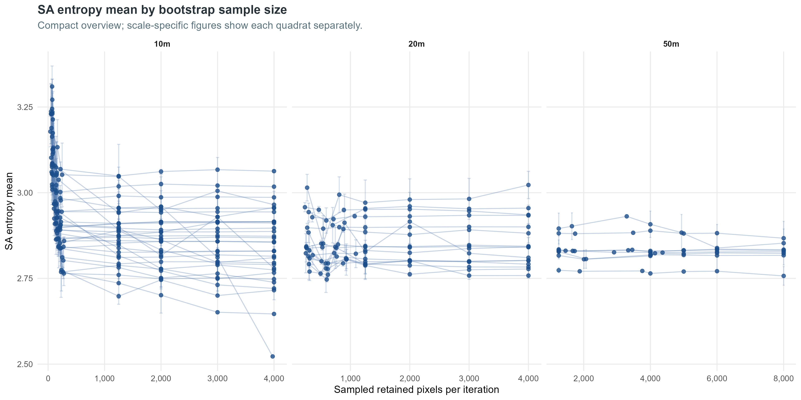

### Compact Overview: Bootstrap CV By Sample Size

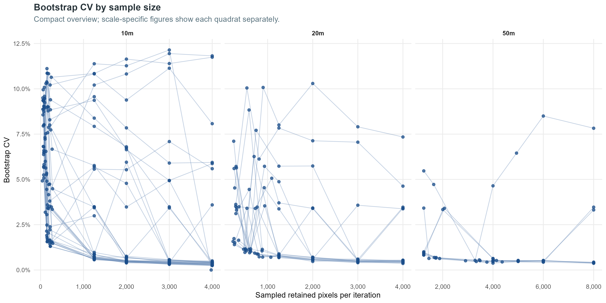

### Compact Overview: Difference From Fixed 4,000 Pixels

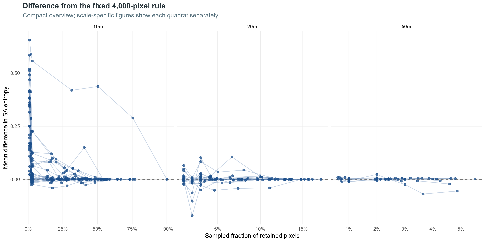

### Compact Overview: Bootstrap Replicate Distributions

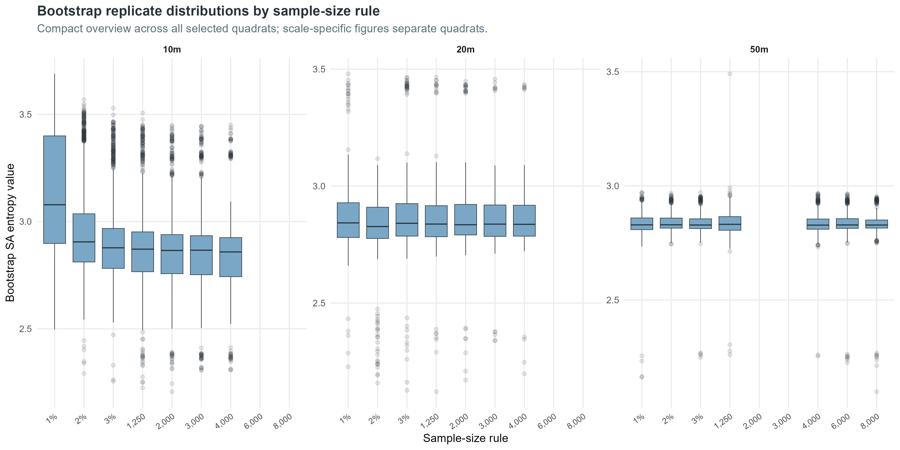

### 10m SA Entropy Mean By Sample Size

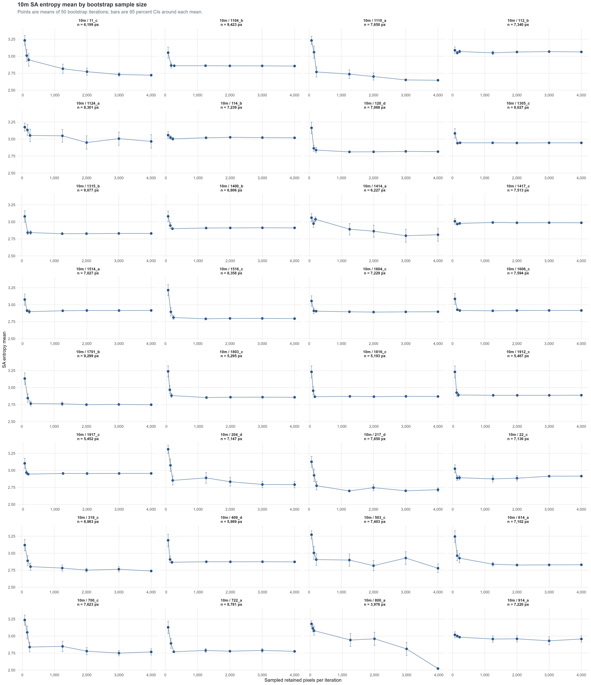

### 10m Bootstrap CV By Sample Size

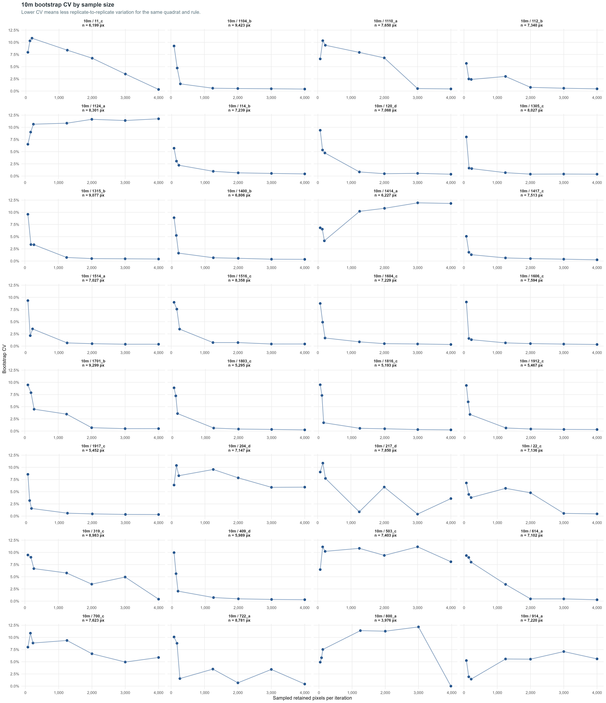

### 10m Difference From Fixed 4,000 Pixels

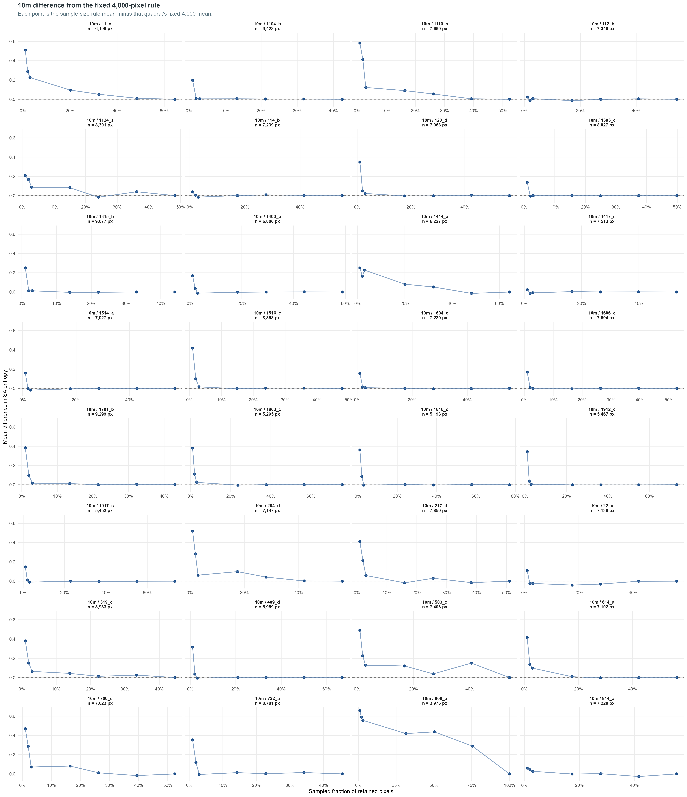

### 20m SA Entropy Mean By Sample Size

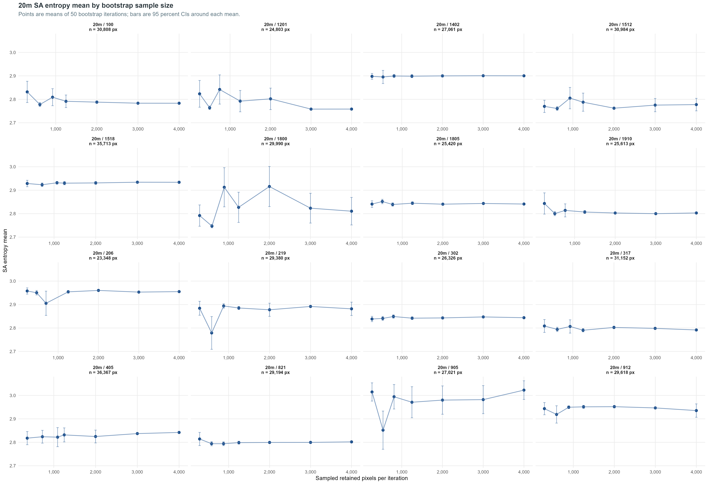

### 20m Bootstrap CV By Sample Size

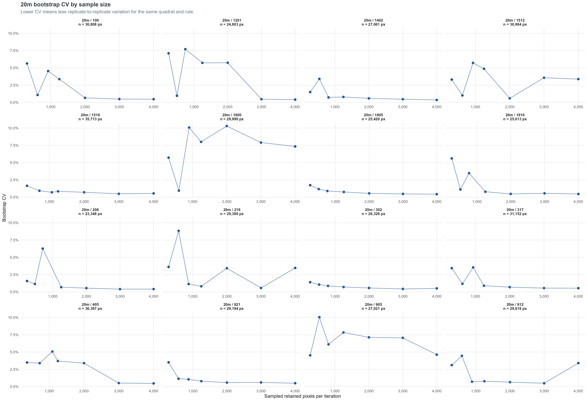

### 20m Difference From Fixed 4,000 Pixels

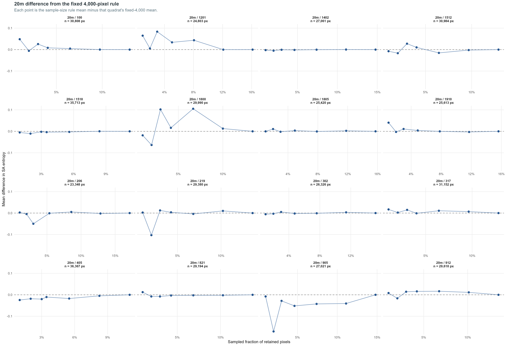

### 50m SA Entropy Mean By Sample Size

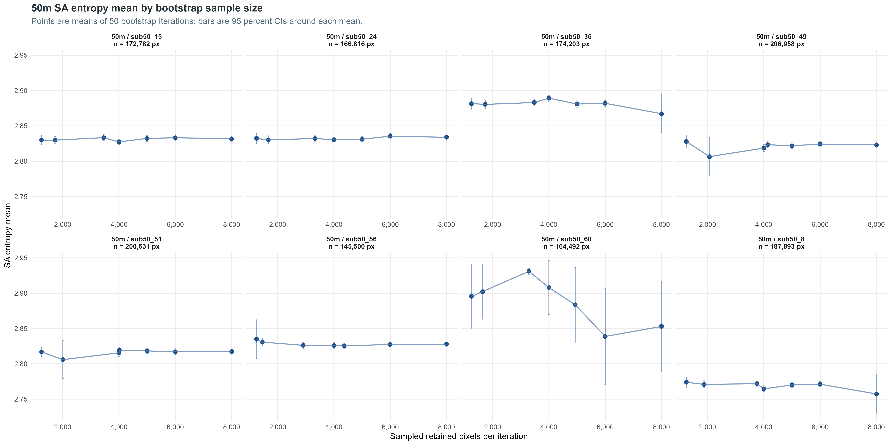

### 50m Bootstrap CV By Sample Size

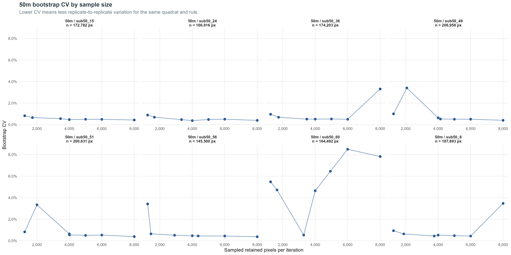

### 50m Difference From Fixed 4,000 Pixels

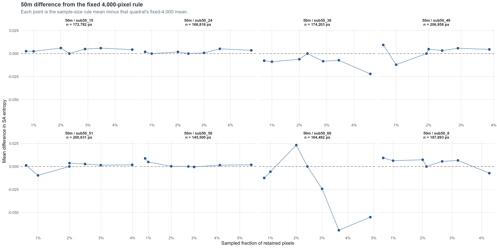

## Distribution Charts Split By Sample Size

The compact distribution overview above is retained. The following long charts split replicate distributions by sample-size rule and show quadrats as boxes with retained pixel counts in the x-axis labels.

### 10m Distribution Charts Split By Sample Size

- [10m 1%](../figures/sample_size_effects/sa_entropy/distributions_by_sample_size/sa_entropy_replicate_distribution_10m_pct_1.png)
- [10m 2%](../figures/sample_size_effects/sa_entropy/distributions_by_sample_size/sa_entropy_replicate_distribution_10m_pct_2.png)
- [10m 3%](../figures/sample_size_effects/sa_entropy/distributions_by_sample_size/sa_entropy_replicate_distribution_10m_pct_3.png)
- [10m 1,250](../figures/sample_size_effects/sa_entropy/distributions_by_sample_size/sa_entropy_replicate_distribution_10m_fixed_1250.png)
- [10m 2,000](../figures/sample_size_effects/sa_entropy/distributions_by_sample_size/sa_entropy_replicate_distribution_10m_fixed_2000.png)
- [10m 3,000](../figures/sample_size_effects/sa_entropy/distributions_by_sample_size/sa_entropy_replicate_distribution_10m_fixed_3000.png)
- [10m 4,000](../figures/sample_size_effects/sa_entropy/distributions_by_sample_size/sa_entropy_replicate_distribution_10m_fixed_4000.png)

### 20m Distribution Charts Split By Sample Size

- [20m 1%](../figures/sample_size_effects/sa_entropy/distributions_by_sample_size/sa_entropy_replicate_distribution_20m_pct_1.png)
- [20m 2%](../figures/sample_size_effects/sa_entropy/distributions_by_sample_size/sa_entropy_replicate_distribution_20m_pct_2.png)
- [20m 3%](../figures/sample_size_effects/sa_entropy/distributions_by_sample_size/sa_entropy_replicate_distribution_20m_pct_3.png)
- [20m 1,250](../figures/sample_size_effects/sa_entropy/distributions_by_sample_size/sa_entropy_replicate_distribution_20m_fixed_1250.png)
- [20m 2,000](../figures/sample_size_effects/sa_entropy/distributions_by_sample_size/sa_entropy_replicate_distribution_20m_fixed_2000.png)
- [20m 3,000](../figures/sample_size_effects/sa_entropy/distributions_by_sample_size/sa_entropy_replicate_distribution_20m_fixed_3000.png)
- [20m 4,000](../figures/sample_size_effects/sa_entropy/distributions_by_sample_size/sa_entropy_replicate_distribution_20m_fixed_4000.png)

### 50m Distribution Charts Split By Sample Size

- [50m 1%](../figures/sample_size_effects/sa_entropy/distributions_by_sample_size/sa_entropy_replicate_distribution_50m_pct_1.png)
- [50m 2%](../figures/sample_size_effects/sa_entropy/distributions_by_sample_size/sa_entropy_replicate_distribution_50m_pct_2.png)
- [50m 3%](../figures/sample_size_effects/sa_entropy/distributions_by_sample_size/sa_entropy_replicate_distribution_50m_pct_3.png)
- [50m 1,250](../figures/sample_size_effects/sa_entropy/distributions_by_sample_size/sa_entropy_replicate_distribution_50m_fixed_1250.png)
- [50m 4,000](../figures/sample_size_effects/sa_entropy/distributions_by_sample_size/sa_entropy_replicate_distribution_50m_fixed_4000.png)
- [50m 6,000](../figures/sample_size_effects/sa_entropy/distributions_by_sample_size/sa_entropy_replicate_distribution_50m_fixed_6000.png)
- [50m 8,000](../figures/sample_size_effects/sa_entropy/distributions_by_sample_size/sa_entropy_replicate_distribution_50m_fixed_8000.png)

## Output Tables

- `reports/tables/sample_size_effects/sa_entropy/sa_entropy_sample_size_design.csv`
- `reports/tables/sample_size_effects/sa_entropy/sa_entropy_sample_size_boot_long.csv`
- `reports/tables/sample_size_effects/sa_entropy/sa_entropy_sample_size_summary.csv`
