# PCA-Derived Spectral Metric Sample-Size Effects

Date: 2026-07-04

## Purpose

Extend the sample-size sensitivity analysis from spectral angle entropy to PCA mean distance, spectral Rao's Q, and alpha-hull area.

## Design

- Bootstrap iterations per quadrat x sample rule: 50
- Quadrat and sample-size rules are reused from `reports/tables/sample_size_effects/sa_entropy/sa_entropy_sample_size_design.csv` so the non-SA metrics are evaluated on the same quadrats and retained-pixel sample sizes.
- Each replicate samples retained pixels without replacement. If a rule resolves to 100% of retained pixels, the metric is calculated once from the full retained-pixel set and repeated across the 50 output rows, so full-pixel conditions have zero artificial bootstrap variation.
- PCA mean distance and spectral Rao's Q use all sampled pixels in PCA space. Alpha-hull area uses all sampled PC1-PC2 points unless the existing alpha-hull helper has to remove duplicate points or returns an internal failure method.

## Selected Quadrats

|Scale |Quadrat  |Retained pixels |Selection note                                                                              |
|:-----|:--------|:---------------|:-------------------------------------------------------------------------------------------|
|10m   |1104_b   |9,423           |Additional random bootstrap-mean quadrat selected with seed 20260703                        |
|10m   |1110_a   |7,650           |Additional random bootstrap-mean quadrat selected with seed 20260703                        |
|10m   |1124_a   |8,301           |Additional random bootstrap-mean quadrat selected with seed 20260703                        |
|10m   |112_b    |7,340           |Original random bootstrap-mean quadrat selected with seed 20260703                          |
|10m   |114_b    |7,239           |Additional random bootstrap-mean quadrat selected with seed 20260703                        |
|10m   |11_c     |6,199           |Additional random bootstrap-mean quadrat selected with seed 20260703                        |
|10m   |120_d    |7,068           |Additional random bootstrap-mean quadrat selected with seed 20260703                        |
|10m   |1305_c   |8,027           |Additional random bootstrap-mean quadrat selected with seed 20260703                        |
|10m   |1315_b   |9,077           |Additional random bootstrap-mean quadrat selected with seed 20260703                        |
|10m   |1400_b   |6,806           |Additional random bootstrap-mean quadrat selected with seed 20260703                        |
|10m   |1414_a   |6,227           |Additional random bootstrap-mean quadrat selected with seed 20260703                        |
|10m   |1417_c   |7,513           |Additional random bootstrap-mean quadrat selected with seed 20260703                        |
|10m   |1514_a   |7,027           |Additional random bootstrap-mean quadrat selected with seed 20260703                        |
|10m   |1516_c   |8,358           |Additional random bootstrap-mean quadrat selected with seed 20260703                        |
|10m   |1604_c   |7,229           |Additional random bootstrap-mean quadrat selected with seed 20260703                        |
|10m   |1606_c   |7,594           |Additional random bootstrap-mean quadrat selected with seed 20260703                        |
|10m   |1701_b   |9,299           |Additional random bootstrap-mean quadrat selected with seed 20260703                        |
|10m   |1803_c   |5,295           |Additional random bootstrap-mean quadrat selected with seed 20260703                        |
|10m   |1816_c   |5,193           |Additional random bootstrap-mean quadrat selected with seed 20260703                        |
|10m   |1912_c   |5,467           |Additional random bootstrap-mean quadrat selected with seed 20260703                        |
|10m   |1917_c   |5,452           |Additional random bootstrap-mean quadrat selected with seed 20260703                        |
|10m   |204_d    |7,147           |Additional random bootstrap-mean quadrat selected with seed 20260703                        |
|10m   |217_d    |7,850           |Additional random bootstrap-mean quadrat selected with seed 20260703                        |
|10m   |22_c     |7,136           |Additional random bootstrap-mean quadrat selected with seed 20260703                        |
|10m   |319_c    |8,983           |Additional random bootstrap-mean quadrat selected with seed 20260703                        |
|10m   |409_d    |5,989           |Additional random bootstrap-mean quadrat selected with seed 20260703                        |
|10m   |503_c    |7,403           |Additional random bootstrap-mean quadrat selected with seed 20260703                        |
|10m   |614_a    |7,102           |Additional random bootstrap-mean quadrat selected with seed 20260703                        |
|10m   |700_c    |7,623           |Additional random bootstrap-mean quadrat selected with seed 20260703                        |
|10m   |722_a    |8,781           |Additional random bootstrap-mean quadrat selected with seed 20260703                        |
|10m   |800_a    |3,976           |Original 10 m replacement: closest bootstrap-mean quadrat at or below 4,000 retained pixels |
|10m   |914_a    |7,220           |Additional random bootstrap-mean quadrat selected with seed 20260703                        |
|20m   |100      |30,808          |Additional random bootstrap-mean quadrat selected with seed 20260703                        |
|20m   |1201     |24,803          |Additional random bootstrap-mean quadrat selected with seed 20260703                        |
|20m   |1402     |27,061          |Additional random bootstrap-mean quadrat selected with seed 20260703                        |
|20m   |1512     |30,984          |Additional random bootstrap-mean quadrat selected with seed 20260703                        |
|20m   |1518     |35,713          |Additional random bootstrap-mean quadrat selected with seed 20260703                        |
|20m   |1800     |29,990          |Additional random bootstrap-mean quadrat selected with seed 20260703                        |
|20m   |1805     |25,420          |Additional random bootstrap-mean quadrat selected with seed 20260703                        |
|20m   |1910     |25,613          |Additional random bootstrap-mean quadrat selected with seed 20260703                        |
|20m   |206      |23,348          |Additional random bootstrap-mean quadrat selected with seed 20260703                        |
|20m   |219      |29,380          |Original random bootstrap-mean quadrat selected with seed 20260703                          |
|20m   |302      |26,326          |Original random bootstrap-mean quadrat selected with seed 20260703                          |
|20m   |317      |31,152          |Additional random bootstrap-mean quadrat selected with seed 20260703                        |
|20m   |405      |36,367          |Additional random bootstrap-mean quadrat selected with seed 20260703                        |
|20m   |821      |29,194          |Additional random bootstrap-mean quadrat selected with seed 20260703                        |
|20m   |905      |27,021          |Additional random bootstrap-mean quadrat selected with seed 20260703                        |
|20m   |912      |29,618          |Additional random bootstrap-mean quadrat selected with seed 20260703                        |
|50m   |sub50_15 |172,782         |Additional random bootstrap-mean quadrat selected with seed 20260703                        |
|50m   |sub50_24 |166,816         |Additional random bootstrap-mean quadrat selected with seed 20260703                        |
|50m   |sub50_36 |174,203         |Original random bootstrap-mean quadrat selected with seed 20260703                          |
|50m   |sub50_49 |206,958         |Additional random bootstrap-mean quadrat selected with seed 20260703                        |
|50m   |sub50_51 |200,631         |Additional random bootstrap-mean quadrat selected with seed 20260703                        |
|50m   |sub50_56 |145,500         |Additional random bootstrap-mean quadrat selected with seed 20260703                        |
|50m   |sub50_60 |164,492         |Original random bootstrap-mean quadrat selected with seed 20260703                          |
|50m   |sub50_8  |187,893         |Additional random bootstrap-mean quadrat selected with seed 20260703                        |

## Sample Rules

|Scale |Quadrat  |Retained pixels |Sample rule                        |Sample pixels |Sample percent |
|:-----|:--------|:---------------|:----------------------------------|:-------------|:--------------|
|10m   |1104_b   |9,423           |1% of pixels = 94 pixels (1.0%)    |94            |1.0%           |
|10m   |1104_b   |9,423           |2% of pixels = 188 pixels (2.0%)   |188           |2.0%           |
|10m   |1104_b   |9,423           |3% of pixels = 283 pixels (3.0%)   |283           |3.0%           |
|10m   |1104_b   |9,423           |Fixed 1,250 (13.3%)                |1,250         |13.3%          |
|10m   |1104_b   |9,423           |Fixed 2,000 (21.2%)                |2,000         |21.2%          |
|10m   |1104_b   |9,423           |Fixed 3,000 (31.8%)                |3,000         |31.8%          |
|10m   |1104_b   |9,423           |Fixed 4,000 (42.4%)                |4,000         |42.4%          |
|10m   |1110_a   |7,650           |1% of pixels = 76 pixels (1.0%)    |76            |1.0%           |
|10m   |1110_a   |7,650           |2% of pixels = 153 pixels (2.0%)   |153           |2.0%           |
|10m   |1110_a   |7,650           |3% of pixels = 230 pixels (3.0%)   |230           |3.0%           |
|10m   |1110_a   |7,650           |Fixed 1,250 (16.3%)                |1,250         |16.3%          |
|10m   |1110_a   |7,650           |Fixed 2,000 (26.1%)                |2,000         |26.1%          |
|10m   |1110_a   |7,650           |Fixed 3,000 (39.2%)                |3,000         |39.2%          |
|10m   |1110_a   |7,650           |Fixed 4,000 (52.3%)                |4,000         |52.3%          |
|10m   |1124_a   |8,301           |1% of pixels = 83 pixels (1.0%)    |83            |1.0%           |
|10m   |1124_a   |8,301           |2% of pixels = 166 pixels (2.0%)   |166           |2.0%           |
|10m   |1124_a   |8,301           |3% of pixels = 249 pixels (3.0%)   |249           |3.0%           |
|10m   |1124_a   |8,301           |Fixed 1,250 (15.1%)                |1,250         |15.1%          |
|10m   |1124_a   |8,301           |Fixed 2,000 (24.1%)                |2,000         |24.1%          |
|10m   |1124_a   |8,301           |Fixed 3,000 (36.1%)                |3,000         |36.1%          |
|10m   |1124_a   |8,301           |Fixed 4,000 (48.2%)                |4,000         |48.2%          |
|10m   |112_b    |7,340           |1% of pixels = 73 pixels (1.0%)    |73            |1.0%           |
|10m   |112_b    |7,340           |2% of pixels = 147 pixels (2.0%)   |147           |2.0%           |
|10m   |112_b    |7,340           |3% of pixels = 220 pixels (3.0%)   |220           |3.0%           |
|10m   |112_b    |7,340           |Fixed 1,250 (17.0%)                |1,250         |17.0%          |
|10m   |112_b    |7,340           |Fixed 2,000 (27.2%)                |2,000         |27.2%          |
|10m   |112_b    |7,340           |Fixed 3,000 (40.9%)                |3,000         |40.9%          |
|10m   |112_b    |7,340           |Fixed 4,000 (54.5%)                |4,000         |54.5%          |
|10m   |114_b    |7,239           |1% of pixels = 72 pixels (1.0%)    |72            |1.0%           |
|10m   |114_b    |7,239           |2% of pixels = 145 pixels (2.0%)   |145           |2.0%           |
|10m   |114_b    |7,239           |3% of pixels = 217 pixels (3.0%)   |217           |3.0%           |
|10m   |114_b    |7,239           |Fixed 1,250 (17.3%)                |1,250         |17.3%          |
|10m   |114_b    |7,239           |Fixed 2,000 (27.6%)                |2,000         |27.6%          |
|10m   |114_b    |7,239           |Fixed 3,000 (41.4%)                |3,000         |41.4%          |
|10m   |114_b    |7,239           |Fixed 4,000 (55.3%)                |4,000         |55.3%          |
|10m   |11_c     |6,199           |1% of pixels = 62 pixels (1.0%)    |62            |1.0%           |
|10m   |11_c     |6,199           |2% of pixels = 124 pixels (2.0%)   |124           |2.0%           |
|10m   |11_c     |6,199           |3% of pixels = 186 pixels (3.0%)   |186           |3.0%           |
|10m   |11_c     |6,199           |Fixed 1,250 (20.2%)                |1,250         |20.2%          |
|10m   |11_c     |6,199           |Fixed 2,000 (32.3%)                |2,000         |32.3%          |
|10m   |11_c     |6,199           |Fixed 3,000 (48.4%)                |3,000         |48.4%          |
|10m   |11_c     |6,199           |Fixed 4,000 (64.5%)                |4,000         |64.5%          |
|10m   |120_d    |7,068           |1% of pixels = 71 pixels (1.0%)    |71            |1.0%           |
|10m   |120_d    |7,068           |2% of pixels = 141 pixels (2.0%)   |141           |2.0%           |
|10m   |120_d    |7,068           |3% of pixels = 212 pixels (3.0%)   |212           |3.0%           |
|10m   |120_d    |7,068           |Fixed 1,250 (17.7%)                |1,250         |17.7%          |
|10m   |120_d    |7,068           |Fixed 2,000 (28.3%)                |2,000         |28.3%          |
|10m   |120_d    |7,068           |Fixed 3,000 (42.4%)                |3,000         |42.4%          |
|10m   |120_d    |7,068           |Fixed 4,000 (56.6%)                |4,000         |56.6%          |
|10m   |1305_c   |8,027           |1% of pixels = 80 pixels (1.0%)    |80            |1.0%           |
|10m   |1305_c   |8,027           |2% of pixels = 161 pixels (2.0%)   |161           |2.0%           |
|10m   |1305_c   |8,027           |3% of pixels = 241 pixels (3.0%)   |241           |3.0%           |
|10m   |1305_c   |8,027           |Fixed 1,250 (15.6%)                |1,250         |15.6%          |
|10m   |1305_c   |8,027           |Fixed 2,000 (24.9%)                |2,000         |24.9%          |
|10m   |1305_c   |8,027           |Fixed 3,000 (37.4%)                |3,000         |37.4%          |
|10m   |1305_c   |8,027           |Fixed 4,000 (49.8%)                |4,000         |49.8%          |
|10m   |1315_b   |9,077           |1% of pixels = 91 pixels (1.0%)    |91            |1.0%           |
|10m   |1315_b   |9,077           |2% of pixels = 182 pixels (2.0%)   |182           |2.0%           |
|10m   |1315_b   |9,077           |3% of pixels = 272 pixels (3.0%)   |272           |3.0%           |
|10m   |1315_b   |9,077           |Fixed 1,250 (13.8%)                |1,250         |13.8%          |
|10m   |1315_b   |9,077           |Fixed 2,000 (22.0%)                |2,000         |22.0%          |
|10m   |1315_b   |9,077           |Fixed 3,000 (33.1%)                |3,000         |33.1%          |
|10m   |1315_b   |9,077           |Fixed 4,000 (44.1%)                |4,000         |44.1%          |
|10m   |1400_b   |6,806           |1% of pixels = 68 pixels (1.0%)    |68            |1.0%           |
|10m   |1400_b   |6,806           |2% of pixels = 136 pixels (2.0%)   |136           |2.0%           |
|10m   |1400_b   |6,806           |3% of pixels = 204 pixels (3.0%)   |204           |3.0%           |
|10m   |1400_b   |6,806           |Fixed 1,250 (18.4%)                |1,250         |18.4%          |
|10m   |1400_b   |6,806           |Fixed 2,000 (29.4%)                |2,000         |29.4%          |
|10m   |1400_b   |6,806           |Fixed 3,000 (44.1%)                |3,000         |44.1%          |
|10m   |1400_b   |6,806           |Fixed 4,000 (58.8%)                |4,000         |58.8%          |
|10m   |1414_a   |6,227           |1% of pixels = 62 pixels (1.0%)    |62            |1.0%           |
|10m   |1414_a   |6,227           |2% of pixels = 125 pixels (2.0%)   |125           |2.0%           |
|10m   |1414_a   |6,227           |3% of pixels = 187 pixels (3.0%)   |187           |3.0%           |
|10m   |1414_a   |6,227           |Fixed 1,250 (20.1%)                |1,250         |20.1%          |
|10m   |1414_a   |6,227           |Fixed 2,000 (32.1%)                |2,000         |32.1%          |
|10m   |1414_a   |6,227           |Fixed 3,000 (48.2%)                |3,000         |48.2%          |
|10m   |1414_a   |6,227           |Fixed 4,000 (64.2%)                |4,000         |64.2%          |
|10m   |1417_c   |7,513           |1% of pixels = 75 pixels (1.0%)    |75            |1.0%           |
|10m   |1417_c   |7,513           |2% of pixels = 150 pixels (2.0%)   |150           |2.0%           |
|10m   |1417_c   |7,513           |3% of pixels = 225 pixels (3.0%)   |225           |3.0%           |
|10m   |1417_c   |7,513           |Fixed 1,250 (16.6%)                |1,250         |16.6%          |
|10m   |1417_c   |7,513           |Fixed 2,000 (26.6%)                |2,000         |26.6%          |
|10m   |1417_c   |7,513           |Fixed 3,000 (39.9%)                |3,000         |39.9%          |
|10m   |1417_c   |7,513           |Fixed 4,000 (53.2%)                |4,000         |53.2%          |
|10m   |1514_a   |7,027           |1% of pixels = 70 pixels (1.0%)    |70            |1.0%           |
|10m   |1514_a   |7,027           |2% of pixels = 141 pixels (2.0%)   |141           |2.0%           |
|10m   |1514_a   |7,027           |3% of pixels = 211 pixels (3.0%)   |211           |3.0%           |
|10m   |1514_a   |7,027           |Fixed 1,250 (17.8%)                |1,250         |17.8%          |
|10m   |1514_a   |7,027           |Fixed 2,000 (28.5%)                |2,000         |28.5%          |
|10m   |1514_a   |7,027           |Fixed 3,000 (42.7%)                |3,000         |42.7%          |
|10m   |1514_a   |7,027           |Fixed 4,000 (56.9%)                |4,000         |56.9%          |
|10m   |1516_c   |8,358           |1% of pixels = 84 pixels (1.0%)    |84            |1.0%           |
|10m   |1516_c   |8,358           |2% of pixels = 167 pixels (2.0%)   |167           |2.0%           |
|10m   |1516_c   |8,358           |3% of pixels = 251 pixels (3.0%)   |251           |3.0%           |
|10m   |1516_c   |8,358           |Fixed 1,250 (15.0%)                |1,250         |15.0%          |
|10m   |1516_c   |8,358           |Fixed 2,000 (23.9%)                |2,000         |23.9%          |
|10m   |1516_c   |8,358           |Fixed 3,000 (35.9%)                |3,000         |35.9%          |
|10m   |1516_c   |8,358           |Fixed 4,000 (47.9%)                |4,000         |47.9%          |
|10m   |1604_c   |7,229           |1% of pixels = 72 pixels (1.0%)    |72            |1.0%           |
|10m   |1604_c   |7,229           |2% of pixels = 145 pixels (2.0%)   |145           |2.0%           |
|10m   |1604_c   |7,229           |3% of pixels = 217 pixels (3.0%)   |217           |3.0%           |
|10m   |1604_c   |7,229           |Fixed 1,250 (17.3%)                |1,250         |17.3%          |
|10m   |1604_c   |7,229           |Fixed 2,000 (27.7%)                |2,000         |27.7%          |
|10m   |1604_c   |7,229           |Fixed 3,000 (41.5%)                |3,000         |41.5%          |
|10m   |1604_c   |7,229           |Fixed 4,000 (55.3%)                |4,000         |55.3%          |
|10m   |1606_c   |7,594           |1% of pixels = 76 pixels (1.0%)    |76            |1.0%           |
|10m   |1606_c   |7,594           |2% of pixels = 152 pixels (2.0%)   |152           |2.0%           |
|10m   |1606_c   |7,594           |3% of pixels = 228 pixels (3.0%)   |228           |3.0%           |
|10m   |1606_c   |7,594           |Fixed 1,250 (16.5%)                |1,250         |16.5%          |
|10m   |1606_c   |7,594           |Fixed 2,000 (26.3%)                |2,000         |26.3%          |
|10m   |1606_c   |7,594           |Fixed 3,000 (39.5%)                |3,000         |39.5%          |
|10m   |1606_c   |7,594           |Fixed 4,000 (52.7%)                |4,000         |52.7%          |
|10m   |1701_b   |9,299           |1% of pixels = 93 pixels (1.0%)    |93            |1.0%           |
|10m   |1701_b   |9,299           |2% of pixels = 186 pixels (2.0%)   |186           |2.0%           |
|10m   |1701_b   |9,299           |3% of pixels = 279 pixels (3.0%)   |279           |3.0%           |
|10m   |1701_b   |9,299           |Fixed 1,250 (13.4%)                |1,250         |13.4%          |
|10m   |1701_b   |9,299           |Fixed 2,000 (21.5%)                |2,000         |21.5%          |
|10m   |1701_b   |9,299           |Fixed 3,000 (32.3%)                |3,000         |32.3%          |
|10m   |1701_b   |9,299           |Fixed 4,000 (43.0%)                |4,000         |43.0%          |
|10m   |1803_c   |5,295           |1% of pixels = 53 pixels (1.0%)    |53            |1.0%           |
|10m   |1803_c   |5,295           |2% of pixels = 106 pixels (2.0%)   |106           |2.0%           |
|10m   |1803_c   |5,295           |3% of pixels = 159 pixels (3.0%)   |159           |3.0%           |
|10m   |1803_c   |5,295           |Fixed 1,250 (23.6%)                |1,250         |23.6%          |
|10m   |1803_c   |5,295           |Fixed 2,000 (37.8%)                |2,000         |37.8%          |
|10m   |1803_c   |5,295           |Fixed 3,000 (56.7%)                |3,000         |56.7%          |
|10m   |1803_c   |5,295           |Fixed 4,000 (75.5%)                |4,000         |75.5%          |
|10m   |1816_c   |5,193           |1% of pixels = 52 pixels (1.0%)    |52            |1.0%           |
|10m   |1816_c   |5,193           |2% of pixels = 104 pixels (2.0%)   |104           |2.0%           |
|10m   |1816_c   |5,193           |3% of pixels = 156 pixels (3.0%)   |156           |3.0%           |
|10m   |1816_c   |5,193           |Fixed 1,250 (24.1%)                |1,250         |24.1%          |
|10m   |1816_c   |5,193           |Fixed 2,000 (38.5%)                |2,000         |38.5%          |
|10m   |1816_c   |5,193           |Fixed 3,000 (57.8%)                |3,000         |57.8%          |
|10m   |1816_c   |5,193           |Fixed 4,000 (77.0%)                |4,000         |77.0%          |
|10m   |1912_c   |5,467           |1% of pixels = 55 pixels (1.0%)    |55            |1.0%           |
|10m   |1912_c   |5,467           |2% of pixels = 109 pixels (2.0%)   |109           |2.0%           |
|10m   |1912_c   |5,467           |3% of pixels = 164 pixels (3.0%)   |164           |3.0%           |
|10m   |1912_c   |5,467           |Fixed 1,250 (22.9%)                |1,250         |22.9%          |
|10m   |1912_c   |5,467           |Fixed 2,000 (36.6%)                |2,000         |36.6%          |
|10m   |1912_c   |5,467           |Fixed 3,000 (54.9%)                |3,000         |54.9%          |
|10m   |1912_c   |5,467           |Fixed 4,000 (73.2%)                |4,000         |73.2%          |
|10m   |1917_c   |5,452           |1% of pixels = 55 pixels (1.0%)    |55            |1.0%           |
|10m   |1917_c   |5,452           |2% of pixels = 109 pixels (2.0%)   |109           |2.0%           |
|10m   |1917_c   |5,452           |3% of pixels = 164 pixels (3.0%)   |164           |3.0%           |
|10m   |1917_c   |5,452           |Fixed 1,250 (22.9%)                |1,250         |22.9%          |
|10m   |1917_c   |5,452           |Fixed 2,000 (36.7%)                |2,000         |36.7%          |
|10m   |1917_c   |5,452           |Fixed 3,000 (55.0%)                |3,000         |55.0%          |
|10m   |1917_c   |5,452           |Fixed 4,000 (73.4%)                |4,000         |73.4%          |
|10m   |204_d    |7,147           |1% of pixels = 71 pixels (1.0%)    |71            |1.0%           |
|10m   |204_d    |7,147           |2% of pixels = 143 pixels (2.0%)   |143           |2.0%           |
|10m   |204_d    |7,147           |3% of pixels = 214 pixels (3.0%)   |214           |3.0%           |
|10m   |204_d    |7,147           |Fixed 1,250 (17.5%)                |1,250         |17.5%          |
|10m   |204_d    |7,147           |Fixed 2,000 (28.0%)                |2,000         |28.0%          |
|10m   |204_d    |7,147           |Fixed 3,000 (42.0%)                |3,000         |42.0%          |
|10m   |204_d    |7,147           |Fixed 4,000 (56.0%)                |4,000         |56.0%          |
|10m   |217_d    |7,850           |1% of pixels = 78 pixels (1.0%)    |78            |1.0%           |
|10m   |217_d    |7,850           |2% of pixels = 157 pixels (2.0%)   |157           |2.0%           |
|10m   |217_d    |7,850           |3% of pixels = 236 pixels (3.0%)   |236           |3.0%           |
|10m   |217_d    |7,850           |Fixed 1,250 (15.9%)                |1,250         |15.9%          |
|10m   |217_d    |7,850           |Fixed 2,000 (25.5%)                |2,000         |25.5%          |
|10m   |217_d    |7,850           |Fixed 3,000 (38.2%)                |3,000         |38.2%          |
|10m   |217_d    |7,850           |Fixed 4,000 (51.0%)                |4,000         |51.0%          |
|10m   |22_c     |7,136           |1% of pixels = 71 pixels (1.0%)    |71            |1.0%           |
|10m   |22_c     |7,136           |2% of pixels = 143 pixels (2.0%)   |143           |2.0%           |
|10m   |22_c     |7,136           |3% of pixels = 214 pixels (3.0%)   |214           |3.0%           |
|10m   |22_c     |7,136           |Fixed 1,250 (17.5%)                |1,250         |17.5%          |
|10m   |22_c     |7,136           |Fixed 2,000 (28.0%)                |2,000         |28.0%          |
|10m   |22_c     |7,136           |Fixed 3,000 (42.0%)                |3,000         |42.0%          |
|10m   |22_c     |7,136           |Fixed 4,000 (56.1%)                |4,000         |56.1%          |
|10m   |319_c    |8,983           |1% of pixels = 90 pixels (1.0%)    |90            |1.0%           |
|10m   |319_c    |8,983           |2% of pixels = 180 pixels (2.0%)   |180           |2.0%           |
|10m   |319_c    |8,983           |3% of pixels = 269 pixels (3.0%)   |269           |3.0%           |
|10m   |319_c    |8,983           |Fixed 1,250 (13.9%)                |1,250         |13.9%          |
|10m   |319_c    |8,983           |Fixed 2,000 (22.3%)                |2,000         |22.3%          |
|10m   |319_c    |8,983           |Fixed 3,000 (33.4%)                |3,000         |33.4%          |
|10m   |319_c    |8,983           |Fixed 4,000 (44.5%)                |4,000         |44.5%          |
|10m   |409_d    |5,989           |1% of pixels = 60 pixels (1.0%)    |60            |1.0%           |
|10m   |409_d    |5,989           |2% of pixels = 120 pixels (2.0%)   |120           |2.0%           |
|10m   |409_d    |5,989           |3% of pixels = 180 pixels (3.0%)   |180           |3.0%           |
|10m   |409_d    |5,989           |Fixed 1,250 (20.9%)                |1,250         |20.9%          |
|10m   |409_d    |5,989           |Fixed 2,000 (33.4%)                |2,000         |33.4%          |
|10m   |409_d    |5,989           |Fixed 3,000 (50.1%)                |3,000         |50.1%          |
|10m   |409_d    |5,989           |Fixed 4,000 (66.8%)                |4,000         |66.8%          |
|10m   |503_c    |7,403           |1% of pixels = 74 pixels (1.0%)    |74            |1.0%           |
|10m   |503_c    |7,403           |2% of pixels = 148 pixels (2.0%)   |148           |2.0%           |
|10m   |503_c    |7,403           |3% of pixels = 222 pixels (3.0%)   |222           |3.0%           |
|10m   |503_c    |7,403           |Fixed 1,250 (16.9%)                |1,250         |16.9%          |
|10m   |503_c    |7,403           |Fixed 2,000 (27.0%)                |2,000         |27.0%          |
|10m   |503_c    |7,403           |Fixed 3,000 (40.5%)                |3,000         |40.5%          |
|10m   |503_c    |7,403           |Fixed 4,000 (54.0%)                |4,000         |54.0%          |
|10m   |614_a    |7,102           |1% of pixels = 71 pixels (1.0%)    |71            |1.0%           |
|10m   |614_a    |7,102           |2% of pixels = 142 pixels (2.0%)   |142           |2.0%           |
|10m   |614_a    |7,102           |3% of pixels = 213 pixels (3.0%)   |213           |3.0%           |
|10m   |614_a    |7,102           |Fixed 1,250 (17.6%)                |1,250         |17.6%          |
|10m   |614_a    |7,102           |Fixed 2,000 (28.2%)                |2,000         |28.2%          |
|10m   |614_a    |7,102           |Fixed 3,000 (42.2%)                |3,000         |42.2%          |
|10m   |614_a    |7,102           |Fixed 4,000 (56.3%)                |4,000         |56.3%          |
|10m   |700_c    |7,623           |1% of pixels = 76 pixels (1.0%)    |76            |1.0%           |
|10m   |700_c    |7,623           |2% of pixels = 152 pixels (2.0%)   |152           |2.0%           |
|10m   |700_c    |7,623           |3% of pixels = 229 pixels (3.0%)   |229           |3.0%           |
|10m   |700_c    |7,623           |Fixed 1,250 (16.4%)                |1,250         |16.4%          |
|10m   |700_c    |7,623           |Fixed 2,000 (26.2%)                |2,000         |26.2%          |
|10m   |700_c    |7,623           |Fixed 3,000 (39.4%)                |3,000         |39.4%          |
|10m   |700_c    |7,623           |Fixed 4,000 (52.5%)                |4,000         |52.5%          |
|10m   |722_a    |8,781           |1% of pixels = 88 pixels (1.0%)    |88            |1.0%           |
|10m   |722_a    |8,781           |2% of pixels = 176 pixels (2.0%)   |176           |2.0%           |
|10m   |722_a    |8,781           |3% of pixels = 263 pixels (3.0%)   |263           |3.0%           |
|10m   |722_a    |8,781           |Fixed 1,250 (14.2%)                |1,250         |14.2%          |
|10m   |722_a    |8,781           |Fixed 2,000 (22.8%)                |2,000         |22.8%          |
|10m   |722_a    |8,781           |Fixed 3,000 (34.2%)                |3,000         |34.2%          |
|10m   |722_a    |8,781           |Fixed 4,000 (45.6%)                |4,000         |45.6%          |
|10m   |800_a    |3,976           |1% of pixels = 40 pixels (1.0%)    |40            |1.0%           |
|10m   |800_a    |3,976           |2% of pixels = 80 pixels (2.0%)    |80            |2.0%           |
|10m   |800_a    |3,976           |3% of pixels = 119 pixels (3.0%)   |119           |3.0%           |
|10m   |800_a    |3,976           |Fixed 1,250 (31.4%)                |1,250         |31.4%          |
|10m   |800_a    |3,976           |Fixed 2,000 (50.3%)                |2,000         |50.3%          |
|10m   |800_a    |3,976           |Fixed 3,000 (75.5%)                |3,000         |75.5%          |
|10m   |800_a    |3,976           |Fixed 4,000 (100.0%)               |3,976         |100.0%         |
|10m   |914_a    |7,220           |1% of pixels = 72 pixels (1.0%)    |72            |1.0%           |
|10m   |914_a    |7,220           |2% of pixels = 144 pixels (2.0%)   |144           |2.0%           |
|10m   |914_a    |7,220           |3% of pixels = 217 pixels (3.0%)   |217           |3.0%           |
|10m   |914_a    |7,220           |Fixed 1,250 (17.3%)                |1,250         |17.3%          |
|10m   |914_a    |7,220           |Fixed 2,000 (27.7%)                |2,000         |27.7%          |
|10m   |914_a    |7,220           |Fixed 3,000 (41.6%)                |3,000         |41.6%          |
|10m   |914_a    |7,220           |Fixed 4,000 (55.4%)                |4,000         |55.4%          |
|20m   |100      |30,808          |1% of pixels = 308 pixels (1.0%)   |308           |1.0%           |
|20m   |100      |30,808          |2% of pixels = 616 pixels (2.0%)   |616           |2.0%           |
|20m   |100      |30,808          |3% of pixels = 924 pixels (3.0%)   |924           |3.0%           |
|20m   |100      |30,808          |Fixed 1,250 (4.1%)                 |1,250         |4.1%           |
|20m   |100      |30,808          |Fixed 2,000 (6.5%)                 |2,000         |6.5%           |
|20m   |100      |30,808          |Fixed 3,000 (9.7%)                 |3,000         |9.7%           |
|20m   |100      |30,808          |Fixed 4,000 (13.0%)                |4,000         |13.0%          |
|20m   |1201     |24,803          |1% of pixels = 248 pixels (1.0%)   |248           |1.0%           |
|20m   |1201     |24,803          |2% of pixels = 496 pixels (2.0%)   |496           |2.0%           |
|20m   |1201     |24,803          |3% of pixels = 744 pixels (3.0%)   |744           |3.0%           |
|20m   |1201     |24,803          |Fixed 1,250 (5.0%)                 |1,250         |5.0%           |
|20m   |1201     |24,803          |Fixed 2,000 (8.1%)                 |2,000         |8.1%           |
|20m   |1201     |24,803          |Fixed 3,000 (12.1%)                |3,000         |12.1%          |
|20m   |1201     |24,803          |Fixed 4,000 (16.1%)                |4,000         |16.1%          |
|20m   |1402     |27,061          |1% of pixels = 271 pixels (1.0%)   |271           |1.0%           |
|20m   |1402     |27,061          |2% of pixels = 541 pixels (2.0%)   |541           |2.0%           |
|20m   |1402     |27,061          |3% of pixels = 812 pixels (3.0%)   |812           |3.0%           |
|20m   |1402     |27,061          |Fixed 1,250 (4.6%)                 |1,250         |4.6%           |
|20m   |1402     |27,061          |Fixed 2,000 (7.4%)                 |2,000         |7.4%           |
|20m   |1402     |27,061          |Fixed 3,000 (11.1%)                |3,000         |11.1%          |
|20m   |1402     |27,061          |Fixed 4,000 (14.8%)                |4,000         |14.8%          |
|20m   |1512     |30,984          |1% of pixels = 310 pixels (1.0%)   |310           |1.0%           |
|20m   |1512     |30,984          |2% of pixels = 620 pixels (2.0%)   |620           |2.0%           |
|20m   |1512     |30,984          |3% of pixels = 930 pixels (3.0%)   |930           |3.0%           |
|20m   |1512     |30,984          |Fixed 1,250 (4.0%)                 |1,250         |4.0%           |
|20m   |1512     |30,984          |Fixed 2,000 (6.5%)                 |2,000         |6.5%           |
|20m   |1512     |30,984          |Fixed 3,000 (9.7%)                 |3,000         |9.7%           |
|20m   |1512     |30,984          |Fixed 4,000 (12.9%)                |4,000         |12.9%          |
|20m   |1518     |35,713          |1% of pixels = 357 pixels (1.0%)   |357           |1.0%           |
|20m   |1518     |35,713          |2% of pixels = 714 pixels (2.0%)   |714           |2.0%           |
|20m   |1518     |35,713          |3% of pixels = 1,071 pixels (3.0%) |1,071         |3.0%           |
|20m   |1518     |35,713          |Fixed 1,250 (3.5%)                 |1,250         |3.5%           |
|20m   |1518     |35,713          |Fixed 2,000 (5.6%)                 |2,000         |5.6%           |
|20m   |1518     |35,713          |Fixed 3,000 (8.4%)                 |3,000         |8.4%           |
|20m   |1518     |35,713          |Fixed 4,000 (11.2%)                |4,000         |11.2%          |
|20m   |1800     |29,990          |1% of pixels = 300 pixels (1.0%)   |300           |1.0%           |
|20m   |1800     |29,990          |2% of pixels = 600 pixels (2.0%)   |600           |2.0%           |
|20m   |1800     |29,990          |3% of pixels = 900 pixels (3.0%)   |900           |3.0%           |
|20m   |1800     |29,990          |Fixed 1,250 (4.2%)                 |1,250         |4.2%           |
|20m   |1800     |29,990          |Fixed 2,000 (6.7%)                 |2,000         |6.7%           |
|20m   |1800     |29,990          |Fixed 3,000 (10.0%)                |3,000         |10.0%          |
|20m   |1800     |29,990          |Fixed 4,000 (13.3%)                |4,000         |13.3%          |
|20m   |1805     |25,420          |1% of pixels = 254 pixels (1.0%)   |254           |1.0%           |
|20m   |1805     |25,420          |2% of pixels = 508 pixels (2.0%)   |508           |2.0%           |
|20m   |1805     |25,420          |3% of pixels = 763 pixels (3.0%)   |763           |3.0%           |
|20m   |1805     |25,420          |Fixed 1,250 (4.9%)                 |1,250         |4.9%           |
|20m   |1805     |25,420          |Fixed 2,000 (7.9%)                 |2,000         |7.9%           |
|20m   |1805     |25,420          |Fixed 3,000 (11.8%)                |3,000         |11.8%          |
|20m   |1805     |25,420          |Fixed 4,000 (15.7%)                |4,000         |15.7%          |
|20m   |1910     |25,613          |1% of pixels = 256 pixels (1.0%)   |256           |1.0%           |
|20m   |1910     |25,613          |2% of pixels = 512 pixels (2.0%)   |512           |2.0%           |
|20m   |1910     |25,613          |3% of pixels = 768 pixels (3.0%)   |768           |3.0%           |
|20m   |1910     |25,613          |Fixed 1,250 (4.9%)                 |1,250         |4.9%           |
|20m   |1910     |25,613          |Fixed 2,000 (7.8%)                 |2,000         |7.8%           |
|20m   |1910     |25,613          |Fixed 3,000 (11.7%)                |3,000         |11.7%          |
|20m   |1910     |25,613          |Fixed 4,000 (15.6%)                |4,000         |15.6%          |
|20m   |206      |23,348          |1% of pixels = 233 pixels (1.0%)   |233           |1.0%           |
|20m   |206      |23,348          |2% of pixels = 467 pixels (2.0%)   |467           |2.0%           |
|20m   |206      |23,348          |3% of pixels = 700 pixels (3.0%)   |700           |3.0%           |
|20m   |206      |23,348          |Fixed 1,250 (5.4%)                 |1,250         |5.4%           |
|20m   |206      |23,348          |Fixed 2,000 (8.6%)                 |2,000         |8.6%           |
|20m   |206      |23,348          |Fixed 3,000 (12.8%)                |3,000         |12.8%          |
|20m   |206      |23,348          |Fixed 4,000 (17.1%)                |4,000         |17.1%          |
|20m   |219      |29,380          |1% of pixels = 294 pixels (1.0%)   |294           |1.0%           |
|20m   |219      |29,380          |2% of pixels = 588 pixels (2.0%)   |588           |2.0%           |
|20m   |219      |29,380          |3% of pixels = 881 pixels (3.0%)   |881           |3.0%           |
|20m   |219      |29,380          |Fixed 1,250 (4.3%)                 |1,250         |4.3%           |
|20m   |219      |29,380          |Fixed 2,000 (6.8%)                 |2,000         |6.8%           |
|20m   |219      |29,380          |Fixed 3,000 (10.2%)                |3,000         |10.2%          |
|20m   |219      |29,380          |Fixed 4,000 (13.6%)                |4,000         |13.6%          |
|20m   |302      |26,326          |1% of pixels = 263 pixels (1.0%)   |263           |1.0%           |
|20m   |302      |26,326          |2% of pixels = 527 pixels (2.0%)   |527           |2.0%           |
|20m   |302      |26,326          |3% of pixels = 790 pixels (3.0%)   |790           |3.0%           |
|20m   |302      |26,326          |Fixed 1,250 (4.7%)                 |1,250         |4.7%           |
|20m   |302      |26,326          |Fixed 2,000 (7.6%)                 |2,000         |7.6%           |
|20m   |302      |26,326          |Fixed 3,000 (11.4%)                |3,000         |11.4%          |
|20m   |302      |26,326          |Fixed 4,000 (15.2%)                |4,000         |15.2%          |
|20m   |317      |31,152          |1% of pixels = 312 pixels (1.0%)   |312           |1.0%           |
|20m   |317      |31,152          |2% of pixels = 623 pixels (2.0%)   |623           |2.0%           |
|20m   |317      |31,152          |3% of pixels = 935 pixels (3.0%)   |935           |3.0%           |
|20m   |317      |31,152          |Fixed 1,250 (4.0%)                 |1,250         |4.0%           |
|20m   |317      |31,152          |Fixed 2,000 (6.4%)                 |2,000         |6.4%           |
|20m   |317      |31,152          |Fixed 3,000 (9.6%)                 |3,000         |9.6%           |
|20m   |317      |31,152          |Fixed 4,000 (12.8%)                |4,000         |12.8%          |
|20m   |405      |36,367          |1% of pixels = 364 pixels (1.0%)   |364           |1.0%           |
|20m   |405      |36,367          |2% of pixels = 727 pixels (2.0%)   |727           |2.0%           |
|20m   |405      |36,367          |3% of pixels = 1,091 pixels (3.0%) |1,091         |3.0%           |
|20m   |405      |36,367          |Fixed 1,250 (3.4%)                 |1,250         |3.4%           |
|20m   |405      |36,367          |Fixed 2,000 (5.5%)                 |2,000         |5.5%           |
|20m   |405      |36,367          |Fixed 3,000 (8.2%)                 |3,000         |8.2%           |
|20m   |405      |36,367          |Fixed 4,000 (11.0%)                |4,000         |11.0%          |
|20m   |821      |29,194          |1% of pixels = 292 pixels (1.0%)   |292           |1.0%           |
|20m   |821      |29,194          |2% of pixels = 584 pixels (2.0%)   |584           |2.0%           |
|20m   |821      |29,194          |3% of pixels = 876 pixels (3.0%)   |876           |3.0%           |
|20m   |821      |29,194          |Fixed 1,250 (4.3%)                 |1,250         |4.3%           |
|20m   |821      |29,194          |Fixed 2,000 (6.9%)                 |2,000         |6.9%           |
|20m   |821      |29,194          |Fixed 3,000 (10.3%)                |3,000         |10.3%          |
|20m   |821      |29,194          |Fixed 4,000 (13.7%)                |4,000         |13.7%          |
|20m   |905      |27,021          |1% of pixels = 270 pixels (1.0%)   |270           |1.0%           |
|20m   |905      |27,021          |2% of pixels = 540 pixels (2.0%)   |540           |2.0%           |
|20m   |905      |27,021          |3% of pixels = 811 pixels (3.0%)   |811           |3.0%           |
|20m   |905      |27,021          |Fixed 1,250 (4.6%)                 |1,250         |4.6%           |
|20m   |905      |27,021          |Fixed 2,000 (7.4%)                 |2,000         |7.4%           |
|20m   |905      |27,021          |Fixed 3,000 (11.1%)                |3,000         |11.1%          |
|20m   |905      |27,021          |Fixed 4,000 (14.8%)                |4,000         |14.8%          |
|20m   |912      |29,618          |1% of pixels = 296 pixels (1.0%)   |296           |1.0%           |
|20m   |912      |29,618          |2% of pixels = 592 pixels (2.0%)   |592           |2.0%           |
|20m   |912      |29,618          |3% of pixels = 889 pixels (3.0%)   |889           |3.0%           |
|20m   |912      |29,618          |Fixed 1,250 (4.2%)                 |1,250         |4.2%           |
|20m   |912      |29,618          |Fixed 2,000 (6.8%)                 |2,000         |6.8%           |
|20m   |912      |29,618          |Fixed 3,000 (10.1%)                |3,000         |10.1%          |
|20m   |912      |29,618          |Fixed 4,000 (13.5%)                |4,000         |13.5%          |
|50m   |sub50_15 |172,782         |Fixed 1,250 (0.7%)                 |1,250         |0.7%           |
|50m   |sub50_15 |172,782         |1% of pixels = 1,728 pixels (1.0%) |1,728         |1.0%           |
|50m   |sub50_15 |172,782         |2% of pixels = 3,456 pixels (2.0%) |3,456         |2.0%           |
|50m   |sub50_15 |172,782         |Fixed 4,000 (2.3%)                 |4,000         |2.3%           |
|50m   |sub50_15 |172,782         |3% of pixels = 5,000 pixels (2.9%) |5,000         |2.9%           |
|50m   |sub50_15 |172,782         |Fixed 6,000 (3.5%)                 |6,000         |3.5%           |
|50m   |sub50_15 |172,782         |Fixed 8,000 (4.6%)                 |8,000         |4.6%           |
|50m   |sub50_24 |166,816         |Fixed 1,250 (0.7%)                 |1,250         |0.7%           |
|50m   |sub50_24 |166,816         |1% of pixels = 1,668 pixels (1.0%) |1,668         |1.0%           |
|50m   |sub50_24 |166,816         |2% of pixels = 3,336 pixels (2.0%) |3,336         |2.0%           |
|50m   |sub50_24 |166,816         |Fixed 4,000 (2.4%)                 |4,000         |2.4%           |
|50m   |sub50_24 |166,816         |3% of pixels = 5,000 pixels (3.0%) |5,000         |3.0%           |
|50m   |sub50_24 |166,816         |Fixed 6,000 (3.6%)                 |6,000         |3.6%           |
|50m   |sub50_24 |166,816         |Fixed 8,000 (4.8%)                 |8,000         |4.8%           |
|50m   |sub50_36 |174,203         |Fixed 1,250 (0.7%)                 |1,250         |0.7%           |
|50m   |sub50_36 |174,203         |1% of pixels = 1,742 pixels (1.0%) |1,742         |1.0%           |
|50m   |sub50_36 |174,203         |2% of pixels = 3,484 pixels (2.0%) |3,484         |2.0%           |
|50m   |sub50_36 |174,203         |Fixed 4,000 (2.3%)                 |4,000         |2.3%           |
|50m   |sub50_36 |174,203         |3% of pixels = 5,000 pixels (2.9%) |5,000         |2.9%           |
|50m   |sub50_36 |174,203         |Fixed 6,000 (3.4%)                 |6,000         |3.4%           |
|50m   |sub50_36 |174,203         |Fixed 8,000 (4.6%)                 |8,000         |4.6%           |
|50m   |sub50_49 |206,958         |Fixed 1,250 (0.6%)                 |1,250         |0.6%           |
|50m   |sub50_49 |206,958         |1% of pixels = 2,070 pixels (1.0%) |2,070         |1.0%           |
|50m   |sub50_49 |206,958         |Fixed 4,000 (1.9%)                 |4,000         |1.9%           |
|50m   |sub50_49 |206,958         |2% of pixels = 4,139 pixels (2.0%) |4,139         |2.0%           |
|50m   |sub50_49 |206,958         |3% of pixels = 5,000 pixels (2.4%) |5,000         |2.4%           |
|50m   |sub50_49 |206,958         |Fixed 6,000 (2.9%)                 |6,000         |2.9%           |
|50m   |sub50_49 |206,958         |Fixed 8,000 (3.9%)                 |8,000         |3.9%           |
|50m   |sub50_51 |200,631         |Fixed 1,250 (0.6%)                 |1,250         |0.6%           |
|50m   |sub50_51 |200,631         |1% of pixels = 2,006 pixels (1.0%) |2,006         |1.0%           |
|50m   |sub50_51 |200,631         |Fixed 4,000 (2.0%)                 |4,000         |2.0%           |
|50m   |sub50_51 |200,631         |2% of pixels = 4,013 pixels (2.0%) |4,013         |2.0%           |
|50m   |sub50_51 |200,631         |3% of pixels = 5,000 pixels (2.5%) |5,000         |2.5%           |
|50m   |sub50_51 |200,631         |Fixed 6,000 (3.0%)                 |6,000         |3.0%           |
|50m   |sub50_51 |200,631         |Fixed 8,000 (4.0%)                 |8,000         |4.0%           |
|50m   |sub50_56 |145,500         |Fixed 1,250 (0.9%)                 |1,250         |0.9%           |
|50m   |sub50_56 |145,500         |1% of pixels = 1,455 pixels (1.0%) |1,455         |1.0%           |
|50m   |sub50_56 |145,500         |2% of pixels = 2,910 pixels (2.0%) |2,910         |2.0%           |
|50m   |sub50_56 |145,500         |Fixed 4,000 (2.7%)                 |4,000         |2.7%           |
|50m   |sub50_56 |145,500         |3% of pixels = 4,365 pixels (3.0%) |4,365         |3.0%           |
|50m   |sub50_56 |145,500         |Fixed 6,000 (4.1%)                 |6,000         |4.1%           |
|50m   |sub50_56 |145,500         |Fixed 8,000 (5.5%)                 |8,000         |5.5%           |
|50m   |sub50_60 |164,492         |Fixed 1,250 (0.8%)                 |1,250         |0.8%           |
|50m   |sub50_60 |164,492         |1% of pixels = 1,645 pixels (1.0%) |1,645         |1.0%           |
|50m   |sub50_60 |164,492         |2% of pixels = 3,290 pixels (2.0%) |3,290         |2.0%           |
|50m   |sub50_60 |164,492         |Fixed 4,000 (2.4%)                 |4,000         |2.4%           |
|50m   |sub50_60 |164,492         |3% of pixels = 4,935 pixels (3.0%) |4,935         |3.0%           |
|50m   |sub50_60 |164,492         |Fixed 6,000 (3.6%)                 |6,000         |3.6%           |
|50m   |sub50_60 |164,492         |Fixed 8,000 (4.9%)                 |8,000         |4.9%           |
|50m   |sub50_8  |187,893         |Fixed 1,250 (0.7%)                 |1,250         |0.7%           |
|50m   |sub50_8  |187,893         |1% of pixels = 1,879 pixels (1.0%) |1,879         |1.0%           |
|50m   |sub50_8  |187,893         |2% of pixels = 3,758 pixels (2.0%) |3,758         |2.0%           |
|50m   |sub50_8  |187,893         |Fixed 4,000 (2.1%)                 |4,000         |2.1%           |
|50m   |sub50_8  |187,893         |3% of pixels = 5,000 pixels (2.7%) |5,000         |2.7%           |
|50m   |sub50_8  |187,893         |Fixed 6,000 (3.2%)                 |6,000         |3.2%           |
|50m   |sub50_8  |187,893         |Fixed 8,000 (4.3%)                 |8,000         |4.3%           |

## Summary Results

|Metric            |Scale |Quadrat  |Sample rule                        |Mean value |Boot SD |Boot CV |95% CI low |95% CI high |Delta from fixed 4,000 |Calculation method                               |
|:-----------------|:-----|:--------|:----------------------------------|:----------|:-------|:-------|:----------|:-----------|:----------------------|:------------------------------------------------|
|PCA Mean Distance |10m   |1104_b   |1% of pixels = 94 pixels (1.0%)    |6.362      |0.520   |8.2%    |6.214      |6.509       |-0.002                 |all_sampled_pixels                               |
|PCA Mean Distance |10m   |1104_b   |2% of pixels = 188 pixels (2.0%)   |6.341      |0.324   |5.1%    |6.249      |6.433       |-0.022                 |all_sampled_pixels                               |
|PCA Mean Distance |10m   |1104_b   |3% of pixels = 283 pixels (3.0%)   |6.376      |0.294   |4.6%    |6.292      |6.460       |0.013                  |all_sampled_pixels                               |
|PCA Mean Distance |10m   |1104_b   |Fixed 1,250 (13.3%)                |6.320      |0.109   |1.7%    |6.289      |6.351       |-0.043                 |all_sampled_pixels                               |
|PCA Mean Distance |10m   |1104_b   |Fixed 2,000 (21.2%)                |6.354      |0.081   |1.3%    |6.331      |6.377       |-0.010                 |all_sampled_pixels                               |
|PCA Mean Distance |10m   |1104_b   |Fixed 3,000 (31.8%)                |6.345      |0.065   |1.0%    |6.326      |6.363       |-0.019                 |all_sampled_pixels                               |
|PCA Mean Distance |10m   |1104_b   |Fixed 4,000 (42.4%)                |6.363      |0.062   |1.0%    |6.346      |6.381       |0.000                  |all_sampled_pixels                               |
|PCA Mean Distance |10m   |1110_a   |1% of pixels = 76 pixels (1.0%)    |6.524      |0.383   |5.9%    |6.415      |6.633       |-0.056                 |all_sampled_pixels                               |
|PCA Mean Distance |10m   |1110_a   |2% of pixels = 153 pixels (2.0%)   |6.548      |0.315   |4.8%    |6.459      |6.638       |-0.031                 |all_sampled_pixels                               |
|PCA Mean Distance |10m   |1110_a   |3% of pixels = 230 pixels (3.0%)   |6.533      |0.167   |2.6%    |6.485      |6.580       |-0.046                 |all_sampled_pixels                               |
|PCA Mean Distance |10m   |1110_a   |Fixed 1,250 (16.3%)                |6.591      |0.104   |1.6%    |6.562      |6.621       |0.012                  |all_sampled_pixels                               |
|PCA Mean Distance |10m   |1110_a   |Fixed 2,000 (26.1%)                |6.577      |0.068   |1.0%    |6.558      |6.596       |-0.002                 |all_sampled_pixels                               |
|PCA Mean Distance |10m   |1110_a   |Fixed 3,000 (39.2%)                |6.575      |0.051   |0.8%    |6.561      |6.590       |-0.004                 |all_sampled_pixels                               |
|PCA Mean Distance |10m   |1110_a   |Fixed 4,000 (52.3%)                |6.579      |0.035   |0.5%    |6.569      |6.589       |0.000                  |all_sampled_pixels                               |
|PCA Mean Distance |10m   |1124_a   |1% of pixels = 83 pixels (1.0%)    |7.067      |0.505   |7.1%    |6.924      |7.211       |-0.083                 |all_sampled_pixels                               |
|PCA Mean Distance |10m   |1124_a   |2% of pixels = 166 pixels (2.0%)   |7.144      |0.372   |5.2%    |7.039      |7.250       |-0.006                 |all_sampled_pixels                               |
|PCA Mean Distance |10m   |1124_a   |3% of pixels = 249 pixels (3.0%)   |7.133      |0.305   |4.3%    |7.046      |7.220       |-0.017                 |all_sampled_pixels                               |
|PCA Mean Distance |10m   |1124_a   |Fixed 1,250 (15.1%)                |7.165      |0.104   |1.5%    |7.135      |7.195       |0.015                  |all_sampled_pixels                               |
|PCA Mean Distance |10m   |1124_a   |Fixed 2,000 (24.1%)                |7.131      |0.093   |1.3%    |7.104      |7.157       |-0.019                 |all_sampled_pixels                               |
|PCA Mean Distance |10m   |1124_a   |Fixed 3,000 (36.1%)                |7.184      |0.065   |0.9%    |7.166      |7.203       |0.034                  |all_sampled_pixels                               |
|PCA Mean Distance |10m   |1124_a   |Fixed 4,000 (48.2%)                |7.150      |0.057   |0.8%    |7.134      |7.166       |0.000                  |all_sampled_pixels                               |
|PCA Mean Distance |10m   |112_b    |1% of pixels = 73 pixels (1.0%)    |8.655      |1.133   |13.1%   |8.333      |8.977       |0.012                  |all_sampled_pixels                               |
|PCA Mean Distance |10m   |112_b    |2% of pixels = 147 pixels (2.0%)   |8.675      |0.876   |10.1%   |8.426      |8.924       |0.032                  |all_sampled_pixels                               |
|PCA Mean Distance |10m   |112_b    |3% of pixels = 220 pixels (3.0%)   |8.723      |0.828   |9.5%    |8.487      |8.958       |0.080                  |all_sampled_pixels                               |
|PCA Mean Distance |10m   |112_b    |Fixed 1,250 (17.0%)                |8.642      |0.279   |3.2%    |8.563      |8.721       |-0.001                 |all_sampled_pixels                               |
|PCA Mean Distance |10m   |112_b    |Fixed 2,000 (27.2%)                |8.641      |0.218   |2.5%    |8.579      |8.703       |-0.002                 |all_sampled_pixels                               |
|PCA Mean Distance |10m   |112_b    |Fixed 3,000 (40.9%)                |8.597      |0.152   |1.8%    |8.554      |8.640       |-0.046                 |all_sampled_pixels                               |
|PCA Mean Distance |10m   |112_b    |Fixed 4,000 (54.5%)                |8.643      |0.121   |1.4%    |8.608      |8.677       |0.000                  |all_sampled_pixels                               |
|PCA Mean Distance |10m   |114_b    |1% of pixels = 72 pixels (1.0%)    |9.407      |0.746   |7.9%    |9.196      |9.619       |-0.054                 |all_sampled_pixels                               |
|PCA Mean Distance |10m   |114_b    |2% of pixels = 145 pixels (2.0%)   |9.451      |0.512   |5.4%    |9.305      |9.596       |-0.010                 |all_sampled_pixels                               |
|PCA Mean Distance |10m   |114_b    |3% of pixels = 217 pixels (3.0%)   |9.345      |0.342   |3.7%    |9.248      |9.443       |-0.116                 |all_sampled_pixels                               |
|PCA Mean Distance |10m   |114_b    |Fixed 1,250 (17.3%)                |9.463      |0.182   |1.9%    |9.411      |9.515       |0.001                  |all_sampled_pixels                               |
|PCA Mean Distance |10m   |114_b    |Fixed 2,000 (27.6%)                |9.421      |0.127   |1.3%    |9.385      |9.457       |-0.041                 |all_sampled_pixels                               |
|PCA Mean Distance |10m   |114_b    |Fixed 3,000 (41.4%)                |9.485      |0.093   |1.0%    |9.458      |9.511       |0.023                  |all_sampled_pixels                               |
|PCA Mean Distance |10m   |114_b    |Fixed 4,000 (55.3%)                |9.461      |0.073   |0.8%    |9.441      |9.482       |0.000                  |all_sampled_pixels                               |
|PCA Mean Distance |10m   |11_c     |1% of pixels = 62 pixels (1.0%)    |7.008      |0.499   |7.1%    |6.866      |7.150       |-0.048                 |all_sampled_pixels                               |
|PCA Mean Distance |10m   |11_c     |2% of pixels = 124 pixels (2.0%)   |6.978      |0.325   |4.7%    |6.886      |7.071       |-0.078                 |all_sampled_pixels                               |
|PCA Mean Distance |10m   |11_c     |3% of pixels = 186 pixels (3.0%)   |7.114      |0.303   |4.3%    |7.028      |7.200       |0.058                  |all_sampled_pixels                               |
|PCA Mean Distance |10m   |11_c     |Fixed 1,250 (20.2%)                |7.022      |0.101   |1.4%    |6.993      |7.051       |-0.034                 |all_sampled_pixels                               |
|PCA Mean Distance |10m   |11_c     |Fixed 2,000 (32.3%)                |7.044      |0.068   |1.0%    |7.025      |7.064       |-0.012                 |all_sampled_pixels                               |
|PCA Mean Distance |10m   |11_c     |Fixed 3,000 (48.4%)                |7.041      |0.050   |0.7%    |7.027      |7.056       |-0.015                 |all_sampled_pixels                               |
|PCA Mean Distance |10m   |11_c     |Fixed 4,000 (64.5%)                |7.056      |0.038   |0.5%    |7.045      |7.067       |0.000                  |all_sampled_pixels                               |
|PCA Mean Distance |10m   |120_d    |1% of pixels = 71 pixels (1.0%)    |8.870      |0.572   |6.5%    |8.707      |9.032       |-0.148                 |all_sampled_pixels                               |
|PCA Mean Distance |10m   |120_d    |2% of pixels = 141 pixels (2.0%)   |9.042      |0.405   |4.5%    |8.927      |9.157       |0.025                  |all_sampled_pixels                               |
|PCA Mean Distance |10m   |120_d    |3% of pixels = 212 pixels (3.0%)   |8.972      |0.383   |4.3%    |8.863      |9.081       |-0.045                 |all_sampled_pixels                               |
|PCA Mean Distance |10m   |120_d    |Fixed 1,250 (17.7%)                |9.025      |0.139   |1.5%    |8.985      |9.064       |0.007                  |all_sampled_pixels                               |
|PCA Mean Distance |10m   |120_d    |Fixed 2,000 (28.3%)                |9.013      |0.088   |1.0%    |8.988      |9.038       |-0.004                 |all_sampled_pixels                               |
|PCA Mean Distance |10m   |120_d    |Fixed 3,000 (42.4%)                |9.023      |0.068   |0.8%    |9.003      |9.042       |0.006                  |all_sampled_pixels                               |
|PCA Mean Distance |10m   |120_d    |Fixed 4,000 (56.6%)                |9.017      |0.055   |0.6%    |9.002      |9.033       |0.000                  |all_sampled_pixels                               |
|PCA Mean Distance |10m   |1305_c   |1% of pixels = 80 pixels (1.0%)    |7.279      |0.401   |5.5%    |7.165      |7.393       |-0.072                 |all_sampled_pixels                               |
|PCA Mean Distance |10m   |1305_c   |2% of pixels = 161 pixels (2.0%)   |7.351      |0.332   |4.5%    |7.257      |7.445       |-0.000                 |all_sampled_pixels                               |
|PCA Mean Distance |10m   |1305_c   |3% of pixels = 241 pixels (3.0%)   |7.355      |0.255   |3.5%    |7.283      |7.428       |0.004                  |all_sampled_pixels                               |
|PCA Mean Distance |10m   |1305_c   |Fixed 1,250 (15.6%)                |7.348      |0.117   |1.6%    |7.315      |7.381       |-0.003                 |all_sampled_pixels                               |
|PCA Mean Distance |10m   |1305_c   |Fixed 2,000 (24.9%)                |7.350      |0.073   |1.0%    |7.329      |7.371       |-0.001                 |all_sampled_pixels                               |
|PCA Mean Distance |10m   |1305_c   |Fixed 3,000 (37.4%)                |7.345      |0.057   |0.8%    |7.329      |7.361       |-0.006                 |all_sampled_pixels                               |
|PCA Mean Distance |10m   |1305_c   |Fixed 4,000 (49.8%)                |7.351      |0.038   |0.5%    |7.340      |7.362       |0.000                  |all_sampled_pixels                               |
|PCA Mean Distance |10m   |1315_b   |1% of pixels = 91 pixels (1.0%)    |8.110      |0.586   |7.2%    |7.943      |8.276       |0.020                  |all_sampled_pixels                               |
|PCA Mean Distance |10m   |1315_b   |2% of pixels = 182 pixels (2.0%)   |8.087      |0.380   |4.7%    |7.979      |8.195       |-0.003                 |all_sampled_pixels                               |
|PCA Mean Distance |10m   |1315_b   |3% of pixels = 272 pixels (3.0%)   |8.005      |0.332   |4.2%    |7.910      |8.099       |-0.085                 |all_sampled_pixels                               |
|PCA Mean Distance |10m   |1315_b   |Fixed 1,250 (13.8%)                |8.046      |0.141   |1.8%    |8.006      |8.086       |-0.044                 |all_sampled_pixels                               |
|PCA Mean Distance |10m   |1315_b   |Fixed 2,000 (22.0%)                |8.071      |0.099   |1.2%    |8.043      |8.099       |-0.019                 |all_sampled_pixels                               |
|PCA Mean Distance |10m   |1315_b   |Fixed 3,000 (33.1%)                |8.059      |0.075   |0.9%    |8.038      |8.080       |-0.031                 |all_sampled_pixels                               |
|PCA Mean Distance |10m   |1315_b   |Fixed 4,000 (44.1%)                |8.090      |0.076   |0.9%    |8.068      |8.112       |0.000                  |all_sampled_pixels                               |
|PCA Mean Distance |10m   |1400_b   |1% of pixels = 68 pixels (1.0%)    |7.857      |0.494   |6.3%    |7.716      |7.997       |-0.129                 |all_sampled_pixels                               |
|PCA Mean Distance |10m   |1400_b   |2% of pixels = 136 pixels (2.0%)   |7.942      |0.352   |4.4%    |7.842      |8.042       |-0.044                 |all_sampled_pixels                               |
|PCA Mean Distance |10m   |1400_b   |3% of pixels = 204 pixels (3.0%)   |7.987      |0.275   |3.4%    |7.909      |8.065       |0.001                  |all_sampled_pixels                               |
|PCA Mean Distance |10m   |1400_b   |Fixed 1,250 (18.4%)                |7.996      |0.112   |1.4%    |7.964      |8.028       |0.010                  |all_sampled_pixels                               |
|PCA Mean Distance |10m   |1400_b   |Fixed 2,000 (29.4%)                |7.996      |0.068   |0.9%    |7.977      |8.015       |0.010                  |all_sampled_pixels                               |
|PCA Mean Distance |10m   |1400_b   |Fixed 3,000 (44.1%)                |7.975      |0.057   |0.7%    |7.959      |7.991       |-0.011                 |all_sampled_pixels                               |
|PCA Mean Distance |10m   |1400_b   |Fixed 4,000 (58.8%)                |7.986      |0.040   |0.5%    |7.975      |7.997       |0.000                  |all_sampled_pixels                               |
|PCA Mean Distance |10m   |1414_a   |1% of pixels = 62 pixels (1.0%)    |8.965      |0.583   |6.5%    |8.799      |9.130       |0.086                  |all_sampled_pixels                               |
|PCA Mean Distance |10m   |1414_a   |2% of pixels = 125 pixels (2.0%)   |8.776      |0.430   |4.9%    |8.654      |8.898       |-0.103                 |all_sampled_pixels                               |
|PCA Mean Distance |10m   |1414_a   |3% of pixels = 187 pixels (3.0%)   |8.863      |0.376   |4.2%    |8.756      |8.970       |-0.016                 |all_sampled_pixels                               |
|PCA Mean Distance |10m   |1414_a   |Fixed 1,250 (20.1%)                |8.868      |0.152   |1.7%    |8.825      |8.911       |-0.011                 |all_sampled_pixels                               |
|PCA Mean Distance |10m   |1414_a   |Fixed 2,000 (32.1%)                |8.863      |0.081   |0.9%    |8.840      |8.886       |-0.016                 |all_sampled_pixels                               |
|PCA Mean Distance |10m   |1414_a   |Fixed 3,000 (48.2%)                |8.890      |0.061   |0.7%    |8.873      |8.908       |0.011                  |all_sampled_pixels                               |
|PCA Mean Distance |10m   |1414_a   |Fixed 4,000 (64.2%)                |8.879      |0.047   |0.5%    |8.866      |8.892       |0.000                  |all_sampled_pixels                               |
|PCA Mean Distance |10m   |1417_c   |1% of pixels = 75 pixels (1.0%)    |9.178      |0.624   |6.8%    |9.001      |9.355       |-0.136                 |all_sampled_pixels                               |
|PCA Mean Distance |10m   |1417_c   |2% of pixels = 150 pixels (2.0%)   |9.322      |0.454   |4.9%    |9.193      |9.451       |0.008                  |all_sampled_pixels                               |
|PCA Mean Distance |10m   |1417_c   |3% of pixels = 225 pixels (3.0%)   |9.285      |0.380   |4.1%    |9.177      |9.393       |-0.029                 |all_sampled_pixels                               |
|PCA Mean Distance |10m   |1417_c   |Fixed 1,250 (16.6%)                |9.297      |0.150   |1.6%    |9.255      |9.340       |-0.017                 |all_sampled_pixels                               |
|PCA Mean Distance |10m   |1417_c   |Fixed 2,000 (26.6%)                |9.303      |0.116   |1.2%    |9.270      |9.336       |-0.011                 |all_sampled_pixels                               |
|PCA Mean Distance |10m   |1417_c   |Fixed 3,000 (39.9%)                |9.295      |0.077   |0.8%    |9.273      |9.317       |-0.019                 |all_sampled_pixels                               |
|PCA Mean Distance |10m   |1417_c   |Fixed 4,000 (53.2%)                |9.314      |0.059   |0.6%    |9.297      |9.331       |0.000                  |all_sampled_pixels                               |
|PCA Mean Distance |10m   |1514_a   |1% of pixels = 70 pixels (1.0%)    |5.929      |0.476   |8.0%    |5.794      |6.064       |-0.041                 |all_sampled_pixels                               |
|PCA Mean Distance |10m   |1514_a   |2% of pixels = 141 pixels (2.0%)   |5.971      |0.275   |4.6%    |5.893      |6.049       |0.000                  |all_sampled_pixels                               |
|PCA Mean Distance |10m   |1514_a   |3% of pixels = 211 pixels (3.0%)   |5.956      |0.274   |4.6%    |5.878      |6.033       |-0.015                 |all_sampled_pixels                               |
|PCA Mean Distance |10m   |1514_a   |Fixed 1,250 (17.8%)                |5.993      |0.101   |1.7%    |5.964      |6.021       |0.022                  |all_sampled_pixels                               |
|PCA Mean Distance |10m   |1514_a   |Fixed 2,000 (28.5%)                |5.975      |0.073   |1.2%    |5.954      |5.996       |0.005                  |all_sampled_pixels                               |
|PCA Mean Distance |10m   |1514_a   |Fixed 3,000 (42.7%)                |5.960      |0.049   |0.8%    |5.946      |5.974       |-0.011                 |all_sampled_pixels                               |
|PCA Mean Distance |10m   |1514_a   |Fixed 4,000 (56.9%)                |5.970      |0.038   |0.6%    |5.960      |5.981       |0.000                  |all_sampled_pixels                               |
|PCA Mean Distance |10m   |1516_c   |1% of pixels = 84 pixels (1.0%)    |8.654      |0.574   |6.6%    |8.491      |8.817       |-0.030                 |all_sampled_pixels                               |
|PCA Mean Distance |10m   |1516_c   |2% of pixels = 167 pixels (2.0%)   |8.619      |0.346   |4.0%    |8.520      |8.717       |-0.065                 |all_sampled_pixels                               |
|PCA Mean Distance |10m   |1516_c   |3% of pixels = 251 pixels (3.0%)   |8.731      |0.270   |3.1%    |8.654      |8.807       |0.046                  |all_sampled_pixels                               |
|PCA Mean Distance |10m   |1516_c   |Fixed 1,250 (15.0%)                |8.694      |0.113   |1.3%    |8.662      |8.726       |0.010                  |all_sampled_pixels                               |
|PCA Mean Distance |10m   |1516_c   |Fixed 2,000 (23.9%)                |8.693      |0.106   |1.2%    |8.663      |8.723       |0.009                  |all_sampled_pixels                               |
|PCA Mean Distance |10m   |1516_c   |Fixed 3,000 (35.9%)                |8.696      |0.064   |0.7%    |8.678      |8.714       |0.011                  |all_sampled_pixels                               |
|PCA Mean Distance |10m   |1516_c   |Fixed 4,000 (47.9%)                |8.684      |0.057   |0.7%    |8.668      |8.701       |0.000                  |all_sampled_pixels                               |
|PCA Mean Distance |10m   |1604_c   |1% of pixels = 72 pixels (1.0%)    |7.323      |0.564   |7.7%    |7.162      |7.483       |0.020                  |all_sampled_pixels                               |
|PCA Mean Distance |10m   |1604_c   |2% of pixels = 145 pixels (2.0%)   |7.321      |0.373   |5.1%    |7.215      |7.427       |0.018                  |all_sampled_pixels                               |
|PCA Mean Distance |10m   |1604_c   |3% of pixels = 217 pixels (3.0%)   |7.337      |0.311   |4.2%    |7.249      |7.426       |0.034                  |all_sampled_pixels                               |
|PCA Mean Distance |10m   |1604_c   |Fixed 1,250 (17.3%)                |7.316      |0.117   |1.6%    |7.283      |7.349       |0.013                  |all_sampled_pixels                               |
|PCA Mean Distance |10m   |1604_c   |Fixed 2,000 (27.7%)                |7.300      |0.078   |1.1%    |7.278      |7.322       |-0.003                 |all_sampled_pixels                               |
|PCA Mean Distance |10m   |1604_c   |Fixed 3,000 (41.5%)                |7.278      |0.051   |0.7%    |7.264      |7.293       |-0.024                 |all_sampled_pixels                               |
|PCA Mean Distance |10m   |1604_c   |Fixed 4,000 (55.3%)                |7.303      |0.043   |0.6%    |7.291      |7.315       |0.000                  |all_sampled_pixels                               |
|PCA Mean Distance |10m   |1606_c   |1% of pixels = 76 pixels (1.0%)    |7.574      |0.381   |5.0%    |7.465      |7.682       |-0.008                 |all_sampled_pixels                               |
|PCA Mean Distance |10m   |1606_c   |2% of pixels = 152 pixels (2.0%)   |7.640      |0.262   |3.4%    |7.566      |7.715       |0.059                  |all_sampled_pixels                               |
|PCA Mean Distance |10m   |1606_c   |3% of pixels = 228 pixels (3.0%)   |7.633      |0.280   |3.7%    |7.553      |7.712       |0.051                  |all_sampled_pixels                               |
|PCA Mean Distance |10m   |1606_c   |Fixed 1,250 (16.5%)                |7.599      |0.097   |1.3%    |7.572      |7.627       |0.018                  |all_sampled_pixels                               |
|PCA Mean Distance |10m   |1606_c   |Fixed 2,000 (26.3%)                |7.581      |0.067   |0.9%    |7.562      |7.600       |-0.000                 |all_sampled_pixels                               |
|PCA Mean Distance |10m   |1606_c   |Fixed 3,000 (39.5%)                |7.583      |0.044   |0.6%    |7.571      |7.595       |0.001                  |all_sampled_pixels                               |
|PCA Mean Distance |10m   |1606_c   |Fixed 4,000 (52.7%)                |7.582      |0.035   |0.5%    |7.571      |7.592       |0.000                  |all_sampled_pixels                               |
|PCA Mean Distance |10m   |1701_b   |1% of pixels = 93 pixels (1.0%)    |7.174      |0.488   |6.8%    |7.035      |7.312       |0.006                  |all_sampled_pixels                               |
|PCA Mean Distance |10m   |1701_b   |2% of pixels = 186 pixels (2.0%)   |7.234      |0.366   |5.1%    |7.130      |7.338       |0.066                  |all_sampled_pixels                               |
|PCA Mean Distance |10m   |1701_b   |3% of pixels = 279 pixels (3.0%)   |7.167      |0.293   |4.1%    |7.084      |7.250       |-0.001                 |all_sampled_pixels                               |
|PCA Mean Distance |10m   |1701_b   |Fixed 1,250 (13.4%)                |7.184      |0.126   |1.8%    |7.148      |7.220       |0.016                  |all_sampled_pixels                               |
|PCA Mean Distance |10m   |1701_b   |Fixed 2,000 (21.5%)                |7.178      |0.102   |1.4%    |7.149      |7.207       |0.010                  |all_sampled_pixels                               |
|PCA Mean Distance |10m   |1701_b   |Fixed 3,000 (32.3%)                |7.165      |0.074   |1.0%    |7.144      |7.186       |-0.003                 |all_sampled_pixels                               |
|PCA Mean Distance |10m   |1701_b   |Fixed 4,000 (43.0%)                |7.168      |0.050   |0.7%    |7.154      |7.182       |0.000                  |all_sampled_pixels                               |
|PCA Mean Distance |10m   |1803_c   |1% of pixels = 53 pixels (1.0%)    |6.681      |0.491   |7.4%    |6.541      |6.820       |-0.165                 |all_sampled_pixels                               |
|PCA Mean Distance |10m   |1803_c   |2% of pixels = 106 pixels (2.0%)   |6.812      |0.321   |4.7%    |6.720      |6.903       |-0.034                 |all_sampled_pixels                               |
|PCA Mean Distance |10m   |1803_c   |3% of pixels = 159 pixels (3.0%)   |6.813      |0.241   |3.5%    |6.745      |6.882       |-0.032                 |all_sampled_pixels                               |
|PCA Mean Distance |10m   |1803_c   |Fixed 1,250 (23.6%)                |6.837      |0.085   |1.2%    |6.813      |6.861       |-0.009                 |all_sampled_pixels                               |
|PCA Mean Distance |10m   |1803_c   |Fixed 2,000 (37.8%)                |6.851      |0.060   |0.9%    |6.835      |6.868       |0.006                  |all_sampled_pixels                               |
|PCA Mean Distance |10m   |1803_c   |Fixed 3,000 (56.7%)                |6.852      |0.041   |0.6%    |6.840      |6.863       |0.006                  |all_sampled_pixels                               |
|PCA Mean Distance |10m   |1803_c   |Fixed 4,000 (75.5%)                |6.846      |0.025   |0.4%    |6.838      |6.853       |0.000                  |all_sampled_pixels                               |
|PCA Mean Distance |10m   |1816_c   |1% of pixels = 52 pixels (1.0%)    |7.036      |0.540   |7.7%    |6.883      |7.189       |-0.107                 |all_sampled_pixels                               |
|PCA Mean Distance |10m   |1816_c   |2% of pixels = 104 pixels (2.0%)   |7.134      |0.318   |4.5%    |7.044      |7.225       |-0.009                 |all_sampled_pixels                               |
|PCA Mean Distance |10m   |1816_c   |3% of pixels = 156 pixels (3.0%)   |7.095      |0.331   |4.7%    |7.001      |7.189       |-0.048                 |all_sampled_pixels                               |
|PCA Mean Distance |10m   |1816_c   |Fixed 1,250 (24.1%)                |7.132      |0.094   |1.3%    |7.105      |7.158       |-0.011                 |all_sampled_pixels                               |
|PCA Mean Distance |10m   |1816_c   |Fixed 2,000 (38.5%)                |7.139      |0.064   |0.9%    |7.120      |7.157       |-0.004                 |all_sampled_pixels                               |
|PCA Mean Distance |10m   |1816_c   |Fixed 3,000 (57.8%)                |7.143      |0.045   |0.6%    |7.130      |7.156       |-0.000                 |all_sampled_pixels                               |
|PCA Mean Distance |10m   |1816_c   |Fixed 4,000 (77.0%)                |7.143      |0.028   |0.4%    |7.135      |7.151       |0.000                  |all_sampled_pixels                               |
|PCA Mean Distance |10m   |1912_c   |1% of pixels = 55 pixels (1.0%)    |7.142      |0.518   |7.3%    |6.994      |7.289       |-0.111                 |all_sampled_pixels                               |
|PCA Mean Distance |10m   |1912_c   |2% of pixels = 109 pixels (2.0%)   |7.236      |0.303   |4.2%    |7.150      |7.322       |-0.016                 |all_sampled_pixels                               |
|PCA Mean Distance |10m   |1912_c   |3% of pixels = 164 pixels (3.0%)   |7.282      |0.254   |3.5%    |7.210      |7.354       |0.030                  |all_sampled_pixels                               |
|PCA Mean Distance |10m   |1912_c   |Fixed 1,250 (22.9%)                |7.252      |0.107   |1.5%    |7.222      |7.283       |-0.000                 |all_sampled_pixels                               |
|PCA Mean Distance |10m   |1912_c   |Fixed 2,000 (36.6%)                |7.252      |0.063   |0.9%    |7.235      |7.270       |0.000                  |all_sampled_pixels                               |
|PCA Mean Distance |10m   |1912_c   |Fixed 3,000 (54.9%)                |7.270      |0.046   |0.6%    |7.257      |7.283       |0.018                  |all_sampled_pixels                               |
|PCA Mean Distance |10m   |1912_c   |Fixed 4,000 (73.2%)                |7.252      |0.029   |0.4%    |7.244      |7.260       |0.000                  |all_sampled_pixels                               |
|PCA Mean Distance |10m   |1917_c   |1% of pixels = 55 pixels (1.0%)    |7.068      |0.516   |7.3%    |6.921      |7.215       |-0.088                 |all_sampled_pixels                               |
|PCA Mean Distance |10m   |1917_c   |2% of pixels = 109 pixels (2.0%)   |7.102      |0.392   |5.5%    |6.991      |7.214       |-0.054                 |all_sampled_pixels                               |
|PCA Mean Distance |10m   |1917_c   |3% of pixels = 164 pixels (3.0%)   |7.138      |0.309   |4.3%    |7.050      |7.225       |-0.019                 |all_sampled_pixels                               |
|PCA Mean Distance |10m   |1917_c   |Fixed 1,250 (22.9%)                |7.147      |0.100   |1.4%    |7.119      |7.175       |-0.009                 |all_sampled_pixels                               |
|PCA Mean Distance |10m   |1917_c   |Fixed 2,000 (36.7%)                |7.164      |0.066   |0.9%    |7.145      |7.183       |0.007                  |all_sampled_pixels                               |
|PCA Mean Distance |10m   |1917_c   |Fixed 3,000 (55.0%)                |7.154      |0.049   |0.7%    |7.140      |7.168       |-0.002                 |all_sampled_pixels                               |
|PCA Mean Distance |10m   |1917_c   |Fixed 4,000 (73.4%)                |7.157      |0.036   |0.5%    |7.146      |7.167       |0.000                  |all_sampled_pixels                               |
|PCA Mean Distance |10m   |204_d    |1% of pixels = 71 pixels (1.0%)    |8.158      |0.602   |7.4%    |7.987      |8.329       |-0.121                 |all_sampled_pixels                               |
|PCA Mean Distance |10m   |204_d    |2% of pixels = 143 pixels (2.0%)   |8.268      |0.391   |4.7%    |8.157      |8.379       |-0.011                 |all_sampled_pixels                               |
|PCA Mean Distance |10m   |204_d    |3% of pixels = 214 pixels (3.0%)   |8.290      |0.348   |4.2%    |8.191      |8.389       |0.010                  |all_sampled_pixels                               |
|PCA Mean Distance |10m   |204_d    |Fixed 1,250 (17.5%)                |8.275      |0.112   |1.4%    |8.243      |8.307       |-0.004                 |all_sampled_pixels                               |
|PCA Mean Distance |10m   |204_d    |Fixed 2,000 (28.0%)                |8.276      |0.090   |1.1%    |8.251      |8.302       |-0.003                 |all_sampled_pixels                               |
|PCA Mean Distance |10m   |204_d    |Fixed 3,000 (42.0%)                |8.267      |0.068   |0.8%    |8.248      |8.287       |-0.012                 |all_sampled_pixels                               |
|PCA Mean Distance |10m   |204_d    |Fixed 4,000 (56.0%)                |8.280      |0.043   |0.5%    |8.267      |8.292       |0.000                  |all_sampled_pixels                               |
|PCA Mean Distance |10m   |217_d    |1% of pixels = 78 pixels (1.0%)    |7.628      |0.512   |6.7%    |7.483      |7.773       |-0.074                 |all_sampled_pixels                               |
|PCA Mean Distance |10m   |217_d    |2% of pixels = 157 pixels (2.0%)   |7.713      |0.281   |3.6%    |7.633      |7.793       |0.011                  |all_sampled_pixels                               |
|PCA Mean Distance |10m   |217_d    |3% of pixels = 236 pixels (3.0%)   |7.641      |0.257   |3.4%    |7.568      |7.714       |-0.061                 |all_sampled_pixels                               |
|PCA Mean Distance |10m   |217_d    |Fixed 1,250 (15.9%)                |7.706      |0.102   |1.3%    |7.677      |7.735       |0.004                  |all_sampled_pixels                               |
|PCA Mean Distance |10m   |217_d    |Fixed 2,000 (25.5%)                |7.686      |0.083   |1.1%    |7.662      |7.709       |-0.017                 |all_sampled_pixels                               |
|PCA Mean Distance |10m   |217_d    |Fixed 3,000 (38.2%)                |7.698      |0.072   |0.9%    |7.677      |7.718       |-0.005                 |all_sampled_pixels                               |
|PCA Mean Distance |10m   |217_d    |Fixed 4,000 (51.0%)                |7.702      |0.052   |0.7%    |7.688      |7.717       |0.000                  |all_sampled_pixels                               |
|PCA Mean Distance |10m   |22_c     |1% of pixels = 71 pixels (1.0%)    |8.872      |0.729   |8.2%    |8.665      |9.080       |0.065                  |all_sampled_pixels                               |
|PCA Mean Distance |10m   |22_c     |2% of pixels = 143 pixels (2.0%)   |8.722      |0.395   |4.5%    |8.609      |8.834       |-0.086                 |all_sampled_pixels                               |
|PCA Mean Distance |10m   |22_c     |3% of pixels = 214 pixels (3.0%)   |8.724      |0.414   |4.7%    |8.606      |8.841       |-0.084                 |all_sampled_pixels                               |
|PCA Mean Distance |10m   |22_c     |Fixed 1,250 (17.5%)                |8.797      |0.135   |1.5%    |8.759      |8.835       |-0.011                 |all_sampled_pixels                               |
|PCA Mean Distance |10m   |22_c     |Fixed 2,000 (28.0%)                |8.807      |0.100   |1.1%    |8.779      |8.835       |-0.001                 |all_sampled_pixels                               |
|PCA Mean Distance |10m   |22_c     |Fixed 3,000 (42.0%)                |8.789      |0.082   |0.9%    |8.765      |8.812       |-0.019                 |all_sampled_pixels                               |
|PCA Mean Distance |10m   |22_c     |Fixed 4,000 (56.1%)                |8.808      |0.058   |0.7%    |8.791      |8.824       |0.000                  |all_sampled_pixels                               |
|PCA Mean Distance |10m   |319_c    |1% of pixels = 90 pixels (1.0%)    |8.251      |0.572   |6.9%    |8.089      |8.414       |-0.044                 |all_sampled_pixels                               |
|PCA Mean Distance |10m   |319_c    |2% of pixels = 180 pixels (2.0%)   |8.257      |0.420   |5.1%    |8.137      |8.376       |-0.039                 |all_sampled_pixels                               |
|PCA Mean Distance |10m   |319_c    |3% of pixels = 269 pixels (3.0%)   |8.316      |0.354   |4.3%    |8.216      |8.417       |0.021                  |all_sampled_pixels                               |
|PCA Mean Distance |10m   |319_c    |Fixed 1,250 (13.9%)                |8.301      |0.134   |1.6%    |8.263      |8.339       |0.006                  |all_sampled_pixels                               |
|PCA Mean Distance |10m   |319_c    |Fixed 2,000 (22.3%)                |8.270      |0.111   |1.3%    |8.239      |8.302       |-0.025                 |all_sampled_pixels                               |
|PCA Mean Distance |10m   |319_c    |Fixed 3,000 (33.4%)                |8.281      |0.082   |1.0%    |8.258      |8.304       |-0.014                 |all_sampled_pixels                               |
|PCA Mean Distance |10m   |319_c    |Fixed 4,000 (44.5%)                |8.295      |0.057   |0.7%    |8.279      |8.312       |0.000                  |all_sampled_pixels                               |
|PCA Mean Distance |10m   |409_d    |1% of pixels = 60 pixels (1.0%)    |9.013      |0.681   |7.6%    |8.819      |9.206       |-0.137                 |all_sampled_pixels                               |
|PCA Mean Distance |10m   |409_d    |2% of pixels = 120 pixels (2.0%)   |9.230      |0.490   |5.3%    |9.091      |9.369       |0.080                  |all_sampled_pixels                               |
|PCA Mean Distance |10m   |409_d    |3% of pixels = 180 pixels (3.0%)   |9.165      |0.372   |4.1%    |9.059      |9.271       |0.015                  |all_sampled_pixels                               |
|PCA Mean Distance |10m   |409_d    |Fixed 1,250 (20.9%)                |9.146      |0.142   |1.6%    |9.105      |9.186       |-0.005                 |all_sampled_pixels                               |
|PCA Mean Distance |10m   |409_d    |Fixed 2,000 (33.4%)                |9.174      |0.103   |1.1%    |9.145      |9.204       |0.024                  |all_sampled_pixels                               |
|PCA Mean Distance |10m   |409_d    |Fixed 3,000 (50.1%)                |9.165      |0.072   |0.8%    |9.145      |9.185       |0.015                  |all_sampled_pixels                               |
|PCA Mean Distance |10m   |409_d    |Fixed 4,000 (66.8%)                |9.150      |0.047   |0.5%    |9.137      |9.164       |0.000                  |all_sampled_pixels                               |
|PCA Mean Distance |10m   |503_c    |1% of pixels = 74 pixels (1.0%)    |7.760      |0.487   |6.3%    |7.622      |7.899       |-0.100                 |all_sampled_pixels                               |
|PCA Mean Distance |10m   |503_c    |2% of pixels = 148 pixels (2.0%)   |7.755      |0.376   |4.8%    |7.648      |7.862       |-0.105                 |all_sampled_pixels                               |
|PCA Mean Distance |10m   |503_c    |3% of pixels = 222 pixels (3.0%)   |7.921      |0.264   |3.3%    |7.846      |7.996       |0.061                  |all_sampled_pixels                               |
|PCA Mean Distance |10m   |503_c    |Fixed 1,250 (16.9%)                |7.856      |0.118   |1.5%    |7.822      |7.889       |-0.004                 |all_sampled_pixels                               |
|PCA Mean Distance |10m   |503_c    |Fixed 2,000 (27.0%)                |7.849      |0.086   |1.1%    |7.825      |7.873       |-0.011                 |all_sampled_pixels                               |
|PCA Mean Distance |10m   |503_c    |Fixed 3,000 (40.5%)                |7.864      |0.058   |0.7%    |7.847      |7.881       |0.004                  |all_sampled_pixels                               |
|PCA Mean Distance |10m   |503_c    |Fixed 4,000 (54.0%)                |7.860      |0.046   |0.6%    |7.847      |7.873       |0.000                  |all_sampled_pixels                               |
|PCA Mean Distance |10m   |614_a    |1% of pixels = 71 pixels (1.0%)    |6.174      |0.444   |7.2%    |6.048      |6.300       |-0.040                 |all_sampled_pixels                               |
|PCA Mean Distance |10m   |614_a    |2% of pixels = 142 pixels (2.0%)   |6.228      |0.324   |5.2%    |6.136      |6.320       |0.014                  |all_sampled_pixels                               |
|PCA Mean Distance |10m   |614_a    |3% of pixels = 213 pixels (3.0%)   |6.180      |0.272   |4.4%    |6.103      |6.257       |-0.034                 |all_sampled_pixels                               |
|PCA Mean Distance |10m   |614_a    |Fixed 1,250 (17.6%)                |6.232      |0.128   |2.1%    |6.196      |6.268       |0.018                  |all_sampled_pixels                               |
|PCA Mean Distance |10m   |614_a    |Fixed 2,000 (28.2%)                |6.219      |0.064   |1.0%    |6.201      |6.238       |0.005                  |all_sampled_pixels                               |
|PCA Mean Distance |10m   |614_a    |Fixed 3,000 (42.2%)                |6.214      |0.051   |0.8%    |6.199      |6.228       |-0.001                 |all_sampled_pixels                               |
|PCA Mean Distance |10m   |614_a    |Fixed 4,000 (56.3%)                |6.214      |0.037   |0.6%    |6.204      |6.225       |0.000                  |all_sampled_pixels                               |
|PCA Mean Distance |10m   |700_c    |1% of pixels = 76 pixels (1.0%)    |6.987      |0.455   |6.5%    |6.857      |7.116       |-0.090                 |all_sampled_pixels                               |
|PCA Mean Distance |10m   |700_c    |2% of pixels = 152 pixels (2.0%)   |7.051      |0.265   |3.8%    |6.976      |7.127       |-0.025                 |all_sampled_pixels                               |
|PCA Mean Distance |10m   |700_c    |3% of pixels = 229 pixels (3.0%)   |7.107      |0.255   |3.6%    |7.035      |7.180       |0.031                  |all_sampled_pixels                               |
|PCA Mean Distance |10m   |700_c    |Fixed 1,250 (16.4%)                |7.036      |0.114   |1.6%    |7.004      |7.069       |-0.040                 |all_sampled_pixels                               |
|PCA Mean Distance |10m   |700_c    |Fixed 2,000 (26.2%)                |7.090      |0.080   |1.1%    |7.067      |7.112       |0.013                  |all_sampled_pixels                               |
|PCA Mean Distance |10m   |700_c    |Fixed 3,000 (39.4%)                |7.064      |0.062   |0.9%    |7.046      |7.081       |-0.013                 |all_sampled_pixels                               |
|PCA Mean Distance |10m   |700_c    |Fixed 4,000 (52.5%)                |7.076      |0.049   |0.7%    |7.063      |7.090       |0.000                  |all_sampled_pixels                               |
|PCA Mean Distance |10m   |722_a    |1% of pixels = 88 pixels (1.0%)    |8.256      |0.526   |6.4%    |8.106      |8.405       |-0.019                 |all_sampled_pixels                               |
|PCA Mean Distance |10m   |722_a    |2% of pixels = 176 pixels (2.0%)   |8.213      |0.401   |4.9%    |8.099      |8.327       |-0.061                 |all_sampled_pixels                               |
|PCA Mean Distance |10m   |722_a    |3% of pixels = 263 pixels (3.0%)   |8.242      |0.313   |3.8%    |8.153      |8.331       |-0.033                 |all_sampled_pixels                               |
|PCA Mean Distance |10m   |722_a    |Fixed 1,250 (14.2%)                |8.279      |0.139   |1.7%    |8.239      |8.318       |0.004                  |all_sampled_pixels                               |
|PCA Mean Distance |10m   |722_a    |Fixed 2,000 (22.8%)                |8.265      |0.113   |1.4%    |8.233      |8.297       |-0.010                 |all_sampled_pixels                               |
|PCA Mean Distance |10m   |722_a    |Fixed 3,000 (34.2%)                |8.285      |0.083   |1.0%    |8.262      |8.309       |0.011                  |all_sampled_pixels                               |
|PCA Mean Distance |10m   |722_a    |Fixed 4,000 (45.6%)                |8.275      |0.052   |0.6%    |8.260      |8.289       |0.000                  |all_sampled_pixels                               |
|PCA Mean Distance |10m   |800_a    |1% of pixels = 40 pixels (1.0%)    |9.445      |1.209   |12.8%   |9.101      |9.789       |-0.387                 |all_sampled_pixels                               |
|PCA Mean Distance |10m   |800_a    |2% of pixels = 80 pixels (2.0%)    |9.881      |1.068   |10.8%   |9.577      |10.184      |0.048                  |all_sampled_pixels                               |
|PCA Mean Distance |10m   |800_a    |3% of pixels = 119 pixels (3.0%)   |9.986      |0.752   |7.5%    |9.772      |10.200      |0.154                  |all_sampled_pixels                               |
|PCA Mean Distance |10m   |800_a    |Fixed 1,250 (31.4%)                |9.806      |0.192   |2.0%    |9.752      |9.861       |-0.026                 |all_sampled_pixels                               |
|PCA Mean Distance |10m   |800_a    |Fixed 2,000 (50.3%)                |9.856      |0.130   |1.3%    |9.819      |9.893       |0.024                  |all_sampled_pixels                               |
|PCA Mean Distance |10m   |800_a    |Fixed 3,000 (75.5%)                |9.847      |0.096   |1.0%    |9.820      |9.874       |0.015                  |all_sampled_pixels                               |
|PCA Mean Distance |10m   |800_a    |Fixed 4,000 (100.0%)               |9.832      |0.000   |0.0%    |9.832      |9.832       |0.000                  |all_sampled_pixels                               |
|PCA Mean Distance |10m   |914_a    |1% of pixels = 72 pixels (1.0%)    |6.684      |0.508   |7.6%    |6.539      |6.828       |-0.074                 |all_sampled_pixels                               |
|PCA Mean Distance |10m   |914_a    |2% of pixels = 144 pixels (2.0%)   |6.731      |0.352   |5.2%    |6.631      |6.831       |-0.027                 |all_sampled_pixels                               |
|PCA Mean Distance |10m   |914_a    |3% of pixels = 217 pixels (3.0%)   |6.716      |0.275   |4.1%    |6.638      |6.794       |-0.042                 |all_sampled_pixels                               |
|PCA Mean Distance |10m   |914_a    |Fixed 1,250 (17.3%)                |6.763      |0.125   |1.8%    |6.727      |6.798       |0.005                  |all_sampled_pixels                               |
|PCA Mean Distance |10m   |914_a    |Fixed 2,000 (27.7%)                |6.748      |0.082   |1.2%    |6.724      |6.771       |-0.010                 |all_sampled_pixels                               |
|PCA Mean Distance |10m   |914_a    |Fixed 3,000 (41.6%)                |6.753      |0.048   |0.7%    |6.740      |6.767       |-0.004                 |all_sampled_pixels                               |
|PCA Mean Distance |10m   |914_a    |Fixed 4,000 (55.4%)                |6.758      |0.041   |0.6%    |6.746      |6.769       |0.000                  |all_sampled_pixels                               |
|PCA Mean Distance |20m   |100      |1% of pixels = 308 pixels (1.0%)   |8.873      |0.275   |3.1%    |8.795      |8.951       |0.035                  |all_sampled_pixels                               |
|PCA Mean Distance |20m   |100      |2% of pixels = 616 pixels (2.0%)   |8.837      |0.186   |2.1%    |8.784      |8.890       |-0.001                 |all_sampled_pixels                               |
|PCA Mean Distance |20m   |100      |3% of pixels = 924 pixels (3.0%)   |8.817      |0.136   |1.5%    |8.778      |8.855       |-0.021                 |all_sampled_pixels                               |
|PCA Mean Distance |20m   |100      |Fixed 1,250 (4.1%)                 |8.817      |0.125   |1.4%    |8.781      |8.853       |-0.021                 |all_sampled_pixels                               |
|PCA Mean Distance |20m   |100      |Fixed 2,000 (6.5%)                 |8.822      |0.101   |1.1%    |8.794      |8.851       |-0.016                 |all_sampled_pixels                               |
|PCA Mean Distance |20m   |100      |Fixed 3,000 (9.7%)                 |8.826      |0.081   |0.9%    |8.803      |8.849       |-0.012                 |all_sampled_pixels                               |
|PCA Mean Distance |20m   |100      |Fixed 4,000 (13.0%)                |8.838      |0.066   |0.7%    |8.819      |8.857       |0.000                  |all_sampled_pixels                               |
|PCA Mean Distance |20m   |1201     |1% of pixels = 248 pixels (1.0%)   |8.123      |0.256   |3.1%    |8.051      |8.196       |0.011                  |all_sampled_pixels                               |
|PCA Mean Distance |20m   |1201     |2% of pixels = 496 pixels (2.0%)   |8.082      |0.188   |2.3%    |8.028      |8.135       |-0.030                 |all_sampled_pixels                               |
|PCA Mean Distance |20m   |1201     |3% of pixels = 744 pixels (3.0%)   |8.127      |0.169   |2.1%    |8.079      |8.175       |0.015                  |all_sampled_pixels                               |
|PCA Mean Distance |20m   |1201     |Fixed 1,250 (5.0%)                 |8.124      |0.113   |1.4%    |8.092      |8.156       |0.012                  |all_sampled_pixels                               |
|PCA Mean Distance |20m   |1201     |Fixed 2,000 (8.1%)                 |8.129      |0.106   |1.3%    |8.099      |8.159       |0.017                  |all_sampled_pixels                               |
|PCA Mean Distance |20m   |1201     |Fixed 3,000 (12.1%)                |8.137      |0.078   |1.0%    |8.115      |8.159       |0.025                  |all_sampled_pixels                               |
|PCA Mean Distance |20m   |1201     |Fixed 4,000 (16.1%)                |8.112      |0.069   |0.9%    |8.092      |8.132       |0.000                  |all_sampled_pixels                               |
|PCA Mean Distance |20m   |1402     |1% of pixels = 271 pixels (1.0%)   |7.129      |0.257   |3.6%    |7.056      |7.202       |0.044                  |all_sampled_pixels                               |
|PCA Mean Distance |20m   |1402     |2% of pixels = 541 pixels (2.0%)   |7.061      |0.156   |2.2%    |7.016      |7.105       |-0.024                 |all_sampled_pixels                               |
|PCA Mean Distance |20m   |1402     |3% of pixels = 812 pixels (3.0%)   |7.101      |0.119   |1.7%    |7.067      |7.135       |0.017                  |all_sampled_pixels                               |
|PCA Mean Distance |20m   |1402     |Fixed 1,250 (4.6%)                 |7.097      |0.105   |1.5%    |7.067      |7.127       |0.012                  |all_sampled_pixels                               |
|PCA Mean Distance |20m   |1402     |Fixed 2,000 (7.4%)                 |7.088      |0.090   |1.3%    |7.063      |7.114       |0.004                  |all_sampled_pixels                               |
|PCA Mean Distance |20m   |1402     |Fixed 3,000 (11.1%)                |7.106      |0.062   |0.9%    |7.088      |7.123       |0.021                  |all_sampled_pixels                               |
|PCA Mean Distance |20m   |1402     |Fixed 4,000 (14.8%)                |7.085      |0.051   |0.7%    |7.070      |7.099       |0.000                  |all_sampled_pixels                               |
|PCA Mean Distance |20m   |1512     |1% of pixels = 310 pixels (1.0%)   |9.844      |0.347   |3.5%    |9.746      |9.943       |0.026                  |all_sampled_pixels                               |
|PCA Mean Distance |20m   |1512     |2% of pixels = 620 pixels (2.0%)   |9.771      |0.186   |1.9%    |9.718      |9.824       |-0.048                 |all_sampled_pixels                               |
|PCA Mean Distance |20m   |1512     |3% of pixels = 930 pixels (3.0%)   |9.848      |0.153   |1.5%    |9.805      |9.892       |0.030                  |all_sampled_pixels                               |
|PCA Mean Distance |20m   |1512     |Fixed 1,250 (4.0%)                 |9.803      |0.108   |1.1%    |9.773      |9.834       |-0.015                 |all_sampled_pixels                               |
|PCA Mean Distance |20m   |1512     |Fixed 2,000 (6.5%)                 |9.801      |0.096   |1.0%    |9.773      |9.828       |-0.018                 |all_sampled_pixels                               |
|PCA Mean Distance |20m   |1512     |Fixed 3,000 (9.7%)                 |9.824      |0.101   |1.0%    |9.795      |9.852       |0.005                  |all_sampled_pixels                               |
|PCA Mean Distance |20m   |1512     |Fixed 4,000 (12.9%)                |9.818      |0.088   |0.9%    |9.793      |9.844       |0.000                  |all_sampled_pixels                               |
|PCA Mean Distance |20m   |1518     |1% of pixels = 357 pixels (1.0%)   |9.937      |0.456   |4.6%    |9.807      |10.066      |0.053                  |all_sampled_pixels                               |
|PCA Mean Distance |20m   |1518     |2% of pixels = 714 pixels (2.0%)   |9.946      |0.231   |2.3%    |9.880      |10.012      |0.062                  |all_sampled_pixels                               |
|PCA Mean Distance |20m   |1518     |3% of pixels = 1,071 pixels (3.0%) |9.984      |0.270   |2.7%    |9.907      |10.061      |0.100                  |all_sampled_pixels                               |
|PCA Mean Distance |20m   |1518     |Fixed 1,250 (3.5%)                 |9.888      |0.210   |2.1%    |9.828      |9.948       |0.004                  |all_sampled_pixels                               |
|PCA Mean Distance |20m   |1518     |Fixed 2,000 (5.6%)                 |9.888      |0.181   |1.8%    |9.836      |9.939       |0.004                  |all_sampled_pixels                               |
|PCA Mean Distance |20m   |1518     |Fixed 3,000 (8.4%)                 |9.903      |0.122   |1.2%    |9.868      |9.938       |0.019                  |all_sampled_pixels                               |
|PCA Mean Distance |20m   |1518     |Fixed 4,000 (11.2%)                |9.884      |0.101   |1.0%    |9.855      |9.913       |0.000                  |all_sampled_pixels                               |
|PCA Mean Distance |20m   |1800     |1% of pixels = 300 pixels (1.0%)   |8.367      |0.281   |3.4%    |8.287      |8.447       |-0.049                 |all_sampled_pixels                               |
|PCA Mean Distance |20m   |1800     |2% of pixels = 600 pixels (2.0%)   |8.424      |0.187   |2.2%    |8.370      |8.477       |0.008                  |all_sampled_pixels                               |
|PCA Mean Distance |20m   |1800     |3% of pixels = 900 pixels (3.0%)   |8.430      |0.155   |1.8%    |8.385      |8.474       |0.014                  |all_sampled_pixels                               |
|PCA Mean Distance |20m   |1800     |Fixed 1,250 (4.2%)                 |8.404      |0.133   |1.6%    |8.366      |8.442       |-0.011                 |all_sampled_pixels                               |
|PCA Mean Distance |20m   |1800     |Fixed 2,000 (6.7%)                 |8.401      |0.093   |1.1%    |8.375      |8.427       |-0.015                 |all_sampled_pixels                               |
|PCA Mean Distance |20m   |1800     |Fixed 3,000 (10.0%)                |8.413      |0.083   |1.0%    |8.390      |8.437       |-0.002                 |all_sampled_pixels                               |
|PCA Mean Distance |20m   |1800     |Fixed 4,000 (13.3%)                |8.416      |0.073   |0.9%    |8.395      |8.436       |0.000                  |all_sampled_pixels                               |
|PCA Mean Distance |20m   |1805     |1% of pixels = 254 pixels (1.0%)   |8.303      |0.410   |4.9%    |8.186      |8.419       |-0.013                 |all_sampled_pixels                               |
|PCA Mean Distance |20m   |1805     |2% of pixels = 508 pixels (2.0%)   |8.319      |0.212   |2.6%    |8.259      |8.380       |0.003                  |all_sampled_pixels                               |
|PCA Mean Distance |20m   |1805     |3% of pixels = 763 pixels (3.0%)   |8.278      |0.178   |2.1%    |8.227      |8.328       |-0.038                 |all_sampled_pixels                               |
|PCA Mean Distance |20m   |1805     |Fixed 1,250 (4.9%)                 |8.274      |0.138   |1.7%    |8.235      |8.314       |-0.042                 |all_sampled_pixels                               |
|PCA Mean Distance |20m   |1805     |Fixed 2,000 (7.9%)                 |8.293      |0.102   |1.2%    |8.264      |8.322       |-0.024                 |all_sampled_pixels                               |
|PCA Mean Distance |20m   |1805     |Fixed 3,000 (11.8%)                |8.298      |0.097   |1.2%    |8.270      |8.326       |-0.018                 |all_sampled_pixels                               |
|PCA Mean Distance |20m   |1805     |Fixed 4,000 (15.7%)                |8.316      |0.067   |0.8%    |8.297      |8.335       |0.000                  |all_sampled_pixels                               |
|PCA Mean Distance |20m   |1910     |1% of pixels = 256 pixels (1.0%)   |6.527      |0.225   |3.4%    |6.463      |6.591       |-0.047                 |all_sampled_pixels                               |
|PCA Mean Distance |20m   |1910     |2% of pixels = 512 pixels (2.0%)   |6.611      |0.147   |2.2%    |6.569      |6.652       |0.037                  |all_sampled_pixels                               |
|PCA Mean Distance |20m   |1910     |3% of pixels = 768 pixels (3.0%)   |6.594      |0.116   |1.8%    |6.561      |6.627       |0.020                  |all_sampled_pixels                               |
|PCA Mean Distance |20m   |1910     |Fixed 1,250 (4.9%)                 |6.572      |0.110   |1.7%    |6.541      |6.603       |-0.001                 |all_sampled_pixels                               |
|PCA Mean Distance |20m   |1910     |Fixed 2,000 (7.8%)                 |6.566      |0.055   |0.8%    |6.550      |6.582       |-0.007                 |all_sampled_pixels                               |
|PCA Mean Distance |20m   |1910     |Fixed 3,000 (11.7%)                |6.566      |0.072   |1.1%    |6.545      |6.586       |-0.008                 |all_sampled_pixels                               |
|PCA Mean Distance |20m   |1910     |Fixed 4,000 (15.6%)                |6.573      |0.056   |0.8%    |6.558      |6.589       |0.000                  |all_sampled_pixels                               |
|PCA Mean Distance |20m   |206      |1% of pixels = 233 pixels (1.0%)   |8.271      |0.266   |3.2%    |8.195      |8.346       |-0.000                 |all_sampled_pixels                               |
|PCA Mean Distance |20m   |206      |2% of pixels = 467 pixels (2.0%)   |8.202      |0.261   |3.2%    |8.128      |8.276       |-0.069                 |all_sampled_pixels                               |
|PCA Mean Distance |20m   |206      |3% of pixels = 700 pixels (3.0%)   |8.262      |0.208   |2.5%    |8.203      |8.322       |-0.008                 |all_sampled_pixels                               |
|PCA Mean Distance |20m   |206      |Fixed 1,250 (5.4%)                 |8.246      |0.108   |1.3%    |8.215      |8.276       |-0.025                 |all_sampled_pixels                               |
|PCA Mean Distance |20m   |206      |Fixed 2,000 (8.6%)                 |8.267      |0.103   |1.3%    |8.238      |8.296       |-0.004                 |all_sampled_pixels                               |
|PCA Mean Distance |20m   |206      |Fixed 3,000 (12.8%)                |8.267      |0.092   |1.1%    |8.241      |8.293       |-0.004                 |all_sampled_pixels                               |
|PCA Mean Distance |20m   |206      |Fixed 4,000 (17.1%)                |8.271      |0.064   |0.8%    |8.253      |8.289       |0.000                  |all_sampled_pixels                               |
|PCA Mean Distance |20m   |219      |1% of pixels = 294 pixels (1.0%)   |8.889      |0.354   |4.0%    |8.788      |8.989       |-0.067                 |all_sampled_pixels                               |
|PCA Mean Distance |20m   |219      |2% of pixels = 588 pixels (2.0%)   |8.923      |0.239   |2.7%    |8.855      |8.991       |-0.033                 |all_sampled_pixels                               |
|PCA Mean Distance |20m   |219      |3% of pixels = 881 pixels (3.0%)   |8.986      |0.163   |1.8%    |8.939      |9.032       |0.029                  |all_sampled_pixels                               |
|PCA Mean Distance |20m   |219      |Fixed 1,250 (4.3%)                 |8.974      |0.147   |1.6%    |8.932      |9.016       |0.017                  |all_sampled_pixels                               |
|PCA Mean Distance |20m   |219      |Fixed 2,000 (6.8%)                 |8.995      |0.131   |1.5%    |8.957      |9.032       |0.038                  |all_sampled_pixels                               |
|PCA Mean Distance |20m   |219      |Fixed 3,000 (10.2%)                |8.994      |0.104   |1.2%    |8.964      |9.023       |0.037                  |all_sampled_pixels                               |
|PCA Mean Distance |20m   |219      |Fixed 4,000 (13.6%)                |8.956      |0.064   |0.7%    |8.938      |8.974       |0.000                  |all_sampled_pixels                               |
|PCA Mean Distance |20m   |302      |1% of pixels = 263 pixels (1.0%)   |7.046      |0.211   |3.0%    |6.986      |7.106       |-0.044                 |all_sampled_pixels                               |
|PCA Mean Distance |20m   |302      |2% of pixels = 527 pixels (2.0%)   |7.067      |0.187   |2.7%    |7.014      |7.120       |-0.023                 |all_sampled_pixels                               |
|PCA Mean Distance |20m   |302      |3% of pixels = 790 pixels (3.0%)   |7.053      |0.150   |2.1%    |7.010      |7.095       |-0.037                 |all_sampled_pixels                               |
|PCA Mean Distance |20m   |302      |Fixed 1,250 (4.7%)                 |7.064      |0.143   |2.0%    |7.023      |7.104       |-0.027                 |all_sampled_pixels                               |
|PCA Mean Distance |20m   |302      |Fixed 2,000 (7.6%)                 |7.083      |0.085   |1.2%    |7.059      |7.107       |-0.007                 |all_sampled_pixels                               |
|PCA Mean Distance |20m   |302      |Fixed 3,000 (11.4%)                |7.095      |0.065   |0.9%    |7.076      |7.114       |0.005                  |all_sampled_pixels                               |
|PCA Mean Distance |20m   |302      |Fixed 4,000 (15.2%)                |7.090      |0.053   |0.8%    |7.075      |7.105       |0.000                  |all_sampled_pixels                               |
|PCA Mean Distance |20m   |317      |1% of pixels = 312 pixels (1.0%)   |7.767      |0.186   |2.4%    |7.714      |7.820       |-0.048                 |all_sampled_pixels                               |
|PCA Mean Distance |20m   |317      |2% of pixels = 623 pixels (2.0%)   |7.806      |0.176   |2.3%    |7.756      |7.856       |-0.009                 |all_sampled_pixels                               |
|PCA Mean Distance |20m   |317      |3% of pixels = 935 pixels (3.0%)   |7.789      |0.136   |1.7%    |7.751      |7.828       |-0.026                 |all_sampled_pixels                               |
|PCA Mean Distance |20m   |317      |Fixed 1,250 (4.0%)                 |7.822      |0.117   |1.5%    |7.789      |7.856       |0.007                  |all_sampled_pixels                               |
|PCA Mean Distance |20m   |317      |Fixed 2,000 (6.4%)                 |7.841      |0.093   |1.2%    |7.815      |7.868       |0.026                  |all_sampled_pixels                               |
|PCA Mean Distance |20m   |317      |Fixed 3,000 (9.6%)                 |7.813      |0.072   |0.9%    |7.792      |7.833       |-0.002                 |all_sampled_pixels                               |
|PCA Mean Distance |20m   |317      |Fixed 4,000 (12.8%)                |7.815      |0.057   |0.7%    |7.799      |7.831       |0.000                  |all_sampled_pixels                               |
|PCA Mean Distance |20m   |405      |1% of pixels = 364 pixels (1.0%)   |8.443      |0.300   |3.6%    |8.358      |8.528       |0.000                  |all_sampled_pixels                               |
|PCA Mean Distance |20m   |405      |2% of pixels = 727 pixels (2.0%)   |8.475      |0.211   |2.5%    |8.416      |8.535       |0.032                  |all_sampled_pixels                               |
|PCA Mean Distance |20m   |405      |3% of pixels = 1,091 pixels (3.0%) |8.420      |0.173   |2.1%    |8.370      |8.469       |-0.023                 |all_sampled_pixels                               |
|PCA Mean Distance |20m   |405      |Fixed 1,250 (3.4%)                 |8.448      |0.137   |1.6%    |8.409      |8.487       |0.005                  |all_sampled_pixels                               |
|PCA Mean Distance |20m   |405      |Fixed 2,000 (5.5%)                 |8.451      |0.117   |1.4%    |8.418      |8.484       |0.008                  |all_sampled_pixels                               |
|PCA Mean Distance |20m   |405      |Fixed 3,000 (8.2%)                 |8.433      |0.078   |0.9%    |8.410      |8.455       |-0.010                 |all_sampled_pixels                               |
|PCA Mean Distance |20m   |405      |Fixed 4,000 (11.0%)                |8.443      |0.095   |1.1%    |8.416      |8.470       |0.000                  |all_sampled_pixels                               |
|PCA Mean Distance |20m   |821      |1% of pixels = 292 pixels (1.0%)   |8.317      |0.238   |2.9%    |8.250      |8.385       |0.003                  |all_sampled_pixels                               |
|PCA Mean Distance |20m   |821      |2% of pixels = 584 pixels (2.0%)   |8.324      |0.185   |2.2%    |8.271      |8.377       |0.010                  |all_sampled_pixels                               |
|PCA Mean Distance |20m   |821      |3% of pixels = 876 pixels (3.0%)   |8.334      |0.148   |1.8%    |8.292      |8.376       |0.020                  |all_sampled_pixels                               |
|PCA Mean Distance |20m   |821      |Fixed 1,250 (4.3%)                 |8.312      |0.125   |1.5%    |8.277      |8.348       |-0.002                 |all_sampled_pixels                               |
|PCA Mean Distance |20m   |821      |Fixed 2,000 (6.9%)                 |8.317      |0.098   |1.2%    |8.289      |8.344       |0.002                  |all_sampled_pixels                               |
|PCA Mean Distance |20m   |821      |Fixed 3,000 (10.3%)                |8.345      |0.089   |1.1%    |8.320      |8.371       |0.031                  |all_sampled_pixels                               |
|PCA Mean Distance |20m   |821      |Fixed 4,000 (13.7%)                |8.314      |0.069   |0.8%    |8.295      |8.334       |0.000                  |all_sampled_pixels                               |
|PCA Mean Distance |20m   |905      |1% of pixels = 270 pixels (1.0%)   |11.001     |0.556   |5.1%    |10.843     |11.159      |-0.126                 |all_sampled_pixels                               |
|PCA Mean Distance |20m   |905      |2% of pixels = 540 pixels (2.0%)   |11.133     |0.572   |5.1%    |10.970     |11.295      |0.005                  |all_sampled_pixels                               |
|PCA Mean Distance |20m   |905      |3% of pixels = 811 pixels (3.0%)   |11.092     |0.434   |3.9%    |10.969     |11.216      |-0.035                 |all_sampled_pixels                               |
|PCA Mean Distance |20m   |905      |Fixed 1,250 (4.6%)                 |11.121     |0.350   |3.1%    |11.022     |11.221      |-0.006                 |all_sampled_pixels                               |
|PCA Mean Distance |20m   |905      |Fixed 2,000 (7.4%)                 |11.082     |0.277   |2.5%    |11.003     |11.160      |-0.046                 |all_sampled_pixels                               |
|PCA Mean Distance |20m   |905      |Fixed 3,000 (11.1%)                |11.072     |0.207   |1.9%    |11.013     |11.130      |-0.056                 |all_sampled_pixels                               |
|PCA Mean Distance |20m   |905      |Fixed 4,000 (14.8%)                |11.128     |0.185   |1.7%    |11.075     |11.180      |0.000                  |all_sampled_pixels                               |
|PCA Mean Distance |20m   |912      |1% of pixels = 296 pixels (1.0%)   |9.310      |0.259   |2.8%    |9.236      |9.383       |0.003                  |all_sampled_pixels                               |
|PCA Mean Distance |20m   |912      |2% of pixels = 592 pixels (2.0%)   |9.345      |0.182   |2.0%    |9.293      |9.397       |0.038                  |all_sampled_pixels                               |
|PCA Mean Distance |20m   |912      |3% of pixels = 889 pixels (3.0%)   |9.328      |0.116   |1.2%    |9.295      |9.361       |0.021                  |all_sampled_pixels                               |
|PCA Mean Distance |20m   |912      |Fixed 1,250 (4.2%)                 |9.293      |0.126   |1.4%    |9.257      |9.329       |-0.014                 |all_sampled_pixels                               |
|PCA Mean Distance |20m   |912      |Fixed 2,000 (6.8%)                 |9.307      |0.119   |1.3%    |9.274      |9.341       |0.001                  |all_sampled_pixels                               |
|PCA Mean Distance |20m   |912      |Fixed 3,000 (10.1%)                |9.325      |0.081   |0.9%    |9.303      |9.348       |0.019                  |all_sampled_pixels                               |
|PCA Mean Distance |20m   |912      |Fixed 4,000 (13.5%)                |9.307      |0.066   |0.7%    |9.288      |9.326       |0.000                  |all_sampled_pixels                               |
|PCA Mean Distance |50m   |sub50_15 |Fixed 1,250 (0.7%)                 |7.431      |0.100   |1.3%    |7.403      |7.460       |-0.024                 |all_sampled_pixels                               |
|PCA Mean Distance |50m   |sub50_15 |1% of pixels = 1,728 pixels (1.0%) |7.446      |0.104   |1.4%    |7.417      |7.476       |-0.008                 |all_sampled_pixels                               |
|PCA Mean Distance |50m   |sub50_15 |2% of pixels = 3,456 pixels (2.0%) |7.458      |0.065   |0.9%    |7.440      |7.477       |0.004                  |all_sampled_pixels                               |
|PCA Mean Distance |50m   |sub50_15 |Fixed 4,000 (2.3%)                 |7.455      |0.063   |0.8%    |7.437      |7.472       |0.000                  |all_sampled_pixels                               |
|PCA Mean Distance |50m   |sub50_15 |3% of pixels = 5,000 pixels (2.9%) |7.456      |0.058   |0.8%    |7.439      |7.472       |0.001                  |all_sampled_pixels                               |
|PCA Mean Distance |50m   |sub50_15 |Fixed 6,000 (3.5%)                 |7.463      |0.050   |0.7%    |7.449      |7.477       |0.008                  |all_sampled_pixels                               |
|PCA Mean Distance |50m   |sub50_15 |Fixed 8,000 (4.6%)                 |7.443      |0.043   |0.6%    |7.430      |7.455       |-0.012                 |all_sampled_pixels                               |
|PCA Mean Distance |50m   |sub50_24 |Fixed 1,250 (0.7%)                 |7.913      |0.132   |1.7%    |7.875      |7.950       |-0.021                 |all_sampled_pixels                               |
|PCA Mean Distance |50m   |sub50_24 |1% of pixels = 1,668 pixels (1.0%) |7.958      |0.119   |1.5%    |7.924      |7.992       |0.024                  |all_sampled_pixels                               |
|PCA Mean Distance |50m   |sub50_24 |2% of pixels = 3,336 pixels (2.0%) |7.929      |0.068   |0.9%    |7.910      |7.949       |-0.005                 |all_sampled_pixels                               |
|PCA Mean Distance |50m   |sub50_24 |Fixed 4,000 (2.4%)                 |7.934      |0.066   |0.8%    |7.915      |7.953       |0.000                  |all_sampled_pixels                               |
|PCA Mean Distance |50m   |sub50_24 |3% of pixels = 5,000 pixels (3.0%) |7.937      |0.057   |0.7%    |7.921      |7.953       |0.003                  |all_sampled_pixels                               |
|PCA Mean Distance |50m   |sub50_24 |Fixed 6,000 (3.6%)                 |7.931      |0.055   |0.7%    |7.915      |7.946       |-0.003                 |all_sampled_pixels                               |
|PCA Mean Distance |50m   |sub50_24 |Fixed 8,000 (4.8%)                 |7.947      |0.048   |0.6%    |7.933      |7.961       |0.013                  |all_sampled_pixels                               |
|PCA Mean Distance |50m   |sub50_36 |Fixed 1,250 (0.7%)                 |9.247      |0.126   |1.4%    |9.211      |9.283       |-0.014                 |all_sampled_pixels                               |
|PCA Mean Distance |50m   |sub50_36 |1% of pixels = 1,742 pixels (1.0%) |9.299      |0.127   |1.4%    |9.263      |9.335       |0.038                  |all_sampled_pixels                               |
|PCA Mean Distance |50m   |sub50_36 |2% of pixels = 3,484 pixels (2.0%) |9.268      |0.065   |0.7%    |9.250      |9.286       |0.008                  |all_sampled_pixels                               |
|PCA Mean Distance |50m   |sub50_36 |Fixed 4,000 (2.3%)                 |9.260      |0.072   |0.8%    |9.240      |9.281       |0.000                  |all_sampled_pixels                               |
|PCA Mean Distance |50m   |sub50_36 |3% of pixels = 5,000 pixels (2.9%) |9.279      |0.061   |0.7%    |9.261      |9.296       |0.018                  |all_sampled_pixels                               |
|PCA Mean Distance |50m   |sub50_36 |Fixed 6,000 (3.4%)                 |9.271      |0.065   |0.7%    |9.252      |9.289       |0.010                  |all_sampled_pixels                               |
|PCA Mean Distance |50m   |sub50_36 |Fixed 8,000 (4.6%)                 |9.275      |0.059   |0.6%    |9.258      |9.292       |0.015                  |all_sampled_pixels                               |
|PCA Mean Distance |50m   |sub50_49 |Fixed 1,250 (0.6%)                 |8.694      |0.177   |2.0%    |8.643      |8.744       |-0.025                 |all_sampled_pixels                               |
|PCA Mean Distance |50m   |sub50_49 |1% of pixels = 2,070 pixels (1.0%) |8.717      |0.146   |1.7%    |8.676      |8.758       |-0.002                 |all_sampled_pixels                               |
|PCA Mean Distance |50m   |sub50_49 |Fixed 4,000 (1.9%)                 |8.719      |0.082   |0.9%    |8.695      |8.742       |0.000                  |all_sampled_pixels                               |
|PCA Mean Distance |50m   |sub50_49 |2% of pixels = 4,139 pixels (2.0%) |8.699      |0.088   |1.0%    |8.674      |8.724       |-0.019                 |all_sampled_pixels                               |
|PCA Mean Distance |50m   |sub50_49 |3% of pixels = 5,000 pixels (2.4%) |8.692      |0.085   |1.0%    |8.668      |8.716       |-0.027                 |all_sampled_pixels                               |
|PCA Mean Distance |50m   |sub50_49 |Fixed 6,000 (2.9%)                 |8.712      |0.068   |0.8%    |8.692      |8.731       |-0.007                 |all_sampled_pixels                               |
|PCA Mean Distance |50m   |sub50_49 |Fixed 8,000 (3.9%)                 |8.707      |0.073   |0.8%    |8.686      |8.728       |-0.012                 |all_sampled_pixels                               |
|PCA Mean Distance |50m   |sub50_51 |Fixed 1,250 (0.6%)                 |8.655      |0.142   |1.6%    |8.614      |8.695       |-0.007                 |all_sampled_pixels                               |
|PCA Mean Distance |50m   |sub50_51 |1% of pixels = 2,006 pixels (1.0%) |8.659      |0.097   |1.1%    |8.631      |8.687       |-0.002                 |all_sampled_pixels                               |
|PCA Mean Distance |50m   |sub50_51 |Fixed 4,000 (2.0%)                 |8.661      |0.074   |0.9%    |8.640      |8.683       |0.000                  |all_sampled_pixels                               |
|PCA Mean Distance |50m   |sub50_51 |2% of pixels = 4,013 pixels (2.0%) |8.639      |0.078   |0.9%    |8.617      |8.661       |-0.022                 |all_sampled_pixels                               |
|PCA Mean Distance |50m   |sub50_51 |3% of pixels = 5,000 pixels (2.5%) |8.628      |0.063   |0.7%    |8.610      |8.646       |-0.034                 |all_sampled_pixels                               |
|PCA Mean Distance |50m   |sub50_51 |Fixed 6,000 (3.0%)                 |8.656      |0.064   |0.7%    |8.638      |8.674       |-0.005                 |all_sampled_pixels                               |
|PCA Mean Distance |50m   |sub50_51 |Fixed 8,000 (4.0%)                 |8.649      |0.045   |0.5%    |8.636      |8.661       |-0.013                 |all_sampled_pixels                               |
|PCA Mean Distance |50m   |sub50_56 |Fixed 1,250 (0.9%)                 |8.231      |0.101   |1.2%    |8.202      |8.260       |-0.038                 |all_sampled_pixels                               |
|PCA Mean Distance |50m   |sub50_56 |1% of pixels = 1,455 pixels (1.0%) |8.300      |0.109   |1.3%    |8.269      |8.331       |0.032                  |all_sampled_pixels                               |
|PCA Mean Distance |50m   |sub50_56 |2% of pixels = 2,910 pixels (2.0%) |8.279      |0.079   |1.0%    |8.257      |8.302       |0.011                  |all_sampled_pixels                               |
|PCA Mean Distance |50m   |sub50_56 |Fixed 4,000 (2.7%)                 |8.269      |0.067   |0.8%    |8.250      |8.288       |0.000                  |all_sampled_pixels                               |
|PCA Mean Distance |50m   |sub50_56 |3% of pixels = 4,365 pixels (3.0%) |8.278      |0.062   |0.8%    |8.260      |8.295       |0.009                  |all_sampled_pixels                               |
|PCA Mean Distance |50m   |sub50_56 |Fixed 6,000 (4.1%)                 |8.266      |0.060   |0.7%    |8.249      |8.283       |-0.003                 |all_sampled_pixels                               |
|PCA Mean Distance |50m   |sub50_56 |Fixed 8,000 (5.5%)                 |8.269      |0.046   |0.6%    |8.257      |8.282       |0.001                  |all_sampled_pixels                               |
|PCA Mean Distance |50m   |sub50_60 |Fixed 1,250 (0.8%)                 |9.558      |0.156   |1.6%    |9.513      |9.602       |0.012                  |all_sampled_pixels                               |
|PCA Mean Distance |50m   |sub50_60 |1% of pixels = 1,645 pixels (1.0%) |9.551      |0.131   |1.4%    |9.514      |9.588       |0.006                  |all_sampled_pixels                               |
|PCA Mean Distance |50m   |sub50_60 |2% of pixels = 3,290 pixels (2.0%) |9.564      |0.088   |0.9%    |9.539      |9.590       |0.019                  |all_sampled_pixels                               |
|PCA Mean Distance |50m   |sub50_60 |Fixed 4,000 (2.4%)                 |9.545      |0.082   |0.9%    |9.522      |9.569       |0.000                  |all_sampled_pixels                               |
|PCA Mean Distance |50m   |sub50_60 |3% of pixels = 4,935 pixels (3.0%) |9.551      |0.081   |0.8%    |9.528      |9.574       |0.006                  |all_sampled_pixels                               |
|PCA Mean Distance |50m   |sub50_60 |Fixed 6,000 (3.6%)                 |9.565      |0.065   |0.7%    |9.547      |9.584       |0.020                  |all_sampled_pixels                               |
|PCA Mean Distance |50m   |sub50_60 |Fixed 8,000 (4.9%)                 |9.558      |0.051   |0.5%    |9.543      |9.572       |0.013                  |all_sampled_pixels                               |
|PCA Mean Distance |50m   |sub50_8  |Fixed 1,250 (0.7%)                 |8.622      |0.147   |1.7%    |8.580      |8.664       |-0.021                 |all_sampled_pixels                               |
|PCA Mean Distance |50m   |sub50_8  |1% of pixels = 1,879 pixels (1.0%) |8.632      |0.113   |1.3%    |8.600      |8.664       |-0.011                 |all_sampled_pixels                               |
|PCA Mean Distance |50m   |sub50_8  |2% of pixels = 3,758 pixels (2.0%) |8.651      |0.089   |1.0%    |8.626      |8.676       |0.008                  |all_sampled_pixels                               |
|PCA Mean Distance |50m   |sub50_8  |Fixed 4,000 (2.1%)                 |8.643      |0.070   |0.8%    |8.623      |8.663       |0.000                  |all_sampled_pixels                               |
|PCA Mean Distance |50m   |sub50_8  |3% of pixels = 5,000 pixels (2.7%) |8.637      |0.050   |0.6%    |8.623      |8.651       |-0.007                 |all_sampled_pixels                               |
|PCA Mean Distance |50m   |sub50_8  |Fixed 6,000 (3.2%)                 |8.635      |0.058   |0.7%    |8.619      |8.652       |-0.008                 |all_sampled_pixels                               |
|PCA Mean Distance |50m   |sub50_8  |Fixed 8,000 (4.3%)                 |8.635      |0.045   |0.5%    |8.622      |8.648       |-0.008                 |all_sampled_pixels                               |
|Spectral Rao's Q  |10m   |1104_b   |1% of pixels = 94 pixels (1.0%)    |116.229    |26.527  |22.8%   |108.690    |123.768     |0.730                  |squared_euclidean_pc1_pc3                        |
|Spectral Rao's Q  |10m   |1104_b   |2% of pixels = 188 pixels (2.0%)   |114.588    |16.431  |14.3%   |109.918    |119.257     |-0.911                 |squared_euclidean_pc1_pc3                        |
|Spectral Rao's Q  |10m   |1104_b   |3% of pixels = 283 pixels (3.0%)   |114.310    |14.539  |12.7%   |110.178    |118.442     |-1.189                 |squared_euclidean_pc1_pc3                        |
|Spectral Rao's Q  |10m   |1104_b   |Fixed 1,250 (13.3%)                |113.869    |6.067   |5.3%    |112.145    |115.594     |-1.630                 |squared_euclidean_pc1_pc3                        |
|Spectral Rao's Q  |10m   |1104_b   |Fixed 2,000 (21.2%)                |115.421    |4.192   |3.6%    |114.229    |116.612     |-0.078                 |squared_euclidean_pc1_pc3                        |
|Spectral Rao's Q  |10m   |1104_b   |Fixed 3,000 (31.8%)                |115.018    |3.221   |2.8%    |114.103    |115.933     |-0.481                 |squared_euclidean_pc1_pc3                        |
|Spectral Rao's Q  |10m   |1104_b   |Fixed 4,000 (42.4%)                |115.499    |3.023   |2.6%    |114.640    |116.358     |0.000                  |squared_euclidean_pc1_pc3                        |
|Spectral Rao's Q  |10m   |1110_a   |1% of pixels = 76 pixels (1.0%)    |109.869    |12.210  |11.1%   |106.399    |113.339     |-1.154                 |squared_euclidean_pc1_pc3                        |
|Spectral Rao's Q  |10m   |1110_a   |2% of pixels = 153 pixels (2.0%)   |109.796    |10.084  |9.2%    |106.930    |112.661     |-1.227                 |squared_euclidean_pc1_pc3                        |
|Spectral Rao's Q  |10m   |1110_a   |3% of pixels = 230 pixels (3.0%)   |109.580    |5.331   |4.9%    |108.065    |111.095     |-1.443                 |squared_euclidean_pc1_pc3                        |
|Spectral Rao's Q  |10m   |1110_a   |Fixed 1,250 (16.3%)                |111.223    |3.545   |3.2%    |110.216    |112.231     |0.200                  |squared_euclidean_pc1_pc3                        |
|Spectral Rao's Q  |10m   |1110_a   |Fixed 2,000 (26.1%)                |111.067    |2.146   |1.9%    |110.457    |111.677     |0.044                  |squared_euclidean_pc1_pc3                        |
|Spectral Rao's Q  |10m   |1110_a   |Fixed 3,000 (39.2%)                |110.861    |1.546   |1.4%    |110.422    |111.301     |-0.162                 |squared_euclidean_pc1_pc3                        |
|Spectral Rao's Q  |10m   |1110_a   |Fixed 4,000 (52.3%)                |111.023    |1.155   |1.0%    |110.695    |111.351     |0.000                  |squared_euclidean_pc1_pc3                        |
|Spectral Rao's Q  |10m   |1124_a   |1% of pixels = 83 pixels (1.0%)    |137.258    |17.645  |12.9%   |132.244    |142.273     |-3.026                 |squared_euclidean_pc1_pc3                        |
|Spectral Rao's Q  |10m   |1124_a   |2% of pixels = 166 pixels (2.0%)   |140.044    |12.878  |9.2%    |136.384    |143.704     |-0.240                 |squared_euclidean_pc1_pc3                        |
|Spectral Rao's Q  |10m   |1124_a   |3% of pixels = 249 pixels (3.0%)   |139.608    |10.128  |7.3%    |136.729    |142.486     |-0.676                 |squared_euclidean_pc1_pc3                        |
|Spectral Rao's Q  |10m   |1124_a   |Fixed 1,250 (15.1%)                |140.986    |3.844   |2.7%    |139.893    |142.078     |0.702                  |squared_euclidean_pc1_pc3                        |
|Spectral Rao's Q  |10m   |1124_a   |Fixed 2,000 (24.1%)                |139.694    |3.283   |2.4%    |138.761    |140.627     |-0.590                 |squared_euclidean_pc1_pc3                        |
|Spectral Rao's Q  |10m   |1124_a   |Fixed 3,000 (36.1%)                |141.565    |2.377   |1.7%    |140.890    |142.241     |1.282                  |squared_euclidean_pc1_pc3                        |
|Spectral Rao's Q  |10m   |1124_a   |Fixed 4,000 (48.2%)                |140.284    |2.047   |1.5%    |139.702    |140.865     |0.000                  |squared_euclidean_pc1_pc3                        |
|Spectral Rao's Q  |10m   |112_b    |1% of pixels = 73 pixels (1.0%)    |284.386    |108.215 |38.1%   |253.632    |315.141     |3.304                  |squared_euclidean_pc1_pc3                        |
|Spectral Rao's Q  |10m   |112_b    |2% of pixels = 147 pixels (2.0%)   |278.300    |73.252  |26.3%   |257.482    |299.118     |-2.782                 |squared_euclidean_pc1_pc3                        |
|Spectral Rao's Q  |10m   |112_b    |3% of pixels = 220 pixels (3.0%)   |287.438    |70.805  |24.6%   |267.315    |307.560     |6.356                  |squared_euclidean_pc1_pc3                        |
|Spectral Rao's Q  |10m   |112_b    |Fixed 1,250 (17.0%)                |280.176    |22.249  |7.9%    |273.853    |286.499     |-0.906                 |squared_euclidean_pc1_pc3                        |
|Spectral Rao's Q  |10m   |112_b    |Fixed 2,000 (27.2%)                |280.493    |20.206  |7.2%    |274.751    |286.236     |-0.589                 |squared_euclidean_pc1_pc3                        |
|Spectral Rao's Q  |10m   |112_b    |Fixed 3,000 (40.9%)                |276.371    |12.379  |4.5%    |272.853    |279.889     |-4.711                 |squared_euclidean_pc1_pc3                        |
|Spectral Rao's Q  |10m   |112_b    |Fixed 4,000 (54.5%)                |281.082    |11.207  |4.0%    |277.897    |284.267     |0.000                  |squared_euclidean_pc1_pc3                        |
|Spectral Rao's Q  |10m   |114_b    |1% of pixels = 72 pixels (1.0%)    |237.494    |43.014  |18.1%   |225.270    |249.719     |-1.844                 |squared_euclidean_pc1_pc3                        |
|Spectral Rao's Q  |10m   |114_b    |2% of pixels = 145 pixels (2.0%)   |239.537    |28.031  |11.7%   |231.571    |247.504     |0.199                  |squared_euclidean_pc1_pc3                        |
|Spectral Rao's Q  |10m   |114_b    |3% of pixels = 217 pixels (3.0%)   |232.970    |18.533  |8.0%    |227.703    |238.237     |-6.368                 |squared_euclidean_pc1_pc3                        |
|Spectral Rao's Q  |10m   |114_b    |Fixed 1,250 (17.3%)                |239.400    |9.799   |4.1%    |236.615    |242.185     |0.062                  |squared_euclidean_pc1_pc3                        |
|Spectral Rao's Q  |10m   |114_b    |Fixed 2,000 (27.6%)                |237.207    |6.739   |2.8%    |235.292    |239.123     |-2.131                 |squared_euclidean_pc1_pc3                        |
|Spectral Rao's Q  |10m   |114_b    |Fixed 3,000 (41.4%)                |240.364    |4.989   |2.1%    |238.946    |241.781     |1.025                  |squared_euclidean_pc1_pc3                        |
|Spectral Rao's Q  |10m   |114_b    |Fixed 4,000 (55.3%)                |239.338    |4.107   |1.7%    |238.171    |240.505     |0.000                  |squared_euclidean_pc1_pc3                        |
|Spectral Rao's Q  |10m   |11_c     |1% of pixels = 62 pixels (1.0%)    |126.749    |16.591  |13.1%   |122.034    |131.464     |-1.462                 |squared_euclidean_pc1_pc3                        |
|Spectral Rao's Q  |10m   |11_c     |2% of pixels = 124 pixels (2.0%)   |126.087    |11.938  |9.5%    |122.695    |129.480     |-2.124                 |squared_euclidean_pc1_pc3                        |
|Spectral Rao's Q  |10m   |11_c     |3% of pixels = 186 pixels (3.0%)   |130.266    |11.016  |8.5%    |127.135    |133.397     |2.054                  |squared_euclidean_pc1_pc3                        |
|Spectral Rao's Q  |10m   |11_c     |Fixed 1,250 (20.2%)                |127.048    |3.767   |3.0%    |125.978    |128.119     |-1.163                 |squared_euclidean_pc1_pc3                        |
|Spectral Rao's Q  |10m   |11_c     |Fixed 2,000 (32.3%)                |127.848    |2.532   |2.0%    |127.128    |128.567     |-0.364                 |squared_euclidean_pc1_pc3                        |
|Spectral Rao's Q  |10m   |11_c     |Fixed 3,000 (48.4%)                |127.662    |1.770   |1.4%    |127.159    |128.165     |-0.549                 |squared_euclidean_pc1_pc3                        |
|Spectral Rao's Q  |10m   |11_c     |Fixed 4,000 (64.5%)                |128.211    |1.408   |1.1%    |127.811    |128.611     |0.000                  |squared_euclidean_pc1_pc3                        |
|Spectral Rao's Q  |10m   |120_d    |1% of pixels = 71 pixels (1.0%)    |205.537    |23.836  |11.6%   |198.763    |212.311     |-5.765                 |squared_euclidean_pc1_pc3                        |
|Spectral Rao's Q  |10m   |120_d    |2% of pixels = 141 pixels (2.0%)   |212.868    |17.806  |8.4%    |207.808    |217.929     |1.567                  |squared_euclidean_pc1_pc3                        |
|Spectral Rao's Q  |10m   |120_d    |3% of pixels = 212 pixels (3.0%)   |208.737    |17.475  |8.4%    |203.770    |213.703     |-2.565                 |squared_euclidean_pc1_pc3                        |
|Spectral Rao's Q  |10m   |120_d    |Fixed 1,250 (17.7%)                |211.856    |6.358   |3.0%    |210.049    |213.663     |0.554                  |squared_euclidean_pc1_pc3                        |
|Spectral Rao's Q  |10m   |120_d    |Fixed 2,000 (28.3%)                |211.085    |3.914   |1.9%    |209.973    |212.197     |-0.216                 |squared_euclidean_pc1_pc3                        |
|Spectral Rao's Q  |10m   |120_d    |Fixed 3,000 (42.4%)                |211.860    |3.140   |1.5%    |210.967    |212.752     |0.558                  |squared_euclidean_pc1_pc3                        |
|Spectral Rao's Q  |10m   |120_d    |Fixed 4,000 (56.6%)                |211.301    |2.392   |1.1%    |210.622    |211.981     |0.000                  |squared_euclidean_pc1_pc3                        |
|Spectral Rao's Q  |10m   |1305_c   |1% of pixels = 80 pixels (1.0%)    |135.614    |14.502  |10.7%   |131.493    |139.736     |-3.226                 |squared_euclidean_pc1_pc3                        |
|Spectral Rao's Q  |10m   |1305_c   |2% of pixels = 161 pixels (2.0%)   |138.063    |11.692  |8.5%    |134.741    |141.386     |-0.777                 |squared_euclidean_pc1_pc3                        |
|Spectral Rao's Q  |10m   |1305_c   |3% of pixels = 241 pixels (3.0%)   |138.725    |9.086   |6.5%    |136.143    |141.307     |-0.115                 |squared_euclidean_pc1_pc3                        |
|Spectral Rao's Q  |10m   |1305_c   |Fixed 1,250 (15.6%)                |138.817    |4.092   |2.9%    |137.654    |139.979     |-0.024                 |squared_euclidean_pc1_pc3                        |
|Spectral Rao's Q  |10m   |1305_c   |Fixed 2,000 (24.9%)                |138.968    |2.487   |1.8%    |138.262    |139.675     |0.128                  |squared_euclidean_pc1_pc3                        |
|Spectral Rao's Q  |10m   |1305_c   |Fixed 3,000 (37.4%)                |138.679    |1.958   |1.4%    |138.122    |139.235     |-0.161                 |squared_euclidean_pc1_pc3                        |
|Spectral Rao's Q  |10m   |1305_c   |Fixed 4,000 (49.8%)                |138.840    |1.439   |1.0%    |138.431    |139.249     |0.000                  |squared_euclidean_pc1_pc3                        |
|Spectral Rao's Q  |10m   |1315_b   |1% of pixels = 91 pixels (1.0%)    |174.428    |24.594  |14.1%   |167.438    |181.418     |-0.137                 |squared_euclidean_pc1_pc3                        |
|Spectral Rao's Q  |10m   |1315_b   |2% of pixels = 182 pixels (2.0%)   |174.337    |16.835  |9.7%    |169.552    |179.121     |-0.228                 |squared_euclidean_pc1_pc3                        |
|Spectral Rao's Q  |10m   |1315_b   |3% of pixels = 272 pixels (3.0%)   |171.240    |14.588  |8.5%    |167.094    |175.386     |-3.325                 |squared_euclidean_pc1_pc3                        |
|Spectral Rao's Q  |10m   |1315_b   |Fixed 1,250 (13.8%)                |172.832    |6.139   |3.6%    |171.087    |174.577     |-1.733                 |squared_euclidean_pc1_pc3                        |
|Spectral Rao's Q  |10m   |1315_b   |Fixed 2,000 (22.0%)                |173.832    |4.185   |2.4%    |172.643    |175.021     |-0.733                 |squared_euclidean_pc1_pc3                        |
|Spectral Rao's Q  |10m   |1315_b   |Fixed 3,000 (33.1%)                |173.320    |3.538   |2.0%    |172.314    |174.325     |-1.245                 |squared_euclidean_pc1_pc3                        |
|Spectral Rao's Q  |10m   |1315_b   |Fixed 4,000 (44.1%)                |174.565    |3.152   |1.8%    |173.669    |175.461     |0.000                  |squared_euclidean_pc1_pc3                        |
|Spectral Rao's Q  |10m   |1400_b   |1% of pixels = 68 pixels (1.0%)    |157.119    |19.245  |12.2%   |151.650    |162.589     |-3.803                 |squared_euclidean_pc1_pc3                        |
|Spectral Rao's Q  |10m   |1400_b   |2% of pixels = 136 pixels (2.0%)   |159.620    |13.324  |8.3%    |155.833    |163.406     |-1.303                 |squared_euclidean_pc1_pc3                        |
|Spectral Rao's Q  |10m   |1400_b   |3% of pixels = 204 pixels (3.0%)   |161.314    |10.004  |6.2%    |158.471    |164.157     |0.392                  |squared_euclidean_pc1_pc3                        |
|Spectral Rao's Q  |10m   |1400_b   |Fixed 1,250 (18.4%)                |161.083    |4.103   |2.5%    |159.917    |162.249     |0.161                  |squared_euclidean_pc1_pc3                        |
|Spectral Rao's Q  |10m   |1400_b   |Fixed 2,000 (29.4%)                |161.238    |2.632   |1.6%    |160.490    |161.986     |0.315                  |squared_euclidean_pc1_pc3                        |
|Spectral Rao's Q  |10m   |1400_b   |Fixed 3,000 (44.1%)                |160.465    |2.065   |1.3%    |159.878    |161.052     |-0.457                 |squared_euclidean_pc1_pc3                        |
|Spectral Rao's Q  |10m   |1400_b   |Fixed 4,000 (58.8%)                |160.922    |1.334   |0.8%    |160.543    |161.302     |0.000                  |squared_euclidean_pc1_pc3                        |
|Spectral Rao's Q  |10m   |1414_a   |1% of pixels = 62 pixels (1.0%)    |208.308    |29.413  |14.1%   |199.949    |216.667     |4.845                  |squared_euclidean_pc1_pc3                        |
|Spectral Rao's Q  |10m   |1414_a   |2% of pixels = 125 pixels (2.0%)   |197.882    |20.519  |10.4%   |192.051    |203.714     |-5.581                 |squared_euclidean_pc1_pc3                        |
|Spectral Rao's Q  |10m   |1414_a   |3% of pixels = 187 pixels (3.0%)   |202.526    |19.536  |9.6%    |196.974    |208.079     |-0.937                 |squared_euclidean_pc1_pc3                        |
|Spectral Rao's Q  |10m   |1414_a   |Fixed 1,250 (20.1%)                |202.601    |7.745   |3.8%    |200.400    |204.802     |-0.862                 |squared_euclidean_pc1_pc3                        |
|Spectral Rao's Q  |10m   |1414_a   |Fixed 2,000 (32.1%)                |202.452    |4.015   |2.0%    |201.311    |203.593     |-1.011                 |squared_euclidean_pc1_pc3                        |
|Spectral Rao's Q  |10m   |1414_a   |Fixed 3,000 (48.2%)                |204.024    |3.057   |1.5%    |203.156    |204.893     |0.561                  |squared_euclidean_pc1_pc3                        |
|Spectral Rao's Q  |10m   |1414_a   |Fixed 4,000 (64.2%)                |203.463    |2.325   |1.1%    |202.802    |204.124     |0.000                  |squared_euclidean_pc1_pc3                        |
|Spectral Rao's Q  |10m   |1417_c   |1% of pixels = 75 pixels (1.0%)    |223.294    |31.280  |14.0%   |214.404    |232.183     |-5.917                 |squared_euclidean_pc1_pc3                        |
|Spectral Rao's Q  |10m   |1417_c   |2% of pixels = 150 pixels (2.0%)   |231.371    |23.407  |10.1%   |224.719    |238.023     |2.160                  |squared_euclidean_pc1_pc3                        |
|Spectral Rao's Q  |10m   |1417_c   |3% of pixels = 225 pixels (3.0%)   |227.835    |17.952  |7.9%    |222.733    |232.937     |-1.376                 |squared_euclidean_pc1_pc3                        |
|Spectral Rao's Q  |10m   |1417_c   |Fixed 1,250 (16.6%)                |228.275    |7.505   |3.3%    |226.142    |230.408     |-0.936                 |squared_euclidean_pc1_pc3                        |
|Spectral Rao's Q  |10m   |1417_c   |Fixed 2,000 (26.6%)                |228.723    |5.767   |2.5%    |227.084    |230.362     |-0.488                 |squared_euclidean_pc1_pc3                        |
|Spectral Rao's Q  |10m   |1417_c   |Fixed 3,000 (39.9%)                |228.110    |3.709   |1.6%    |227.056    |229.164     |-1.101                 |squared_euclidean_pc1_pc3                        |
|Spectral Rao's Q  |10m   |1417_c   |Fixed 4,000 (53.2%)                |229.211    |2.900   |1.3%    |228.387    |230.035     |0.000                  |squared_euclidean_pc1_pc3                        |
|Spectral Rao's Q  |10m   |1514_a   |1% of pixels = 70 pixels (1.0%)    |93.946     |14.721  |15.7%   |89.763     |98.130      |-1.615                 |squared_euclidean_pc1_pc3                        |
|Spectral Rao's Q  |10m   |1514_a   |2% of pixels = 141 pixels (2.0%)   |95.450     |9.195   |9.6%    |92.837     |98.063      |-0.111                 |squared_euclidean_pc1_pc3                        |
|Spectral Rao's Q  |10m   |1514_a   |3% of pixels = 211 pixels (3.0%)   |95.104     |8.946   |9.4%    |92.561     |97.646      |-0.458                 |squared_euclidean_pc1_pc3                        |
|Spectral Rao's Q  |10m   |1514_a   |Fixed 1,250 (17.8%)                |96.128     |3.273   |3.4%    |95.198     |97.058      |0.567                  |squared_euclidean_pc1_pc3                        |
|Spectral Rao's Q  |10m   |1514_a   |Fixed 2,000 (28.5%)                |95.727     |2.296   |2.4%    |95.074     |96.379      |0.165                  |squared_euclidean_pc1_pc3                        |
|Spectral Rao's Q  |10m   |1514_a   |Fixed 3,000 (42.7%)                |95.279     |1.512   |1.6%    |94.849     |95.708      |-0.282                 |squared_euclidean_pc1_pc3                        |
|Spectral Rao's Q  |10m   |1514_a   |Fixed 4,000 (56.9%)                |95.561     |1.209   |1.3%    |95.217     |95.905      |0.000                  |squared_euclidean_pc1_pc3                        |
|Spectral Rao's Q  |10m   |1516_c   |1% of pixels = 84 pixels (1.0%)    |188.043    |25.885  |13.8%   |180.687    |195.400     |-0.136                 |squared_euclidean_pc1_pc3                        |
|Spectral Rao's Q  |10m   |1516_c   |2% of pixels = 167 pixels (2.0%)   |185.273    |14.688  |7.9%    |181.099    |189.447     |-2.906                 |squared_euclidean_pc1_pc3                        |
|Spectral Rao's Q  |10m   |1516_c   |3% of pixels = 251 pixels (3.0%)   |190.190    |11.701  |6.2%    |186.865    |193.516     |2.011                  |squared_euclidean_pc1_pc3                        |
|Spectral Rao's Q  |10m   |1516_c   |Fixed 1,250 (15.0%)                |188.559    |5.172   |2.7%    |187.089    |190.029     |0.380                  |squared_euclidean_pc1_pc3                        |
|Spectral Rao's Q  |10m   |1516_c   |Fixed 2,000 (23.9%)                |188.425    |4.422   |2.3%    |187.168    |189.681     |0.246                  |squared_euclidean_pc1_pc3                        |
|Spectral Rao's Q  |10m   |1516_c   |Fixed 3,000 (35.9%)                |188.725    |2.905   |1.5%    |187.899    |189.550     |0.546                  |squared_euclidean_pc1_pc3                        |
|Spectral Rao's Q  |10m   |1516_c   |Fixed 4,000 (47.9%)                |188.179    |2.471   |1.3%    |187.477    |188.881     |0.000                  |squared_euclidean_pc1_pc3                        |
|Spectral Rao's Q  |10m   |1604_c   |1% of pixels = 72 pixels (1.0%)    |141.068    |20.930  |14.8%   |135.119    |147.016     |2.491                  |squared_euclidean_pc1_pc3                        |
|Spectral Rao's Q  |10m   |1604_c   |2% of pixels = 145 pixels (2.0%)   |139.753    |12.310  |8.8%    |136.255    |143.252     |1.177                  |squared_euclidean_pc1_pc3                        |
|Spectral Rao's Q  |10m   |1604_c   |3% of pixels = 217 pixels (3.0%)   |139.834    |10.859  |7.8%    |136.748    |142.920     |1.257                  |squared_euclidean_pc1_pc3                        |
|Spectral Rao's Q  |10m   |1604_c   |Fixed 1,250 (17.3%)                |138.854    |4.165   |3.0%    |137.671    |140.038     |0.278                  |squared_euclidean_pc1_pc3                        |
|Spectral Rao's Q  |10m   |1604_c   |Fixed 2,000 (27.7%)                |138.376    |2.725   |2.0%    |137.601    |139.150     |-0.201                 |squared_euclidean_pc1_pc3                        |
|Spectral Rao's Q  |10m   |1604_c   |Fixed 3,000 (41.5%)                |137.790    |1.889   |1.4%    |137.253    |138.327     |-0.786                 |squared_euclidean_pc1_pc3                        |
|Spectral Rao's Q  |10m   |1604_c   |Fixed 4,000 (55.3%)                |138.576    |1.610   |1.2%    |138.119    |139.034     |0.000                  |squared_euclidean_pc1_pc3                        |
|Spectral Rao's Q  |10m   |1606_c   |1% of pixels = 76 pixels (1.0%)    |137.590    |13.986  |10.2%   |133.615    |141.564     |-0.788                 |squared_euclidean_pc1_pc3                        |
|Spectral Rao's Q  |10m   |1606_c   |2% of pixels = 152 pixels (2.0%)   |140.899    |9.804   |7.0%    |138.113    |143.686     |2.522                  |squared_euclidean_pc1_pc3                        |
|Spectral Rao's Q  |10m   |1606_c   |3% of pixels = 228 pixels (3.0%)   |139.906    |9.854   |7.0%    |137.105    |142.706     |1.528                  |squared_euclidean_pc1_pc3                        |
|Spectral Rao's Q  |10m   |1606_c   |Fixed 1,250 (16.5%)                |139.157    |3.503   |2.5%    |138.162    |140.153     |0.780                  |squared_euclidean_pc1_pc3                        |
|Spectral Rao's Q  |10m   |1606_c   |Fixed 2,000 (26.3%)                |138.373    |2.290   |1.7%    |137.722    |139.024     |-0.004                 |squared_euclidean_pc1_pc3                        |
|Spectral Rao's Q  |10m   |1606_c   |Fixed 3,000 (39.5%)                |138.353    |1.500   |1.1%    |137.926    |138.779     |-0.025                 |squared_euclidean_pc1_pc3                        |
|Spectral Rao's Q  |10m   |1606_c   |Fixed 4,000 (52.7%)                |138.378    |1.212   |0.9%    |138.033    |138.722     |0.000                  |squared_euclidean_pc1_pc3                        |
|Spectral Rao's Q  |10m   |1701_b   |1% of pixels = 93 pixels (1.0%)    |140.619    |19.229  |13.7%   |135.154    |146.084     |1.926                  |squared_euclidean_pc1_pc3                        |
|Spectral Rao's Q  |10m   |1701_b   |2% of pixels = 186 pixels (2.0%)   |140.875    |14.050  |10.0%   |136.882    |144.868     |2.182                  |squared_euclidean_pc1_pc3                        |
|Spectral Rao's Q  |10m   |1701_b   |3% of pixels = 279 pixels (3.0%)   |138.314    |11.126  |8.0%    |135.152    |141.476     |-0.379                 |squared_euclidean_pc1_pc3                        |
|Spectral Rao's Q  |10m   |1701_b   |Fixed 1,250 (13.4%)                |139.369    |5.229   |3.8%    |137.883    |140.855     |0.676                  |squared_euclidean_pc1_pc3                        |
|Spectral Rao's Q  |10m   |1701_b   |Fixed 2,000 (21.5%)                |139.077    |3.949   |2.8%    |137.954    |140.199     |0.384                  |squared_euclidean_pc1_pc3                        |
|Spectral Rao's Q  |10m   |1701_b   |Fixed 3,000 (32.3%)                |138.828    |2.983   |2.1%    |137.981    |139.676     |0.136                  |squared_euclidean_pc1_pc3                        |
|Spectral Rao's Q  |10m   |1701_b   |Fixed 4,000 (43.0%)                |138.693    |2.023   |1.5%    |138.118    |139.268     |0.000                  |squared_euclidean_pc1_pc3                        |
|Spectral Rao's Q  |10m   |1803_c   |1% of pixels = 53 pixels (1.0%)    |109.438    |13.928  |12.7%   |105.479    |113.396     |-5.808                 |squared_euclidean_pc1_pc3                        |
|Spectral Rao's Q  |10m   |1803_c   |2% of pixels = 106 pixels (2.0%)   |113.562    |10.657  |9.4%    |110.533    |116.591     |-1.684                 |squared_euclidean_pc1_pc3                        |
|Spectral Rao's Q  |10m   |1803_c   |3% of pixels = 159 pixels (3.0%)   |114.583    |7.514   |6.6%    |112.448    |116.719     |-0.663                 |squared_euclidean_pc1_pc3                        |
|Spectral Rao's Q  |10m   |1803_c   |Fixed 1,250 (23.6%)                |114.864    |2.699   |2.3%    |114.097    |115.631     |-0.382                 |squared_euclidean_pc1_pc3                        |
|Spectral Rao's Q  |10m   |1803_c   |Fixed 2,000 (37.8%)                |115.419    |1.918   |1.7%    |114.874    |115.964     |0.173                  |squared_euclidean_pc1_pc3                        |
|Spectral Rao's Q  |10m   |1803_c   |Fixed 3,000 (56.7%)                |115.387    |1.214   |1.1%    |115.042    |115.732     |0.141                  |squared_euclidean_pc1_pc3                        |
|Spectral Rao's Q  |10m   |1803_c   |Fixed 4,000 (75.5%)                |115.246    |0.778   |0.7%    |115.025    |115.467     |0.000                  |squared_euclidean_pc1_pc3                        |
|Spectral Rao's Q  |10m   |1816_c   |1% of pixels = 52 pixels (1.0%)    |126.196    |19.494  |15.4%   |120.656    |131.736     |-3.913                 |squared_euclidean_pc1_pc3                        |
|Spectral Rao's Q  |10m   |1816_c   |2% of pixels = 104 pixels (2.0%)   |130.600    |11.440  |8.8%    |127.349    |133.852     |0.491                  |squared_euclidean_pc1_pc3                        |
|Spectral Rao's Q  |10m   |1816_c   |3% of pixels = 156 pixels (3.0%)   |128.109    |11.819  |9.2%    |124.750    |131.468     |-2.000                 |squared_euclidean_pc1_pc3                        |
|Spectral Rao's Q  |10m   |1816_c   |Fixed 1,250 (24.1%)                |129.799    |3.421   |2.6%    |128.827    |130.771     |-0.310                 |squared_euclidean_pc1_pc3                        |
|Spectral Rao's Q  |10m   |1816_c   |Fixed 2,000 (38.5%)                |129.730    |2.271   |1.8%    |129.084    |130.375     |-0.380                 |squared_euclidean_pc1_pc3                        |
|Spectral Rao's Q  |10m   |1816_c   |Fixed 3,000 (57.8%)                |129.982    |1.572   |1.2%    |129.535    |130.428     |-0.128                 |squared_euclidean_pc1_pc3                        |
|Spectral Rao's Q  |10m   |1816_c   |Fixed 4,000 (77.0%)                |130.109    |0.967   |0.7%    |129.835    |130.384     |0.000                  |squared_euclidean_pc1_pc3                        |
|Spectral Rao's Q  |10m   |1912_c   |1% of pixels = 55 pixels (1.0%)    |130.245    |18.862  |14.5%   |124.885    |135.606     |-2.480                 |squared_euclidean_pc1_pc3                        |
|Spectral Rao's Q  |10m   |1912_c   |2% of pixels = 109 pixels (2.0%)   |132.008    |10.860  |8.2%    |128.921    |135.094     |-0.717                 |squared_euclidean_pc1_pc3                        |
|Spectral Rao's Q  |10m   |1912_c   |3% of pixels = 164 pixels (3.0%)   |133.573    |8.488   |6.4%    |131.161    |135.986     |0.848                  |squared_euclidean_pc1_pc3                        |
|Spectral Rao's Q  |10m   |1912_c   |Fixed 1,250 (22.9%)                |132.564    |3.500   |2.6%    |131.569    |133.558     |-0.161                 |squared_euclidean_pc1_pc3                        |
|Spectral Rao's Q  |10m   |1912_c   |Fixed 2,000 (36.6%)                |132.847    |2.306   |1.7%    |132.192    |133.503     |0.122                  |squared_euclidean_pc1_pc3                        |
|Spectral Rao's Q  |10m   |1912_c   |Fixed 3,000 (54.9%)                |133.332    |1.682   |1.3%    |132.854    |133.810     |0.607                  |squared_euclidean_pc1_pc3                        |
|Spectral Rao's Q  |10m   |1912_c   |Fixed 4,000 (73.2%)                |132.725    |0.995   |0.7%    |132.442    |133.008     |0.000                  |squared_euclidean_pc1_pc3                        |
|Spectral Rao's Q  |10m   |1917_c   |1% of pixels = 55 pixels (1.0%)    |128.217    |20.500  |16.0%   |122.391    |134.043     |-2.240                 |squared_euclidean_pc1_pc3                        |
|Spectral Rao's Q  |10m   |1917_c   |2% of pixels = 109 pixels (2.0%)   |128.149    |14.326  |11.2%   |124.078    |132.221     |-2.308                 |squared_euclidean_pc1_pc3                        |
|Spectral Rao's Q  |10m   |1917_c   |3% of pixels = 164 pixels (3.0%)   |130.381    |11.276  |8.6%    |127.176    |133.585     |-0.076                 |squared_euclidean_pc1_pc3                        |
|Spectral Rao's Q  |10m   |1917_c   |Fixed 1,250 (22.9%)                |130.091    |3.749   |2.9%    |129.025    |131.156     |-0.366                 |squared_euclidean_pc1_pc3                        |
|Spectral Rao's Q  |10m   |1917_c   |Fixed 2,000 (36.7%)                |130.686    |2.336   |1.8%    |130.022    |131.350     |0.229                  |squared_euclidean_pc1_pc3                        |
|Spectral Rao's Q  |10m   |1917_c   |Fixed 3,000 (55.0%)                |130.308    |1.831   |1.4%    |129.788    |130.828     |-0.149                 |squared_euclidean_pc1_pc3                        |
|Spectral Rao's Q  |10m   |1917_c   |Fixed 4,000 (73.4%)                |130.457    |1.273   |1.0%    |130.095    |130.819     |0.000                  |squared_euclidean_pc1_pc3                        |
|Spectral Rao's Q  |10m   |204_d    |1% of pixels = 71 pixels (1.0%)    |170.884    |24.025  |14.1%   |164.056    |177.712     |-4.834                 |squared_euclidean_pc1_pc3                        |
|Spectral Rao's Q  |10m   |204_d    |2% of pixels = 143 pixels (2.0%)   |175.925    |15.052  |8.6%    |171.648    |180.203     |0.208                  |squared_euclidean_pc1_pc3                        |
|Spectral Rao's Q  |10m   |204_d    |3% of pixels = 214 pixels (3.0%)   |175.554    |13.645  |7.8%    |171.676    |179.432     |-0.163                 |squared_euclidean_pc1_pc3                        |
|Spectral Rao's Q  |10m   |204_d    |Fixed 1,250 (17.5%)                |175.870    |4.696   |2.7%    |174.535    |177.204     |0.153                  |squared_euclidean_pc1_pc3                        |
|Spectral Rao's Q  |10m   |204_d    |Fixed 2,000 (28.0%)                |175.420    |3.502   |2.0%    |174.425    |176.416     |-0.297                 |squared_euclidean_pc1_pc3                        |
|Spectral Rao's Q  |10m   |204_d    |Fixed 3,000 (42.0%)                |175.260    |2.538   |1.4%    |174.539    |175.982     |-0.457                 |squared_euclidean_pc1_pc3                        |
|Spectral Rao's Q  |10m   |204_d    |Fixed 4,000 (56.0%)                |175.717    |1.796   |1.0%    |175.207    |176.228     |0.000                  |squared_euclidean_pc1_pc3                        |
|Spectral Rao's Q  |10m   |217_d    |1% of pixels = 78 pixels (1.0%)    |152.309    |20.414  |13.4%   |146.508    |158.111     |-3.631                 |squared_euclidean_pc1_pc3                        |
|Spectral Rao's Q  |10m   |217_d    |2% of pixels = 157 pixels (2.0%)   |155.712    |11.761  |7.6%    |152.369    |159.054     |-0.228                 |squared_euclidean_pc1_pc3                        |
|Spectral Rao's Q  |10m   |217_d    |3% of pixels = 236 pixels (3.0%)   |153.001    |10.546  |6.9%    |150.004    |155.998     |-2.939                 |squared_euclidean_pc1_pc3                        |
|Spectral Rao's Q  |10m   |217_d    |Fixed 1,250 (15.9%)                |155.657    |4.198   |2.7%    |154.464    |156.850     |-0.283                 |squared_euclidean_pc1_pc3                        |
|Spectral Rao's Q  |10m   |217_d    |Fixed 2,000 (25.5%)                |155.406    |3.212   |2.1%    |154.493    |156.319     |-0.534                 |squared_euclidean_pc1_pc3                        |
|Spectral Rao's Q  |10m   |217_d    |Fixed 3,000 (38.2%)                |155.599    |2.672   |1.7%    |154.839    |156.358     |-0.341                 |squared_euclidean_pc1_pc3                        |
|Spectral Rao's Q  |10m   |217_d    |Fixed 4,000 (51.0%)                |155.940    |1.940   |1.2%    |155.389    |156.492     |0.000                  |squared_euclidean_pc1_pc3                        |
|Spectral Rao's Q  |10m   |22_c     |1% of pixels = 71 pixels (1.0%)    |211.608    |32.349  |15.3%   |202.415    |220.802     |3.400                  |squared_euclidean_pc1_pc3                        |
|Spectral Rao's Q  |10m   |22_c     |2% of pixels = 143 pixels (2.0%)   |205.250    |17.912  |8.7%    |200.160    |210.341     |-2.958                 |squared_euclidean_pc1_pc3                        |
|Spectral Rao's Q  |10m   |22_c     |3% of pixels = 214 pixels (3.0%)   |204.408    |18.240  |8.9%    |199.224    |209.591     |-3.801                 |squared_euclidean_pc1_pc3                        |
|Spectral Rao's Q  |10m   |22_c     |Fixed 1,250 (17.5%)                |207.494    |5.723   |2.8%    |205.867    |209.120     |-0.715                 |squared_euclidean_pc1_pc3                        |
|Spectral Rao's Q  |10m   |22_c     |Fixed 2,000 (28.0%)                |207.746    |4.547   |2.2%    |206.454    |209.038     |-0.462                 |squared_euclidean_pc1_pc3                        |
|Spectral Rao's Q  |10m   |22_c     |Fixed 3,000 (42.0%)                |206.923    |3.738   |1.8%    |205.860    |207.985     |-1.286                 |squared_euclidean_pc1_pc3                        |
|Spectral Rao's Q  |10m   |22_c     |Fixed 4,000 (56.1%)                |208.208    |2.545   |1.2%    |207.485    |208.932     |0.000                  |squared_euclidean_pc1_pc3                        |
|Spectral Rao's Q  |10m   |319_c    |1% of pixels = 90 pixels (1.0%)    |180.615    |23.820  |13.2%   |173.846    |187.385     |-1.230                 |squared_euclidean_pc1_pc3                        |
|Spectral Rao's Q  |10m   |319_c    |2% of pixels = 180 pixels (2.0%)   |182.555    |17.696  |9.7%    |177.526    |187.584     |0.710                  |squared_euclidean_pc1_pc3                        |
|Spectral Rao's Q  |10m   |319_c    |3% of pixels = 269 pixels (3.0%)   |182.242    |14.115  |7.7%    |178.231    |186.254     |0.397                  |squared_euclidean_pc1_pc3                        |
|Spectral Rao's Q  |10m   |319_c    |Fixed 1,250 (13.9%)                |182.136    |5.514   |3.0%    |180.569    |183.703     |0.291                  |squared_euclidean_pc1_pc3                        |
|Spectral Rao's Q  |10m   |319_c    |Fixed 2,000 (22.3%)                |181.010    |4.569   |2.5%    |179.711    |182.308     |-0.835                 |squared_euclidean_pc1_pc3                        |
|Spectral Rao's Q  |10m   |319_c    |Fixed 3,000 (33.4%)                |181.052    |3.648   |2.0%    |180.015    |182.088     |-0.794                 |squared_euclidean_pc1_pc3                        |
|Spectral Rao's Q  |10m   |319_c    |Fixed 4,000 (44.5%)                |181.845    |2.332   |1.3%    |181.182    |182.508     |0.000                  |squared_euclidean_pc1_pc3                        |
|Spectral Rao's Q  |10m   |409_d    |1% of pixels = 60 pixels (1.0%)    |217.255    |33.411  |15.4%   |207.760    |226.750     |-2.916                 |squared_euclidean_pc1_pc3                        |
|Spectral Rao's Q  |10m   |409_d    |2% of pixels = 120 pixels (2.0%)   |223.439    |23.812  |10.7%   |216.671    |230.206     |3.267                  |squared_euclidean_pc1_pc3                        |
|Spectral Rao's Q  |10m   |409_d    |3% of pixels = 180 pixels (3.0%)   |220.560    |20.385  |9.2%    |214.767    |226.354     |0.389                  |squared_euclidean_pc1_pc3                        |
|Spectral Rao's Q  |10m   |409_d    |Fixed 1,250 (20.9%)                |218.989    |6.741   |3.1%    |217.073    |220.905     |-1.182                 |squared_euclidean_pc1_pc3                        |
|Spectral Rao's Q  |10m   |409_d    |Fixed 2,000 (33.4%)                |221.115    |5.154   |2.3%    |219.651    |222.580     |0.944                  |squared_euclidean_pc1_pc3                        |
|Spectral Rao's Q  |10m   |409_d    |Fixed 3,000 (50.1%)                |220.854    |3.732   |1.7%    |219.793    |221.914     |0.682                  |squared_euclidean_pc1_pc3                        |
|Spectral Rao's Q  |10m   |409_d    |Fixed 4,000 (66.8%)                |220.171    |2.413   |1.1%    |219.485    |220.857     |0.000                  |squared_euclidean_pc1_pc3                        |
|Spectral Rao's Q  |10m   |503_c    |1% of pixels = 74 pixels (1.0%)    |155.963    |17.644  |11.3%   |150.949    |160.977     |-2.686                 |squared_euclidean_pc1_pc3                        |
|Spectral Rao's Q  |10m   |503_c    |2% of pixels = 148 pixels (2.0%)   |154.637    |12.695  |8.2%    |151.029    |158.245     |-4.012                 |squared_euclidean_pc1_pc3                        |
|Spectral Rao's Q  |10m   |503_c    |3% of pixels = 222 pixels (3.0%)   |160.344    |9.498   |5.9%    |157.645    |163.044     |1.695                  |squared_euclidean_pc1_pc3                        |
|Spectral Rao's Q  |10m   |503_c    |Fixed 1,250 (16.9%)                |158.292    |4.201   |2.7%    |157.098    |159.486     |-0.357                 |squared_euclidean_pc1_pc3                        |
|Spectral Rao's Q  |10m   |503_c    |Fixed 2,000 (27.0%)                |158.057    |3.282   |2.1%    |157.125    |158.990     |-0.591                 |squared_euclidean_pc1_pc3                        |
|Spectral Rao's Q  |10m   |503_c    |Fixed 3,000 (40.5%)                |158.581    |2.082   |1.3%    |157.990    |159.173     |-0.068                 |squared_euclidean_pc1_pc3                        |
|Spectral Rao's Q  |10m   |503_c    |Fixed 4,000 (54.0%)                |158.649    |1.641   |1.0%    |158.183    |159.115     |0.000                  |squared_euclidean_pc1_pc3                        |
|Spectral Rao's Q  |10m   |614_a    |1% of pixels = 71 pixels (1.0%)    |103.407    |14.976  |14.5%   |99.151     |107.663     |-0.982                 |squared_euclidean_pc1_pc3                        |
|Spectral Rao's Q  |10m   |614_a    |2% of pixels = 142 pixels (2.0%)   |104.650    |10.697  |10.2%   |101.610    |107.690     |0.261                  |squared_euclidean_pc1_pc3                        |
|Spectral Rao's Q  |10m   |614_a    |3% of pixels = 213 pixels (3.0%)   |102.678    |9.333   |9.1%    |100.026    |105.331     |-1.711                 |squared_euclidean_pc1_pc3                        |
|Spectral Rao's Q  |10m   |614_a    |Fixed 1,250 (17.6%)                |105.006    |4.318   |4.1%    |103.779    |106.233     |0.616                  |squared_euclidean_pc1_pc3                        |
|Spectral Rao's Q  |10m   |614_a    |Fixed 2,000 (28.2%)                |104.520    |2.229   |2.1%    |103.886    |105.153     |0.130                  |squared_euclidean_pc1_pc3                        |
|Spectral Rao's Q  |10m   |614_a    |Fixed 3,000 (42.2%)                |104.438    |1.428   |1.4%    |104.032    |104.843     |0.048                  |squared_euclidean_pc1_pc3                        |
|Spectral Rao's Q  |10m   |614_a    |Fixed 4,000 (56.3%)                |104.389    |1.232   |1.2%    |104.039    |104.739     |0.000                  |squared_euclidean_pc1_pc3                        |
|Spectral Rao's Q  |10m   |700_c    |1% of pixels = 76 pixels (1.0%)    |129.550    |16.075  |12.4%   |124.981    |134.118     |-2.294                 |squared_euclidean_pc1_pc3                        |
|Spectral Rao's Q  |10m   |700_c    |2% of pixels = 152 pixels (2.0%)   |131.144    |9.244   |7.0%    |128.517    |133.771     |-0.700                 |squared_euclidean_pc1_pc3                        |
|Spectral Rao's Q  |10m   |700_c    |3% of pixels = 229 pixels (3.0%)   |132.765    |9.191   |6.9%    |130.153    |135.377     |0.922                  |squared_euclidean_pc1_pc3                        |
|Spectral Rao's Q  |10m   |700_c    |Fixed 1,250 (16.4%)                |130.630    |4.104   |3.1%    |129.464    |131.797     |-1.213                 |squared_euclidean_pc1_pc3                        |
|Spectral Rao's Q  |10m   |700_c    |Fixed 2,000 (26.2%)                |132.404    |2.936   |2.2%    |131.570    |133.239     |0.561                  |squared_euclidean_pc1_pc3                        |
|Spectral Rao's Q  |10m   |700_c    |Fixed 3,000 (39.4%)                |131.446    |2.263   |1.7%    |130.803    |132.090     |-0.397                 |squared_euclidean_pc1_pc3                        |
|Spectral Rao's Q  |10m   |700_c    |Fixed 4,000 (52.5%)                |131.844    |1.789   |1.4%    |131.335    |132.352     |0.000                  |squared_euclidean_pc1_pc3                        |
|Spectral Rao's Q  |10m   |722_a    |1% of pixels = 88 pixels (1.0%)    |181.204    |20.050  |11.1%   |175.506    |186.902     |-1.427                 |squared_euclidean_pc1_pc3                        |
|Spectral Rao's Q  |10m   |722_a    |2% of pixels = 176 pixels (2.0%)   |180.606    |16.406  |9.1%    |175.943    |185.268     |-2.025                 |squared_euclidean_pc1_pc3                        |
|Spectral Rao's Q  |10m   |722_a    |3% of pixels = 263 pixels (3.0%)   |180.936    |12.484  |6.9%    |177.388    |184.484     |-1.695                 |squared_euclidean_pc1_pc3                        |
|Spectral Rao's Q  |10m   |722_a    |Fixed 1,250 (14.2%)                |183.187    |5.534   |3.0%    |181.614    |184.760     |0.556                  |squared_euclidean_pc1_pc3                        |
|Spectral Rao's Q  |10m   |722_a    |Fixed 2,000 (22.8%)                |182.318    |4.393   |2.4%    |181.070    |183.567     |-0.312                 |squared_euclidean_pc1_pc3                        |
|Spectral Rao's Q  |10m   |722_a    |Fixed 3,000 (34.2%)                |183.083    |3.311   |1.8%    |182.141    |184.024     |0.452                  |squared_euclidean_pc1_pc3                        |
|Spectral Rao's Q  |10m   |722_a    |Fixed 4,000 (45.6%)                |182.631    |2.139   |1.2%    |182.023    |183.239     |0.000                  |squared_euclidean_pc1_pc3                        |
|Spectral Rao's Q  |10m   |800_a    |1% of pixels = 40 pixels (1.0%)    |275.626    |135.553 |49.2%   |237.102    |314.149     |-29.144                |squared_euclidean_pc1_pc3                        |
|Spectral Rao's Q  |10m   |800_a    |2% of pixels = 80 pixels (2.0%)    |300.695    |111.533 |37.1%   |268.998    |332.392     |-4.075                 |squared_euclidean_pc1_pc3                        |
|Spectral Rao's Q  |10m   |800_a    |3% of pixels = 119 pixels (3.0%)   |326.751    |79.886  |24.4%   |304.047    |349.454     |21.981                 |squared_euclidean_pc1_pc3                        |
|Spectral Rao's Q  |10m   |800_a    |Fixed 1,250 (31.4%)                |300.505    |22.137  |7.4%    |294.214    |306.796     |-4.265                 |squared_euclidean_pc1_pc3                        |
|Spectral Rao's Q  |10m   |800_a    |Fixed 2,000 (50.3%)                |307.377    |13.161  |4.3%    |303.636    |311.117     |2.607                  |squared_euclidean_pc1_pc3                        |
|Spectral Rao's Q  |10m   |800_a    |Fixed 3,000 (75.5%)                |305.456    |10.367  |3.4%    |302.510    |308.402     |0.686                  |squared_euclidean_pc1_pc3                        |
|Spectral Rao's Q  |10m   |800_a    |Fixed 4,000 (100.0%)               |304.770    |0.000   |0.0%    |304.770    |304.770     |0.000                  |squared_euclidean_pc1_pc3                        |
|Spectral Rao's Q  |10m   |914_a    |1% of pixels = 72 pixels (1.0%)    |124.178    |18.526  |14.9%   |118.913    |129.442     |-1.847                 |squared_euclidean_pc1_pc3                        |
|Spectral Rao's Q  |10m   |914_a    |2% of pixels = 144 pixels (2.0%)   |126.731    |13.786  |10.9%   |122.814    |130.649     |0.707                  |squared_euclidean_pc1_pc3                        |
|Spectral Rao's Q  |10m   |914_a    |3% of pixels = 217 pixels (3.0%)   |124.036    |11.899  |9.6%    |120.654    |127.417     |-1.989                 |squared_euclidean_pc1_pc3                        |
|Spectral Rao's Q  |10m   |914_a    |Fixed 1,250 (17.3%)                |126.693    |4.855   |3.8%    |125.313    |128.072     |0.668                  |squared_euclidean_pc1_pc3                        |
|Spectral Rao's Q  |10m   |914_a    |Fixed 2,000 (27.7%)                |125.621    |3.433   |2.7%    |124.645    |126.597     |-0.404                 |squared_euclidean_pc1_pc3                        |
|Spectral Rao's Q  |10m   |914_a    |Fixed 3,000 (41.6%)                |125.942    |2.202   |1.7%    |125.316    |126.568     |-0.083                 |squared_euclidean_pc1_pc3                        |
|Spectral Rao's Q  |10m   |914_a    |Fixed 4,000 (55.4%)                |126.025    |1.662   |1.3%    |125.553    |126.497     |0.000                  |squared_euclidean_pc1_pc3                        |
|Spectral Rao's Q  |20m   |100      |1% of pixels = 308 pixels (1.0%)   |197.333    |11.563  |5.9%    |194.047    |200.619     |1.437                  |squared_euclidean_pc1_pc3                        |
|Spectral Rao's Q  |20m   |100      |2% of pixels = 616 pixels (2.0%)   |196.277    |8.323   |4.2%    |193.911    |198.642     |0.381                  |squared_euclidean_pc1_pc3                        |
|Spectral Rao's Q  |20m   |100      |3% of pixels = 924 pixels (3.0%)   |195.378    |6.289   |3.2%    |193.591    |197.166     |-0.517                 |squared_euclidean_pc1_pc3                        |
|Spectral Rao's Q  |20m   |100      |Fixed 1,250 (4.1%)                 |195.214    |5.407   |2.8%    |193.677    |196.750     |-0.682                 |squared_euclidean_pc1_pc3                        |
|Spectral Rao's Q  |20m   |100      |Fixed 2,000 (6.5%)                 |195.355    |4.490   |2.3%    |194.079    |196.632     |-0.540                 |squared_euclidean_pc1_pc3                        |
|Spectral Rao's Q  |20m   |100      |Fixed 3,000 (9.7%)                 |195.668    |3.352   |1.7%    |194.715    |196.620     |-0.228                 |squared_euclidean_pc1_pc3                        |
|Spectral Rao's Q  |20m   |100      |Fixed 4,000 (13.0%)                |195.896    |2.778   |1.4%    |195.106    |196.685     |0.000                  |squared_euclidean_pc1_pc3                        |
|Spectral Rao's Q  |20m   |1201     |1% of pixels = 248 pixels (1.0%)   |168.342    |10.804  |6.4%    |165.271    |171.412     |0.922                  |squared_euclidean_pc1_pc3                        |
|Spectral Rao's Q  |20m   |1201     |2% of pixels = 496 pixels (2.0%)   |166.363    |7.693   |4.6%    |164.176    |168.549     |-1.058                 |squared_euclidean_pc1_pc3                        |
|Spectral Rao's Q  |20m   |1201     |3% of pixels = 744 pixels (3.0%)   |167.524    |7.415   |4.4%    |165.416    |169.631     |0.104                  |squared_euclidean_pc1_pc3                        |
|Spectral Rao's Q  |20m   |1201     |Fixed 1,250 (5.0%)                 |168.124    |4.675   |2.8%    |166.796    |169.453     |0.704                  |squared_euclidean_pc1_pc3                        |
|Spectral Rao's Q  |20m   |1201     |Fixed 2,000 (8.1%)                 |168.109    |4.261   |2.5%    |166.898    |169.320     |0.689                  |squared_euclidean_pc1_pc3                        |
|Spectral Rao's Q  |20m   |1201     |Fixed 3,000 (12.1%)                |168.145    |3.291   |2.0%    |167.210    |169.080     |0.725                  |squared_euclidean_pc1_pc3                        |
|Spectral Rao's Q  |20m   |1201     |Fixed 4,000 (16.1%)                |167.420    |2.637   |1.6%    |166.671    |168.169     |0.000                  |squared_euclidean_pc1_pc3                        |
|Spectral Rao's Q  |20m   |1402     |1% of pixels = 271 pixels (1.0%)   |129.194    |10.386  |8.0%    |126.242    |132.146     |1.380                  |squared_euclidean_pc1_pc3                        |
|Spectral Rao's Q  |20m   |1402     |2% of pixels = 541 pixels (2.0%)   |127.275    |5.952   |4.7%    |125.584    |128.967     |-0.538                 |squared_euclidean_pc1_pc3                        |
|Spectral Rao's Q  |20m   |1402     |3% of pixels = 812 pixels (3.0%)   |128.138    |4.718   |3.7%    |126.797    |129.478     |0.324                  |squared_euclidean_pc1_pc3                        |
|Spectral Rao's Q  |20m   |1402     |Fixed 1,250 (4.6%)                 |128.125    |3.961   |3.1%    |126.999    |129.251     |0.311                  |squared_euclidean_pc1_pc3                        |
|Spectral Rao's Q  |20m   |1402     |Fixed 2,000 (7.4%)                 |127.895    |3.348   |2.6%    |126.943    |128.846     |0.081                  |squared_euclidean_pc1_pc3                        |
|Spectral Rao's Q  |20m   |1402     |Fixed 3,000 (11.1%)                |128.700    |2.480   |1.9%    |127.996    |129.405     |0.887                  |squared_euclidean_pc1_pc3                        |
|Spectral Rao's Q  |20m   |1402     |Fixed 4,000 (14.8%)                |127.814    |2.076   |1.6%    |127.224    |128.404     |0.000                  |squared_euclidean_pc1_pc3                        |
|Spectral Rao's Q  |20m   |1512     |1% of pixels = 310 pixels (1.0%)   |252.873    |17.278  |6.8%    |247.962    |257.783     |0.710                  |squared_euclidean_pc1_pc3                        |
|Spectral Rao's Q  |20m   |1512     |2% of pixels = 620 pixels (2.0%)   |249.497    |9.100   |3.6%    |246.911    |252.084     |-2.666                 |squared_euclidean_pc1_pc3                        |
|Spectral Rao's Q  |20m   |1512     |3% of pixels = 930 pixels (3.0%)   |253.525    |7.222   |2.8%    |251.472    |255.577     |1.362                  |squared_euclidean_pc1_pc3                        |
|Spectral Rao's Q  |20m   |1512     |Fixed 1,250 (4.0%)                 |250.975    |5.420   |2.2%    |249.435    |252.516     |-1.187                 |squared_euclidean_pc1_pc3                        |
|Spectral Rao's Q  |20m   |1512     |Fixed 2,000 (6.5%)                 |250.922    |4.446   |1.8%    |249.659    |252.186     |-1.240                 |squared_euclidean_pc1_pc3                        |
|Spectral Rao's Q  |20m   |1512     |Fixed 3,000 (9.7%)                 |252.085    |4.943   |2.0%    |250.680    |253.490     |-0.078                 |squared_euclidean_pc1_pc3                        |
|Spectral Rao's Q  |20m   |1512     |Fixed 4,000 (12.9%)                |252.163    |4.115   |1.6%    |250.994    |253.332     |0.000                  |squared_euclidean_pc1_pc3                        |
|Spectral Rao's Q  |20m   |1518     |1% of pixels = 357 pixels (1.0%)   |288.413    |35.565  |12.3%   |278.305    |298.521     |3.138                  |squared_euclidean_pc1_pc3                        |
|Spectral Rao's Q  |20m   |1518     |2% of pixels = 714 pixels (2.0%)   |287.508    |16.433  |5.7%    |282.838    |292.178     |2.232                  |squared_euclidean_pc1_pc3                        |
|Spectral Rao's Q  |20m   |1518     |3% of pixels = 1,071 pixels (3.0%) |291.447    |20.987  |7.2%    |285.482    |297.411     |6.171                  |squared_euclidean_pc1_pc3                        |
|Spectral Rao's Q  |20m   |1518     |Fixed 1,250 (3.5%)                 |284.368    |15.734  |5.5%    |279.896    |288.839     |-0.908                 |squared_euclidean_pc1_pc3                        |
|Spectral Rao's Q  |20m   |1518     |Fixed 2,000 (5.6%)                 |285.075    |12.589  |4.4%    |281.497    |288.653     |-0.201                 |squared_euclidean_pc1_pc3                        |
|Spectral Rao's Q  |20m   |1518     |Fixed 3,000 (8.4%)                 |285.868    |7.821   |2.7%    |283.646    |288.091     |0.593                  |squared_euclidean_pc1_pc3                        |
|Spectral Rao's Q  |20m   |1518     |Fixed 4,000 (11.2%)                |285.275    |7.445   |2.6%    |283.159    |287.391     |0.000                  |squared_euclidean_pc1_pc3                        |
|Spectral Rao's Q  |20m   |1800     |1% of pixels = 300 pixels (1.0%)   |178.630    |12.207  |6.8%    |175.161    |182.100     |-1.721                 |squared_euclidean_pc1_pc3                        |
|Spectral Rao's Q  |20m   |1800     |2% of pixels = 600 pixels (2.0%)   |180.130    |8.560   |4.8%    |177.697    |182.563     |-0.221                 |squared_euclidean_pc1_pc3                        |
|Spectral Rao's Q  |20m   |1800     |3% of pixels = 900 pixels (3.0%)   |181.177    |6.379   |3.5%    |179.364    |182.990     |0.825                  |squared_euclidean_pc1_pc3                        |
|Spectral Rao's Q  |20m   |1800     |Fixed 1,250 (4.2%)                 |180.081    |5.707   |3.2%    |178.460    |181.703     |-0.270                 |squared_euclidean_pc1_pc3                        |
|Spectral Rao's Q  |20m   |1800     |Fixed 2,000 (6.7%)                 |180.156    |4.486   |2.5%    |178.881    |181.431     |-0.195                 |squared_euclidean_pc1_pc3                        |
|Spectral Rao's Q  |20m   |1800     |Fixed 3,000 (10.0%)                |180.299    |3.756   |2.1%    |179.232    |181.367     |-0.052                 |squared_euclidean_pc1_pc3                        |
|Spectral Rao's Q  |20m   |1800     |Fixed 4,000 (13.3%)                |180.351    |2.935   |1.6%    |179.517    |181.185     |0.000                  |squared_euclidean_pc1_pc3                        |
|Spectral Rao's Q  |20m   |1805     |1% of pixels = 254 pixels (1.0%)   |185.650    |23.653  |12.7%   |178.928    |192.372     |1.785                  |squared_euclidean_pc1_pc3                        |
|Spectral Rao's Q  |20m   |1805     |2% of pixels = 508 pixels (2.0%)   |185.498    |12.255  |6.6%    |182.016    |188.981     |1.633                  |squared_euclidean_pc1_pc3                        |
|Spectral Rao's Q  |20m   |1805     |3% of pixels = 763 pixels (3.0%)   |182.345    |10.673  |5.9%    |179.312    |185.378     |-1.521                 |squared_euclidean_pc1_pc3                        |
|Spectral Rao's Q  |20m   |1805     |Fixed 1,250 (4.9%)                 |181.841    |6.591   |3.6%    |179.968    |183.714     |-2.024                 |squared_euclidean_pc1_pc3                        |
|Spectral Rao's Q  |20m   |1805     |Fixed 2,000 (7.9%)                 |182.482    |5.495   |3.0%    |180.921    |184.044     |-1.383                 |squared_euclidean_pc1_pc3                        |
|Spectral Rao's Q  |20m   |1805     |Fixed 3,000 (11.8%)                |182.964    |5.320   |2.9%    |181.452    |184.476     |-0.902                 |squared_euclidean_pc1_pc3                        |
|Spectral Rao's Q  |20m   |1805     |Fixed 4,000 (15.7%)                |183.866    |3.581   |1.9%    |182.848    |184.883     |0.000                  |squared_euclidean_pc1_pc3                        |
|Spectral Rao's Q  |20m   |1910     |1% of pixels = 256 pixels (1.0%)   |112.254    |7.847   |7.0%    |110.024    |114.484     |-1.271                 |squared_euclidean_pc1_pc3                        |
|Spectral Rao's Q  |20m   |1910     |2% of pixels = 512 pixels (2.0%)   |114.788    |4.971   |4.3%    |113.375    |116.201     |1.263                  |squared_euclidean_pc1_pc3                        |
|Spectral Rao's Q  |20m   |1910     |3% of pixels = 768 pixels (3.0%)   |114.194    |4.118   |3.6%    |113.024    |115.364     |0.669                  |squared_euclidean_pc1_pc3                        |
|Spectral Rao's Q  |20m   |1910     |Fixed 1,250 (4.9%)                 |113.421    |3.596   |3.2%    |112.399    |114.443     |-0.103                 |squared_euclidean_pc1_pc3                        |
|Spectral Rao's Q  |20m   |1910     |Fixed 2,000 (7.8%)                 |113.708    |1.830   |1.6%    |113.188    |114.228     |0.183                  |squared_euclidean_pc1_pc3                        |
|Spectral Rao's Q  |20m   |1910     |Fixed 3,000 (11.7%)                |113.402    |2.388   |2.1%    |112.723    |114.080     |-0.123                 |squared_euclidean_pc1_pc3                        |
|Spectral Rao's Q  |20m   |1910     |Fixed 4,000 (15.6%)                |113.525    |2.017   |1.8%    |112.951    |114.098     |0.000                  |squared_euclidean_pc1_pc3                        |
|Spectral Rao's Q  |20m   |206      |1% of pixels = 233 pixels (1.0%)   |183.825    |12.626  |6.9%    |180.237    |187.413     |0.371                  |squared_euclidean_pc1_pc3                        |
|Spectral Rao's Q  |20m   |206      |2% of pixels = 467 pixels (2.0%)   |180.591    |13.294  |7.4%    |176.812    |184.369     |-2.863                 |squared_euclidean_pc1_pc3                        |
|Spectral Rao's Q  |20m   |206      |3% of pixels = 700 pixels (3.0%)   |183.890    |10.508  |5.7%    |180.904    |186.876     |0.436                  |squared_euclidean_pc1_pc3                        |
|Spectral Rao's Q  |20m   |206      |Fixed 1,250 (5.4%)                 |183.130    |5.602   |3.1%    |181.538    |184.722     |-0.324                 |squared_euclidean_pc1_pc3                        |
|Spectral Rao's Q  |20m   |206      |Fixed 2,000 (8.6%)                 |183.321    |4.670   |2.5%    |181.993    |184.648     |-0.133                 |squared_euclidean_pc1_pc3                        |
|Spectral Rao's Q  |20m   |206      |Fixed 3,000 (12.8%)                |183.634    |4.379   |2.4%    |182.390    |184.879     |0.181                  |squared_euclidean_pc1_pc3                        |
|Spectral Rao's Q  |20m   |206      |Fixed 4,000 (17.1%)                |183.454    |3.291   |1.8%    |182.518    |184.389     |0.000                  |squared_euclidean_pc1_pc3                        |
|Spectral Rao's Q  |20m   |219      |1% of pixels = 294 pixels (1.0%)   |211.445    |17.566  |8.3%    |206.453    |216.437     |-3.617                 |squared_euclidean_pc1_pc3                        |
|Spectral Rao's Q  |20m   |219      |2% of pixels = 588 pixels (2.0%)   |212.087    |12.637  |6.0%    |208.496    |215.679     |-2.975                 |squared_euclidean_pc1_pc3                        |
|Spectral Rao's Q  |20m   |219      |3% of pixels = 881 pixels (3.0%)   |216.187    |9.828   |4.5%    |213.394    |218.980     |1.125                  |squared_euclidean_pc1_pc3                        |
|Spectral Rao's Q  |20m   |219      |Fixed 1,250 (4.3%)                 |215.219    |7.783   |3.6%    |213.007    |217.431     |0.158                  |squared_euclidean_pc1_pc3                        |
|Spectral Rao's Q  |20m   |219      |Fixed 2,000 (6.8%)                 |216.266    |7.213   |3.3%    |214.216    |218.316     |1.204                  |squared_euclidean_pc1_pc3                        |
|Spectral Rao's Q  |20m   |219      |Fixed 3,000 (10.2%)                |216.123    |5.520   |2.6%    |214.555    |217.692     |1.062                  |squared_euclidean_pc1_pc3                        |
|Spectral Rao's Q  |20m   |219      |Fixed 4,000 (13.6%)                |215.062    |3.650   |1.7%    |214.025    |216.099     |0.000                  |squared_euclidean_pc1_pc3                        |
|Spectral Rao's Q  |20m   |302      |1% of pixels = 263 pixels (1.0%)   |131.576    |7.290   |5.5%    |129.504    |133.647     |-1.134                 |squared_euclidean_pc1_pc3                        |
|Spectral Rao's Q  |20m   |302      |2% of pixels = 527 pixels (2.0%)   |131.447    |6.761   |5.1%    |129.526    |133.369     |-1.262                 |squared_euclidean_pc1_pc3                        |
|Spectral Rao's Q  |20m   |302      |3% of pixels = 790 pixels (3.0%)   |131.606    |5.303   |4.0%    |130.099    |133.113     |-1.104                 |squared_euclidean_pc1_pc3                        |
|Spectral Rao's Q  |20m   |302      |Fixed 1,250 (4.7%)                 |131.951    |4.983   |3.8%    |130.535    |133.367     |-0.759                 |squared_euclidean_pc1_pc3                        |
|Spectral Rao's Q  |20m   |302      |Fixed 2,000 (7.6%)                 |132.617    |3.045   |2.3%    |131.752    |133.483     |-0.092                 |squared_euclidean_pc1_pc3                        |
|Spectral Rao's Q  |20m   |302      |Fixed 3,000 (11.4%)                |132.817    |2.343   |1.8%    |132.151    |133.482     |0.107                  |squared_euclidean_pc1_pc3                        |
|Spectral Rao's Q  |20m   |302      |Fixed 4,000 (15.2%)                |132.710    |1.798   |1.4%    |132.199    |133.221     |0.000                  |squared_euclidean_pc1_pc3                        |
|Spectral Rao's Q  |20m   |317      |1% of pixels = 312 pixels (1.0%)   |153.608    |8.757   |5.7%    |151.120    |156.097     |-1.858                 |squared_euclidean_pc1_pc3                        |
|Spectral Rao's Q  |20m   |317      |2% of pixels = 623 pixels (2.0%)   |155.404    |7.014   |4.5%    |153.411    |157.397     |-0.062                 |squared_euclidean_pc1_pc3                        |
|Spectral Rao's Q  |20m   |317      |3% of pixels = 935 pixels (3.0%)   |154.684    |5.792   |3.7%    |153.038    |156.330     |-0.783                 |squared_euclidean_pc1_pc3                        |
|Spectral Rao's Q  |20m   |317      |Fixed 1,250 (4.0%)                 |155.898    |4.691   |3.0%    |154.564    |157.231     |0.431                  |squared_euclidean_pc1_pc3                        |
|Spectral Rao's Q  |20m   |317      |Fixed 2,000 (6.4%)                 |156.752    |4.070   |2.6%    |155.595    |157.908     |1.286                  |squared_euclidean_pc1_pc3                        |
|Spectral Rao's Q  |20m   |317      |Fixed 3,000 (9.6%)                 |155.220    |3.067   |2.0%    |154.348    |156.091     |-0.247                 |squared_euclidean_pc1_pc3                        |
|Spectral Rao's Q  |20m   |317      |Fixed 4,000 (12.8%)                |155.466    |2.580   |1.7%    |154.733    |156.199     |0.000                  |squared_euclidean_pc1_pc3                        |
|Spectral Rao's Q  |20m   |405      |1% of pixels = 364 pixels (1.0%)   |202.361    |17.468  |8.6%    |197.397    |207.326     |-0.726                 |squared_euclidean_pc1_pc3                        |
|Spectral Rao's Q  |20m   |405      |2% of pixels = 727 pixels (2.0%)   |204.069    |11.727  |5.7%    |200.736    |207.401     |0.981                  |squared_euclidean_pc1_pc3                        |
|Spectral Rao's Q  |20m   |405      |3% of pixels = 1,091 pixels (3.0%) |202.298    |9.881   |4.9%    |199.490    |205.106     |-0.789                 |squared_euclidean_pc1_pc3                        |
|Spectral Rao's Q  |20m   |405      |Fixed 1,250 (3.4%)                 |202.656    |7.349   |3.6%    |200.568    |204.745     |-0.431                 |squared_euclidean_pc1_pc3                        |
|Spectral Rao's Q  |20m   |405      |Fixed 2,000 (5.5%)                 |203.295    |6.566   |3.2%    |201.429    |205.161     |0.208                  |squared_euclidean_pc1_pc3                        |
|Spectral Rao's Q  |20m   |405      |Fixed 3,000 (8.2%)                 |202.847    |4.542   |2.2%    |201.557    |204.138     |-0.240                 |squared_euclidean_pc1_pc3                        |
|Spectral Rao's Q  |20m   |405      |Fixed 4,000 (11.0%)                |203.087    |5.390   |2.7%    |201.556    |204.619     |0.000                  |squared_euclidean_pc1_pc3                        |
|Spectral Rao's Q  |20m   |821      |1% of pixels = 292 pixels (1.0%)   |175.016    |9.242   |5.3%    |172.390    |177.643     |-0.180                 |squared_euclidean_pc1_pc3                        |
|Spectral Rao's Q  |20m   |821      |2% of pixels = 584 pixels (2.0%)   |175.192    |6.947   |4.0%    |173.218    |177.167     |-0.004                 |squared_euclidean_pc1_pc3                        |
|Spectral Rao's Q  |20m   |821      |3% of pixels = 876 pixels (3.0%)   |175.553    |5.705   |3.2%    |173.931    |177.174     |0.356                  |squared_euclidean_pc1_pc3                        |
|Spectral Rao's Q  |20m   |821      |Fixed 1,250 (4.3%)                 |174.993    |5.224   |3.0%    |173.508    |176.477     |-0.204                 |squared_euclidean_pc1_pc3                        |
|Spectral Rao's Q  |20m   |821      |Fixed 2,000 (6.9%)                 |175.333    |4.015   |2.3%    |174.192    |176.474     |0.136                  |squared_euclidean_pc1_pc3                        |
|Spectral Rao's Q  |20m   |821      |Fixed 3,000 (10.3%)                |176.487    |3.483   |2.0%    |175.497    |177.476     |1.290                  |squared_euclidean_pc1_pc3                        |
|Spectral Rao's Q  |20m   |821      |Fixed 4,000 (13.7%)                |175.197    |2.863   |1.6%    |174.383    |176.010     |0.000                  |squared_euclidean_pc1_pc3                        |
|Spectral Rao's Q  |20m   |905      |1% of pixels = 270 pixels (1.0%)   |478.578    |89.449  |18.7%   |453.157    |503.999     |-19.433                |squared_euclidean_pc1_pc3                        |
|Spectral Rao's Q  |20m   |905      |2% of pixels = 540 pixels (2.0%)   |499.891    |89.632  |17.9%   |474.418    |525.364     |1.880                  |squared_euclidean_pc1_pc3                        |
|Spectral Rao's Q  |20m   |905      |3% of pixels = 811 pixels (3.0%)   |498.875    |63.260  |12.7%   |480.897    |516.854     |0.864                  |squared_euclidean_pc1_pc3                        |
|Spectral Rao's Q  |20m   |905      |Fixed 1,250 (4.6%)                 |494.475    |47.982  |9.7%    |480.838    |508.111     |-3.536                 |squared_euclidean_pc1_pc3                        |
|Spectral Rao's Q  |20m   |905      |Fixed 2,000 (7.4%)                 |491.732    |46.048  |9.4%    |478.645    |504.819     |-6.279                 |squared_euclidean_pc1_pc3                        |
|Spectral Rao's Q  |20m   |905      |Fixed 3,000 (11.1%)                |489.724    |31.952  |6.5%    |480.643    |498.804     |-8.288                 |squared_euclidean_pc1_pc3                        |
|Spectral Rao's Q  |20m   |905      |Fixed 4,000 (14.8%)                |498.011    |27.509  |5.5%    |490.193    |505.829     |0.000                  |squared_euclidean_pc1_pc3                        |
|Spectral Rao's Q  |20m   |912      |1% of pixels = 296 pixels (1.0%)   |213.862    |11.431  |5.3%    |210.613    |217.110     |-0.726                 |squared_euclidean_pc1_pc3                        |
|Spectral Rao's Q  |20m   |912      |2% of pixels = 592 pixels (2.0%)   |216.635    |8.780   |4.1%    |214.139    |219.130     |2.047                  |squared_euclidean_pc1_pc3                        |
|Spectral Rao's Q  |20m   |912      |3% of pixels = 889 pixels (3.0%)   |215.601    |5.314   |2.5%    |214.091    |217.111     |1.013                  |squared_euclidean_pc1_pc3                        |
|Spectral Rao's Q  |20m   |912      |Fixed 1,250 (4.2%)                 |214.122    |5.998   |2.8%    |212.417    |215.827     |-0.466                 |squared_euclidean_pc1_pc3                        |
|Spectral Rao's Q  |20m   |912      |Fixed 2,000 (6.8%)                 |214.368    |5.565   |2.6%    |212.786    |215.950     |-0.220                 |squared_euclidean_pc1_pc3                        |
|Spectral Rao's Q  |20m   |912      |Fixed 3,000 (10.1%)                |215.334    |3.482   |1.6%    |214.345    |216.324     |0.746                  |squared_euclidean_pc1_pc3                        |
|Spectral Rao's Q  |20m   |912      |Fixed 4,000 (13.5%)                |214.588    |2.985   |1.4%    |213.739    |215.436     |0.000                  |squared_euclidean_pc1_pc3                        |
|Spectral Rao's Q  |50m   |sub50_15 |Fixed 1,250 (0.7%)                 |142.905    |3.873   |2.7%    |141.804    |144.005     |-1.003                 |squared_euclidean_pc1_pc3                        |
|Spectral Rao's Q  |50m   |sub50_15 |1% of pixels = 1,728 pixels (1.0%) |143.732    |4.180   |2.9%    |142.544    |144.920     |-0.175                 |squared_euclidean_pc1_pc3                        |
|Spectral Rao's Q  |50m   |sub50_15 |2% of pixels = 3,456 pixels (2.0%) |144.164    |2.683   |1.9%    |143.402    |144.927     |0.257                  |squared_euclidean_pc1_pc3                        |
|Spectral Rao's Q  |50m   |sub50_15 |Fixed 4,000 (2.3%)                 |143.908    |2.537   |1.8%    |143.186    |144.629     |0.000                  |squared_euclidean_pc1_pc3                        |
|Spectral Rao's Q  |50m   |sub50_15 |3% of pixels = 5,000 pixels (2.9%) |143.889    |2.592   |1.8%    |143.152    |144.626     |-0.019                 |squared_euclidean_pc1_pc3                        |
|Spectral Rao's Q  |50m   |sub50_15 |Fixed 6,000 (3.5%)                 |144.316    |2.136   |1.5%    |143.709    |144.923     |0.408                  |squared_euclidean_pc1_pc3                        |
|Spectral Rao's Q  |50m   |sub50_15 |Fixed 8,000 (4.6%)                 |143.453    |1.703   |1.2%    |142.969    |143.937     |-0.455                 |squared_euclidean_pc1_pc3                        |
|Spectral Rao's Q  |50m   |sub50_24 |Fixed 1,250 (0.7%)                 |160.896    |6.739   |4.2%    |158.981    |162.811     |-1.138                 |squared_euclidean_pc1_pc3                        |
|Spectral Rao's Q  |50m   |sub50_24 |1% of pixels = 1,668 pixels (1.0%) |162.911    |5.138   |3.2%    |161.450    |164.371     |0.876                  |squared_euclidean_pc1_pc3                        |
|Spectral Rao's Q  |50m   |sub50_24 |2% of pixels = 3,336 pixels (2.0%) |162.043    |3.608   |2.2%    |161.018    |163.069     |0.009                  |squared_euclidean_pc1_pc3                        |
|Spectral Rao's Q  |50m   |sub50_24 |Fixed 4,000 (2.4%)                 |162.034    |2.848   |1.8%    |161.225    |162.844     |0.000                  |squared_euclidean_pc1_pc3                        |
|Spectral Rao's Q  |50m   |sub50_24 |3% of pixels = 5,000 pixels (3.0%) |161.972    |2.764   |1.7%    |161.187    |162.758     |-0.062                 |squared_euclidean_pc1_pc3                        |
|Spectral Rao's Q  |50m   |sub50_24 |Fixed 6,000 (3.6%)                 |162.035    |2.739   |1.7%    |161.256    |162.813     |0.000                  |squared_euclidean_pc1_pc3                        |
|Spectral Rao's Q  |50m   |sub50_24 |Fixed 8,000 (4.8%)                 |162.417    |2.240   |1.4%    |161.780    |163.053     |0.382                  |squared_euclidean_pc1_pc3                        |
|Spectral Rao's Q  |50m   |sub50_36 |Fixed 1,250 (0.7%)                 |216.613    |7.033   |3.2%    |214.614    |218.611     |-1.119                 |squared_euclidean_pc1_pc3                        |
|Spectral Rao's Q  |50m   |sub50_36 |1% of pixels = 1,742 pixels (1.0%) |218.455    |6.372   |2.9%    |216.644    |220.266     |0.723                  |squared_euclidean_pc1_pc3                        |
|Spectral Rao's Q  |50m   |sub50_36 |2% of pixels = 3,484 pixels (2.0%) |217.871    |3.608   |1.7%    |216.846    |218.897     |0.139                  |squared_euclidean_pc1_pc3                        |
|Spectral Rao's Q  |50m   |sub50_36 |Fixed 4,000 (2.3%)                 |217.732    |3.919   |1.8%    |216.618    |218.845     |0.000                  |squared_euclidean_pc1_pc3                        |
|Spectral Rao's Q  |50m   |sub50_36 |3% of pixels = 5,000 pixels (2.9%) |218.713    |3.764   |1.7%    |217.643    |219.783     |0.981                  |squared_euclidean_pc1_pc3                        |
|Spectral Rao's Q  |50m   |sub50_36 |Fixed 6,000 (3.4%)                 |217.804    |3.406   |1.6%    |216.836    |218.772     |0.072                  |squared_euclidean_pc1_pc3                        |
|Spectral Rao's Q  |50m   |sub50_36 |Fixed 8,000 (4.6%)                 |218.125    |3.332   |1.5%    |217.178    |219.072     |0.393                  |squared_euclidean_pc1_pc3                        |
|Spectral Rao's Q  |50m   |sub50_49 |Fixed 1,250 (0.6%)                 |216.509    |13.636  |6.3%    |212.634    |220.384     |-1.850                 |squared_euclidean_pc1_pc3                        |
|Spectral Rao's Q  |50m   |sub50_49 |1% of pixels = 2,070 pixels (1.0%) |216.589    |10.776  |5.0%    |213.526    |219.651     |-1.770                 |squared_euclidean_pc1_pc3                        |
|Spectral Rao's Q  |50m   |sub50_49 |Fixed 4,000 (1.9%)                 |218.359    |8.493   |3.9%    |215.945    |220.773     |0.000                  |squared_euclidean_pc1_pc3                        |
|Spectral Rao's Q  |50m   |sub50_49 |2% of pixels = 4,139 pixels (2.0%) |214.971    |7.448   |3.5%    |212.855    |217.088     |-3.388                 |squared_euclidean_pc1_pc3                        |
|Spectral Rao's Q  |50m   |sub50_49 |3% of pixels = 5,000 pixels (2.4%) |216.542    |6.964   |3.2%    |214.563    |218.522     |-1.817                 |squared_euclidean_pc1_pc3                        |
|Spectral Rao's Q  |50m   |sub50_49 |Fixed 6,000 (2.9%)                 |216.756    |5.524   |2.5%    |215.186    |218.326     |-1.603                 |squared_euclidean_pc1_pc3                        |
|Spectral Rao's Q  |50m   |sub50_49 |Fixed 8,000 (3.9%)                 |216.562    |5.620   |2.6%    |214.965    |218.159     |-1.797                 |squared_euclidean_pc1_pc3                        |
|Spectral Rao's Q  |50m   |sub50_51 |Fixed 1,250 (0.6%)                 |196.102    |6.784   |3.5%    |194.174    |198.030     |-0.089                 |squared_euclidean_pc1_pc3                        |
|Spectral Rao's Q  |50m   |sub50_51 |1% of pixels = 2,006 pixels (1.0%) |196.337    |4.567   |2.3%    |195.040    |197.635     |0.147                  |squared_euclidean_pc1_pc3                        |
|Spectral Rao's Q  |50m   |sub50_51 |Fixed 4,000 (2.0%)                 |196.191    |3.811   |1.9%    |195.108    |197.274     |0.000                  |squared_euclidean_pc1_pc3                        |
|Spectral Rao's Q  |50m   |sub50_51 |2% of pixels = 4,013 pixels (2.0%) |195.761    |4.198   |2.1%    |194.568    |196.954     |-0.430                 |squared_euclidean_pc1_pc3                        |
|Spectral Rao's Q  |50m   |sub50_51 |3% of pixels = 5,000 pixels (2.5%) |194.889    |3.016   |1.5%    |194.031    |195.746     |-1.302                 |squared_euclidean_pc1_pc3                        |
|Spectral Rao's Q  |50m   |sub50_51 |Fixed 6,000 (3.0%)                 |196.173    |3.445   |1.8%    |195.194    |197.152     |-0.018                 |squared_euclidean_pc1_pc3                        |
|Spectral Rao's Q  |50m   |sub50_51 |Fixed 8,000 (4.0%)                 |195.974    |2.484   |1.3%    |195.268    |196.680     |-0.217                 |squared_euclidean_pc1_pc3                        |
|Spectral Rao's Q  |50m   |sub50_56 |Fixed 1,250 (0.9%)                 |171.945    |4.368   |2.5%    |170.704    |173.187     |-1.318                 |squared_euclidean_pc1_pc3                        |
|Spectral Rao's Q  |50m   |sub50_56 |1% of pixels = 1,455 pixels (1.0%) |174.553    |4.740   |2.7%    |173.206    |175.900     |1.290                  |squared_euclidean_pc1_pc3                        |
|Spectral Rao's Q  |50m   |sub50_56 |2% of pixels = 2,910 pixels (2.0%) |173.951    |3.248   |1.9%    |173.028    |174.874     |0.688                  |squared_euclidean_pc1_pc3                        |
|Spectral Rao's Q  |50m   |sub50_56 |Fixed 4,000 (2.7%)                 |173.264    |2.769   |1.6%    |172.477    |174.050     |0.000                  |squared_euclidean_pc1_pc3                        |
|Spectral Rao's Q  |50m   |sub50_56 |3% of pixels = 4,365 pixels (3.0%) |173.615    |2.656   |1.5%    |172.860    |174.369     |0.351                  |squared_euclidean_pc1_pc3                        |
|Spectral Rao's Q  |50m   |sub50_56 |Fixed 6,000 (4.1%)                 |173.278    |2.662   |1.5%    |172.521    |174.035     |0.015                  |squared_euclidean_pc1_pc3                        |
|Spectral Rao's Q  |50m   |sub50_56 |Fixed 8,000 (5.5%)                 |173.539    |1.978   |1.1%    |172.976    |174.101     |0.275                  |squared_euclidean_pc1_pc3                        |
|Spectral Rao's Q  |50m   |sub50_60 |Fixed 1,250 (0.8%)                 |235.035    |8.913   |3.8%    |232.501    |237.568     |2.039                  |squared_euclidean_pc1_pc3                        |
|Spectral Rao's Q  |50m   |sub50_60 |1% of pixels = 1,645 pixels (1.0%) |233.641    |7.810   |3.3%    |231.421    |235.861     |0.645                  |squared_euclidean_pc1_pc3                        |
|Spectral Rao's Q  |50m   |sub50_60 |2% of pixels = 3,290 pixels (2.0%) |234.110    |5.148   |2.2%    |232.647    |235.573     |1.114                  |squared_euclidean_pc1_pc3                        |
|Spectral Rao's Q  |50m   |sub50_60 |Fixed 4,000 (2.4%)                 |232.996    |4.557   |2.0%    |231.701    |234.291     |0.000                  |squared_euclidean_pc1_pc3                        |
|Spectral Rao's Q  |50m   |sub50_60 |3% of pixels = 4,935 pixels (3.0%) |233.983    |4.660   |2.0%    |232.659    |235.308     |0.988                  |squared_euclidean_pc1_pc3                        |
|Spectral Rao's Q  |50m   |sub50_60 |Fixed 6,000 (3.6%)                 |234.484    |3.853   |1.6%    |233.389    |235.579     |1.488                  |squared_euclidean_pc1_pc3                        |
|Spectral Rao's Q  |50m   |sub50_60 |Fixed 8,000 (4.9%)                 |233.934    |3.156   |1.3%    |233.037    |234.831     |0.938                  |squared_euclidean_pc1_pc3                        |
|Spectral Rao's Q  |50m   |sub50_8  |Fixed 1,250 (0.7%)                 |196.181    |6.738   |3.4%    |194.266    |198.096     |-0.532                 |squared_euclidean_pc1_pc3                        |
|Spectral Rao's Q  |50m   |sub50_8  |1% of pixels = 1,879 pixels (1.0%) |196.375    |5.042   |2.6%    |194.942    |197.807     |-0.338                 |squared_euclidean_pc1_pc3                        |
|Spectral Rao's Q  |50m   |sub50_8  |2% of pixels = 3,758 pixels (2.0%) |197.118    |4.090   |2.1%    |195.956    |198.281     |0.405                  |squared_euclidean_pc1_pc3                        |
|Spectral Rao's Q  |50m   |sub50_8  |Fixed 4,000 (2.1%)                 |196.713    |3.358   |1.7%    |195.758    |197.667     |0.000                  |squared_euclidean_pc1_pc3                        |
|Spectral Rao's Q  |50m   |sub50_8  |3% of pixels = 5,000 pixels (2.7%) |196.210    |2.492   |1.3%    |195.502    |196.918     |-0.503                 |squared_euclidean_pc1_pc3                        |
|Spectral Rao's Q  |50m   |sub50_8  |Fixed 6,000 (3.2%)                 |196.189    |2.578   |1.3%    |195.456    |196.921     |-0.524                 |squared_euclidean_pc1_pc3                        |
|Spectral Rao's Q  |50m   |sub50_8  |Fixed 8,000 (4.3%)                 |196.280    |2.413   |1.2%    |195.594    |196.966     |-0.432                 |squared_euclidean_pc1_pc3                        |
|Alpha-Hull Area   |10m   |1104_b   |1% of pixels = 94 pixels (1.0%)    |14.277     |4.388   |30.7%   |13.030     |15.525      |-416.875               |all_pixels                                       |
|Alpha-Hull Area   |10m   |1104_b   |2% of pixels = 188 pixels (2.0%)   |53.180     |7.544   |14.2%   |51.036     |55.324      |-377.972               |all_pixels                                       |
|Alpha-Hull Area   |10m   |1104_b   |3% of pixels = 283 pixels (3.0%)   |87.706     |7.524   |8.6%    |85.567     |89.844      |-343.446               |all_pixels                                       |
|Alpha-Hull Area   |10m   |1104_b   |Fixed 1,250 (13.3%)                |269.017    |10.227  |3.8%    |266.110    |271.923     |-162.135               |all_pixels                                       |
|Alpha-Hull Area   |10m   |1104_b   |Fixed 2,000 (21.2%)                |333.429    |9.575   |2.9%    |330.708    |336.150     |-97.723                |all_pixels                                       |
|Alpha-Hull Area   |10m   |1104_b   |Fixed 3,000 (31.8%)                |385.737    |10.906  |2.8%    |382.637    |388.836     |-45.415                |all_pixels                                       |
|Alpha-Hull Area   |10m   |1104_b   |Fixed 4,000 (42.4%)                |431.152    |10.210  |2.4%    |428.250    |434.054     |0.000                  |all_pixels                                       |
|Alpha-Hull Area   |10m   |1110_a   |1% of pixels = 76 pixels (1.0%)    |7.213      |2.901   |40.2%   |6.389      |8.038       |-331.938               |all_pixels                                       |
|Alpha-Hull Area   |10m   |1110_a   |2% of pixels = 153 pixels (2.0%)   |38.451     |6.553   |17.0%   |36.588     |40.313      |-300.701               |all_pixels                                       |
|Alpha-Hull Area   |10m   |1110_a   |3% of pixels = 230 pixels (3.0%)   |77.087     |7.889   |10.2%   |74.845     |79.329      |-262.065               |all_pixels                                       |
|Alpha-Hull Area   |10m   |1110_a   |Fixed 1,250 (16.3%)                |255.486    |8.977   |3.5%    |252.935    |258.037     |-83.666                |all_pixels                                       |
|Alpha-Hull Area   |10m   |1110_a   |Fixed 2,000 (26.1%)                |294.271    |6.508   |2.2%    |292.421    |296.120     |-44.881                |all_pixels                                       |
|Alpha-Hull Area   |10m   |1110_a   |Fixed 3,000 (39.2%)                |321.647    |6.296   |2.0%    |319.858    |323.437     |-17.505                |all_pixels                                       |
|Alpha-Hull Area   |10m   |1110_a   |Fixed 4,000 (52.3%)                |339.152    |5.855   |1.7%    |337.488    |340.816     |0.000                  |all_pixels                                       |
|Alpha-Hull Area   |10m   |1124_a   |1% of pixels = 83 pixels (1.0%)    |11.592     |3.907   |33.7%   |10.482     |12.703      |-340.930               |all_pixels                                       |
|Alpha-Hull Area   |10m   |1124_a   |2% of pixels = 166 pixels (2.0%)   |44.744     |5.216   |11.7%   |43.261     |46.226      |-307.779               |all_pixels                                       |
|Alpha-Hull Area   |10m   |1124_a   |3% of pixels = 249 pixels (3.0%)   |77.194     |8.107   |10.5%   |74.890     |79.498      |-275.328               |all_pixels                                       |
|Alpha-Hull Area   |10m   |1124_a   |Fixed 1,250 (15.1%)                |253.521    |7.414   |2.9%    |251.414    |255.628     |-99.002                |all_pixels                                       |
|Alpha-Hull Area   |10m   |1124_a   |Fixed 2,000 (24.1%)                |298.132    |7.124   |2.4%    |296.108    |300.157     |-54.390                |all_pixels                                       |
|Alpha-Hull Area   |10m   |1124_a   |Fixed 3,000 (36.1%)                |332.660    |6.477   |1.9%    |330.819    |334.501     |-19.862                |all_pixels                                       |
|Alpha-Hull Area   |10m   |1124_a   |Fixed 4,000 (48.2%)                |352.522    |6.306   |1.8%    |350.730    |354.314     |0.000                  |all_pixels                                       |
|Alpha-Hull Area   |10m   |112_b    |1% of pixels = 73 pixels (1.0%)    |8.612      |3.447   |40.0%   |7.632      |9.591       |-459.038               |all_pixels                                       |
|Alpha-Hull Area   |10m   |112_b    |2% of pixels = 147 pixels (2.0%)   |34.452     |6.130   |17.8%   |32.710     |36.194      |-433.198               |all_pixels                                       |
|Alpha-Hull Area   |10m   |112_b    |3% of pixels = 220 pixels (3.0%)   |56.574     |5.405   |9.6%    |55.038     |58.110      |-411.075               |all_pixels                                       |
|Alpha-Hull Area   |10m   |112_b    |Fixed 1,250 (17.0%)                |204.863    |10.287  |5.0%    |201.939    |207.787     |-262.787               |all_pixels                                       |
|Alpha-Hull Area   |10m   |112_b    |Fixed 2,000 (27.2%)                |279.924    |12.546  |4.5%    |276.358    |283.489     |-187.726               |all_pixels                                       |
|Alpha-Hull Area   |10m   |112_b    |Fixed 3,000 (40.9%)                |378.449    |13.042  |3.4%    |374.742    |382.156     |-89.201                |all_pixels                                       |
|Alpha-Hull Area   |10m   |112_b    |Fixed 4,000 (54.5%)                |467.650    |12.675  |2.7%    |464.047    |471.252     |0.000                  |all_pixels                                       |
|Alpha-Hull Area   |10m   |114_b    |1% of pixels = 72 pixels (1.0%)    |2.585      |0.978   |37.8%   |2.305      |2.866       |-583.496               |all_pixels; fallback_sampled_pixels_alpha_failed |
|Alpha-Hull Area   |10m   |114_b    |2% of pixels = 145 pixels (2.0%)   |17.549     |4.635   |26.4%   |16.232     |18.866      |-568.533               |all_pixels                                       |
|Alpha-Hull Area   |10m   |114_b    |3% of pixels = 217 pixels (3.0%)   |44.654     |6.615   |14.8%   |42.774     |46.534      |-541.427               |all_pixels                                       |
|Alpha-Hull Area   |10m   |114_b    |Fixed 1,250 (17.3%)                |342.878    |11.677  |3.4%    |339.560    |346.197     |-243.203               |all_pixels                                       |
|Alpha-Hull Area   |10m   |114_b    |Fixed 2,000 (27.6%)                |435.174    |13.336  |3.1%    |431.384    |438.964     |-150.907               |all_pixels                                       |
|Alpha-Hull Area   |10m   |114_b    |Fixed 3,000 (41.4%)                |517.830    |10.856  |2.1%    |514.744    |520.915     |-68.252                |all_pixels                                       |
|Alpha-Hull Area   |10m   |114_b    |Fixed 4,000 (55.3%)                |586.081    |13.001  |2.2%    |582.387    |589.776     |0.000                  |all_pixels                                       |
|Alpha-Hull Area   |10m   |11_c     |1% of pixels = 62 pixels (1.0%)    |2.728      |1.419   |52.0%   |2.325      |3.132       |-393.022               |all_pixels                                       |
|Alpha-Hull Area   |10m   |11_c     |2% of pixels = 124 pixels (2.0%)   |21.691     |4.329   |20.0%   |20.461     |22.922      |-374.059               |all_pixels                                       |
|Alpha-Hull Area   |10m   |11_c     |3% of pixels = 186 pixels (3.0%)   |47.899     |6.859   |14.3%   |45.950     |49.849      |-347.851               |all_pixels                                       |
|Alpha-Hull Area   |10m   |11_c     |Fixed 1,250 (20.2%)                |279.452    |10.062  |3.6%    |276.592    |282.311     |-116.299               |all_pixels                                       |
|Alpha-Hull Area   |10m   |11_c     |Fixed 2,000 (32.3%)                |329.762    |8.980   |2.7%    |327.210    |332.314     |-65.988                |all_pixels                                       |
|Alpha-Hull Area   |10m   |11_c     |Fixed 3,000 (48.4%)                |368.426    |8.265   |2.2%    |366.077    |370.775     |-27.324                |all_pixels                                       |
|Alpha-Hull Area   |10m   |11_c     |Fixed 4,000 (64.5%)                |395.750    |7.056   |1.8%    |393.745    |397.755     |0.000                  |all_pixels                                       |
|Alpha-Hull Area   |10m   |120_d    |1% of pixels = 71 pixels (1.0%)    |1.984      |1.349   |68.0%   |1.601      |2.368       |-585.329               |all_pixels; fallback_sampled_pixels              |
|Alpha-Hull Area   |10m   |120_d    |2% of pixels = 141 pixels (2.0%)   |14.989     |3.857   |25.7%   |13.893     |16.085      |-572.324               |all_pixels                                       |
|Alpha-Hull Area   |10m   |120_d    |3% of pixels = 212 pixels (3.0%)   |41.012     |8.233   |20.1%   |38.672     |43.352      |-546.301               |all_pixels                                       |
|Alpha-Hull Area   |10m   |120_d    |Fixed 1,250 (17.7%)                |371.005    |12.024  |3.2%    |367.588    |374.422     |-216.308               |all_pixels                                       |
|Alpha-Hull Area   |10m   |120_d    |Fixed 2,000 (28.3%)                |460.050    |12.959  |2.8%    |456.367    |463.733     |-127.264               |all_pixels                                       |
|Alpha-Hull Area   |10m   |120_d    |Fixed 3,000 (42.4%)                |536.751    |11.932  |2.2%    |533.360    |540.142     |-50.562                |all_pixels                                       |
|Alpha-Hull Area   |10m   |120_d    |Fixed 4,000 (56.6%)                |587.313    |10.135  |1.7%    |584.433    |590.194     |0.000                  |all_pixels                                       |
|Alpha-Hull Area   |10m   |1305_c   |1% of pixels = 80 pixels (1.0%)    |8.583      |3.115   |36.3%   |7.698      |9.468       |-376.165               |all_pixels                                       |
|Alpha-Hull Area   |10m   |1305_c   |2% of pixels = 161 pixels (2.0%)   |42.421     |6.942   |16.4%   |40.448     |44.394      |-342.327               |all_pixels                                       |
|Alpha-Hull Area   |10m   |1305_c   |3% of pixels = 241 pixels (3.0%)   |80.371     |7.860   |9.8%    |78.137     |82.605      |-304.377               |all_pixels                                       |
|Alpha-Hull Area   |10m   |1305_c   |Fixed 1,250 (15.6%)                |257.393    |9.167   |3.6%    |254.788    |259.998     |-127.355               |all_pixels                                       |
|Alpha-Hull Area   |10m   |1305_c   |Fixed 2,000 (24.9%)                |310.153    |7.801   |2.5%    |307.936    |312.370     |-74.596                |all_pixels                                       |
|Alpha-Hull Area   |10m   |1305_c   |Fixed 3,000 (37.4%)                |355.747    |9.476   |2.7%    |353.054    |358.440     |-29.001                |all_pixels                                       |
|Alpha-Hull Area   |10m   |1305_c   |Fixed 4,000 (49.8%)                |384.748    |9.173   |2.4%    |382.141    |387.355     |0.000                  |all_pixels                                       |
|Alpha-Hull Area   |10m   |1315_b   |1% of pixels = 91 pixels (1.0%)    |5.638      |2.513   |44.6%   |4.924      |6.352       |-582.484               |all_pixels                                       |
|Alpha-Hull Area   |10m   |1315_b   |2% of pixels = 182 pixels (2.0%)   |34.083     |7.723   |22.7%   |31.889     |36.278      |-554.039               |all_pixels                                       |
|Alpha-Hull Area   |10m   |1315_b   |3% of pixels = 272 pixels (3.0%)   |74.721     |8.067   |10.8%   |72.428     |77.013      |-513.401               |all_pixels                                       |
|Alpha-Hull Area   |10m   |1315_b   |Fixed 1,250 (13.8%)                |342.502    |13.251  |3.9%    |338.736    |346.268     |-245.620               |all_pixels                                       |
|Alpha-Hull Area   |10m   |1315_b   |Fixed 2,000 (22.0%)                |442.089    |12.784  |2.9%    |438.456    |445.722     |-146.033               |all_pixels                                       |
|Alpha-Hull Area   |10m   |1315_b   |Fixed 3,000 (33.1%)                |526.134    |13.383  |2.5%    |522.330    |529.937     |-61.988                |all_pixels                                       |
|Alpha-Hull Area   |10m   |1315_b   |Fixed 4,000 (44.1%)                |588.122    |13.479  |2.3%    |584.291    |591.953     |0.000                  |all_pixels                                       |
|Alpha-Hull Area   |10m   |1400_b   |1% of pixels = 68 pixels (1.0%)    |2.816      |1.282   |45.5%   |2.451      |3.180       |-464.053               |all_pixels                                       |
|Alpha-Hull Area   |10m   |1400_b   |2% of pixels = 136 pixels (2.0%)   |19.842     |3.589   |18.1%   |18.822     |20.862      |-447.027               |all_pixels                                       |
|Alpha-Hull Area   |10m   |1400_b   |3% of pixels = 204 pixels (3.0%)   |49.537     |7.847   |15.8%   |47.307     |51.767      |-417.331               |all_pixels                                       |
|Alpha-Hull Area   |10m   |1400_b   |Fixed 1,250 (18.4%)                |312.114    |10.253  |3.3%    |309.201    |315.028     |-154.754               |all_pixels                                       |
|Alpha-Hull Area   |10m   |1400_b   |Fixed 2,000 (29.4%)                |371.868    |9.309   |2.5%    |369.222    |374.514     |-95.000                |all_pixels                                       |
|Alpha-Hull Area   |10m   |1400_b   |Fixed 3,000 (44.1%)                |424.691    |8.715   |2.1%    |422.214    |427.167     |-42.178                |all_pixels                                       |
|Alpha-Hull Area   |10m   |1400_b   |Fixed 4,000 (58.8%)                |466.869    |10.298  |2.2%    |463.942    |469.795     |0.000                  |all_pixels                                       |
|Alpha-Hull Area   |10m   |1414_a   |1% of pixels = 62 pixels (1.0%)    |1.115      |1.145   |102.7%  |0.790      |1.440       |-629.000               |all_pixels; fallback_sampled_pixels              |
|Alpha-Hull Area   |10m   |1414_a   |2% of pixels = 125 pixels (2.0%)   |9.124      |3.207   |35.1%   |8.212      |10.035      |-620.991               |all_pixels                                       |
|Alpha-Hull Area   |10m   |1414_a   |3% of pixels = 187 pixels (3.0%)   |25.846     |6.297   |24.4%   |24.056     |27.635      |-604.269               |all_pixels                                       |
|Alpha-Hull Area   |10m   |1414_a   |Fixed 1,250 (20.1%)                |396.135    |14.090  |3.6%    |392.131    |400.139     |-233.980               |all_pixels                                       |
|Alpha-Hull Area   |10m   |1414_a   |Fixed 2,000 (32.1%)                |490.384    |12.776  |2.6%    |486.753    |494.015     |-139.731               |all_pixels                                       |
|Alpha-Hull Area   |10m   |1414_a   |Fixed 3,000 (48.2%)                |574.627    |10.885  |1.9%    |571.533    |577.720     |-55.488                |all_pixels                                       |
|Alpha-Hull Area   |10m   |1414_a   |Fixed 4,000 (64.2%)                |630.115    |9.650   |1.5%    |627.373    |632.858     |0.000                  |all_pixels                                       |
|Alpha-Hull Area   |10m   |1417_c   |1% of pixels = 75 pixels (1.0%)    |1.256      |0.960   |76.4%   |0.983      |1.529       |-699.324               |all_pixels                                       |
|Alpha-Hull Area   |10m   |1417_c   |2% of pixels = 150 pixels (2.0%)   |11.339     |3.586   |31.6%   |10.320     |12.359      |-689.241               |all_pixels                                       |
|Alpha-Hull Area   |10m   |1417_c   |3% of pixels = 225 pixels (3.0%)   |36.322     |8.826   |24.3%   |33.813     |38.830      |-664.259               |all_pixels                                       |
|Alpha-Hull Area   |10m   |1417_c   |Fixed 1,250 (16.6%)                |412.821    |15.034  |3.6%    |408.548    |417.093     |-287.760               |all_pixels                                       |
|Alpha-Hull Area   |10m   |1417_c   |Fixed 2,000 (26.6%)                |545.280    |12.407  |2.3%    |541.754    |548.806     |-155.300               |all_pixels                                       |
|Alpha-Hull Area   |10m   |1417_c   |Fixed 3,000 (39.9%)                |642.922    |14.059  |2.2%    |638.927    |646.918     |-57.658                |all_pixels                                       |
|Alpha-Hull Area   |10m   |1417_c   |Fixed 4,000 (53.2%)                |700.580    |13.875  |2.0%    |696.637    |704.523     |0.000                  |all_pixels                                       |
|Alpha-Hull Area   |10m   |1514_a   |1% of pixels = 70 pixels (1.0%)    |6.991      |3.282   |46.9%   |6.058      |7.924       |-404.133               |all_pixels                                       |
|Alpha-Hull Area   |10m   |1514_a   |2% of pixels = 141 pixels (2.0%)   |35.356     |7.092   |20.1%   |33.340     |37.371      |-375.768               |all_pixels                                       |
|Alpha-Hull Area   |10m   |1514_a   |3% of pixels = 211 pixels (3.0%)   |66.551     |5.803   |8.7%    |64.902     |68.200      |-344.573               |all_pixels                                       |
|Alpha-Hull Area   |10m   |1514_a   |Fixed 1,250 (17.8%)                |246.778    |10.471  |4.2%    |243.802    |249.753     |-164.346               |all_pixels                                       |
|Alpha-Hull Area   |10m   |1514_a   |Fixed 2,000 (28.5%)                |310.963    |14.263  |4.6%    |306.910    |315.017     |-100.161               |all_pixels                                       |
|Alpha-Hull Area   |10m   |1514_a   |Fixed 3,000 (42.7%)                |373.278    |8.771   |2.3%    |370.786    |375.771     |-37.845                |all_pixels                                       |
|Alpha-Hull Area   |10m   |1514_a   |Fixed 4,000 (56.9%)                |411.124    |8.316   |2.0%    |408.760    |413.487     |0.000                  |all_pixels                                       |
|Alpha-Hull Area   |10m   |1516_c   |1% of pixels = 84 pixels (1.0%)    |3.215      |1.832   |57.0%   |2.694      |3.736       |-591.432               |all_pixels                                       |
|Alpha-Hull Area   |10m   |1516_c   |2% of pixels = 167 pixels (2.0%)   |20.454     |5.069   |24.8%   |19.013     |21.894      |-574.194               |all_pixels                                       |
|Alpha-Hull Area   |10m   |1516_c   |3% of pixels = 251 pixels (3.0%)   |58.053     |7.948   |13.7%   |55.794     |60.312      |-536.594               |all_pixels                                       |
|Alpha-Hull Area   |10m   |1516_c   |Fixed 1,250 (15.0%)                |375.385    |13.746  |3.7%    |371.478    |379.292     |-219.263               |all_pixels                                       |
|Alpha-Hull Area   |10m   |1516_c   |Fixed 2,000 (23.9%)                |465.380    |13.348  |2.9%    |461.586    |469.173     |-129.268               |all_pixels                                       |
|Alpha-Hull Area   |10m   |1516_c   |Fixed 3,000 (35.9%)                |543.597    |11.610  |2.1%    |540.298    |546.897     |-51.050                |all_pixels; fallback_sampled_pixels              |
|Alpha-Hull Area   |10m   |1516_c   |Fixed 4,000 (47.9%)                |594.648    |9.754   |1.6%    |591.875    |597.420     |0.000                  |all_pixels                                       |
|Alpha-Hull Area   |10m   |1604_c   |1% of pixels = 72 pixels (1.0%)    |4.292      |2.281   |53.1%   |3.644      |4.940       |-455.781               |all_pixels                                       |
|Alpha-Hull Area   |10m   |1604_c   |2% of pixels = 145 pixels (2.0%)   |26.848     |6.381   |23.8%   |25.034     |28.661      |-433.226               |all_pixels                                       |
|Alpha-Hull Area   |10m   |1604_c   |3% of pixels = 217 pixels (3.0%)   |61.312     |8.581   |14.0%   |58.874     |63.751      |-398.761               |all_pixels                                       |
|Alpha-Hull Area   |10m   |1604_c   |Fixed 1,250 (17.3%)                |308.902    |10.222  |3.3%    |305.996    |311.807     |-151.172               |all_pixels                                       |
|Alpha-Hull Area   |10m   |1604_c   |Fixed 2,000 (27.7%)                |375.246    |8.592   |2.3%    |372.804    |377.688     |-84.828                |all_pixels                                       |
|Alpha-Hull Area   |10m   |1604_c   |Fixed 3,000 (41.5%)                |426.187    |6.942   |1.6%    |424.214    |428.160     |-33.886                |all_pixels                                       |
|Alpha-Hull Area   |10m   |1604_c   |Fixed 4,000 (55.3%)                |460.073    |7.916   |1.7%    |457.824    |462.323     |0.000                  |all_pixels                                       |
|Alpha-Hull Area   |10m   |1606_c   |1% of pixels = 76 pixels (1.0%)    |2.736      |1.567   |57.3%   |2.291      |3.182       |-482.857               |all_pixels                                       |
|Alpha-Hull Area   |10m   |1606_c   |2% of pixels = 152 pixels (2.0%)   |22.806     |5.267   |23.1%   |21.309     |24.303      |-462.787               |all_pixels                                       |
|Alpha-Hull Area   |10m   |1606_c   |3% of pixels = 228 pixels (3.0%)   |57.291     |9.017   |15.7%   |54.729     |59.854      |-428.302               |all_pixels                                       |
|Alpha-Hull Area   |10m   |1606_c   |Fixed 1,250 (16.5%)                |340.963    |10.605  |3.1%    |337.949    |343.976     |-144.630               |all_pixels                                       |
|Alpha-Hull Area   |10m   |1606_c   |Fixed 2,000 (26.3%)                |400.286    |10.674  |2.7%    |397.252    |403.319     |-85.307                |all_pixels                                       |
|Alpha-Hull Area   |10m   |1606_c   |Fixed 3,000 (39.5%)                |447.341    |10.578  |2.4%    |444.335    |450.347     |-38.252                |all_pixels                                       |
|Alpha-Hull Area   |10m   |1606_c   |Fixed 4,000 (52.7%)                |485.593    |9.115   |1.9%    |483.003    |488.183     |0.000                  |all_pixels                                       |
|Alpha-Hull Area   |10m   |1701_b   |1% of pixels = 93 pixels (1.0%)    |10.042     |3.441   |34.3%   |9.064      |11.020      |-485.070               |all_pixels                                       |
|Alpha-Hull Area   |10m   |1701_b   |2% of pixels = 186 pixels (2.0%)   |45.704     |6.064   |13.3%   |43.980     |47.427      |-449.408               |all_pixels                                       |
|Alpha-Hull Area   |10m   |1701_b   |3% of pixels = 279 pixels (3.0%)   |86.928     |8.548   |9.8%    |84.499     |89.357      |-408.184               |all_pixels                                       |
|Alpha-Hull Area   |10m   |1701_b   |Fixed 1,250 (13.4%)                |297.395    |11.807  |4.0%    |294.040    |300.751     |-197.717               |all_pixels                                       |
|Alpha-Hull Area   |10m   |1701_b   |Fixed 2,000 (21.5%)                |378.057    |13.977  |3.7%    |374.085    |382.030     |-117.054               |all_pixels                                       |
|Alpha-Hull Area   |10m   |1701_b   |Fixed 3,000 (32.3%)                |445.792    |11.577  |2.6%    |442.501    |449.082     |-49.320                |all_pixels                                       |
|Alpha-Hull Area   |10m   |1701_b   |Fixed 4,000 (43.0%)                |495.112    |8.290   |1.7%    |492.756    |497.468     |0.000                  |all_pixels                                       |
|Alpha-Hull Area   |10m   |1803_c   |1% of pixels = 53 pixels (1.0%)    |1.879      |1.330   |70.8%   |1.501      |2.257       |-387.891               |all_pixels                                       |
|Alpha-Hull Area   |10m   |1803_c   |2% of pixels = 106 pixels (2.0%)   |14.067     |3.646   |25.9%   |13.031     |15.103      |-375.702               |all_pixels                                       |
|Alpha-Hull Area   |10m   |1803_c   |3% of pixels = 159 pixels (3.0%)   |36.526     |6.339   |17.4%   |34.724     |38.327      |-353.244               |all_pixels                                       |
|Alpha-Hull Area   |10m   |1803_c   |Fixed 1,250 (23.6%)                |277.710    |6.985   |2.5%    |275.725    |279.695     |-112.060               |all_pixels                                       |
|Alpha-Hull Area   |10m   |1803_c   |Fixed 2,000 (37.8%)                |322.649    |9.286   |2.9%    |320.010    |325.288     |-67.121                |all_pixels                                       |
|Alpha-Hull Area   |10m   |1803_c   |Fixed 3,000 (56.7%)                |359.166    |6.372   |1.8%    |357.355    |360.977     |-30.604                |all_pixels                                       |
|Alpha-Hull Area   |10m   |1803_c   |Fixed 4,000 (75.5%)                |389.770    |6.066   |1.6%    |388.046    |391.494     |0.000                  |all_pixels                                       |
|Alpha-Hull Area   |10m   |1816_c   |1% of pixels = 52 pixels (1.0%)    |1.699      |1.209   |71.1%   |1.356      |2.043       |-445.200               |all_pixels                                       |
|Alpha-Hull Area   |10m   |1816_c   |2% of pixels = 104 pixels (2.0%)   |13.348     |4.381   |32.8%   |12.102     |14.593      |-433.551               |all_pixels                                       |
|Alpha-Hull Area   |10m   |1816_c   |3% of pixels = 156 pixels (3.0%)   |33.944     |6.733   |19.8%   |32.030     |35.857      |-412.955               |all_pixels                                       |
|Alpha-Hull Area   |10m   |1816_c   |Fixed 1,250 (24.1%)                |283.880    |9.255   |3.3%    |281.250    |286.510     |-163.019               |all_pixels                                       |
|Alpha-Hull Area   |10m   |1816_c   |Fixed 2,000 (38.5%)                |344.695    |9.632   |2.8%    |341.958    |347.432     |-102.204               |all_pixels                                       |
|Alpha-Hull Area   |10m   |1816_c   |Fixed 3,000 (57.8%)                |405.372    |8.912   |2.2%    |402.840    |407.905     |-41.527                |all_pixels                                       |
|Alpha-Hull Area   |10m   |1816_c   |Fixed 4,000 (77.0%)                |446.899    |6.541   |1.5%    |445.040    |448.758     |0.000                  |all_pixels                                       |
|Alpha-Hull Area   |10m   |1912_c   |1% of pixels = 55 pixels (1.0%)    |1.550      |1.163   |75.0%   |1.220      |1.881       |-408.789               |all_pixels                                       |
|Alpha-Hull Area   |10m   |1912_c   |2% of pixels = 109 pixels (2.0%)   |13.799     |4.567   |33.1%   |12.501     |15.097      |-396.541               |all_pixels                                       |
|Alpha-Hull Area   |10m   |1912_c   |3% of pixels = 164 pixels (3.0%)   |35.682     |6.174   |17.3%   |33.927     |37.436      |-374.658               |all_pixels                                       |
|Alpha-Hull Area   |10m   |1912_c   |Fixed 1,250 (22.9%)                |296.217    |8.146   |2.7%    |293.902    |298.532     |-114.122               |all_pixels                                       |
|Alpha-Hull Area   |10m   |1912_c   |Fixed 2,000 (36.6%)                |342.911    |8.720   |2.5%    |340.433    |345.390     |-67.428                |all_pixels                                       |
|Alpha-Hull Area   |10m   |1912_c   |Fixed 3,000 (54.9%)                |382.518    |6.729   |1.8%    |380.605    |384.430     |-27.822                |all_pixels                                       |
|Alpha-Hull Area   |10m   |1912_c   |Fixed 4,000 (73.2%)                |410.339    |5.623   |1.4%    |408.741    |411.937     |0.000                  |all_pixels                                       |
|Alpha-Hull Area   |10m   |1917_c   |1% of pixels = 55 pixels (1.0%)    |1.328      |0.942   |71.0%   |1.060      |1.595       |-483.420               |all_pixels                                       |
|Alpha-Hull Area   |10m   |1917_c   |2% of pixels = 109 pixels (2.0%)   |12.124     |4.210   |34.7%   |10.928     |13.321      |-472.623               |all_pixels                                       |
|Alpha-Hull Area   |10m   |1917_c   |3% of pixels = 164 pixels (3.0%)   |32.911     |6.122   |18.6%   |31.171     |34.651      |-451.837               |all_pixels                                       |
|Alpha-Hull Area   |10m   |1917_c   |Fixed 1,250 (22.9%)                |317.429    |10.165  |3.2%    |314.540    |320.318     |-167.318               |all_pixels                                       |
|Alpha-Hull Area   |10m   |1917_c   |Fixed 2,000 (36.7%)                |391.601    |9.164   |2.3%    |388.997    |394.206     |-93.146                |all_pixels                                       |
|Alpha-Hull Area   |10m   |1917_c   |Fixed 3,000 (55.0%)                |449.442    |9.113   |2.0%    |446.852    |452.032     |-35.306                |all_pixels                                       |
|Alpha-Hull Area   |10m   |1917_c   |Fixed 4,000 (73.4%)                |484.748    |6.650   |1.4%    |482.858    |486.637     |0.000                  |all_pixels                                       |
|Alpha-Hull Area   |10m   |204_d    |1% of pixels = 71 pixels (1.0%)    |2.761      |1.410   |51.1%   |2.360      |3.161       |-489.825               |all_pixels                                       |
|Alpha-Hull Area   |10m   |204_d    |2% of pixels = 143 pixels (2.0%)   |20.753     |5.198   |25.0%   |19.276     |22.231      |-471.832               |all_pixels                                       |
|Alpha-Hull Area   |10m   |204_d    |3% of pixels = 214 pixels (3.0%)   |53.642     |8.379   |15.6%   |51.261     |56.023      |-438.944               |all_pixels                                       |
|Alpha-Hull Area   |10m   |204_d    |Fixed 1,250 (17.5%)                |329.221    |10.495  |3.2%    |326.238    |332.203     |-163.365               |all_pixels                                       |
|Alpha-Hull Area   |10m   |204_d    |Fixed 2,000 (28.0%)                |399.513    |11.396  |2.9%    |396.274    |402.752     |-93.073                |all_pixels                                       |
|Alpha-Hull Area   |10m   |204_d    |Fixed 3,000 (42.0%)                |452.853    |9.767   |2.2%    |450.077    |455.629     |-39.733                |all_pixels                                       |
|Alpha-Hull Area   |10m   |204_d    |Fixed 4,000 (56.0%)                |492.586    |8.262   |1.7%    |490.238    |494.934     |0.000                  |all_pixels                                       |
|Alpha-Hull Area   |10m   |217_d    |1% of pixels = 78 pixels (1.0%)    |4.888      |2.193   |44.9%   |4.265      |5.511       |-459.938               |all_pixels                                       |
|Alpha-Hull Area   |10m   |217_d    |2% of pixels = 157 pixels (2.0%)   |28.880     |5.912   |20.5%   |27.200     |30.560      |-435.946               |all_pixels                                       |
|Alpha-Hull Area   |10m   |217_d    |3% of pixels = 236 pixels (3.0%)   |67.029     |8.830   |13.2%   |64.519     |69.538      |-397.797               |all_pixels                                       |
|Alpha-Hull Area   |10m   |217_d    |Fixed 1,250 (15.9%)                |313.890    |10.448  |3.3%    |310.920    |316.859     |-150.936               |all_pixels; fallback_sampled_pixels              |
|Alpha-Hull Area   |10m   |217_d    |Fixed 2,000 (25.5%)                |375.522    |8.940   |2.4%    |372.981    |378.063     |-89.304                |all_pixels                                       |
|Alpha-Hull Area   |10m   |217_d    |Fixed 3,000 (38.2%)                |428.610    |9.247   |2.2%    |425.982    |431.238     |-36.216                |all_pixels                                       |
|Alpha-Hull Area   |10m   |217_d    |Fixed 4,000 (51.0%)                |464.826    |9.094   |2.0%    |462.242    |467.411     |0.000                  |all_pixels                                       |
|Alpha-Hull Area   |10m   |22_c     |1% of pixels = 71 pixels (1.0%)    |2.565      |1.617   |63.0%   |2.106      |3.025       |-631.787               |all_pixels                                       |
|Alpha-Hull Area   |10m   |22_c     |2% of pixels = 143 pixels (2.0%)   |21.116     |6.108   |28.9%   |19.380     |22.852      |-613.237               |all_pixels                                       |
|Alpha-Hull Area   |10m   |22_c     |3% of pixels = 214 pixels (3.0%)   |46.547     |5.730   |12.3%   |44.919     |48.176      |-587.805               |all_pixels                                       |
|Alpha-Hull Area   |10m   |22_c     |Fixed 1,250 (17.5%)                |335.613    |13.944  |4.2%    |331.650    |339.576     |-298.739               |all_pixels                                       |
|Alpha-Hull Area   |10m   |22_c     |Fixed 2,000 (28.0%)                |450.018    |14.574  |3.2%    |445.876    |454.160     |-184.335               |all_pixels                                       |
|Alpha-Hull Area   |10m   |22_c     |Fixed 3,000 (42.0%)                |562.039    |14.227  |2.5%    |557.996    |566.082     |-72.314                |all_pixels                                       |
|Alpha-Hull Area   |10m   |22_c     |Fixed 4,000 (56.1%)                |634.353    |13.619  |2.1%    |630.482    |638.223     |0.000                  |all_pixels                                       |
|Alpha-Hull Area   |10m   |319_c    |1% of pixels = 90 pixels (1.0%)    |11.115     |3.989   |35.9%   |9.981      |12.248      |-404.407               |all_pixels                                       |
|Alpha-Hull Area   |10m   |319_c    |2% of pixels = 180 pixels (2.0%)   |44.079     |6.347   |14.4%   |42.275     |45.883      |-371.443               |all_pixels                                       |
|Alpha-Hull Area   |10m   |319_c    |3% of pixels = 269 pixels (3.0%)   |78.654     |7.854   |10.0%   |76.422     |80.886      |-336.868               |all_pixels                                       |
|Alpha-Hull Area   |10m   |319_c    |Fixed 1,250 (13.9%)                |284.841    |10.369  |3.6%    |281.894    |287.788     |-130.681               |all_pixels                                       |
|Alpha-Hull Area   |10m   |319_c    |Fixed 2,000 (22.3%)                |344.056    |11.124  |3.2%    |340.895    |347.218     |-71.466                |all_pixels                                       |
|Alpha-Hull Area   |10m   |319_c    |Fixed 3,000 (33.4%)                |386.616    |6.768   |1.8%    |384.692    |388.539     |-28.906                |all_pixels                                       |
|Alpha-Hull Area   |10m   |319_c    |Fixed 4,000 (44.5%)                |415.522    |8.678   |2.1%    |413.056    |417.988     |0.000                  |all_pixels                                       |
|Alpha-Hull Area   |10m   |409_d    |1% of pixels = 60 pixels (1.0%)    |0.976      |0.822   |84.2%   |0.742      |1.209       |-604.139               |all_pixels                                       |
|Alpha-Hull Area   |10m   |409_d    |2% of pixels = 120 pixels (2.0%)   |9.226      |3.308   |35.8%   |8.287      |10.166      |-595.889               |all_pixels                                       |
|Alpha-Hull Area   |10m   |409_d    |3% of pixels = 180 pixels (3.0%)   |25.677     |5.894   |23.0%   |24.002     |27.352      |-579.438               |all_pixels                                       |
|Alpha-Hull Area   |10m   |409_d    |Fixed 1,250 (20.9%)                |375.767    |12.345  |3.3%    |372.259    |379.275     |-229.348               |all_pixels                                       |
|Alpha-Hull Area   |10m   |409_d    |Fixed 2,000 (33.4%)                |469.685    |11.373  |2.4%    |466.453    |472.917     |-135.430               |all_pixels; fallback_sampled_pixels              |
|Alpha-Hull Area   |10m   |409_d    |Fixed 3,000 (50.1%)                |547.809    |11.876  |2.2%    |544.434    |551.184     |-57.307                |all_pixels                                       |
|Alpha-Hull Area   |10m   |409_d    |Fixed 4,000 (66.8%)                |605.115    |8.414   |1.4%    |602.724    |607.507     |0.000                  |all_pixels                                       |
|Alpha-Hull Area   |10m   |503_c    |1% of pixels = 74 pixels (1.0%)    |3.979      |1.838   |46.2%   |3.457      |4.502       |-390.004               |all_pixels                                       |
|Alpha-Hull Area   |10m   |503_c    |2% of pixels = 148 pixels (2.0%)   |29.226     |6.035   |20.6%   |27.511     |30.941      |-364.757               |all_pixels                                       |
|Alpha-Hull Area   |10m   |503_c    |3% of pixels = 222 pixels (3.0%)   |66.006     |8.455   |12.8%   |63.603     |68.409      |-327.977               |all_pixels                                       |
|Alpha-Hull Area   |10m   |503_c    |Fixed 1,250 (16.9%)                |294.015    |7.898   |2.7%    |291.771    |296.260     |-99.968                |all_pixels                                       |
|Alpha-Hull Area   |10m   |503_c    |Fixed 2,000 (27.0%)                |338.451    |7.705   |2.3%    |336.262    |340.641     |-55.532                |all_pixels                                       |
|Alpha-Hull Area   |10m   |503_c    |Fixed 3,000 (40.5%)                |371.315    |7.187   |1.9%    |369.273    |373.358     |-22.668                |all_pixels                                       |
|Alpha-Hull Area   |10m   |503_c    |Fixed 4,000 (54.0%)                |393.983    |5.820   |1.5%    |392.329    |395.637     |0.000                  |all_pixels                                       |
|Alpha-Hull Area   |10m   |614_a    |1% of pixels = 71 pixels (1.0%)    |9.028      |3.539   |39.2%   |8.022      |10.033      |-335.413               |all_pixels                                       |
|Alpha-Hull Area   |10m   |614_a    |2% of pixels = 142 pixels (2.0%)   |38.369     |5.667   |14.8%   |36.758     |39.979      |-306.072               |all_pixels                                       |
|Alpha-Hull Area   |10m   |614_a    |3% of pixels = 213 pixels (3.0%)   |67.112     |7.810   |11.6%   |64.893     |69.332      |-277.328               |all_pixels                                       |
|Alpha-Hull Area   |10m   |614_a    |Fixed 1,250 (17.6%)                |238.075    |8.489   |3.6%    |235.662    |240.487     |-106.366               |all_pixels                                       |
|Alpha-Hull Area   |10m   |614_a    |Fixed 2,000 (28.2%)                |279.666    |8.500   |3.0%    |277.250    |282.081     |-64.775                |all_pixels                                       |
|Alpha-Hull Area   |10m   |614_a    |Fixed 3,000 (42.2%)                |317.073    |7.215   |2.3%    |315.022    |319.123     |-27.368                |all_pixels                                       |
|Alpha-Hull Area   |10m   |614_a    |Fixed 4,000 (56.3%)                |344.440    |5.661   |1.6%    |342.832    |346.049     |0.000                  |all_pixels                                       |
|Alpha-Hull Area   |10m   |700_c    |1% of pixels = 76 pixels (1.0%)    |6.052      |2.149   |35.5%   |5.441      |6.662       |-400.667               |all_pixels                                       |
|Alpha-Hull Area   |10m   |700_c    |2% of pixels = 152 pixels (2.0%)   |31.861     |6.313   |19.8%   |30.067     |33.655      |-374.858               |all_pixels                                       |
|Alpha-Hull Area   |10m   |700_c    |3% of pixels = 229 pixels (3.0%)   |67.699     |6.914   |10.2%   |65.734     |69.664      |-339.020               |all_pixels                                       |
|Alpha-Hull Area   |10m   |700_c    |Fixed 1,250 (16.4%)                |284.624    |9.465   |3.3%    |281.934    |287.314     |-122.095               |all_pixels                                       |
|Alpha-Hull Area   |10m   |700_c    |Fixed 2,000 (26.2%)                |337.980    |8.471   |2.5%    |335.573    |340.388     |-68.739                |all_pixels                                       |
|Alpha-Hull Area   |10m   |700_c    |Fixed 3,000 (39.4%)                |378.616    |7.827   |2.1%    |376.392    |380.841     |-28.103                |all_pixels                                       |
|Alpha-Hull Area   |10m   |700_c    |Fixed 4,000 (52.5%)                |406.719    |6.009   |1.5%    |405.012    |408.427     |0.000                  |all_pixels                                       |
|Alpha-Hull Area   |10m   |722_a    |1% of pixels = 88 pixels (1.0%)    |4.451      |2.020   |45.4%   |3.877      |5.025       |-537.506               |all_pixels                                       |
|Alpha-Hull Area   |10m   |722_a    |2% of pixels = 176 pixels (2.0%)   |32.002     |6.826   |21.3%   |30.062     |33.942      |-509.955               |all_pixels                                       |
|Alpha-Hull Area   |10m   |722_a    |3% of pixels = 263 pixels (3.0%)   |72.986     |7.715   |10.6%   |70.793     |75.178      |-468.972               |all_pixels                                       |
|Alpha-Hull Area   |10m   |722_a    |Fixed 1,250 (14.2%)                |357.805    |13.252  |3.7%    |354.039    |361.571     |-184.152               |all_pixels                                       |
|Alpha-Hull Area   |10m   |722_a    |Fixed 2,000 (22.8%)                |440.161    |13.446  |3.1%    |436.340    |443.983     |-101.796               |all_pixels                                       |
|Alpha-Hull Area   |10m   |722_a    |Fixed 3,000 (34.2%)                |506.258    |9.726   |1.9%    |503.494    |509.022     |-35.699                |all_pixels                                       |
|Alpha-Hull Area   |10m   |722_a    |Fixed 4,000 (45.6%)                |541.957    |7.414   |1.4%    |539.850    |544.064     |0.000                  |all_pixels                                       |
|Alpha-Hull Area   |10m   |800_a    |1% of pixels = 40 pixels (1.0%)    |0.406      |0.532   |131.2%  |0.254      |0.557       |-564.401               |all_pixels                                       |
|Alpha-Hull Area   |10m   |800_a    |2% of pixels = 80 pixels (2.0%)    |3.139      |1.624   |51.7%   |2.677      |3.601       |-561.668               |all_pixels                                       |
|Alpha-Hull Area   |10m   |800_a    |3% of pixels = 119 pixels (3.0%)   |10.426     |3.343   |32.1%   |9.476      |11.376      |-554.380               |all_pixels                                       |
|Alpha-Hull Area   |10m   |800_a    |Fixed 1,250 (31.4%)                |322.982    |10.597  |3.3%    |319.971    |325.994     |-241.825               |all_pixels                                       |
|Alpha-Hull Area   |10m   |800_a    |Fixed 2,000 (50.3%)                |420.338    |12.352  |2.9%    |416.828    |423.848     |-144.469               |all_pixels                                       |
|Alpha-Hull Area   |10m   |800_a    |Fixed 3,000 (75.5%)                |505.812    |8.320   |1.6%    |503.448    |508.177     |-58.994                |all_pixels                                       |
|Alpha-Hull Area   |10m   |800_a    |Fixed 4,000 (100.0%)               |564.807    |0.000   |0.0%    |564.807    |564.807     |0.000                  |all_pixels                                       |
|Alpha-Hull Area   |10m   |914_a    |1% of pixels = 72 pixels (1.0%)    |5.922      |2.654   |44.8%   |5.167      |6.676       |-447.344               |all_pixels                                       |
|Alpha-Hull Area   |10m   |914_a    |2% of pixels = 144 pixels (2.0%)   |30.999     |5.057   |16.3%   |29.562     |32.436      |-422.266               |all_pixels                                       |
|Alpha-Hull Area   |10m   |914_a    |3% of pixels = 217 pixels (3.0%)   |69.270     |9.274   |13.4%   |66.634     |71.905      |-383.996               |all_pixels                                       |
|Alpha-Hull Area   |10m   |914_a    |Fixed 1,250 (17.3%)                |256.685    |10.086  |3.9%    |253.818    |259.551     |-196.581               |all_pixels                                       |
|Alpha-Hull Area   |10m   |914_a    |Fixed 2,000 (27.7%)                |327.109    |11.656  |3.6%    |323.796    |330.421     |-126.157               |all_pixels; fallback_sampled_pixels              |
|Alpha-Hull Area   |10m   |914_a    |Fixed 3,000 (41.6%)                |396.268    |11.201  |2.8%    |393.085    |399.451     |-56.998                |all_pixels                                       |
|Alpha-Hull Area   |10m   |914_a    |Fixed 4,000 (55.4%)                |453.266    |10.153  |2.2%    |450.380    |456.151     |0.000                  |all_pixels                                       |
|Alpha-Hull Area   |20m   |100      |1% of pixels = 308 pixels (1.0%)   |89.048     |9.815   |11.0%   |86.259     |91.837      |-491.820               |all_pixels                                       |
|Alpha-Hull Area   |20m   |100      |2% of pixels = 616 pixels (2.0%)   |228.157    |11.189  |4.9%    |224.977    |231.337     |-352.711               |all_pixels                                       |
|Alpha-Hull Area   |20m   |100      |3% of pixels = 924 pixels (3.0%)   |314.963    |11.976  |3.8%    |311.560    |318.367     |-265.904               |all_pixels                                       |
|Alpha-Hull Area   |20m   |100      |Fixed 1,250 (4.1%)                 |375.419    |12.270  |3.3%    |371.932    |378.906     |-205.449               |all_pixels                                       |
|Alpha-Hull Area   |20m   |100      |Fixed 2,000 (6.5%)                 |462.164    |12.831  |2.8%    |458.517    |465.811     |-118.704               |all_pixels                                       |
|Alpha-Hull Area   |20m   |100      |Fixed 3,000 (9.7%)                 |531.719    |13.715  |2.6%    |527.822    |535.617     |-49.149                |all_pixels                                       |
|Alpha-Hull Area   |20m   |100      |Fixed 4,000 (13.0%)                |580.868    |12.189  |2.1%    |577.404    |584.332     |0.000                  |all_pixels                                       |
|Alpha-Hull Area   |20m   |1201     |1% of pixels = 248 pixels (1.0%)   |66.430     |8.875   |13.4%   |63.907     |68.952      |-426.675               |all_pixels                                       |
|Alpha-Hull Area   |20m   |1201     |2% of pixels = 496 pixels (2.0%)   |189.325    |11.983  |6.3%    |185.920    |192.731     |-303.779               |all_pixels                                       |
|Alpha-Hull Area   |20m   |1201     |3% of pixels = 744 pixels (3.0%)   |272.785    |13.205  |4.8%    |269.032    |276.538     |-220.319               |all_pixels                                       |
|Alpha-Hull Area   |20m   |1201     |Fixed 1,250 (5.0%)                 |348.745    |11.011  |3.2%    |345.615    |351.874     |-144.360               |all_pixels                                       |
|Alpha-Hull Area   |20m   |1201     |Fixed 2,000 (8.1%)                 |408.200    |11.625  |2.8%    |404.897    |411.504     |-84.904                |all_pixels                                       |
|Alpha-Hull Area   |20m   |1201     |Fixed 3,000 (12.1%)                |457.839    |11.406  |2.5%    |454.597    |461.080     |-35.266                |all_pixels                                       |
|Alpha-Hull Area   |20m   |1201     |Fixed 4,000 (16.1%)                |493.105    |8.784   |1.8%    |490.608    |495.601     |0.000                  |all_pixels                                       |
|Alpha-Hull Area   |20m   |1402     |1% of pixels = 271 pixels (1.0%)   |91.138     |11.836  |13.0%   |87.775     |94.502      |-349.010               |all_pixels                                       |
|Alpha-Hull Area   |20m   |1402     |2% of pixels = 541 pixels (2.0%)   |189.505    |10.243  |5.4%    |186.594    |192.416     |-250.644               |all_pixels                                       |
|Alpha-Hull Area   |20m   |1402     |3% of pixels = 812 pixels (3.0%)   |244.953    |11.114  |4.5%    |241.795    |248.112     |-195.195               |all_pixels                                       |
|Alpha-Hull Area   |20m   |1402     |Fixed 1,250 (4.6%)                 |302.331    |10.428  |3.4%    |299.367    |305.295     |-137.818               |all_pixels                                       |
|Alpha-Hull Area   |20m   |1402     |Fixed 2,000 (7.4%)                 |357.358    |9.555   |2.7%    |354.642    |360.073     |-82.791                |all_pixels                                       |
|Alpha-Hull Area   |20m   |1402     |Fixed 3,000 (11.1%)                |407.835    |10.409  |2.6%    |404.877    |410.793     |-32.314                |all_pixels                                       |
|Alpha-Hull Area   |20m   |1402     |Fixed 4,000 (14.8%)                |440.149    |9.041   |2.1%    |437.579    |442.718     |0.000                  |all_pixels                                       |
|Alpha-Hull Area   |20m   |1512     |1% of pixels = 310 pixels (1.0%)   |81.020     |8.808   |10.9%   |78.517     |83.523      |-524.376               |all_pixels                                       |
|Alpha-Hull Area   |20m   |1512     |2% of pixels = 620 pixels (2.0%)   |231.861    |13.702  |5.9%    |227.966    |235.755     |-373.535               |all_pixels                                       |
|Alpha-Hull Area   |20m   |1512     |3% of pixels = 930 pixels (3.0%)   |329.633    |14.064  |4.3%    |325.636    |333.630     |-275.763               |all_pixels                                       |
|Alpha-Hull Area   |20m   |1512     |Fixed 1,250 (4.0%)                 |396.375    |14.104  |3.6%    |392.367    |400.383     |-209.021               |all_pixels                                       |
|Alpha-Hull Area   |20m   |1512     |Fixed 2,000 (6.5%)                 |487.180    |11.088  |2.3%    |484.029    |490.332     |-118.216               |all_pixels                                       |
|Alpha-Hull Area   |20m   |1512     |Fixed 3,000 (9.7%)                 |554.708    |12.467  |2.2%    |551.165    |558.251     |-50.688                |all_pixels                                       |
|Alpha-Hull Area   |20m   |1512     |Fixed 4,000 (12.9%)                |605.396    |11.781  |1.9%    |602.048    |608.744     |0.000                  |all_pixels                                       |
|Alpha-Hull Area   |20m   |1518     |1% of pixels = 357 pixels (1.0%)   |99.367     |13.197  |13.3%   |95.617     |103.118     |-571.190               |all_pixels                                       |
|Alpha-Hull Area   |20m   |1518     |2% of pixels = 714 pixels (2.0%)   |234.334    |14.804  |6.3%    |230.127    |238.541     |-436.224               |all_pixels                                       |
|Alpha-Hull Area   |20m   |1518     |3% of pixels = 1,071 pixels (3.0%) |320.910    |15.347  |4.8%    |316.548    |325.271     |-349.648               |all_pixels                                       |
|Alpha-Hull Area   |20m   |1518     |Fixed 1,250 (3.5%)                 |358.392    |14.286  |4.0%    |354.332    |362.452     |-312.165               |all_pixels                                       |
|Alpha-Hull Area   |20m   |1518     |Fixed 2,000 (5.6%)                 |468.064    |17.816  |3.8%    |463.001    |473.127     |-202.494               |all_pixels                                       |
|Alpha-Hull Area   |20m   |1518     |Fixed 3,000 (8.4%)                 |577.684    |15.793  |2.7%    |573.196    |582.172     |-92.874                |all_pixels                                       |
|Alpha-Hull Area   |20m   |1518     |Fixed 4,000 (11.2%)                |670.558    |18.429  |2.7%    |665.320    |675.795     |0.000                  |all_pixels                                       |
|Alpha-Hull Area   |20m   |1800     |1% of pixels = 300 pixels (1.0%)   |85.913     |10.579  |12.3%   |82.907     |88.920      |-468.050               |all_pixels                                       |
|Alpha-Hull Area   |20m   |1800     |2% of pixels = 600 pixels (2.0%)   |227.197    |12.444  |5.5%    |223.660    |230.734     |-326.767               |all_pixels                                       |
|Alpha-Hull Area   |20m   |1800     |3% of pixels = 900 pixels (3.0%)   |306.100    |10.433  |3.4%    |303.135    |309.065     |-247.864               |all_pixels                                       |
|Alpha-Hull Area   |20m   |1800     |Fixed 1,250 (4.2%)                 |368.042    |12.974  |3.5%    |364.355    |371.729     |-185.921               |all_pixels                                       |
|Alpha-Hull Area   |20m   |1800     |Fixed 2,000 (6.7%)                 |448.435    |10.992  |2.5%    |445.311    |451.558     |-105.529               |all_pixels                                       |
|Alpha-Hull Area   |20m   |1800     |Fixed 3,000 (10.0%)                |509.927    |9.314   |1.8%    |507.280    |512.574     |-44.036                |all_pixels                                       |
|Alpha-Hull Area   |20m   |1800     |Fixed 4,000 (13.3%)                |553.964    |12.215  |2.2%    |550.492    |557.435     |0.000                  |all_pixels                                       |
|Alpha-Hull Area   |20m   |1805     |1% of pixels = 254 pixels (1.0%)   |71.921     |7.313   |10.2%   |69.842     |73.999      |-423.724               |all_pixels                                       |
|Alpha-Hull Area   |20m   |1805     |2% of pixels = 508 pixels (2.0%)   |180.192    |11.413  |6.3%    |176.949    |183.436     |-315.453               |all_pixels; fallback_sampled_pixels              |
|Alpha-Hull Area   |20m   |1805     |3% of pixels = 763 pixels (3.0%)   |245.131    |9.205   |3.8%    |242.515    |247.747     |-250.514               |all_pixels                                       |
|Alpha-Hull Area   |20m   |1805     |Fixed 1,250 (4.9%)                 |318.217    |12.319  |3.9%    |314.716    |321.718     |-177.428               |all_pixels                                       |
|Alpha-Hull Area   |20m   |1805     |Fixed 2,000 (7.9%)                 |389.027    |8.877   |2.3%    |386.504    |391.550     |-106.618               |all_pixels                                       |
|Alpha-Hull Area   |20m   |1805     |Fixed 3,000 (11.8%)                |448.040    |10.921  |2.4%    |444.936    |451.143     |-47.605                |all_pixels                                       |
|Alpha-Hull Area   |20m   |1805     |Fixed 4,000 (15.7%)                |495.645    |12.481  |2.5%    |492.098    |499.192     |0.000                  |all_pixels                                       |
|Alpha-Hull Area   |20m   |1910     |1% of pixels = 256 pixels (1.0%)   |88.054     |8.556   |9.7%    |85.623     |90.486      |-273.090               |all_pixels                                       |
|Alpha-Hull Area   |20m   |1910     |2% of pixels = 512 pixels (2.0%)   |160.256    |8.552   |5.3%    |157.825    |162.687     |-200.888               |all_pixels                                       |
|Alpha-Hull Area   |20m   |1910     |3% of pixels = 768 pixels (3.0%)   |195.986    |7.013   |3.6%    |193.993    |197.979     |-165.158               |all_pixels                                       |
|Alpha-Hull Area   |20m   |1910     |Fixed 1,250 (4.9%)                 |242.295    |9.000   |3.7%    |239.738    |244.853     |-118.849               |all_pixels                                       |
|Alpha-Hull Area   |20m   |1910     |Fixed 2,000 (7.8%)                 |287.814    |9.180   |3.2%    |285.205    |290.422     |-73.330                |all_pixels                                       |
|Alpha-Hull Area   |20m   |1910     |Fixed 3,000 (11.7%)                |329.570    |9.284   |2.8%    |326.931    |332.209     |-31.574                |all_pixels                                       |
|Alpha-Hull Area   |20m   |1910     |Fixed 4,000 (15.6%)                |361.144    |9.342   |2.6%    |358.489    |363.799     |0.000                  |all_pixels                                       |
|Alpha-Hull Area   |20m   |206      |1% of pixels = 233 pixels (1.0%)   |60.570     |8.546   |14.1%   |58.142     |62.999      |-479.751               |all_pixels                                       |
|Alpha-Hull Area   |20m   |206      |2% of pixels = 467 pixels (2.0%)   |157.368    |11.004  |7.0%    |154.241    |160.496     |-382.953               |all_pixels                                       |
|Alpha-Hull Area   |20m   |206      |3% of pixels = 700 pixels (3.0%)   |225.291    |13.045  |5.8%    |221.584    |228.998     |-315.030               |all_pixels                                       |
|Alpha-Hull Area   |20m   |206      |Fixed 1,250 (5.4%)                 |325.077    |13.440  |4.1%    |321.257    |328.897     |-215.244               |all_pixels                                       |
|Alpha-Hull Area   |20m   |206      |Fixed 2,000 (8.6%)                 |414.732    |13.508  |3.3%    |410.893    |418.571     |-125.589               |all_pixels; fallback_sampled_pixels              |
|Alpha-Hull Area   |20m   |206      |Fixed 3,000 (12.8%)                |483.567    |14.673  |3.0%    |479.397    |487.738     |-56.754                |all_pixels                                       |
|Alpha-Hull Area   |20m   |206      |Fixed 4,000 (17.1%)                |540.321    |11.730  |2.2%    |536.987    |543.655     |0.000                  |all_pixels                                       |
|Alpha-Hull Area   |20m   |219      |1% of pixels = 294 pixels (1.0%)   |81.173     |10.338  |12.7%   |78.235     |84.111      |-495.006               |all_pixels                                       |
|Alpha-Hull Area   |20m   |219      |2% of pixels = 588 pixels (2.0%)   |207.998    |12.514  |6.0%    |204.442    |211.555     |-368.180               |all_pixels                                       |
|Alpha-Hull Area   |20m   |219      |3% of pixels = 881 pixels (3.0%)   |283.057    |13.563  |4.8%    |279.202    |286.911     |-293.122               |all_pixels                                       |
|Alpha-Hull Area   |20m   |219      |Fixed 1,250 (4.3%)                 |353.765    |13.419  |3.8%    |349.951    |357.579     |-222.414               |all_pixels                                       |
|Alpha-Hull Area   |20m   |219      |Fixed 2,000 (6.8%)                 |448.792    |13.939  |3.1%    |444.831    |452.753     |-127.387               |all_pixels                                       |
|Alpha-Hull Area   |20m   |219      |Fixed 3,000 (10.2%)                |524.991    |12.392  |2.4%    |521.470    |528.513     |-51.187                |all_pixels                                       |
|Alpha-Hull Area   |20m   |219      |Fixed 4,000 (13.6%)                |576.179    |14.281  |2.5%    |572.120    |580.238     |0.000                  |all_pixels                                       |
|Alpha-Hull Area   |20m   |302      |1% of pixels = 263 pixels (1.0%)   |84.258     |8.138   |9.7%    |81.945     |86.571      |-341.822               |all_pixels                                       |
|Alpha-Hull Area   |20m   |302      |2% of pixels = 527 pixels (2.0%)   |166.318    |9.351   |5.6%    |163.660    |168.975     |-259.762               |all_pixels                                       |
|Alpha-Hull Area   |20m   |302      |3% of pixels = 790 pixels (3.0%)   |213.949    |9.220   |4.3%    |211.329    |216.569     |-212.131               |all_pixels                                       |
|Alpha-Hull Area   |20m   |302      |Fixed 1,250 (4.7%)                 |266.250    |10.849  |4.1%    |263.167    |269.333     |-159.830               |all_pixels                                       |
|Alpha-Hull Area   |20m   |302      |Fixed 2,000 (7.6%)                 |328.071    |10.914  |3.3%    |324.969    |331.172     |-98.009                |all_pixels                                       |
|Alpha-Hull Area   |20m   |302      |Fixed 3,000 (11.4%)                |387.031    |11.385  |2.9%    |383.796    |390.267     |-39.049                |all_pixels                                       |
|Alpha-Hull Area   |20m   |302      |Fixed 4,000 (15.2%)                |426.080    |11.988  |2.8%    |422.673    |429.487     |0.000                  |all_pixels                                       |
|Alpha-Hull Area   |20m   |317      |1% of pixels = 312 pixels (1.0%)   |101.156    |11.318  |11.2%   |97.940     |104.373     |-399.584               |all_pixels                                       |
|Alpha-Hull Area   |20m   |317      |2% of pixels = 623 pixels (2.0%)   |227.027    |15.170  |6.7%    |222.715    |231.338     |-273.714               |all_pixels                                       |
|Alpha-Hull Area   |20m   |317      |3% of pixels = 935 pixels (3.0%)   |297.938    |10.643  |3.6%    |294.914    |300.963     |-202.803               |all_pixels                                       |
|Alpha-Hull Area   |20m   |317      |Fixed 1,250 (4.0%)                 |346.136    |9.974   |2.9%    |343.301    |348.971     |-154.605               |all_pixels                                       |
|Alpha-Hull Area   |20m   |317      |Fixed 2,000 (6.4%)                 |414.828    |10.724  |2.6%    |411.780    |417.876     |-85.913                |all_pixels                                       |
|Alpha-Hull Area   |20m   |317      |Fixed 3,000 (9.6%)                 |464.773    |9.158   |2.0%    |462.170    |467.376     |-35.968                |all_pixels                                       |
|Alpha-Hull Area   |20m   |317      |Fixed 4,000 (12.8%)                |500.741    |8.616   |1.7%    |498.292    |503.190     |0.000                  |all_pixels                                       |
|Alpha-Hull Area   |20m   |405      |1% of pixels = 364 pixels (1.0%)   |103.992    |9.698   |9.3%    |101.235    |106.748     |-554.975               |all_pixels                                       |
|Alpha-Hull Area   |20m   |405      |2% of pixels = 727 pixels (2.0%)   |216.861    |14.456  |6.7%    |212.753    |220.969     |-442.105               |all_pixels                                       |
|Alpha-Hull Area   |20m   |405      |3% of pixels = 1,091 pixels (3.0%) |297.048    |13.813  |4.7%    |293.122    |300.973     |-361.918               |all_pixels                                       |
|Alpha-Hull Area   |20m   |405      |Fixed 1,250 (3.4%)                 |332.213    |12.783  |3.8%    |328.581    |335.846     |-326.753               |all_pixels                                       |
|Alpha-Hull Area   |20m   |405      |Fixed 2,000 (5.5%)                 |449.776    |14.812  |3.3%    |445.566    |453.985     |-209.190               |all_pixels                                       |
|Alpha-Hull Area   |20m   |405      |Fixed 3,000 (8.2%)                 |565.354    |18.912  |3.3%    |559.980    |570.729     |-93.612                |all_pixels                                       |
|Alpha-Hull Area   |20m   |405      |Fixed 4,000 (11.0%)                |658.966    |21.281  |3.2%    |652.918    |665.014     |0.000                  |all_pixels                                       |
|Alpha-Hull Area   |20m   |821      |1% of pixels = 292 pixels (1.0%)   |90.322     |10.413  |11.5%   |87.362     |93.281      |-422.019               |all_pixels; fallback_sampled_pixels              |
|Alpha-Hull Area   |20m   |821      |2% of pixels = 584 pixels (2.0%)   |210.233    |9.130   |4.3%    |207.638    |212.827     |-302.108               |all_pixels                                       |
|Alpha-Hull Area   |20m   |821      |3% of pixels = 876 pixels (3.0%)   |280.517    |11.412  |4.1%    |277.273    |283.760     |-231.824               |all_pixels                                       |
|Alpha-Hull Area   |20m   |821      |Fixed 1,250 (4.3%)                 |341.694    |11.520  |3.4%    |338.420    |344.968     |-170.647               |all_pixels                                       |
|Alpha-Hull Area   |20m   |821      |Fixed 2,000 (6.9%)                 |418.015    |12.932  |3.1%    |414.340    |421.690     |-94.326                |all_pixels                                       |
|Alpha-Hull Area   |20m   |821      |Fixed 3,000 (10.3%)                |479.003    |11.381  |2.4%    |475.768    |482.237     |-33.338                |all_pixels                                       |
|Alpha-Hull Area   |20m   |821      |Fixed 4,000 (13.7%)                |512.341    |10.180  |2.0%    |509.448    |515.234     |0.000                  |all_pixels                                       |
|Alpha-Hull Area   |20m   |905      |1% of pixels = 270 pixels (1.0%)   |63.809     |9.391   |14.7%   |61.140     |66.478      |-517.558               |all_pixels                                       |
|Alpha-Hull Area   |20m   |905      |2% of pixels = 540 pixels (2.0%)   |187.176    |15.098  |8.1%    |182.885    |191.467     |-394.191               |all_pixels                                       |
|Alpha-Hull Area   |20m   |905      |3% of pixels = 811 pixels (3.0%)   |267.372    |14.144  |5.3%    |263.352    |271.391     |-313.995               |all_pixels                                       |
|Alpha-Hull Area   |20m   |905      |Fixed 1,250 (4.6%)                 |355.481    |12.058  |3.4%    |352.054    |358.908     |-225.886               |all_pixels                                       |
|Alpha-Hull Area   |20m   |905      |Fixed 2,000 (7.4%)                 |442.551    |12.461  |2.8%    |439.010    |446.092     |-138.816               |all_pixels                                       |
|Alpha-Hull Area   |20m   |905      |Fixed 3,000 (11.1%)                |521.576    |16.910  |3.2%    |516.770    |526.382     |-59.791                |all_pixels                                       |
|Alpha-Hull Area   |20m   |905      |Fixed 4,000 (14.8%)                |581.367    |11.641  |2.0%    |578.059    |584.675     |0.000                  |all_pixels                                       |
|Alpha-Hull Area   |20m   |912      |1% of pixels = 296 pixels (1.0%)   |73.001     |9.108   |12.5%   |70.413     |75.589      |-544.523               |all_pixels                                       |
|Alpha-Hull Area   |20m   |912      |2% of pixels = 592 pixels (2.0%)   |209.232    |12.323  |5.9%    |205.730    |212.734     |-408.292               |all_pixels                                       |
|Alpha-Hull Area   |20m   |912      |3% of pixels = 889 pixels (3.0%)   |306.780    |11.849  |3.9%    |303.413    |310.148     |-310.744               |all_pixels                                       |
|Alpha-Hull Area   |20m   |912      |Fixed 1,250 (4.2%)                 |382.377    |12.619  |3.3%    |378.791    |385.964     |-235.147               |all_pixels                                       |
|Alpha-Hull Area   |20m   |912      |Fixed 2,000 (6.8%)                 |482.424    |13.878  |2.9%    |478.480    |486.368     |-135.100               |all_pixels                                       |
|Alpha-Hull Area   |20m   |912      |Fixed 3,000 (10.1%)                |567.159    |12.864  |2.3%    |563.503    |570.815     |-50.365                |all_pixels                                       |
|Alpha-Hull Area   |20m   |912      |Fixed 4,000 (13.5%)                |617.524    |13.907  |2.3%    |613.572    |621.476     |0.000                  |all_pixels                                       |
|Alpha-Hull Area   |50m   |sub50_15 |Fixed 1,250 (0.7%)                 |316.953    |12.504  |3.9%    |313.399    |320.506     |-179.808               |all_pixels                                       |
|Alpha-Hull Area   |50m   |sub50_15 |1% of pixels = 1,728 pixels (1.0%) |361.720    |11.831  |3.3%    |358.358    |365.082     |-135.040               |all_pixels                                       |
|Alpha-Hull Area   |50m   |sub50_15 |2% of pixels = 3,456 pixels (2.0%) |474.285    |13.913  |2.9%    |470.331    |478.239     |-22.475                |all_pixels                                       |
|Alpha-Hull Area   |50m   |sub50_15 |Fixed 4,000 (2.3%)                 |496.760    |11.148  |2.2%    |493.592    |499.929     |0.000                  |all_pixels                                       |
|Alpha-Hull Area   |50m   |sub50_15 |3% of pixels = 5,000 pixels (2.9%) |530.370    |10.792  |2.0%    |527.303    |533.437     |33.610                 |all_pixels                                       |
|Alpha-Hull Area   |50m   |sub50_15 |Fixed 6,000 (3.5%)                 |561.537    |11.651  |2.1%    |558.226    |564.849     |64.777                 |all_pixels                                       |
|Alpha-Hull Area   |50m   |sub50_15 |Fixed 8,000 (4.6%)                 |609.264    |11.417  |1.9%    |606.019    |612.508     |112.503                |all_pixels                                       |
|Alpha-Hull Area   |50m   |sub50_24 |Fixed 1,250 (0.7%)                 |331.117    |12.894  |3.9%    |327.452    |334.781     |-174.625               |all_pixels                                       |
|Alpha-Hull Area   |50m   |sub50_24 |1% of pixels = 1,668 pixels (1.0%) |375.010    |11.247  |3.0%    |371.814    |378.206     |-130.732               |all_pixels                                       |
|Alpha-Hull Area   |50m   |sub50_24 |2% of pixels = 3,336 pixels (2.0%) |480.242    |12.947  |2.7%    |476.562    |483.921     |-25.500                |all_pixels                                       |
|Alpha-Hull Area   |50m   |sub50_24 |Fixed 4,000 (2.4%)                 |505.742    |10.945  |2.2%    |502.631    |508.853     |0.000                  |all_pixels                                       |
|Alpha-Hull Area   |50m   |sub50_24 |3% of pixels = 5,000 pixels (3.0%) |544.374    |11.792  |2.2%    |541.022    |547.725     |38.632                 |all_pixels                                       |
|Alpha-Hull Area   |50m   |sub50_24 |Fixed 6,000 (3.6%)                 |571.393    |12.651  |2.2%    |567.798    |574.989     |65.651                 |all_pixels                                       |
|Alpha-Hull Area   |50m   |sub50_24 |Fixed 8,000 (4.8%)                 |619.925    |12.539  |2.0%    |616.362    |623.489     |114.183                |all_pixels                                       |
|Alpha-Hull Area   |50m   |sub50_36 |Fixed 1,250 (0.7%)                 |391.167    |13.646  |3.5%    |387.288    |395.045     |-233.804               |all_pixels                                       |
|Alpha-Hull Area   |50m   |sub50_36 |1% of pixels = 1,742 pixels (1.0%) |458.912    |11.704  |2.6%    |455.586    |462.238     |-166.058               |all_pixels                                       |
|Alpha-Hull Area   |50m   |sub50_36 |2% of pixels = 3,484 pixels (2.0%) |601.420    |12.442  |2.1%    |597.884    |604.955     |-23.551                |all_pixels                                       |
|Alpha-Hull Area   |50m   |sub50_36 |Fixed 4,000 (2.3%)                 |624.970    |11.704  |1.9%    |621.644    |628.297     |0.000                  |all_pixels                                       |
|Alpha-Hull Area   |50m   |sub50_36 |3% of pixels = 5,000 pixels (2.9%) |667.947    |12.770  |1.9%    |664.318    |671.576     |42.977                 |all_pixels                                       |
|Alpha-Hull Area   |50m   |sub50_36 |Fixed 6,000 (3.4%)                 |699.834    |13.011  |1.9%    |696.136    |703.532     |74.864                 |all_pixels                                       |
|Alpha-Hull Area   |50m   |sub50_36 |Fixed 8,000 (4.6%)                 |755.086    |15.596  |2.1%    |750.653    |759.518     |130.116                |all_pixels                                       |
|Alpha-Hull Area   |50m   |sub50_49 |Fixed 1,250 (0.6%)                 |350.791    |14.109  |4.0%    |346.781    |354.800     |-252.068               |all_pixels                                       |
|Alpha-Hull Area   |50m   |sub50_49 |1% of pixels = 2,070 pixels (1.0%) |461.543    |14.793  |3.2%    |457.339    |465.748     |-141.315               |all_pixels                                       |
|Alpha-Hull Area   |50m   |sub50_49 |Fixed 4,000 (1.9%)                 |602.859    |14.605  |2.4%    |598.708    |607.009     |0.000                  |all_pixels                                       |
|Alpha-Hull Area   |50m   |sub50_49 |2% of pixels = 4,139 pixels (2.0%) |610.005    |13.359  |2.2%    |606.208    |613.801     |7.146                  |all_pixels                                       |
|Alpha-Hull Area   |50m   |sub50_49 |3% of pixels = 5,000 pixels (2.4%) |652.997    |11.820  |1.8%    |649.638    |656.357     |50.139                 |all_pixels                                       |
|Alpha-Hull Area   |50m   |sub50_49 |Fixed 6,000 (2.9%)                 |691.910    |14.206  |2.1%    |687.872    |695.947     |89.051                 |all_pixels                                       |
|Alpha-Hull Area   |50m   |sub50_49 |Fixed 8,000 (3.9%)                 |752.585    |12.935  |1.7%    |748.909    |756.261     |149.726                |all_pixels                                       |
|Alpha-Hull Area   |50m   |sub50_51 |Fixed 1,250 (0.6%)                 |351.634    |13.903  |4.0%    |347.682    |355.585     |-238.147               |all_pixels                                       |
|Alpha-Hull Area   |50m   |sub50_51 |1% of pixels = 2,006 pixels (1.0%) |450.247    |11.405  |2.5%    |447.006    |453.488     |-139.533               |all_pixels                                       |
|Alpha-Hull Area   |50m   |sub50_51 |Fixed 4,000 (2.0%)                 |589.780    |12.986  |2.2%    |586.090    |593.471     |0.000                  |all_pixels                                       |
|Alpha-Hull Area   |50m   |sub50_51 |2% of pixels = 4,013 pixels (2.0%) |590.758    |12.669  |2.1%    |587.158    |594.359     |0.978                  |all_pixels                                       |
|Alpha-Hull Area   |50m   |sub50_51 |3% of pixels = 5,000 pixels (2.5%) |637.727    |13.194  |2.1%    |633.977    |641.476     |47.946                 |all_pixels                                       |
|Alpha-Hull Area   |50m   |sub50_51 |Fixed 6,000 (3.0%)                 |676.607    |14.629  |2.2%    |672.449    |680.764     |86.826                 |all_pixels                                       |
|Alpha-Hull Area   |50m   |sub50_51 |Fixed 8,000 (4.0%)                 |734.748    |13.315  |1.8%    |730.964    |738.532     |144.967                |all_pixels                                       |
|Alpha-Hull Area   |50m   |sub50_56 |Fixed 1,250 (0.9%)                 |348.404    |11.122  |3.2%    |345.243    |351.565     |-193.892               |all_pixels                                       |
|Alpha-Hull Area   |50m   |sub50_56 |1% of pixels = 1,455 pixels (1.0%) |374.748    |11.215  |3.0%    |371.561    |377.936     |-167.547               |all_pixels                                       |
|Alpha-Hull Area   |50m   |sub50_56 |2% of pixels = 2,910 pixels (2.0%) |490.988    |12.803  |2.6%    |487.350    |494.627     |-51.307                |all_pixels                                       |
|Alpha-Hull Area   |50m   |sub50_56 |Fixed 4,000 (2.7%)                 |542.295    |12.356  |2.3%    |538.784    |545.807     |0.000                  |all_pixels                                       |
|Alpha-Hull Area   |50m   |sub50_56 |3% of pixels = 4,365 pixels (3.0%) |557.614    |11.979  |2.1%    |554.210    |561.018     |15.319                 |all_pixels                                       |
|Alpha-Hull Area   |50m   |sub50_56 |Fixed 6,000 (4.1%)                 |606.147    |13.477  |2.2%    |602.317    |609.977     |63.852                 |all_pixels                                       |
|Alpha-Hull Area   |50m   |sub50_56 |Fixed 8,000 (5.5%)                 |650.373    |14.024  |2.2%    |646.388    |654.359     |108.078                |all_pixels                                       |
|Alpha-Hull Area   |50m   |sub50_60 |Fixed 1,250 (0.8%)                 |382.257    |11.604  |3.0%    |378.960    |385.555     |-229.211               |all_pixels                                       |
|Alpha-Hull Area   |50m   |sub50_60 |1% of pixels = 1,645 pixels (1.0%) |438.280    |14.407  |3.3%    |434.186    |442.375     |-173.188               |all_pixels                                       |
|Alpha-Hull Area   |50m   |sub50_60 |2% of pixels = 3,290 pixels (2.0%) |576.236    |11.734  |2.0%    |572.901    |579.571     |-35.232                |all_pixels                                       |
|Alpha-Hull Area   |50m   |sub50_60 |Fixed 4,000 (2.4%)                 |611.468    |15.331  |2.5%    |607.111    |615.825     |0.000                  |all_pixels                                       |
|Alpha-Hull Area   |50m   |sub50_60 |3% of pixels = 4,935 pixels (3.0%) |651.654    |12.154  |1.9%    |648.200    |655.108     |40.186                 |all_pixels                                       |
|Alpha-Hull Area   |50m   |sub50_60 |Fixed 6,000 (3.6%)                 |688.156    |13.366  |1.9%    |684.358    |691.955     |76.688                 |all_pixels                                       |
|Alpha-Hull Area   |50m   |sub50_60 |Fixed 8,000 (4.9%)                 |741.148    |12.195  |1.6%    |737.683    |744.614     |129.680                |all_pixels                                       |
|Alpha-Hull Area   |50m   |sub50_8  |Fixed 1,250 (0.7%)                 |351.119    |11.708  |3.3%    |347.792    |354.447     |-229.455               |all_pixels                                       |
|Alpha-Hull Area   |50m   |sub50_8  |1% of pixels = 1,879 pixels (1.0%) |434.235    |13.358  |3.1%    |430.439    |438.031     |-146.339               |all_pixels                                       |
|Alpha-Hull Area   |50m   |sub50_8  |2% of pixels = 3,758 pixels (2.0%) |567.446    |15.749  |2.8%    |562.970    |571.921     |-13.129                |all_pixels                                       |
|Alpha-Hull Area   |50m   |sub50_8  |Fixed 4,000 (2.1%)                 |580.574    |12.855  |2.2%    |576.921    |584.227     |0.000                  |all_pixels                                       |
|Alpha-Hull Area   |50m   |sub50_8  |3% of pixels = 5,000 pixels (2.7%) |624.975    |13.602  |2.2%    |621.109    |628.841     |44.401                 |all_pixels                                       |
|Alpha-Hull Area   |50m   |sub50_8  |Fixed 6,000 (3.2%)                 |664.709    |13.568  |2.0%    |660.853    |668.565     |84.135                 |all_pixels                                       |
|Alpha-Hull Area   |50m   |sub50_8  |Fixed 8,000 (4.3%)                 |717.202    |13.452  |1.9%    |713.379    |721.025     |136.628                |all_pixels                                       |

## Figures

Mean-by-sample-size figures include 95 percent confidence interval error bars around the 50-iteration mean. Compact overview distribution plots are retained for each metric. Longer distribution plots are split by sample-size rule, with quadrats as boxes and retained pixel counts in the x-axis labels.

## PCA Mean Distance

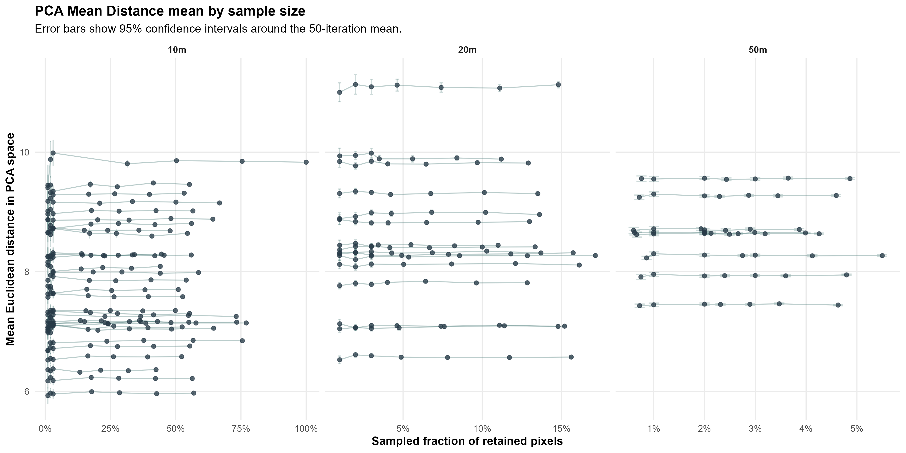

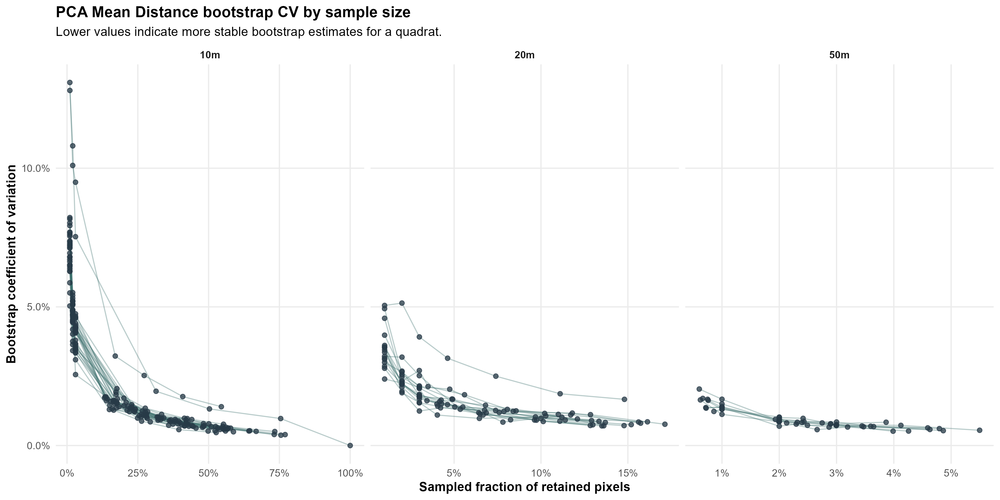

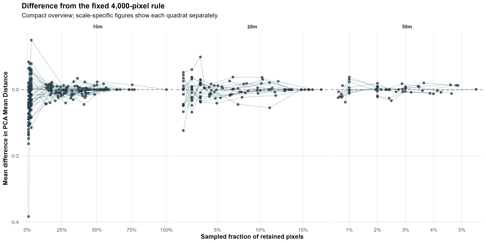

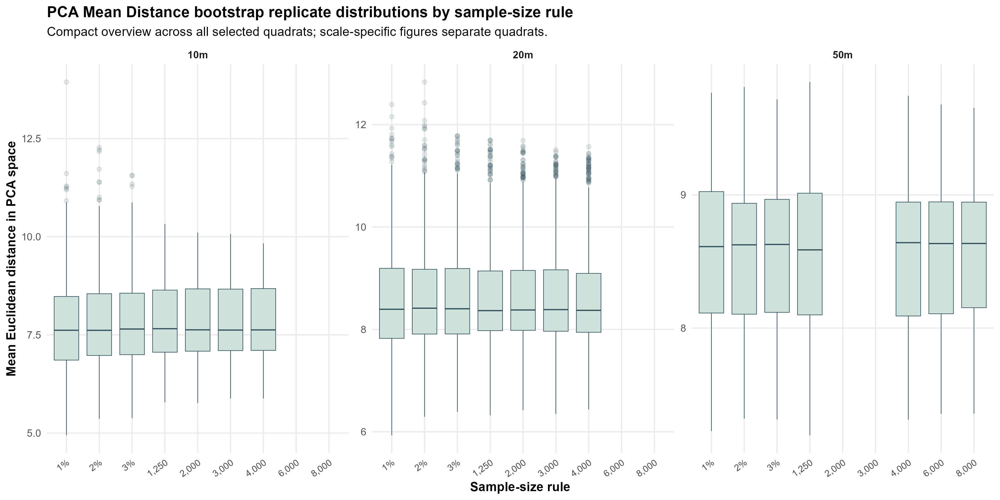

### PCA Mean Distance: 10m Scale Figures

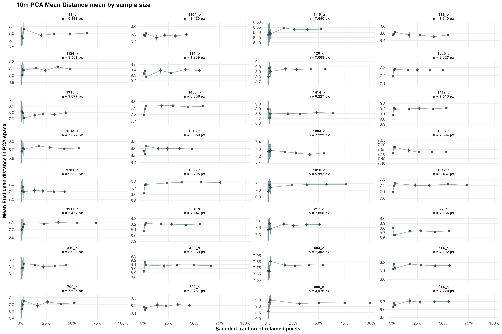

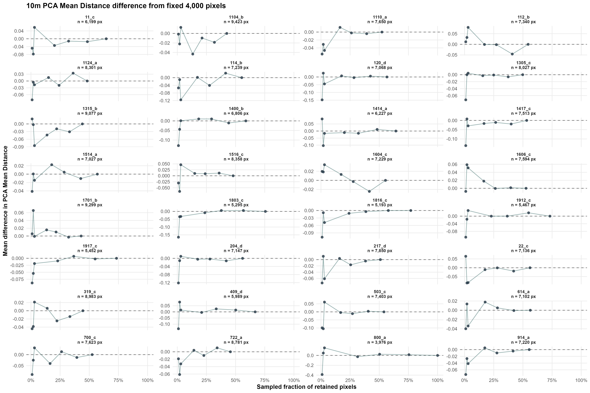

### PCA Mean Distance: 10m Distribution Charts Split By Sample Size

- [10m 1%](../figures/sample_size_effects/pca_mean_distance/distributions_by_sample_size/pca_mean_distance_replicate_distribution_10m_pct_1.png)
- [10m 2%](../figures/sample_size_effects/pca_mean_distance/distributions_by_sample_size/pca_mean_distance_replicate_distribution_10m_pct_2.png)
- [10m 3%](../figures/sample_size_effects/pca_mean_distance/distributions_by_sample_size/pca_mean_distance_replicate_distribution_10m_pct_3.png)
- [10m 1,250](../figures/sample_size_effects/pca_mean_distance/distributions_by_sample_size/pca_mean_distance_replicate_distribution_10m_fixed_1250.png)
- [10m 2,000](../figures/sample_size_effects/pca_mean_distance/distributions_by_sample_size/pca_mean_distance_replicate_distribution_10m_fixed_2000.png)
- [10m 3,000](../figures/sample_size_effects/pca_mean_distance/distributions_by_sample_size/pca_mean_distance_replicate_distribution_10m_fixed_3000.png)
- [10m 4,000](../figures/sample_size_effects/pca_mean_distance/distributions_by_sample_size/pca_mean_distance_replicate_distribution_10m_fixed_4000.png)

### PCA Mean Distance: 20m Scale Figures

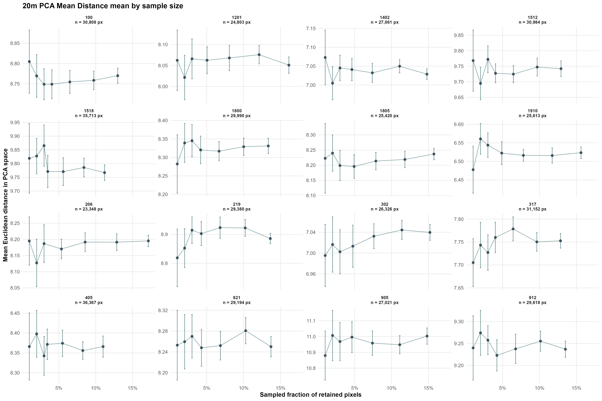

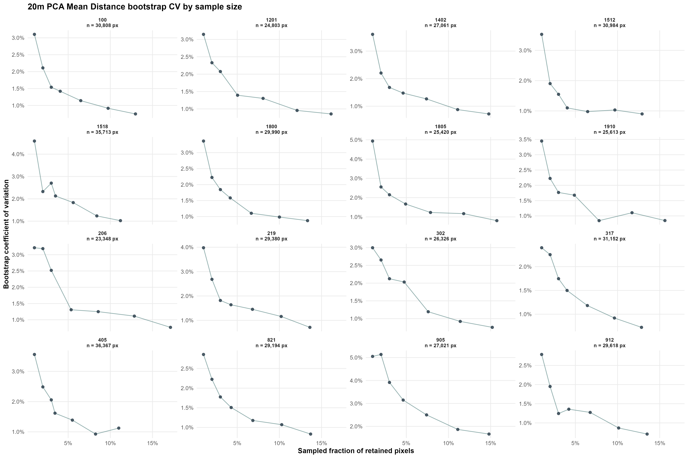

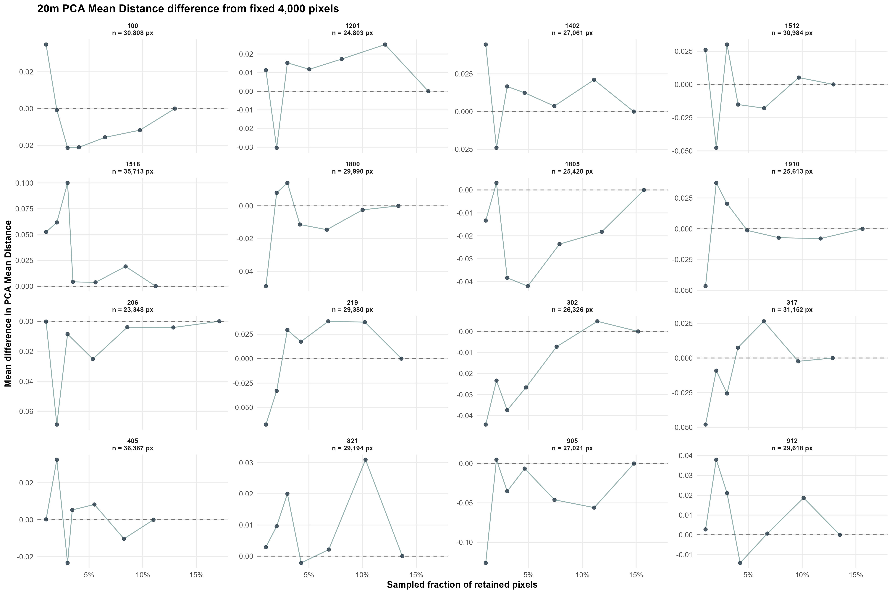

### PCA Mean Distance: 20m Distribution Charts Split By Sample Size

- [20m 1%](../figures/sample_size_effects/pca_mean_distance/distributions_by_sample_size/pca_mean_distance_replicate_distribution_20m_pct_1.png)
- [20m 2%](../figures/sample_size_effects/pca_mean_distance/distributions_by_sample_size/pca_mean_distance_replicate_distribution_20m_pct_2.png)
- [20m 3%](../figures/sample_size_effects/pca_mean_distance/distributions_by_sample_size/pca_mean_distance_replicate_distribution_20m_pct_3.png)
- [20m 1,250](../figures/sample_size_effects/pca_mean_distance/distributions_by_sample_size/pca_mean_distance_replicate_distribution_20m_fixed_1250.png)
- [20m 2,000](../figures/sample_size_effects/pca_mean_distance/distributions_by_sample_size/pca_mean_distance_replicate_distribution_20m_fixed_2000.png)
- [20m 3,000](../figures/sample_size_effects/pca_mean_distance/distributions_by_sample_size/pca_mean_distance_replicate_distribution_20m_fixed_3000.png)
- [20m 4,000](../figures/sample_size_effects/pca_mean_distance/distributions_by_sample_size/pca_mean_distance_replicate_distribution_20m_fixed_4000.png)

### PCA Mean Distance: 50m Scale Figures

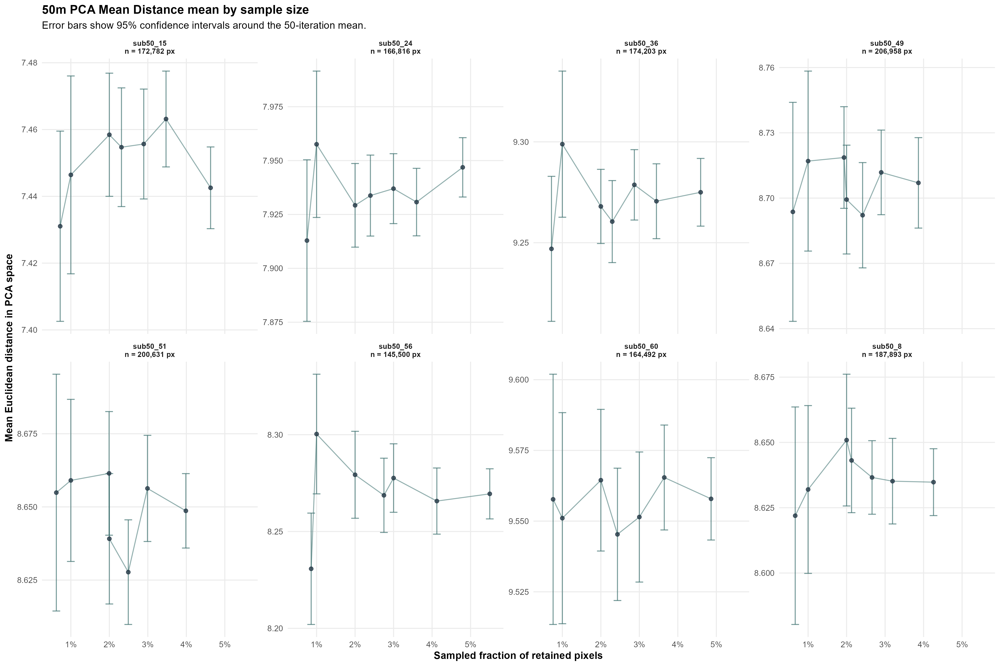

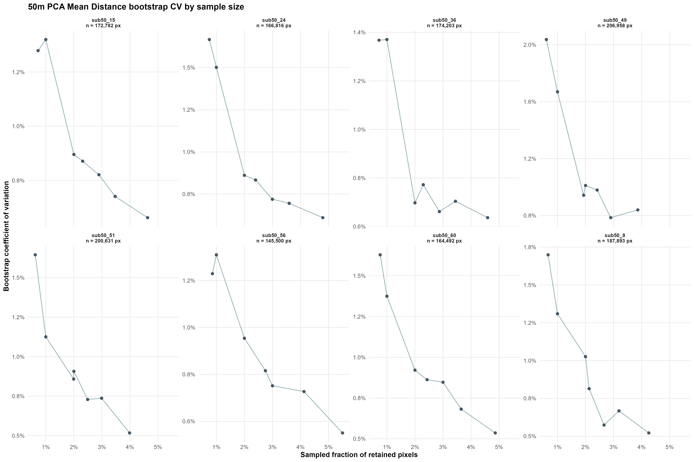

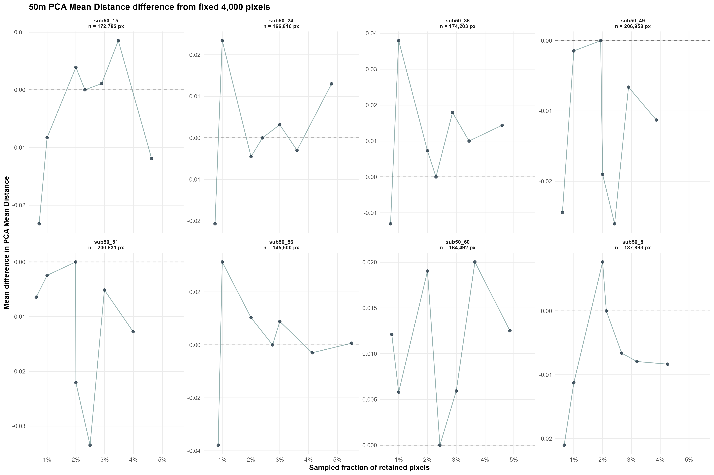

### PCA Mean Distance: 50m Distribution Charts Split By Sample Size

- [50m 1%](../figures/sample_size_effects/pca_mean_distance/distributions_by_sample_size/pca_mean_distance_replicate_distribution_50m_pct_1.png)
- [50m 2%](../figures/sample_size_effects/pca_mean_distance/distributions_by_sample_size/pca_mean_distance_replicate_distribution_50m_pct_2.png)
- [50m 3%](../figures/sample_size_effects/pca_mean_distance/distributions_by_sample_size/pca_mean_distance_replicate_distribution_50m_pct_3.png)
- [50m 1,250](../figures/sample_size_effects/pca_mean_distance/distributions_by_sample_size/pca_mean_distance_replicate_distribution_50m_fixed_1250.png)
- [50m 4,000](../figures/sample_size_effects/pca_mean_distance/distributions_by_sample_size/pca_mean_distance_replicate_distribution_50m_fixed_4000.png)
- [50m 6,000](../figures/sample_size_effects/pca_mean_distance/distributions_by_sample_size/pca_mean_distance_replicate_distribution_50m_fixed_6000.png)
- [50m 8,000](../figures/sample_size_effects/pca_mean_distance/distributions_by_sample_size/pca_mean_distance_replicate_distribution_50m_fixed_8000.png)

Output tables:

- `reports/tables/sample_size_effects/pca_mean_distance/pca_mean_distance_sample_size_design.csv`
- `reports/tables/sample_size_effects/pca_mean_distance/pca_mean_distance_sample_size_boot_long.csv`
- `reports/tables/sample_size_effects/pca_mean_distance/pca_mean_distance_sample_size_summary.csv`

## Spectral Rao's Q

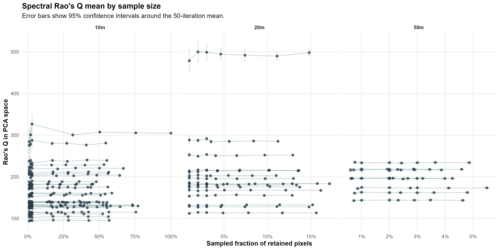

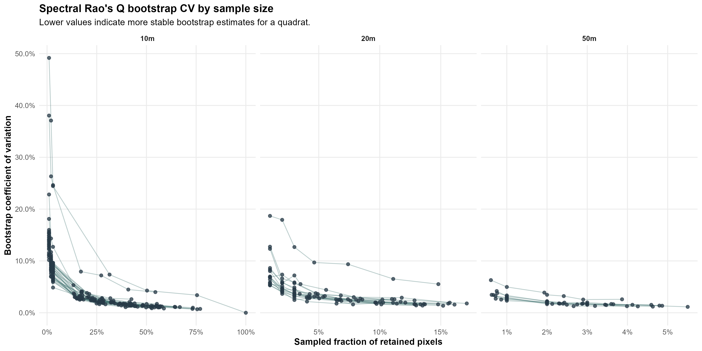

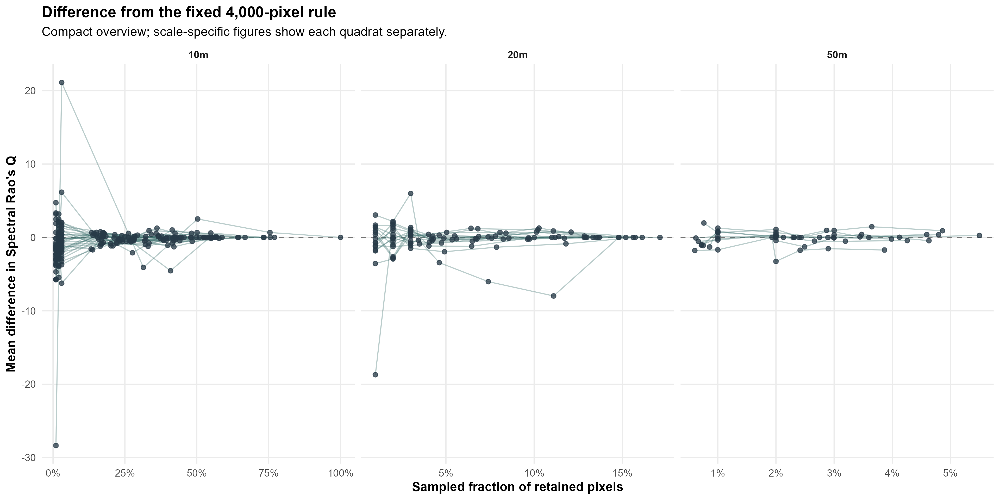

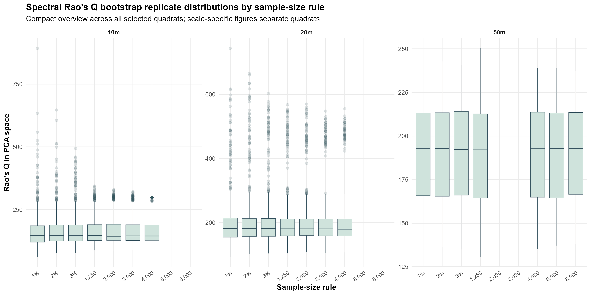

### Spectral Rao's Q: 10m Scale Figures

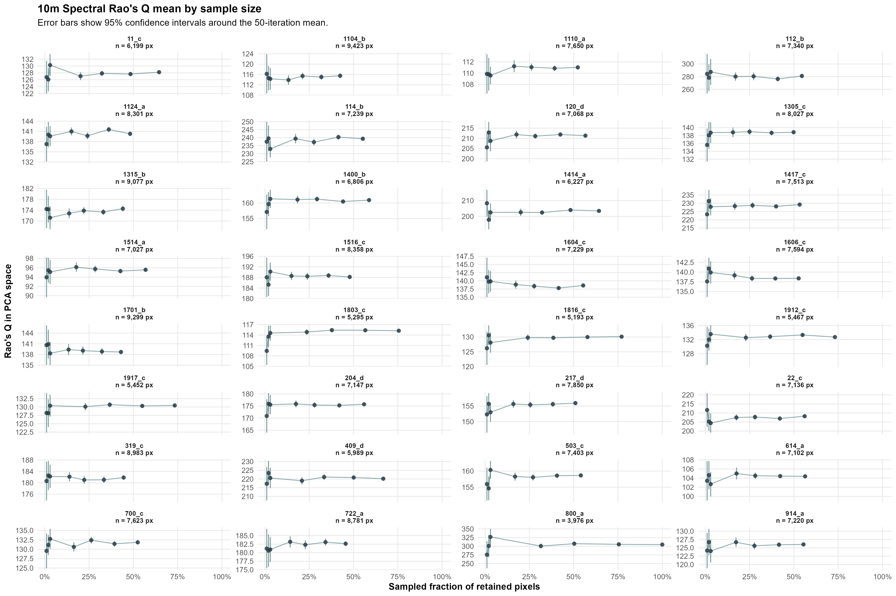

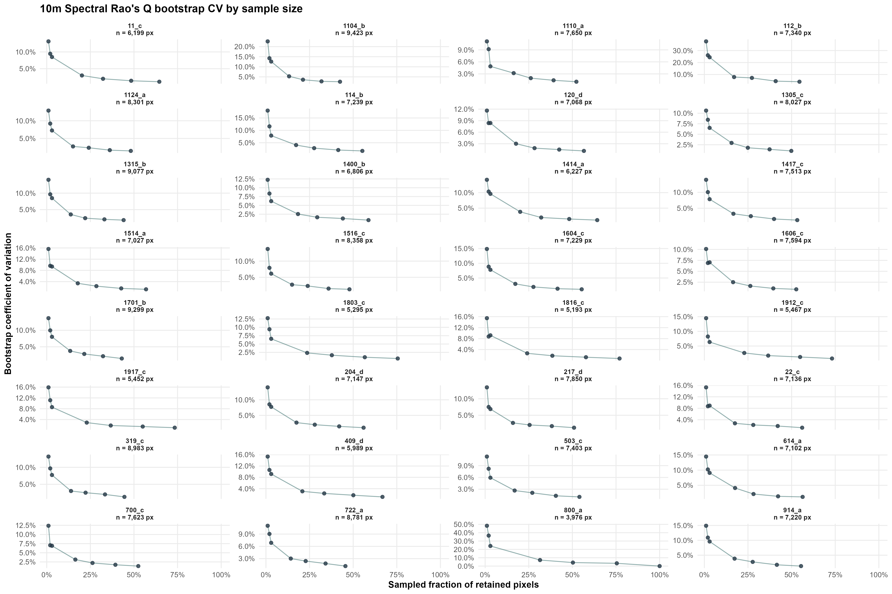

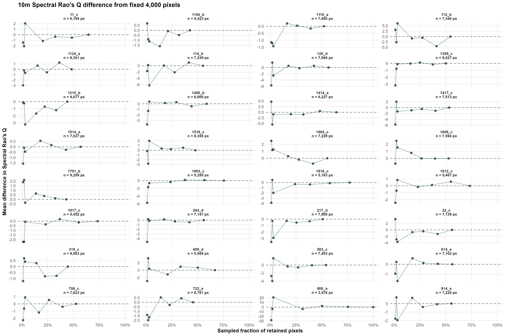

### Spectral Rao's Q: 10m Distribution Charts Split By Sample Size

- [10m 1%](../figures/sample_size_effects/spectral_rao_q/distributions_by_sample_size/spectral_rao_q_replicate_distribution_10m_pct_1.png)
- [10m 2%](../figures/sample_size_effects/spectral_rao_q/distributions_by_sample_size/spectral_rao_q_replicate_distribution_10m_pct_2.png)
- [10m 3%](../figures/sample_size_effects/spectral_rao_q/distributions_by_sample_size/spectral_rao_q_replicate_distribution_10m_pct_3.png)
- [10m 1,250](../figures/sample_size_effects/spectral_rao_q/distributions_by_sample_size/spectral_rao_q_replicate_distribution_10m_fixed_1250.png)
- [10m 2,000](../figures/sample_size_effects/spectral_rao_q/distributions_by_sample_size/spectral_rao_q_replicate_distribution_10m_fixed_2000.png)
- [10m 3,000](../figures/sample_size_effects/spectral_rao_q/distributions_by_sample_size/spectral_rao_q_replicate_distribution_10m_fixed_3000.png)
- [10m 4,000](../figures/sample_size_effects/spectral_rao_q/distributions_by_sample_size/spectral_rao_q_replicate_distribution_10m_fixed_4000.png)

### Spectral Rao's Q: 20m Scale Figures

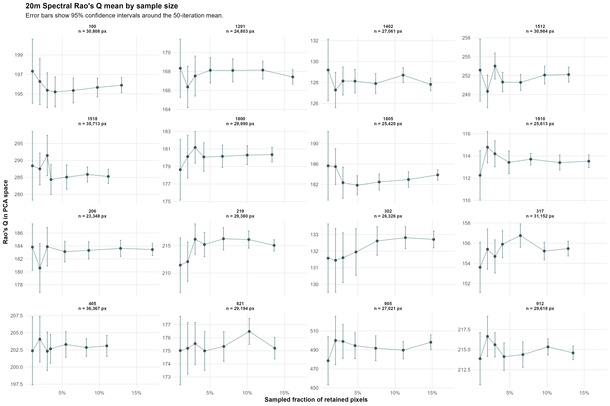

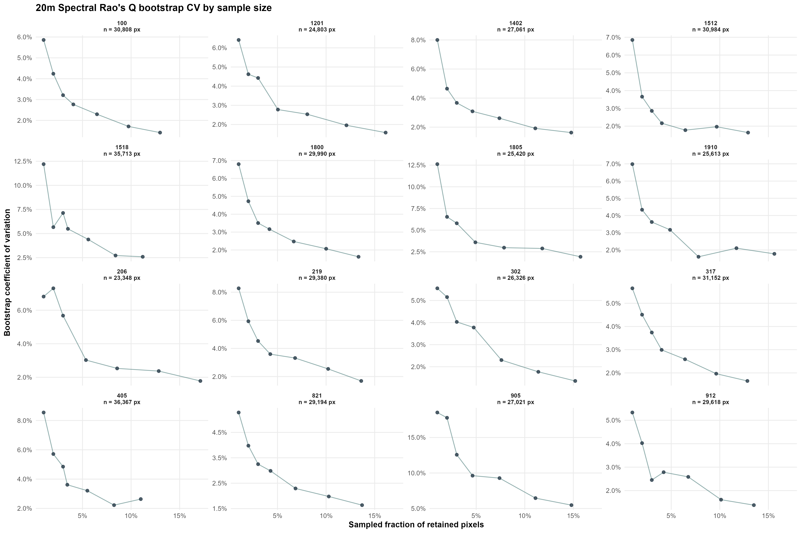

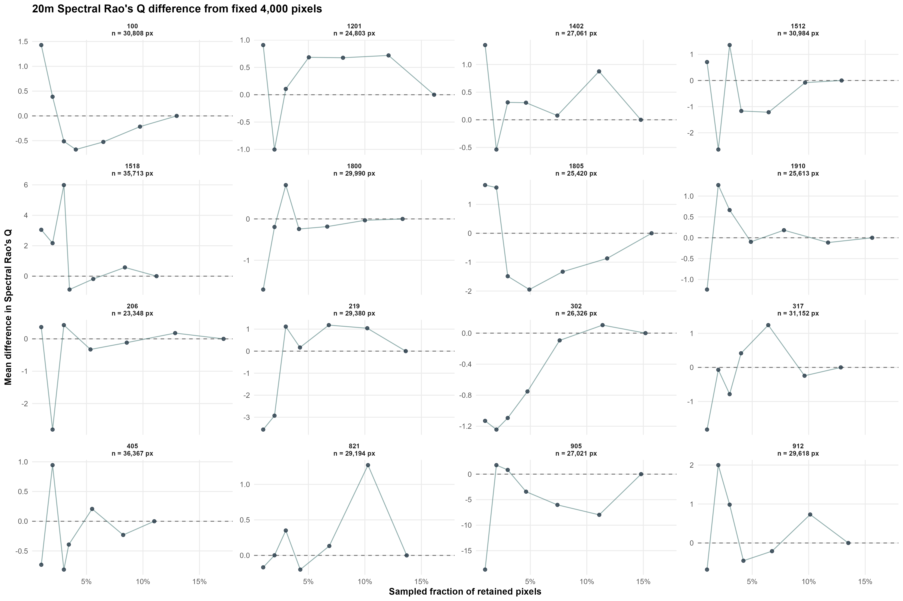

### Spectral Rao's Q: 20m Distribution Charts Split By Sample Size

- [20m 1%](../figures/sample_size_effects/spectral_rao_q/distributions_by_sample_size/spectral_rao_q_replicate_distribution_20m_pct_1.png)
- [20m 2%](../figures/sample_size_effects/spectral_rao_q/distributions_by_sample_size/spectral_rao_q_replicate_distribution_20m_pct_2.png)
- [20m 3%](../figures/sample_size_effects/spectral_rao_q/distributions_by_sample_size/spectral_rao_q_replicate_distribution_20m_pct_3.png)
- [20m 1,250](../figures/sample_size_effects/spectral_rao_q/distributions_by_sample_size/spectral_rao_q_replicate_distribution_20m_fixed_1250.png)
- [20m 2,000](../figures/sample_size_effects/spectral_rao_q/distributions_by_sample_size/spectral_rao_q_replicate_distribution_20m_fixed_2000.png)
- [20m 3,000](../figures/sample_size_effects/spectral_rao_q/distributions_by_sample_size/spectral_rao_q_replicate_distribution_20m_fixed_3000.png)
- [20m 4,000](../figures/sample_size_effects/spectral_rao_q/distributions_by_sample_size/spectral_rao_q_replicate_distribution_20m_fixed_4000.png)

### Spectral Rao's Q: 50m Scale Figures

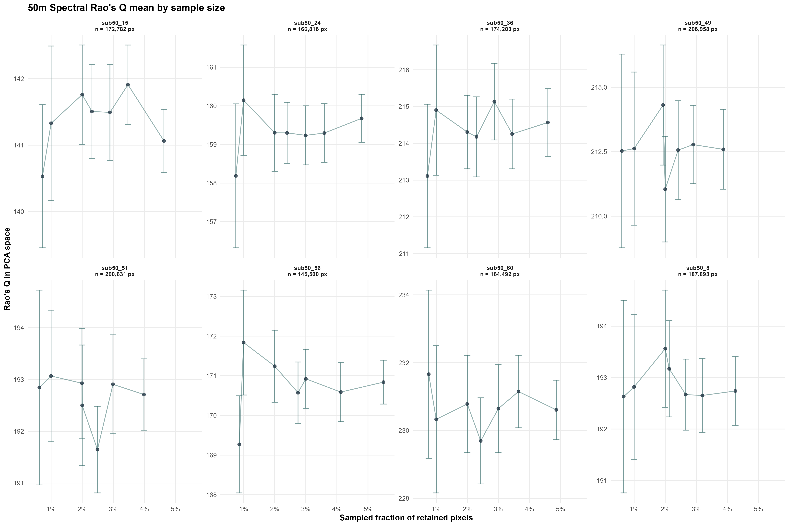

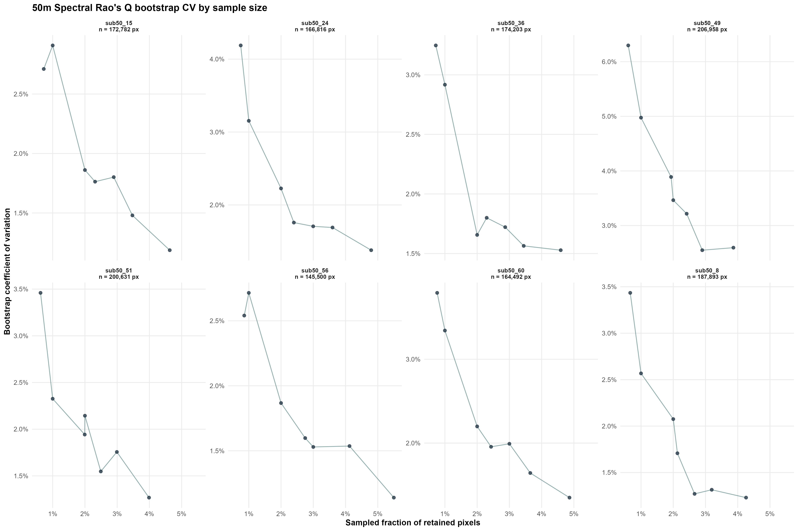

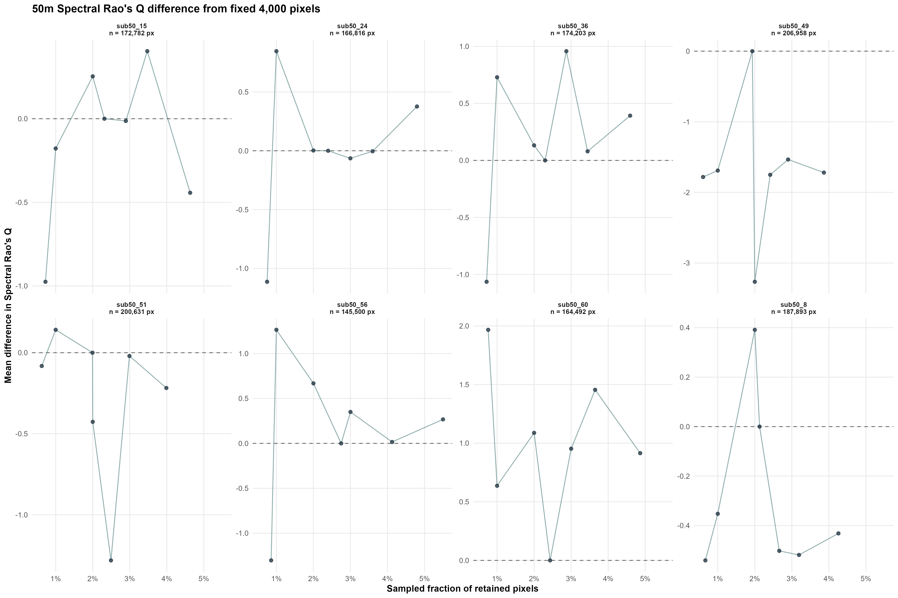

### Spectral Rao's Q: 50m Distribution Charts Split By Sample Size

- [50m 1%](../figures/sample_size_effects/spectral_rao_q/distributions_by_sample_size/spectral_rao_q_replicate_distribution_50m_pct_1.png)
- [50m 2%](../figures/sample_size_effects/spectral_rao_q/distributions_by_sample_size/spectral_rao_q_replicate_distribution_50m_pct_2.png)
- [50m 3%](../figures/sample_size_effects/spectral_rao_q/distributions_by_sample_size/spectral_rao_q_replicate_distribution_50m_pct_3.png)
- [50m 1,250](../figures/sample_size_effects/spectral_rao_q/distributions_by_sample_size/spectral_rao_q_replicate_distribution_50m_fixed_1250.png)
- [50m 4,000](../figures/sample_size_effects/spectral_rao_q/distributions_by_sample_size/spectral_rao_q_replicate_distribution_50m_fixed_4000.png)
- [50m 6,000](../figures/sample_size_effects/spectral_rao_q/distributions_by_sample_size/spectral_rao_q_replicate_distribution_50m_fixed_6000.png)
- [50m 8,000](../figures/sample_size_effects/spectral_rao_q/distributions_by_sample_size/spectral_rao_q_replicate_distribution_50m_fixed_8000.png)

Output tables:

- `reports/tables/sample_size_effects/spectral_rao_q/spectral_rao_q_sample_size_design.csv`
- `reports/tables/sample_size_effects/spectral_rao_q/spectral_rao_q_sample_size_boot_long.csv`
- `reports/tables/sample_size_effects/spectral_rao_q/spectral_rao_q_sample_size_summary.csv`

## Alpha-Hull Area

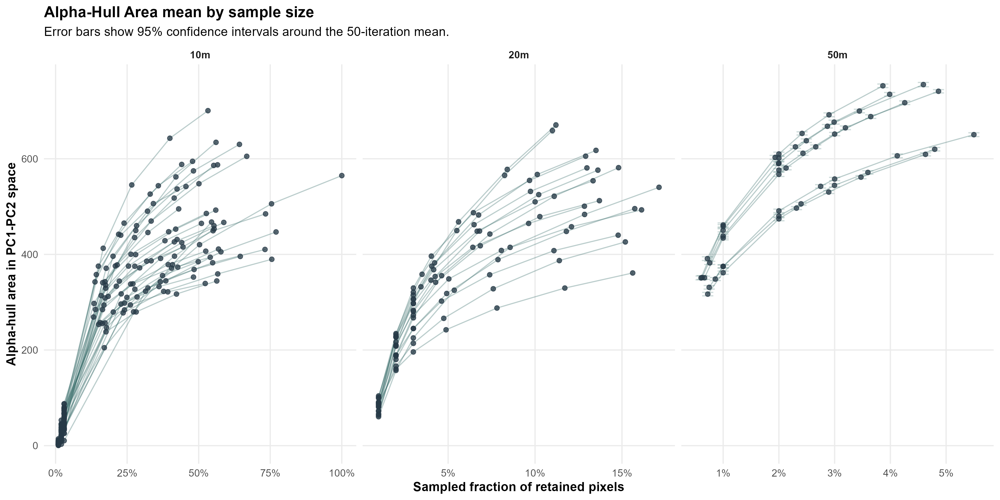

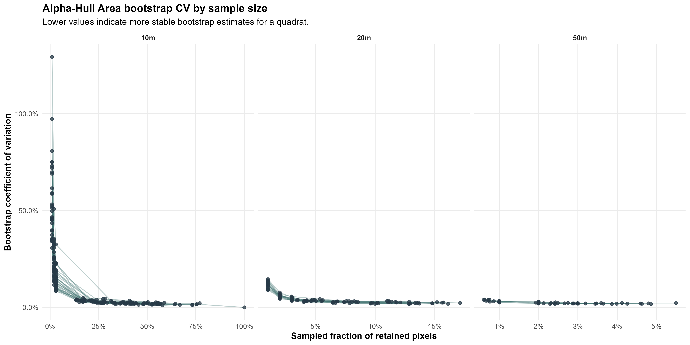

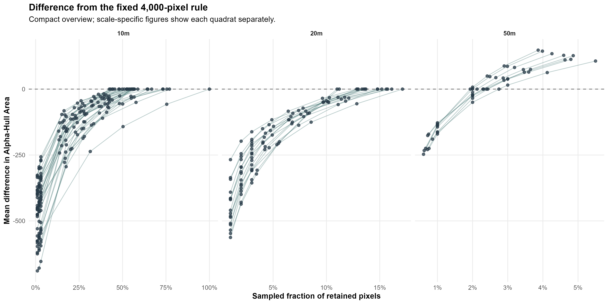

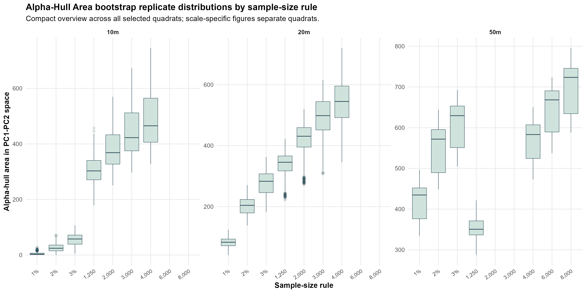

### Alpha-Hull Area: 10m Scale Figures

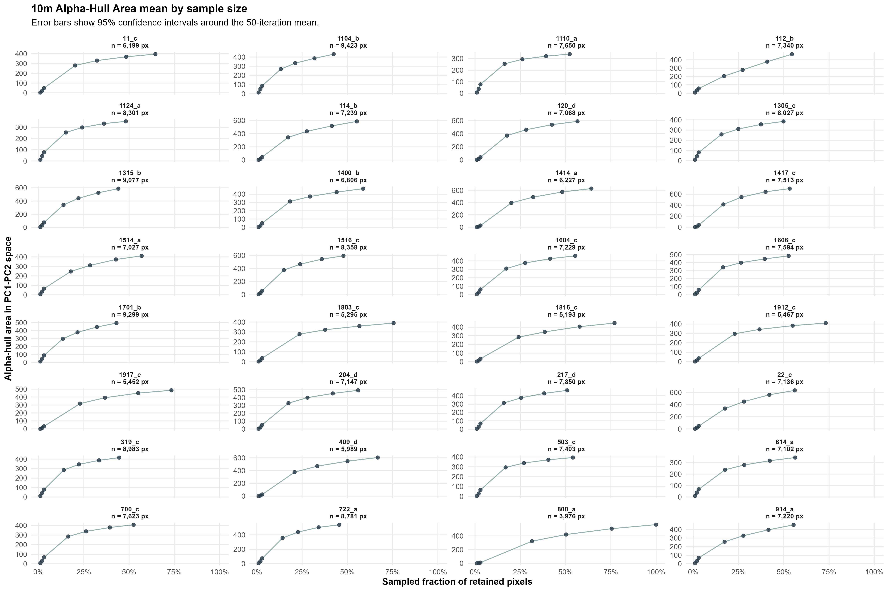

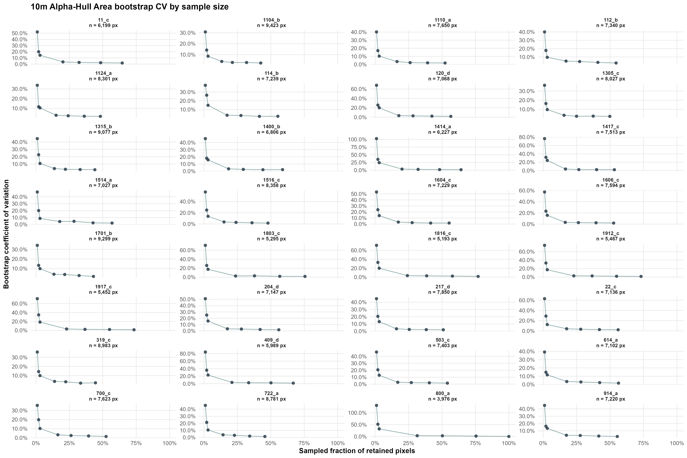

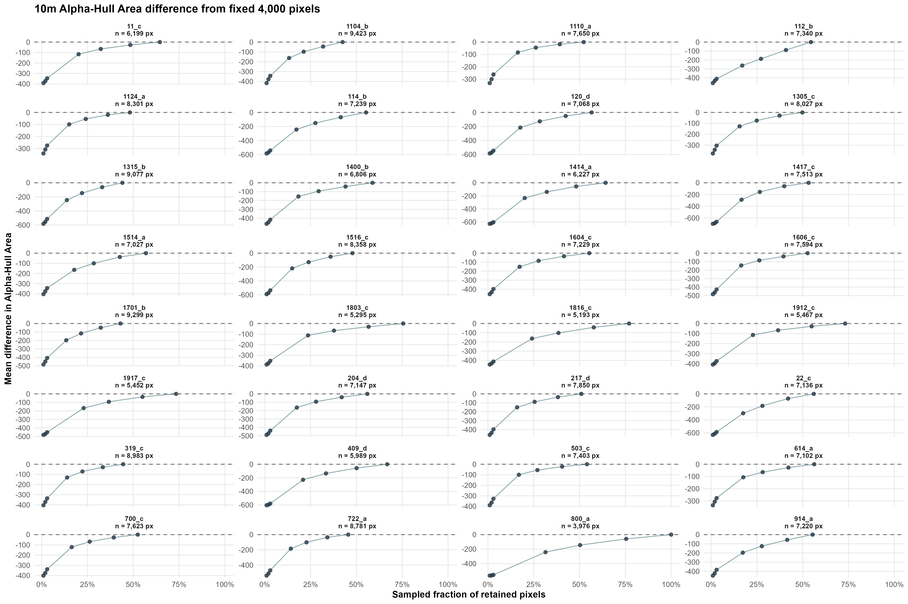

### Alpha-Hull Area: 10m Distribution Charts Split By Sample Size

- [10m 1%](../figures/sample_size_effects/alpha_hull_area/distributions_by_sample_size/alpha_hull_area_replicate_distribution_10m_pct_1.png)
- [10m 2%](../figures/sample_size_effects/alpha_hull_area/distributions_by_sample_size/alpha_hull_area_replicate_distribution_10m_pct_2.png)
- [10m 3%](../figures/sample_size_effects/alpha_hull_area/distributions_by_sample_size/alpha_hull_area_replicate_distribution_10m_pct_3.png)
- [10m 1,250](../figures/sample_size_effects/alpha_hull_area/distributions_by_sample_size/alpha_hull_area_replicate_distribution_10m_fixed_1250.png)
- [10m 2,000](../figures/sample_size_effects/alpha_hull_area/distributions_by_sample_size/alpha_hull_area_replicate_distribution_10m_fixed_2000.png)
- [10m 3,000](../figures/sample_size_effects/alpha_hull_area/distributions_by_sample_size/alpha_hull_area_replicate_distribution_10m_fixed_3000.png)
- [10m 4,000](../figures/sample_size_effects/alpha_hull_area/distributions_by_sample_size/alpha_hull_area_replicate_distribution_10m_fixed_4000.png)

### Alpha-Hull Area: 20m Scale Figures

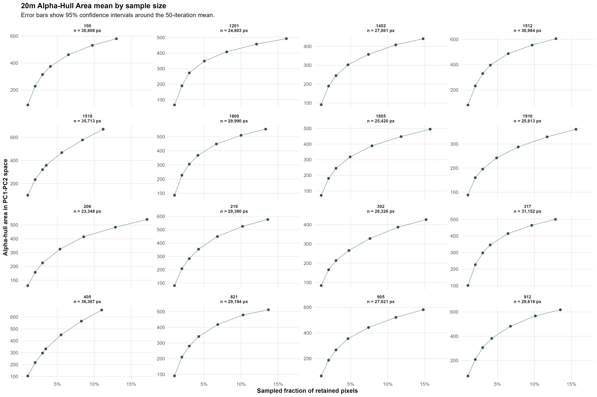

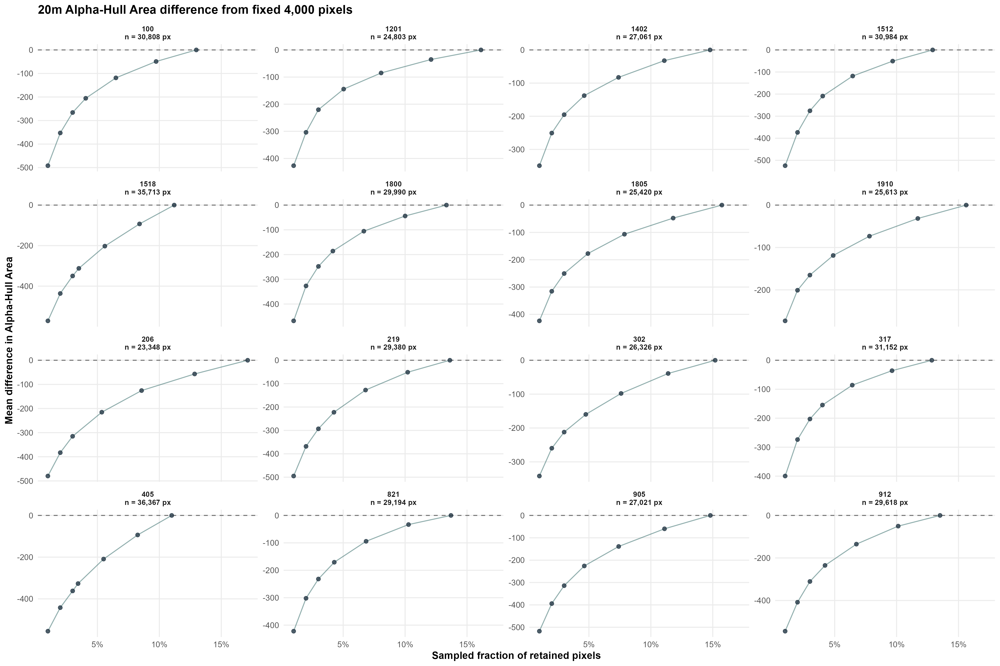

### Alpha-Hull Area: 20m Distribution Charts Split By Sample Size

- [20m 1%](../figures/sample_size_effects/alpha_hull_area/distributions_by_sample_size/alpha_hull_area_replicate_distribution_20m_pct_1.png)
- [20m 2%](../figures/sample_size_effects/alpha_hull_area/distributions_by_sample_size/alpha_hull_area_replicate_distribution_20m_pct_2.png)
- [20m 3%](../figures/sample_size_effects/alpha_hull_area/distributions_by_sample_size/alpha_hull_area_replicate_distribution_20m_pct_3.png)
- [20m 1,250](../figures/sample_size_effects/alpha_hull_area/distributions_by_sample_size/alpha_hull_area_replicate_distribution_20m_fixed_1250.png)
- [20m 2,000](../figures/sample_size_effects/alpha_hull_area/distributions_by_sample_size/alpha_hull_area_replicate_distribution_20m_fixed_2000.png)
- [20m 3,000](../figures/sample_size_effects/alpha_hull_area/distributions_by_sample_size/alpha_hull_area_replicate_distribution_20m_fixed_3000.png)
- [20m 4,000](../figures/sample_size_effects/alpha_hull_area/distributions_by_sample_size/alpha_hull_area_replicate_distribution_20m_fixed_4000.png)

### Alpha-Hull Area: 50m Scale Figures

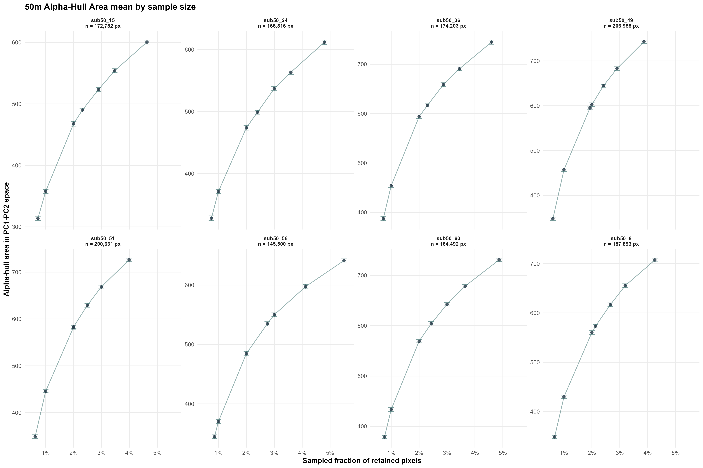

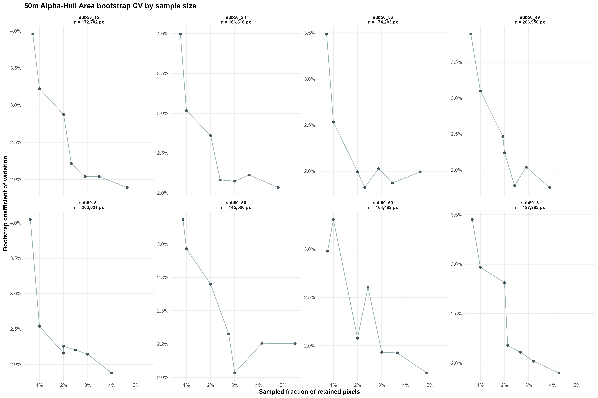

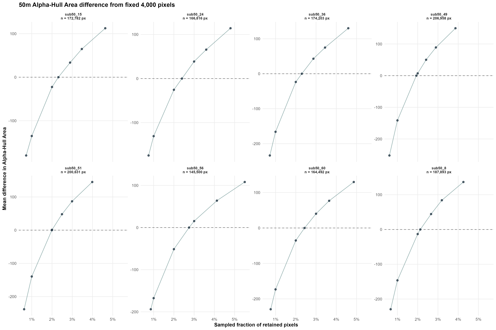

### Alpha-Hull Area: 50m Distribution Charts Split By Sample Size

- [50m 1%](../figures/sample_size_effects/alpha_hull_area/distributions_by_sample_size/alpha_hull_area_replicate_distribution_50m_pct_1.png)
- [50m 2%](../figures/sample_size_effects/alpha_hull_area/distributions_by_sample_size/alpha_hull_area_replicate_distribution_50m_pct_2.png)
- [50m 3%](../figures/sample_size_effects/alpha_hull_area/distributions_by_sample_size/alpha_hull_area_replicate_distribution_50m_pct_3.png)
- [50m 1,250](../figures/sample_size_effects/alpha_hull_area/distributions_by_sample_size/alpha_hull_area_replicate_distribution_50m_fixed_1250.png)
- [50m 4,000](../figures/sample_size_effects/alpha_hull_area/distributions_by_sample_size/alpha_hull_area_replicate_distribution_50m_fixed_4000.png)
- [50m 6,000](../figures/sample_size_effects/alpha_hull_area/distributions_by_sample_size/alpha_hull_area_replicate_distribution_50m_fixed_6000.png)
- [50m 8,000](../figures/sample_size_effects/alpha_hull_area/distributions_by_sample_size/alpha_hull_area_replicate_distribution_50m_fixed_8000.png)

Output tables:

- `reports/tables/sample_size_effects/alpha_hull_area/alpha_hull_area_sample_size_design.csv`
- `reports/tables/sample_size_effects/alpha_hull_area/alpha_hull_area_sample_size_boot_long.csv`
- `reports/tables/sample_size_effects/alpha_hull_area/alpha_hull_area_sample_size_summary.csv`

