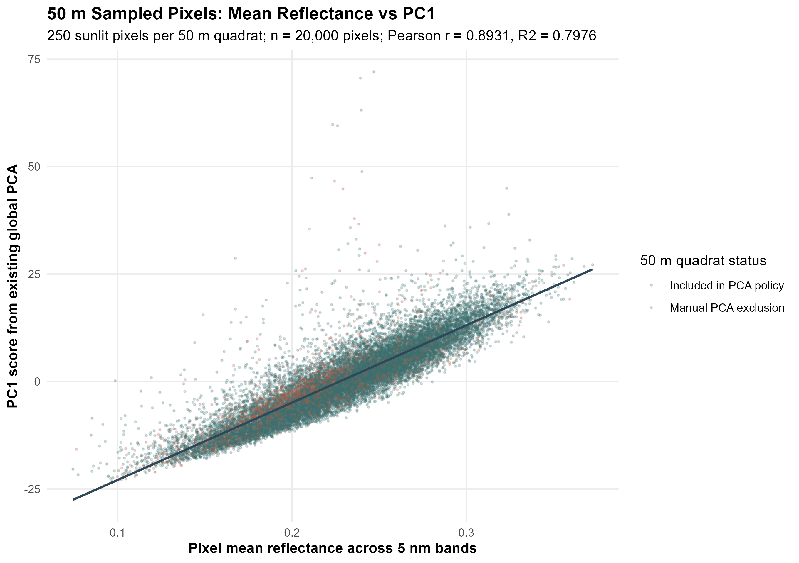
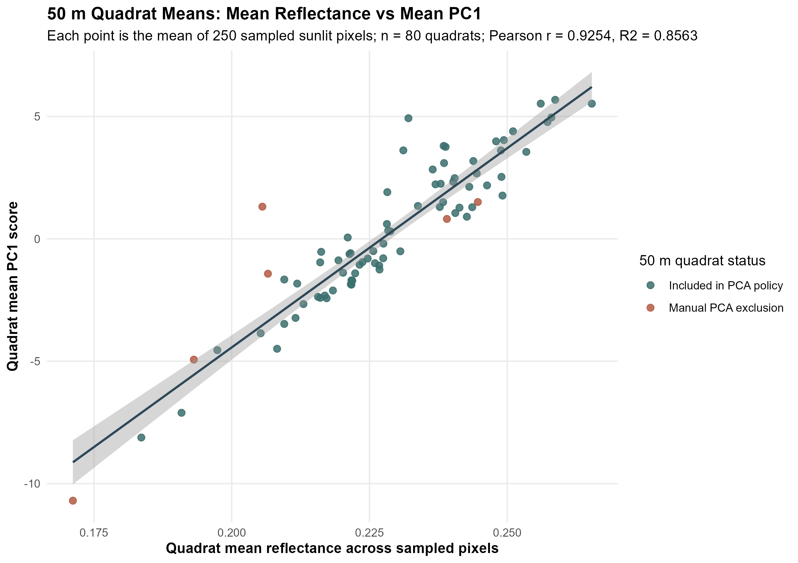

# 50 m PC1 and Mean Reflectance Correlation

Date: 2026-07-06

## Purpose

Evaluate how strongly PC1 from the existing global PCA is associated with simple mean spectral reflectance in the current 50 m quadrat spectra.

## Design

- Sampled pixels: 250 valid sunlit pixels per 50 m quadrat.
- Total sample: 20,000 pixels from 80 quadrats.
- Spectra source: `Quad_Spectra/50m_smooth_5nm/`.
- PCA source: `Quad_Values/Spectral_diversitySHPs/global_pca_smooth_masked_5nm.rds`.
- Shadow mask: retain pixels with `563 nm` reflectance greater than 0.0305476.
- Manual PCA-excluded 50 m quadrats were included in this requested 80-quadrat sample and are flagged in the outputs.

## Results

|analysis_level     | n_rows| n_quadrats| pearson_r| r_squared| p_value| conf_low| conf_high|
|:------------------|------:|----------:|---------:|---------:|-------:|--------:|---------:|
|pixel_level        |  20000|         80|  0.891562|  0.794882|       0| 0.888683|   0.89437|
|quadrat_mean_level |     80|         80|  0.924279|  0.854292|       0| 0.884107|   0.95089|

## Interpretation Notes

- The pixel-level result is the requested 20,000-pixel analysis.
- The quadrat-mean result is a sensitivity check where each quadrat contributes one mean point.
- PC axis signs are arbitrary, so the sign of the correlation reflects the orientation of this saved PCA object.

## Figures

## Output Tables

- `reports/tables/pc1_mean_reflectance_correlation/50m_pc1_mean_reflectance_pixel_sample.csv`
- `reports/tables/pc1_mean_reflectance_correlation/50m_pc1_mean_reflectance_quadrat_means.csv`
- `reports/tables/pc1_mean_reflectance_correlation/50m_pc1_mean_reflectance_correlation_summary.csv`
- `reports/tables/pc1_mean_reflectance_correlation/50m_pc1_mean_reflectance_validation_summary.csv`
