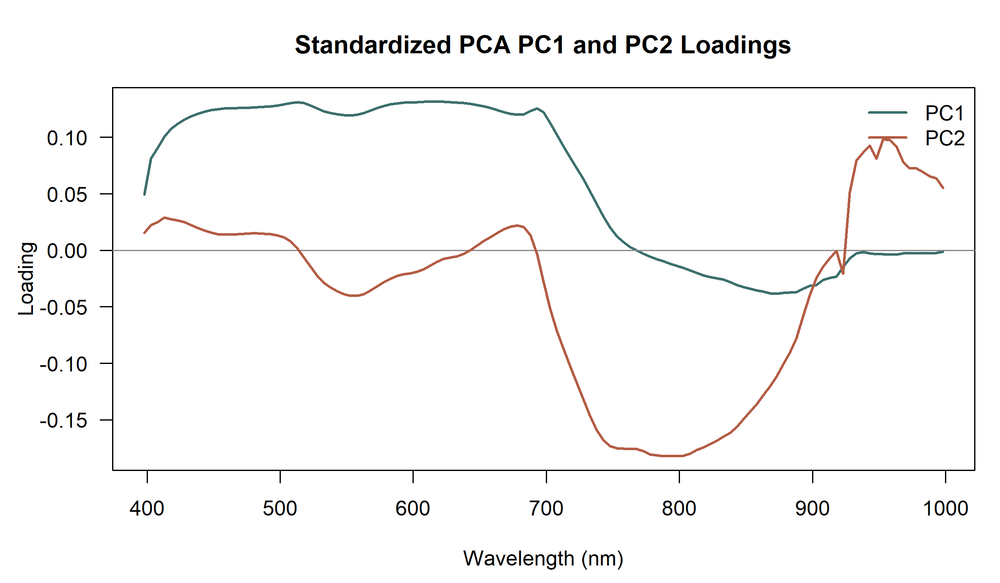
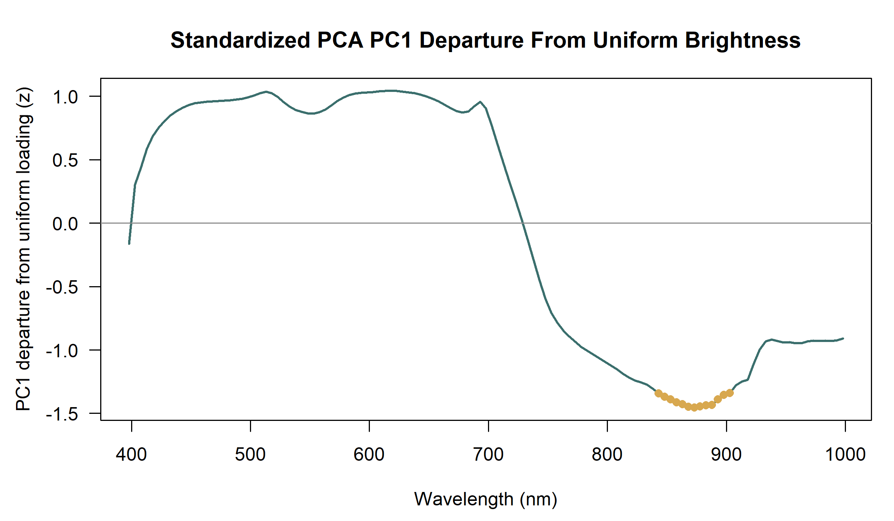
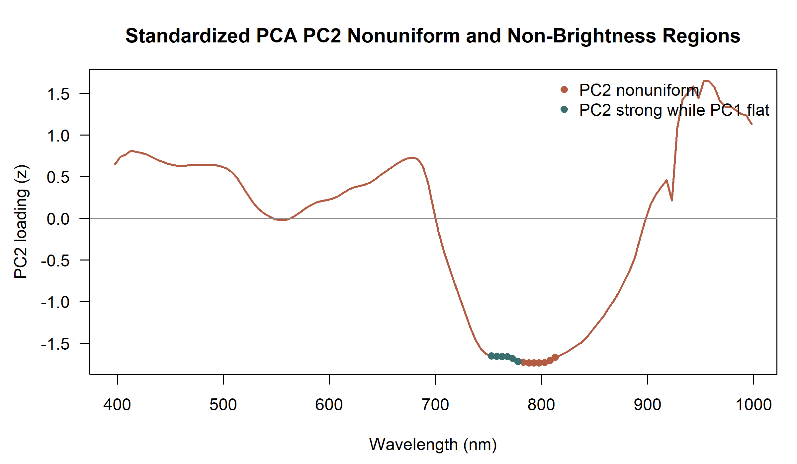
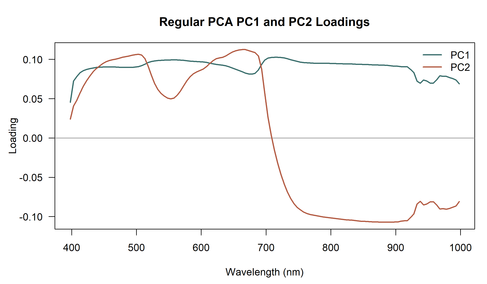

# PCA Loading Spectral Region Analysis

Date: 2026-07-07

## Purpose

Identify where PC1 and PC2 loadings are not spectrally uniform for both the regular PCA and the vector-normalized standardized PCA. The stated key finding is based on the standardized PCA because vector normalization reduces broad brightness dominance before PCA fitting.

## Method

- PC1 was oriented so its mean loading is positive and then compared with a flat brightness vector with loading `1 / sqrt(n_bands)` at every wavelength.
- PC1 nonuniform wavelengths are the top 10% of absolute z-scored departures from that flat brightness vector.
- PC2 nonuniform wavelengths are the top 10% of absolute z-scored PC2 loadings.
- PC2 regions least dominated by brightness are wavelengths with strong PC2 loadings where absolute PC1 departure from uniform brightness is less than 1 z-score.
- Contiguous 5 nm wavelengths meeting each rule were collapsed into spectral regions.

## Key Finding: Standardized PCA

- In the standardized PCA, PC1 is not a simple brightness-only axis; its strongest nonuniform wavelength regions are 843-903 nm.
- Standardized PC2 has concentrated nonuniform structure at 753-813 nm.
- The standardized PC2 regions least attributable to broad PC1 brightness are 753-778 nm. These are the spectral regions to carry forward as the primary loading-based finding.
- PC axis signs are arbitrary; interpret positive and negative loading signs relative to the saved PCA object.

## Standardized PCA Regions

| pca_basis | pca_label | region_type | start_nm | end_nm | n_bands | dominant_zone | peak_wavelength_nm | peak_value | loading_sign |
| --- | --- | --- | --- | --- | --- | --- | --- | --- | --- |
| standardized_PCA | Standardized PCA | PC1 departure from uniform brightness | 843.0000 | 903.0000 | 13.0000 | near infrared | 873.0000 | -1.4561 | negative |
| standardized_PCA | Standardized PCA | PC2 nonuniform loading | 753.0000 | 813.0000 | 13.0000 | near infrared | 793.0000 | -1.7394 | negative |
| standardized_PCA | Standardized PCA | PC2 strong while PC1 is relatively flat | 753.0000 | 778.0000 | 6.0000 | near infrared | 778.0000 | -1.7209 | negative |

## Supporting Regular PCA Comparison

The regular PCA loading regions were also regenerated for traceability, but they are not stated as the key finding because the regular PCA remains more brightness dominated.

| pca_basis | pca_label | region_type | start_nm | end_nm | n_bands | dominant_zone | peak_wavelength_nm | peak_value | loading_sign |
| --- | --- | --- | --- | --- | --- | --- | --- | --- | --- |
| regular_PCA | Regular PCA | PC1 departure from uniform brightness | 398.0000 | 403.0000 | 2.0000 | violet-blue | 398.0000 | -4.9442 | negative |
| regular_PCA | Regular PCA | PC1 departure from uniform brightness | 933.0000 | 963.0000 | 7.0000 | longer near infrared | 938.0000 | -2.2806 | negative |
| regular_PCA | Regular PCA | PC1 departure from uniform brightness | 983.0000 | 998.0000 | 4.0000 | longer near infrared | 998.0000 | -2.3641 | negative |
| regular_PCA | Regular PCA | PC2 nonuniform loading | 498.0000 | 508.0000 | 3.0000 | blue-green | 503.0000 | 1.1762 | positive |
| regular_PCA | Regular PCA | PC2 nonuniform loading | 643.0000 | 683.0000 | 9.0000 | red | 663.0000 | 1.2422 | positive |
| regular_PCA | Regular PCA | PC2 nonuniform loading | 888.0000 | 888.0000 | 1.0000 | near infrared | 888.0000 | -1.1668 | negative |
| regular_PCA | Regular PCA | PC2 strong while PC1 is relatively flat | 498.0000 | 508.0000 | 3.0000 | blue-green | 503.0000 | 1.1762 | positive |
| regular_PCA | Regular PCA | PC2 strong while PC1 is relatively flat | 643.0000 | 673.0000 | 7.0000 | red | 663.0000 | 1.2422 | positive |
| regular_PCA | Regular PCA | PC2 strong while PC1 is relatively flat | 683.0000 | 683.0000 | 1.0000 | red-edge | 683.0000 | 1.1996 | positive |
| regular_PCA | Regular PCA | PC2 strong while PC1 is relatively flat | 888.0000 | 888.0000 | 1.0000 | near infrared | 888.0000 | -1.1668 | negative |

## Summary Checks

| pca_basis | pca_label | metric | value |
| --- | --- | --- | --- |
| regular_PCA | Regular PCA | n_bands | 121.0000 |
| regular_PCA | Regular PCA | wavelength_min_nm | 398.0000 |
| regular_PCA | Regular PCA | wavelength_max_nm | 998.0000 |
| regular_PCA | Regular PCA | pc1_uniform_loading | 0.0909 |
| regular_PCA | Regular PCA | pc1_nonuniform_abs_z_threshold | 1.4736 |
| regular_PCA | Regular PCA | pc2_nonuniform_abs_z_threshold | 1.1654 |
| regular_PCA | Regular PCA | brightness_flat_abs_pc1_departure_z_threshold | 1.0000 |
| regular_PCA | Regular PCA | pc1_nonuniform_band_count | 13.0000 |
| regular_PCA | Regular PCA | pc2_nonuniform_band_count | 13.0000 |
| regular_PCA | Regular PCA | pc2_strong_not_brightness_band_count | 12.0000 |
| standardized_PCA | Standardized PCA | n_bands | 121.0000 |
| standardized_PCA | Standardized PCA | wavelength_min_nm | 398.0000 |
| standardized_PCA | Standardized PCA | wavelength_max_nm | 998.0000 |
| standardized_PCA | Standardized PCA | pc1_uniform_loading | 0.0909 |
| standardized_PCA | Standardized PCA | pc1_nonuniform_abs_z_threshold | 1.3402 |
| standardized_PCA | Standardized PCA | pc2_nonuniform_abs_z_threshold | 1.6531 |
| standardized_PCA | Standardized PCA | brightness_flat_abs_pc1_departure_z_threshold | 1.0000 |
| standardized_PCA | Standardized PCA | pc1_nonuniform_band_count | 13.0000 |
| standardized_PCA | Standardized PCA | pc2_nonuniform_band_count | 13.0000 |
| standardized_PCA | Standardized PCA | pc2_strong_not_brightness_band_count | 6.0000 |

## Figures

## Output Tables

- `reports/tables/pca_loading_spectral_regions/pca_pc1_pc2_loadings_by_wavelength.csv`
- `reports/tables/pca_loading_spectral_regions/pca_pc1_pc2_nonuniform_regions.csv`
- `reports/tables/pca_loading_spectral_regions/pca_pc1_pc2_loading_summary.csv`
