# Standardized PCA-Derived Spectral Metric Sample-Size Effects

Date: 2026-07-07

## Purpose

Extend the sample-size sensitivity analysis from spectral angle entropy to vector-normalized standardized PCA mean distance, spectral Rao's Q, and alpha-hull area.

## Design

- Bootstrap iterations per quadrat x sample rule: 50
- PCA basis: Standardized PCA (`Quad_Values/Spectral_diversitySHPs/standardized_PCA_global_pca_smooth_masked_5nm.rds`).
- Quadrat and sample-size rules are reused from `reports/tables/sample_size_effects/sa_entropy/sa_entropy_sample_size_design.csv` so the non-SA metrics are evaluated on the same quadrats and retained-pixel sample sizes.
- Each replicate samples retained pixels without replacement. If a rule resolves to 100% of retained pixels, the metric is calculated once from the full retained-pixel set and repeated across the 50 output rows, so full-pixel conditions have zero artificial bootstrap variation.
- PCA mean distance and spectral Rao's Q use all sampled pixels in PCA space. Alpha-hull area uses all sampled PC1-PC2 points unless the existing alpha-hull helper has to remove duplicate points or returns an internal failure method.

## Selected Quadrats

|Scale |Quadrat  |Retained pixels |Selection note                                                                              |
|:-----|:--------|:---------------|:-------------------------------------------------------------------------------------------|
|10m   |1104_b   |9,423           |Additional random bootstrap-mean quadrat selected with seed 20260703                        |
|10m   |1110_a   |7,650           |Additional random bootstrap-mean quadrat selected with seed 20260703                        |
|10m   |1124_a   |8,301           |Additional random bootstrap-mean quadrat selected with seed 20260703                        |
|10m   |112_b    |7,340           |Original random bootstrap-mean quadrat selected with seed 20260703                          |
|10m   |114_b    |7,239           |Additional random bootstrap-mean quadrat selected with seed 20260703                        |
|10m   |11_c     |6,199           |Additional random bootstrap-mean quadrat selected with seed 20260703                        |
|10m   |120_d    |7,068           |Additional random bootstrap-mean quadrat selected with seed 20260703                        |
|10m   |1305_c   |8,027           |Additional random bootstrap-mean quadrat selected with seed 20260703                        |
|10m   |1315_b   |9,077           |Additional random bootstrap-mean quadrat selected with seed 20260703                        |
|10m   |1400_b   |6,806           |Additional random bootstrap-mean quadrat selected with seed 20260703                        |
|10m   |1414_a   |6,227           |Additional random bootstrap-mean quadrat selected with seed 20260703                        |
|10m   |1417_c   |7,513           |Additional random bootstrap-mean quadrat selected with seed 20260703                        |
|10m   |1514_a   |7,027           |Additional random bootstrap-mean quadrat selected with seed 20260703                        |
|10m   |1516_c   |8,358           |Additional random bootstrap-mean quadrat selected with seed 20260703                        |
|10m   |1604_c   |7,229           |Additional random bootstrap-mean quadrat selected with seed 20260703                        |
|10m   |1606_c   |7,594           |Additional random bootstrap-mean quadrat selected with seed 20260703                        |
|10m   |1701_b   |9,299           |Additional random bootstrap-mean quadrat selected with seed 20260703                        |
|10m   |1803_c   |5,295           |Additional random bootstrap-mean quadrat selected with seed 20260703                        |
|10m   |1816_c   |5,193           |Additional random bootstrap-mean quadrat selected with seed 20260703                        |
|10m   |1912_c   |5,467           |Additional random bootstrap-mean quadrat selected with seed 20260703                        |
|10m   |1917_c   |5,452           |Additional random bootstrap-mean quadrat selected with seed 20260703                        |
|10m   |204_d    |7,147           |Additional random bootstrap-mean quadrat selected with seed 20260703                        |
|10m   |217_d    |7,850           |Additional random bootstrap-mean quadrat selected with seed 20260703                        |
|10m   |22_c     |7,136           |Additional random bootstrap-mean quadrat selected with seed 20260703                        |
|10m   |319_c    |8,983           |Additional random bootstrap-mean quadrat selected with seed 20260703                        |
|10m   |409_d    |5,989           |Additional random bootstrap-mean quadrat selected with seed 20260703                        |
|10m   |503_c    |7,403           |Additional random bootstrap-mean quadrat selected with seed 20260703                        |
|10m   |614_a    |7,102           |Additional random bootstrap-mean quadrat selected with seed 20260703                        |
|10m   |700_c    |7,623           |Additional random bootstrap-mean quadrat selected with seed 20260703                        |
|10m   |722_a    |8,781           |Additional random bootstrap-mean quadrat selected with seed 20260703                        |
|10m   |800_a    |3,976           |Original 10 m replacement: closest bootstrap-mean quadrat at or below 4,000 retained pixels |
|10m   |914_a    |7,220           |Additional random bootstrap-mean quadrat selected with seed 20260703                        |
|20m   |100      |30,808          |Additional random bootstrap-mean quadrat selected with seed 20260703                        |
|20m   |1201     |24,803          |Additional random bootstrap-mean quadrat selected with seed 20260703                        |
|20m   |1402     |27,061          |Additional random bootstrap-mean quadrat selected with seed 20260703                        |
|20m   |1512     |30,984          |Additional random bootstrap-mean quadrat selected with seed 20260703                        |
|20m   |1518     |35,713          |Additional random bootstrap-mean quadrat selected with seed 20260703                        |
|20m   |1800     |29,990          |Additional random bootstrap-mean quadrat selected with seed 20260703                        |
|20m   |1805     |25,420          |Additional random bootstrap-mean quadrat selected with seed 20260703                        |
|20m   |1910     |25,613          |Additional random bootstrap-mean quadrat selected with seed 20260703                        |
|20m   |206      |23,348          |Additional random bootstrap-mean quadrat selected with seed 20260703                        |
|20m   |219      |29,380          |Original random bootstrap-mean quadrat selected with seed 20260703                          |
|20m   |302      |26,326          |Original random bootstrap-mean quadrat selected with seed 20260703                          |
|20m   |317      |31,152          |Additional random bootstrap-mean quadrat selected with seed 20260703                        |
|20m   |405      |36,367          |Additional random bootstrap-mean quadrat selected with seed 20260703                        |
|20m   |821      |29,194          |Additional random bootstrap-mean quadrat selected with seed 20260703                        |
|20m   |905      |27,021          |Additional random bootstrap-mean quadrat selected with seed 20260703                        |
|20m   |912      |29,618          |Additional random bootstrap-mean quadrat selected with seed 20260703                        |
|50m   |sub50_15 |172,782         |Additional random bootstrap-mean quadrat selected with seed 20260703                        |
|50m   |sub50_24 |166,816         |Additional random bootstrap-mean quadrat selected with seed 20260703                        |
|50m   |sub50_36 |174,203         |Original random bootstrap-mean quadrat selected with seed 20260703                          |
|50m   |sub50_49 |206,958         |Additional random bootstrap-mean quadrat selected with seed 20260703                        |
|50m   |sub50_51 |200,631         |Additional random bootstrap-mean quadrat selected with seed 20260703                        |
|50m   |sub50_56 |145,500         |Additional random bootstrap-mean quadrat selected with seed 20260703                        |
|50m   |sub50_60 |164,492         |Original random bootstrap-mean quadrat selected with seed 20260703                          |
|50m   |sub50_8  |187,893         |Additional random bootstrap-mean quadrat selected with seed 20260703                        |

## Sample Rules

|Scale |Quadrat  |Retained pixels |Sample rule                        |Sample pixels |Sample percent |
|:-----|:--------|:---------------|:----------------------------------|:-------------|:--------------|
|10m   |1104_b   |9,423           |1% of pixels = 94 pixels (1.0%)    |94            |1.0%           |
|10m   |1104_b   |9,423           |2% of pixels = 188 pixels (2.0%)   |188           |2.0%           |
|10m   |1104_b   |9,423           |3% of pixels = 283 pixels (3.0%)   |283           |3.0%           |
|10m   |1104_b   |9,423           |Fixed 1,250 (13.3%)                |1,250         |13.3%          |
|10m   |1104_b   |9,423           |Fixed 2,000 (21.2%)                |2,000         |21.2%          |
|10m   |1104_b   |9,423           |Fixed 3,000 (31.8%)                |3,000         |31.8%          |
|10m   |1104_b   |9,423           |Fixed 4,000 (42.4%)                |4,000         |42.4%          |
|10m   |1110_a   |7,650           |1% of pixels = 76 pixels (1.0%)    |76            |1.0%           |
|10m   |1110_a   |7,650           |2% of pixels = 153 pixels (2.0%)   |153           |2.0%           |
|10m   |1110_a   |7,650           |3% of pixels = 230 pixels (3.0%)   |230           |3.0%           |
|10m   |1110_a   |7,650           |Fixed 1,250 (16.3%)                |1,250         |16.3%          |
|10m   |1110_a   |7,650           |Fixed 2,000 (26.1%)                |2,000         |26.1%          |
|10m   |1110_a   |7,650           |Fixed 3,000 (39.2%)                |3,000         |39.2%          |
|10m   |1110_a   |7,650           |Fixed 4,000 (52.3%)                |4,000         |52.3%          |
|10m   |1124_a   |8,301           |1% of pixels = 83 pixels (1.0%)    |83            |1.0%           |
|10m   |1124_a   |8,301           |2% of pixels = 166 pixels (2.0%)   |166           |2.0%           |
|10m   |1124_a   |8,301           |3% of pixels = 249 pixels (3.0%)   |249           |3.0%           |
|10m   |1124_a   |8,301           |Fixed 1,250 (15.1%)                |1,250         |15.1%          |
|10m   |1124_a   |8,301           |Fixed 2,000 (24.1%)                |2,000         |24.1%          |
|10m   |1124_a   |8,301           |Fixed 3,000 (36.1%)                |3,000         |36.1%          |
|10m   |1124_a   |8,301           |Fixed 4,000 (48.2%)                |4,000         |48.2%          |
|10m   |112_b    |7,340           |1% of pixels = 73 pixels (1.0%)    |73            |1.0%           |
|10m   |112_b    |7,340           |2% of pixels = 147 pixels (2.0%)   |147           |2.0%           |
|10m   |112_b    |7,340           |3% of pixels = 220 pixels (3.0%)   |220           |3.0%           |
|10m   |112_b    |7,340           |Fixed 1,250 (17.0%)                |1,250         |17.0%          |
|10m   |112_b    |7,340           |Fixed 2,000 (27.2%)                |2,000         |27.2%          |
|10m   |112_b    |7,340           |Fixed 3,000 (40.9%)                |3,000         |40.9%          |
|10m   |112_b    |7,340           |Fixed 4,000 (54.5%)                |4,000         |54.5%          |
|10m   |114_b    |7,239           |1% of pixels = 72 pixels (1.0%)    |72            |1.0%           |
|10m   |114_b    |7,239           |2% of pixels = 145 pixels (2.0%)   |145           |2.0%           |
|10m   |114_b    |7,239           |3% of pixels = 217 pixels (3.0%)   |217           |3.0%           |
|10m   |114_b    |7,239           |Fixed 1,250 (17.3%)                |1,250         |17.3%          |
|10m   |114_b    |7,239           |Fixed 2,000 (27.6%)                |2,000         |27.6%          |
|10m   |114_b    |7,239           |Fixed 3,000 (41.4%)                |3,000         |41.4%          |
|10m   |114_b    |7,239           |Fixed 4,000 (55.3%)                |4,000         |55.3%          |
|10m   |11_c     |6,199           |1% of pixels = 62 pixels (1.0%)    |62            |1.0%           |
|10m   |11_c     |6,199           |2% of pixels = 124 pixels (2.0%)   |124           |2.0%           |
|10m   |11_c     |6,199           |3% of pixels = 186 pixels (3.0%)   |186           |3.0%           |
|10m   |11_c     |6,199           |Fixed 1,250 (20.2%)                |1,250         |20.2%          |
|10m   |11_c     |6,199           |Fixed 2,000 (32.3%)                |2,000         |32.3%          |
|10m   |11_c     |6,199           |Fixed 3,000 (48.4%)                |3,000         |48.4%          |
|10m   |11_c     |6,199           |Fixed 4,000 (64.5%)                |4,000         |64.5%          |
|10m   |120_d    |7,068           |1% of pixels = 71 pixels (1.0%)    |71            |1.0%           |
|10m   |120_d    |7,068           |2% of pixels = 141 pixels (2.0%)   |141           |2.0%           |
|10m   |120_d    |7,068           |3% of pixels = 212 pixels (3.0%)   |212           |3.0%           |
|10m   |120_d    |7,068           |Fixed 1,250 (17.7%)                |1,250         |17.7%          |
|10m   |120_d    |7,068           |Fixed 2,000 (28.3%)                |2,000         |28.3%          |
|10m   |120_d    |7,068           |Fixed 3,000 (42.4%)                |3,000         |42.4%          |
|10m   |120_d    |7,068           |Fixed 4,000 (56.6%)                |4,000         |56.6%          |
|10m   |1305_c   |8,027           |1% of pixels = 80 pixels (1.0%)    |80            |1.0%           |
|10m   |1305_c   |8,027           |2% of pixels = 161 pixels (2.0%)   |161           |2.0%           |
|10m   |1305_c   |8,027           |3% of pixels = 241 pixels (3.0%)   |241           |3.0%           |
|10m   |1305_c   |8,027           |Fixed 1,250 (15.6%)                |1,250         |15.6%          |
|10m   |1305_c   |8,027           |Fixed 2,000 (24.9%)                |2,000         |24.9%          |
|10m   |1305_c   |8,027           |Fixed 3,000 (37.4%)                |3,000         |37.4%          |
|10m   |1305_c   |8,027           |Fixed 4,000 (49.8%)                |4,000         |49.8%          |
|10m   |1315_b   |9,077           |1% of pixels = 91 pixels (1.0%)    |91            |1.0%           |
|10m   |1315_b   |9,077           |2% of pixels = 182 pixels (2.0%)   |182           |2.0%           |
|10m   |1315_b   |9,077           |3% of pixels = 272 pixels (3.0%)   |272           |3.0%           |
|10m   |1315_b   |9,077           |Fixed 1,250 (13.8%)                |1,250         |13.8%          |
|10m   |1315_b   |9,077           |Fixed 2,000 (22.0%)                |2,000         |22.0%          |
|10m   |1315_b   |9,077           |Fixed 3,000 (33.1%)                |3,000         |33.1%          |
|10m   |1315_b   |9,077           |Fixed 4,000 (44.1%)                |4,000         |44.1%          |
|10m   |1400_b   |6,806           |1% of pixels = 68 pixels (1.0%)    |68            |1.0%           |
|10m   |1400_b   |6,806           |2% of pixels = 136 pixels (2.0%)   |136           |2.0%           |
|10m   |1400_b   |6,806           |3% of pixels = 204 pixels (3.0%)   |204           |3.0%           |
|10m   |1400_b   |6,806           |Fixed 1,250 (18.4%)                |1,250         |18.4%          |
|10m   |1400_b   |6,806           |Fixed 2,000 (29.4%)                |2,000         |29.4%          |
|10m   |1400_b   |6,806           |Fixed 3,000 (44.1%)                |3,000         |44.1%          |
|10m   |1400_b   |6,806           |Fixed 4,000 (58.8%)                |4,000         |58.8%          |
|10m   |1414_a   |6,227           |1% of pixels = 62 pixels (1.0%)    |62            |1.0%           |
|10m   |1414_a   |6,227           |2% of pixels = 125 pixels (2.0%)   |125           |2.0%           |
|10m   |1414_a   |6,227           |3% of pixels = 187 pixels (3.0%)   |187           |3.0%           |
|10m   |1414_a   |6,227           |Fixed 1,250 (20.1%)                |1,250         |20.1%          |
|10m   |1414_a   |6,227           |Fixed 2,000 (32.1%)                |2,000         |32.1%          |
|10m   |1414_a   |6,227           |Fixed 3,000 (48.2%)                |3,000         |48.2%          |
|10m   |1414_a   |6,227           |Fixed 4,000 (64.2%)                |4,000         |64.2%          |
|10m   |1417_c   |7,513           |1% of pixels = 75 pixels (1.0%)    |75            |1.0%           |
|10m   |1417_c   |7,513           |2% of pixels = 150 pixels (2.0%)   |150           |2.0%           |
|10m   |1417_c   |7,513           |3% of pixels = 225 pixels (3.0%)   |225           |3.0%           |
|10m   |1417_c   |7,513           |Fixed 1,250 (16.6%)                |1,250         |16.6%          |
|10m   |1417_c   |7,513           |Fixed 2,000 (26.6%)                |2,000         |26.6%          |
|10m   |1417_c   |7,513           |Fixed 3,000 (39.9%)                |3,000         |39.9%          |
|10m   |1417_c   |7,513           |Fixed 4,000 (53.2%)                |4,000         |53.2%          |
|10m   |1514_a   |7,027           |1% of pixels = 70 pixels (1.0%)    |70            |1.0%           |
|10m   |1514_a   |7,027           |2% of pixels = 141 pixels (2.0%)   |141           |2.0%           |
|10m   |1514_a   |7,027           |3% of pixels = 211 pixels (3.0%)   |211           |3.0%           |
|10m   |1514_a   |7,027           |Fixed 1,250 (17.8%)                |1,250         |17.8%          |
|10m   |1514_a   |7,027           |Fixed 2,000 (28.5%)                |2,000         |28.5%          |
|10m   |1514_a   |7,027           |Fixed 3,000 (42.7%)                |3,000         |42.7%          |
|10m   |1514_a   |7,027           |Fixed 4,000 (56.9%)                |4,000         |56.9%          |
|10m   |1516_c   |8,358           |1% of pixels = 84 pixels (1.0%)    |84            |1.0%           |
|10m   |1516_c   |8,358           |2% of pixels = 167 pixels (2.0%)   |167           |2.0%           |
|10m   |1516_c   |8,358           |3% of pixels = 251 pixels (3.0%)   |251           |3.0%           |
|10m   |1516_c   |8,358           |Fixed 1,250 (15.0%)                |1,250         |15.0%          |
|10m   |1516_c   |8,358           |Fixed 2,000 (23.9%)                |2,000         |23.9%          |
|10m   |1516_c   |8,358           |Fixed 3,000 (35.9%)                |3,000         |35.9%          |
|10m   |1516_c   |8,358           |Fixed 4,000 (47.9%)                |4,000         |47.9%          |
|10m   |1604_c   |7,229           |1% of pixels = 72 pixels (1.0%)    |72            |1.0%           |
|10m   |1604_c   |7,229           |2% of pixels = 145 pixels (2.0%)   |145           |2.0%           |
|10m   |1604_c   |7,229           |3% of pixels = 217 pixels (3.0%)   |217           |3.0%           |
|10m   |1604_c   |7,229           |Fixed 1,250 (17.3%)                |1,250         |17.3%          |
|10m   |1604_c   |7,229           |Fixed 2,000 (27.7%)                |2,000         |27.7%          |
|10m   |1604_c   |7,229           |Fixed 3,000 (41.5%)                |3,000         |41.5%          |
|10m   |1604_c   |7,229           |Fixed 4,000 (55.3%)                |4,000         |55.3%          |
|10m   |1606_c   |7,594           |1% of pixels = 76 pixels (1.0%)    |76            |1.0%           |
|10m   |1606_c   |7,594           |2% of pixels = 152 pixels (2.0%)   |152           |2.0%           |
|10m   |1606_c   |7,594           |3% of pixels = 228 pixels (3.0%)   |228           |3.0%           |
|10m   |1606_c   |7,594           |Fixed 1,250 (16.5%)                |1,250         |16.5%          |
|10m   |1606_c   |7,594           |Fixed 2,000 (26.3%)                |2,000         |26.3%          |
|10m   |1606_c   |7,594           |Fixed 3,000 (39.5%)                |3,000         |39.5%          |
|10m   |1606_c   |7,594           |Fixed 4,000 (52.7%)                |4,000         |52.7%          |
|10m   |1701_b   |9,299           |1% of pixels = 93 pixels (1.0%)    |93            |1.0%           |
|10m   |1701_b   |9,299           |2% of pixels = 186 pixels (2.0%)   |186           |2.0%           |
|10m   |1701_b   |9,299           |3% of pixels = 279 pixels (3.0%)   |279           |3.0%           |
|10m   |1701_b   |9,299           |Fixed 1,250 (13.4%)                |1,250         |13.4%          |
|10m   |1701_b   |9,299           |Fixed 2,000 (21.5%)                |2,000         |21.5%          |
|10m   |1701_b   |9,299           |Fixed 3,000 (32.3%)                |3,000         |32.3%          |
|10m   |1701_b   |9,299           |Fixed 4,000 (43.0%)                |4,000         |43.0%          |
|10m   |1803_c   |5,295           |1% of pixels = 53 pixels (1.0%)    |53            |1.0%           |
|10m   |1803_c   |5,295           |2% of pixels = 106 pixels (2.0%)   |106           |2.0%           |
|10m   |1803_c   |5,295           |3% of pixels = 159 pixels (3.0%)   |159           |3.0%           |
|10m   |1803_c   |5,295           |Fixed 1,250 (23.6%)                |1,250         |23.6%          |
|10m   |1803_c   |5,295           |Fixed 2,000 (37.8%)                |2,000         |37.8%          |
|10m   |1803_c   |5,295           |Fixed 3,000 (56.7%)                |3,000         |56.7%          |
|10m   |1803_c   |5,295           |Fixed 4,000 (75.5%)                |4,000         |75.5%          |
|10m   |1816_c   |5,193           |1% of pixels = 52 pixels (1.0%)    |52            |1.0%           |
|10m   |1816_c   |5,193           |2% of pixels = 104 pixels (2.0%)   |104           |2.0%           |
|10m   |1816_c   |5,193           |3% of pixels = 156 pixels (3.0%)   |156           |3.0%           |
|10m   |1816_c   |5,193           |Fixed 1,250 (24.1%)                |1,250         |24.1%          |
|10m   |1816_c   |5,193           |Fixed 2,000 (38.5%)                |2,000         |38.5%          |
|10m   |1816_c   |5,193           |Fixed 3,000 (57.8%)                |3,000         |57.8%          |
|10m   |1816_c   |5,193           |Fixed 4,000 (77.0%)                |4,000         |77.0%          |
|10m   |1912_c   |5,467           |1% of pixels = 55 pixels (1.0%)    |55            |1.0%           |
|10m   |1912_c   |5,467           |2% of pixels = 109 pixels (2.0%)   |109           |2.0%           |
|10m   |1912_c   |5,467           |3% of pixels = 164 pixels (3.0%)   |164           |3.0%           |
|10m   |1912_c   |5,467           |Fixed 1,250 (22.9%)                |1,250         |22.9%          |
|10m   |1912_c   |5,467           |Fixed 2,000 (36.6%)                |2,000         |36.6%          |
|10m   |1912_c   |5,467           |Fixed 3,000 (54.9%)                |3,000         |54.9%          |
|10m   |1912_c   |5,467           |Fixed 4,000 (73.2%)                |4,000         |73.2%          |
|10m   |1917_c   |5,452           |1% of pixels = 55 pixels (1.0%)    |55            |1.0%           |
|10m   |1917_c   |5,452           |2% of pixels = 109 pixels (2.0%)   |109           |2.0%           |
|10m   |1917_c   |5,452           |3% of pixels = 164 pixels (3.0%)   |164           |3.0%           |
|10m   |1917_c   |5,452           |Fixed 1,250 (22.9%)                |1,250         |22.9%          |
|10m   |1917_c   |5,452           |Fixed 2,000 (36.7%)                |2,000         |36.7%          |
|10m   |1917_c   |5,452           |Fixed 3,000 (55.0%)                |3,000         |55.0%          |
|10m   |1917_c   |5,452           |Fixed 4,000 (73.4%)                |4,000         |73.4%          |
|10m   |204_d    |7,147           |1% of pixels = 71 pixels (1.0%)    |71            |1.0%           |
|10m   |204_d    |7,147           |2% of pixels = 143 pixels (2.0%)   |143           |2.0%           |
|10m   |204_d    |7,147           |3% of pixels = 214 pixels (3.0%)   |214           |3.0%           |
|10m   |204_d    |7,147           |Fixed 1,250 (17.5%)                |1,250         |17.5%          |
|10m   |204_d    |7,147           |Fixed 2,000 (28.0%)                |2,000         |28.0%          |
|10m   |204_d    |7,147           |Fixed 3,000 (42.0%)                |3,000         |42.0%          |
|10m   |204_d    |7,147           |Fixed 4,000 (56.0%)                |4,000         |56.0%          |
|10m   |217_d    |7,850           |1% of pixels = 78 pixels (1.0%)    |78            |1.0%           |
|10m   |217_d    |7,850           |2% of pixels = 157 pixels (2.0%)   |157           |2.0%           |
|10m   |217_d    |7,850           |3% of pixels = 236 pixels (3.0%)   |236           |3.0%           |
|10m   |217_d    |7,850           |Fixed 1,250 (15.9%)                |1,250         |15.9%          |
|10m   |217_d    |7,850           |Fixed 2,000 (25.5%)                |2,000         |25.5%          |
|10m   |217_d    |7,850           |Fixed 3,000 (38.2%)                |3,000         |38.2%          |
|10m   |217_d    |7,850           |Fixed 4,000 (51.0%)                |4,000         |51.0%          |
|10m   |22_c     |7,136           |1% of pixels = 71 pixels (1.0%)    |71            |1.0%           |
|10m   |22_c     |7,136           |2% of pixels = 143 pixels (2.0%)   |143           |2.0%           |
|10m   |22_c     |7,136           |3% of pixels = 214 pixels (3.0%)   |214           |3.0%           |
|10m   |22_c     |7,136           |Fixed 1,250 (17.5%)                |1,250         |17.5%          |
|10m   |22_c     |7,136           |Fixed 2,000 (28.0%)                |2,000         |28.0%          |
|10m   |22_c     |7,136           |Fixed 3,000 (42.0%)                |3,000         |42.0%          |
|10m   |22_c     |7,136           |Fixed 4,000 (56.1%)                |4,000         |56.1%          |
|10m   |319_c    |8,983           |1% of pixels = 90 pixels (1.0%)    |90            |1.0%           |
|10m   |319_c    |8,983           |2% of pixels = 180 pixels (2.0%)   |180           |2.0%           |
|10m   |319_c    |8,983           |3% of pixels = 269 pixels (3.0%)   |269           |3.0%           |
|10m   |319_c    |8,983           |Fixed 1,250 (13.9%)                |1,250         |13.9%          |
|10m   |319_c    |8,983           |Fixed 2,000 (22.3%)                |2,000         |22.3%          |
|10m   |319_c    |8,983           |Fixed 3,000 (33.4%)                |3,000         |33.4%          |
|10m   |319_c    |8,983           |Fixed 4,000 (44.5%)                |4,000         |44.5%          |
|10m   |409_d    |5,989           |1% of pixels = 60 pixels (1.0%)    |60            |1.0%           |
|10m   |409_d    |5,989           |2% of pixels = 120 pixels (2.0%)   |120           |2.0%           |
|10m   |409_d    |5,989           |3% of pixels = 180 pixels (3.0%)   |180           |3.0%           |
|10m   |409_d    |5,989           |Fixed 1,250 (20.9%)                |1,250         |20.9%          |
|10m   |409_d    |5,989           |Fixed 2,000 (33.4%)                |2,000         |33.4%          |
|10m   |409_d    |5,989           |Fixed 3,000 (50.1%)                |3,000         |50.1%          |
|10m   |409_d    |5,989           |Fixed 4,000 (66.8%)                |4,000         |66.8%          |
|10m   |503_c    |7,403           |1% of pixels = 74 pixels (1.0%)    |74            |1.0%           |
|10m   |503_c    |7,403           |2% of pixels = 148 pixels (2.0%)   |148           |2.0%           |
|10m   |503_c    |7,403           |3% of pixels = 222 pixels (3.0%)   |222           |3.0%           |
|10m   |503_c    |7,403           |Fixed 1,250 (16.9%)                |1,250         |16.9%          |
|10m   |503_c    |7,403           |Fixed 2,000 (27.0%)                |2,000         |27.0%          |
|10m   |503_c    |7,403           |Fixed 3,000 (40.5%)                |3,000         |40.5%          |
|10m   |503_c    |7,403           |Fixed 4,000 (54.0%)                |4,000         |54.0%          |
|10m   |614_a    |7,102           |1% of pixels = 71 pixels (1.0%)    |71            |1.0%           |
|10m   |614_a    |7,102           |2% of pixels = 142 pixels (2.0%)   |142           |2.0%           |
|10m   |614_a    |7,102           |3% of pixels = 213 pixels (3.0%)   |213           |3.0%           |
|10m   |614_a    |7,102           |Fixed 1,250 (17.6%)                |1,250         |17.6%          |
|10m   |614_a    |7,102           |Fixed 2,000 (28.2%)                |2,000         |28.2%          |
|10m   |614_a    |7,102           |Fixed 3,000 (42.2%)                |3,000         |42.2%          |
|10m   |614_a    |7,102           |Fixed 4,000 (56.3%)                |4,000         |56.3%          |
|10m   |700_c    |7,623           |1% of pixels = 76 pixels (1.0%)    |76            |1.0%           |
|10m   |700_c    |7,623           |2% of pixels = 152 pixels (2.0%)   |152           |2.0%           |
|10m   |700_c    |7,623           |3% of pixels = 229 pixels (3.0%)   |229           |3.0%           |
|10m   |700_c    |7,623           |Fixed 1,250 (16.4%)                |1,250         |16.4%          |
|10m   |700_c    |7,623           |Fixed 2,000 (26.2%)                |2,000         |26.2%          |
|10m   |700_c    |7,623           |Fixed 3,000 (39.4%)                |3,000         |39.4%          |
|10m   |700_c    |7,623           |Fixed 4,000 (52.5%)                |4,000         |52.5%          |
|10m   |722_a    |8,781           |1% of pixels = 88 pixels (1.0%)    |88            |1.0%           |
|10m   |722_a    |8,781           |2% of pixels = 176 pixels (2.0%)   |176           |2.0%           |
|10m   |722_a    |8,781           |3% of pixels = 263 pixels (3.0%)   |263           |3.0%           |
|10m   |722_a    |8,781           |Fixed 1,250 (14.2%)                |1,250         |14.2%          |
|10m   |722_a    |8,781           |Fixed 2,000 (22.8%)                |2,000         |22.8%          |
|10m   |722_a    |8,781           |Fixed 3,000 (34.2%)                |3,000         |34.2%          |
|10m   |722_a    |8,781           |Fixed 4,000 (45.6%)                |4,000         |45.6%          |
|10m   |800_a    |3,976           |1% of pixels = 40 pixels (1.0%)    |40            |1.0%           |
|10m   |800_a    |3,976           |2% of pixels = 80 pixels (2.0%)    |80            |2.0%           |
|10m   |800_a    |3,976           |3% of pixels = 119 pixels (3.0%)   |119           |3.0%           |
|10m   |800_a    |3,976           |Fixed 1,250 (31.4%)                |1,250         |31.4%          |
|10m   |800_a    |3,976           |Fixed 2,000 (50.3%)                |2,000         |50.3%          |
|10m   |800_a    |3,976           |Fixed 3,000 (75.5%)                |3,000         |75.5%          |
|10m   |800_a    |3,976           |Fixed 4,000 (100.0%)               |3,976         |100.0%         |
|10m   |914_a    |7,220           |1% of pixels = 72 pixels (1.0%)    |72            |1.0%           |
|10m   |914_a    |7,220           |2% of pixels = 144 pixels (2.0%)   |144           |2.0%           |
|10m   |914_a    |7,220           |3% of pixels = 217 pixels (3.0%)   |217           |3.0%           |
|10m   |914_a    |7,220           |Fixed 1,250 (17.3%)                |1,250         |17.3%          |
|10m   |914_a    |7,220           |Fixed 2,000 (27.7%)                |2,000         |27.7%          |
|10m   |914_a    |7,220           |Fixed 3,000 (41.6%)                |3,000         |41.6%          |
|10m   |914_a    |7,220           |Fixed 4,000 (55.4%)                |4,000         |55.4%          |
|20m   |100      |30,808          |1% of pixels = 308 pixels (1.0%)   |308           |1.0%           |
|20m   |100      |30,808          |2% of pixels = 616 pixels (2.0%)   |616           |2.0%           |
|20m   |100      |30,808          |3% of pixels = 924 pixels (3.0%)   |924           |3.0%           |
|20m   |100      |30,808          |Fixed 1,250 (4.1%)                 |1,250         |4.1%           |
|20m   |100      |30,808          |Fixed 2,000 (6.5%)                 |2,000         |6.5%           |
|20m   |100      |30,808          |Fixed 3,000 (9.7%)                 |3,000         |9.7%           |
|20m   |100      |30,808          |Fixed 4,000 (13.0%)                |4,000         |13.0%          |
|20m   |1201     |24,803          |1% of pixels = 248 pixels (1.0%)   |248           |1.0%           |
|20m   |1201     |24,803          |2% of pixels = 496 pixels (2.0%)   |496           |2.0%           |
|20m   |1201     |24,803          |3% of pixels = 744 pixels (3.0%)   |744           |3.0%           |
|20m   |1201     |24,803          |Fixed 1,250 (5.0%)                 |1,250         |5.0%           |
|20m   |1201     |24,803          |Fixed 2,000 (8.1%)                 |2,000         |8.1%           |
|20m   |1201     |24,803          |Fixed 3,000 (12.1%)                |3,000         |12.1%          |
|20m   |1201     |24,803          |Fixed 4,000 (16.1%)                |4,000         |16.1%          |
|20m   |1402     |27,061          |1% of pixels = 271 pixels (1.0%)   |271           |1.0%           |
|20m   |1402     |27,061          |2% of pixels = 541 pixels (2.0%)   |541           |2.0%           |
|20m   |1402     |27,061          |3% of pixels = 812 pixels (3.0%)   |812           |3.0%           |
|20m   |1402     |27,061          |Fixed 1,250 (4.6%)                 |1,250         |4.6%           |
|20m   |1402     |27,061          |Fixed 2,000 (7.4%)                 |2,000         |7.4%           |
|20m   |1402     |27,061          |Fixed 3,000 (11.1%)                |3,000         |11.1%          |
|20m   |1402     |27,061          |Fixed 4,000 (14.8%)                |4,000         |14.8%          |
|20m   |1512     |30,984          |1% of pixels = 310 pixels (1.0%)   |310           |1.0%           |
|20m   |1512     |30,984          |2% of pixels = 620 pixels (2.0%)   |620           |2.0%           |
|20m   |1512     |30,984          |3% of pixels = 930 pixels (3.0%)   |930           |3.0%           |
|20m   |1512     |30,984          |Fixed 1,250 (4.0%)                 |1,250         |4.0%           |
|20m   |1512     |30,984          |Fixed 2,000 (6.5%)                 |2,000         |6.5%           |
|20m   |1512     |30,984          |Fixed 3,000 (9.7%)                 |3,000         |9.7%           |
|20m   |1512     |30,984          |Fixed 4,000 (12.9%)                |4,000         |12.9%          |
|20m   |1518     |35,713          |1% of pixels = 357 pixels (1.0%)   |357           |1.0%           |
|20m   |1518     |35,713          |2% of pixels = 714 pixels (2.0%)   |714           |2.0%           |
|20m   |1518     |35,713          |3% of pixels = 1,071 pixels (3.0%) |1,071         |3.0%           |
|20m   |1518     |35,713          |Fixed 1,250 (3.5%)                 |1,250         |3.5%           |
|20m   |1518     |35,713          |Fixed 2,000 (5.6%)                 |2,000         |5.6%           |
|20m   |1518     |35,713          |Fixed 3,000 (8.4%)                 |3,000         |8.4%           |
|20m   |1518     |35,713          |Fixed 4,000 (11.2%)                |4,000         |11.2%          |
|20m   |1800     |29,990          |1% of pixels = 300 pixels (1.0%)   |300           |1.0%           |
|20m   |1800     |29,990          |2% of pixels = 600 pixels (2.0%)   |600           |2.0%           |
|20m   |1800     |29,990          |3% of pixels = 900 pixels (3.0%)   |900           |3.0%           |
|20m   |1800     |29,990          |Fixed 1,250 (4.2%)                 |1,250         |4.2%           |
|20m   |1800     |29,990          |Fixed 2,000 (6.7%)                 |2,000         |6.7%           |
|20m   |1800     |29,990          |Fixed 3,000 (10.0%)                |3,000         |10.0%          |
|20m   |1800     |29,990          |Fixed 4,000 (13.3%)                |4,000         |13.3%          |
|20m   |1805     |25,420          |1% of pixels = 254 pixels (1.0%)   |254           |1.0%           |
|20m   |1805     |25,420          |2% of pixels = 508 pixels (2.0%)   |508           |2.0%           |
|20m   |1805     |25,420          |3% of pixels = 763 pixels (3.0%)   |763           |3.0%           |
|20m   |1805     |25,420          |Fixed 1,250 (4.9%)                 |1,250         |4.9%           |
|20m   |1805     |25,420          |Fixed 2,000 (7.9%)                 |2,000         |7.9%           |
|20m   |1805     |25,420          |Fixed 3,000 (11.8%)                |3,000         |11.8%          |
|20m   |1805     |25,420          |Fixed 4,000 (15.7%)                |4,000         |15.7%          |
|20m   |1910     |25,613          |1% of pixels = 256 pixels (1.0%)   |256           |1.0%           |
|20m   |1910     |25,613          |2% of pixels = 512 pixels (2.0%)   |512           |2.0%           |
|20m   |1910     |25,613          |3% of pixels = 768 pixels (3.0%)   |768           |3.0%           |
|20m   |1910     |25,613          |Fixed 1,250 (4.9%)                 |1,250         |4.9%           |
|20m   |1910     |25,613          |Fixed 2,000 (7.8%)                 |2,000         |7.8%           |
|20m   |1910     |25,613          |Fixed 3,000 (11.7%)                |3,000         |11.7%          |
|20m   |1910     |25,613          |Fixed 4,000 (15.6%)                |4,000         |15.6%          |
|20m   |206      |23,348          |1% of pixels = 233 pixels (1.0%)   |233           |1.0%           |
|20m   |206      |23,348          |2% of pixels = 467 pixels (2.0%)   |467           |2.0%           |
|20m   |206      |23,348          |3% of pixels = 700 pixels (3.0%)   |700           |3.0%           |
|20m   |206      |23,348          |Fixed 1,250 (5.4%)                 |1,250         |5.4%           |
|20m   |206      |23,348          |Fixed 2,000 (8.6%)                 |2,000         |8.6%           |
|20m   |206      |23,348          |Fixed 3,000 (12.8%)                |3,000         |12.8%          |
|20m   |206      |23,348          |Fixed 4,000 (17.1%)                |4,000         |17.1%          |
|20m   |219      |29,380          |1% of pixels = 294 pixels (1.0%)   |294           |1.0%           |
|20m   |219      |29,380          |2% of pixels = 588 pixels (2.0%)   |588           |2.0%           |
|20m   |219      |29,380          |3% of pixels = 881 pixels (3.0%)   |881           |3.0%           |
|20m   |219      |29,380          |Fixed 1,250 (4.3%)                 |1,250         |4.3%           |
|20m   |219      |29,380          |Fixed 2,000 (6.8%)                 |2,000         |6.8%           |
|20m   |219      |29,380          |Fixed 3,000 (10.2%)                |3,000         |10.2%          |
|20m   |219      |29,380          |Fixed 4,000 (13.6%)                |4,000         |13.6%          |
|20m   |302      |26,326          |1% of pixels = 263 pixels (1.0%)   |263           |1.0%           |
|20m   |302      |26,326          |2% of pixels = 527 pixels (2.0%)   |527           |2.0%           |
|20m   |302      |26,326          |3% of pixels = 790 pixels (3.0%)   |790           |3.0%           |
|20m   |302      |26,326          |Fixed 1,250 (4.7%)                 |1,250         |4.7%           |
|20m   |302      |26,326          |Fixed 2,000 (7.6%)                 |2,000         |7.6%           |
|20m   |302      |26,326          |Fixed 3,000 (11.4%)                |3,000         |11.4%          |
|20m   |302      |26,326          |Fixed 4,000 (15.2%)                |4,000         |15.2%          |
|20m   |317      |31,152          |1% of pixels = 312 pixels (1.0%)   |312           |1.0%           |
|20m   |317      |31,152          |2% of pixels = 623 pixels (2.0%)   |623           |2.0%           |
|20m   |317      |31,152          |3% of pixels = 935 pixels (3.0%)   |935           |3.0%           |
|20m   |317      |31,152          |Fixed 1,250 (4.0%)                 |1,250         |4.0%           |
|20m   |317      |31,152          |Fixed 2,000 (6.4%)                 |2,000         |6.4%           |
|20m   |317      |31,152          |Fixed 3,000 (9.6%)                 |3,000         |9.6%           |
|20m   |317      |31,152          |Fixed 4,000 (12.8%)                |4,000         |12.8%          |
|20m   |405      |36,367          |1% of pixels = 364 pixels (1.0%)   |364           |1.0%           |
|20m   |405      |36,367          |2% of pixels = 727 pixels (2.0%)   |727           |2.0%           |
|20m   |405      |36,367          |3% of pixels = 1,091 pixels (3.0%) |1,091         |3.0%           |
|20m   |405      |36,367          |Fixed 1,250 (3.4%)                 |1,250         |3.4%           |
|20m   |405      |36,367          |Fixed 2,000 (5.5%)                 |2,000         |5.5%           |
|20m   |405      |36,367          |Fixed 3,000 (8.2%)                 |3,000         |8.2%           |
|20m   |405      |36,367          |Fixed 4,000 (11.0%)                |4,000         |11.0%          |
|20m   |821      |29,194          |1% of pixels = 292 pixels (1.0%)   |292           |1.0%           |
|20m   |821      |29,194          |2% of pixels = 584 pixels (2.0%)   |584           |2.0%           |
|20m   |821      |29,194          |3% of pixels = 876 pixels (3.0%)   |876           |3.0%           |
|20m   |821      |29,194          |Fixed 1,250 (4.3%)                 |1,250         |4.3%           |
|20m   |821      |29,194          |Fixed 2,000 (6.9%)                 |2,000         |6.9%           |
|20m   |821      |29,194          |Fixed 3,000 (10.3%)                |3,000         |10.3%          |
|20m   |821      |29,194          |Fixed 4,000 (13.7%)                |4,000         |13.7%          |
|20m   |905      |27,021          |1% of pixels = 270 pixels (1.0%)   |270           |1.0%           |
|20m   |905      |27,021          |2% of pixels = 540 pixels (2.0%)   |540           |2.0%           |
|20m   |905      |27,021          |3% of pixels = 811 pixels (3.0%)   |811           |3.0%           |
|20m   |905      |27,021          |Fixed 1,250 (4.6%)                 |1,250         |4.6%           |
|20m   |905      |27,021          |Fixed 2,000 (7.4%)                 |2,000         |7.4%           |
|20m   |905      |27,021          |Fixed 3,000 (11.1%)                |3,000         |11.1%          |
|20m   |905      |27,021          |Fixed 4,000 (14.8%)                |4,000         |14.8%          |
|20m   |912      |29,618          |1% of pixels = 296 pixels (1.0%)   |296           |1.0%           |
|20m   |912      |29,618          |2% of pixels = 592 pixels (2.0%)   |592           |2.0%           |
|20m   |912      |29,618          |3% of pixels = 889 pixels (3.0%)   |889           |3.0%           |
|20m   |912      |29,618          |Fixed 1,250 (4.2%)                 |1,250         |4.2%           |
|20m   |912      |29,618          |Fixed 2,000 (6.8%)                 |2,000         |6.8%           |
|20m   |912      |29,618          |Fixed 3,000 (10.1%)                |3,000         |10.1%          |
|20m   |912      |29,618          |Fixed 4,000 (13.5%)                |4,000         |13.5%          |
|50m   |sub50_15 |172,782         |Fixed 1,250 (0.7%)                 |1,250         |0.7%           |
|50m   |sub50_15 |172,782         |1% of pixels = 1,728 pixels (1.0%) |1,728         |1.0%           |
|50m   |sub50_15 |172,782         |2% of pixels = 3,456 pixels (2.0%) |3,456         |2.0%           |
|50m   |sub50_15 |172,782         |Fixed 4,000 (2.3%)                 |4,000         |2.3%           |
|50m   |sub50_15 |172,782         |3% of pixels = 5,000 pixels (2.9%) |5,000         |2.9%           |
|50m   |sub50_15 |172,782         |Fixed 6,000 (3.5%)                 |6,000         |3.5%           |
|50m   |sub50_15 |172,782         |Fixed 8,000 (4.6%)                 |8,000         |4.6%           |
|50m   |sub50_24 |166,816         |Fixed 1,250 (0.7%)                 |1,250         |0.7%           |
|50m   |sub50_24 |166,816         |1% of pixels = 1,668 pixels (1.0%) |1,668         |1.0%           |
|50m   |sub50_24 |166,816         |2% of pixels = 3,336 pixels (2.0%) |3,336         |2.0%           |
|50m   |sub50_24 |166,816         |Fixed 4,000 (2.4%)                 |4,000         |2.4%           |
|50m   |sub50_24 |166,816         |3% of pixels = 5,000 pixels (3.0%) |5,000         |3.0%           |
|50m   |sub50_24 |166,816         |Fixed 6,000 (3.6%)                 |6,000         |3.6%           |
|50m   |sub50_24 |166,816         |Fixed 8,000 (4.8%)                 |8,000         |4.8%           |
|50m   |sub50_36 |174,203         |Fixed 1,250 (0.7%)                 |1,250         |0.7%           |
|50m   |sub50_36 |174,203         |1% of pixels = 1,742 pixels (1.0%) |1,742         |1.0%           |
|50m   |sub50_36 |174,203         |2% of pixels = 3,484 pixels (2.0%) |3,484         |2.0%           |
|50m   |sub50_36 |174,203         |Fixed 4,000 (2.3%)                 |4,000         |2.3%           |
|50m   |sub50_36 |174,203         |3% of pixels = 5,000 pixels (2.9%) |5,000         |2.9%           |
|50m   |sub50_36 |174,203         |Fixed 6,000 (3.4%)                 |6,000         |3.4%           |
|50m   |sub50_36 |174,203         |Fixed 8,000 (4.6%)                 |8,000         |4.6%           |
|50m   |sub50_49 |206,958         |Fixed 1,250 (0.6%)                 |1,250         |0.6%           |
|50m   |sub50_49 |206,958         |1% of pixels = 2,070 pixels (1.0%) |2,070         |1.0%           |
|50m   |sub50_49 |206,958         |Fixed 4,000 (1.9%)                 |4,000         |1.9%           |
|50m   |sub50_49 |206,958         |2% of pixels = 4,139 pixels (2.0%) |4,139         |2.0%           |
|50m   |sub50_49 |206,958         |3% of pixels = 5,000 pixels (2.4%) |5,000         |2.4%           |
|50m   |sub50_49 |206,958         |Fixed 6,000 (2.9%)                 |6,000         |2.9%           |
|50m   |sub50_49 |206,958         |Fixed 8,000 (3.9%)                 |8,000         |3.9%           |
|50m   |sub50_51 |200,631         |Fixed 1,250 (0.6%)                 |1,250         |0.6%           |
|50m   |sub50_51 |200,631         |1% of pixels = 2,006 pixels (1.0%) |2,006         |1.0%           |
|50m   |sub50_51 |200,631         |Fixed 4,000 (2.0%)                 |4,000         |2.0%           |
|50m   |sub50_51 |200,631         |2% of pixels = 4,013 pixels (2.0%) |4,013         |2.0%           |
|50m   |sub50_51 |200,631         |3% of pixels = 5,000 pixels (2.5%) |5,000         |2.5%           |
|50m   |sub50_51 |200,631         |Fixed 6,000 (3.0%)                 |6,000         |3.0%           |
|50m   |sub50_51 |200,631         |Fixed 8,000 (4.0%)                 |8,000         |4.0%           |
|50m   |sub50_56 |145,500         |Fixed 1,250 (0.9%)                 |1,250         |0.9%           |
|50m   |sub50_56 |145,500         |1% of pixels = 1,455 pixels (1.0%) |1,455         |1.0%           |
|50m   |sub50_56 |145,500         |2% of pixels = 2,910 pixels (2.0%) |2,910         |2.0%           |
|50m   |sub50_56 |145,500         |Fixed 4,000 (2.7%)                 |4,000         |2.7%           |
|50m   |sub50_56 |145,500         |3% of pixels = 4,365 pixels (3.0%) |4,365         |3.0%           |
|50m   |sub50_56 |145,500         |Fixed 6,000 (4.1%)                 |6,000         |4.1%           |
|50m   |sub50_56 |145,500         |Fixed 8,000 (5.5%)                 |8,000         |5.5%           |
|50m   |sub50_60 |164,492         |Fixed 1,250 (0.8%)                 |1,250         |0.8%           |
|50m   |sub50_60 |164,492         |1% of pixels = 1,645 pixels (1.0%) |1,645         |1.0%           |
|50m   |sub50_60 |164,492         |2% of pixels = 3,290 pixels (2.0%) |3,290         |2.0%           |
|50m   |sub50_60 |164,492         |Fixed 4,000 (2.4%)                 |4,000         |2.4%           |
|50m   |sub50_60 |164,492         |3% of pixels = 4,935 pixels (3.0%) |4,935         |3.0%           |
|50m   |sub50_60 |164,492         |Fixed 6,000 (3.6%)                 |6,000         |3.6%           |
|50m   |sub50_60 |164,492         |Fixed 8,000 (4.9%)                 |8,000         |4.9%           |
|50m   |sub50_8  |187,893         |Fixed 1,250 (0.7%)                 |1,250         |0.7%           |
|50m   |sub50_8  |187,893         |1% of pixels = 1,879 pixels (1.0%) |1,879         |1.0%           |
|50m   |sub50_8  |187,893         |2% of pixels = 3,758 pixels (2.0%) |3,758         |2.0%           |
|50m   |sub50_8  |187,893         |Fixed 4,000 (2.1%)                 |4,000         |2.1%           |
|50m   |sub50_8  |187,893         |3% of pixels = 5,000 pixels (2.7%) |5,000         |2.7%           |
|50m   |sub50_8  |187,893         |Fixed 6,000 (3.2%)                 |6,000         |3.2%           |
|50m   |sub50_8  |187,893         |Fixed 8,000 (4.3%)                 |8,000         |4.3%           |

## Summary Results

|Metric                         |Scale |Quadrat  |Sample rule                        |Mean value |Boot SD |Boot CV |95% CI low |95% CI high |Delta from fixed 4,000 |Calculation method                               |
|:------------------------------|:-----|:--------|:----------------------------------|:----------|:-------|:-------|:----------|:-----------|:----------------------|:------------------------------------------------|
|Standardized PCA Mean Distance |10m   |1104_b   |1% of pixels = 94 pixels (1.0%)    |7.194      |0.599   |8.3%    |7.024      |7.364       |0.076                  |all_sampled_pixels                               |
|Standardized PCA Mean Distance |10m   |1104_b   |2% of pixels = 188 pixels (2.0%)   |7.059      |0.373   |5.3%    |6.953      |7.165       |-0.059                 |all_sampled_pixels                               |
|Standardized PCA Mean Distance |10m   |1104_b   |3% of pixels = 283 pixels (3.0%)   |7.131      |0.316   |4.4%    |7.042      |7.221       |0.013                  |all_sampled_pixels                               |
|Standardized PCA Mean Distance |10m   |1104_b   |Fixed 1,250 (13.3%)                |7.085      |0.129   |1.8%    |7.048      |7.122       |-0.033                 |all_sampled_pixels                               |
|Standardized PCA Mean Distance |10m   |1104_b   |Fixed 2,000 (21.2%)                |7.098      |0.100   |1.4%    |7.070      |7.127       |-0.020                 |all_sampled_pixels                               |
|Standardized PCA Mean Distance |10m   |1104_b   |Fixed 3,000 (31.8%)                |7.094      |0.072   |1.0%    |7.074      |7.114       |-0.024                 |all_sampled_pixels                               |
|Standardized PCA Mean Distance |10m   |1104_b   |Fixed 4,000 (42.4%)                |7.118      |0.066   |0.9%    |7.099      |7.137       |0.000                  |all_sampled_pixels                               |
|Standardized PCA Mean Distance |10m   |1110_a   |1% of pixels = 76 pixels (1.0%)    |5.046      |0.351   |7.0%    |4.946      |5.145       |-0.027                 |all_sampled_pixels                               |
|Standardized PCA Mean Distance |10m   |1110_a   |2% of pixels = 153 pixels (2.0%)   |5.075      |0.251   |4.9%    |5.004      |5.146       |0.002                  |all_sampled_pixels                               |
|Standardized PCA Mean Distance |10m   |1110_a   |3% of pixels = 230 pixels (3.0%)   |5.066      |0.194   |3.8%    |5.011      |5.121       |-0.007                 |all_sampled_pixels                               |
|Standardized PCA Mean Distance |10m   |1110_a   |Fixed 1,250 (16.3%)                |5.057      |0.081   |1.6%    |5.034      |5.079       |-0.016                 |all_sampled_pixels                               |
|Standardized PCA Mean Distance |10m   |1110_a   |Fixed 2,000 (26.1%)                |5.085      |0.063   |1.2%    |5.067      |5.103       |0.012                  |all_sampled_pixels                               |
|Standardized PCA Mean Distance |10m   |1110_a   |Fixed 3,000 (39.2%)                |5.077      |0.035   |0.7%    |5.067      |5.087       |0.005                  |all_sampled_pixels                               |
|Standardized PCA Mean Distance |10m   |1110_a   |Fixed 4,000 (52.3%)                |5.073      |0.031   |0.6%    |5.064      |5.081       |0.000                  |all_sampled_pixels                               |
|Standardized PCA Mean Distance |10m   |1124_a   |1% of pixels = 83 pixels (1.0%)    |5.241      |0.343   |6.5%    |5.144      |5.339       |-0.034                 |all_sampled_pixels                               |
|Standardized PCA Mean Distance |10m   |1124_a   |2% of pixels = 166 pixels (2.0%)   |5.259      |0.242   |4.6%    |5.190      |5.328       |-0.016                 |all_sampled_pixels                               |
|Standardized PCA Mean Distance |10m   |1124_a   |3% of pixels = 249 pixels (3.0%)   |5.279      |0.219   |4.2%    |5.216      |5.341       |0.004                  |all_sampled_pixels                               |
|Standardized PCA Mean Distance |10m   |1124_a   |Fixed 1,250 (15.1%)                |5.276      |0.087   |1.7%    |5.251      |5.300       |0.001                  |all_sampled_pixels                               |
|Standardized PCA Mean Distance |10m   |1124_a   |Fixed 2,000 (24.1%)                |5.261      |0.066   |1.3%    |5.242      |5.280       |-0.014                 |all_sampled_pixels                               |
|Standardized PCA Mean Distance |10m   |1124_a   |Fixed 3,000 (36.1%)                |5.282      |0.047   |0.9%    |5.269      |5.296       |0.007                  |all_sampled_pixels                               |
|Standardized PCA Mean Distance |10m   |1124_a   |Fixed 4,000 (48.2%)                |5.275      |0.038   |0.7%    |5.264      |5.286       |0.000                  |all_sampled_pixels                               |
|Standardized PCA Mean Distance |10m   |112_b    |1% of pixels = 73 pixels (1.0%)    |10.661     |1.953   |18.3%   |10.106     |11.216      |-0.236                 |all_sampled_pixels                               |
|Standardized PCA Mean Distance |10m   |112_b    |2% of pixels = 147 pixels (2.0%)   |11.016     |1.482   |13.5%   |10.595     |11.437      |0.119                  |all_sampled_pixels                               |
|Standardized PCA Mean Distance |10m   |112_b    |3% of pixels = 220 pixels (3.0%)   |11.124     |1.435   |12.9%   |10.716     |11.532      |0.227                  |all_sampled_pixels                               |
|Standardized PCA Mean Distance |10m   |112_b    |Fixed 1,250 (17.0%)                |10.861     |0.480   |4.4%    |10.725     |10.998      |-0.036                 |all_sampled_pixels                               |
|Standardized PCA Mean Distance |10m   |112_b    |Fixed 2,000 (27.2%)                |10.880     |0.344   |3.2%    |10.782     |10.977      |-0.017                 |all_sampled_pixels                               |
|Standardized PCA Mean Distance |10m   |112_b    |Fixed 3,000 (40.9%)                |10.815     |0.266   |2.5%    |10.740     |10.891      |-0.082                 |all_sampled_pixels                               |
|Standardized PCA Mean Distance |10m   |112_b    |Fixed 4,000 (54.5%)                |10.897     |0.218   |2.0%    |10.835     |10.959      |0.000                  |all_sampled_pixels                               |
|Standardized PCA Mean Distance |10m   |114_b    |1% of pixels = 72 pixels (1.0%)    |8.842      |1.639   |18.5%   |8.376      |9.308       |-0.133                 |all_sampled_pixels                               |
|Standardized PCA Mean Distance |10m   |114_b    |2% of pixels = 145 pixels (2.0%)   |9.252      |1.174   |12.7%   |8.918      |9.585       |0.276                  |all_sampled_pixels                               |
|Standardized PCA Mean Distance |10m   |114_b    |3% of pixels = 217 pixels (3.0%)   |8.894      |0.759   |8.5%    |8.679      |9.110       |-0.081                 |all_sampled_pixels                               |
|Standardized PCA Mean Distance |10m   |114_b    |Fixed 1,250 (17.3%)                |8.969      |0.396   |4.4%    |8.856      |9.081       |-0.006                 |all_sampled_pixels                               |
|Standardized PCA Mean Distance |10m   |114_b    |Fixed 2,000 (27.6%)                |8.909      |0.271   |3.0%    |8.832      |8.986       |-0.067                 |all_sampled_pixels                               |
|Standardized PCA Mean Distance |10m   |114_b    |Fixed 3,000 (41.4%)                |8.972      |0.173   |1.9%    |8.923      |9.021       |-0.003                 |all_sampled_pixels                               |
|Standardized PCA Mean Distance |10m   |114_b    |Fixed 4,000 (55.3%)                |8.975      |0.162   |1.8%    |8.929      |9.021       |0.000                  |all_sampled_pixels                               |
|Standardized PCA Mean Distance |10m   |11_c     |1% of pixels = 62 pixels (1.0%)    |5.411      |0.490   |9.0%    |5.272      |5.550       |0.001                  |all_sampled_pixels                               |
|Standardized PCA Mean Distance |10m   |11_c     |2% of pixels = 124 pixels (2.0%)   |5.440      |0.333   |6.1%    |5.345      |5.534       |0.030                  |all_sampled_pixels                               |
|Standardized PCA Mean Distance |10m   |11_c     |3% of pixels = 186 pixels (3.0%)   |5.445      |0.248   |4.6%    |5.374      |5.516       |0.035                  |all_sampled_pixels                               |
|Standardized PCA Mean Distance |10m   |11_c     |Fixed 1,250 (20.2%)                |5.403      |0.096   |1.8%    |5.376      |5.430       |-0.007                 |all_sampled_pixels                               |
|Standardized PCA Mean Distance |10m   |11_c     |Fixed 2,000 (32.3%)                |5.404      |0.073   |1.4%    |5.383      |5.425       |-0.006                 |all_sampled_pixels                               |
|Standardized PCA Mean Distance |10m   |11_c     |Fixed 3,000 (48.4%)                |5.407      |0.045   |0.8%    |5.394      |5.420       |-0.003                 |all_sampled_pixels                               |
|Standardized PCA Mean Distance |10m   |11_c     |Fixed 4,000 (64.5%)                |5.410      |0.037   |0.7%    |5.399      |5.420       |0.000                  |all_sampled_pixels                               |
|Standardized PCA Mean Distance |10m   |120_d    |1% of pixels = 71 pixels (1.0%)    |6.319      |0.465   |7.4%    |6.187      |6.451       |-0.116                 |all_sampled_pixels                               |
|Standardized PCA Mean Distance |10m   |120_d    |2% of pixels = 141 pixels (2.0%)   |6.402      |0.314   |4.9%    |6.313      |6.492       |-0.033                 |all_sampled_pixels                               |
|Standardized PCA Mean Distance |10m   |120_d    |3% of pixels = 212 pixels (3.0%)   |6.447      |0.223   |3.5%    |6.384      |6.510       |0.012                  |all_sampled_pixels                               |
|Standardized PCA Mean Distance |10m   |120_d    |Fixed 1,250 (17.7%)                |6.442      |0.113   |1.8%    |6.410      |6.474       |0.007                  |all_sampled_pixels                               |
|Standardized PCA Mean Distance |10m   |120_d    |Fixed 2,000 (28.3%)                |6.438      |0.087   |1.3%    |6.414      |6.463       |0.003                  |all_sampled_pixels                               |
|Standardized PCA Mean Distance |10m   |120_d    |Fixed 3,000 (42.4%)                |6.438      |0.052   |0.8%    |6.423      |6.453       |0.003                  |all_sampled_pixels                               |
|Standardized PCA Mean Distance |10m   |120_d    |Fixed 4,000 (56.6%)                |6.435      |0.047   |0.7%    |6.422      |6.449       |0.000                  |all_sampled_pixels                               |
|Standardized PCA Mean Distance |10m   |1305_c   |1% of pixels = 80 pixels (1.0%)    |7.238      |0.439   |6.1%    |7.113      |7.362       |-0.099                 |all_sampled_pixels                               |
|Standardized PCA Mean Distance |10m   |1305_c   |2% of pixels = 161 pixels (2.0%)   |7.312      |0.350   |4.8%    |7.213      |7.411       |-0.025                 |all_sampled_pixels                               |
|Standardized PCA Mean Distance |10m   |1305_c   |3% of pixels = 241 pixels (3.0%)   |7.263      |0.269   |3.7%    |7.187      |7.339       |-0.074                 |all_sampled_pixels                               |
|Standardized PCA Mean Distance |10m   |1305_c   |Fixed 1,250 (15.6%)                |7.331      |0.100   |1.4%    |7.303      |7.360       |-0.006                 |all_sampled_pixels                               |
|Standardized PCA Mean Distance |10m   |1305_c   |Fixed 2,000 (24.9%)                |7.325      |0.081   |1.1%    |7.302      |7.348       |-0.012                 |all_sampled_pixels                               |
|Standardized PCA Mean Distance |10m   |1305_c   |Fixed 3,000 (37.4%)                |7.338      |0.056   |0.8%    |7.322      |7.354       |0.001                  |all_sampled_pixels                               |
|Standardized PCA Mean Distance |10m   |1305_c   |Fixed 4,000 (49.8%)                |7.337      |0.053   |0.7%    |7.322      |7.352       |0.000                  |all_sampled_pixels                               |
|Standardized PCA Mean Distance |10m   |1315_b   |1% of pixels = 91 pixels (1.0%)    |8.330      |0.650   |7.8%    |8.145      |8.515       |-0.026                 |all_sampled_pixels                               |
|Standardized PCA Mean Distance |10m   |1315_b   |2% of pixels = 182 pixels (2.0%)   |8.473      |0.417   |4.9%    |8.354      |8.591       |0.116                  |all_sampled_pixels                               |
|Standardized PCA Mean Distance |10m   |1315_b   |3% of pixels = 272 pixels (3.0%)   |8.327      |0.278   |3.3%    |8.248      |8.406       |-0.029                 |all_sampled_pixels                               |
|Standardized PCA Mean Distance |10m   |1315_b   |Fixed 1,250 (13.8%)                |8.323      |0.133   |1.6%    |8.285      |8.360       |-0.034                 |all_sampled_pixels                               |
|Standardized PCA Mean Distance |10m   |1315_b   |Fixed 2,000 (22.0%)                |8.342      |0.098   |1.2%    |8.315      |8.370       |-0.014                 |all_sampled_pixels                               |
|Standardized PCA Mean Distance |10m   |1315_b   |Fixed 3,000 (33.1%)                |8.342      |0.080   |1.0%    |8.320      |8.365       |-0.014                 |all_sampled_pixels                               |
|Standardized PCA Mean Distance |10m   |1315_b   |Fixed 4,000 (44.1%)                |8.356      |0.081   |1.0%    |8.333      |8.379       |0.000                  |all_sampled_pixels                               |
|Standardized PCA Mean Distance |10m   |1400_b   |1% of pixels = 68 pixels (1.0%)    |7.027      |0.585   |8.3%    |6.861      |7.194       |-0.057                 |all_sampled_pixels                               |
|Standardized PCA Mean Distance |10m   |1400_b   |2% of pixels = 136 pixels (2.0%)   |7.027      |0.350   |5.0%    |6.927      |7.126       |-0.058                 |all_sampled_pixels                               |
|Standardized PCA Mean Distance |10m   |1400_b   |3% of pixels = 204 pixels (3.0%)   |7.082      |0.301   |4.2%    |6.997      |7.168       |-0.002                 |all_sampled_pixels                               |
|Standardized PCA Mean Distance |10m   |1400_b   |Fixed 1,250 (18.4%)                |7.120      |0.116   |1.6%    |7.087      |7.153       |0.036                  |all_sampled_pixels                               |
|Standardized PCA Mean Distance |10m   |1400_b   |Fixed 2,000 (29.4%)                |7.077      |0.071   |1.0%    |7.056      |7.097       |-0.008                 |all_sampled_pixels                               |
|Standardized PCA Mean Distance |10m   |1400_b   |Fixed 3,000 (44.1%)                |7.068      |0.066   |0.9%    |7.049      |7.087       |-0.016                 |all_sampled_pixels                               |
|Standardized PCA Mean Distance |10m   |1400_b   |Fixed 4,000 (58.8%)                |7.084      |0.043   |0.6%    |7.072      |7.096       |0.000                  |all_sampled_pixels                               |
|Standardized PCA Mean Distance |10m   |1414_a   |1% of pixels = 62 pixels (1.0%)    |9.259      |0.847   |9.2%    |9.019      |9.500       |0.088                  |all_sampled_pixels                               |
|Standardized PCA Mean Distance |10m   |1414_a   |2% of pixels = 125 pixels (2.0%)   |9.064      |0.545   |6.0%    |8.909      |9.218       |-0.108                 |all_sampled_pixels                               |
|Standardized PCA Mean Distance |10m   |1414_a   |3% of pixels = 187 pixels (3.0%)   |9.168      |0.546   |6.0%    |9.012      |9.323       |-0.004                 |all_sampled_pixels                               |
|Standardized PCA Mean Distance |10m   |1414_a   |Fixed 1,250 (20.1%)                |9.168      |0.211   |2.3%    |9.108      |9.229       |-0.003                 |all_sampled_pixels                               |
|Standardized PCA Mean Distance |10m   |1414_a   |Fixed 2,000 (32.1%)                |9.158      |0.095   |1.0%    |9.131      |9.185       |-0.013                 |all_sampled_pixels                               |
|Standardized PCA Mean Distance |10m   |1414_a   |Fixed 3,000 (48.2%)                |9.199      |0.091   |1.0%    |9.173      |9.225       |0.028                  |all_sampled_pixels                               |
|Standardized PCA Mean Distance |10m   |1414_a   |Fixed 4,000 (64.2%)                |9.171      |0.067   |0.7%    |9.152      |9.190       |0.000                  |all_sampled_pixels                               |
|Standardized PCA Mean Distance |10m   |1417_c   |1% of pixels = 75 pixels (1.0%)    |9.523      |0.498   |5.2%    |9.381      |9.664       |-0.103                 |all_sampled_pixels                               |
|Standardized PCA Mean Distance |10m   |1417_c   |2% of pixels = 150 pixels (2.0%)   |9.577      |0.426   |4.4%    |9.456      |9.698       |-0.048                 |all_sampled_pixels                               |
|Standardized PCA Mean Distance |10m   |1417_c   |3% of pixels = 225 pixels (3.0%)   |9.537      |0.329   |3.4%    |9.443      |9.630       |-0.089                 |all_sampled_pixels                               |
|Standardized PCA Mean Distance |10m   |1417_c   |Fixed 1,250 (16.6%)                |9.594      |0.141   |1.5%    |9.554      |9.634       |-0.032                 |all_sampled_pixels                               |
|Standardized PCA Mean Distance |10m   |1417_c   |Fixed 2,000 (26.6%)                |9.596      |0.104   |1.1%    |9.567      |9.626       |-0.029                 |all_sampled_pixels                               |
|Standardized PCA Mean Distance |10m   |1417_c   |Fixed 3,000 (39.9%)                |9.600      |0.074   |0.8%    |9.579      |9.621       |-0.025                 |all_sampled_pixels                               |
|Standardized PCA Mean Distance |10m   |1417_c   |Fixed 4,000 (53.2%)                |9.625      |0.052   |0.5%    |9.611      |9.640       |0.000                  |all_sampled_pixels                               |
|Standardized PCA Mean Distance |10m   |1514_a   |1% of pixels = 70 pixels (1.0%)    |6.889      |0.573   |8.3%    |6.726      |7.052       |-0.130                 |all_sampled_pixels                               |
|Standardized PCA Mean Distance |10m   |1514_a   |2% of pixels = 141 pixels (2.0%)   |6.954      |0.357   |5.1%    |6.853      |7.056       |-0.065                 |all_sampled_pixels                               |
|Standardized PCA Mean Distance |10m   |1514_a   |3% of pixels = 211 pixels (3.0%)   |6.999      |0.334   |4.8%    |6.904      |7.094       |-0.020                 |all_sampled_pixels                               |
|Standardized PCA Mean Distance |10m   |1514_a   |Fixed 1,250 (17.8%)                |7.017      |0.112   |1.6%    |6.985      |7.049       |-0.002                 |all_sampled_pixels                               |
|Standardized PCA Mean Distance |10m   |1514_a   |Fixed 2,000 (28.5%)                |7.006      |0.085   |1.2%    |6.982      |7.031       |-0.013                 |all_sampled_pixels                               |
|Standardized PCA Mean Distance |10m   |1514_a   |Fixed 3,000 (42.7%)                |7.007      |0.060   |0.9%    |6.989      |7.024       |-0.013                 |all_sampled_pixels                               |
|Standardized PCA Mean Distance |10m   |1514_a   |Fixed 4,000 (56.9%)                |7.020      |0.051   |0.7%    |7.005      |7.034       |0.000                  |all_sampled_pixels                               |
|Standardized PCA Mean Distance |10m   |1516_c   |1% of pixels = 84 pixels (1.0%)    |7.571      |0.508   |6.7%    |7.427      |7.716       |-0.080                 |all_sampled_pixels                               |
|Standardized PCA Mean Distance |10m   |1516_c   |2% of pixels = 167 pixels (2.0%)   |7.601      |0.342   |4.5%    |7.504      |7.698       |-0.050                 |all_sampled_pixels                               |
|Standardized PCA Mean Distance |10m   |1516_c   |3% of pixels = 251 pixels (3.0%)   |7.616      |0.298   |3.9%    |7.531      |7.700       |-0.035                 |all_sampled_pixels                               |
|Standardized PCA Mean Distance |10m   |1516_c   |Fixed 1,250 (15.0%)                |7.662      |0.100   |1.3%    |7.634      |7.691       |0.011                  |all_sampled_pixels                               |
|Standardized PCA Mean Distance |10m   |1516_c   |Fixed 2,000 (23.9%)                |7.657      |0.090   |1.2%    |7.631      |7.682       |0.005                  |all_sampled_pixels                               |
|Standardized PCA Mean Distance |10m   |1516_c   |Fixed 3,000 (35.9%)                |7.655      |0.066   |0.9%    |7.636      |7.673       |0.004                  |all_sampled_pixels                               |
|Standardized PCA Mean Distance |10m   |1516_c   |Fixed 4,000 (47.9%)                |7.651      |0.052   |0.7%    |7.636      |7.666       |0.000                  |all_sampled_pixels                               |
|Standardized PCA Mean Distance |10m   |1604_c   |1% of pixels = 72 pixels (1.0%)    |6.653      |0.473   |7.1%    |6.518      |6.787       |-0.064                 |all_sampled_pixels                               |
|Standardized PCA Mean Distance |10m   |1604_c   |2% of pixels = 145 pixels (2.0%)   |6.637      |0.368   |5.5%    |6.533      |6.742       |-0.079                 |all_sampled_pixels                               |
|Standardized PCA Mean Distance |10m   |1604_c   |3% of pixels = 217 pixels (3.0%)   |6.785      |0.286   |4.2%    |6.704      |6.866       |0.068                  |all_sampled_pixels                               |
|Standardized PCA Mean Distance |10m   |1604_c   |Fixed 1,250 (17.3%)                |6.726      |0.131   |2.0%    |6.688      |6.763       |0.009                  |all_sampled_pixels                               |
|Standardized PCA Mean Distance |10m   |1604_c   |Fixed 2,000 (27.7%)                |6.724      |0.076   |1.1%    |6.702      |6.746       |0.008                  |all_sampled_pixels                               |
|Standardized PCA Mean Distance |10m   |1604_c   |Fixed 3,000 (41.5%)                |6.712      |0.060   |0.9%    |6.695      |6.729       |-0.004                 |all_sampled_pixels                               |
|Standardized PCA Mean Distance |10m   |1604_c   |Fixed 4,000 (55.3%)                |6.716      |0.047   |0.7%    |6.703      |6.730       |0.000                  |all_sampled_pixels                               |
|Standardized PCA Mean Distance |10m   |1606_c   |1% of pixels = 76 pixels (1.0%)    |8.308      |0.525   |6.3%    |8.158      |8.457       |-0.012                 |all_sampled_pixels                               |
|Standardized PCA Mean Distance |10m   |1606_c   |2% of pixels = 152 pixels (2.0%)   |8.350      |0.418   |5.0%    |8.231      |8.469       |0.030                  |all_sampled_pixels                               |
|Standardized PCA Mean Distance |10m   |1606_c   |3% of pixels = 228 pixels (3.0%)   |8.371      |0.349   |4.2%    |8.272      |8.471       |0.052                  |all_sampled_pixels                               |
|Standardized PCA Mean Distance |10m   |1606_c   |Fixed 1,250 (16.5%)                |8.330      |0.135   |1.6%    |8.292      |8.368       |0.010                  |all_sampled_pixels                               |
|Standardized PCA Mean Distance |10m   |1606_c   |Fixed 2,000 (26.3%)                |8.325      |0.099   |1.2%    |8.297      |8.353       |0.005                  |all_sampled_pixels                               |
|Standardized PCA Mean Distance |10m   |1606_c   |Fixed 3,000 (39.5%)                |8.317      |0.065   |0.8%    |8.299      |8.336       |-0.002                 |all_sampled_pixels                               |
|Standardized PCA Mean Distance |10m   |1606_c   |Fixed 4,000 (52.7%)                |8.320      |0.051   |0.6%    |8.305      |8.334       |0.000                  |all_sampled_pixels                               |
|Standardized PCA Mean Distance |10m   |1701_b   |1% of pixels = 93 pixels (1.0%)    |6.412      |0.460   |7.2%    |6.281      |6.543       |-0.011                 |all_sampled_pixels                               |
|Standardized PCA Mean Distance |10m   |1701_b   |2% of pixels = 186 pixels (2.0%)   |6.415      |0.328   |5.1%    |6.321      |6.508       |-0.009                 |all_sampled_pixels                               |
|Standardized PCA Mean Distance |10m   |1701_b   |3% of pixels = 279 pixels (3.0%)   |6.438      |0.240   |3.7%    |6.370      |6.507       |0.015                  |all_sampled_pixels                               |
|Standardized PCA Mean Distance |10m   |1701_b   |Fixed 1,250 (13.4%)                |6.433      |0.112   |1.7%    |6.401      |6.465       |0.010                  |all_sampled_pixels                               |
|Standardized PCA Mean Distance |10m   |1701_b   |Fixed 2,000 (21.5%)                |6.432      |0.097   |1.5%    |6.404      |6.459       |0.008                  |all_sampled_pixels                               |
|Standardized PCA Mean Distance |10m   |1701_b   |Fixed 3,000 (32.3%)                |6.439      |0.065   |1.0%    |6.420      |6.457       |0.015                  |all_sampled_pixels                               |
|Standardized PCA Mean Distance |10m   |1701_b   |Fixed 4,000 (43.0%)                |6.423      |0.054   |0.8%    |6.408      |6.439       |0.000                  |all_sampled_pixels                               |
|Standardized PCA Mean Distance |10m   |1803_c   |1% of pixels = 53 pixels (1.0%)    |6.600      |0.431   |6.5%    |6.478      |6.723       |-0.069                 |all_sampled_pixels                               |
|Standardized PCA Mean Distance |10m   |1803_c   |2% of pixels = 106 pixels (2.0%)   |6.696      |0.276   |4.1%    |6.617      |6.774       |0.026                  |all_sampled_pixels                               |
|Standardized PCA Mean Distance |10m   |1803_c   |3% of pixels = 159 pixels (3.0%)   |6.651      |0.314   |4.7%    |6.562      |6.740       |-0.018                 |all_sampled_pixels                               |
|Standardized PCA Mean Distance |10m   |1803_c   |Fixed 1,250 (23.6%)                |6.662      |0.092   |1.4%    |6.636      |6.688       |-0.008                 |all_sampled_pixels                               |
|Standardized PCA Mean Distance |10m   |1803_c   |Fixed 2,000 (37.8%)                |6.665      |0.072   |1.1%    |6.644      |6.685       |-0.005                 |all_sampled_pixels                               |
|Standardized PCA Mean Distance |10m   |1803_c   |Fixed 3,000 (56.7%)                |6.674      |0.041   |0.6%    |6.663      |6.686       |0.005                  |all_sampled_pixels                               |
|Standardized PCA Mean Distance |10m   |1803_c   |Fixed 4,000 (75.5%)                |6.670      |0.026   |0.4%    |6.662      |6.677       |0.000                  |all_sampled_pixels                               |
|Standardized PCA Mean Distance |10m   |1816_c   |1% of pixels = 52 pixels (1.0%)    |6.939      |0.453   |6.5%    |6.810      |7.068       |-0.156                 |all_sampled_pixels                               |
|Standardized PCA Mean Distance |10m   |1816_c   |2% of pixels = 104 pixels (2.0%)   |7.103      |0.353   |5.0%    |7.002      |7.203       |0.008                  |all_sampled_pixels                               |
|Standardized PCA Mean Distance |10m   |1816_c   |3% of pixels = 156 pixels (3.0%)   |7.052      |0.331   |4.7%    |6.958      |7.147       |-0.043                 |all_sampled_pixels                               |
|Standardized PCA Mean Distance |10m   |1816_c   |Fixed 1,250 (24.1%)                |7.067      |0.099   |1.4%    |7.039      |7.095       |-0.029                 |all_sampled_pixels                               |
|Standardized PCA Mean Distance |10m   |1816_c   |Fixed 2,000 (38.5%)                |7.087      |0.073   |1.0%    |7.066      |7.107       |-0.009                 |all_sampled_pixels                               |
|Standardized PCA Mean Distance |10m   |1816_c   |Fixed 3,000 (57.8%)                |7.091      |0.046   |0.7%    |7.078      |7.104       |-0.004                 |all_sampled_pixels                               |
|Standardized PCA Mean Distance |10m   |1816_c   |Fixed 4,000 (77.0%)                |7.095      |0.029   |0.4%    |7.087      |7.103       |0.000                  |all_sampled_pixels                               |
|Standardized PCA Mean Distance |10m   |1912_c   |1% of pixels = 55 pixels (1.0%)    |6.191      |0.434   |7.0%    |6.068      |6.315       |-0.080                 |all_sampled_pixels                               |
|Standardized PCA Mean Distance |10m   |1912_c   |2% of pixels = 109 pixels (2.0%)   |6.197      |0.331   |5.3%    |6.103      |6.291       |-0.075                 |all_sampled_pixels                               |
|Standardized PCA Mean Distance |10m   |1912_c   |3% of pixels = 164 pixels (3.0%)   |6.261      |0.233   |3.7%    |6.195      |6.327       |-0.011                 |all_sampled_pixels                               |
|Standardized PCA Mean Distance |10m   |1912_c   |Fixed 1,250 (22.9%)                |6.244      |0.099   |1.6%    |6.215      |6.272       |-0.028                 |all_sampled_pixels                               |
|Standardized PCA Mean Distance |10m   |1912_c   |Fixed 2,000 (36.6%)                |6.252      |0.057   |0.9%    |6.235      |6.268       |-0.020                 |all_sampled_pixels                               |
|Standardized PCA Mean Distance |10m   |1912_c   |Fixed 3,000 (54.9%)                |6.269      |0.042   |0.7%    |6.257      |6.281       |-0.003                 |all_sampled_pixels                               |
|Standardized PCA Mean Distance |10m   |1912_c   |Fixed 4,000 (73.2%)                |6.272      |0.030   |0.5%    |6.263      |6.280       |0.000                  |all_sampled_pixels                               |
|Standardized PCA Mean Distance |10m   |1917_c   |1% of pixels = 55 pixels (1.0%)    |8.276      |0.611   |7.4%    |8.103      |8.450       |0.056                  |all_sampled_pixels                               |
|Standardized PCA Mean Distance |10m   |1917_c   |2% of pixels = 109 pixels (2.0%)   |8.196      |0.432   |5.3%    |8.074      |8.319       |-0.024                 |all_sampled_pixels                               |
|Standardized PCA Mean Distance |10m   |1917_c   |3% of pixels = 164 pixels (3.0%)   |8.182      |0.326   |4.0%    |8.090      |8.275       |-0.038                 |all_sampled_pixels                               |
|Standardized PCA Mean Distance |10m   |1917_c   |Fixed 1,250 (22.9%)                |8.202      |0.109   |1.3%    |8.171      |8.233       |-0.018                 |all_sampled_pixels                               |
|Standardized PCA Mean Distance |10m   |1917_c   |Fixed 2,000 (36.7%)                |8.225      |0.081   |1.0%    |8.202      |8.248       |0.005                  |all_sampled_pixels                               |
|Standardized PCA Mean Distance |10m   |1917_c   |Fixed 3,000 (55.0%)                |8.219      |0.058   |0.7%    |8.202      |8.235       |-0.001                 |all_sampled_pixels                               |
|Standardized PCA Mean Distance |10m   |1917_c   |Fixed 4,000 (73.4%)                |8.220      |0.043   |0.5%    |8.208      |8.232       |0.000                  |all_sampled_pixels                               |
|Standardized PCA Mean Distance |10m   |204_d    |1% of pixels = 71 pixels (1.0%)    |6.579      |0.491   |7.5%    |6.439      |6.718       |-0.132                 |all_sampled_pixels                               |
|Standardized PCA Mean Distance |10m   |204_d    |2% of pixels = 143 pixels (2.0%)   |6.662      |0.271   |4.1%    |6.585      |6.739       |-0.049                 |all_sampled_pixels                               |
|Standardized PCA Mean Distance |10m   |204_d    |3% of pixels = 214 pixels (3.0%)   |6.721      |0.297   |4.4%    |6.637      |6.805       |0.010                  |all_sampled_pixels                               |
|Standardized PCA Mean Distance |10m   |204_d    |Fixed 1,250 (17.5%)                |6.707      |0.096   |1.4%    |6.680      |6.734       |-0.004                 |all_sampled_pixels                               |
|Standardized PCA Mean Distance |10m   |204_d    |Fixed 2,000 (28.0%)                |6.702      |0.070   |1.0%    |6.682      |6.722       |-0.009                 |all_sampled_pixels                               |
|Standardized PCA Mean Distance |10m   |204_d    |Fixed 3,000 (42.0%)                |6.713      |0.053   |0.8%    |6.698      |6.729       |0.002                  |all_sampled_pixels                               |
|Standardized PCA Mean Distance |10m   |204_d    |Fixed 4,000 (56.0%)                |6.711      |0.041   |0.6%    |6.700      |6.723       |0.000                  |all_sampled_pixels                               |
|Standardized PCA Mean Distance |10m   |217_d    |1% of pixels = 78 pixels (1.0%)    |5.659      |0.330   |5.8%    |5.565      |5.753       |-0.098                 |all_sampled_pixels                               |
|Standardized PCA Mean Distance |10m   |217_d    |2% of pixels = 157 pixels (2.0%)   |5.758      |0.257   |4.5%    |5.685      |5.831       |0.001                  |all_sampled_pixels                               |
|Standardized PCA Mean Distance |10m   |217_d    |3% of pixels = 236 pixels (3.0%)   |5.733      |0.196   |3.4%    |5.677      |5.789       |-0.025                 |all_sampled_pixels                               |
|Standardized PCA Mean Distance |10m   |217_d    |Fixed 1,250 (15.9%)                |5.748      |0.089   |1.5%    |5.723      |5.774       |-0.009                 |all_sampled_pixels                               |
|Standardized PCA Mean Distance |10m   |217_d    |Fixed 2,000 (25.5%)                |5.751      |0.067   |1.2%    |5.732      |5.770       |-0.006                 |all_sampled_pixels                               |
|Standardized PCA Mean Distance |10m   |217_d    |Fixed 3,000 (38.2%)                |5.754      |0.059   |1.0%    |5.737      |5.771       |-0.004                 |all_sampled_pixels                               |
|Standardized PCA Mean Distance |10m   |217_d    |Fixed 4,000 (51.0%)                |5.758      |0.034   |0.6%    |5.748      |5.767       |0.000                  |all_sampled_pixels                               |
|Standardized PCA Mean Distance |10m   |22_c     |1% of pixels = 71 pixels (1.0%)    |7.701      |0.841   |10.9%   |7.462      |7.940       |-0.027                 |all_sampled_pixels                               |
|Standardized PCA Mean Distance |10m   |22_c     |2% of pixels = 143 pixels (2.0%)   |7.763      |0.609   |7.8%    |7.590      |7.936       |0.035                  |all_sampled_pixels                               |
|Standardized PCA Mean Distance |10m   |22_c     |3% of pixels = 214 pixels (3.0%)   |7.629      |0.402   |5.3%    |7.515      |7.743       |-0.098                 |all_sampled_pixels                               |
|Standardized PCA Mean Distance |10m   |22_c     |Fixed 1,250 (17.5%)                |7.724      |0.155   |2.0%    |7.679      |7.768       |-0.004                 |all_sampled_pixels                               |
|Standardized PCA Mean Distance |10m   |22_c     |Fixed 2,000 (28.0%)                |7.709      |0.128   |1.7%    |7.672      |7.745       |-0.019                 |all_sampled_pixels                               |
|Standardized PCA Mean Distance |10m   |22_c     |Fixed 3,000 (42.0%)                |7.710      |0.106   |1.4%    |7.680      |7.740       |-0.018                 |all_sampled_pixels                               |
|Standardized PCA Mean Distance |10m   |22_c     |Fixed 4,000 (56.1%)                |7.728      |0.080   |1.0%    |7.705      |7.750       |0.000                  |all_sampled_pixels                               |
|Standardized PCA Mean Distance |10m   |319_c    |1% of pixels = 90 pixels (1.0%)    |5.547      |0.421   |7.6%    |5.427      |5.667       |-0.008                 |all_sampled_pixels                               |
|Standardized PCA Mean Distance |10m   |319_c    |2% of pixels = 180 pixels (2.0%)   |5.538      |0.236   |4.3%    |5.471      |5.605       |-0.017                 |all_sampled_pixels                               |
|Standardized PCA Mean Distance |10m   |319_c    |3% of pixels = 269 pixels (3.0%)   |5.570      |0.218   |3.9%    |5.508      |5.632       |0.015                  |all_sampled_pixels                               |
|Standardized PCA Mean Distance |10m   |319_c    |Fixed 1,250 (13.9%)                |5.559      |0.089   |1.6%    |5.534      |5.584       |0.004                  |all_sampled_pixels                               |
|Standardized PCA Mean Distance |10m   |319_c    |Fixed 2,000 (22.3%)                |5.548      |0.085   |1.5%    |5.523      |5.572       |-0.007                 |all_sampled_pixels                               |
|Standardized PCA Mean Distance |10m   |319_c    |Fixed 3,000 (33.4%)                |5.543      |0.053   |1.0%    |5.528      |5.558       |-0.012                 |all_sampled_pixels                               |
|Standardized PCA Mean Distance |10m   |319_c    |Fixed 4,000 (44.5%)                |5.555      |0.033   |0.6%    |5.546      |5.564       |0.000                  |all_sampled_pixels                               |
|Standardized PCA Mean Distance |10m   |409_d    |1% of pixels = 60 pixels (1.0%)    |7.474      |0.569   |7.6%    |7.312      |7.636       |-0.031                 |all_sampled_pixels                               |
|Standardized PCA Mean Distance |10m   |409_d    |2% of pixels = 120 pixels (2.0%)   |7.620      |0.426   |5.6%    |7.499      |7.741       |0.115                  |all_sampled_pixels                               |
|Standardized PCA Mean Distance |10m   |409_d    |3% of pixels = 180 pixels (3.0%)   |7.562      |0.319   |4.2%    |7.472      |7.653       |0.058                  |all_sampled_pixels                               |
|Standardized PCA Mean Distance |10m   |409_d    |Fixed 1,250 (20.9%)                |7.516      |0.129   |1.7%    |7.479      |7.552       |0.011                  |all_sampled_pixels                               |
|Standardized PCA Mean Distance |10m   |409_d    |Fixed 2,000 (33.4%)                |7.528      |0.091   |1.2%    |7.502      |7.554       |0.024                  |all_sampled_pixels                               |
|Standardized PCA Mean Distance |10m   |409_d    |Fixed 3,000 (50.1%)                |7.517      |0.060   |0.8%    |7.500      |7.534       |0.013                  |all_sampled_pixels                               |
|Standardized PCA Mean Distance |10m   |409_d    |Fixed 4,000 (66.8%)                |7.505      |0.041   |0.6%    |7.493      |7.516       |0.000                  |all_sampled_pixels                               |
|Standardized PCA Mean Distance |10m   |503_c    |1% of pixels = 74 pixels (1.0%)    |5.790      |0.390   |6.7%    |5.680      |5.901       |0.056                  |all_sampled_pixels                               |
|Standardized PCA Mean Distance |10m   |503_c    |2% of pixels = 148 pixels (2.0%)   |5.645      |0.257   |4.5%    |5.572      |5.718       |-0.089                 |all_sampled_pixels                               |
|Standardized PCA Mean Distance |10m   |503_c    |3% of pixels = 222 pixels (3.0%)   |5.743      |0.206   |3.6%    |5.684      |5.801       |0.009                  |all_sampled_pixels                               |
|Standardized PCA Mean Distance |10m   |503_c    |Fixed 1,250 (16.9%)                |5.730      |0.086   |1.5%    |5.706      |5.755       |-0.004                 |all_sampled_pixels                               |
|Standardized PCA Mean Distance |10m   |503_c    |Fixed 2,000 (27.0%)                |5.744      |0.053   |0.9%    |5.729      |5.759       |0.010                  |all_sampled_pixels                               |
|Standardized PCA Mean Distance |10m   |503_c    |Fixed 3,000 (40.5%)                |5.733      |0.045   |0.8%    |5.721      |5.746       |-0.001                 |all_sampled_pixels                               |
|Standardized PCA Mean Distance |10m   |503_c    |Fixed 4,000 (54.0%)                |5.734      |0.033   |0.6%    |5.725      |5.743       |0.000                  |all_sampled_pixels                               |
|Standardized PCA Mean Distance |10m   |614_a    |1% of pixels = 71 pixels (1.0%)    |5.671      |0.375   |6.6%    |5.564      |5.777       |-0.010                 |all_sampled_pixels                               |
|Standardized PCA Mean Distance |10m   |614_a    |2% of pixels = 142 pixels (2.0%)   |5.676      |0.279   |4.9%    |5.597      |5.755       |-0.005                 |all_sampled_pixels                               |
|Standardized PCA Mean Distance |10m   |614_a    |3% of pixels = 213 pixels (3.0%)   |5.692      |0.222   |3.9%    |5.628      |5.755       |0.011                  |all_sampled_pixels                               |
|Standardized PCA Mean Distance |10m   |614_a    |Fixed 1,250 (17.6%)                |5.705      |0.077   |1.4%    |5.683      |5.727       |0.024                  |all_sampled_pixels                               |
|Standardized PCA Mean Distance |10m   |614_a    |Fixed 2,000 (28.2%)                |5.671      |0.063   |1.1%    |5.653      |5.689       |-0.009                 |all_sampled_pixels                               |
|Standardized PCA Mean Distance |10m   |614_a    |Fixed 3,000 (42.2%)                |5.678      |0.046   |0.8%    |5.665      |5.692       |-0.002                 |all_sampled_pixels                               |
|Standardized PCA Mean Distance |10m   |614_a    |Fixed 4,000 (56.3%)                |5.681      |0.036   |0.6%    |5.670      |5.691       |0.000                  |all_sampled_pixels                               |
|Standardized PCA Mean Distance |10m   |700_c    |1% of pixels = 76 pixels (1.0%)    |5.540      |0.398   |7.2%    |5.427      |5.653       |-0.061                 |all_sampled_pixels                               |
|Standardized PCA Mean Distance |10m   |700_c    |2% of pixels = 152 pixels (2.0%)   |5.561      |0.247   |4.4%    |5.491      |5.631       |-0.040                 |all_sampled_pixels                               |
|Standardized PCA Mean Distance |10m   |700_c    |3% of pixels = 229 pixels (3.0%)   |5.650      |0.212   |3.8%    |5.590      |5.710       |0.049                  |all_sampled_pixels                               |
|Standardized PCA Mean Distance |10m   |700_c    |Fixed 1,250 (16.4%)                |5.569      |0.081   |1.4%    |5.546      |5.591       |-0.032                 |all_sampled_pixels                               |
|Standardized PCA Mean Distance |10m   |700_c    |Fixed 2,000 (26.2%)                |5.596      |0.064   |1.1%    |5.578      |5.614       |-0.005                 |all_sampled_pixels                               |
|Standardized PCA Mean Distance |10m   |700_c    |Fixed 3,000 (39.4%)                |5.601      |0.045   |0.8%    |5.588      |5.614       |-0.000                 |all_sampled_pixels                               |
|Standardized PCA Mean Distance |10m   |700_c    |Fixed 4,000 (52.5%)                |5.601      |0.035   |0.6%    |5.591      |5.611       |0.000                  |all_sampled_pixels                               |
|Standardized PCA Mean Distance |10m   |722_a    |1% of pixels = 88 pixels (1.0%)    |6.890      |0.376   |5.5%    |6.784      |6.997       |-0.090                 |all_sampled_pixels                               |
|Standardized PCA Mean Distance |10m   |722_a    |2% of pixels = 176 pixels (2.0%)   |6.947      |0.308   |4.4%    |6.859      |7.034       |-0.034                 |all_sampled_pixels                               |
|Standardized PCA Mean Distance |10m   |722_a    |3% of pixels = 263 pixels (3.0%)   |6.990      |0.229   |3.3%    |6.925      |7.055       |0.010                  |all_sampled_pixels                               |
|Standardized PCA Mean Distance |10m   |722_a    |Fixed 1,250 (14.2%)                |6.978      |0.101   |1.5%    |6.949      |7.006       |-0.002                 |all_sampled_pixels                               |
|Standardized PCA Mean Distance |10m   |722_a    |Fixed 2,000 (22.8%)                |6.988      |0.067   |1.0%    |6.969      |7.007       |0.008                  |all_sampled_pixels                               |
|Standardized PCA Mean Distance |10m   |722_a    |Fixed 3,000 (34.2%)                |6.997      |0.052   |0.7%    |6.982      |7.012       |0.017                  |all_sampled_pixels                               |
|Standardized PCA Mean Distance |10m   |722_a    |Fixed 4,000 (45.6%)                |6.980      |0.052   |0.7%    |6.965      |6.995       |0.000                  |all_sampled_pixels                               |
|Standardized PCA Mean Distance |10m   |800_a    |1% of pixels = 40 pixels (1.0%)    |11.208     |2.145   |19.1%   |10.598     |11.817      |-0.365                 |all_sampled_pixels                               |
|Standardized PCA Mean Distance |10m   |800_a    |2% of pixels = 80 pixels (2.0%)    |11.456     |1.938   |16.9%   |10.905     |12.007      |-0.117                 |all_sampled_pixels                               |
|Standardized PCA Mean Distance |10m   |800_a    |3% of pixels = 119 pixels (3.0%)   |11.910     |1.439   |12.1%   |11.501     |12.319      |0.338                  |all_sampled_pixels                               |
|Standardized PCA Mean Distance |10m   |800_a    |Fixed 1,250 (31.4%)                |11.509     |0.380   |3.3%    |11.401     |11.617      |-0.064                 |all_sampled_pixels                               |
|Standardized PCA Mean Distance |10m   |800_a    |Fixed 2,000 (50.3%)                |11.650     |0.237   |2.0%    |11.582     |11.717      |0.077                  |all_sampled_pixels                               |
|Standardized PCA Mean Distance |10m   |800_a    |Fixed 3,000 (75.5%)                |11.560     |0.174   |1.5%    |11.511     |11.609      |-0.013                 |all_sampled_pixels                               |
|Standardized PCA Mean Distance |10m   |800_a    |Fixed 4,000 (100.0%)               |11.573     |0.000   |0.0%    |11.573     |11.573      |0.000                  |all_sampled_pixels                               |
|Standardized PCA Mean Distance |10m   |914_a    |1% of pixels = 72 pixels (1.0%)    |8.098      |0.722   |8.9%    |7.893      |8.303       |0.039                  |all_sampled_pixels                               |
|Standardized PCA Mean Distance |10m   |914_a    |2% of pixels = 144 pixels (2.0%)   |8.121      |0.490   |6.0%    |7.982      |8.260       |0.063                  |all_sampled_pixels                               |
|Standardized PCA Mean Distance |10m   |914_a    |3% of pixels = 217 pixels (3.0%)   |8.068      |0.397   |4.9%    |7.955      |8.181       |0.009                  |all_sampled_pixels                               |
|Standardized PCA Mean Distance |10m   |914_a    |Fixed 1,250 (17.3%)                |8.054      |0.148   |1.8%    |8.012      |8.096       |-0.005                 |all_sampled_pixels                               |
|Standardized PCA Mean Distance |10m   |914_a    |Fixed 2,000 (27.7%)                |8.058      |0.094   |1.2%    |8.031      |8.085       |-0.001                 |all_sampled_pixels                               |
|Standardized PCA Mean Distance |10m   |914_a    |Fixed 3,000 (41.6%)                |8.063      |0.066   |0.8%    |8.044      |8.081       |0.004                  |all_sampled_pixels                               |
|Standardized PCA Mean Distance |10m   |914_a    |Fixed 4,000 (55.4%)                |8.059      |0.058   |0.7%    |8.042      |8.075       |0.000                  |all_sampled_pixels                               |
|Standardized PCA Mean Distance |20m   |100      |1% of pixels = 308 pixels (1.0%)   |6.574      |0.256   |3.9%    |6.502      |6.647       |-0.074                 |all_sampled_pixels                               |
|Standardized PCA Mean Distance |20m   |100      |2% of pixels = 616 pixels (2.0%)   |6.623      |0.180   |2.7%    |6.571      |6.674       |-0.026                 |all_sampled_pixels                               |
|Standardized PCA Mean Distance |20m   |100      |3% of pixels = 924 pixels (3.0%)   |6.625      |0.146   |2.2%    |6.584      |6.666       |-0.024                 |all_sampled_pixels                               |
|Standardized PCA Mean Distance |20m   |100      |Fixed 1,250 (4.1%)                 |6.614      |0.133   |2.0%    |6.576      |6.651       |-0.035                 |all_sampled_pixels                               |
|Standardized PCA Mean Distance |20m   |100      |Fixed 2,000 (6.5%)                 |6.621      |0.094   |1.4%    |6.595      |6.648       |-0.027                 |all_sampled_pixels                               |
|Standardized PCA Mean Distance |20m   |100      |Fixed 3,000 (9.7%)                 |6.624      |0.080   |1.2%    |6.602      |6.647       |-0.024                 |all_sampled_pixels                               |
|Standardized PCA Mean Distance |20m   |100      |Fixed 4,000 (13.0%)                |6.649      |0.051   |0.8%    |6.634      |6.663       |0.000                  |all_sampled_pixels                               |
|Standardized PCA Mean Distance |20m   |1201     |1% of pixels = 248 pixels (1.0%)   |6.323      |0.225   |3.6%    |6.259      |6.387       |-0.029                 |all_sampled_pixels                               |
|Standardized PCA Mean Distance |20m   |1201     |2% of pixels = 496 pixels (2.0%)   |6.302      |0.136   |2.2%    |6.263      |6.340       |-0.051                 |all_sampled_pixels                               |
|Standardized PCA Mean Distance |20m   |1201     |3% of pixels = 744 pixels (3.0%)   |6.370      |0.162   |2.5%    |6.323      |6.416       |0.017                  |all_sampled_pixels                               |
|Standardized PCA Mean Distance |20m   |1201     |Fixed 1,250 (5.0%)                 |6.362      |0.101   |1.6%    |6.333      |6.390       |0.009                  |all_sampled_pixels                               |
|Standardized PCA Mean Distance |20m   |1201     |Fixed 2,000 (8.1%)                 |6.339      |0.077   |1.2%    |6.317      |6.361       |-0.014                 |all_sampled_pixels                               |
|Standardized PCA Mean Distance |20m   |1201     |Fixed 3,000 (12.1%)                |6.346      |0.061   |1.0%    |6.328      |6.363       |-0.007                 |all_sampled_pixels                               |
|Standardized PCA Mean Distance |20m   |1201     |Fixed 4,000 (16.1%)                |6.353      |0.049   |0.8%    |6.339      |6.367       |0.000                  |all_sampled_pixels                               |
|Standardized PCA Mean Distance |20m   |1402     |1% of pixels = 271 pixels (1.0%)   |7.005      |0.288   |4.1%    |6.923      |7.086       |0.012                  |all_sampled_pixels                               |
|Standardized PCA Mean Distance |20m   |1402     |2% of pixels = 541 pixels (2.0%)   |7.002      |0.194   |2.8%    |6.947      |7.057       |0.010                  |all_sampled_pixels                               |
|Standardized PCA Mean Distance |20m   |1402     |3% of pixels = 812 pixels (3.0%)   |6.991      |0.146   |2.1%    |6.949      |7.032       |-0.002                 |all_sampled_pixels                               |
|Standardized PCA Mean Distance |20m   |1402     |Fixed 1,250 (4.6%)                 |6.990      |0.136   |1.9%    |6.952      |7.029       |-0.002                 |all_sampled_pixels                               |
|Standardized PCA Mean Distance |20m   |1402     |Fixed 2,000 (7.4%)                 |6.991      |0.092   |1.3%    |6.965      |7.017       |-0.001                 |all_sampled_pixels                               |
|Standardized PCA Mean Distance |20m   |1402     |Fixed 3,000 (11.1%)                |7.004      |0.079   |1.1%    |6.982      |7.027       |0.012                  |all_sampled_pixels                               |
|Standardized PCA Mean Distance |20m   |1402     |Fixed 4,000 (14.8%)                |6.992      |0.058   |0.8%    |6.976      |7.009       |0.000                  |all_sampled_pixels                               |
|Standardized PCA Mean Distance |20m   |1512     |1% of pixels = 310 pixels (1.0%)   |6.873      |0.215   |3.1%    |6.812      |6.934       |-0.037                 |all_sampled_pixels                               |
|Standardized PCA Mean Distance |20m   |1512     |2% of pixels = 620 pixels (2.0%)   |6.879      |0.154   |2.2%    |6.835      |6.923       |-0.031                 |all_sampled_pixels                               |
|Standardized PCA Mean Distance |20m   |1512     |3% of pixels = 930 pixels (3.0%)   |6.903      |0.138   |2.0%    |6.864      |6.942       |-0.007                 |all_sampled_pixels                               |
|Standardized PCA Mean Distance |20m   |1512     |Fixed 1,250 (4.0%)                 |6.909      |0.100   |1.4%    |6.880      |6.937       |-0.002                 |all_sampled_pixels                               |
|Standardized PCA Mean Distance |20m   |1512     |Fixed 2,000 (6.5%)                 |6.892      |0.092   |1.3%    |6.866      |6.919       |-0.018                 |all_sampled_pixels                               |
|Standardized PCA Mean Distance |20m   |1512     |Fixed 3,000 (9.7%)                 |6.890      |0.050   |0.7%    |6.875      |6.904       |-0.021                 |all_sampled_pixels                               |
|Standardized PCA Mean Distance |20m   |1512     |Fixed 4,000 (12.9%)                |6.910      |0.060   |0.9%    |6.893      |6.927       |0.000                  |all_sampled_pixels                               |
|Standardized PCA Mean Distance |20m   |1518     |1% of pixels = 357 pixels (1.0%)   |9.625      |0.614   |6.4%    |9.451      |9.800       |0.007                  |all_sampled_pixels                               |
|Standardized PCA Mean Distance |20m   |1518     |2% of pixels = 714 pixels (2.0%)   |9.638      |0.295   |3.1%    |9.554      |9.722       |0.020                  |all_sampled_pixels                               |
|Standardized PCA Mean Distance |20m   |1518     |3% of pixels = 1,071 pixels (3.0%) |9.691      |0.315   |3.2%    |9.601      |9.780       |0.073                  |all_sampled_pixels                               |
|Standardized PCA Mean Distance |20m   |1518     |Fixed 1,250 (3.5%)                 |9.595      |0.258   |2.7%    |9.522      |9.669       |-0.022                 |all_sampled_pixels                               |
|Standardized PCA Mean Distance |20m   |1518     |Fixed 2,000 (5.6%)                 |9.609      |0.192   |2.0%    |9.554      |9.663       |-0.009                 |all_sampled_pixels                               |
|Standardized PCA Mean Distance |20m   |1518     |Fixed 3,000 (8.4%)                 |9.632      |0.147   |1.5%    |9.590      |9.674       |0.014                  |all_sampled_pixels                               |
|Standardized PCA Mean Distance |20m   |1518     |Fixed 4,000 (11.2%)                |9.618      |0.116   |1.2%    |9.585      |9.651       |0.000                  |all_sampled_pixels                               |
|Standardized PCA Mean Distance |20m   |1800     |1% of pixels = 300 pixels (1.0%)   |7.327      |0.228   |3.1%    |7.262      |7.392       |-0.016                 |all_sampled_pixels                               |
|Standardized PCA Mean Distance |20m   |1800     |2% of pixels = 600 pixels (2.0%)   |7.335      |0.179   |2.4%    |7.284      |7.386       |-0.008                 |all_sampled_pixels                               |
|Standardized PCA Mean Distance |20m   |1800     |3% of pixels = 900 pixels (3.0%)   |7.337      |0.124   |1.7%    |7.301      |7.372       |-0.006                 |all_sampled_pixels                               |
|Standardized PCA Mean Distance |20m   |1800     |Fixed 1,250 (4.2%)                 |7.321      |0.124   |1.7%    |7.286      |7.356       |-0.022                 |all_sampled_pixels                               |
|Standardized PCA Mean Distance |20m   |1800     |Fixed 2,000 (6.7%)                 |7.336      |0.090   |1.2%    |7.311      |7.362       |-0.007                 |all_sampled_pixels                               |
|Standardized PCA Mean Distance |20m   |1800     |Fixed 3,000 (10.0%)                |7.347      |0.070   |1.0%    |7.327      |7.367       |0.004                  |all_sampled_pixels                               |
|Standardized PCA Mean Distance |20m   |1800     |Fixed 4,000 (13.3%)                |7.343      |0.062   |0.8%    |7.325      |7.360       |0.000                  |all_sampled_pixels                               |
|Standardized PCA Mean Distance |20m   |1805     |1% of pixels = 254 pixels (1.0%)   |7.639      |0.388   |5.1%    |7.528      |7.749       |0.063                  |all_sampled_pixels                               |
|Standardized PCA Mean Distance |20m   |1805     |2% of pixels = 508 pixels (2.0%)   |7.605      |0.253   |3.3%    |7.533      |7.677       |0.029                  |all_sampled_pixels                               |
|Standardized PCA Mean Distance |20m   |1805     |3% of pixels = 763 pixels (3.0%)   |7.543      |0.238   |3.2%    |7.475      |7.611       |-0.032                 |all_sampled_pixels                               |
|Standardized PCA Mean Distance |20m   |1805     |Fixed 1,250 (4.9%)                 |7.563      |0.152   |2.0%    |7.520      |7.606       |-0.012                 |all_sampled_pixels                               |
|Standardized PCA Mean Distance |20m   |1805     |Fixed 2,000 (7.9%)                 |7.545      |0.121   |1.6%    |7.511      |7.580       |-0.030                 |all_sampled_pixels                               |
|Standardized PCA Mean Distance |20m   |1805     |Fixed 3,000 (11.8%)                |7.587      |0.120   |1.6%    |7.553      |7.621       |0.012                  |all_sampled_pixels                               |
|Standardized PCA Mean Distance |20m   |1805     |Fixed 4,000 (15.7%)                |7.575      |0.099   |1.3%    |7.547      |7.603       |0.000                  |all_sampled_pixels                               |
|Standardized PCA Mean Distance |20m   |1910     |1% of pixels = 256 pixels (1.0%)   |5.622      |0.225   |4.0%    |5.558      |5.686       |-0.018                 |all_sampled_pixels                               |
|Standardized PCA Mean Distance |20m   |1910     |2% of pixels = 512 pixels (2.0%)   |5.607      |0.179   |3.2%    |5.556      |5.658       |-0.033                 |all_sampled_pixels                               |
|Standardized PCA Mean Distance |20m   |1910     |3% of pixels = 768 pixels (3.0%)   |5.607      |0.134   |2.4%    |5.569      |5.646       |-0.033                 |all_sampled_pixels                               |
|Standardized PCA Mean Distance |20m   |1910     |Fixed 1,250 (4.9%)                 |5.631      |0.116   |2.1%    |5.598      |5.664       |-0.009                 |all_sampled_pixels                               |
|Standardized PCA Mean Distance |20m   |1910     |Fixed 2,000 (7.8%)                 |5.646      |0.068   |1.2%    |5.627      |5.665       |0.006                  |all_sampled_pixels                               |
|Standardized PCA Mean Distance |20m   |1910     |Fixed 3,000 (11.7%)                |5.622      |0.069   |1.2%    |5.603      |5.642       |-0.018                 |all_sampled_pixels                               |
|Standardized PCA Mean Distance |20m   |1910     |Fixed 4,000 (15.6%)                |5.640      |0.053   |0.9%    |5.625      |5.655       |0.000                  |all_sampled_pixels                               |
|Standardized PCA Mean Distance |20m   |206      |1% of pixels = 233 pixels (1.0%)   |8.375      |0.307   |3.7%    |8.287      |8.462       |-0.046                 |all_sampled_pixels                               |
|Standardized PCA Mean Distance |20m   |206      |2% of pixels = 467 pixels (2.0%)   |8.367      |0.258   |3.1%    |8.294      |8.440       |-0.053                 |all_sampled_pixels                               |
|Standardized PCA Mean Distance |20m   |206      |3% of pixels = 700 pixels (3.0%)   |8.466      |0.214   |2.5%    |8.405      |8.527       |0.046                  |all_sampled_pixels                               |
|Standardized PCA Mean Distance |20m   |206      |Fixed 1,250 (5.4%)                 |8.403      |0.131   |1.6%    |8.365      |8.440       |-0.018                 |all_sampled_pixels                               |
|Standardized PCA Mean Distance |20m   |206      |Fixed 2,000 (8.6%)                 |8.431      |0.113   |1.3%    |8.398      |8.463       |0.010                  |all_sampled_pixels                               |
|Standardized PCA Mean Distance |20m   |206      |Fixed 3,000 (12.8%)                |8.431      |0.089   |1.1%    |8.406      |8.456       |0.011                  |all_sampled_pixels                               |
|Standardized PCA Mean Distance |20m   |206      |Fixed 4,000 (17.1%)                |8.420      |0.081   |1.0%    |8.397      |8.443       |0.000                  |all_sampled_pixels                               |
|Standardized PCA Mean Distance |20m   |219      |1% of pixels = 294 pixels (1.0%)   |7.278      |0.380   |5.2%    |7.170      |7.386       |0.049                  |all_sampled_pixels                               |
|Standardized PCA Mean Distance |20m   |219      |2% of pixels = 588 pixels (2.0%)   |7.223      |0.250   |3.5%    |7.152      |7.294       |-0.006                 |all_sampled_pixels                               |
|Standardized PCA Mean Distance |20m   |219      |3% of pixels = 881 pixels (3.0%)   |7.247      |0.199   |2.8%    |7.190      |7.303       |0.017                  |all_sampled_pixels                               |
|Standardized PCA Mean Distance |20m   |219      |Fixed 1,250 (4.3%)                 |7.275      |0.132   |1.8%    |7.238      |7.313       |0.046                  |all_sampled_pixels                               |
|Standardized PCA Mean Distance |20m   |219      |Fixed 2,000 (6.8%)                 |7.252      |0.134   |1.8%    |7.214      |7.291       |0.023                  |all_sampled_pixels                               |
|Standardized PCA Mean Distance |20m   |219      |Fixed 3,000 (10.2%)                |7.241      |0.111   |1.5%    |7.209      |7.273       |0.012                  |all_sampled_pixels                               |
|Standardized PCA Mean Distance |20m   |219      |Fixed 4,000 (13.6%)                |7.229      |0.077   |1.1%    |7.208      |7.251       |0.000                  |all_sampled_pixels                               |
|Standardized PCA Mean Distance |20m   |302      |1% of pixels = 263 pixels (1.0%)   |5.746      |0.192   |3.3%    |5.691      |5.801       |-0.051                 |all_sampled_pixels                               |
|Standardized PCA Mean Distance |20m   |302      |2% of pixels = 527 pixels (2.0%)   |5.790      |0.130   |2.2%    |5.754      |5.827       |-0.007                 |all_sampled_pixels                               |
|Standardized PCA Mean Distance |20m   |302      |3% of pixels = 790 pixels (3.0%)   |5.783      |0.112   |1.9%    |5.751      |5.814       |-0.014                 |all_sampled_pixels                               |
|Standardized PCA Mean Distance |20m   |302      |Fixed 1,250 (4.7%)                 |5.790      |0.107   |1.8%    |5.760      |5.821       |-0.007                 |all_sampled_pixels                               |
|Standardized PCA Mean Distance |20m   |302      |Fixed 2,000 (7.6%)                 |5.795      |0.077   |1.3%    |5.773      |5.817       |-0.002                 |all_sampled_pixels                               |
|Standardized PCA Mean Distance |20m   |302      |Fixed 3,000 (11.4%)                |5.803      |0.054   |0.9%    |5.788      |5.819       |0.006                  |all_sampled_pixels                               |
|Standardized PCA Mean Distance |20m   |302      |Fixed 4,000 (15.2%)                |5.797      |0.048   |0.8%    |5.783      |5.811       |0.000                  |all_sampled_pixels                               |
|Standardized PCA Mean Distance |20m   |317      |1% of pixels = 312 pixels (1.0%)   |6.847      |0.217   |3.2%    |6.785      |6.908       |0.003                  |all_sampled_pixels                               |
|Standardized PCA Mean Distance |20m   |317      |2% of pixels = 623 pixels (2.0%)   |6.885      |0.196   |2.8%    |6.829      |6.940       |0.041                  |all_sampled_pixels                               |
|Standardized PCA Mean Distance |20m   |317      |3% of pixels = 935 pixels (3.0%)   |6.849      |0.148   |2.2%    |6.807      |6.891       |0.005                  |all_sampled_pixels                               |
|Standardized PCA Mean Distance |20m   |317      |Fixed 1,250 (4.0%)                 |6.872      |0.095   |1.4%    |6.845      |6.899       |0.028                  |all_sampled_pixels                               |
|Standardized PCA Mean Distance |20m   |317      |Fixed 2,000 (6.4%)                 |6.877      |0.098   |1.4%    |6.849      |6.905       |0.033                  |all_sampled_pixels                               |
|Standardized PCA Mean Distance |20m   |317      |Fixed 3,000 (9.6%)                 |6.856      |0.087   |1.3%    |6.831      |6.881       |0.012                  |all_sampled_pixels                               |
|Standardized PCA Mean Distance |20m   |317      |Fixed 4,000 (12.8%)                |6.844      |0.074   |1.1%    |6.823      |6.865       |0.000                  |all_sampled_pixels                               |
|Standardized PCA Mean Distance |20m   |405      |1% of pixels = 364 pixels (1.0%)   |7.380      |0.277   |3.8%    |7.301      |7.458       |-0.047                 |all_sampled_pixels                               |
|Standardized PCA Mean Distance |20m   |405      |2% of pixels = 727 pixels (2.0%)   |7.421      |0.229   |3.1%    |7.356      |7.486       |-0.005                 |all_sampled_pixels                               |
|Standardized PCA Mean Distance |20m   |405      |3% of pixels = 1,091 pixels (3.0%) |7.416      |0.156   |2.1%    |7.372      |7.460       |-0.011                 |all_sampled_pixels                               |
|Standardized PCA Mean Distance |20m   |405      |Fixed 1,250 (3.4%)                 |7.390      |0.147   |2.0%    |7.348      |7.432       |-0.037                 |all_sampled_pixels                               |
|Standardized PCA Mean Distance |20m   |405      |Fixed 2,000 (5.5%)                 |7.421      |0.102   |1.4%    |7.392      |7.450       |-0.006                 |all_sampled_pixels                               |
|Standardized PCA Mean Distance |20m   |405      |Fixed 3,000 (8.2%)                 |7.388      |0.098   |1.3%    |7.360      |7.415       |-0.039                 |all_sampled_pixels                               |
|Standardized PCA Mean Distance |20m   |405      |Fixed 4,000 (11.0%)                |7.427      |0.099   |1.3%    |7.399      |7.455       |0.000                  |all_sampled_pixels                               |
|Standardized PCA Mean Distance |20m   |821      |1% of pixels = 292 pixels (1.0%)   |6.377      |0.220   |3.4%    |6.315      |6.440       |0.006                  |all_sampled_pixels                               |
|Standardized PCA Mean Distance |20m   |821      |2% of pixels = 584 pixels (2.0%)   |6.327      |0.132   |2.1%    |6.290      |6.365       |-0.044                 |all_sampled_pixels                               |
|Standardized PCA Mean Distance |20m   |821      |3% of pixels = 876 pixels (3.0%)   |6.366      |0.116   |1.8%    |6.333      |6.399       |-0.005                 |all_sampled_pixels                               |
|Standardized PCA Mean Distance |20m   |821      |Fixed 1,250 (4.3%)                 |6.360      |0.114   |1.8%    |6.328      |6.393       |-0.011                 |all_sampled_pixels                               |
|Standardized PCA Mean Distance |20m   |821      |Fixed 2,000 (6.9%)                 |6.368      |0.075   |1.2%    |6.346      |6.389       |-0.004                 |all_sampled_pixels                               |
|Standardized PCA Mean Distance |20m   |821      |Fixed 3,000 (10.3%)                |6.375      |0.063   |1.0%    |6.357      |6.393       |0.004                  |all_sampled_pixels                               |
|Standardized PCA Mean Distance |20m   |821      |Fixed 4,000 (13.7%)                |6.371      |0.060   |0.9%    |6.354      |6.388       |0.000                  |all_sampled_pixels                               |
|Standardized PCA Mean Distance |20m   |905      |1% of pixels = 270 pixels (1.0%)   |10.392     |0.711   |6.8%    |10.190     |10.594      |-0.123                 |all_sampled_pixels                               |
|Standardized PCA Mean Distance |20m   |905      |2% of pixels = 540 pixels (2.0%)   |10.535     |0.665   |6.3%    |10.346     |10.724      |0.020                  |all_sampled_pixels                               |
|Standardized PCA Mean Distance |20m   |905      |3% of pixels = 811 pixels (3.0%)   |10.471     |0.578   |5.5%    |10.307     |10.636      |-0.044                 |all_sampled_pixels                               |
|Standardized PCA Mean Distance |20m   |905      |Fixed 1,250 (4.6%)                 |10.498     |0.474   |4.5%    |10.363     |10.632      |-0.018                 |all_sampled_pixels                               |
|Standardized PCA Mean Distance |20m   |905      |Fixed 2,000 (7.4%)                 |10.431     |0.341   |3.3%    |10.334     |10.528      |-0.084                 |all_sampled_pixels                               |
|Standardized PCA Mean Distance |20m   |905      |Fixed 3,000 (11.1%)                |10.434     |0.267   |2.6%    |10.359     |10.510      |-0.081                 |all_sampled_pixels                               |
|Standardized PCA Mean Distance |20m   |905      |Fixed 4,000 (14.8%)                |10.515     |0.210   |2.0%    |10.456     |10.575      |0.000                  |all_sampled_pixels                               |
|Standardized PCA Mean Distance |20m   |912      |1% of pixels = 296 pixels (1.0%)   |8.226      |0.327   |4.0%    |8.133      |8.318       |-0.012                 |all_sampled_pixels                               |
|Standardized PCA Mean Distance |20m   |912      |2% of pixels = 592 pixels (2.0%)   |8.249      |0.251   |3.0%    |8.177      |8.320       |0.011                  |all_sampled_pixels                               |
|Standardized PCA Mean Distance |20m   |912      |3% of pixels = 889 pixels (3.0%)   |8.253      |0.188   |2.3%    |8.199      |8.306       |0.016                  |all_sampled_pixels                               |
|Standardized PCA Mean Distance |20m   |912      |Fixed 1,250 (4.2%)                 |8.235      |0.161   |1.9%    |8.190      |8.281       |-0.002                 |all_sampled_pixels                               |
|Standardized PCA Mean Distance |20m   |912      |Fixed 2,000 (6.8%)                 |8.201      |0.121   |1.5%    |8.167      |8.236       |-0.036                 |all_sampled_pixels                               |
|Standardized PCA Mean Distance |20m   |912      |Fixed 3,000 (10.1%)                |8.269      |0.101   |1.2%    |8.240      |8.297       |0.031                  |all_sampled_pixels                               |
|Standardized PCA Mean Distance |20m   |912      |Fixed 4,000 (13.5%)                |8.237      |0.078   |0.9%    |8.215      |8.259       |0.000                  |all_sampled_pixels                               |
|Standardized PCA Mean Distance |50m   |sub50_15 |Fixed 1,250 (0.7%)                 |6.804      |0.140   |2.1%    |6.764      |6.844       |0.015                  |all_sampled_pixels                               |
|Standardized PCA Mean Distance |50m   |sub50_15 |1% of pixels = 1,728 pixels (1.0%) |6.796      |0.106   |1.6%    |6.766      |6.826       |0.007                  |all_sampled_pixels                               |
|Standardized PCA Mean Distance |50m   |sub50_15 |2% of pixels = 3,456 pixels (2.0%) |6.795      |0.070   |1.0%    |6.775      |6.815       |0.005                  |all_sampled_pixels                               |
|Standardized PCA Mean Distance |50m   |sub50_15 |Fixed 4,000 (2.3%)                 |6.790      |0.070   |1.0%    |6.770      |6.809       |0.000                  |all_sampled_pixels                               |
|Standardized PCA Mean Distance |50m   |sub50_15 |3% of pixels = 5,000 pixels (2.9%) |6.791      |0.055   |0.8%    |6.775      |6.806       |0.001                  |all_sampled_pixels                               |
|Standardized PCA Mean Distance |50m   |sub50_15 |Fixed 6,000 (3.5%)                 |6.799      |0.059   |0.9%    |6.783      |6.816       |0.010                  |all_sampled_pixels                               |
|Standardized PCA Mean Distance |50m   |sub50_15 |Fixed 8,000 (4.6%)                 |6.785      |0.052   |0.8%    |6.770      |6.800       |-0.005                 |all_sampled_pixels                               |
|Standardized PCA Mean Distance |50m   |sub50_24 |Fixed 1,250 (0.7%)                 |7.047      |0.140   |2.0%    |7.007      |7.087       |-0.014                 |all_sampled_pixels                               |
|Standardized PCA Mean Distance |50m   |sub50_24 |1% of pixels = 1,668 pixels (1.0%) |7.079      |0.125   |1.8%    |7.044      |7.115       |0.018                  |all_sampled_pixels                               |
|Standardized PCA Mean Distance |50m   |sub50_24 |2% of pixels = 3,336 pixels (2.0%) |7.073      |0.076   |1.1%    |7.051      |7.094       |0.012                  |all_sampled_pixels                               |
|Standardized PCA Mean Distance |50m   |sub50_24 |Fixed 4,000 (2.4%)                 |7.061      |0.085   |1.2%    |7.036      |7.085       |0.000                  |all_sampled_pixels                               |
|Standardized PCA Mean Distance |50m   |sub50_24 |3% of pixels = 5,000 pixels (3.0%) |7.064      |0.069   |1.0%    |7.044      |7.084       |0.003                  |all_sampled_pixels                               |
|Standardized PCA Mean Distance |50m   |sub50_24 |Fixed 6,000 (3.6%)                 |7.065      |0.066   |0.9%    |7.046      |7.084       |0.004                  |all_sampled_pixels                               |
|Standardized PCA Mean Distance |50m   |sub50_24 |Fixed 8,000 (4.8%)                 |7.072      |0.057   |0.8%    |7.056      |7.088       |0.011                  |all_sampled_pixels                               |
|Standardized PCA Mean Distance |50m   |sub50_36 |Fixed 1,250 (0.7%)                 |8.227      |0.163   |2.0%    |8.180      |8.273       |-0.043                 |all_sampled_pixels                               |
|Standardized PCA Mean Distance |50m   |sub50_36 |1% of pixels = 1,742 pixels (1.0%) |8.331      |0.179   |2.1%    |8.280      |8.382       |0.061                  |all_sampled_pixels                               |
|Standardized PCA Mean Distance |50m   |sub50_36 |2% of pixels = 3,484 pixels (2.0%) |8.324      |0.088   |1.1%    |8.299      |8.349       |0.055                  |all_sampled_pixels                               |
|Standardized PCA Mean Distance |50m   |sub50_36 |Fixed 4,000 (2.3%)                 |8.270      |0.114   |1.4%    |8.237      |8.302       |0.000                  |all_sampled_pixels                               |
|Standardized PCA Mean Distance |50m   |sub50_36 |3% of pixels = 5,000 pixels (2.9%) |8.294      |0.090   |1.1%    |8.268      |8.320       |0.024                  |all_sampled_pixels                               |
|Standardized PCA Mean Distance |50m   |sub50_36 |Fixed 6,000 (3.4%)                 |8.297      |0.083   |1.0%    |8.273      |8.320       |0.027                  |all_sampled_pixels                               |
|Standardized PCA Mean Distance |50m   |sub50_36 |Fixed 8,000 (4.6%)                 |8.281      |0.093   |1.1%    |8.255      |8.308       |0.012                  |all_sampled_pixels                               |
|Standardized PCA Mean Distance |50m   |sub50_49 |Fixed 1,250 (0.6%)                 |7.395      |0.208   |2.8%    |7.336      |7.454       |-0.029                 |all_sampled_pixels                               |
|Standardized PCA Mean Distance |50m   |sub50_49 |1% of pixels = 2,070 pixels (1.0%) |7.404      |0.158   |2.1%    |7.359      |7.449       |-0.020                 |all_sampled_pixels                               |
|Standardized PCA Mean Distance |50m   |sub50_49 |Fixed 4,000 (1.9%)                 |7.424      |0.104   |1.4%    |7.394      |7.453       |0.000                  |all_sampled_pixels                               |
|Standardized PCA Mean Distance |50m   |sub50_49 |2% of pixels = 4,139 pixels (2.0%) |7.397      |0.107   |1.4%    |7.367      |7.427       |-0.027                 |all_sampled_pixels                               |
|Standardized PCA Mean Distance |50m   |sub50_49 |3% of pixels = 5,000 pixels (2.4%) |7.420      |0.108   |1.5%    |7.390      |7.451       |-0.004                 |all_sampled_pixels                               |
|Standardized PCA Mean Distance |50m   |sub50_49 |Fixed 6,000 (2.9%)                 |7.411      |0.085   |1.1%    |7.387      |7.435       |-0.013                 |all_sampled_pixels                               |
|Standardized PCA Mean Distance |50m   |sub50_49 |Fixed 8,000 (3.9%)                 |7.407      |0.084   |1.1%    |7.383      |7.431       |-0.017                 |all_sampled_pixels                               |
|Standardized PCA Mean Distance |50m   |sub50_51 |Fixed 1,250 (0.6%)                 |6.754      |0.164   |2.4%    |6.708      |6.801       |-0.024                 |all_sampled_pixels                               |
|Standardized PCA Mean Distance |50m   |sub50_51 |1% of pixels = 2,006 pixels (1.0%) |6.764      |0.122   |1.8%    |6.730      |6.799       |-0.014                 |all_sampled_pixels                               |
|Standardized PCA Mean Distance |50m   |sub50_51 |Fixed 4,000 (2.0%)                 |6.778      |0.080   |1.2%    |6.755      |6.801       |0.000                  |all_sampled_pixels                               |
|Standardized PCA Mean Distance |50m   |sub50_51 |2% of pixels = 4,013 pixels (2.0%) |6.758      |0.075   |1.1%    |6.737      |6.779       |-0.020                 |all_sampled_pixels                               |
|Standardized PCA Mean Distance |50m   |sub50_51 |3% of pixels = 5,000 pixels (2.5%) |6.747      |0.066   |1.0%    |6.729      |6.766       |-0.031                 |all_sampled_pixels                               |
|Standardized PCA Mean Distance |50m   |sub50_51 |Fixed 6,000 (3.0%)                 |6.771      |0.069   |1.0%    |6.752      |6.791       |-0.007                 |all_sampled_pixels                               |
|Standardized PCA Mean Distance |50m   |sub50_51 |Fixed 8,000 (4.0%)                 |6.776      |0.050   |0.7%    |6.762      |6.790       |-0.002                 |all_sampled_pixels                               |
|Standardized PCA Mean Distance |50m   |sub50_56 |Fixed 1,250 (0.9%)                 |6.969      |0.126   |1.8%    |6.933      |7.005       |-0.025                 |all_sampled_pixels                               |
|Standardized PCA Mean Distance |50m   |sub50_56 |1% of pixels = 1,455 pixels (1.0%) |7.001      |0.114   |1.6%    |6.968      |7.033       |0.006                  |all_sampled_pixels                               |
|Standardized PCA Mean Distance |50m   |sub50_56 |2% of pixels = 2,910 pixels (2.0%) |6.993      |0.084   |1.2%    |6.969      |7.017       |-0.002                 |all_sampled_pixels                               |
|Standardized PCA Mean Distance |50m   |sub50_56 |Fixed 4,000 (2.7%)                 |6.994      |0.055   |0.8%    |6.979      |7.010       |0.000                  |all_sampled_pixels                               |
|Standardized PCA Mean Distance |50m   |sub50_56 |3% of pixels = 4,365 pixels (3.0%) |6.996      |0.065   |0.9%    |6.978      |7.015       |0.002                  |all_sampled_pixels                               |
|Standardized PCA Mean Distance |50m   |sub50_56 |Fixed 6,000 (4.1%)                 |6.985      |0.062   |0.9%    |6.967      |7.002       |-0.010                 |all_sampled_pixels                               |
|Standardized PCA Mean Distance |50m   |sub50_56 |Fixed 8,000 (5.5%)                 |6.980      |0.046   |0.7%    |6.967      |6.993       |-0.014                 |all_sampled_pixels                               |
|Standardized PCA Mean Distance |50m   |sub50_60 |Fixed 1,250 (0.8%)                 |7.680      |0.219   |2.8%    |7.618      |7.743       |0.045                  |all_sampled_pixels                               |
|Standardized PCA Mean Distance |50m   |sub50_60 |1% of pixels = 1,645 pixels (1.0%) |7.604      |0.157   |2.1%    |7.559      |7.648       |-0.032                 |all_sampled_pixels                               |
|Standardized PCA Mean Distance |50m   |sub50_60 |2% of pixels = 3,290 pixels (2.0%) |7.675      |0.112   |1.5%    |7.643      |7.707       |0.039                  |all_sampled_pixels                               |
|Standardized PCA Mean Distance |50m   |sub50_60 |Fixed 4,000 (2.4%)                 |7.636      |0.109   |1.4%    |7.605      |7.667       |0.000                  |all_sampled_pixels                               |
|Standardized PCA Mean Distance |50m   |sub50_60 |3% of pixels = 4,935 pixels (3.0%) |7.658      |0.098   |1.3%    |7.630      |7.686       |0.022                  |all_sampled_pixels                               |
|Standardized PCA Mean Distance |50m   |sub50_60 |Fixed 6,000 (3.6%)                 |7.656      |0.080   |1.0%    |7.633      |7.678       |0.020                  |all_sampled_pixels                               |
|Standardized PCA Mean Distance |50m   |sub50_60 |Fixed 8,000 (4.9%)                 |7.663      |0.066   |0.9%    |7.644      |7.682       |0.027                  |all_sampled_pixels                               |
|Standardized PCA Mean Distance |50m   |sub50_8  |Fixed 1,250 (0.7%)                 |7.045      |0.125   |1.8%    |7.010      |7.081       |0.018                  |all_sampled_pixels                               |
|Standardized PCA Mean Distance |50m   |sub50_8  |1% of pixels = 1,879 pixels (1.0%) |7.051      |0.129   |1.8%    |7.015      |7.088       |0.024                  |all_sampled_pixels                               |
|Standardized PCA Mean Distance |50m   |sub50_8  |2% of pixels = 3,758 pixels (2.0%) |7.038      |0.071   |1.0%    |7.018      |7.059       |0.011                  |all_sampled_pixels                               |
|Standardized PCA Mean Distance |50m   |sub50_8  |Fixed 4,000 (2.1%)                 |7.027      |0.072   |1.0%    |7.007      |7.048       |0.000                  |all_sampled_pixels                               |
|Standardized PCA Mean Distance |50m   |sub50_8  |3% of pixels = 5,000 pixels (2.7%) |7.043      |0.069   |1.0%    |7.023      |7.063       |0.016                  |all_sampled_pixels                               |
|Standardized PCA Mean Distance |50m   |sub50_8  |Fixed 6,000 (3.2%)                 |7.043      |0.055   |0.8%    |7.027      |7.059       |0.016                  |all_sampled_pixels                               |
|Standardized PCA Mean Distance |50m   |sub50_8  |Fixed 8,000 (4.3%)                 |7.046      |0.052   |0.7%    |7.031      |7.060       |0.018                  |all_sampled_pixels                               |
|Standardized Spectral Rao's Q  |10m   |1104_b   |1% of pixels = 94 pixels (1.0%)    |151.797    |38.277  |25.2%   |140.919    |162.675     |3.960                  |squared_euclidean_pc1_pc3                        |
|Standardized Spectral Rao's Q  |10m   |1104_b   |2% of pixels = 188 pixels (2.0%)   |143.390    |22.937  |16.0%   |136.872    |149.909     |-4.447                 |squared_euclidean_pc1_pc3                        |
|Standardized Spectral Rao's Q  |10m   |1104_b   |3% of pixels = 283 pixels (3.0%)   |146.121    |20.488  |14.0%   |140.298    |151.943     |-1.716                 |squared_euclidean_pc1_pc3                        |
|Standardized Spectral Rao's Q  |10m   |1104_b   |Fixed 1,250 (13.3%)                |146.175    |9.036   |6.2%    |143.607    |148.743     |-1.662                 |squared_euclidean_pc1_pc3                        |
|Standardized Spectral Rao's Q  |10m   |1104_b   |Fixed 2,000 (21.2%)                |147.629    |6.258   |4.2%    |145.851    |149.408     |-0.208                 |squared_euclidean_pc1_pc3                        |
|Standardized Spectral Rao's Q  |10m   |1104_b   |Fixed 3,000 (31.8%)                |147.229    |5.195   |3.5%    |145.752    |148.705     |-0.608                 |squared_euclidean_pc1_pc3                        |
|Standardized Spectral Rao's Q  |10m   |1104_b   |Fixed 4,000 (42.4%)                |147.837    |4.139   |2.8%    |146.661    |149.013     |0.000                  |squared_euclidean_pc1_pc3                        |
|Standardized Spectral Rao's Q  |10m   |1110_a   |1% of pixels = 76 pixels (1.0%)    |68.122     |14.786  |21.7%   |63.920     |72.324      |-0.662                 |squared_euclidean_pc1_pc3                        |
|Standardized Spectral Rao's Q  |10m   |1110_a   |2% of pixels = 153 pixels (2.0%)   |67.884     |9.979   |14.7%   |65.048     |70.720      |-0.900                 |squared_euclidean_pc1_pc3                        |
|Standardized Spectral Rao's Q  |10m   |1110_a   |3% of pixels = 230 pixels (3.0%)   |69.040     |9.507   |13.8%   |66.338     |71.741      |0.256                  |squared_euclidean_pc1_pc3                        |
|Standardized Spectral Rao's Q  |10m   |1110_a   |Fixed 1,250 (16.3%)                |68.176     |3.499   |5.1%    |67.182     |69.171      |-0.608                 |squared_euclidean_pc1_pc3                        |
|Standardized Spectral Rao's Q  |10m   |1110_a   |Fixed 2,000 (26.1%)                |69.807     |3.051   |4.4%    |68.940     |70.674      |1.023                  |squared_euclidean_pc1_pc3                        |
|Standardized Spectral Rao's Q  |10m   |1110_a   |Fixed 3,000 (39.2%)                |69.106     |1.541   |2.2%    |68.668     |69.544      |0.322                  |squared_euclidean_pc1_pc3                        |
|Standardized Spectral Rao's Q  |10m   |1110_a   |Fixed 4,000 (52.3%)                |68.784     |1.418   |2.1%    |68.381     |69.187      |0.000                  |squared_euclidean_pc1_pc3                        |
|Standardized Spectral Rao's Q  |10m   |1124_a   |1% of pixels = 83 pixels (1.0%)    |72.395     |9.316   |12.9%   |69.747     |75.042      |-1.077                 |squared_euclidean_pc1_pc3                        |
|Standardized Spectral Rao's Q  |10m   |1124_a   |2% of pixels = 166 pixels (2.0%)   |72.880     |6.828   |9.4%    |70.939     |74.820      |-0.592                 |squared_euclidean_pc1_pc3                        |
|Standardized Spectral Rao's Q  |10m   |1124_a   |3% of pixels = 249 pixels (3.0%)   |73.386     |5.959   |8.1%    |71.693     |75.079      |-0.086                 |squared_euclidean_pc1_pc3                        |
|Standardized Spectral Rao's Q  |10m   |1124_a   |Fixed 1,250 (15.1%)                |73.628     |2.375   |3.2%    |72.953     |74.303      |0.156                  |squared_euclidean_pc1_pc3                        |
|Standardized Spectral Rao's Q  |10m   |1124_a   |Fixed 2,000 (24.1%)                |73.069     |1.736   |2.4%    |72.575     |73.562      |-0.403                 |squared_euclidean_pc1_pc3                        |
|Standardized Spectral Rao's Q  |10m   |1124_a   |Fixed 3,000 (36.1%)                |73.719     |1.309   |1.8%    |73.347     |74.091      |0.247                  |squared_euclidean_pc1_pc3                        |
|Standardized Spectral Rao's Q  |10m   |1124_a   |Fixed 4,000 (48.2%)                |73.472     |1.029   |1.4%    |73.180     |73.765      |0.000                  |squared_euclidean_pc1_pc3                        |
|Standardized Spectral Rao's Q  |10m   |112_b    |1% of pixels = 73 pixels (1.0%)    |501.287    |181.611 |36.2%   |449.674    |552.900     |-25.533                |squared_euclidean_pc1_pc3                        |
|Standardized Spectral Rao's Q  |10m   |112_b    |2% of pixels = 147 pixels (2.0%)   |523.507    |143.421 |27.4%   |482.747    |564.267     |-3.313                 |squared_euclidean_pc1_pc3                        |
|Standardized Spectral Rao's Q  |10m   |112_b    |3% of pixels = 220 pixels (3.0%)   |547.352    |131.146 |24.0%   |510.081    |584.623     |20.533                 |squared_euclidean_pc1_pc3                        |
|Standardized Spectral Rao's Q  |10m   |112_b    |Fixed 1,250 (17.0%)                |519.331    |43.522  |8.4%    |506.963    |531.700     |-7.488                 |squared_euclidean_pc1_pc3                        |
|Standardized Spectral Rao's Q  |10m   |112_b    |Fixed 2,000 (27.2%)                |524.185    |33.008  |6.3%    |514.804    |533.565     |-2.635                 |squared_euclidean_pc1_pc3                        |
|Standardized Spectral Rao's Q  |10m   |112_b    |Fixed 3,000 (40.9%)                |517.089    |22.846  |4.4%    |510.596    |523.582     |-9.730                 |squared_euclidean_pc1_pc3                        |
|Standardized Spectral Rao's Q  |10m   |112_b    |Fixed 4,000 (54.5%)                |526.820    |20.330  |3.9%    |521.042    |532.597     |0.000                  |squared_euclidean_pc1_pc3                        |
|Standardized Spectral Rao's Q  |10m   |114_b    |1% of pixels = 72 pixels (1.0%)    |316.878    |163.534 |51.6%   |270.402    |363.354     |-22.663                |squared_euclidean_pc1_pc3                        |
|Standardized Spectral Rao's Q  |10m   |114_b    |2% of pixels = 145 pixels (2.0%)   |360.259    |115.360 |32.0%   |327.473    |393.044     |20.718                 |squared_euclidean_pc1_pc3                        |
|Standardized Spectral Rao's Q  |10m   |114_b    |3% of pixels = 217 pixels (3.0%)   |329.277    |78.279  |23.8%   |307.031    |351.524     |-10.263                |squared_euclidean_pc1_pc3                        |
|Standardized Spectral Rao's Q  |10m   |114_b    |Fixed 1,250 (17.3%)                |338.704    |37.182  |11.0%   |328.137    |349.271     |-0.837                 |squared_euclidean_pc1_pc3                        |
|Standardized Spectral Rao's Q  |10m   |114_b    |Fixed 2,000 (27.6%)                |333.354    |26.029  |7.8%    |325.957    |340.751     |-6.187                 |squared_euclidean_pc1_pc3                        |
|Standardized Spectral Rao's Q  |10m   |114_b    |Fixed 3,000 (41.4%)                |339.348    |19.854  |5.9%    |333.706    |344.991     |-0.192                 |squared_euclidean_pc1_pc3                        |
|Standardized Spectral Rao's Q  |10m   |114_b    |Fixed 4,000 (55.3%)                |339.541    |15.908  |4.7%    |335.020    |344.061     |0.000                  |squared_euclidean_pc1_pc3                        |
|Standardized Spectral Rao's Q  |10m   |11_c     |1% of pixels = 62 pixels (1.0%)    |83.683     |22.941  |27.4%   |77.163     |90.203      |0.821                  |squared_euclidean_pc1_pc3                        |
|Standardized Spectral Rao's Q  |10m   |11_c     |2% of pixels = 124 pixels (2.0%)   |83.529     |17.393  |20.8%   |78.585     |88.472      |0.666                  |squared_euclidean_pc1_pc3                        |
|Standardized Spectral Rao's Q  |10m   |11_c     |3% of pixels = 186 pixels (3.0%)   |83.134     |12.136  |14.6%   |79.685     |86.583      |0.271                  |squared_euclidean_pc1_pc3                        |
|Standardized Spectral Rao's Q  |10m   |11_c     |Fixed 1,250 (20.2%)                |82.819     |4.355   |5.3%    |81.581     |84.056      |-0.044                 |squared_euclidean_pc1_pc3                        |
|Standardized Spectral Rao's Q  |10m   |11_c     |Fixed 2,000 (32.3%)                |82.295     |3.485   |4.2%    |81.304     |83.285      |-0.568                 |squared_euclidean_pc1_pc3                        |
|Standardized Spectral Rao's Q  |10m   |11_c     |Fixed 3,000 (48.4%)                |82.631     |2.068   |2.5%    |82.043     |83.219      |-0.231                 |squared_euclidean_pc1_pc3                        |
|Standardized Spectral Rao's Q  |10m   |11_c     |Fixed 4,000 (64.5%)                |82.862     |1.726   |2.1%    |82.372     |83.353      |0.000                  |squared_euclidean_pc1_pc3                        |
|Standardized Spectral Rao's Q  |10m   |120_d    |1% of pixels = 71 pixels (1.0%)    |105.544    |16.668  |15.8%   |100.807    |110.281     |-5.548                 |squared_euclidean_pc1_pc3                        |
|Standardized Spectral Rao's Q  |10m   |120_d    |2% of pixels = 141 pixels (2.0%)   |110.849    |12.078  |10.9%   |107.416    |114.281     |-0.243                 |squared_euclidean_pc1_pc3                        |
|Standardized Spectral Rao's Q  |10m   |120_d    |3% of pixels = 212 pixels (3.0%)   |111.254    |9.738   |8.8%    |108.487    |114.022     |0.162                  |squared_euclidean_pc1_pc3                        |
|Standardized Spectral Rao's Q  |10m   |120_d    |Fixed 1,250 (17.7%)                |111.407    |4.635   |4.2%    |110.090    |112.724     |0.315                  |squared_euclidean_pc1_pc3                        |
|Standardized Spectral Rao's Q  |10m   |120_d    |Fixed 2,000 (28.3%)                |110.982    |3.550   |3.2%    |109.973    |111.990     |-0.110                 |squared_euclidean_pc1_pc3                        |
|Standardized Spectral Rao's Q  |10m   |120_d    |Fixed 3,000 (42.4%)                |111.157    |2.114   |1.9%    |110.556    |111.758     |0.065                  |squared_euclidean_pc1_pc3                        |
|Standardized Spectral Rao's Q  |10m   |120_d    |Fixed 4,000 (56.6%)                |111.092    |2.051   |1.8%    |110.509    |111.675     |0.000                  |squared_euclidean_pc1_pc3                        |
|Standardized Spectral Rao's Q  |10m   |1305_c   |1% of pixels = 80 pixels (1.0%)    |135.837    |23.659  |17.4%   |129.113    |142.561     |-4.389                 |squared_euclidean_pc1_pc3                        |
|Standardized Spectral Rao's Q  |10m   |1305_c   |2% of pixels = 161 pixels (2.0%)   |141.007    |18.251  |12.9%   |135.820    |146.194     |0.781                  |squared_euclidean_pc1_pc3                        |
|Standardized Spectral Rao's Q  |10m   |1305_c   |3% of pixels = 241 pixels (3.0%)   |138.023    |13.068  |9.5%    |134.309    |141.737     |-2.203                 |squared_euclidean_pc1_pc3                        |
|Standardized Spectral Rao's Q  |10m   |1305_c   |Fixed 1,250 (15.6%)                |140.446    |5.739   |4.1%    |138.815    |142.077     |0.220                  |squared_euclidean_pc1_pc3                        |
|Standardized Spectral Rao's Q  |10m   |1305_c   |Fixed 2,000 (24.9%)                |139.300    |4.556   |3.3%    |138.005    |140.595     |-0.926                 |squared_euclidean_pc1_pc3                        |
|Standardized Spectral Rao's Q  |10m   |1305_c   |Fixed 3,000 (37.4%)                |140.046    |2.794   |2.0%    |139.251    |140.840     |-0.181                 |squared_euclidean_pc1_pc3                        |
|Standardized Spectral Rao's Q  |10m   |1305_c   |Fixed 4,000 (49.8%)                |140.226    |2.538   |1.8%    |139.505    |140.947     |0.000                  |squared_euclidean_pc1_pc3                        |
|Standardized Spectral Rao's Q  |10m   |1315_b   |1% of pixels = 91 pixels (1.0%)    |181.351    |29.694  |16.4%   |172.912    |189.790     |-2.176                 |squared_euclidean_pc1_pc3                        |
|Standardized Spectral Rao's Q  |10m   |1315_b   |2% of pixels = 182 pixels (2.0%)   |190.045    |23.191  |12.2%   |183.455    |196.636     |6.518                  |squared_euclidean_pc1_pc3                        |
|Standardized Spectral Rao's Q  |10m   |1315_b   |3% of pixels = 272 pixels (3.0%)   |182.720    |13.789  |7.5%    |178.801    |186.639     |-0.807                 |squared_euclidean_pc1_pc3                        |
|Standardized Spectral Rao's Q  |10m   |1315_b   |Fixed 1,250 (13.8%)                |181.857    |6.666   |3.7%    |179.962    |183.751     |-1.670                 |squared_euclidean_pc1_pc3                        |
|Standardized Spectral Rao's Q  |10m   |1315_b   |Fixed 2,000 (22.0%)                |182.595    |4.738   |2.6%    |181.249    |183.942     |-0.932                 |squared_euclidean_pc1_pc3                        |
|Standardized Spectral Rao's Q  |10m   |1315_b   |Fixed 3,000 (33.1%)                |182.854    |3.844   |2.1%    |181.762    |183.947     |-0.673                 |squared_euclidean_pc1_pc3                        |
|Standardized Spectral Rao's Q  |10m   |1315_b   |Fixed 4,000 (44.1%)                |183.527    |3.997   |2.2%    |182.391    |184.663     |0.000                  |squared_euclidean_pc1_pc3                        |
|Standardized Spectral Rao's Q  |10m   |1400_b   |1% of pixels = 68 pixels (1.0%)    |131.654    |27.176  |20.6%   |123.931    |139.378     |-3.574                 |squared_euclidean_pc1_pc3                        |
|Standardized Spectral Rao's Q  |10m   |1400_b   |2% of pixels = 136 pixels (2.0%)   |130.435    |15.082  |11.6%   |126.149    |134.721     |-4.794                 |squared_euclidean_pc1_pc3                        |
|Standardized Spectral Rao's Q  |10m   |1400_b   |3% of pixels = 204 pixels (3.0%)   |134.436    |13.797  |10.3%   |130.515    |138.357     |-0.793                 |squared_euclidean_pc1_pc3                        |
|Standardized Spectral Rao's Q  |10m   |1400_b   |Fixed 1,250 (18.4%)                |136.595    |5.339   |3.9%    |135.077    |138.112     |1.366                  |squared_euclidean_pc1_pc3                        |
|Standardized Spectral Rao's Q  |10m   |1400_b   |Fixed 2,000 (29.4%)                |135.138    |3.310   |2.4%    |134.197    |136.079     |-0.091                 |squared_euclidean_pc1_pc3                        |
|Standardized Spectral Rao's Q  |10m   |1400_b   |Fixed 3,000 (44.1%)                |134.284    |3.014   |2.2%    |133.427    |135.141     |-0.945                 |squared_euclidean_pc1_pc3                        |
|Standardized Spectral Rao's Q  |10m   |1400_b   |Fixed 4,000 (58.8%)                |135.229    |2.062   |1.5%    |134.643    |135.815     |0.000                  |squared_euclidean_pc1_pc3                        |
|Standardized Spectral Rao's Q  |10m   |1414_a   |1% of pixels = 62 pixels (1.0%)    |243.604    |56.771  |23.3%   |227.469    |259.738     |4.774                  |squared_euclidean_pc1_pc3                        |
|Standardized Spectral Rao's Q  |10m   |1414_a   |2% of pixels = 125 pixels (2.0%)   |232.397    |37.816  |16.3%   |221.650    |243.144     |-6.432                 |squared_euclidean_pc1_pc3                        |
|Standardized Spectral Rao's Q  |10m   |1414_a   |3% of pixels = 187 pixels (3.0%)   |237.409    |36.731  |15.5%   |226.970    |247.847     |-1.421                 |squared_euclidean_pc1_pc3                        |
|Standardized Spectral Rao's Q  |10m   |1414_a   |Fixed 1,250 (20.1%)                |238.078    |14.902  |6.3%    |233.843    |242.313     |-0.752                 |squared_euclidean_pc1_pc3                        |
|Standardized Spectral Rao's Q  |10m   |1414_a   |Fixed 2,000 (32.1%)                |238.181    |7.072   |3.0%    |236.171    |240.191     |-0.648                 |squared_euclidean_pc1_pc3                        |
|Standardized Spectral Rao's Q  |10m   |1414_a   |Fixed 3,000 (48.2%)                |240.189    |6.207   |2.6%    |238.425    |241.953     |1.360                  |squared_euclidean_pc1_pc3                        |
|Standardized Spectral Rao's Q  |10m   |1414_a   |Fixed 4,000 (64.2%)                |238.829    |4.461   |1.9%    |237.561    |240.097     |0.000                  |squared_euclidean_pc1_pc3                        |
|Standardized Spectral Rao's Q  |10m   |1417_c   |1% of pixels = 75 pixels (1.0%)    |234.255    |30.847  |13.2%   |225.489    |243.022     |-7.447                 |squared_euclidean_pc1_pc3                        |
|Standardized Spectral Rao's Q  |10m   |1417_c   |2% of pixels = 150 pixels (2.0%)   |239.959    |29.995  |12.5%   |231.434    |248.483     |-1.744                 |squared_euclidean_pc1_pc3                        |
|Standardized Spectral Rao's Q  |10m   |1417_c   |3% of pixels = 225 pixels (3.0%)   |236.789    |17.969  |7.6%    |231.682    |241.896     |-4.914                 |squared_euclidean_pc1_pc3                        |
|Standardized Spectral Rao's Q  |10m   |1417_c   |Fixed 1,250 (16.6%)                |240.107    |9.109   |3.8%    |237.518    |242.696     |-1.596                 |squared_euclidean_pc1_pc3                        |
|Standardized Spectral Rao's Q  |10m   |1417_c   |Fixed 2,000 (26.6%)                |239.579    |5.994   |2.5%    |237.875    |241.282     |-2.124                 |squared_euclidean_pc1_pc3                        |
|Standardized Spectral Rao's Q  |10m   |1417_c   |Fixed 3,000 (39.9%)                |239.793    |4.457   |1.9%    |238.526    |241.059     |-1.910                 |squared_euclidean_pc1_pc3                        |
|Standardized Spectral Rao's Q  |10m   |1417_c   |Fixed 4,000 (53.2%)                |241.703    |3.181   |1.3%    |240.799    |242.607     |0.000                  |squared_euclidean_pc1_pc3                        |
|Standardized Spectral Rao's Q  |10m   |1514_a   |1% of pixels = 70 pixels (1.0%)    |128.229    |21.913  |17.1%   |122.001    |134.456     |-4.217                 |squared_euclidean_pc1_pc3                        |
|Standardized Spectral Rao's Q  |10m   |1514_a   |2% of pixels = 141 pixels (2.0%)   |130.350    |14.945  |11.5%   |126.103    |134.597     |-2.096                 |squared_euclidean_pc1_pc3                        |
|Standardized Spectral Rao's Q  |10m   |1514_a   |3% of pixels = 211 pixels (3.0%)   |132.337    |13.211  |10.0%   |128.582    |136.091     |-0.109                 |squared_euclidean_pc1_pc3                        |
|Standardized Spectral Rao's Q  |10m   |1514_a   |Fixed 1,250 (17.8%)                |132.644    |4.296   |3.2%    |131.423    |133.865     |0.198                  |squared_euclidean_pc1_pc3                        |
|Standardized Spectral Rao's Q  |10m   |1514_a   |Fixed 2,000 (28.5%)                |132.028    |3.447   |2.6%    |131.048    |133.007     |-0.418                 |squared_euclidean_pc1_pc3                        |
|Standardized Spectral Rao's Q  |10m   |1514_a   |Fixed 3,000 (42.7%)                |131.831    |2.274   |1.7%    |131.185    |132.477     |-0.615                 |squared_euclidean_pc1_pc3                        |
|Standardized Spectral Rao's Q  |10m   |1514_a   |Fixed 4,000 (56.9%)                |132.446    |1.979   |1.5%    |131.884    |133.008     |0.000                  |squared_euclidean_pc1_pc3                        |
|Standardized Spectral Rao's Q  |10m   |1516_c   |1% of pixels = 84 pixels (1.0%)    |147.259    |20.856  |14.2%   |141.332    |153.187     |-3.763                 |squared_euclidean_pc1_pc3                        |
|Standardized Spectral Rao's Q  |10m   |1516_c   |2% of pixels = 167 pixels (2.0%)   |148.740    |14.304  |9.6%    |144.675    |152.805     |-2.282                 |squared_euclidean_pc1_pc3                        |
|Standardized Spectral Rao's Q  |10m   |1516_c   |3% of pixels = 251 pixels (3.0%)   |150.061    |12.162  |8.1%    |146.604    |153.517     |-0.962                 |squared_euclidean_pc1_pc3                        |
|Standardized Spectral Rao's Q  |10m   |1516_c   |Fixed 1,250 (15.0%)                |151.280    |4.597   |3.0%    |149.973    |152.586     |0.257                  |squared_euclidean_pc1_pc3                        |
|Standardized Spectral Rao's Q  |10m   |1516_c   |Fixed 2,000 (23.9%)                |151.041    |3.784   |2.5%    |149.966    |152.117     |0.018                  |squared_euclidean_pc1_pc3                        |
|Standardized Spectral Rao's Q  |10m   |1516_c   |Fixed 3,000 (35.9%)                |151.315    |2.967   |2.0%    |150.472    |152.158     |0.292                  |squared_euclidean_pc1_pc3                        |
|Standardized Spectral Rao's Q  |10m   |1516_c   |Fixed 4,000 (47.9%)                |151.023    |2.344   |1.6%    |150.357    |151.689     |0.000                  |squared_euclidean_pc1_pc3                        |
|Standardized Spectral Rao's Q  |10m   |1604_c   |1% of pixels = 72 pixels (1.0%)    |125.744    |25.548  |20.3%   |118.483    |133.004     |-1.806                 |squared_euclidean_pc1_pc3                        |
|Standardized Spectral Rao's Q  |10m   |1604_c   |2% of pixels = 145 pixels (2.0%)   |123.491    |16.874  |13.7%   |118.695    |128.287     |-4.058                 |squared_euclidean_pc1_pc3                        |
|Standardized Spectral Rao's Q  |10m   |1604_c   |3% of pixels = 217 pixels (3.0%)   |130.521    |14.996  |11.5%   |126.260    |134.783     |2.972                  |squared_euclidean_pc1_pc3                        |
|Standardized Spectral Rao's Q  |10m   |1604_c   |Fixed 1,250 (17.3%)                |127.747    |6.086   |4.8%    |126.018    |129.477     |0.198                  |squared_euclidean_pc1_pc3                        |
|Standardized Spectral Rao's Q  |10m   |1604_c   |Fixed 2,000 (27.7%)                |128.398    |4.598   |3.6%    |127.091    |129.704     |0.848                  |squared_euclidean_pc1_pc3                        |
|Standardized Spectral Rao's Q  |10m   |1604_c   |Fixed 3,000 (41.5%)                |127.842    |3.073   |2.4%    |126.969    |128.715     |0.293                  |squared_euclidean_pc1_pc3                        |
|Standardized Spectral Rao's Q  |10m   |1604_c   |Fixed 4,000 (55.3%)                |127.549    |2.431   |1.9%    |126.858    |128.240     |0.000                  |squared_euclidean_pc1_pc3                        |
|Standardized Spectral Rao's Q  |10m   |1606_c   |1% of pixels = 76 pixels (1.0%)    |174.279    |23.105  |13.3%   |167.712    |180.845     |-1.898                 |squared_euclidean_pc1_pc3                        |
|Standardized Spectral Rao's Q  |10m   |1606_c   |2% of pixels = 152 pixels (2.0%)   |179.491    |18.868  |10.5%   |174.129    |184.853     |3.314                  |squared_euclidean_pc1_pc3                        |
|Standardized Spectral Rao's Q  |10m   |1606_c   |3% of pixels = 228 pixels (3.0%)   |178.419    |15.741  |8.8%    |173.946    |182.893     |2.243                  |squared_euclidean_pc1_pc3                        |
|Standardized Spectral Rao's Q  |10m   |1606_c   |Fixed 1,250 (16.5%)                |176.860    |5.966   |3.4%    |175.165    |178.555     |0.683                  |squared_euclidean_pc1_pc3                        |
|Standardized Spectral Rao's Q  |10m   |1606_c   |Fixed 2,000 (26.3%)                |176.536    |4.374   |2.5%    |175.293    |177.779     |0.359                  |squared_euclidean_pc1_pc3                        |
|Standardized Spectral Rao's Q  |10m   |1606_c   |Fixed 3,000 (39.5%)                |176.112    |2.739   |1.6%    |175.334    |176.890     |-0.065                 |squared_euclidean_pc1_pc3                        |
|Standardized Spectral Rao's Q  |10m   |1606_c   |Fixed 4,000 (52.7%)                |176.177    |2.186   |1.2%    |175.556    |176.798     |0.000                  |squared_euclidean_pc1_pc3                        |
|Standardized Spectral Rao's Q  |10m   |1701_b   |1% of pixels = 93 pixels (1.0%)    |114.973    |20.705  |18.0%   |109.089    |120.858     |0.302                  |squared_euclidean_pc1_pc3                        |
|Standardized Spectral Rao's Q  |10m   |1701_b   |2% of pixels = 186 pixels (2.0%)   |115.045    |16.037  |13.9%   |110.487    |119.603     |0.374                  |squared_euclidean_pc1_pc3                        |
|Standardized Spectral Rao's Q  |10m   |1701_b   |3% of pixels = 279 pixels (3.0%)   |115.436    |11.582  |10.0%   |112.144    |118.728     |0.765                  |squared_euclidean_pc1_pc3                        |
|Standardized Spectral Rao's Q  |10m   |1701_b   |Fixed 1,250 (13.4%)                |114.873    |5.095   |4.4%    |113.425    |116.321     |0.203                  |squared_euclidean_pc1_pc3                        |
|Standardized Spectral Rao's Q  |10m   |1701_b   |Fixed 2,000 (21.5%)                |115.429    |4.196   |3.6%    |114.237    |116.622     |0.758                  |squared_euclidean_pc1_pc3                        |
|Standardized Spectral Rao's Q  |10m   |1701_b   |Fixed 3,000 (32.3%)                |115.617    |3.026   |2.6%    |114.757    |116.476     |0.946                  |squared_euclidean_pc1_pc3                        |
|Standardized Spectral Rao's Q  |10m   |1701_b   |Fixed 4,000 (43.0%)                |114.671    |2.596   |2.3%    |113.933    |115.409     |0.000                  |squared_euclidean_pc1_pc3                        |
|Standardized Spectral Rao's Q  |10m   |1803_c   |1% of pixels = 53 pixels (1.0%)    |107.083    |14.992  |14.0%   |102.822    |111.343     |-3.096                 |squared_euclidean_pc1_pc3                        |
|Standardized Spectral Rao's Q  |10m   |1803_c   |2% of pixels = 106 pixels (2.0%)   |110.674    |9.756   |8.8%    |107.902    |113.447     |0.496                  |squared_euclidean_pc1_pc3                        |
|Standardized Spectral Rao's Q  |10m   |1803_c   |3% of pixels = 159 pixels (3.0%)   |110.146    |10.346  |9.4%    |107.205    |113.086     |-0.033                 |squared_euclidean_pc1_pc3                        |
|Standardized Spectral Rao's Q  |10m   |1803_c   |Fixed 1,250 (23.6%)                |109.942    |3.098   |2.8%    |109.062    |110.822     |-0.237                 |squared_euclidean_pc1_pc3                        |
|Standardized Spectral Rao's Q  |10m   |1803_c   |Fixed 2,000 (37.8%)                |110.220    |2.443   |2.2%    |109.526    |110.914     |0.042                  |squared_euclidean_pc1_pc3                        |
|Standardized Spectral Rao's Q  |10m   |1803_c   |Fixed 3,000 (56.7%)                |110.425    |1.324   |1.2%    |110.049    |110.802     |0.247                  |squared_euclidean_pc1_pc3                        |
|Standardized Spectral Rao's Q  |10m   |1803_c   |Fixed 4,000 (75.5%)                |110.179    |0.946   |0.9%    |109.910    |110.448     |0.000                  |squared_euclidean_pc1_pc3                        |
|Standardized Spectral Rao's Q  |10m   |1816_c   |1% of pixels = 52 pixels (1.0%)    |123.355    |17.144  |13.9%   |118.483    |128.227     |-5.506                 |squared_euclidean_pc1_pc3                        |
|Standardized Spectral Rao's Q  |10m   |1816_c   |2% of pixels = 104 pixels (2.0%)   |128.156    |13.417  |10.5%   |124.343    |131.969     |-0.705                 |squared_euclidean_pc1_pc3                        |
|Standardized Spectral Rao's Q  |10m   |1816_c   |3% of pixels = 156 pixels (3.0%)   |127.268    |12.592  |9.9%    |123.690    |130.847     |-1.592                 |squared_euclidean_pc1_pc3                        |
|Standardized Spectral Rao's Q  |10m   |1816_c   |Fixed 1,250 (24.1%)                |127.709    |3.796   |3.0%    |126.630    |128.788     |-1.151                 |squared_euclidean_pc1_pc3                        |
|Standardized Spectral Rao's Q  |10m   |1816_c   |Fixed 2,000 (38.5%)                |128.407    |2.892   |2.3%    |127.585    |129.229     |-0.453                 |squared_euclidean_pc1_pc3                        |
|Standardized Spectral Rao's Q  |10m   |1816_c   |Fixed 3,000 (57.8%)                |128.451    |1.778   |1.4%    |127.946    |128.957     |-0.409                 |squared_euclidean_pc1_pc3                        |
|Standardized Spectral Rao's Q  |10m   |1816_c   |Fixed 4,000 (77.0%)                |128.860    |1.108   |0.9%    |128.546    |129.175     |0.000                  |squared_euclidean_pc1_pc3                        |
|Standardized Spectral Rao's Q  |10m   |1912_c   |1% of pixels = 55 pixels (1.0%)    |99.841     |14.975  |15.0%   |95.585     |104.097     |-1.941                 |squared_euclidean_pc1_pc3                        |
|Standardized Spectral Rao's Q  |10m   |1912_c   |2% of pixels = 109 pixels (2.0%)   |100.593    |13.025  |12.9%   |96.892     |104.295     |-1.189                 |squared_euclidean_pc1_pc3                        |
|Standardized Spectral Rao's Q  |10m   |1912_c   |3% of pixels = 164 pixels (3.0%)   |101.649    |8.993   |8.8%    |99.093     |104.205     |-0.133                 |squared_euclidean_pc1_pc3                        |
|Standardized Spectral Rao's Q  |10m   |1912_c   |Fixed 1,250 (22.9%)                |100.639    |3.572   |3.5%    |99.624     |101.654     |-1.144                 |squared_euclidean_pc1_pc3                        |
|Standardized Spectral Rao's Q  |10m   |1912_c   |Fixed 2,000 (36.6%)                |100.917    |2.108   |2.1%    |100.318    |101.516     |-0.865                 |squared_euclidean_pc1_pc3                        |
|Standardized Spectral Rao's Q  |10m   |1912_c   |Fixed 3,000 (54.9%)                |101.702    |1.631   |1.6%    |101.239    |102.165     |-0.080                 |squared_euclidean_pc1_pc3                        |
|Standardized Spectral Rao's Q  |10m   |1912_c   |Fixed 4,000 (73.2%)                |101.782    |1.052   |1.0%    |101.483    |102.081     |0.000                  |squared_euclidean_pc1_pc3                        |
|Standardized Spectral Rao's Q  |10m   |1917_c   |1% of pixels = 55 pixels (1.0%)    |175.839    |28.903  |16.4%   |167.625    |184.053     |2.139                  |squared_euclidean_pc1_pc3                        |
|Standardized Spectral Rao's Q  |10m   |1917_c   |2% of pixels = 109 pixels (2.0%)   |170.936    |19.954  |11.7%   |165.265    |176.607     |-2.764                 |squared_euclidean_pc1_pc3                        |
|Standardized Spectral Rao's Q  |10m   |1917_c   |3% of pixels = 164 pixels (3.0%)   |172.516    |14.220  |8.2%    |168.475    |176.558     |-1.183                 |squared_euclidean_pc1_pc3                        |
|Standardized Spectral Rao's Q  |10m   |1917_c   |Fixed 1,250 (22.9%)                |173.023    |4.945   |2.9%    |171.618    |174.428     |-0.676                 |squared_euclidean_pc1_pc3                        |
|Standardized Spectral Rao's Q  |10m   |1917_c   |Fixed 2,000 (36.7%)                |174.018    |3.480   |2.0%    |173.029    |175.007     |0.319                  |squared_euclidean_pc1_pc3                        |
|Standardized Spectral Rao's Q  |10m   |1917_c   |Fixed 3,000 (55.0%)                |173.719    |2.694   |1.6%    |172.954    |174.485     |0.020                  |squared_euclidean_pc1_pc3                        |
|Standardized Spectral Rao's Q  |10m   |1917_c   |Fixed 4,000 (73.4%)                |173.699    |1.831   |1.1%    |173.179    |174.220     |0.000                  |squared_euclidean_pc1_pc3                        |
|Standardized Spectral Rao's Q  |10m   |204_d    |1% of pixels = 71 pixels (1.0%)    |110.791    |16.642  |15.0%   |106.061    |115.520     |-5.852                 |squared_euclidean_pc1_pc3                        |
|Standardized Spectral Rao's Q  |10m   |204_d    |2% of pixels = 143 pixels (2.0%)   |114.336    |9.443   |8.3%    |111.652    |117.020     |-2.306                 |squared_euclidean_pc1_pc3                        |
|Standardized Spectral Rao's Q  |10m   |204_d    |3% of pixels = 214 pixels (3.0%)   |116.432    |9.892   |8.5%    |113.621    |119.244     |-0.210                 |squared_euclidean_pc1_pc3                        |
|Standardized Spectral Rao's Q  |10m   |204_d    |Fixed 1,250 (17.5%)                |116.472    |3.674   |3.2%    |115.428    |117.516     |-0.170                 |squared_euclidean_pc1_pc3                        |
|Standardized Spectral Rao's Q  |10m   |204_d    |Fixed 2,000 (28.0%)                |116.229    |2.314   |2.0%    |115.571    |116.886     |-0.414                 |squared_euclidean_pc1_pc3                        |
|Standardized Spectral Rao's Q  |10m   |204_d    |Fixed 3,000 (42.0%)                |116.733    |1.781   |1.5%    |116.227    |117.239     |0.090                  |squared_euclidean_pc1_pc3                        |
|Standardized Spectral Rao's Q  |10m   |204_d    |Fixed 4,000 (56.0%)                |116.642    |1.456   |1.2%    |116.229    |117.056     |0.000                  |squared_euclidean_pc1_pc3                        |
|Standardized Spectral Rao's Q  |10m   |217_d    |1% of pixels = 78 pixels (1.0%)    |85.014     |12.415  |14.6%   |81.486     |88.542      |-2.924                 |squared_euclidean_pc1_pc3                        |
|Standardized Spectral Rao's Q  |10m   |217_d    |2% of pixels = 157 pixels (2.0%)   |87.505     |8.450   |9.7%    |85.103     |89.906      |-0.433                 |squared_euclidean_pc1_pc3                        |
|Standardized Spectral Rao's Q  |10m   |217_d    |3% of pixels = 236 pixels (3.0%)   |87.525     |6.999   |8.0%    |85.536     |89.514      |-0.413                 |squared_euclidean_pc1_pc3                        |
|Standardized Spectral Rao's Q  |10m   |217_d    |Fixed 1,250 (15.9%)                |87.703     |3.252   |3.7%    |86.779     |88.627      |-0.234                 |squared_euclidean_pc1_pc3                        |
|Standardized Spectral Rao's Q  |10m   |217_d    |Fixed 2,000 (25.5%)                |88.054     |2.344   |2.7%    |87.387     |88.720      |0.116                  |squared_euclidean_pc1_pc3                        |
|Standardized Spectral Rao's Q  |10m   |217_d    |Fixed 3,000 (38.2%)                |87.983     |1.908   |2.2%    |87.441     |88.526      |0.046                  |squared_euclidean_pc1_pc3                        |
|Standardized Spectral Rao's Q  |10m   |217_d    |Fixed 4,000 (51.0%)                |87.938     |1.149   |1.3%    |87.611     |88.264      |0.000                  |squared_euclidean_pc1_pc3                        |
|Standardized Spectral Rao's Q  |10m   |22_c     |1% of pixels = 71 pixels (1.0%)    |191.970    |55.205  |28.8%   |176.281    |207.659     |-1.627                 |squared_euclidean_pc1_pc3                        |
|Standardized Spectral Rao's Q  |10m   |22_c     |2% of pixels = 143 pixels (2.0%)   |200.675    |37.554  |18.7%   |190.002    |211.348     |7.079                  |squared_euclidean_pc1_pc3                        |
|Standardized Spectral Rao's Q  |10m   |22_c     |3% of pixels = 214 pixels (3.0%)   |185.348    |27.089  |14.6%   |177.649    |193.046     |-8.249                 |squared_euclidean_pc1_pc3                        |
|Standardized Spectral Rao's Q  |10m   |22_c     |Fixed 1,250 (17.5%)                |193.172    |11.404  |5.9%    |189.931    |196.413     |-0.425                 |squared_euclidean_pc1_pc3                        |
|Standardized Spectral Rao's Q  |10m   |22_c     |Fixed 2,000 (28.0%)                |192.168    |9.528   |5.0%    |189.461    |194.876     |-1.428                 |squared_euclidean_pc1_pc3                        |
|Standardized Spectral Rao's Q  |10m   |22_c     |Fixed 3,000 (42.0%)                |190.823    |7.188   |3.8%    |188.780    |192.866     |-2.773                 |squared_euclidean_pc1_pc3                        |
|Standardized Spectral Rao's Q  |10m   |22_c     |Fixed 4,000 (56.1%)                |193.596    |5.397   |2.8%    |192.063    |195.130     |0.000                  |squared_euclidean_pc1_pc3                        |
|Standardized Spectral Rao's Q  |10m   |319_c    |1% of pixels = 90 pixels (1.0%)    |86.408     |14.784  |17.1%   |82.206     |90.609      |0.044                  |squared_euclidean_pc1_pc3                        |
|Standardized Spectral Rao's Q  |10m   |319_c    |2% of pixels = 180 pixels (2.0%)   |86.027     |8.232   |9.6%    |83.688     |88.367      |-0.336                 |squared_euclidean_pc1_pc3                        |
|Standardized Spectral Rao's Q  |10m   |319_c    |3% of pixels = 269 pixels (3.0%)   |86.954     |7.416   |8.5%    |84.846     |89.061      |0.590                  |squared_euclidean_pc1_pc3                        |
|Standardized Spectral Rao's Q  |10m   |319_c    |Fixed 1,250 (13.9%)                |86.633     |3.209   |3.7%    |85.721     |87.545      |0.270                  |squared_euclidean_pc1_pc3                        |
|Standardized Spectral Rao's Q  |10m   |319_c    |Fixed 2,000 (22.3%)                |86.230     |2.968   |3.4%    |85.387     |87.074      |-0.133                 |squared_euclidean_pc1_pc3                        |
|Standardized Spectral Rao's Q  |10m   |319_c    |Fixed 3,000 (33.4%)                |85.968     |2.026   |2.4%    |85.392     |86.544      |-0.395                 |squared_euclidean_pc1_pc3                        |
|Standardized Spectral Rao's Q  |10m   |319_c    |Fixed 4,000 (44.5%)                |86.363     |1.127   |1.3%    |86.043     |86.684      |0.000                  |squared_euclidean_pc1_pc3                        |
|Standardized Spectral Rao's Q  |10m   |409_d    |1% of pixels = 60 pixels (1.0%)    |148.183    |23.234  |15.7%   |141.580    |154.786     |-1.375                 |squared_euclidean_pc1_pc3                        |
|Standardized Spectral Rao's Q  |10m   |409_d    |2% of pixels = 120 pixels (2.0%)   |153.977    |17.993  |11.7%   |148.863    |159.090     |4.419                  |squared_euclidean_pc1_pc3                        |
|Standardized Spectral Rao's Q  |10m   |409_d    |3% of pixels = 180 pixels (3.0%)   |151.224    |15.233  |10.1%   |146.895    |155.553     |1.666                  |squared_euclidean_pc1_pc3                        |
|Standardized Spectral Rao's Q  |10m   |409_d    |Fixed 1,250 (20.9%)                |149.901    |6.174   |4.1%    |148.146    |151.656     |0.343                  |squared_euclidean_pc1_pc3                        |
|Standardized Spectral Rao's Q  |10m   |409_d    |Fixed 2,000 (33.4%)                |150.508    |4.120   |2.7%    |149.337    |151.679     |0.950                  |squared_euclidean_pc1_pc3                        |
|Standardized Spectral Rao's Q  |10m   |409_d    |Fixed 3,000 (50.1%)                |150.194    |2.526   |1.7%    |149.476    |150.912     |0.636                  |squared_euclidean_pc1_pc3                        |
|Standardized Spectral Rao's Q  |10m   |409_d    |Fixed 4,000 (66.8%)                |149.558    |1.835   |1.2%    |149.036    |150.080     |0.000                  |squared_euclidean_pc1_pc3                        |
|Standardized Spectral Rao's Q  |10m   |503_c    |1% of pixels = 74 pixels (1.0%)    |84.842     |11.276  |13.3%   |81.637     |88.046      |1.598                  |squared_euclidean_pc1_pc3                        |
|Standardized Spectral Rao's Q  |10m   |503_c    |2% of pixels = 148 pixels (2.0%)   |80.856     |7.039   |8.7%    |78.855     |82.856      |-2.388                 |squared_euclidean_pc1_pc3                        |
|Standardized Spectral Rao's Q  |10m   |503_c    |3% of pixels = 222 pixels (3.0%)   |84.008     |6.518   |7.8%    |82.156     |85.861      |0.765                  |squared_euclidean_pc1_pc3                        |
|Standardized Spectral Rao's Q  |10m   |503_c    |Fixed 1,250 (16.9%)                |83.157     |2.628   |3.2%    |82.409     |83.904      |-0.087                 |squared_euclidean_pc1_pc3                        |
|Standardized Spectral Rao's Q  |10m   |503_c    |Fixed 2,000 (27.0%)                |83.582     |1.576   |1.9%    |83.134     |84.030      |0.339                  |squared_euclidean_pc1_pc3                        |
|Standardized Spectral Rao's Q  |10m   |503_c    |Fixed 3,000 (40.5%)                |83.230     |1.307   |1.6%    |82.859     |83.602      |-0.013                 |squared_euclidean_pc1_pc3                        |
|Standardized Spectral Rao's Q  |10m   |503_c    |Fixed 4,000 (54.0%)                |83.243     |0.944   |1.1%    |82.975     |83.512      |0.000                  |squared_euclidean_pc1_pc3                        |
|Standardized Spectral Rao's Q  |10m   |614_a    |1% of pixels = 71 pixels (1.0%)    |83.106     |12.449  |15.0%   |79.568     |86.644      |-0.659                 |squared_euclidean_pc1_pc3                        |
|Standardized Spectral Rao's Q  |10m   |614_a    |2% of pixels = 142 pixels (2.0%)   |83.334     |9.296   |11.2%   |80.692     |85.976      |-0.430                 |squared_euclidean_pc1_pc3                        |
|Standardized Spectral Rao's Q  |10m   |614_a    |3% of pixels = 213 pixels (3.0%)   |84.513     |7.635   |9.0%    |82.343     |86.683      |0.749                  |squared_euclidean_pc1_pc3                        |
|Standardized Spectral Rao's Q  |10m   |614_a    |Fixed 1,250 (17.6%)                |84.599     |2.403   |2.8%    |83.916     |85.282      |0.835                  |squared_euclidean_pc1_pc3                        |
|Standardized Spectral Rao's Q  |10m   |614_a    |Fixed 2,000 (28.2%)                |83.654     |1.969   |2.4%    |83.094     |84.213      |-0.111                 |squared_euclidean_pc1_pc3                        |
|Standardized Spectral Rao's Q  |10m   |614_a    |Fixed 3,000 (42.2%)                |83.581     |1.454   |1.7%    |83.167     |83.994      |-0.184                 |squared_euclidean_pc1_pc3                        |
|Standardized Spectral Rao's Q  |10m   |614_a    |Fixed 4,000 (56.3%)                |83.764     |1.287   |1.5%    |83.399     |84.130      |0.000                  |squared_euclidean_pc1_pc3                        |
|Standardized Spectral Rao's Q  |10m   |700_c    |1% of pixels = 76 pixels (1.0%)    |80.205     |12.993  |16.2%   |76.512     |83.898      |-0.623                 |squared_euclidean_pc1_pc3                        |
|Standardized Spectral Rao's Q  |10m   |700_c    |2% of pixels = 152 pixels (2.0%)   |79.906     |7.991   |10.0%   |77.635     |82.177      |-0.922                 |squared_euclidean_pc1_pc3                        |
|Standardized Spectral Rao's Q  |10m   |700_c    |3% of pixels = 229 pixels (3.0%)   |82.805     |7.445   |9.0%    |80.689     |84.920      |1.977                  |squared_euclidean_pc1_pc3                        |
|Standardized Spectral Rao's Q  |10m   |700_c    |Fixed 1,250 (16.4%)                |79.859     |2.580   |3.2%    |79.126     |80.593      |-0.968                 |squared_euclidean_pc1_pc3                        |
|Standardized Spectral Rao's Q  |10m   |700_c    |Fixed 2,000 (26.2%)                |80.741     |2.266   |2.8%    |80.097     |81.385      |-0.087                 |squared_euclidean_pc1_pc3                        |
|Standardized Spectral Rao's Q  |10m   |700_c    |Fixed 3,000 (39.4%)                |80.911     |1.487   |1.8%    |80.488     |81.333      |0.083                  |squared_euclidean_pc1_pc3                        |
|Standardized Spectral Rao's Q  |10m   |700_c    |Fixed 4,000 (52.5%)                |80.828     |1.084   |1.3%    |80.520     |81.136      |0.000                  |squared_euclidean_pc1_pc3                        |
|Standardized Spectral Rao's Q  |10m   |722_a    |1% of pixels = 88 pixels (1.0%)    |120.315    |13.405  |11.1%   |116.505    |124.125     |-2.726                 |squared_euclidean_pc1_pc3                        |
|Standardized Spectral Rao's Q  |10m   |722_a    |2% of pixels = 176 pixels (2.0%)   |121.165    |10.708  |8.8%    |118.122    |124.208     |-1.876                 |squared_euclidean_pc1_pc3                        |
|Standardized Spectral Rao's Q  |10m   |722_a    |3% of pixels = 263 pixels (3.0%)   |123.289    |8.381   |6.8%    |120.907    |125.670     |0.247                  |squared_euclidean_pc1_pc3                        |
|Standardized Spectral Rao's Q  |10m   |722_a    |Fixed 1,250 (14.2%)                |122.977    |3.631   |3.0%    |121.945    |124.009     |-0.064                 |squared_euclidean_pc1_pc3                        |
|Standardized Spectral Rao's Q  |10m   |722_a    |Fixed 2,000 (22.8%)                |123.217    |2.312   |1.9%    |122.560    |123.874     |0.176                  |squared_euclidean_pc1_pc3                        |
|Standardized Spectral Rao's Q  |10m   |722_a    |Fixed 3,000 (34.2%)                |123.567    |1.862   |1.5%    |123.038    |124.096     |0.526                  |squared_euclidean_pc1_pc3                        |
|Standardized Spectral Rao's Q  |10m   |722_a    |Fixed 4,000 (45.6%)                |123.041    |1.897   |1.5%    |122.502    |123.581     |0.000                  |squared_euclidean_pc1_pc3                        |
|Standardized Spectral Rao's Q  |10m   |800_a    |1% of pixels = 40 pixels (1.0%)    |491.083    |292.810 |59.6%   |407.867    |574.298     |-71.249                |squared_euclidean_pc1_pc3                        |
|Standardized Spectral Rao's Q  |10m   |800_a    |2% of pixels = 80 pixels (2.0%)    |531.331    |277.393 |52.2%   |452.497    |610.165     |-31.001                |squared_euclidean_pc1_pc3                        |
|Standardized Spectral Rao's Q  |10m   |800_a    |3% of pixels = 119 pixels (3.0%)   |620.741    |237.314 |38.2%   |553.297    |688.185     |58.409                 |squared_euclidean_pc1_pc3                        |
|Standardized Spectral Rao's Q  |10m   |800_a    |Fixed 1,250 (31.4%)                |550.721    |63.885  |11.6%   |532.565    |568.877     |-11.611                |squared_euclidean_pc1_pc3                        |
|Standardized Spectral Rao's Q  |10m   |800_a    |Fixed 2,000 (50.3%)                |574.812    |33.330  |5.8%    |565.339    |584.284     |12.479                 |squared_euclidean_pc1_pc3                        |
|Standardized Spectral Rao's Q  |10m   |800_a    |Fixed 3,000 (75.5%)                |560.198    |27.548  |4.9%    |552.369    |568.027     |-2.135                 |squared_euclidean_pc1_pc3                        |
|Standardized Spectral Rao's Q  |10m   |800_a    |Fixed 4,000 (100.0%)               |562.332    |0.000   |0.0%    |562.332    |562.332     |0.000                  |squared_euclidean_pc1_pc3                        |
|Standardized Spectral Rao's Q  |10m   |914_a    |1% of pixels = 72 pixels (1.0%)    |183.785    |44.061  |24.0%   |171.263    |196.307     |5.258                  |squared_euclidean_pc1_pc3                        |
|Standardized Spectral Rao's Q  |10m   |914_a    |2% of pixels = 144 pixels (2.0%)   |182.431    |26.281  |14.4%   |174.962    |189.900     |3.903                  |squared_euclidean_pc1_pc3                        |
|Standardized Spectral Rao's Q  |10m   |914_a    |3% of pixels = 217 pixels (3.0%)   |178.251    |25.715  |14.4%   |170.943    |185.559     |-0.277                 |squared_euclidean_pc1_pc3                        |
|Standardized Spectral Rao's Q  |10m   |914_a    |Fixed 1,250 (17.3%)                |179.686    |8.356   |4.7%    |177.312    |182.061     |1.159                  |squared_euclidean_pc1_pc3                        |
|Standardized Spectral Rao's Q  |10m   |914_a    |Fixed 2,000 (27.7%)                |179.272    |6.056   |3.4%    |177.551    |180.993     |0.744                  |squared_euclidean_pc1_pc3                        |
|Standardized Spectral Rao's Q  |10m   |914_a    |Fixed 3,000 (41.6%)                |179.162    |4.439   |2.5%    |177.901    |180.424     |0.635                  |squared_euclidean_pc1_pc3                        |
|Standardized Spectral Rao's Q  |10m   |914_a    |Fixed 4,000 (55.4%)                |178.528    |3.497   |2.0%    |177.534    |179.521     |0.000                  |squared_euclidean_pc1_pc3                        |
|Standardized Spectral Rao's Q  |20m   |100      |1% of pixels = 308 pixels (1.0%)   |117.538    |10.839  |9.2%    |114.457    |120.618     |-4.588                 |squared_euclidean_pc1_pc3                        |
|Standardized Spectral Rao's Q  |20m   |100      |2% of pixels = 616 pixels (2.0%)   |120.469    |8.740   |7.3%    |117.985    |122.953     |-1.657                 |squared_euclidean_pc1_pc3                        |
|Standardized Spectral Rao's Q  |20m   |100      |3% of pixels = 924 pixels (3.0%)   |120.910    |7.809   |6.5%    |118.690    |123.129     |-1.216                 |squared_euclidean_pc1_pc3                        |
|Standardized Spectral Rao's Q  |20m   |100      |Fixed 1,250 (4.1%)                 |120.600    |6.775   |5.6%    |118.675    |122.525     |-1.525                 |squared_euclidean_pc1_pc3                        |
|Standardized Spectral Rao's Q  |20m   |100      |Fixed 2,000 (6.5%)                 |121.048    |5.072   |4.2%    |119.607    |122.490     |-1.077                 |squared_euclidean_pc1_pc3                        |
|Standardized Spectral Rao's Q  |20m   |100      |Fixed 3,000 (9.7%)                 |121.182    |4.424   |3.7%    |119.925    |122.439     |-0.943                 |squared_euclidean_pc1_pc3                        |
|Standardized Spectral Rao's Q  |20m   |100      |Fixed 4,000 (13.0%)                |122.125    |2.995   |2.5%    |121.274    |122.976     |0.000                  |squared_euclidean_pc1_pc3                        |
|Standardized Spectral Rao's Q  |20m   |1201     |1% of pixels = 248 pixels (1.0%)   |103.901    |8.873   |8.5%    |101.379    |106.423     |-0.829                 |squared_euclidean_pc1_pc3                        |
|Standardized Spectral Rao's Q  |20m   |1201     |2% of pixels = 496 pixels (2.0%)   |102.795    |5.113   |5.0%    |101.342    |104.248     |-1.935                 |squared_euclidean_pc1_pc3                        |
|Standardized Spectral Rao's Q  |20m   |1201     |3% of pixels = 744 pixels (3.0%)   |104.761    |5.979   |5.7%    |103.062    |106.460     |0.031                  |squared_euclidean_pc1_pc3                        |
|Standardized Spectral Rao's Q  |20m   |1201     |Fixed 1,250 (5.0%)                 |104.979    |4.359   |4.2%    |103.740    |106.218     |0.249                  |squared_euclidean_pc1_pc3                        |
|Standardized Spectral Rao's Q  |20m   |1201     |Fixed 2,000 (8.1%)                 |104.332    |2.964   |2.8%    |103.490    |105.175     |-0.398                 |squared_euclidean_pc1_pc3                        |
|Standardized Spectral Rao's Q  |20m   |1201     |Fixed 3,000 (12.1%)                |104.270    |2.390   |2.3%    |103.591    |104.949     |-0.460                 |squared_euclidean_pc1_pc3                        |
|Standardized Spectral Rao's Q  |20m   |1201     |Fixed 4,000 (16.1%)                |104.730    |2.009   |1.9%    |104.159    |105.301     |0.000                  |squared_euclidean_pc1_pc3                        |
|Standardized Spectral Rao's Q  |20m   |1402     |1% of pixels = 271 pixels (1.0%)   |131.872    |12.957  |9.8%    |128.190    |135.555     |2.187                  |squared_euclidean_pc1_pc3                        |
|Standardized Spectral Rao's Q  |20m   |1402     |2% of pixels = 541 pixels (2.0%)   |130.284    |8.444   |6.5%    |127.884    |132.684     |0.599                  |squared_euclidean_pc1_pc3                        |
|Standardized Spectral Rao's Q  |20m   |1402     |3% of pixels = 812 pixels (3.0%)   |129.695    |6.036   |4.7%    |127.979    |131.410     |0.010                  |squared_euclidean_pc1_pc3                        |
|Standardized Spectral Rao's Q  |20m   |1402     |Fixed 1,250 (4.6%)                 |129.288    |5.417   |4.2%    |127.748    |130.827     |-0.397                 |squared_euclidean_pc1_pc3                        |
|Standardized Spectral Rao's Q  |20m   |1402     |Fixed 2,000 (7.4%)                 |129.366    |3.973   |3.1%    |128.237    |130.495     |-0.319                 |squared_euclidean_pc1_pc3                        |
|Standardized Spectral Rao's Q  |20m   |1402     |Fixed 3,000 (11.1%)                |130.262    |3.667   |2.8%    |129.220    |131.304     |0.577                  |squared_euclidean_pc1_pc3                        |
|Standardized Spectral Rao's Q  |20m   |1402     |Fixed 4,000 (14.8%)                |129.685    |2.660   |2.1%    |128.929    |130.441     |0.000                  |squared_euclidean_pc1_pc3                        |
|Standardized Spectral Rao's Q  |20m   |1512     |1% of pixels = 310 pixels (1.0%)   |122.828    |8.785   |7.2%    |120.331    |125.325     |-1.472                 |squared_euclidean_pc1_pc3                        |
|Standardized Spectral Rao's Q  |20m   |1512     |2% of pixels = 620 pixels (2.0%)   |122.564    |6.353   |5.2%    |120.759    |124.370     |-1.736                 |squared_euclidean_pc1_pc3                        |
|Standardized Spectral Rao's Q  |20m   |1512     |3% of pixels = 930 pixels (3.0%)   |123.761    |5.691   |4.6%    |122.143    |125.378     |-0.540                 |squared_euclidean_pc1_pc3                        |
|Standardized Spectral Rao's Q  |20m   |1512     |Fixed 1,250 (4.0%)                 |124.265    |4.033   |3.2%    |123.119    |125.411     |-0.036                 |squared_euclidean_pc1_pc3                        |
|Standardized Spectral Rao's Q  |20m   |1512     |Fixed 2,000 (6.5%)                 |123.399    |3.587   |2.9%    |122.380    |124.419     |-0.901                 |squared_euclidean_pc1_pc3                        |
|Standardized Spectral Rao's Q  |20m   |1512     |Fixed 3,000 (9.7%)                 |123.238    |2.348   |1.9%    |122.570    |123.905     |-1.063                 |squared_euclidean_pc1_pc3                        |
|Standardized Spectral Rao's Q  |20m   |1512     |Fixed 4,000 (12.9%)                |124.301    |2.215   |1.8%    |123.671    |124.930     |0.000                  |squared_euclidean_pc1_pc3                        |
|Standardized Spectral Rao's Q  |20m   |1518     |1% of pixels = 357 pixels (1.0%)   |294.118    |55.077  |18.7%   |278.465    |309.771     |2.086                  |squared_euclidean_pc1_pc3                        |
|Standardized Spectral Rao's Q  |20m   |1518     |2% of pixels = 714 pixels (2.0%)   |291.012    |25.266  |8.7%    |283.832    |298.193     |-1.020                 |squared_euclidean_pc1_pc3                        |
|Standardized Spectral Rao's Q  |20m   |1518     |3% of pixels = 1,071 pixels (3.0%) |296.679    |27.915  |9.4%    |288.746    |304.613     |4.647                  |squared_euclidean_pc1_pc3                        |
|Standardized Spectral Rao's Q  |20m   |1518     |Fixed 1,250 (3.5%)                 |289.335    |21.031  |7.3%    |283.358    |295.312     |-2.697                 |squared_euclidean_pc1_pc3                        |
|Standardized Spectral Rao's Q  |20m   |1518     |Fixed 2,000 (5.6%)                 |291.152    |16.910  |5.8%    |286.346    |295.958     |-0.880                 |squared_euclidean_pc1_pc3                        |
|Standardized Spectral Rao's Q  |20m   |1518     |Fixed 3,000 (8.4%)                 |293.041    |11.049  |3.8%    |289.901    |296.181     |1.009                  |squared_euclidean_pc1_pc3                        |
|Standardized Spectral Rao's Q  |20m   |1518     |Fixed 4,000 (11.2%)                |292.032    |10.188  |3.5%    |289.137    |294.927     |0.000                  |squared_euclidean_pc1_pc3                        |
|Standardized Spectral Rao's Q  |20m   |1800     |1% of pixels = 300 pixels (1.0%)   |141.504    |11.873  |8.4%    |138.130    |144.878     |0.563                  |squared_euclidean_pc1_pc3                        |
|Standardized Spectral Rao's Q  |20m   |1800     |2% of pixels = 600 pixels (2.0%)   |139.914    |8.163   |5.8%    |137.594    |142.234     |-1.027                 |squared_euclidean_pc1_pc3                        |
|Standardized Spectral Rao's Q  |20m   |1800     |3% of pixels = 900 pixels (3.0%)   |141.174    |5.845   |4.1%    |139.513    |142.835     |0.233                  |squared_euclidean_pc1_pc3                        |
|Standardized Spectral Rao's Q  |20m   |1800     |Fixed 1,250 (4.2%)                 |139.770    |5.379   |3.8%    |138.241    |141.298     |-1.171                 |squared_euclidean_pc1_pc3                        |
|Standardized Spectral Rao's Q  |20m   |1800     |Fixed 2,000 (6.7%)                 |140.833    |4.486   |3.2%    |139.558    |142.108     |-0.108                 |squared_euclidean_pc1_pc3                        |
|Standardized Spectral Rao's Q  |20m   |1800     |Fixed 3,000 (10.0%)                |140.980    |3.480   |2.5%    |139.991    |141.969     |0.039                  |squared_euclidean_pc1_pc3                        |
|Standardized Spectral Rao's Q  |20m   |1800     |Fixed 4,000 (13.3%)                |140.941    |2.775   |2.0%    |140.152    |141.729     |0.000                  |squared_euclidean_pc1_pc3                        |
|Standardized Spectral Rao's Q  |20m   |1805     |1% of pixels = 254 pixels (1.0%)   |178.358    |34.212  |19.2%   |168.636    |188.081     |3.306                  |squared_euclidean_pc1_pc3                        |
|Standardized Spectral Rao's Q  |20m   |1805     |2% of pixels = 508 pixels (2.0%)   |177.798    |23.668  |13.3%   |171.071    |184.524     |2.746                  |squared_euclidean_pc1_pc3                        |
|Standardized Spectral Rao's Q  |20m   |1805     |3% of pixels = 763 pixels (3.0%)   |173.611    |22.054  |12.7%   |167.344    |179.879     |-1.441                 |squared_euclidean_pc1_pc3                        |
|Standardized Spectral Rao's Q  |20m   |1805     |Fixed 1,250 (4.9%)                 |174.020    |11.323  |6.5%    |170.802    |177.238     |-1.032                 |squared_euclidean_pc1_pc3                        |
|Standardized Spectral Rao's Q  |20m   |1805     |Fixed 2,000 (7.9%)                 |172.962    |9.252   |5.3%    |170.332    |175.591     |-2.090                 |squared_euclidean_pc1_pc3                        |
|Standardized Spectral Rao's Q  |20m   |1805     |Fixed 3,000 (11.8%)                |176.286    |10.568  |6.0%    |173.283    |179.290     |1.234                  |squared_euclidean_pc1_pc3                        |
|Standardized Spectral Rao's Q  |20m   |1805     |Fixed 4,000 (15.7%)                |175.052    |7.729   |4.4%    |172.856    |177.249     |0.000                  |squared_euclidean_pc1_pc3                        |
|Standardized Spectral Rao's Q  |20m   |1910     |1% of pixels = 256 pixels (1.0%)   |89.311     |14.767  |16.5%   |85.115     |93.508      |-1.745                 |squared_euclidean_pc1_pc3                        |
|Standardized Spectral Rao's Q  |20m   |1910     |2% of pixels = 512 pixels (2.0%)   |89.466     |9.702   |10.8%   |86.709     |92.224      |-1.589                 |squared_euclidean_pc1_pc3                        |
|Standardized Spectral Rao's Q  |20m   |1910     |3% of pixels = 768 pixels (3.0%)   |90.086     |6.959   |7.7%    |88.109     |92.064      |-0.969                 |squared_euclidean_pc1_pc3                        |
|Standardized Spectral Rao's Q  |20m   |1910     |Fixed 1,250 (4.9%)                 |90.524     |6.915   |7.6%    |88.559     |92.489      |-0.532                 |squared_euclidean_pc1_pc3                        |
|Standardized Spectral Rao's Q  |20m   |1910     |Fixed 2,000 (7.8%)                 |91.603     |4.201   |4.6%    |90.409     |92.797      |0.548                  |squared_euclidean_pc1_pc3                        |
|Standardized Spectral Rao's Q  |20m   |1910     |Fixed 3,000 (11.7%)                |90.121     |3.644   |4.0%    |89.086     |91.157      |-0.934                 |squared_euclidean_pc1_pc3                        |
|Standardized Spectral Rao's Q  |20m   |1910     |Fixed 4,000 (15.6%)                |91.056     |3.147   |3.5%    |90.162     |91.950      |0.000                  |squared_euclidean_pc1_pc3                        |
|Standardized Spectral Rao's Q  |20m   |206      |1% of pixels = 233 pixels (1.0%)   |186.135    |16.793  |9.0%    |181.363    |190.908     |-1.928                 |squared_euclidean_pc1_pc3                        |
|Standardized Spectral Rao's Q  |20m   |206      |2% of pixels = 467 pixels (2.0%)   |184.719    |14.165  |7.7%    |180.693    |188.745     |-3.344                 |squared_euclidean_pc1_pc3                        |
|Standardized Spectral Rao's Q  |20m   |206      |3% of pixels = 700 pixels (3.0%)   |191.574    |13.155  |6.9%    |187.835    |195.312     |3.511                  |squared_euclidean_pc1_pc3                        |
|Standardized Spectral Rao's Q  |20m   |206      |Fixed 1,250 (5.4%)                 |187.368    |6.870   |3.7%    |185.416    |189.321     |-0.695                 |squared_euclidean_pc1_pc3                        |
|Standardized Spectral Rao's Q  |20m   |206      |Fixed 2,000 (8.6%)                 |188.974    |6.537   |3.5%    |187.116    |190.831     |0.910                  |squared_euclidean_pc1_pc3                        |
|Standardized Spectral Rao's Q  |20m   |206      |Fixed 3,000 (12.8%)                |188.701    |5.739   |3.0%    |187.070    |190.332     |0.638                  |squared_euclidean_pc1_pc3                        |
|Standardized Spectral Rao's Q  |20m   |206      |Fixed 4,000 (17.1%)                |188.063    |5.209   |2.8%    |186.583    |189.544     |0.000                  |squared_euclidean_pc1_pc3                        |
|Standardized Spectral Rao's Q  |20m   |219      |1% of pixels = 294 pixels (1.0%)   |164.926    |29.952  |18.2%   |156.414    |173.438     |1.939                  |squared_euclidean_pc1_pc3                        |
|Standardized Spectral Rao's Q  |20m   |219      |2% of pixels = 588 pixels (2.0%)   |158.882    |20.388  |12.8%   |153.088    |164.676     |-4.106                 |squared_euclidean_pc1_pc3                        |
|Standardized Spectral Rao's Q  |20m   |219      |3% of pixels = 881 pixels (3.0%)   |164.132    |17.894  |10.9%   |159.047    |169.217     |1.145                  |squared_euclidean_pc1_pc3                        |
|Standardized Spectral Rao's Q  |20m   |219      |Fixed 1,250 (4.3%)                 |165.150    |12.470  |7.6%    |161.606    |168.694     |2.162                  |squared_euclidean_pc1_pc3                        |
|Standardized Spectral Rao's Q  |20m   |219      |Fixed 2,000 (6.8%)                 |162.491    |11.275  |6.9%    |159.287    |165.695     |-0.497                 |squared_euclidean_pc1_pc3                        |
|Standardized Spectral Rao's Q  |20m   |219      |Fixed 3,000 (10.2%)                |162.474    |10.024  |6.2%    |159.625    |165.323     |-0.514                 |squared_euclidean_pc1_pc3                        |
|Standardized Spectral Rao's Q  |20m   |219      |Fixed 4,000 (13.6%)                |162.988    |6.718   |4.1%    |161.078    |164.897     |0.000                  |squared_euclidean_pc1_pc3                        |
|Standardized Spectral Rao's Q  |20m   |302      |1% of pixels = 263 pixels (1.0%)   |89.265     |6.861   |7.7%    |87.315     |91.214      |-2.171                 |squared_euclidean_pc1_pc3                        |
|Standardized Spectral Rao's Q  |20m   |302      |2% of pixels = 527 pixels (2.0%)   |90.982     |5.162   |5.7%    |89.514     |92.449      |-0.455                 |squared_euclidean_pc1_pc3                        |
|Standardized Spectral Rao's Q  |20m   |302      |3% of pixels = 790 pixels (3.0%)   |90.490     |4.132   |4.6%    |89.316     |91.665      |-0.946                 |squared_euclidean_pc1_pc3                        |
|Standardized Spectral Rao's Q  |20m   |302      |Fixed 1,250 (4.7%)                 |91.070     |3.733   |4.1%    |90.009     |92.131      |-0.366                 |squared_euclidean_pc1_pc3                        |
|Standardized Spectral Rao's Q  |20m   |302      |Fixed 2,000 (7.6%)                 |91.231     |2.698   |3.0%    |90.464     |91.998      |-0.205                 |squared_euclidean_pc1_pc3                        |
|Standardized Spectral Rao's Q  |20m   |302      |Fixed 3,000 (11.4%)                |91.524     |2.150   |2.3%    |90.913     |92.135      |0.088                  |squared_euclidean_pc1_pc3                        |
|Standardized Spectral Rao's Q  |20m   |302      |Fixed 4,000 (15.2%)                |91.436     |1.854   |2.0%    |90.909     |91.963      |0.000                  |squared_euclidean_pc1_pc3                        |
|Standardized Spectral Rao's Q  |20m   |317      |1% of pixels = 312 pixels (1.0%)   |129.475    |13.935  |10.8%   |125.514    |133.435     |1.551                  |squared_euclidean_pc1_pc3                        |
|Standardized Spectral Rao's Q  |20m   |317      |2% of pixels = 623 pixels (2.0%)   |129.876    |11.317  |8.7%    |126.660    |133.092     |1.953                  |squared_euclidean_pc1_pc3                        |
|Standardized Spectral Rao's Q  |20m   |317      |3% of pixels = 935 pixels (3.0%)   |127.893    |7.719   |6.0%    |125.699    |130.087     |-0.030                 |squared_euclidean_pc1_pc3                        |
|Standardized Spectral Rao's Q  |20m   |317      |Fixed 1,250 (4.0%)                 |129.367    |5.982   |4.6%    |127.667    |131.067     |1.443                  |squared_euclidean_pc1_pc3                        |
|Standardized Spectral Rao's Q  |20m   |317      |Fixed 2,000 (6.4%)                 |130.096    |6.177   |4.7%    |128.341    |131.851     |2.173                  |squared_euclidean_pc1_pc3                        |
|Standardized Spectral Rao's Q  |20m   |317      |Fixed 3,000 (9.6%)                 |128.355    |4.745   |3.7%    |127.006    |129.703     |0.432                  |squared_euclidean_pc1_pc3                        |
|Standardized Spectral Rao's Q  |20m   |317      |Fixed 4,000 (12.8%)                |127.923    |4.401   |3.4%    |126.673    |129.174     |0.000                  |squared_euclidean_pc1_pc3                        |
|Standardized Spectral Rao's Q  |20m   |405      |1% of pixels = 364 pixels (1.0%)   |155.673    |14.712  |9.5%    |151.492    |159.854     |-2.227                 |squared_euclidean_pc1_pc3                        |
|Standardized Spectral Rao's Q  |20m   |405      |2% of pixels = 727 pixels (2.0%)   |157.534    |11.137  |7.1%    |154.369    |160.699     |-0.367                 |squared_euclidean_pc1_pc3                        |
|Standardized Spectral Rao's Q  |20m   |405      |3% of pixels = 1,091 pixels (3.0%) |157.661    |8.635   |5.5%    |155.207    |160.115     |-0.240                 |squared_euclidean_pc1_pc3                        |
|Standardized Spectral Rao's Q  |20m   |405      |Fixed 1,250 (3.4%)                 |155.554    |7.136   |4.6%    |153.526    |157.582     |-2.347                 |squared_euclidean_pc1_pc3                        |
|Standardized Spectral Rao's Q  |20m   |405      |Fixed 2,000 (5.5%)                 |157.377    |5.925   |3.8%    |155.694    |159.061     |-0.523                 |squared_euclidean_pc1_pc3                        |
|Standardized Spectral Rao's Q  |20m   |405      |Fixed 3,000 (8.2%)                 |156.634    |5.422   |3.5%    |155.093    |158.175     |-1.266                 |squared_euclidean_pc1_pc3                        |
|Standardized Spectral Rao's Q  |20m   |405      |Fixed 4,000 (11.0%)                |157.901    |5.044   |3.2%    |156.467    |159.334     |0.000                  |squared_euclidean_pc1_pc3                        |
|Standardized Spectral Rao's Q  |20m   |821      |1% of pixels = 292 pixels (1.0%)   |111.600    |16.560  |14.8%   |106.893    |116.306     |2.040                  |squared_euclidean_pc1_pc3                        |
|Standardized Spectral Rao's Q  |20m   |821      |2% of pixels = 584 pixels (2.0%)   |107.437    |7.122   |6.6%    |105.413    |109.461     |-2.122                 |squared_euclidean_pc1_pc3                        |
|Standardized Spectral Rao's Q  |20m   |821      |3% of pixels = 876 pixels (3.0%)   |108.973    |5.594   |5.1%    |107.383    |110.562     |-0.587                 |squared_euclidean_pc1_pc3                        |
|Standardized Spectral Rao's Q  |20m   |821      |Fixed 1,250 (4.3%)                 |110.039    |6.107   |5.5%    |108.304    |111.774     |0.479                  |squared_euclidean_pc1_pc3                        |
|Standardized Spectral Rao's Q  |20m   |821      |Fixed 2,000 (6.9%)                 |110.057    |3.836   |3.5%    |108.967    |111.147     |0.497                  |squared_euclidean_pc1_pc3                        |
|Standardized Spectral Rao's Q  |20m   |821      |Fixed 3,000 (10.3%)                |110.210    |3.447   |3.1%    |109.231    |111.190     |0.651                  |squared_euclidean_pc1_pc3                        |
|Standardized Spectral Rao's Q  |20m   |821      |Fixed 4,000 (13.7%)                |109.560    |3.388   |3.1%    |108.597    |110.522     |0.000                  |squared_euclidean_pc1_pc3                        |
|Standardized Spectral Rao's Q  |20m   |905      |1% of pixels = 270 pixels (1.0%)   |520.148    |104.941 |20.2%   |490.324    |549.972     |-27.665                |squared_euclidean_pc1_pc3                        |
|Standardized Spectral Rao's Q  |20m   |905      |2% of pixels = 540 pixels (2.0%)   |544.417    |103.699 |19.0%   |514.946    |573.888     |-3.395                 |squared_euclidean_pc1_pc3                        |
|Standardized Spectral Rao's Q  |20m   |905      |3% of pixels = 811 pixels (3.0%)   |551.348    |84.401  |15.3%   |527.361    |575.334     |3.536                  |squared_euclidean_pc1_pc3                        |
|Standardized Spectral Rao's Q  |20m   |905      |Fixed 1,250 (4.6%)                 |541.599    |69.769  |12.9%   |521.771    |561.427     |-6.214                 |squared_euclidean_pc1_pc3                        |
|Standardized Spectral Rao's Q  |20m   |905      |Fixed 2,000 (7.4%)                 |536.797    |61.583  |11.5%   |519.296    |554.299     |-11.015                |squared_euclidean_pc1_pc3                        |
|Standardized Spectral Rao's Q  |20m   |905      |Fixed 3,000 (11.1%)                |535.983    |41.386  |7.7%    |524.222    |547.745     |-11.829                |squared_euclidean_pc1_pc3                        |
|Standardized Spectral Rao's Q  |20m   |905      |Fixed 4,000 (14.8%)                |547.812    |34.410  |6.3%    |538.033    |557.592     |0.000                  |squared_euclidean_pc1_pc3                        |
|Standardized Spectral Rao's Q  |20m   |912      |1% of pixels = 296 pixels (1.0%)   |183.893    |18.274  |9.9%    |178.700    |189.087     |-0.945                 |squared_euclidean_pc1_pc3                        |
|Standardized Spectral Rao's Q  |20m   |912      |2% of pixels = 592 pixels (2.0%)   |185.824    |12.511  |6.7%    |182.269    |189.380     |0.986                  |squared_euclidean_pc1_pc3                        |
|Standardized Spectral Rao's Q  |20m   |912      |3% of pixels = 889 pixels (3.0%)   |186.188    |9.207   |4.9%    |183.571    |188.804     |1.350                  |squared_euclidean_pc1_pc3                        |
|Standardized Spectral Rao's Q  |20m   |912      |Fixed 1,250 (4.2%)                 |184.338    |8.857   |4.8%    |181.820    |186.855     |-0.501                 |squared_euclidean_pc1_pc3                        |
|Standardized Spectral Rao's Q  |20m   |912      |Fixed 2,000 (6.8%)                 |183.164    |7.056   |3.9%    |181.159    |185.169     |-1.674                 |squared_euclidean_pc1_pc3                        |
|Standardized Spectral Rao's Q  |20m   |912      |Fixed 3,000 (10.1%)                |186.219    |5.506   |3.0%    |184.654    |187.783     |1.380                  |squared_euclidean_pc1_pc3                        |
|Standardized Spectral Rao's Q  |20m   |912      |Fixed 4,000 (13.5%)                |184.838    |3.900   |2.1%    |183.730    |185.947     |0.000                  |squared_euclidean_pc1_pc3                        |
|Standardized Spectral Rao's Q  |50m   |sub50_15 |Fixed 1,250 (0.7%)                 |126.576    |6.530   |5.2%    |124.720    |128.432     |1.382                  |squared_euclidean_pc1_pc3                        |
|Standardized Spectral Rao's Q  |50m   |sub50_15 |1% of pixels = 1,728 pixels (1.0%) |125.795    |5.178   |4.1%    |124.324    |127.267     |0.601                  |squared_euclidean_pc1_pc3                        |
|Standardized Spectral Rao's Q  |50m   |sub50_15 |2% of pixels = 3,456 pixels (2.0%) |125.674    |3.469   |2.8%    |124.688    |126.660     |0.480                  |squared_euclidean_pc1_pc3                        |
|Standardized Spectral Rao's Q  |50m   |sub50_15 |Fixed 4,000 (2.3%)                 |125.194    |3.240   |2.6%    |124.273    |126.115     |0.000                  |squared_euclidean_pc1_pc3                        |
|Standardized Spectral Rao's Q  |50m   |sub50_15 |3% of pixels = 5,000 pixels (2.9%) |125.297    |2.849   |2.3%    |124.487    |126.106     |0.102                  |squared_euclidean_pc1_pc3                        |
|Standardized Spectral Rao's Q  |50m   |sub50_15 |Fixed 6,000 (3.5%)                 |125.784    |2.942   |2.3%    |124.948    |126.620     |0.590                  |squared_euclidean_pc1_pc3                        |
|Standardized Spectral Rao's Q  |50m   |sub50_15 |Fixed 8,000 (4.6%)                 |125.191    |2.485   |2.0%    |124.485    |125.897     |-0.003                 |squared_euclidean_pc1_pc3                        |
|Standardized Spectral Rao's Q  |50m   |sub50_24 |Fixed 1,250 (0.7%)                 |137.547    |10.264  |7.5%    |134.630    |140.464     |-2.184                 |squared_euclidean_pc1_pc3                        |
|Standardized Spectral Rao's Q  |50m   |sub50_24 |1% of pixels = 1,668 pixels (1.0%) |141.706    |9.765   |6.9%    |138.931    |144.481     |1.975                  |squared_euclidean_pc1_pc3                        |
|Standardized Spectral Rao's Q  |50m   |sub50_24 |2% of pixels = 3,336 pixels (2.0%) |140.191    |5.839   |4.2%    |138.531    |141.850     |0.460                  |squared_euclidean_pc1_pc3                        |
|Standardized Spectral Rao's Q  |50m   |sub50_24 |Fixed 4,000 (2.4%)                 |139.731    |5.858   |4.2%    |138.066    |141.396     |0.000                  |squared_euclidean_pc1_pc3                        |
|Standardized Spectral Rao's Q  |50m   |sub50_24 |3% of pixels = 5,000 pixels (3.0%) |140.064    |4.973   |3.6%    |138.651    |141.478     |0.333                  |squared_euclidean_pc1_pc3                        |
|Standardized Spectral Rao's Q  |50m   |sub50_24 |Fixed 6,000 (3.6%)                 |139.978    |4.270   |3.1%    |138.765    |141.192     |0.247                  |squared_euclidean_pc1_pc3                        |
|Standardized Spectral Rao's Q  |50m   |sub50_24 |Fixed 8,000 (4.8%)                 |139.786    |3.614   |2.6%    |138.759    |140.813     |0.055                  |squared_euclidean_pc1_pc3                        |
|Standardized Spectral Rao's Q  |50m   |sub50_36 |Fixed 1,250 (0.7%)                 |204.771    |16.214  |7.9%    |200.163    |209.379     |-3.200                 |squared_euclidean_pc1_pc3                        |
|Standardized Spectral Rao's Q  |50m   |sub50_36 |1% of pixels = 1,742 pixels (1.0%) |210.655    |17.295  |8.2%    |205.739    |215.570     |2.683                  |squared_euclidean_pc1_pc3                        |
|Standardized Spectral Rao's Q  |50m   |sub50_36 |2% of pixels = 3,484 pixels (2.0%) |211.881    |9.395   |4.4%    |209.211    |214.551     |3.910                  |squared_euclidean_pc1_pc3                        |
|Standardized Spectral Rao's Q  |50m   |sub50_36 |Fixed 4,000 (2.3%)                 |207.971    |12.598  |6.1%    |204.391    |211.551     |0.000                  |squared_euclidean_pc1_pc3                        |
|Standardized Spectral Rao's Q  |50m   |sub50_36 |3% of pixels = 5,000 pixels (2.9%) |210.682    |10.431  |5.0%    |207.718    |213.647     |2.711                  |squared_euclidean_pc1_pc3                        |
|Standardized Spectral Rao's Q  |50m   |sub50_36 |Fixed 6,000 (3.4%)                 |209.839    |8.476   |4.0%    |207.430    |212.248     |1.868                  |squared_euclidean_pc1_pc3                        |
|Standardized Spectral Rao's Q  |50m   |sub50_36 |Fixed 8,000 (4.6%)                 |208.794    |9.312   |4.5%    |206.148    |211.441     |0.823                  |squared_euclidean_pc1_pc3                        |
|Standardized Spectral Rao's Q  |50m   |sub50_49 |Fixed 1,250 (0.6%)                 |192.019    |22.327  |11.6%   |185.674    |198.365     |-1.063                 |squared_euclidean_pc1_pc3                        |
|Standardized Spectral Rao's Q  |50m   |sub50_49 |1% of pixels = 2,070 pixels (1.0%) |189.948    |15.787  |8.3%    |185.461    |194.434     |-3.135                 |squared_euclidean_pc1_pc3                        |
|Standardized Spectral Rao's Q  |50m   |sub50_49 |Fixed 4,000 (1.9%)                 |193.083    |12.095  |6.3%    |189.645    |196.520     |0.000                  |squared_euclidean_pc1_pc3                        |
|Standardized Spectral Rao's Q  |50m   |sub50_49 |2% of pixels = 4,139 pixels (2.0%) |188.170    |11.106  |5.9%    |185.014    |191.327     |-4.912                 |squared_euclidean_pc1_pc3                        |
|Standardized Spectral Rao's Q  |50m   |sub50_49 |3% of pixels = 5,000 pixels (2.4%) |193.685    |11.421  |5.9%    |190.439    |196.931     |0.602                  |squared_euclidean_pc1_pc3                        |
|Standardized Spectral Rao's Q  |50m   |sub50_49 |Fixed 6,000 (2.9%)                 |191.032    |8.489   |4.4%    |188.620    |193.445     |-2.051                 |squared_euclidean_pc1_pc3                        |
|Standardized Spectral Rao's Q  |50m   |sub50_49 |Fixed 8,000 (3.9%)                 |190.604    |8.258   |4.3%    |188.257    |192.951     |-2.479                 |squared_euclidean_pc1_pc3                        |
|Standardized Spectral Rao's Q  |50m   |sub50_51 |Fixed 1,250 (0.6%)                 |136.899    |11.916  |8.7%    |133.512    |140.285     |-0.699                 |squared_euclidean_pc1_pc3                        |
|Standardized Spectral Rao's Q  |50m   |sub50_51 |1% of pixels = 2,006 pixels (1.0%) |136.974    |8.001   |5.8%    |134.700    |139.247     |-0.624                 |squared_euclidean_pc1_pc3                        |
|Standardized Spectral Rao's Q  |50m   |sub50_51 |Fixed 4,000 (2.0%)                 |137.597    |6.888   |5.0%    |135.640    |139.555     |0.000                  |squared_euclidean_pc1_pc3                        |
|Standardized Spectral Rao's Q  |50m   |sub50_51 |2% of pixels = 4,013 pixels (2.0%) |137.443    |7.113   |5.2%    |135.421    |139.465     |-0.154                 |squared_euclidean_pc1_pc3                        |
|Standardized Spectral Rao's Q  |50m   |sub50_51 |3% of pixels = 5,000 pixels (2.5%) |135.482    |5.620   |4.1%    |133.885    |137.079     |-2.115                 |squared_euclidean_pc1_pc3                        |
|Standardized Spectral Rao's Q  |50m   |sub50_51 |Fixed 6,000 (3.0%)                 |137.620    |5.840   |4.2%    |135.960    |139.280     |0.023                  |squared_euclidean_pc1_pc3                        |
|Standardized Spectral Rao's Q  |50m   |sub50_51 |Fixed 8,000 (4.0%)                 |138.007    |4.961   |3.6%    |136.597    |139.416     |0.409                  |squared_euclidean_pc1_pc3                        |
|Standardized Spectral Rao's Q  |50m   |sub50_56 |Fixed 1,250 (0.9%)                 |128.791    |6.614   |5.1%    |126.912    |130.671     |-1.604                 |squared_euclidean_pc1_pc3                        |
|Standardized Spectral Rao's Q  |50m   |sub50_56 |1% of pixels = 1,455 pixels (1.0%) |130.568    |5.480   |4.2%    |129.010    |132.125     |0.173                  |squared_euclidean_pc1_pc3                        |
|Standardized Spectral Rao's Q  |50m   |sub50_56 |2% of pixels = 2,910 pixels (2.0%) |131.133    |4.841   |3.7%    |129.757    |132.508     |0.738                  |squared_euclidean_pc1_pc3                        |
|Standardized Spectral Rao's Q  |50m   |sub50_56 |Fixed 4,000 (2.7%)                 |130.395    |3.044   |2.3%    |129.530    |131.260     |0.000                  |squared_euclidean_pc1_pc3                        |
|Standardized Spectral Rao's Q  |50m   |sub50_56 |3% of pixels = 4,365 pixels (3.0%) |130.914    |3.486   |2.7%    |129.923    |131.904     |0.519                  |squared_euclidean_pc1_pc3                        |
|Standardized Spectral Rao's Q  |50m   |sub50_56 |Fixed 6,000 (4.1%)                 |130.466    |3.300   |2.5%    |129.528    |131.404     |0.071                  |squared_euclidean_pc1_pc3                        |
|Standardized Spectral Rao's Q  |50m   |sub50_56 |Fixed 8,000 (5.5%)                 |130.060    |2.435   |1.9%    |129.368    |130.752     |-0.335                 |squared_euclidean_pc1_pc3                        |
|Standardized Spectral Rao's Q  |50m   |sub50_60 |Fixed 1,250 (0.8%)                 |192.212    |28.570  |14.9%   |184.092    |200.331     |9.535                  |squared_euclidean_pc1_pc3                        |
|Standardized Spectral Rao's Q  |50m   |sub50_60 |1% of pixels = 1,645 pixels (1.0%) |182.609    |20.494  |11.2%   |176.785    |188.433     |-0.068                 |squared_euclidean_pc1_pc3                        |
|Standardized Spectral Rao's Q  |50m   |sub50_60 |2% of pixels = 3,290 pixels (2.0%) |187.032    |15.234  |8.1%    |182.703    |191.362     |4.356                  |squared_euclidean_pc1_pc3                        |
|Standardized Spectral Rao's Q  |50m   |sub50_60 |Fixed 4,000 (2.4%)                 |182.677    |12.114  |6.6%    |179.234    |186.119     |0.000                  |squared_euclidean_pc1_pc3                        |
|Standardized Spectral Rao's Q  |50m   |sub50_60 |3% of pixels = 4,935 pixels (3.0%) |188.158    |12.902  |6.9%    |184.492    |191.825     |5.481                  |squared_euclidean_pc1_pc3                        |
|Standardized Spectral Rao's Q  |50m   |sub50_60 |Fixed 6,000 (3.6%)                 |186.614    |11.956  |6.4%    |183.216    |190.012     |3.938                  |squared_euclidean_pc1_pc3                        |
|Standardized Spectral Rao's Q  |50m   |sub50_60 |Fixed 8,000 (4.9%)                 |187.589    |9.142   |4.9%    |184.991    |190.187     |4.912                  |squared_euclidean_pc1_pc3                        |
|Standardized Spectral Rao's Q  |50m   |sub50_8  |Fixed 1,250 (0.7%)                 |146.500    |16.204  |11.1%   |141.895    |151.105     |4.339                  |squared_euclidean_pc1_pc3                        |
|Standardized Spectral Rao's Q  |50m   |sub50_8  |1% of pixels = 1,879 pixels (1.0%) |145.484    |15.275  |10.5%   |141.143    |149.825     |3.323                  |squared_euclidean_pc1_pc3                        |
|Standardized Spectral Rao's Q  |50m   |sub50_8  |2% of pixels = 3,758 pixels (2.0%) |143.688    |7.390   |5.1%    |141.588    |145.789     |1.528                  |squared_euclidean_pc1_pc3                        |
|Standardized Spectral Rao's Q  |50m   |sub50_8  |Fixed 4,000 (2.1%)                 |142.161    |8.024   |5.6%    |139.880    |144.441     |0.000                  |squared_euclidean_pc1_pc3                        |
|Standardized Spectral Rao's Q  |50m   |sub50_8  |3% of pixels = 5,000 pixels (2.7%) |142.851    |7.855   |5.5%    |140.619    |145.084     |0.691                  |squared_euclidean_pc1_pc3                        |
|Standardized Spectral Rao's Q  |50m   |sub50_8  |Fixed 6,000 (3.2%)                 |143.548    |7.381   |5.1%    |141.451    |145.646     |1.388                  |squared_euclidean_pc1_pc3                        |
|Standardized Spectral Rao's Q  |50m   |sub50_8  |Fixed 8,000 (4.3%)                 |144.078    |5.841   |4.1%    |142.418    |145.738     |1.918                  |squared_euclidean_pc1_pc3                        |
|Standardized Alpha-Hull Area   |10m   |1104_b   |1% of pixels = 94 pixels (1.0%)    |10.334     |3.589   |34.7%   |9.314      |11.354      |-491.962               |all_pixels                                       |
|Standardized Alpha-Hull Area   |10m   |1104_b   |2% of pixels = 188 pixels (2.0%)   |48.735     |6.140   |12.6%   |46.991     |50.480      |-453.561               |all_pixels                                       |
|Standardized Alpha-Hull Area   |10m   |1104_b   |3% of pixels = 283 pixels (3.0%)   |84.414     |9.485   |11.2%   |81.719     |87.110      |-417.882               |all_pixels                                       |
|Standardized Alpha-Hull Area   |10m   |1104_b   |Fixed 1,250 (13.3%)                |278.925    |11.455  |4.1%    |275.670    |282.181     |-223.371               |all_pixels                                       |
|Standardized Alpha-Hull Area   |10m   |1104_b   |Fixed 2,000 (21.2%)                |363.672    |12.673  |3.5%    |360.071    |367.274     |-138.624               |all_pixels                                       |
|Standardized Alpha-Hull Area   |10m   |1104_b   |Fixed 3,000 (31.8%)                |439.853    |11.468  |2.6%    |436.594    |443.112     |-62.443                |all_pixels                                       |
|Standardized Alpha-Hull Area   |10m   |1104_b   |Fixed 4,000 (42.4%)                |502.296    |14.860  |3.0%    |498.073    |506.519     |0.000                  |all_pixels                                       |
|Standardized Alpha-Hull Area   |10m   |1110_a   |1% of pixels = 76 pixels (1.0%)    |13.548     |4.478   |33.0%   |12.276     |14.821      |-292.788               |all_pixels                                       |
|Standardized Alpha-Hull Area   |10m   |1110_a   |2% of pixels = 153 pixels (2.0%)   |47.596     |6.071   |12.8%   |45.871     |49.322      |-258.739               |all_pixels                                       |
|Standardized Alpha-Hull Area   |10m   |1110_a   |3% of pixels = 230 pixels (3.0%)   |72.355     |7.633   |10.5%   |70.186     |74.524      |-233.980               |all_pixels                                       |
|Standardized Alpha-Hull Area   |10m   |1110_a   |Fixed 1,250 (16.3%)                |204.239    |8.348   |4.1%    |201.867    |206.612     |-102.096               |all_pixels                                       |
|Standardized Alpha-Hull Area   |10m   |1110_a   |Fixed 2,000 (26.1%)                |243.705    |8.456   |3.5%    |241.302    |246.108     |-62.631                |all_pixels                                       |
|Standardized Alpha-Hull Area   |10m   |1110_a   |Fixed 3,000 (39.2%)                |280.927    |7.110   |2.5%    |278.907    |282.948     |-25.408                |all_pixels                                       |
|Standardized Alpha-Hull Area   |10m   |1110_a   |Fixed 4,000 (52.3%)                |306.336    |7.237   |2.4%    |304.279    |308.393     |0.000                  |all_pixels                                       |
|Standardized Alpha-Hull Area   |10m   |1124_a   |1% of pixels = 83 pixels (1.0%)    |16.142     |4.389   |27.2%   |14.894     |17.389      |-295.669               |all_pixels                                       |
|Standardized Alpha-Hull Area   |10m   |1124_a   |2% of pixels = 166 pixels (2.0%)   |49.199     |5.156   |10.5%   |47.733     |50.664      |-262.612               |all_pixels                                       |
|Standardized Alpha-Hull Area   |10m   |1124_a   |3% of pixels = 249 pixels (3.0%)   |75.001     |6.190   |8.3%    |73.241     |76.760      |-236.810               |all_pixels                                       |
|Standardized Alpha-Hull Area   |10m   |1124_a   |Fixed 1,250 (15.1%)                |208.209    |9.607   |4.6%    |205.479    |210.939     |-103.601               |all_pixels                                       |
|Standardized Alpha-Hull Area   |10m   |1124_a   |Fixed 2,000 (24.1%)                |248.530    |8.387   |3.4%    |246.146    |250.913     |-63.281                |all_pixels                                       |
|Standardized Alpha-Hull Area   |10m   |1124_a   |Fixed 3,000 (36.1%)                |287.816    |9.165   |3.2%    |285.211    |290.421     |-23.994                |all_pixels                                       |
|Standardized Alpha-Hull Area   |10m   |1124_a   |Fixed 4,000 (48.2%)                |311.811    |6.381   |2.0%    |309.997    |313.624     |0.000                  |all_pixels                                       |
|Standardized Alpha-Hull Area   |10m   |112_b    |1% of pixels = 73 pixels (1.0%)    |11.759     |3.593   |30.6%   |10.738     |12.780      |-403.210               |all_pixels                                       |
|Standardized Alpha-Hull Area   |10m   |112_b    |2% of pixels = 147 pixels (2.0%)   |34.368     |4.507   |13.1%   |33.087     |35.648      |-380.601               |all_pixels                                       |
|Standardized Alpha-Hull Area   |10m   |112_b    |3% of pixels = 220 pixels (3.0%)   |53.982     |5.536   |10.3%   |52.409     |55.556      |-360.987               |all_pixels                                       |
|Standardized Alpha-Hull Area   |10m   |112_b    |Fixed 1,250 (17.0%)                |185.053    |9.962   |5.4%    |182.222    |187.884     |-229.916               |all_pixels                                       |
|Standardized Alpha-Hull Area   |10m   |112_b    |Fixed 2,000 (27.2%)                |258.448    |12.079  |4.7%    |255.015    |261.881     |-156.521               |all_pixels                                       |
|Standardized Alpha-Hull Area   |10m   |112_b    |Fixed 3,000 (40.9%)                |340.490    |12.256  |3.6%    |337.007    |343.973     |-74.479                |all_pixels                                       |
|Standardized Alpha-Hull Area   |10m   |112_b    |Fixed 4,000 (54.5%)                |414.969    |12.368  |3.0%    |411.454    |418.484     |0.000                  |all_pixels                                       |
|Standardized Alpha-Hull Area   |10m   |114_b    |1% of pixels = 72 pixels (1.0%)    |6.716      |2.710   |40.3%   |5.946      |7.486       |-474.382               |all_pixels                                       |
|Standardized Alpha-Hull Area   |10m   |114_b    |2% of pixels = 145 pixels (2.0%)   |30.047     |5.831   |19.4%   |28.390     |31.705      |-451.051               |all_pixels                                       |
|Standardized Alpha-Hull Area   |10m   |114_b    |3% of pixels = 217 pixels (3.0%)   |58.133     |6.675   |11.5%   |56.236     |60.030      |-422.965               |all_pixels                                       |
|Standardized Alpha-Hull Area   |10m   |114_b    |Fixed 1,250 (17.3%)                |259.988    |11.650  |4.5%    |256.677    |263.299     |-221.110               |all_pixels                                       |
|Standardized Alpha-Hull Area   |10m   |114_b    |Fixed 2,000 (27.6%)                |334.569    |10.821  |3.2%    |331.494    |337.645     |-146.529               |all_pixels                                       |
|Standardized Alpha-Hull Area   |10m   |114_b    |Fixed 3,000 (41.4%)                |409.763    |13.506  |3.3%    |405.924    |413.601     |-71.336                |all_pixels                                       |
|Standardized Alpha-Hull Area   |10m   |114_b    |Fixed 4,000 (55.3%)                |481.098    |12.691  |2.6%    |477.492    |484.705     |0.000                  |all_pixels                                       |
|Standardized Alpha-Hull Area   |10m   |11_c     |1% of pixels = 62 pixels (1.0%)    |8.186      |3.123   |38.2%   |7.299      |9.074       |-328.634               |all_pixels                                       |
|Standardized Alpha-Hull Area   |10m   |11_c     |2% of pixels = 124 pixels (2.0%)   |31.780     |5.885   |18.5%   |30.107     |33.453      |-305.040               |all_pixels                                       |
|Standardized Alpha-Hull Area   |10m   |11_c     |3% of pixels = 186 pixels (3.0%)   |53.664     |5.953   |11.1%   |51.972     |55.355      |-283.156               |all_pixels                                       |
|Standardized Alpha-Hull Area   |10m   |11_c     |Fixed 1,250 (20.2%)                |218.633    |9.514   |4.4%    |215.929    |221.337     |-118.187               |all_pixels                                       |
|Standardized Alpha-Hull Area   |10m   |11_c     |Fixed 2,000 (32.3%)                |266.912    |7.030   |2.6%    |264.914    |268.910     |-69.908                |all_pixels                                       |
|Standardized Alpha-Hull Area   |10m   |11_c     |Fixed 3,000 (48.4%)                |306.361    |7.568   |2.5%    |304.210    |308.511     |-30.459                |all_pixels                                       |
|Standardized Alpha-Hull Area   |10m   |11_c     |Fixed 4,000 (64.5%)                |336.820    |10.254  |3.0%    |333.906    |339.734     |0.000                  |all_pixels                                       |
|Standardized Alpha-Hull Area   |10m   |120_d    |1% of pixels = 71 pixels (1.0%)    |7.551      |3.597   |47.6%   |6.529      |8.573       |-421.987               |all_pixels                                       |
|Standardized Alpha-Hull Area   |10m   |120_d    |2% of pixels = 141 pixels (2.0%)   |33.420     |6.048   |18.1%   |31.701     |35.138      |-396.118               |all_pixels                                       |
|Standardized Alpha-Hull Area   |10m   |120_d    |3% of pixels = 212 pixels (3.0%)   |64.821     |7.228   |11.2%   |62.767     |66.875      |-364.717               |all_pixels                                       |
|Standardized Alpha-Hull Area   |10m   |120_d    |Fixed 1,250 (17.7%)                |259.858    |9.764   |3.8%    |257.083    |262.633     |-169.680               |all_pixels                                       |
|Standardized Alpha-Hull Area   |10m   |120_d    |Fixed 2,000 (28.3%)                |324.870    |11.849  |3.6%    |321.503    |328.238     |-104.667               |all_pixels                                       |
|Standardized Alpha-Hull Area   |10m   |120_d    |Fixed 3,000 (42.4%)                |382.830    |12.348  |3.2%    |379.321    |386.339     |-46.707                |all_pixels                                       |
|Standardized Alpha-Hull Area   |10m   |120_d    |Fixed 4,000 (56.6%)                |429.538    |12.062  |2.8%    |426.110    |432.966     |0.000                  |all_pixels                                       |
|Standardized Alpha-Hull Area   |10m   |1305_c   |1% of pixels = 80 pixels (1.0%)    |5.008      |2.924   |58.4%   |4.177      |5.839       |-509.424               |all_pixels                                       |
|Standardized Alpha-Hull Area   |10m   |1305_c   |2% of pixels = 161 pixels (2.0%)   |34.002     |6.486   |19.1%   |32.158     |35.845      |-480.430               |all_pixels                                       |
|Standardized Alpha-Hull Area   |10m   |1305_c   |3% of pixels = 241 pixels (3.0%)   |70.296     |8.713   |12.4%   |67.820     |72.772      |-444.136               |all_pixels                                       |
|Standardized Alpha-Hull Area   |10m   |1305_c   |Fixed 1,250 (15.6%)                |307.934    |12.973  |4.2%    |304.247    |311.621     |-206.498               |all_pixels                                       |
|Standardized Alpha-Hull Area   |10m   |1305_c   |Fixed 2,000 (24.9%)                |384.176    |9.937   |2.6%    |381.352    |387.000     |-130.256               |all_pixels                                       |
|Standardized Alpha-Hull Area   |10m   |1305_c   |Fixed 3,000 (37.4%)                |455.372    |10.615  |2.3%    |452.355    |458.389     |-59.060                |all_pixels                                       |
|Standardized Alpha-Hull Area   |10m   |1305_c   |Fixed 4,000 (49.8%)                |514.432    |10.355  |2.0%    |511.489    |517.375     |0.000                  |all_pixels                                       |
|Standardized Alpha-Hull Area   |10m   |1315_b   |1% of pixels = 91 pixels (1.0%)    |6.341      |3.270   |51.6%   |5.402      |7.281       |-586.132               |all_pixels; fallback_sampled_pixels_alpha_failed |
|Standardized Alpha-Hull Area   |10m   |1315_b   |2% of pixels = 182 pixels (2.0%)   |32.415     |6.739   |20.8%   |30.499     |34.330      |-560.059               |all_pixels                                       |
|Standardized Alpha-Hull Area   |10m   |1315_b   |3% of pixels = 272 pixels (3.0%)   |73.666     |8.770   |11.9%   |71.174     |76.158      |-518.808               |all_pixels                                       |
|Standardized Alpha-Hull Area   |10m   |1315_b   |Fixed 1,250 (13.8%)                |329.761    |14.522  |4.4%    |325.634    |333.888     |-262.712               |all_pixels                                       |
|Standardized Alpha-Hull Area   |10m   |1315_b   |Fixed 2,000 (22.0%)                |426.279    |14.058  |3.3%    |422.284    |430.275     |-166.194               |all_pixels                                       |
|Standardized Alpha-Hull Area   |10m   |1315_b   |Fixed 3,000 (33.1%)                |518.069    |12.552  |2.4%    |514.464    |521.675     |-74.404                |all_pixels; fallback_sampled_pixels_alpha_failed |
|Standardized Alpha-Hull Area   |10m   |1315_b   |Fixed 4,000 (44.1%)                |592.474    |15.942  |2.7%    |587.943    |597.004     |0.000                  |all_pixels                                       |
|Standardized Alpha-Hull Area   |10m   |1400_b   |1% of pixels = 68 pixels (1.0%)    |4.248      |1.850   |43.5%   |3.722      |4.773       |-487.583               |all_pixels                                       |
|Standardized Alpha-Hull Area   |10m   |1400_b   |2% of pixels = 136 pixels (2.0%)   |26.969     |7.022   |26.0%   |24.974     |28.965      |-464.861               |all_pixels                                       |
|Standardized Alpha-Hull Area   |10m   |1400_b   |3% of pixels = 204 pixels (3.0%)   |55.959     |7.837   |14.0%   |53.732     |58.186      |-435.871               |all_pixels                                       |
|Standardized Alpha-Hull Area   |10m   |1400_b   |Fixed 1,250 (18.4%)                |281.774    |11.053  |3.9%    |278.632    |284.915     |-210.057               |all_pixels                                       |
|Standardized Alpha-Hull Area   |10m   |1400_b   |Fixed 2,000 (29.4%)                |358.961    |13.973  |3.9%    |354.990    |362.932     |-132.869               |all_pixels                                       |
|Standardized Alpha-Hull Area   |10m   |1400_b   |Fixed 3,000 (44.1%)                |435.574    |11.822  |2.7%    |432.214    |438.933     |-56.257                |all_pixels                                       |
|Standardized Alpha-Hull Area   |10m   |1400_b   |Fixed 4,000 (58.8%)                |491.830    |10.921  |2.2%    |488.727    |494.934     |0.000                  |all_pixels                                       |
|Standardized Alpha-Hull Area   |10m   |1414_a   |1% of pixels = 62 pixels (1.0%)    |2.153      |1.453   |67.5%   |1.740      |2.565       |-610.504               |all_pixels                                       |
|Standardized Alpha-Hull Area   |10m   |1414_a   |2% of pixels = 125 pixels (2.0%)   |14.657     |4.746   |32.4%   |13.308     |16.006      |-597.999               |all_pixels                                       |
|Standardized Alpha-Hull Area   |10m   |1414_a   |3% of pixels = 187 pixels (3.0%)   |32.439     |7.041   |21.7%   |30.438     |34.440      |-580.218               |all_pixels                                       |
|Standardized Alpha-Hull Area   |10m   |1414_a   |Fixed 1,250 (20.1%)                |331.801    |12.190  |3.7%    |328.336    |335.265     |-280.856               |all_pixels                                       |
|Standardized Alpha-Hull Area   |10m   |1414_a   |Fixed 2,000 (32.1%)                |429.271    |14.225  |3.3%    |425.228    |433.314     |-183.386               |all_pixels                                       |
|Standardized Alpha-Hull Area   |10m   |1414_a   |Fixed 3,000 (48.2%)                |535.603    |13.145  |2.5%    |531.868    |539.339     |-77.053                |all_pixels                                       |
|Standardized Alpha-Hull Area   |10m   |1414_a   |Fixed 4,000 (64.2%)                |612.657    |14.193  |2.3%    |608.623    |616.690     |0.000                  |all_pixels                                       |
|Standardized Alpha-Hull Area   |10m   |1417_c   |1% of pixels = 75 pixels (1.0%)    |1.377      |0.960   |69.8%   |1.104      |1.650       |-719.484               |all_pixels                                       |
|Standardized Alpha-Hull Area   |10m   |1417_c   |2% of pixels = 150 pixels (2.0%)   |13.064     |4.521   |34.6%   |11.779     |14.349      |-707.797               |all_pixels                                       |
|Standardized Alpha-Hull Area   |10m   |1417_c   |3% of pixels = 225 pixels (3.0%)   |37.980     |7.786   |20.5%   |35.767     |40.192      |-682.881               |all_pixels                                       |
|Standardized Alpha-Hull Area   |10m   |1417_c   |Fixed 1,250 (16.6%)                |389.089    |14.238  |3.7%    |385.042    |393.135     |-331.772               |all_pixels                                       |
|Standardized Alpha-Hull Area   |10m   |1417_c   |Fixed 2,000 (26.6%)                |519.214    |14.091  |2.7%    |515.210    |523.219     |-201.647               |all_pixels                                       |
|Standardized Alpha-Hull Area   |10m   |1417_c   |Fixed 3,000 (39.9%)                |630.718    |14.786  |2.3%    |626.516    |634.920     |-90.143                |all_pixels                                       |
|Standardized Alpha-Hull Area   |10m   |1417_c   |Fixed 4,000 (53.2%)                |720.861    |16.551  |2.3%    |716.157    |725.565     |0.000                  |all_pixels                                       |
|Standardized Alpha-Hull Area   |10m   |1514_a   |1% of pixels = 70 pixels (1.0%)    |5.299      |3.476   |65.6%   |4.311      |6.287       |-493.995               |all_pixels                                       |
|Standardized Alpha-Hull Area   |10m   |1514_a   |2% of pixels = 141 pixels (2.0%)   |30.066     |6.177   |20.5%   |28.311     |31.822      |-469.227               |all_pixels                                       |
|Standardized Alpha-Hull Area   |10m   |1514_a   |3% of pixels = 211 pixels (3.0%)   |58.587     |7.019   |12.0%   |56.592     |60.582      |-440.707               |all_pixels                                       |
|Standardized Alpha-Hull Area   |10m   |1514_a   |Fixed 1,250 (17.8%)                |272.359    |12.342  |4.5%    |268.852    |275.867     |-226.934               |all_pixels                                       |
|Standardized Alpha-Hull Area   |10m   |1514_a   |Fixed 2,000 (28.5%)                |356.817    |12.974  |3.6%    |353.130    |360.504     |-142.476               |all_pixels                                       |
|Standardized Alpha-Hull Area   |10m   |1514_a   |Fixed 3,000 (42.7%)                |436.984    |12.264  |2.8%    |433.498    |440.469     |-62.310                |all_pixels                                       |
|Standardized Alpha-Hull Area   |10m   |1514_a   |Fixed 4,000 (56.9%)                |499.293    |11.482  |2.3%    |495.995    |502.592     |0.000                  |all_pixels; fallback_sampled_pixels_alpha_failed |
|Standardized Alpha-Hull Area   |10m   |1516_c   |1% of pixels = 84 pixels (1.0%)    |4.939      |2.518   |51.0%   |4.216      |5.662       |-537.694               |all_pixels; fallback_sampled_pixels_alpha_failed |
|Standardized Alpha-Hull Area   |10m   |1516_c   |2% of pixels = 167 pixels (2.0%)   |34.568     |6.717   |19.4%   |32.659     |36.477      |-508.065               |all_pixels                                       |
|Standardized Alpha-Hull Area   |10m   |1516_c   |3% of pixels = 251 pixels (3.0%)   |71.794     |6.875   |9.6%    |69.840     |73.747      |-470.840               |all_pixels                                       |
|Standardized Alpha-Hull Area   |10m   |1516_c   |Fixed 1,250 (15.0%)                |328.360    |13.853  |4.2%    |324.423    |332.296     |-214.274               |all_pixels                                       |
|Standardized Alpha-Hull Area   |10m   |1516_c   |Fixed 2,000 (23.9%)                |411.869    |12.544  |3.0%    |408.304    |415.434     |-130.765               |all_pixels                                       |
|Standardized Alpha-Hull Area   |10m   |1516_c   |Fixed 3,000 (35.9%)                |489.106    |11.986  |2.5%    |485.699    |492.512     |-53.528                |all_pixels                                       |
|Standardized Alpha-Hull Area   |10m   |1516_c   |Fixed 4,000 (47.9%)                |542.633    |11.432  |2.1%    |539.385    |545.882     |0.000                  |all_pixels                                       |
|Standardized Alpha-Hull Area   |10m   |1604_c   |1% of pixels = 72 pixels (1.0%)    |7.851      |3.773   |48.1%   |6.778      |8.923       |-456.220               |all_pixels                                       |
|Standardized Alpha-Hull Area   |10m   |1604_c   |2% of pixels = 145 pixels (2.0%)   |33.915     |6.292   |18.6%   |32.127     |35.703      |-430.156               |all_pixels                                       |
|Standardized Alpha-Hull Area   |10m   |1604_c   |3% of pixels = 217 pixels (3.0%)   |62.572     |7.366   |11.8%   |60.479     |64.665      |-401.499               |all_pixels                                       |
|Standardized Alpha-Hull Area   |10m   |1604_c   |Fixed 1,250 (17.3%)                |262.361    |12.222  |4.7%    |258.887    |265.834     |-201.710               |all_pixels                                       |
|Standardized Alpha-Hull Area   |10m   |1604_c   |Fixed 2,000 (27.7%)                |333.259    |10.405  |3.1%    |330.302    |336.216     |-130.812               |all_pixels                                       |
|Standardized Alpha-Hull Area   |10m   |1604_c   |Fixed 3,000 (41.5%)                |406.674    |13.465  |3.3%    |402.847    |410.500     |-57.397                |all_pixels                                       |
|Standardized Alpha-Hull Area   |10m   |1604_c   |Fixed 4,000 (55.3%)                |464.071    |14.034  |3.0%    |460.082    |468.059     |0.000                  |all_pixels                                       |
|Standardized Alpha-Hull Area   |10m   |1606_c   |1% of pixels = 76 pixels (1.0%)    |3.610      |2.289   |63.4%   |2.959      |4.260       |-579.886               |all_pixels                                       |
|Standardized Alpha-Hull Area   |10m   |1606_c   |2% of pixels = 152 pixels (2.0%)   |24.961     |5.123   |20.5%   |23.506     |26.417      |-558.534               |all_pixels                                       |
|Standardized Alpha-Hull Area   |10m   |1606_c   |3% of pixels = 228 pixels (3.0%)   |52.005     |8.341   |16.0%   |49.635     |54.376      |-531.490               |all_pixels                                       |
|Standardized Alpha-Hull Area   |10m   |1606_c   |Fixed 1,250 (16.5%)                |339.397    |12.858  |3.8%    |335.743    |343.051     |-244.098               |all_pixels                                       |
|Standardized Alpha-Hull Area   |10m   |1606_c   |Fixed 2,000 (26.3%)                |441.835    |16.967  |3.8%    |437.013    |446.657     |-141.661               |all_pixels                                       |
|Standardized Alpha-Hull Area   |10m   |1606_c   |Fixed 3,000 (39.5%)                |524.506    |14.079  |2.7%    |520.505    |528.507     |-58.989                |all_pixels                                       |
|Standardized Alpha-Hull Area   |10m   |1606_c   |Fixed 4,000 (52.7%)                |583.495    |9.610   |1.6%    |580.764    |586.227     |0.000                  |all_pixels                                       |
|Standardized Alpha-Hull Area   |10m   |1701_b   |1% of pixels = 93 pixels (1.0%)    |13.230     |4.057   |30.7%   |12.077     |14.383      |-435.793               |all_pixels                                       |
|Standardized Alpha-Hull Area   |10m   |1701_b   |2% of pixels = 186 pixels (2.0%)   |51.856     |8.144   |15.7%   |49.541     |54.171      |-397.167               |all_pixels                                       |
|Standardized Alpha-Hull Area   |10m   |1701_b   |3% of pixels = 279 pixels (3.0%)   |84.260     |8.633   |10.2%   |81.806     |86.713      |-364.763               |all_pixels                                       |
|Standardized Alpha-Hull Area   |10m   |1701_b   |Fixed 1,250 (13.4%)                |257.904    |10.513  |4.1%    |254.916    |260.891     |-191.119               |all_pixels                                       |
|Standardized Alpha-Hull Area   |10m   |1701_b   |Fixed 2,000 (21.5%)                |326.717    |11.881  |3.6%    |323.341    |330.094     |-122.305               |all_pixels                                       |
|Standardized Alpha-Hull Area   |10m   |1701_b   |Fixed 3,000 (32.3%)                |399.343    |12.078  |3.0%    |395.910    |402.776     |-49.680                |all_pixels                                       |
|Standardized Alpha-Hull Area   |10m   |1701_b   |Fixed 4,000 (43.0%)                |449.023    |9.703   |2.2%    |446.265    |451.781     |0.000                  |all_pixels                                       |
|Standardized Alpha-Hull Area   |10m   |1803_c   |1% of pixels = 53 pixels (1.0%)    |1.878      |1.250   |66.6%   |1.522      |2.233       |-448.497               |all_pixels; fallback_sampled_pixels              |
|Standardized Alpha-Hull Area   |10m   |1803_c   |2% of pixels = 106 pixels (2.0%)   |14.036     |4.205   |30.0%   |12.841     |15.231      |-436.339               |all_pixels                                       |
|Standardized Alpha-Hull Area   |10m   |1803_c   |3% of pixels = 159 pixels (3.0%)   |39.066     |7.155   |18.3%   |37.033     |41.100      |-411.309               |all_pixels                                       |
|Standardized Alpha-Hull Area   |10m   |1803_c   |Fixed 1,250 (23.6%)                |282.255    |10.517  |3.7%    |279.266    |285.244     |-168.120               |all_pixels                                       |
|Standardized Alpha-Hull Area   |10m   |1803_c   |Fixed 2,000 (37.8%)                |345.108    |9.710   |2.8%    |342.349    |347.868     |-105.267               |all_pixels                                       |
|Standardized Alpha-Hull Area   |10m   |1803_c   |Fixed 3,000 (56.7%)                |404.040    |9.895   |2.4%    |401.227    |406.852     |-46.335                |all_pixels                                       |
|Standardized Alpha-Hull Area   |10m   |1803_c   |Fixed 4,000 (75.5%)                |450.375    |8.685   |1.9%    |447.907    |452.843     |0.000                  |all_pixels                                       |
|Standardized Alpha-Hull Area   |10m   |1816_c   |1% of pixels = 52 pixels (1.0%)    |1.421      |1.113   |78.3%   |1.105      |1.737       |-485.536               |all_pixels                                       |
|Standardized Alpha-Hull Area   |10m   |1816_c   |2% of pixels = 104 pixels (2.0%)   |13.200     |4.567   |34.6%   |11.902     |14.498      |-473.758               |all_pixels                                       |
|Standardized Alpha-Hull Area   |10m   |1816_c   |3% of pixels = 156 pixels (3.0%)   |34.079     |5.461   |16.0%   |32.527     |35.631      |-452.878               |all_pixels                                       |
|Standardized Alpha-Hull Area   |10m   |1816_c   |Fixed 1,250 (24.1%)                |285.586    |13.599  |4.8%    |281.721    |289.450     |-201.372               |all_pixels                                       |
|Standardized Alpha-Hull Area   |10m   |1816_c   |Fixed 2,000 (38.5%)                |363.239    |9.639   |2.7%    |360.500    |365.978     |-123.718               |all_pixels                                       |
|Standardized Alpha-Hull Area   |10m   |1816_c   |Fixed 3,000 (57.8%)                |432.854    |11.020  |2.5%    |429.723    |435.986     |-54.103                |all_pixels                                       |
|Standardized Alpha-Hull Area   |10m   |1816_c   |Fixed 4,000 (77.0%)                |486.957    |7.704   |1.6%    |484.768    |489.147     |0.000                  |all_pixels                                       |
|Standardized Alpha-Hull Area   |10m   |1912_c   |1% of pixels = 55 pixels (1.0%)    |3.808      |2.444   |64.2%   |3.114      |4.503       |-423.469               |all_pixels                                       |
|Standardized Alpha-Hull Area   |10m   |1912_c   |2% of pixels = 109 pixels (2.0%)   |20.617     |6.188   |30.0%   |18.859     |22.376      |-406.660               |all_pixels                                       |
|Standardized Alpha-Hull Area   |10m   |1912_c   |3% of pixels = 164 pixels (3.0%)   |45.288     |6.740   |14.9%   |43.373     |47.204      |-381.989               |all_pixels                                       |
|Standardized Alpha-Hull Area   |10m   |1912_c   |Fixed 1,250 (22.9%)                |260.453    |10.128  |3.9%    |257.574    |263.331     |-166.824               |all_pixels                                       |
|Standardized Alpha-Hull Area   |10m   |1912_c   |Fixed 2,000 (36.6%)                |324.685    |10.265  |3.2%    |321.768    |327.603     |-102.592               |all_pixels                                       |
|Standardized Alpha-Hull Area   |10m   |1912_c   |Fixed 3,000 (54.9%)                |379.665    |10.795  |2.8%    |376.597    |382.733     |-47.612                |all_pixels                                       |
|Standardized Alpha-Hull Area   |10m   |1912_c   |Fixed 4,000 (73.2%)                |427.277    |7.278   |1.7%    |425.209    |429.345     |0.000                  |all_pixels                                       |
|Standardized Alpha-Hull Area   |10m   |1917_c   |1% of pixels = 55 pixels (1.0%)    |0.750      |0.720   |96.0%   |0.546      |0.955       |-598.332               |all_pixels                                       |
|Standardized Alpha-Hull Area   |10m   |1917_c   |2% of pixels = 109 pixels (2.0%)   |8.703      |3.060   |35.2%   |7.834      |9.573       |-590.379               |all_pixels                                       |
|Standardized Alpha-Hull Area   |10m   |1917_c   |3% of pixels = 164 pixels (3.0%)   |26.520     |6.799   |25.6%   |24.588     |28.453      |-572.562               |all_pixels                                       |
|Standardized Alpha-Hull Area   |10m   |1917_c   |Fixed 1,250 (22.9%)                |342.259    |13.373  |3.9%    |338.459    |346.060     |-256.823               |all_pixels                                       |
|Standardized Alpha-Hull Area   |10m   |1917_c   |Fixed 2,000 (36.7%)                |445.939    |13.178  |3.0%    |442.194    |449.684     |-153.143               |all_pixels                                       |
|Standardized Alpha-Hull Area   |10m   |1917_c   |Fixed 3,000 (55.0%)                |534.713    |12.106  |2.3%    |531.272    |538.153     |-64.369                |all_pixels                                       |
|Standardized Alpha-Hull Area   |10m   |1917_c   |Fixed 4,000 (73.4%)                |599.082    |9.744   |1.6%    |596.313    |601.851     |0.000                  |all_pixels                                       |
|Standardized Alpha-Hull Area   |10m   |204_d    |1% of pixels = 71 pixels (1.0%)    |5.684      |2.392   |42.1%   |5.004      |6.363       |-449.867               |all_pixels                                       |
|Standardized Alpha-Hull Area   |10m   |204_d    |2% of pixels = 143 pixels (2.0%)   |29.520     |5.914   |20.0%   |27.839     |31.200      |-426.031               |all_pixels                                       |
|Standardized Alpha-Hull Area   |10m   |204_d    |3% of pixels = 214 pixels (3.0%)   |60.652     |6.835   |11.3%   |58.710     |62.595      |-394.898               |all_pixels                                       |
|Standardized Alpha-Hull Area   |10m   |204_d    |Fixed 1,250 (17.5%)                |282.831    |6.658   |2.4%    |280.938    |284.723     |-172.720               |all_pixels                                       |
|Standardized Alpha-Hull Area   |10m   |204_d    |Fixed 2,000 (28.0%)                |344.176    |11.438  |3.3%    |340.926    |347.427     |-111.374               |all_pixels                                       |
|Standardized Alpha-Hull Area   |10m   |204_d    |Fixed 3,000 (42.0%)                |408.251    |8.512   |2.1%    |405.832    |410.670     |-47.299                |all_pixels                                       |
|Standardized Alpha-Hull Area   |10m   |204_d    |Fixed 4,000 (56.0%)                |455.550    |9.889   |2.2%    |452.740    |458.361     |0.000                  |all_pixels                                       |
|Standardized Alpha-Hull Area   |10m   |217_d    |1% of pixels = 78 pixels (1.0%)    |12.315     |3.650   |29.6%   |11.278     |13.352      |-356.839               |all_pixels                                       |
|Standardized Alpha-Hull Area   |10m   |217_d    |2% of pixels = 157 pixels (2.0%)   |45.478     |5.833   |12.8%   |43.820     |47.135      |-323.677               |all_pixels                                       |
|Standardized Alpha-Hull Area   |10m   |217_d    |3% of pixels = 236 pixels (3.0%)   |75.156     |7.544   |10.0%   |73.012     |77.300      |-293.998               |all_pixels                                       |
|Standardized Alpha-Hull Area   |10m   |217_d    |Fixed 1,250 (15.9%)                |227.228    |8.596   |3.8%    |224.785    |229.671     |-141.926               |all_pixels                                       |
|Standardized Alpha-Hull Area   |10m   |217_d    |Fixed 2,000 (25.5%)                |278.279    |9.289   |3.3%    |275.639    |280.919     |-90.876                |all_pixels                                       |
|Standardized Alpha-Hull Area   |10m   |217_d    |Fixed 3,000 (38.2%)                |329.787    |10.251  |3.1%    |326.873    |332.700     |-39.368                |all_pixels                                       |
|Standardized Alpha-Hull Area   |10m   |217_d    |Fixed 4,000 (51.0%)                |369.154    |10.018  |2.7%    |366.307    |372.001     |0.000                  |all_pixels                                       |
|Standardized Alpha-Hull Area   |10m   |22_c     |1% of pixels = 71 pixels (1.0%)    |6.531      |2.811   |43.0%   |5.732      |7.330       |-504.106               |all_pixels                                       |
|Standardized Alpha-Hull Area   |10m   |22_c     |2% of pixels = 143 pixels (2.0%)   |31.121     |6.387   |20.5%   |29.306     |32.936      |-479.516               |all_pixels                                       |
|Standardized Alpha-Hull Area   |10m   |22_c     |3% of pixels = 214 pixels (3.0%)   |54.822     |6.665   |12.2%   |52.928     |56.716      |-455.816               |all_pixels                                       |
|Standardized Alpha-Hull Area   |10m   |22_c     |Fixed 1,250 (17.5%)                |269.775    |12.942  |4.8%    |266.097    |273.453     |-240.863               |all_pixels                                       |
|Standardized Alpha-Hull Area   |10m   |22_c     |Fixed 2,000 (28.0%)                |361.188    |14.892  |4.1%    |356.956    |365.420     |-149.450               |all_pixels                                       |
|Standardized Alpha-Hull Area   |10m   |22_c     |Fixed 3,000 (42.0%)                |446.049    |13.252  |3.0%    |442.282    |449.815     |-64.589                |all_pixels                                       |
|Standardized Alpha-Hull Area   |10m   |22_c     |Fixed 4,000 (56.1%)                |510.637    |13.590  |2.7%    |506.775    |514.500     |0.000                  |all_pixels                                       |
|Standardized Alpha-Hull Area   |10m   |319_c    |1% of pixels = 90 pixels (1.0%)    |18.697     |4.421   |23.6%   |17.441     |19.954      |-335.762               |all_pixels                                       |
|Standardized Alpha-Hull Area   |10m   |319_c    |2% of pixels = 180 pixels (2.0%)   |50.124     |6.217   |12.4%   |48.357     |51.891      |-304.335               |all_pixels                                       |
|Standardized Alpha-Hull Area   |10m   |319_c    |3% of pixels = 269 pixels (3.0%)   |74.460     |7.066   |9.5%    |72.452     |76.469      |-279.999               |all_pixels                                       |
|Standardized Alpha-Hull Area   |10m   |319_c    |Fixed 1,250 (13.9%)                |218.024    |9.729   |4.5%    |215.260    |220.789     |-136.435               |all_pixels                                       |
|Standardized Alpha-Hull Area   |10m   |319_c    |Fixed 2,000 (22.3%)                |272.475    |10.270  |3.8%    |269.556    |275.393     |-81.985                |all_pixels                                       |
|Standardized Alpha-Hull Area   |10m   |319_c    |Fixed 3,000 (33.4%)                |320.845    |9.637   |3.0%    |318.106    |323.583     |-33.615                |all_pixels                                       |
|Standardized Alpha-Hull Area   |10m   |319_c    |Fixed 4,000 (44.5%)                |354.460    |11.046  |3.1%    |351.320    |357.599     |0.000                  |all_pixels                                       |
|Standardized Alpha-Hull Area   |10m   |409_d    |1% of pixels = 60 pixels (1.0%)    |2.115      |1.440   |68.1%   |1.706      |2.524       |-539.833               |all_pixels; fallback_sampled_pixels              |
|Standardized Alpha-Hull Area   |10m   |409_d    |2% of pixels = 120 pixels (2.0%)   |16.157     |5.440   |33.7%   |14.611     |17.703      |-525.791               |all_pixels                                       |
|Standardized Alpha-Hull Area   |10m   |409_d    |3% of pixels = 180 pixels (3.0%)   |39.893     |6.541   |16.4%   |38.034     |41.752      |-502.055               |all_pixels                                       |
|Standardized Alpha-Hull Area   |10m   |409_d    |Fixed 1,250 (20.9%)                |306.448    |11.992  |3.9%    |303.040    |309.856     |-235.500               |all_pixels                                       |
|Standardized Alpha-Hull Area   |10m   |409_d    |Fixed 2,000 (33.4%)                |394.993    |12.142  |3.1%    |391.542    |398.444     |-146.954               |all_pixels                                       |
|Standardized Alpha-Hull Area   |10m   |409_d    |Fixed 3,000 (50.1%)                |478.822    |11.967  |2.5%    |475.421    |482.222     |-63.126                |all_pixels                                       |
|Standardized Alpha-Hull Area   |10m   |409_d    |Fixed 4,000 (66.8%)                |541.948    |10.996  |2.0%    |538.823    |545.073     |0.000                  |all_pixels                                       |
|Standardized Alpha-Hull Area   |10m   |503_c    |1% of pixels = 74 pixels (1.0%)    |9.601      |3.373   |35.1%   |8.642      |10.559      |-348.549               |all_pixels                                       |
|Standardized Alpha-Hull Area   |10m   |503_c    |2% of pixels = 148 pixels (2.0%)   |40.466     |5.323   |13.2%   |38.953     |41.979      |-317.684               |all_pixels                                       |
|Standardized Alpha-Hull Area   |10m   |503_c    |3% of pixels = 222 pixels (3.0%)   |73.110     |7.087   |9.7%    |71.096     |75.124      |-285.040               |all_pixels                                       |
|Standardized Alpha-Hull Area   |10m   |503_c    |Fixed 1,250 (16.9%)                |235.914    |8.252   |3.5%    |233.569    |238.259     |-122.236               |all_pixels                                       |
|Standardized Alpha-Hull Area   |10m   |503_c    |Fixed 2,000 (27.0%)                |286.204    |8.194   |2.9%    |283.876    |288.533     |-71.945                |all_pixels                                       |
|Standardized Alpha-Hull Area   |10m   |503_c    |Fixed 3,000 (40.5%)                |327.820    |10.586  |3.2%    |324.812    |330.829     |-30.329                |all_pixels                                       |
|Standardized Alpha-Hull Area   |10m   |503_c    |Fixed 4,000 (54.0%)                |358.150    |6.877   |1.9%    |356.195    |360.104     |0.000                  |all_pixels; fallback_sampled_pixels              |
|Standardized Alpha-Hull Area   |10m   |614_a    |1% of pixels = 71 pixels (1.0%)    |9.719      |4.369   |45.0%   |8.477      |10.961      |-363.912               |all_pixels                                       |
|Standardized Alpha-Hull Area   |10m   |614_a    |2% of pixels = 142 pixels (2.0%)   |39.765     |6.114   |15.4%   |38.028     |41.503      |-333.866               |all_pixels                                       |
|Standardized Alpha-Hull Area   |10m   |614_a    |3% of pixels = 213 pixels (3.0%)   |67.899     |8.150   |12.0%   |65.583     |70.215      |-305.732               |all_pixels                                       |
|Standardized Alpha-Hull Area   |10m   |614_a    |Fixed 1,250 (17.6%)                |235.178    |10.714  |4.6%    |232.133    |238.223     |-138.453               |all_pixels                                       |
|Standardized Alpha-Hull Area   |10m   |614_a    |Fixed 2,000 (28.2%)                |283.789    |8.841   |3.1%    |281.276    |286.302     |-89.842                |all_pixels                                       |
|Standardized Alpha-Hull Area   |10m   |614_a    |Fixed 3,000 (42.2%)                |331.993    |9.364   |2.8%    |329.332    |334.654     |-41.638                |all_pixels                                       |
|Standardized Alpha-Hull Area   |10m   |614_a    |Fixed 4,000 (56.3%)                |373.631    |8.364   |2.2%    |371.254    |376.008     |0.000                  |all_pixels                                       |
|Standardized Alpha-Hull Area   |10m   |700_c    |1% of pixels = 76 pixels (1.0%)    |11.650     |3.795   |32.6%   |10.571     |12.728      |-336.518               |all_pixels                                       |
|Standardized Alpha-Hull Area   |10m   |700_c    |2% of pixels = 152 pixels (2.0%)   |43.680     |5.658   |13.0%   |42.072     |45.288      |-304.488               |all_pixels                                       |
|Standardized Alpha-Hull Area   |10m   |700_c    |3% of pixels = 229 pixels (3.0%)   |74.578     |8.908   |11.9%   |72.047     |77.110      |-273.590               |all_pixels                                       |
|Standardized Alpha-Hull Area   |10m   |700_c    |Fixed 1,250 (16.4%)                |237.016    |7.955   |3.4%    |234.755    |239.277     |-111.152               |all_pixels                                       |
|Standardized Alpha-Hull Area   |10m   |700_c    |Fixed 2,000 (26.2%)                |282.664    |9.501   |3.4%    |279.963    |285.364     |-65.505                |all_pixels                                       |
|Standardized Alpha-Hull Area   |10m   |700_c    |Fixed 3,000 (39.4%)                |319.382    |8.535   |2.7%    |316.956    |321.807     |-28.787                |all_pixels                                       |
|Standardized Alpha-Hull Area   |10m   |700_c    |Fixed 4,000 (52.5%)                |348.168    |6.000   |1.7%    |346.463    |349.873     |0.000                  |all_pixels                                       |
|Standardized Alpha-Hull Area   |10m   |722_a    |1% of pixels = 88 pixels (1.0%)    |8.245      |3.275   |39.7%   |7.314      |9.175       |-480.359               |all_pixels                                       |
|Standardized Alpha-Hull Area   |10m   |722_a    |2% of pixels = 176 pixels (2.0%)   |42.229     |6.367   |15.1%   |40.419     |44.039      |-446.374               |all_pixels                                       |
|Standardized Alpha-Hull Area   |10m   |722_a    |3% of pixels = 263 pixels (3.0%)   |82.773     |8.321   |10.1%   |80.408     |85.138      |-405.830               |all_pixels                                       |
|Standardized Alpha-Hull Area   |10m   |722_a    |Fixed 1,250 (14.2%)                |297.663    |10.954  |3.7%    |294.550    |300.776     |-190.940               |all_pixels                                       |
|Standardized Alpha-Hull Area   |10m   |722_a    |Fixed 2,000 (22.8%)                |375.979    |11.146  |3.0%    |372.811    |379.147     |-112.624               |all_pixels                                       |
|Standardized Alpha-Hull Area   |10m   |722_a    |Fixed 3,000 (34.2%)                |440.500    |10.254  |2.3%    |437.586    |443.414     |-48.103                |all_pixels                                       |
|Standardized Alpha-Hull Area   |10m   |722_a    |Fixed 4,000 (45.6%)                |488.603    |10.007  |2.0%    |485.759    |491.447     |0.000                  |all_pixels                                       |
|Standardized Alpha-Hull Area   |10m   |800_a    |1% of pixels = 40 pixels (1.0%)    |0.190      |0.267   |140.7%  |0.114      |0.266       |-627.873               |all_pixels                                       |
|Standardized Alpha-Hull Area   |10m   |800_a    |2% of pixels = 80 pixels (2.0%)    |2.351      |1.291   |54.9%   |1.984      |2.718       |-625.712               |all_pixels                                       |
|Standardized Alpha-Hull Area   |10m   |800_a    |3% of pixels = 119 pixels (3.0%)   |6.905      |2.766   |40.1%   |6.118      |7.691       |-621.159               |all_pixels                                       |
|Standardized Alpha-Hull Area   |10m   |800_a    |Fixed 1,250 (31.4%)                |336.967    |12.363  |3.7%    |333.454    |340.481     |-291.096               |all_pixels                                       |
|Standardized Alpha-Hull Area   |10m   |800_a    |Fixed 2,000 (50.3%)                |440.346    |13.205  |3.0%    |436.594    |444.099     |-187.717               |all_pixels                                       |
|Standardized Alpha-Hull Area   |10m   |800_a    |Fixed 3,000 (75.5%)                |544.070    |10.829  |2.0%    |540.992    |547.148     |-83.993                |all_pixels                                       |
|Standardized Alpha-Hull Area   |10m   |800_a    |Fixed 4,000 (100.0%)               |628.063    |0.000   |0.0%    |628.063    |628.063     |0.000                  |all_pixels                                       |
|Standardized Alpha-Hull Area   |10m   |914_a    |1% of pixels = 72 pixels (1.0%)    |2.776      |1.753   |63.1%   |2.278      |3.274       |-546.243               |all_pixels                                       |
|Standardized Alpha-Hull Area   |10m   |914_a    |2% of pixels = 144 pixels (2.0%)   |20.373     |5.654   |27.8%   |18.766     |21.979      |-528.646               |all_pixels                                       |
|Standardized Alpha-Hull Area   |10m   |914_a    |3% of pixels = 217 pixels (3.0%)   |51.373     |8.113   |15.8%   |49.067     |53.679      |-497.646               |all_pixels                                       |
|Standardized Alpha-Hull Area   |10m   |914_a    |Fixed 1,250 (17.3%)                |325.772    |12.679  |3.9%    |322.169    |329.375     |-223.246               |all_pixels; fallback_sampled_pixels              |
|Standardized Alpha-Hull Area   |10m   |914_a    |Fixed 2,000 (27.7%)                |410.376    |11.244  |2.7%    |407.180    |413.572     |-138.643               |all_pixels                                       |
|Standardized Alpha-Hull Area   |10m   |914_a    |Fixed 3,000 (41.6%)                |490.100    |12.357  |2.5%    |486.588    |493.612     |-58.919                |all_pixels; fallback_sampled_pixels              |
|Standardized Alpha-Hull Area   |10m   |914_a    |Fixed 4,000 (55.4%)                |549.018    |13.447  |2.4%    |545.197    |552.840     |0.000                  |all_pixels; fallback_sampled_pixels              |
|Standardized Alpha-Hull Area   |20m   |100      |1% of pixels = 308 pixels (1.0%)   |97.610     |7.024   |7.2%    |95.614     |99.606      |-355.292               |all_pixels                                       |
|Standardized Alpha-Hull Area   |20m   |100      |2% of pixels = 616 pixels (2.0%)   |173.872    |10.033  |5.8%    |171.021    |176.724     |-279.030               |all_pixels                                       |
|Standardized Alpha-Hull Area   |20m   |100      |3% of pixels = 924 pixels (3.0%)   |226.307    |10.868  |4.8%    |223.218    |229.396     |-226.595               |all_pixels                                       |
|Standardized Alpha-Hull Area   |20m   |100      |Fixed 1,250 (4.1%)                 |270.258    |11.194  |4.1%    |267.076    |273.439     |-182.644               |all_pixels                                       |
|Standardized Alpha-Hull Area   |20m   |100      |Fixed 2,000 (6.5%)                 |338.862    |10.945  |3.2%    |335.752    |341.973     |-114.040               |all_pixels                                       |
|Standardized Alpha-Hull Area   |20m   |100      |Fixed 3,000 (9.7%)                 |405.320    |10.920  |2.7%    |402.216    |408.423     |-47.582                |all_pixels                                       |
|Standardized Alpha-Hull Area   |20m   |100      |Fixed 4,000 (13.0%)                |452.902    |14.050  |3.1%    |448.909    |456.895     |0.000                  |all_pixels                                       |
|Standardized Alpha-Hull Area   |20m   |1201     |1% of pixels = 248 pixels (1.0%)   |80.666     |7.704   |9.6%    |78.476     |82.855      |-327.713               |all_pixels                                       |
|Standardized Alpha-Hull Area   |20m   |1201     |2% of pixels = 496 pixels (2.0%)   |149.964    |10.045  |6.7%    |147.110    |152.819     |-258.414               |all_pixels                                       |
|Standardized Alpha-Hull Area   |20m   |1201     |3% of pixels = 744 pixels (3.0%)   |197.458    |11.390  |5.8%    |194.221    |200.695     |-210.921               |all_pixels                                       |
|Standardized Alpha-Hull Area   |20m   |1201     |Fixed 1,250 (5.0%)                 |258.914    |9.437   |3.6%    |256.232    |261.596     |-149.465               |all_pixels                                       |
|Standardized Alpha-Hull Area   |20m   |1201     |Fixed 2,000 (8.1%)                 |313.759    |10.073  |3.2%    |310.897    |316.622     |-94.619                |all_pixels                                       |
|Standardized Alpha-Hull Area   |20m   |1201     |Fixed 3,000 (12.1%)                |367.725    |10.422  |2.8%    |364.763    |370.687     |-40.653                |all_pixels                                       |
|Standardized Alpha-Hull Area   |20m   |1201     |Fixed 4,000 (16.1%)                |408.379    |9.798   |2.4%    |405.594    |411.163     |0.000                  |all_pixels                                       |
|Standardized Alpha-Hull Area   |20m   |1402     |1% of pixels = 271 pixels (1.0%)   |81.896     |8.239   |10.1%   |79.555     |84.238      |-405.630               |all_pixels                                       |
|Standardized Alpha-Hull Area   |20m   |1402     |2% of pixels = 541 pixels (2.0%)   |165.174    |9.807   |5.9%    |162.387    |167.961     |-322.352               |all_pixels                                       |
|Standardized Alpha-Hull Area   |20m   |1402     |3% of pixels = 812 pixels (3.0%)   |221.084    |10.699  |4.8%    |218.044    |224.125     |-266.442               |all_pixels                                       |
|Standardized Alpha-Hull Area   |20m   |1402     |Fixed 1,250 (4.6%)                 |284.529    |10.666  |3.7%    |281.498    |287.561     |-202.997               |all_pixels                                       |
|Standardized Alpha-Hull Area   |20m   |1402     |Fixed 2,000 (7.4%)                 |362.157    |11.170  |3.1%    |358.983    |365.332     |-125.369               |all_pixels                                       |
|Standardized Alpha-Hull Area   |20m   |1402     |Fixed 3,000 (11.1%)                |433.762    |14.109  |3.3%    |429.752    |437.771     |-53.765                |all_pixels; fallback_sampled_pixels              |
|Standardized Alpha-Hull Area   |20m   |1402     |Fixed 4,000 (14.8%)                |487.526    |12.554  |2.6%    |483.959    |491.094     |0.000                  |all_pixels                                       |
|Standardized Alpha-Hull Area   |20m   |1512     |1% of pixels = 310 pixels (1.0%)   |100.494    |8.713   |8.7%    |98.018     |102.971     |-371.195               |all_pixels                                       |
|Standardized Alpha-Hull Area   |20m   |1512     |2% of pixels = 620 pixels (2.0%)   |184.341    |10.408  |5.6%    |181.383    |187.299     |-287.348               |all_pixels                                       |
|Standardized Alpha-Hull Area   |20m   |1512     |3% of pixels = 930 pixels (3.0%)   |239.771    |13.396  |5.6%    |235.964    |243.578     |-231.918               |all_pixels                                       |
|Standardized Alpha-Hull Area   |20m   |1512     |Fixed 1,250 (4.0%)                 |279.108    |11.943  |4.3%    |275.714    |282.503     |-192.581               |all_pixels                                       |
|Standardized Alpha-Hull Area   |20m   |1512     |Fixed 2,000 (6.5%)                 |352.391    |12.793  |3.6%    |348.755    |356.026     |-119.299               |all_pixels                                       |
|Standardized Alpha-Hull Area   |20m   |1512     |Fixed 3,000 (9.7%)                 |421.695    |11.283  |2.7%    |418.488    |424.901     |-49.995                |all_pixels                                       |
|Standardized Alpha-Hull Area   |20m   |1512     |Fixed 4,000 (12.9%)                |471.689    |13.497  |2.9%    |467.854    |475.525     |0.000                  |all_pixels                                       |
|Standardized Alpha-Hull Area   |20m   |1518     |1% of pixels = 357 pixels (1.0%)   |102.929    |10.358  |10.1%   |99.985     |105.873     |-523.843               |all_pixels                                       |
|Standardized Alpha-Hull Area   |20m   |1518     |2% of pixels = 714 pixels (2.0%)   |218.328    |12.458  |5.7%    |214.787    |221.868     |-408.445               |all_pixels                                       |
|Standardized Alpha-Hull Area   |20m   |1518     |3% of pixels = 1,071 pixels (3.0%) |295.270    |11.263  |3.8%    |292.069    |298.471     |-331.502               |all_pixels                                       |
|Standardized Alpha-Hull Area   |20m   |1518     |Fixed 1,250 (3.5%)                 |330.940    |12.367  |3.7%    |327.426    |334.455     |-295.832               |all_pixels                                       |
|Standardized Alpha-Hull Area   |20m   |1518     |Fixed 2,000 (5.6%)                 |439.616    |15.349  |3.5%    |435.254    |443.978     |-187.156               |all_pixels                                       |
|Standardized Alpha-Hull Area   |20m   |1518     |Fixed 3,000 (8.4%)                 |543.403    |15.657  |2.9%    |538.953    |547.853     |-83.369                |all_pixels                                       |
|Standardized Alpha-Hull Area   |20m   |1518     |Fixed 4,000 (11.2%)                |626.772    |15.335  |2.4%    |622.414    |631.130     |0.000                  |all_pixels                                       |
|Standardized Alpha-Hull Area   |20m   |1800     |1% of pixels = 300 pixels (1.0%)   |92.734     |9.239   |10.0%   |90.108     |95.360      |-437.555               |all_pixels                                       |
|Standardized Alpha-Hull Area   |20m   |1800     |2% of pixels = 600 pixels (2.0%)   |203.983    |10.975  |5.4%    |200.864    |207.102     |-326.306               |all_pixels                                       |
|Standardized Alpha-Hull Area   |20m   |1800     |3% of pixels = 900 pixels (3.0%)   |269.503    |11.779  |4.4%    |266.155    |272.850     |-260.787               |all_pixels                                       |
|Standardized Alpha-Hull Area   |20m   |1800     |Fixed 1,250 (4.2%)                 |327.333    |10.256  |3.1%    |324.418    |330.248     |-202.957               |all_pixels                                       |
|Standardized Alpha-Hull Area   |20m   |1800     |Fixed 2,000 (6.7%)                 |408.268    |11.302  |2.8%    |405.056    |411.480     |-122.021               |all_pixels                                       |
|Standardized Alpha-Hull Area   |20m   |1800     |Fixed 3,000 (10.0%)                |477.087    |12.257  |2.6%    |473.604    |480.571     |-53.202                |all_pixels                                       |
|Standardized Alpha-Hull Area   |20m   |1800     |Fixed 4,000 (13.3%)                |530.289    |12.964  |2.4%    |526.605    |533.974     |0.000                  |all_pixels                                       |
|Standardized Alpha-Hull Area   |20m   |1805     |1% of pixels = 254 pixels (1.0%)   |77.399     |10.551  |13.6%   |74.400     |80.397      |-395.551               |all_pixels                                       |
|Standardized Alpha-Hull Area   |20m   |1805     |2% of pixels = 508 pixels (2.0%)   |160.573    |10.670  |6.6%    |157.540    |163.605     |-312.377               |all_pixels                                       |
|Standardized Alpha-Hull Area   |20m   |1805     |3% of pixels = 763 pixels (3.0%)   |216.151    |7.840   |3.6%    |213.923    |218.379     |-256.799               |all_pixels                                       |
|Standardized Alpha-Hull Area   |20m   |1805     |Fixed 1,250 (4.9%)                 |288.365    |14.011  |4.9%    |284.383    |292.347     |-184.585               |all_pixels                                       |
|Standardized Alpha-Hull Area   |20m   |1805     |Fixed 2,000 (7.9%)                 |357.704    |11.096  |3.1%    |354.551    |360.858     |-115.246               |all_pixels                                       |
|Standardized Alpha-Hull Area   |20m   |1805     |Fixed 3,000 (11.8%)                |422.935    |11.924  |2.8%    |419.547    |426.324     |-50.015                |all_pixels                                       |
|Standardized Alpha-Hull Area   |20m   |1805     |Fixed 4,000 (15.7%)                |472.950    |15.255  |3.2%    |468.614    |477.286     |0.000                  |all_pixels                                       |
|Standardized Alpha-Hull Area   |20m   |1910     |1% of pixels = 256 pixels (1.0%)   |82.119     |6.735   |8.2%    |80.205     |84.034      |-274.028               |all_pixels                                       |
|Standardized Alpha-Hull Area   |20m   |1910     |2% of pixels = 512 pixels (2.0%)   |141.356    |7.516   |5.3%    |139.220    |143.492     |-214.792               |all_pixels                                       |
|Standardized Alpha-Hull Area   |20m   |1910     |3% of pixels = 768 pixels (3.0%)   |177.157    |10.200  |5.8%    |174.258    |180.056     |-178.991               |all_pixels                                       |
|Standardized Alpha-Hull Area   |20m   |1910     |Fixed 1,250 (4.9%)                 |223.776    |9.639   |4.3%    |221.037    |226.515     |-132.372               |all_pixels                                       |
|Standardized Alpha-Hull Area   |20m   |1910     |Fixed 2,000 (7.8%)                 |275.618    |8.569   |3.1%    |273.182    |278.053     |-80.530                |all_pixels                                       |
|Standardized Alpha-Hull Area   |20m   |1910     |Fixed 3,000 (11.7%)                |318.239    |11.525  |3.6%    |314.963    |321.514     |-37.909                |all_pixels                                       |
|Standardized Alpha-Hull Area   |20m   |1910     |Fixed 4,000 (15.6%)                |356.148    |11.229  |3.2%    |352.957    |359.339     |0.000                  |all_pixels                                       |
|Standardized Alpha-Hull Area   |20m   |206      |1% of pixels = 233 pixels (1.0%)   |56.845     |8.275   |14.6%   |54.493     |59.197      |-541.037               |all_pixels                                       |
|Standardized Alpha-Hull Area   |20m   |206      |2% of pixels = 467 pixels (2.0%)   |151.209    |10.361  |6.9%    |148.264    |154.153     |-446.673               |all_pixels                                       |
|Standardized Alpha-Hull Area   |20m   |206      |3% of pixels = 700 pixels (3.0%)   |222.179    |11.691  |5.3%    |218.856    |225.501     |-375.703               |all_pixels                                       |
|Standardized Alpha-Hull Area   |20m   |206      |Fixed 1,250 (5.4%)                 |335.501    |13.240  |3.9%    |331.738    |339.264     |-262.381               |all_pixels                                       |
|Standardized Alpha-Hull Area   |20m   |206      |Fixed 2,000 (8.6%)                 |438.845    |14.540  |3.3%    |434.713    |442.977     |-159.037               |all_pixels                                       |
|Standardized Alpha-Hull Area   |20m   |206      |Fixed 3,000 (12.8%)                |528.887    |16.484  |3.1%    |524.202    |533.572     |-68.995                |all_pixels                                       |
|Standardized Alpha-Hull Area   |20m   |206      |Fixed 4,000 (17.1%)                |597.882    |12.642  |2.1%    |594.289    |601.474     |0.000                  |all_pixels                                       |
|Standardized Alpha-Hull Area   |20m   |219      |1% of pixels = 294 pixels (1.0%)   |89.912     |8.008   |8.9%    |87.637     |92.188      |-379.120               |all_pixels                                       |
|Standardized Alpha-Hull Area   |20m   |219      |2% of pixels = 588 pixels (2.0%)   |175.007    |10.268  |5.9%    |172.088    |177.925     |-294.026               |all_pixels                                       |
|Standardized Alpha-Hull Area   |20m   |219      |3% of pixels = 881 pixels (3.0%)   |229.217    |10.915  |4.8%    |226.115    |232.319     |-239.815               |all_pixels                                       |
|Standardized Alpha-Hull Area   |20m   |219      |Fixed 1,250 (4.3%)                 |276.742    |11.842  |4.3%    |273.377    |280.108     |-192.290               |all_pixels                                       |
|Standardized Alpha-Hull Area   |20m   |219      |Fixed 2,000 (6.8%)                 |354.104    |14.231  |4.0%    |350.059    |358.148     |-114.929               |all_pixels                                       |
|Standardized Alpha-Hull Area   |20m   |219      |Fixed 3,000 (10.2%)                |420.724    |11.710  |2.8%    |417.396    |424.052     |-48.309                |all_pixels                                       |
|Standardized Alpha-Hull Area   |20m   |219      |Fixed 4,000 (13.6%)                |469.033    |12.039  |2.6%    |465.611    |472.454     |0.000                  |all_pixels                                       |
|Standardized Alpha-Hull Area   |20m   |302      |1% of pixels = 263 pixels (1.0%)   |80.031     |7.243   |9.1%    |77.973     |82.090      |-321.092               |all_pixels                                       |
|Standardized Alpha-Hull Area   |20m   |302      |2% of pixels = 527 pixels (2.0%)   |145.782    |9.962   |6.8%    |142.951    |148.614     |-255.341               |all_pixels; fallback_sampled_pixels              |
|Standardized Alpha-Hull Area   |20m   |302      |3% of pixels = 790 pixels (3.0%)   |187.816    |10.808  |5.8%    |184.744    |190.888     |-213.307               |all_pixels                                       |
|Standardized Alpha-Hull Area   |20m   |302      |Fixed 1,250 (4.7%)                 |239.039    |10.045  |4.2%    |236.184    |241.894     |-162.084               |all_pixels                                       |
|Standardized Alpha-Hull Area   |20m   |302      |Fixed 2,000 (7.6%)                 |303.433    |11.300  |3.7%    |300.221    |306.644     |-97.690                |all_pixels                                       |
|Standardized Alpha-Hull Area   |20m   |302      |Fixed 3,000 (11.4%)                |352.625    |11.291  |3.2%    |349.416    |355.834     |-48.498                |all_pixels                                       |
|Standardized Alpha-Hull Area   |20m   |302      |Fixed 4,000 (15.2%)                |401.123    |9.730   |2.4%    |398.358    |403.888     |0.000                  |all_pixels                                       |
|Standardized Alpha-Hull Area   |20m   |317      |1% of pixels = 312 pixels (1.0%)   |101.658    |9.168   |9.0%    |99.052     |104.264     |-352.038               |all_pixels                                       |
|Standardized Alpha-Hull Area   |20m   |317      |2% of pixels = 623 pixels (2.0%)   |185.988    |11.397  |6.1%    |182.749    |189.227     |-267.708               |all_pixels                                       |
|Standardized Alpha-Hull Area   |20m   |317      |3% of pixels = 935 pixels (3.0%)   |240.943    |11.856  |4.9%    |237.574    |244.313     |-212.753               |all_pixels                                       |
|Standardized Alpha-Hull Area   |20m   |317      |Fixed 1,250 (4.0%)                 |279.786    |10.785  |3.9%    |276.721    |282.851     |-173.910               |all_pixels                                       |
|Standardized Alpha-Hull Area   |20m   |317      |Fixed 2,000 (6.4%)                 |344.958    |11.230  |3.3%    |341.766    |348.149     |-108.739               |all_pixels                                       |
|Standardized Alpha-Hull Area   |20m   |317      |Fixed 3,000 (9.6%)                 |407.143    |12.095  |3.0%    |403.706    |410.581     |-46.553                |all_pixels                                       |
|Standardized Alpha-Hull Area   |20m   |317      |Fixed 4,000 (12.8%)                |453.696    |11.128  |2.5%    |450.534    |456.859     |0.000                  |all_pixels                                       |
|Standardized Alpha-Hull Area   |20m   |405      |1% of pixels = 364 pixels (1.0%)   |103.781    |9.020   |8.7%    |101.217    |106.344     |-425.090               |all_pixels                                       |
|Standardized Alpha-Hull Area   |20m   |405      |2% of pixels = 727 pixels (2.0%)   |189.658    |11.830  |6.2%    |186.296    |193.020     |-339.212               |all_pixels                                       |
|Standardized Alpha-Hull Area   |20m   |405      |3% of pixels = 1,091 pixels (3.0%) |251.212    |10.967  |4.4%    |248.095    |254.329     |-277.659               |all_pixels                                       |
|Standardized Alpha-Hull Area   |20m   |405      |Fixed 1,250 (3.4%)                 |273.389    |14.266  |5.2%    |269.292    |277.487     |-255.481               |all_pixels; fallback_sampled_pixels_alpha_failed |
|Standardized Alpha-Hull Area   |20m   |405      |Fixed 2,000 (5.5%)                 |365.644    |14.337  |3.9%    |361.570    |369.719     |-163.226               |all_pixels                                       |
|Standardized Alpha-Hull Area   |20m   |405      |Fixed 3,000 (8.2%)                 |456.041    |14.537  |3.2%    |451.909    |460.172     |-72.830                |all_pixels                                       |
|Standardized Alpha-Hull Area   |20m   |405      |Fixed 4,000 (11.0%)                |528.871    |16.532  |3.1%    |524.172    |533.569     |0.000                  |all_pixels                                       |
|Standardized Alpha-Hull Area   |20m   |821      |1% of pixels = 292 pixels (1.0%)   |96.796     |9.246   |9.6%    |94.168     |99.423      |-309.285               |all_pixels                                       |
|Standardized Alpha-Hull Area   |20m   |821      |2% of pixels = 584 pixels (2.0%)   |166.508    |8.656   |5.2%    |164.049    |168.968     |-239.572               |all_pixels                                       |
|Standardized Alpha-Hull Area   |20m   |821      |3% of pixels = 876 pixels (3.0%)   |211.138    |9.089   |4.3%    |208.555    |213.721     |-194.943               |all_pixels                                       |
|Standardized Alpha-Hull Area   |20m   |821      |Fixed 1,250 (4.3%)                 |250.224    |9.612   |3.8%    |247.493    |252.956     |-155.856               |all_pixels                                       |
|Standardized Alpha-Hull Area   |20m   |821      |Fixed 2,000 (6.9%)                 |306.501    |10.326  |3.4%    |303.566    |309.436     |-99.580                |all_pixels                                       |
|Standardized Alpha-Hull Area   |20m   |821      |Fixed 3,000 (10.3%)                |362.379    |10.016  |2.8%    |359.533    |365.226     |-43.702                |all_pixels                                       |
|Standardized Alpha-Hull Area   |20m   |821      |Fixed 4,000 (13.7%)                |406.081    |13.816  |3.4%    |402.154    |410.007     |0.000                  |all_pixels                                       |
|Standardized Alpha-Hull Area   |20m   |905      |1% of pixels = 270 pixels (1.0%)   |71.799     |7.904   |11.0%   |69.552     |74.045      |-481.681               |all_pixels                                       |
|Standardized Alpha-Hull Area   |20m   |905      |2% of pixels = 540 pixels (2.0%)   |164.650    |9.757   |5.9%    |161.877    |167.423     |-388.830               |all_pixels                                       |
|Standardized Alpha-Hull Area   |20m   |905      |3% of pixels = 811 pixels (3.0%)   |228.618    |12.837  |5.6%    |224.970    |232.267     |-324.861               |all_pixels                                       |
|Standardized Alpha-Hull Area   |20m   |905      |Fixed 1,250 (4.6%)                 |309.601    |12.746  |4.1%    |305.979    |313.224     |-243.878               |all_pixels                                       |
|Standardized Alpha-Hull Area   |20m   |905      |Fixed 2,000 (7.4%)                 |396.525    |14.326  |3.6%    |392.454    |400.597     |-156.955               |all_pixels                                       |
|Standardized Alpha-Hull Area   |20m   |905      |Fixed 3,000 (11.1%)                |490.982    |15.453  |3.1%    |486.590    |495.374     |-62.498                |all_pixels                                       |
|Standardized Alpha-Hull Area   |20m   |905      |Fixed 4,000 (14.8%)                |553.480    |15.452  |2.8%    |549.088    |557.871     |0.000                  |all_pixels                                       |
|Standardized Alpha-Hull Area   |20m   |912      |1% of pixels = 296 pixels (1.0%)   |81.078     |9.796   |12.1%   |78.294     |83.862      |-512.441               |all_pixels                                       |
|Standardized Alpha-Hull Area   |20m   |912      |2% of pixels = 592 pixels (2.0%)   |179.484    |9.490   |5.3%    |176.787    |182.181     |-414.035               |all_pixels                                       |
|Standardized Alpha-Hull Area   |20m   |912      |3% of pixels = 889 pixels (3.0%)   |258.736    |14.252  |5.5%    |254.686    |262.786     |-334.783               |all_pixels; fallback_sampled_pixels              |
|Standardized Alpha-Hull Area   |20m   |912      |Fixed 1,250 (4.2%)                 |328.468    |11.980  |3.6%    |325.063    |331.872     |-265.051               |all_pixels                                       |
|Standardized Alpha-Hull Area   |20m   |912      |Fixed 2,000 (6.8%)                 |430.677    |16.299  |3.8%    |425.995    |435.358     |-162.842               |all_pixels; fallback_sampled_pixels_alpha_failed |
|Standardized Alpha-Hull Area   |20m   |912      |Fixed 3,000 (10.1%)                |525.930    |15.655  |3.0%    |521.481    |530.379     |-67.589                |all_pixels                                       |
|Standardized Alpha-Hull Area   |20m   |912      |Fixed 4,000 (13.5%)                |593.519    |13.541  |2.3%    |589.630    |597.408     |0.000                  |all_pixels; fallback_sampled_pixels_alpha_failed |
|Standardized Alpha-Hull Area   |50m   |sub50_15 |Fixed 1,250 (0.7%)                 |277.398    |11.331  |4.1%    |274.177    |280.618     |-188.311               |all_pixels                                       |
|Standardized Alpha-Hull Area   |50m   |sub50_15 |1% of pixels = 1,728 pixels (1.0%) |320.767    |10.285  |3.2%    |317.844    |323.690     |-144.941               |all_pixels                                       |
|Standardized Alpha-Hull Area   |50m   |sub50_15 |2% of pixels = 3,456 pixels (2.0%) |438.436    |11.729  |2.7%    |435.103    |441.769     |-27.273                |all_pixels                                       |
|Standardized Alpha-Hull Area   |50m   |sub50_15 |Fixed 4,000 (2.3%)                 |465.708    |13.863  |3.0%    |461.768    |469.648     |0.000                  |all_pixels                                       |
|Standardized Alpha-Hull Area   |50m   |sub50_15 |3% of pixels = 5,000 pixels (2.9%) |502.259    |12.112  |2.4%    |498.817    |505.701     |36.551                 |all_pixels                                       |
|Standardized Alpha-Hull Area   |50m   |sub50_15 |Fixed 6,000 (3.5%)                 |541.942    |15.194  |2.8%    |537.624    |546.260     |76.233                 |all_pixels                                       |
|Standardized Alpha-Hull Area   |50m   |sub50_15 |Fixed 8,000 (4.6%)                 |597.694    |15.071  |2.5%    |593.411    |601.978     |131.986                |all_pixels                                       |
|Standardized Alpha-Hull Area   |50m   |sub50_24 |Fixed 1,250 (0.7%)                 |287.412    |13.628  |4.7%    |283.539    |291.285     |-187.222               |all_pixels                                       |
|Standardized Alpha-Hull Area   |50m   |sub50_24 |1% of pixels = 1,668 pixels (1.0%) |329.410    |12.383  |3.8%    |325.891    |332.929     |-145.224               |all_pixels                                       |
|Standardized Alpha-Hull Area   |50m   |sub50_24 |2% of pixels = 3,336 pixels (2.0%) |444.029    |11.999  |2.7%    |440.619    |447.439     |-30.605                |all_pixels                                       |
|Standardized Alpha-Hull Area   |50m   |sub50_24 |Fixed 4,000 (2.4%)                 |474.634    |12.928  |2.7%    |470.960    |478.308     |0.000                  |all_pixels                                       |
|Standardized Alpha-Hull Area   |50m   |sub50_24 |3% of pixels = 5,000 pixels (3.0%) |516.760    |14.023  |2.7%    |512.775    |520.746     |42.126                 |all_pixels                                       |
|Standardized Alpha-Hull Area   |50m   |sub50_24 |Fixed 6,000 (3.6%)                 |547.352    |15.382  |2.8%    |542.980    |551.723     |72.718                 |all_pixels                                       |
|Standardized Alpha-Hull Area   |50m   |sub50_24 |Fixed 8,000 (4.8%)                 |602.295    |12.806  |2.1%    |598.656    |605.935     |127.661                |all_pixels                                       |
|Standardized Alpha-Hull Area   |50m   |sub50_36 |Fixed 1,250 (0.7%)                 |325.069    |12.780  |3.9%    |321.437    |328.701     |-227.702               |all_pixels                                       |
|Standardized Alpha-Hull Area   |50m   |sub50_36 |1% of pixels = 1,742 pixels (1.0%) |392.016    |14.847  |3.8%    |387.796    |396.235     |-160.756               |all_pixels                                       |
|Standardized Alpha-Hull Area   |50m   |sub50_36 |2% of pixels = 3,484 pixels (2.0%) |524.047    |13.404  |2.6%    |520.238    |527.856     |-28.725                |all_pixels                                       |
|Standardized Alpha-Hull Area   |50m   |sub50_36 |Fixed 4,000 (2.3%)                 |552.772    |12.285  |2.2%    |549.280    |556.263     |0.000                  |all_pixels                                       |
|Standardized Alpha-Hull Area   |50m   |sub50_36 |3% of pixels = 5,000 pixels (2.9%) |593.181    |14.197  |2.4%    |589.147    |597.216     |40.410                 |all_pixels                                       |
|Standardized Alpha-Hull Area   |50m   |sub50_36 |Fixed 6,000 (3.4%)                 |634.089    |13.209  |2.1%    |630.335    |637.843     |81.317                 |all_pixels                                       |
|Standardized Alpha-Hull Area   |50m   |sub50_36 |Fixed 8,000 (4.6%)                 |696.573    |14.730  |2.1%    |692.387    |700.759     |143.802                |all_pixels                                       |
|Standardized Alpha-Hull Area   |50m   |sub50_49 |Fixed 1,250 (0.6%)                 |270.576    |12.012  |4.4%    |267.162    |273.990     |-203.142               |all_pixels                                       |
|Standardized Alpha-Hull Area   |50m   |sub50_49 |1% of pixels = 2,070 pixels (1.0%) |351.416    |11.807  |3.4%    |348.061    |354.772     |-122.302               |all_pixels                                       |
|Standardized Alpha-Hull Area   |50m   |sub50_49 |Fixed 4,000 (1.9%)                 |473.718    |13.381  |2.8%    |469.915    |477.521     |0.000                  |all_pixels                                       |
|Standardized Alpha-Hull Area   |50m   |sub50_49 |2% of pixels = 4,139 pixels (2.0%) |483.555    |13.957  |2.9%    |479.589    |487.522     |9.837                  |all_pixels                                       |
|Standardized Alpha-Hull Area   |50m   |sub50_49 |3% of pixels = 5,000 pixels (2.4%) |517.769    |14.047  |2.7%    |513.777    |521.761     |44.051                 |all_pixels                                       |
|Standardized Alpha-Hull Area   |50m   |sub50_49 |Fixed 6,000 (2.9%)                 |561.260    |15.911  |2.8%    |556.738    |565.781     |87.542                 |all_pixels                                       |
|Standardized Alpha-Hull Area   |50m   |sub50_49 |Fixed 8,000 (3.9%)                 |627.587    |15.279  |2.4%    |623.245    |631.929     |153.869                |all_pixels                                       |
|Standardized Alpha-Hull Area   |50m   |sub50_51 |Fixed 1,250 (0.6%)                 |268.421    |12.467  |4.6%    |264.877    |271.964     |-189.040               |all_pixels                                       |
|Standardized Alpha-Hull Area   |50m   |sub50_51 |1% of pixels = 2,006 pixels (1.0%) |338.015    |12.659  |3.7%    |334.417    |341.612     |-119.446               |all_pixels                                       |
|Standardized Alpha-Hull Area   |50m   |sub50_51 |Fixed 4,000 (2.0%)                 |457.460    |15.270  |3.3%    |453.121    |461.800     |0.000                  |all_pixels                                       |
|Standardized Alpha-Hull Area   |50m   |sub50_51 |2% of pixels = 4,013 pixels (2.0%) |455.945    |13.570  |3.0%    |452.089    |459.802     |-1.515                 |all_pixels                                       |
|Standardized Alpha-Hull Area   |50m   |sub50_51 |3% of pixels = 5,000 pixels (2.5%) |498.938    |15.595  |3.1%    |494.506    |503.370     |41.478                 |all_pixels                                       |
|Standardized Alpha-Hull Area   |50m   |sub50_51 |Fixed 6,000 (3.0%)                 |540.306    |14.215  |2.6%    |536.266    |544.346     |82.846                 |all_pixels                                       |
|Standardized Alpha-Hull Area   |50m   |sub50_51 |Fixed 8,000 (4.0%)                 |601.149    |15.398  |2.6%    |596.773    |605.526     |143.689                |all_pixels                                       |
|Standardized Alpha-Hull Area   |50m   |sub50_56 |Fixed 1,250 (0.9%)                 |290.678    |9.233   |3.2%    |288.054    |293.302     |-188.468               |all_pixels                                       |
|Standardized Alpha-Hull Area   |50m   |sub50_56 |1% of pixels = 1,455 pixels (1.0%) |315.409    |11.711  |3.7%    |312.081    |318.737     |-163.736               |all_pixels                                       |
|Standardized Alpha-Hull Area   |50m   |sub50_56 |2% of pixels = 2,910 pixels (2.0%) |421.064    |16.149  |3.8%    |416.474    |425.653     |-58.082                |all_pixels                                       |
|Standardized Alpha-Hull Area   |50m   |sub50_56 |Fixed 4,000 (2.7%)                 |479.145    |12.523  |2.6%    |475.586    |482.704     |0.000                  |all_pixels                                       |
|Standardized Alpha-Hull Area   |50m   |sub50_56 |3% of pixels = 4,365 pixels (3.0%) |492.356    |12.495  |2.5%    |488.805    |495.907     |13.211                 |all_pixels                                       |
|Standardized Alpha-Hull Area   |50m   |sub50_56 |Fixed 6,000 (4.1%)                 |549.358    |12.407  |2.3%    |545.832    |552.884     |70.213                 |all_pixels                                       |
|Standardized Alpha-Hull Area   |50m   |sub50_56 |Fixed 8,000 (5.5%)                 |607.477    |14.815  |2.4%    |603.266    |611.687     |128.332                |all_pixels                                       |
|Standardized Alpha-Hull Area   |50m   |sub50_60 |Fixed 1,250 (0.8%)                 |305.725    |12.092  |4.0%    |302.289    |309.162     |-210.177               |all_pixels                                       |
|Standardized Alpha-Hull Area   |50m   |sub50_60 |1% of pixels = 1,645 pixels (1.0%) |351.212    |10.274  |2.9%    |348.292    |354.132     |-164.691               |all_pixels                                       |
|Standardized Alpha-Hull Area   |50m   |sub50_60 |2% of pixels = 3,290 pixels (2.0%) |478.681    |16.504  |3.4%    |473.990    |483.371     |-37.222                |all_pixels                                       |
|Standardized Alpha-Hull Area   |50m   |sub50_60 |Fixed 4,000 (2.4%)                 |515.903    |15.406  |3.0%    |511.525    |520.281     |0.000                  |all_pixels                                       |
|Standardized Alpha-Hull Area   |50m   |sub50_60 |3% of pixels = 4,935 pixels (3.0%) |557.786    |12.065  |2.2%    |554.358    |561.215     |41.884                 |all_pixels                                       |
|Standardized Alpha-Hull Area   |50m   |sub50_60 |Fixed 6,000 (3.6%)                 |595.335    |14.596  |2.5%    |591.187    |599.483     |79.432                 |all_pixels                                       |
|Standardized Alpha-Hull Area   |50m   |sub50_60 |Fixed 8,000 (4.9%)                 |662.095    |12.543  |1.9%    |658.531    |665.660     |146.193                |all_pixels                                       |
|Standardized Alpha-Hull Area   |50m   |sub50_8  |Fixed 1,250 (0.7%)                 |295.301    |12.232  |4.1%    |291.825    |298.777     |-183.434               |all_pixels                                       |
|Standardized Alpha-Hull Area   |50m   |sub50_8  |1% of pixels = 1,879 pixels (1.0%) |357.374    |11.936  |3.3%    |353.982    |360.766     |-121.362               |all_pixels                                       |
|Standardized Alpha-Hull Area   |50m   |sub50_8  |2% of pixels = 3,758 pixels (2.0%) |469.510    |14.424  |3.1%    |465.411    |473.610     |-9.225                 |all_pixels                                       |
|Standardized Alpha-Hull Area   |50m   |sub50_8  |Fixed 4,000 (2.1%)                 |478.736    |13.017  |2.7%    |475.036    |482.435     |0.000                  |all_pixels                                       |
|Standardized Alpha-Hull Area   |50m   |sub50_8  |3% of pixels = 5,000 pixels (2.7%) |519.153    |10.669  |2.1%    |516.120    |522.185     |40.417                 |all_pixels                                       |
|Standardized Alpha-Hull Area   |50m   |sub50_8  |Fixed 6,000 (3.2%)                 |553.698    |15.381  |2.8%    |549.327    |558.070     |74.963                 |all_pixels; fallback_sampled_pixels              |
|Standardized Alpha-Hull Area   |50m   |sub50_8  |Fixed 8,000 (4.3%)                 |606.488    |13.155  |2.2%    |602.749    |610.227     |127.752                |all_pixels                                       |

## Figures

Mean-by-sample-size figures include 95 percent confidence interval error bars around the 50-iteration mean. Compact overview distribution plots are retained for each metric. Longer distribution plots are split by sample-size rule, with quadrats as boxes and retained pixel counts in the x-axis labels.

## Standardized PCA Mean Distance

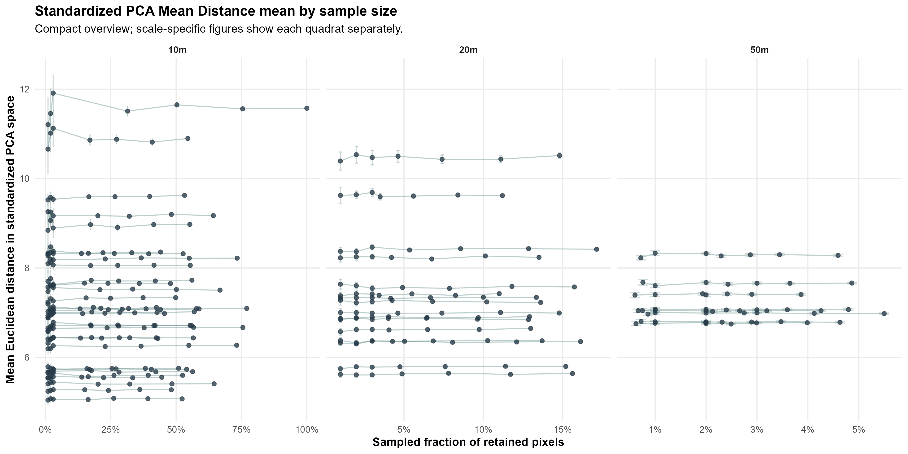

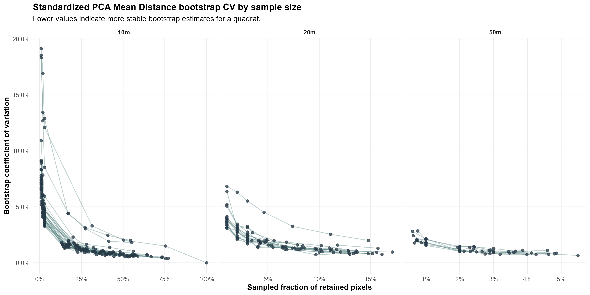

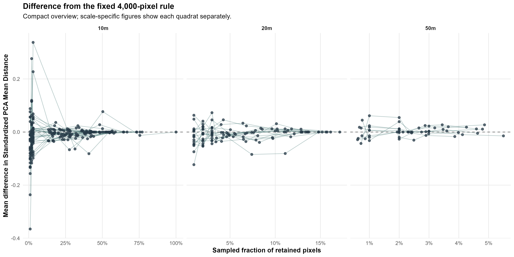

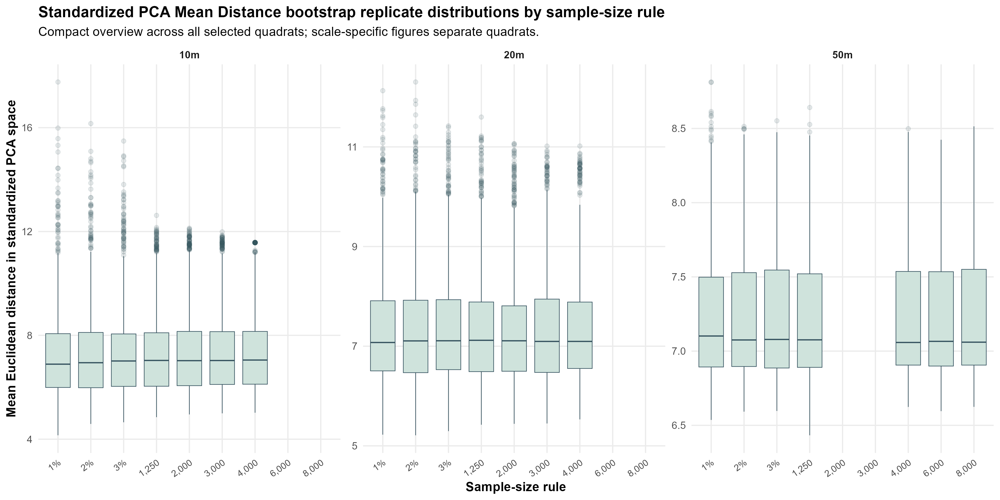

### Standardized PCA Mean Distance: 10m Scale Figures

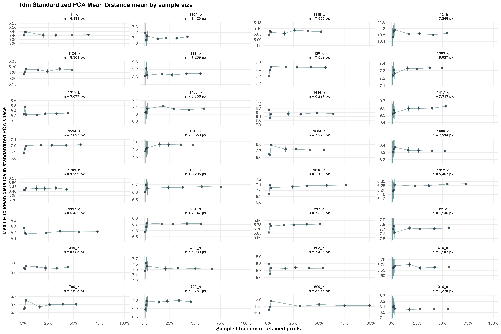

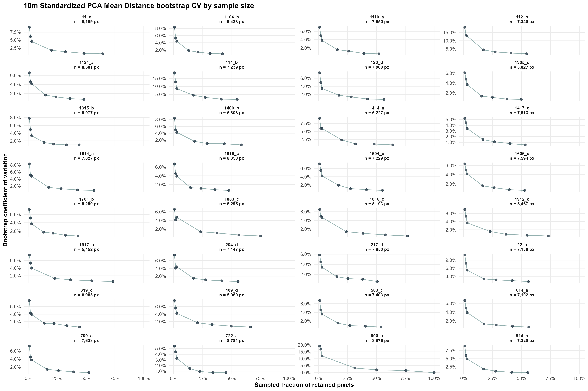

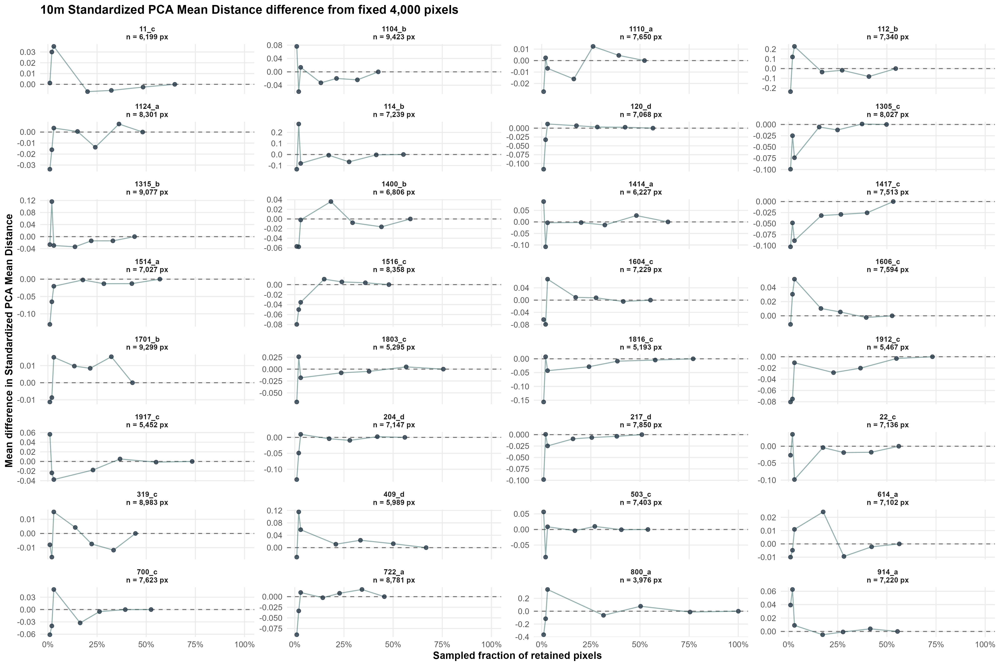

### Standardized PCA Mean Distance: 10m Distribution Charts Split By Sample Size

- [10m 1%](../figures/sample_size_effects/standardized_PCA_pca_mean_distance/distributions_by_sample_size/standardized_PCA_pca_mean_distance_replicate_distribution_10m_pct_1.png)
- [10m 2%](../figures/sample_size_effects/standardized_PCA_pca_mean_distance/distributions_by_sample_size/standardized_PCA_pca_mean_distance_replicate_distribution_10m_pct_2.png)
- [10m 3%](../figures/sample_size_effects/standardized_PCA_pca_mean_distance/distributions_by_sample_size/standardized_PCA_pca_mean_distance_replicate_distribution_10m_pct_3.png)
- [10m 1,250](../figures/sample_size_effects/standardized_PCA_pca_mean_distance/distributions_by_sample_size/standardized_PCA_pca_mean_distance_replicate_distribution_10m_fixed_1250.png)
- [10m 2,000](../figures/sample_size_effects/standardized_PCA_pca_mean_distance/distributions_by_sample_size/standardized_PCA_pca_mean_distance_replicate_distribution_10m_fixed_2000.png)
- [10m 3,000](../figures/sample_size_effects/standardized_PCA_pca_mean_distance/distributions_by_sample_size/standardized_PCA_pca_mean_distance_replicate_distribution_10m_fixed_3000.png)
- [10m 4,000](../figures/sample_size_effects/standardized_PCA_pca_mean_distance/distributions_by_sample_size/standardized_PCA_pca_mean_distance_replicate_distribution_10m_fixed_4000.png)

### Standardized PCA Mean Distance: 20m Scale Figures

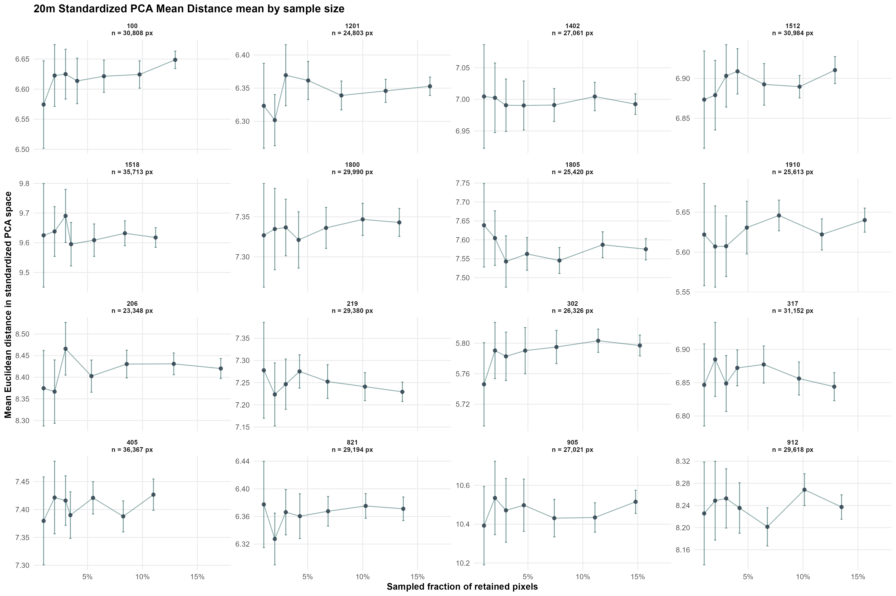

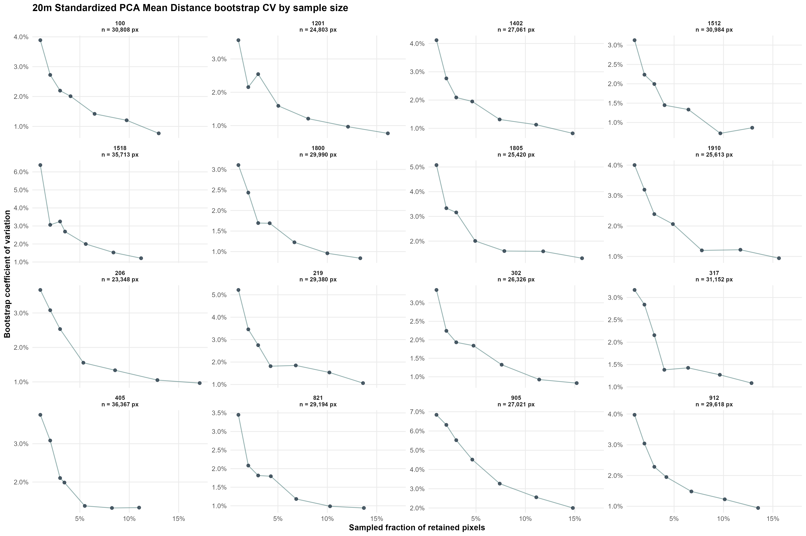

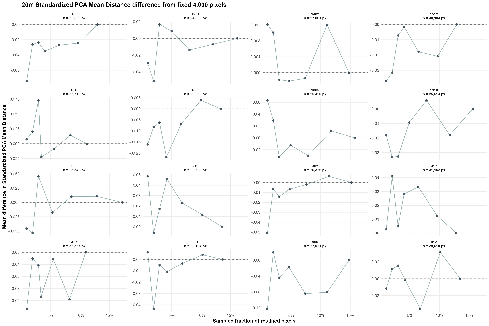

### Standardized PCA Mean Distance: 20m Distribution Charts Split By Sample Size

- [20m 1%](../figures/sample_size_effects/standardized_PCA_pca_mean_distance/distributions_by_sample_size/standardized_PCA_pca_mean_distance_replicate_distribution_20m_pct_1.png)
- [20m 2%](../figures/sample_size_effects/standardized_PCA_pca_mean_distance/distributions_by_sample_size/standardized_PCA_pca_mean_distance_replicate_distribution_20m_pct_2.png)
- [20m 3%](../figures/sample_size_effects/standardized_PCA_pca_mean_distance/distributions_by_sample_size/standardized_PCA_pca_mean_distance_replicate_distribution_20m_pct_3.png)
- [20m 1,250](../figures/sample_size_effects/standardized_PCA_pca_mean_distance/distributions_by_sample_size/standardized_PCA_pca_mean_distance_replicate_distribution_20m_fixed_1250.png)
- [20m 2,000](../figures/sample_size_effects/standardized_PCA_pca_mean_distance/distributions_by_sample_size/standardized_PCA_pca_mean_distance_replicate_distribution_20m_fixed_2000.png)
- [20m 3,000](../figures/sample_size_effects/standardized_PCA_pca_mean_distance/distributions_by_sample_size/standardized_PCA_pca_mean_distance_replicate_distribution_20m_fixed_3000.png)
- [20m 4,000](../figures/sample_size_effects/standardized_PCA_pca_mean_distance/distributions_by_sample_size/standardized_PCA_pca_mean_distance_replicate_distribution_20m_fixed_4000.png)

### Standardized PCA Mean Distance: 50m Scale Figures

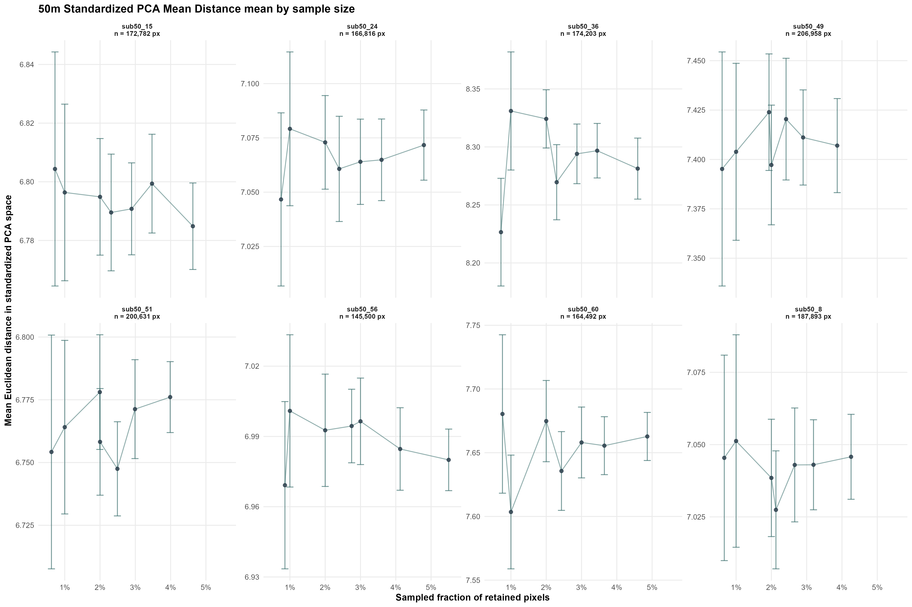

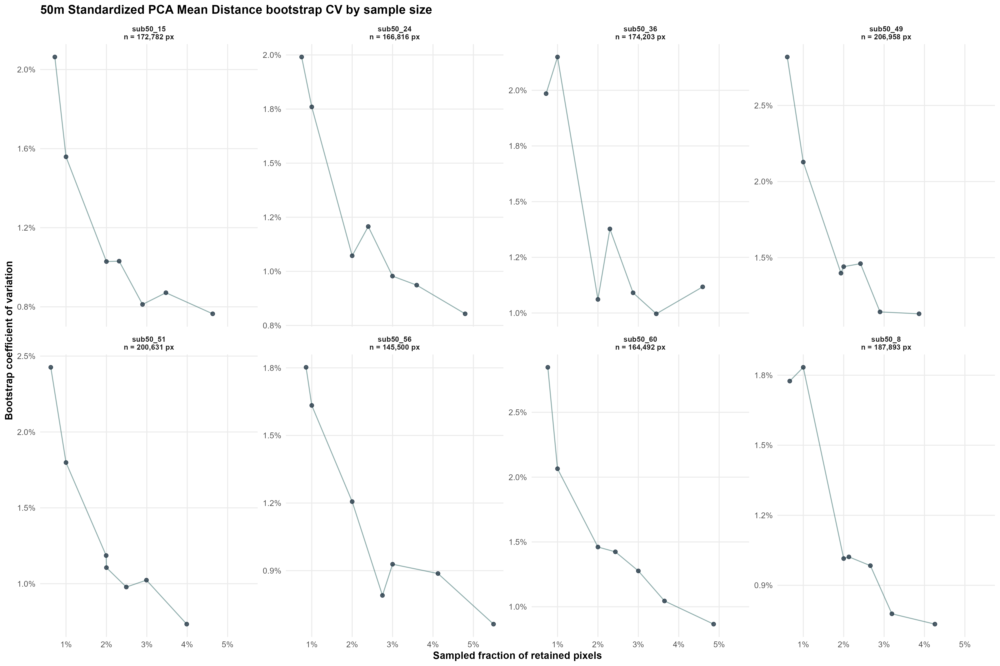

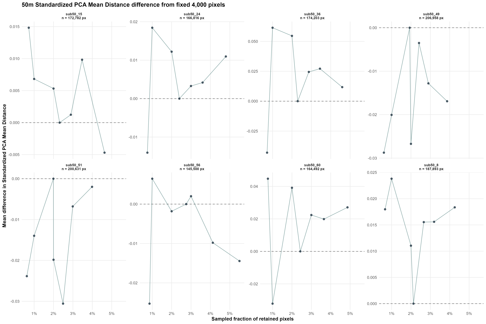

### Standardized PCA Mean Distance: 50m Distribution Charts Split By Sample Size

- [50m 1%](../figures/sample_size_effects/standardized_PCA_pca_mean_distance/distributions_by_sample_size/standardized_PCA_pca_mean_distance_replicate_distribution_50m_pct_1.png)
- [50m 2%](../figures/sample_size_effects/standardized_PCA_pca_mean_distance/distributions_by_sample_size/standardized_PCA_pca_mean_distance_replicate_distribution_50m_pct_2.png)
- [50m 3%](../figures/sample_size_effects/standardized_PCA_pca_mean_distance/distributions_by_sample_size/standardized_PCA_pca_mean_distance_replicate_distribution_50m_pct_3.png)
- [50m 1,250](../figures/sample_size_effects/standardized_PCA_pca_mean_distance/distributions_by_sample_size/standardized_PCA_pca_mean_distance_replicate_distribution_50m_fixed_1250.png)
- [50m 4,000](../figures/sample_size_effects/standardized_PCA_pca_mean_distance/distributions_by_sample_size/standardized_PCA_pca_mean_distance_replicate_distribution_50m_fixed_4000.png)
- [50m 6,000](../figures/sample_size_effects/standardized_PCA_pca_mean_distance/distributions_by_sample_size/standardized_PCA_pca_mean_distance_replicate_distribution_50m_fixed_6000.png)
- [50m 8,000](../figures/sample_size_effects/standardized_PCA_pca_mean_distance/distributions_by_sample_size/standardized_PCA_pca_mean_distance_replicate_distribution_50m_fixed_8000.png)

Output tables:

- `reports/tables/sample_size_effects/standardized_PCA_pca_mean_distance/standardized_PCA_pca_mean_distance_sample_size_design.csv`
- `reports/tables/sample_size_effects/standardized_PCA_pca_mean_distance/standardized_PCA_pca_mean_distance_sample_size_boot_long.csv`
- `reports/tables/sample_size_effects/standardized_PCA_pca_mean_distance/standardized_PCA_pca_mean_distance_sample_size_summary.csv`

## Standardized Spectral Rao's Q

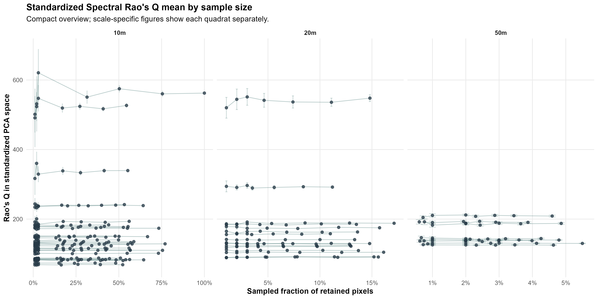

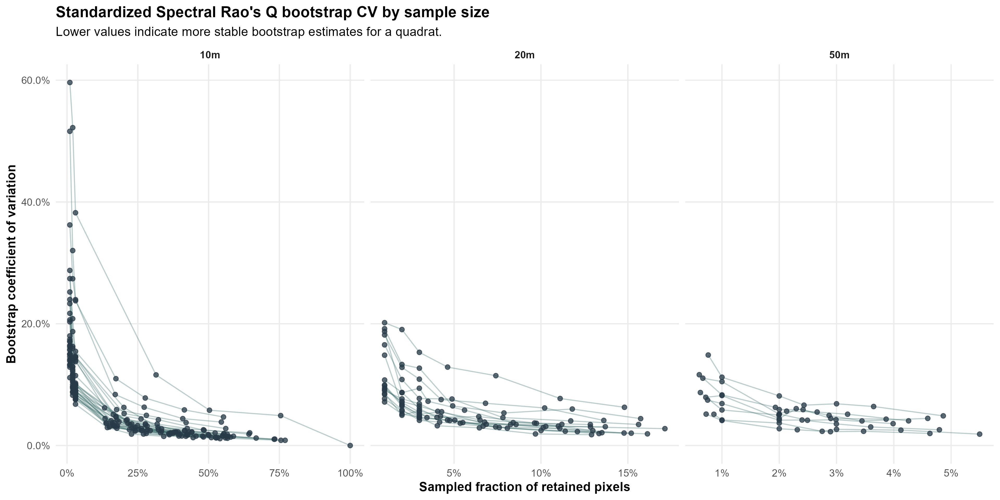

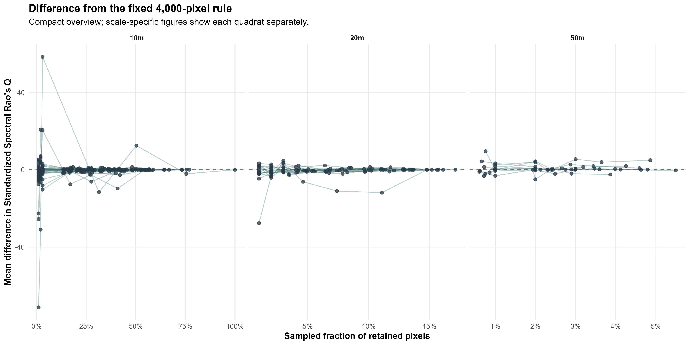

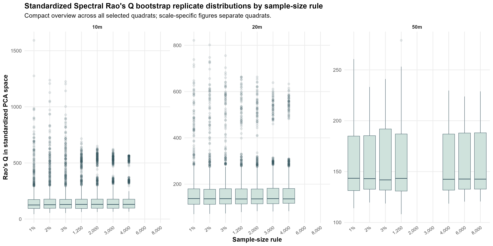

### Standardized Spectral Rao's Q: 10m Scale Figures

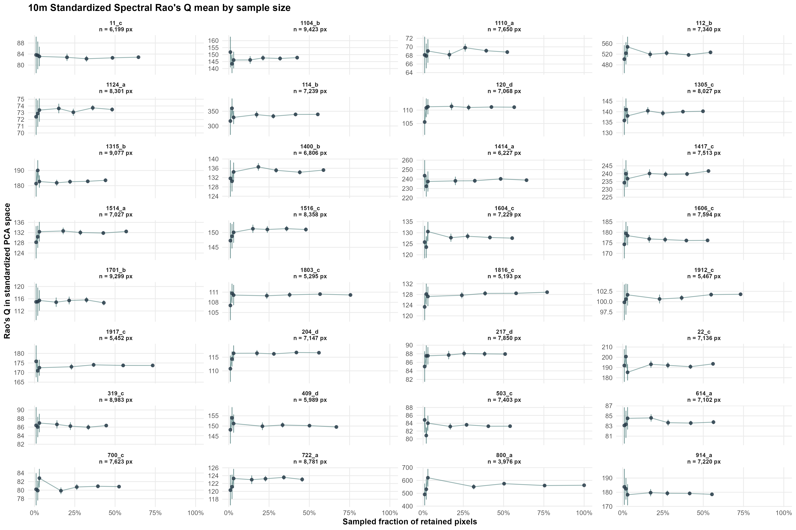

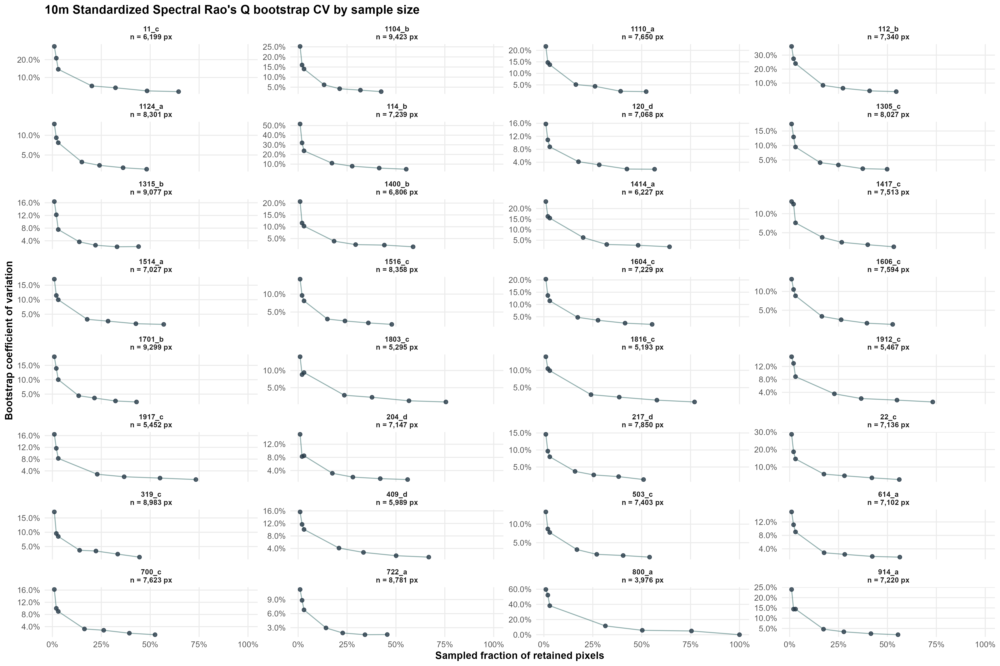

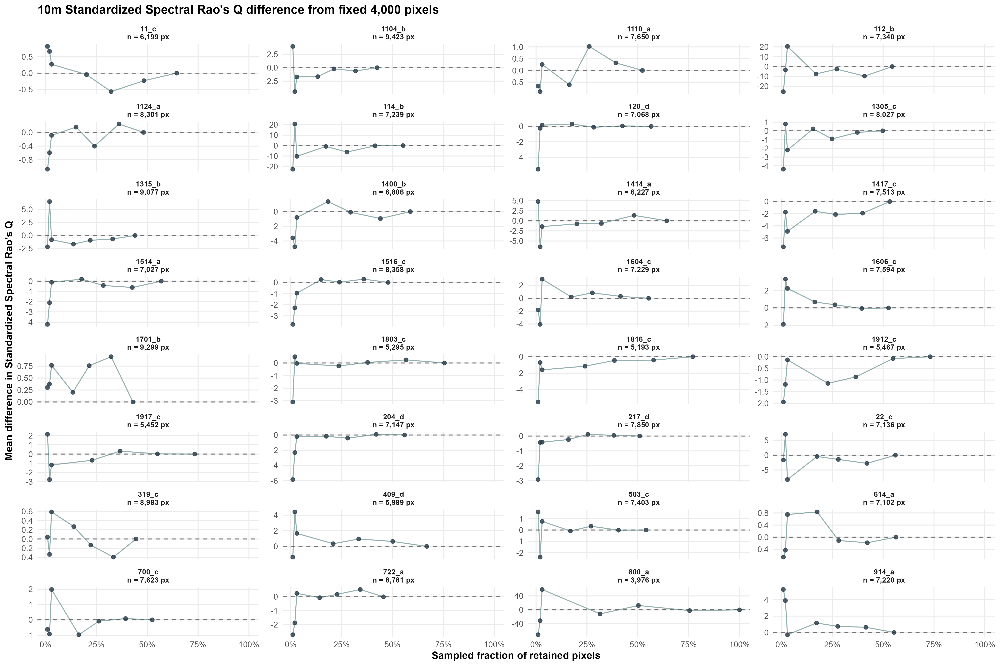

### Standardized Spectral Rao's Q: 10m Distribution Charts Split By Sample Size

- [10m 1%](../figures/sample_size_effects/standardized_PCA_spectral_rao_q/distributions_by_sample_size/standardized_PCA_spectral_rao_q_replicate_distribution_10m_pct_1.png)
- [10m 2%](../figures/sample_size_effects/standardized_PCA_spectral_rao_q/distributions_by_sample_size/standardized_PCA_spectral_rao_q_replicate_distribution_10m_pct_2.png)
- [10m 3%](../figures/sample_size_effects/standardized_PCA_spectral_rao_q/distributions_by_sample_size/standardized_PCA_spectral_rao_q_replicate_distribution_10m_pct_3.png)
- [10m 1,250](../figures/sample_size_effects/standardized_PCA_spectral_rao_q/distributions_by_sample_size/standardized_PCA_spectral_rao_q_replicate_distribution_10m_fixed_1250.png)
- [10m 2,000](../figures/sample_size_effects/standardized_PCA_spectral_rao_q/distributions_by_sample_size/standardized_PCA_spectral_rao_q_replicate_distribution_10m_fixed_2000.png)
- [10m 3,000](../figures/sample_size_effects/standardized_PCA_spectral_rao_q/distributions_by_sample_size/standardized_PCA_spectral_rao_q_replicate_distribution_10m_fixed_3000.png)
- [10m 4,000](../figures/sample_size_effects/standardized_PCA_spectral_rao_q/distributions_by_sample_size/standardized_PCA_spectral_rao_q_replicate_distribution_10m_fixed_4000.png)

### Standardized Spectral Rao's Q: 20m Scale Figures

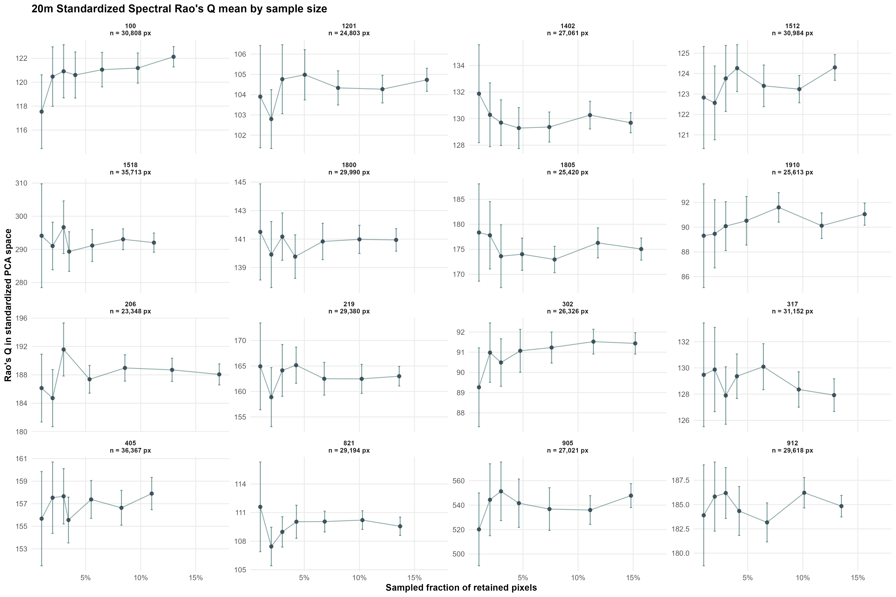

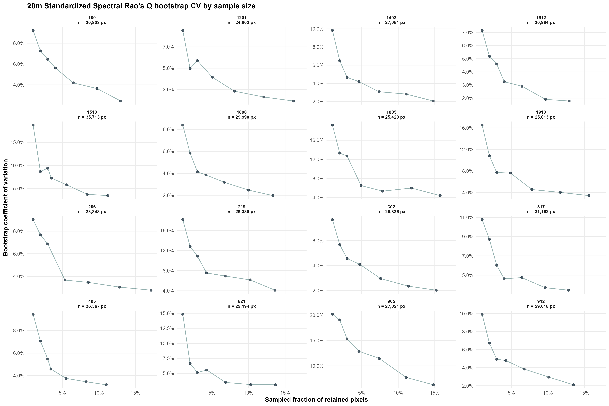

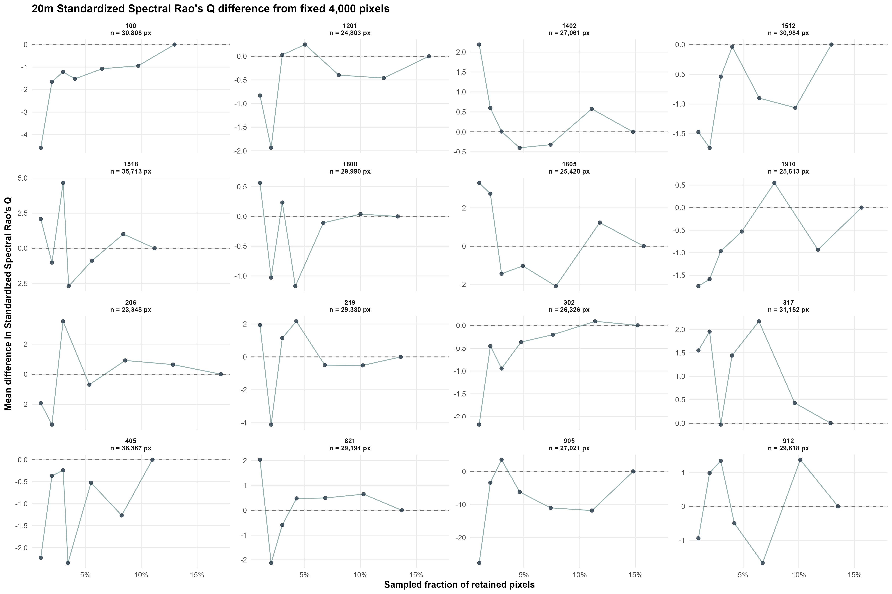

### Standardized Spectral Rao's Q: 20m Distribution Charts Split By Sample Size

- [20m 1%](../figures/sample_size_effects/standardized_PCA_spectral_rao_q/distributions_by_sample_size/standardized_PCA_spectral_rao_q_replicate_distribution_20m_pct_1.png)
- [20m 2%](../figures/sample_size_effects/standardized_PCA_spectral_rao_q/distributions_by_sample_size/standardized_PCA_spectral_rao_q_replicate_distribution_20m_pct_2.png)
- [20m 3%](../figures/sample_size_effects/standardized_PCA_spectral_rao_q/distributions_by_sample_size/standardized_PCA_spectral_rao_q_replicate_distribution_20m_pct_3.png)
- [20m 1,250](../figures/sample_size_effects/standardized_PCA_spectral_rao_q/distributions_by_sample_size/standardized_PCA_spectral_rao_q_replicate_distribution_20m_fixed_1250.png)
- [20m 2,000](../figures/sample_size_effects/standardized_PCA_spectral_rao_q/distributions_by_sample_size/standardized_PCA_spectral_rao_q_replicate_distribution_20m_fixed_2000.png)
- [20m 3,000](../figures/sample_size_effects/standardized_PCA_spectral_rao_q/distributions_by_sample_size/standardized_PCA_spectral_rao_q_replicate_distribution_20m_fixed_3000.png)
- [20m 4,000](../figures/sample_size_effects/standardized_PCA_spectral_rao_q/distributions_by_sample_size/standardized_PCA_spectral_rao_q_replicate_distribution_20m_fixed_4000.png)

### Standardized Spectral Rao's Q: 50m Scale Figures

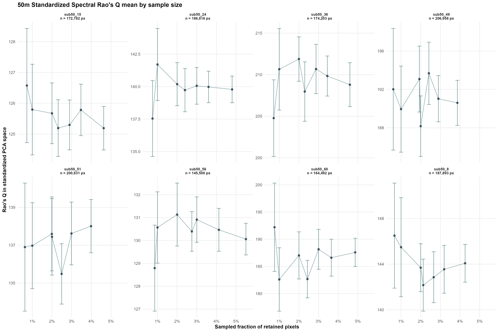

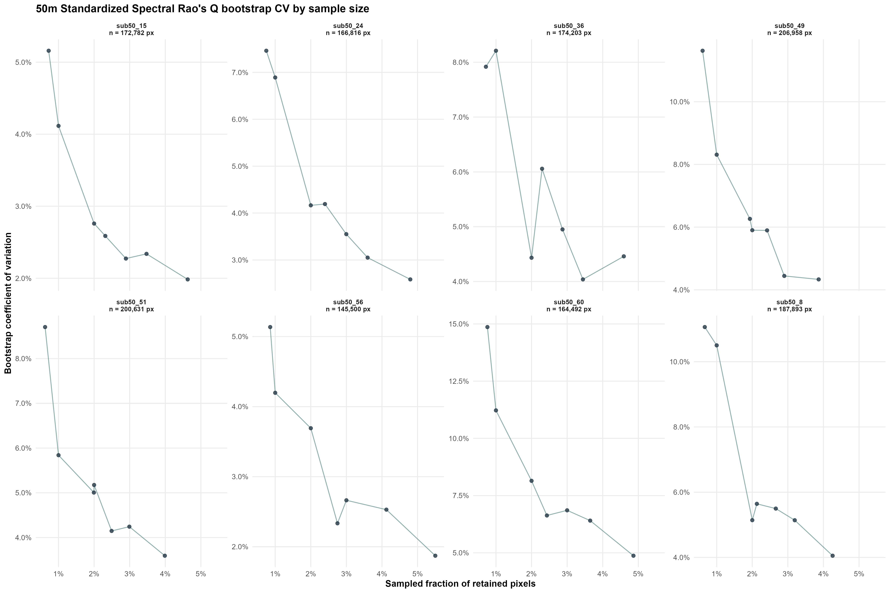

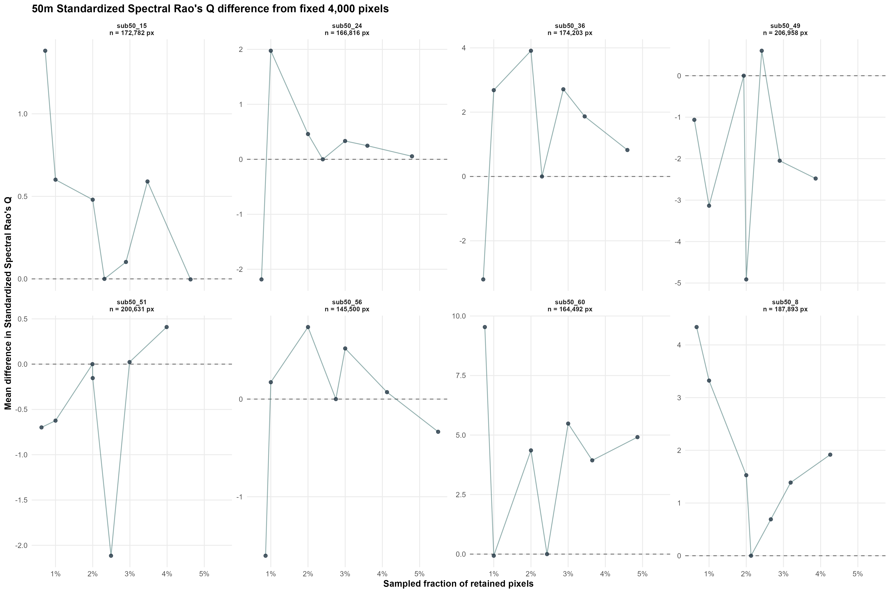

### Standardized Spectral Rao's Q: 50m Distribution Charts Split By Sample Size

- [50m 1%](../figures/sample_size_effects/standardized_PCA_spectral_rao_q/distributions_by_sample_size/standardized_PCA_spectral_rao_q_replicate_distribution_50m_pct_1.png)
- [50m 2%](../figures/sample_size_effects/standardized_PCA_spectral_rao_q/distributions_by_sample_size/standardized_PCA_spectral_rao_q_replicate_distribution_50m_pct_2.png)
- [50m 3%](../figures/sample_size_effects/standardized_PCA_spectral_rao_q/distributions_by_sample_size/standardized_PCA_spectral_rao_q_replicate_distribution_50m_pct_3.png)
- [50m 1,250](../figures/sample_size_effects/standardized_PCA_spectral_rao_q/distributions_by_sample_size/standardized_PCA_spectral_rao_q_replicate_distribution_50m_fixed_1250.png)
- [50m 4,000](../figures/sample_size_effects/standardized_PCA_spectral_rao_q/distributions_by_sample_size/standardized_PCA_spectral_rao_q_replicate_distribution_50m_fixed_4000.png)
- [50m 6,000](../figures/sample_size_effects/standardized_PCA_spectral_rao_q/distributions_by_sample_size/standardized_PCA_spectral_rao_q_replicate_distribution_50m_fixed_6000.png)
- [50m 8,000](../figures/sample_size_effects/standardized_PCA_spectral_rao_q/distributions_by_sample_size/standardized_PCA_spectral_rao_q_replicate_distribution_50m_fixed_8000.png)

Output tables:

- `reports/tables/sample_size_effects/standardized_PCA_spectral_rao_q/standardized_PCA_spectral_rao_q_sample_size_design.csv`
- `reports/tables/sample_size_effects/standardized_PCA_spectral_rao_q/standardized_PCA_spectral_rao_q_sample_size_boot_long.csv`
- `reports/tables/sample_size_effects/standardized_PCA_spectral_rao_q/standardized_PCA_spectral_rao_q_sample_size_summary.csv`

## Standardized Alpha-Hull Area

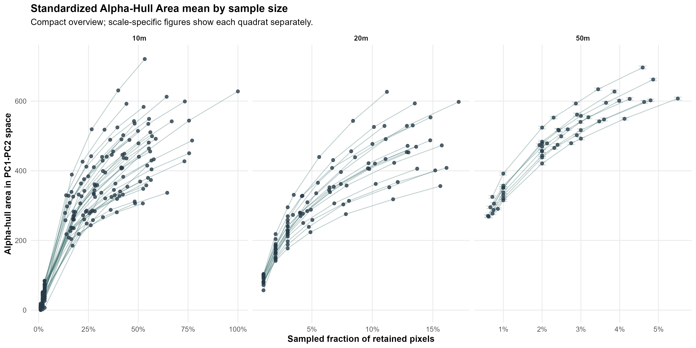

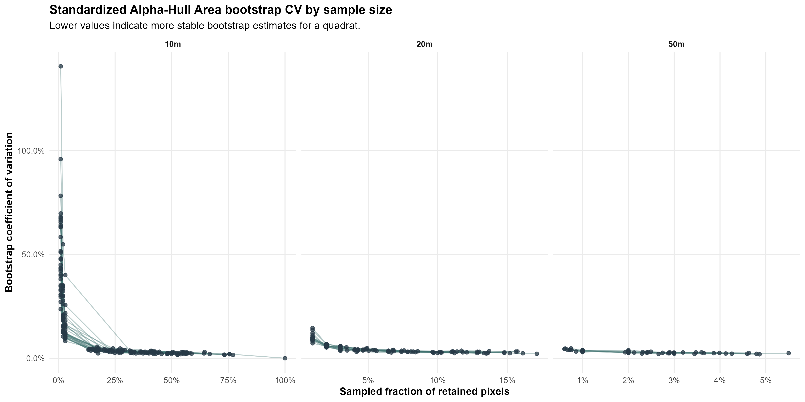

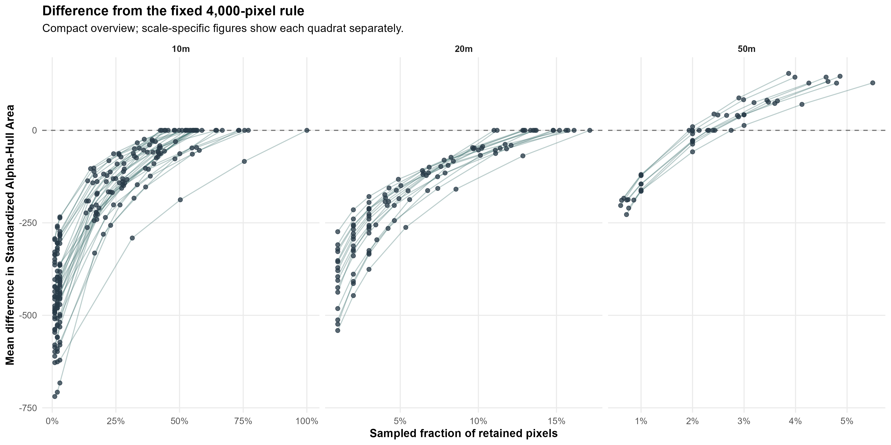

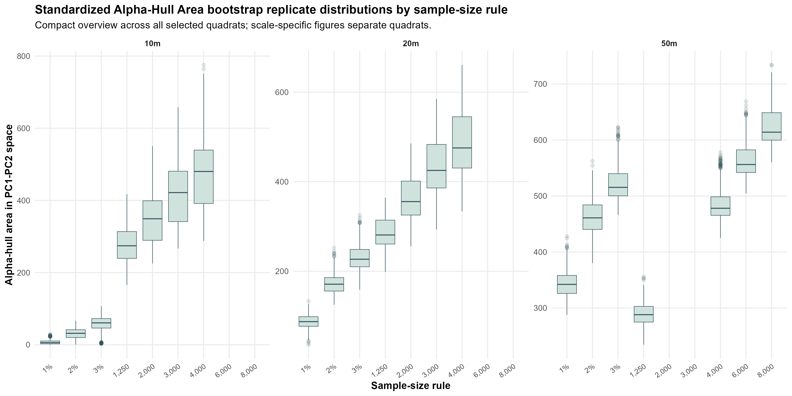

### Standardized Alpha-Hull Area: 10m Scale Figures

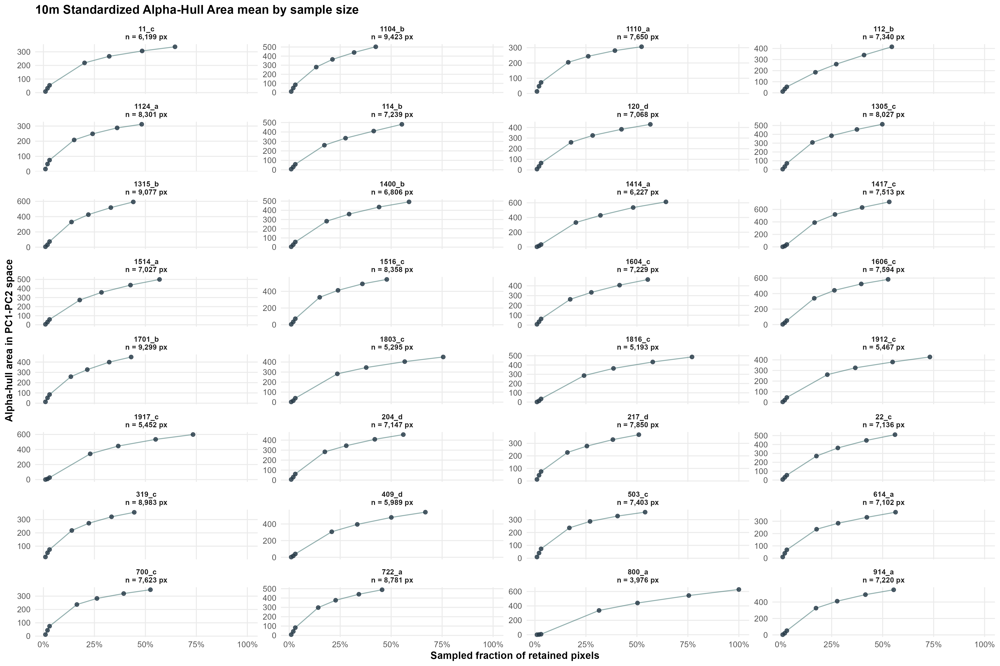

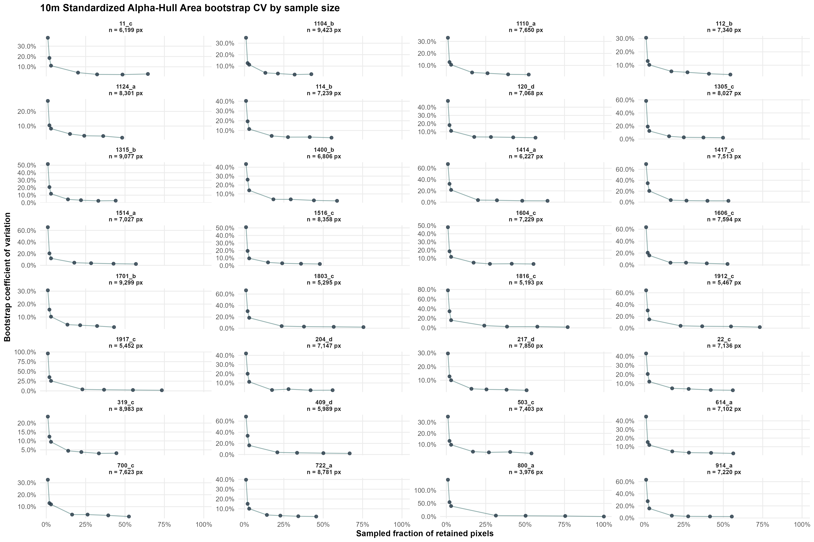

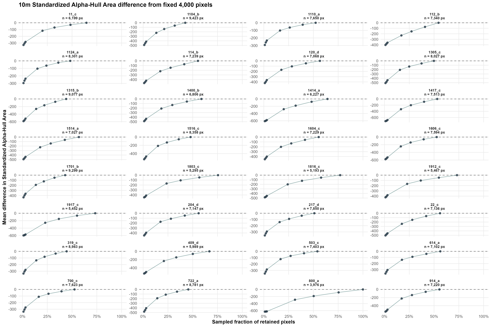

### Standardized Alpha-Hull Area: 10m Distribution Charts Split By Sample Size

- [10m 1%](../figures/sample_size_effects/standardized_PCA_alpha_hull_area/distributions_by_sample_size/standardized_PCA_alpha_hull_area_replicate_distribution_10m_pct_1.png)
- [10m 2%](../figures/sample_size_effects/standardized_PCA_alpha_hull_area/distributions_by_sample_size/standardized_PCA_alpha_hull_area_replicate_distribution_10m_pct_2.png)
- [10m 3%](../figures/sample_size_effects/standardized_PCA_alpha_hull_area/distributions_by_sample_size/standardized_PCA_alpha_hull_area_replicate_distribution_10m_pct_3.png)
- [10m 1,250](../figures/sample_size_effects/standardized_PCA_alpha_hull_area/distributions_by_sample_size/standardized_PCA_alpha_hull_area_replicate_distribution_10m_fixed_1250.png)
- [10m 2,000](../figures/sample_size_effects/standardized_PCA_alpha_hull_area/distributions_by_sample_size/standardized_PCA_alpha_hull_area_replicate_distribution_10m_fixed_2000.png)
- [10m 3,000](../figures/sample_size_effects/standardized_PCA_alpha_hull_area/distributions_by_sample_size/standardized_PCA_alpha_hull_area_replicate_distribution_10m_fixed_3000.png)
- [10m 4,000](../figures/sample_size_effects/standardized_PCA_alpha_hull_area/distributions_by_sample_size/standardized_PCA_alpha_hull_area_replicate_distribution_10m_fixed_4000.png)

### Standardized Alpha-Hull Area: 20m Scale Figures

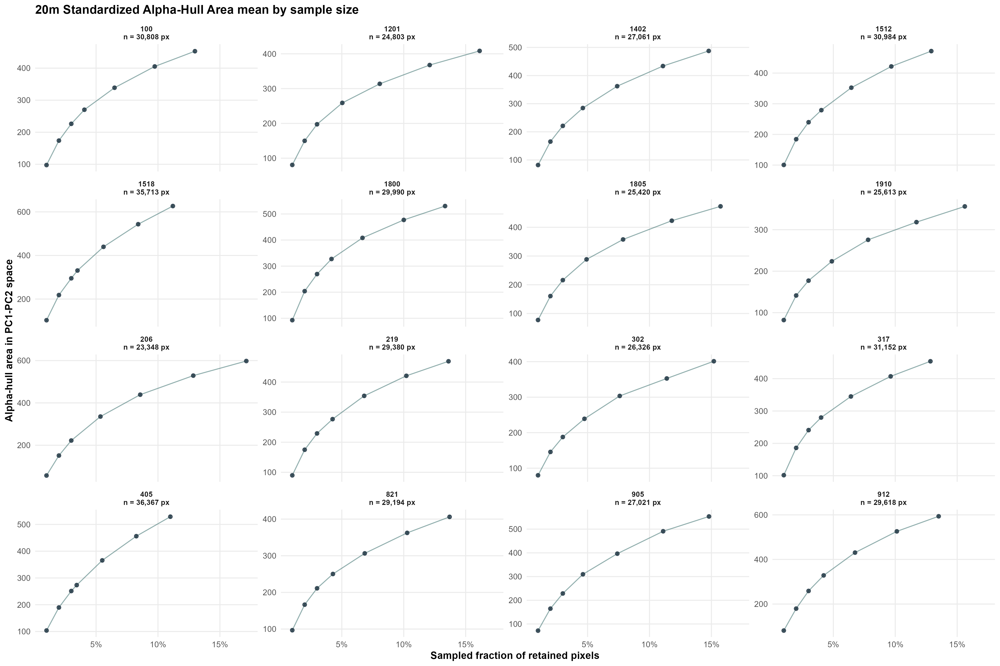

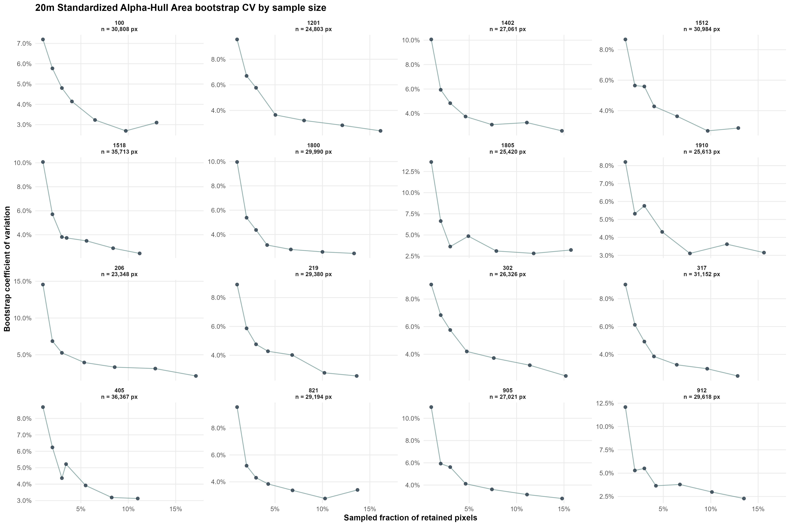

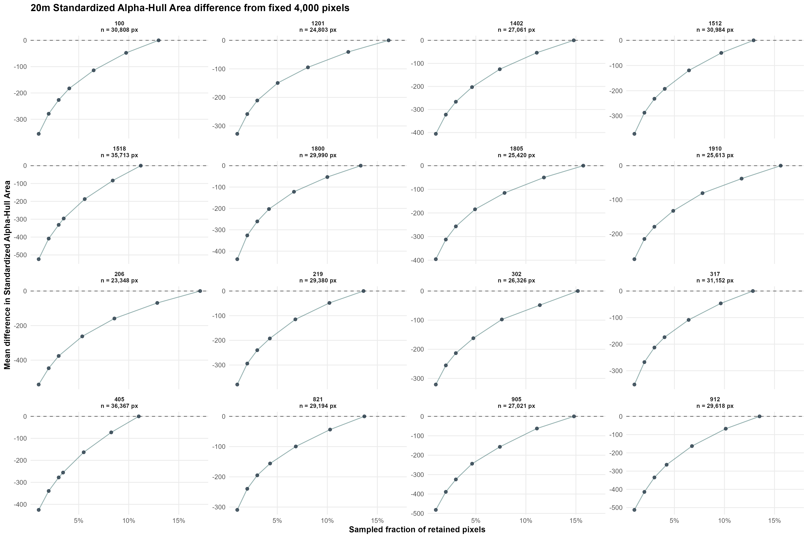

### Standardized Alpha-Hull Area: 20m Distribution Charts Split By Sample Size

- [20m 1%](../figures/sample_size_effects/standardized_PCA_alpha_hull_area/distributions_by_sample_size/standardized_PCA_alpha_hull_area_replicate_distribution_20m_pct_1.png)
- [20m 2%](../figures/sample_size_effects/standardized_PCA_alpha_hull_area/distributions_by_sample_size/standardized_PCA_alpha_hull_area_replicate_distribution_20m_pct_2.png)
- [20m 3%](../figures/sample_size_effects/standardized_PCA_alpha_hull_area/distributions_by_sample_size/standardized_PCA_alpha_hull_area_replicate_distribution_20m_pct_3.png)
- [20m 1,250](../figures/sample_size_effects/standardized_PCA_alpha_hull_area/distributions_by_sample_size/standardized_PCA_alpha_hull_area_replicate_distribution_20m_fixed_1250.png)
- [20m 2,000](../figures/sample_size_effects/standardized_PCA_alpha_hull_area/distributions_by_sample_size/standardized_PCA_alpha_hull_area_replicate_distribution_20m_fixed_2000.png)
- [20m 3,000](../figures/sample_size_effects/standardized_PCA_alpha_hull_area/distributions_by_sample_size/standardized_PCA_alpha_hull_area_replicate_distribution_20m_fixed_3000.png)
- [20m 4,000](../figures/sample_size_effects/standardized_PCA_alpha_hull_area/distributions_by_sample_size/standardized_PCA_alpha_hull_area_replicate_distribution_20m_fixed_4000.png)

### Standardized Alpha-Hull Area: 50m Scale Figures

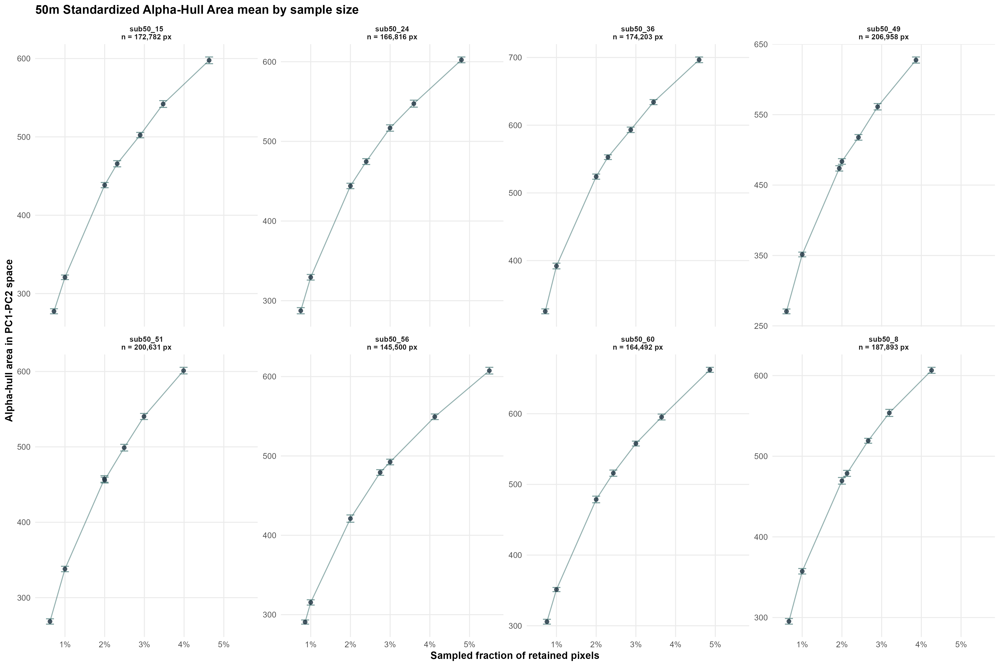

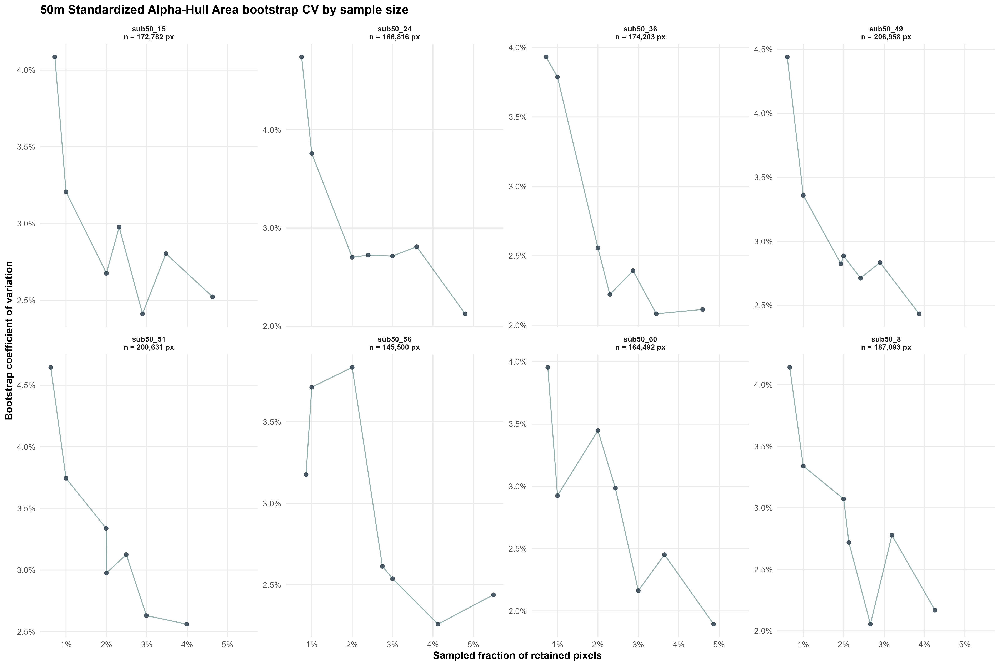

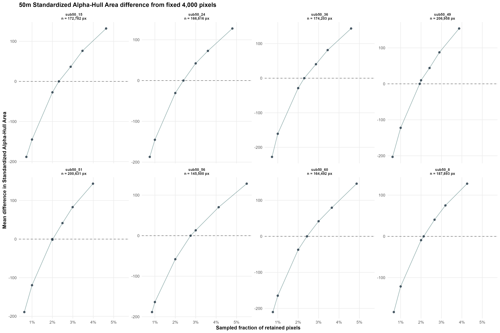

### Standardized Alpha-Hull Area: 50m Distribution Charts Split By Sample Size

- [50m 1%](../figures/sample_size_effects/standardized_PCA_alpha_hull_area/distributions_by_sample_size/standardized_PCA_alpha_hull_area_replicate_distribution_50m_pct_1.png)
- [50m 2%](../figures/sample_size_effects/standardized_PCA_alpha_hull_area/distributions_by_sample_size/standardized_PCA_alpha_hull_area_replicate_distribution_50m_pct_2.png)
- [50m 3%](../figures/sample_size_effects/standardized_PCA_alpha_hull_area/distributions_by_sample_size/standardized_PCA_alpha_hull_area_replicate_distribution_50m_pct_3.png)
- [50m 1,250](../figures/sample_size_effects/standardized_PCA_alpha_hull_area/distributions_by_sample_size/standardized_PCA_alpha_hull_area_replicate_distribution_50m_fixed_1250.png)
- [50m 4,000](../figures/sample_size_effects/standardized_PCA_alpha_hull_area/distributions_by_sample_size/standardized_PCA_alpha_hull_area_replicate_distribution_50m_fixed_4000.png)
- [50m 6,000](../figures/sample_size_effects/standardized_PCA_alpha_hull_area/distributions_by_sample_size/standardized_PCA_alpha_hull_area_replicate_distribution_50m_fixed_6000.png)
- [50m 8,000](../figures/sample_size_effects/standardized_PCA_alpha_hull_area/distributions_by_sample_size/standardized_PCA_alpha_hull_area_replicate_distribution_50m_fixed_8000.png)

Output tables:

- `reports/tables/sample_size_effects/standardized_PCA_alpha_hull_area/standardized_PCA_alpha_hull_area_sample_size_design.csv`
- `reports/tables/sample_size_effects/standardized_PCA_alpha_hull_area/standardized_PCA_alpha_hull_area_sample_size_boot_long.csv`
- `reports/tables/sample_size_effects/standardized_PCA_alpha_hull_area/standardized_PCA_alpha_hull_area_sample_size_summary.csv`

